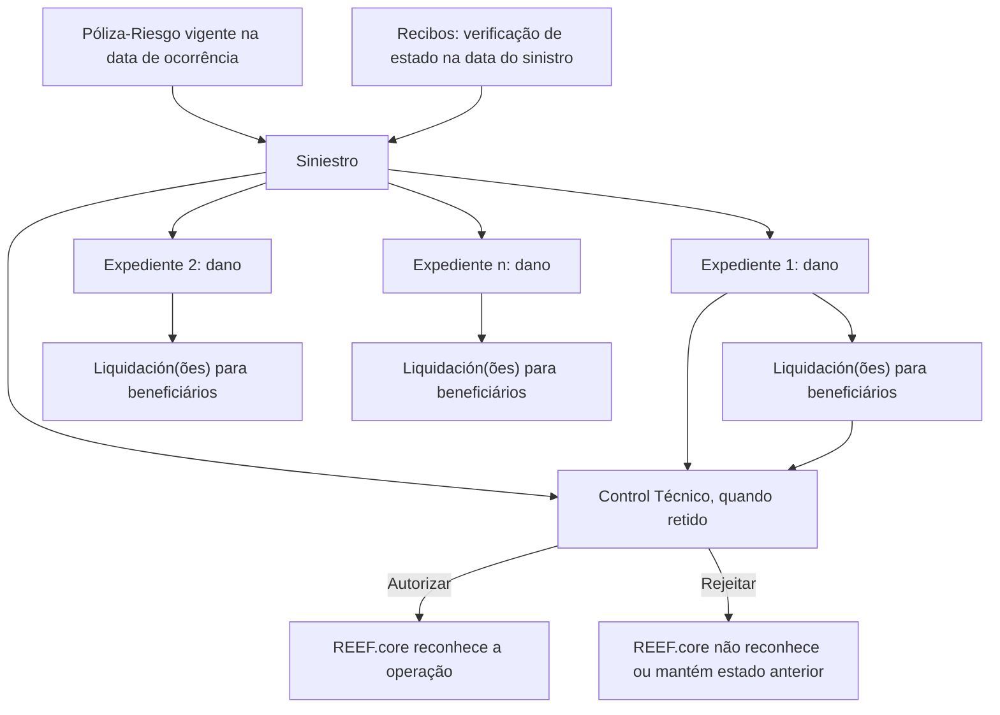
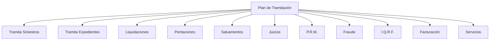
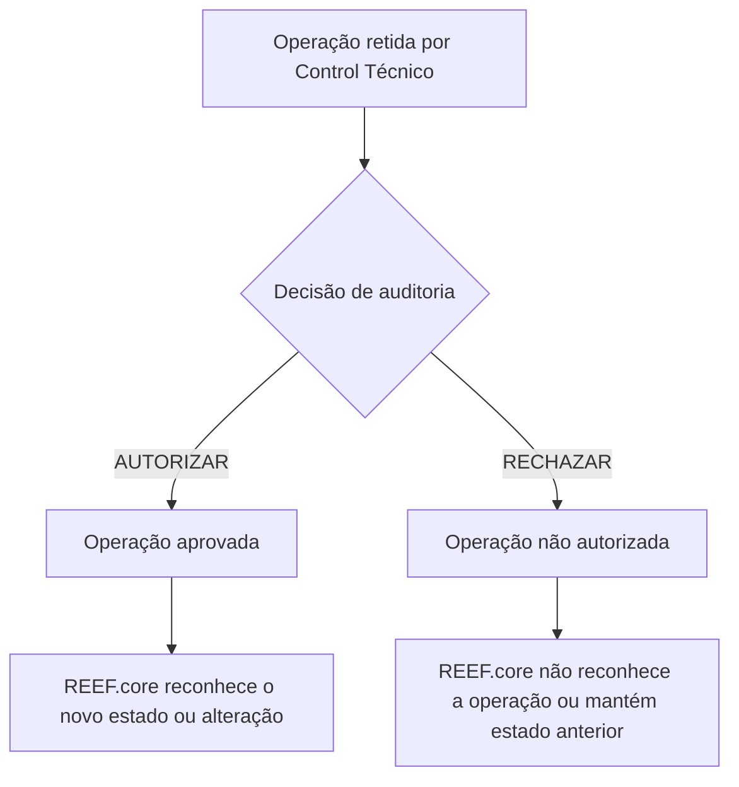

# Módulo de Siniestros do REEF.core: Gestão de Sinistros, Expedientes, Liquidações e Controle Técnico

## 1. Metadados do Documento
- **Arquivo de Origem:** Não identificado no conteúdo extraído
- **Tipo de Documento:** Apresentação Executiva / Manual Funcional
- **Domínio / Sistema:** Módulo de Siniestros (Sinistros) do REEF.core
- **Público-Alvo:** Tramitadores, supervisores, chefes de sinistros, colaboradores, operação, analistas funcionais e equipes de arquitetura
- **Data/Versão Identificada:** Não identificada

---

## 2. Resumo Executivo & Contexto de Negócio

O documento apresenta o módulo de **Siniestros**, responsável por realizar as gestões necessárias quando um risco segurado é afetado. O escopo funcional cobre o ciclo desde o conhecimento da ocorrência até o encerramento, incluindo o registro do sinistro, a abertura de expedientes por dano e a geração de liquidações para pagamento ou cobrança.

O modelo conceitual distingue três entidades principais: **Siniestro**, que representa o fato ocorrido que afeta um risco segurado; **Expediente**, que representa cada dano causado em consequência do sinistro; e **Liquidación**, que é o meio utilizado para pagar ou cobrar valores de afetados e fornecedores envolvidos em um expediente. Um único sinistro pode originar múltiplos expedientes, e cada expediente pode demandar múltiplas liquidações conforme os beneficiários envolvidos.

O módulo é configurável por catálogos e suporta múltiplos negócios de seguros, incluindo Automóvil, Salud, Vida, Transporte e Diversos. O documento também indica suporte a coaseguro cedido, coaseguro aceito e ausência de coaseguro, além de liberdade de definição para detalhes do sinistro, do expediente, das coberturas e dos detalhes econômicos.

A operação é orientada por perfis, especialmente tramitadores, supervisores e colaboradores como peritos e advogados. O **Plan de Tramitación** estrutura ferramentas para organização do trabalho, acompanhamento de pendências, auditoria e controle de prazos. Há também operações de **Control Técnico**, que autorizam ou rejeitam ações retidas, definindo se alterações passam a ser reconhecidas pelo restante do REEF.core.

---

## 3. Arquitetura, Componentes & Tecnologias Envolvidas

### Componentes e módulos identificados

| Componente / Módulo | Função descrita |
| :--- | :--- |
| Módulo de Siniestros | Gerencia as operações necessárias quando um risco segurado é afetado, do conhecimento da ocorrência ao encerramento. |
| Siniestros | Registra o fato que afeta um risco segurado e as informações recebidas por canais como telefone e páginas web. |
| Expedientes | Representam cada dano causado como consequência de um sinistro. |
| Liquidaciones | Permitem pagar ou cobrar afetados e fornecedores envolvidos em expedientes. |
| Póliza-Riesgo | Pré-requisito para gerar um sinistro: deve existir uma apólice-risco contratada e vigente na data de ocorrência. |
| Recibos | São consultados pelo módulo de sinistros na data do sinistro; o comportamento pode variar conforme o ramo. |
| Reaseguro | Aparece como componente relacionado no fluxo visual de entradas e saídas. O documento não detalha seu funcionamento. |
| Plan de Tramitación | Gerencia submódulos e fundamenta ferramentas operacionais para tramitadores, colaboradores, supervisores e chefes de sinistros. |
| Peritaciones | Submódulo gerenciado pelo Plan de Tramitación. |
| Salvamentos | Submódulo gerenciado pelo Plan de Tramitación. |
| Juicios | Submódulo gerenciado pelo Plan de Tramitación. |
| P.R.M. | Submódulo gerenciado pelo Plan de Tramitación; o documento também menciona Plan de Renta Mensual para acidentes laborais. |
| Fraude | Submódulo gerenciado pelo Plan de Tramitación. |
| I.Q.R.F. | Módulo listado entre os módulos relacionados. A sigla não é expandida no conteúdo. |
| Facturación | Módulo relacionado e sujeito a operações de autorização e rejeição por controle técnico. |
| Servicios | Módulo listado entre os módulos relacionados, sem detalhamento funcional adicional. |
| Reef.core | Sistema que passa a reconhecer, ou deixa de reconhecer, operações de sinistros, expedientes, liquidações, faturamento e planos de renda conforme a decisão de controle técnico. |
| Control Técnico | Conjunto de operações de autorização e rejeição de controles técnicos de auditoria. |

### Relação funcional entre as entidades principais



### Submódulos gerenciados pelo Plan de Tramitación



> **Nota de Análise:** O documento descreve relações funcionais e módulos, mas não informa protocolos de integração, APIs, métodos HTTP, contratos JSON, tecnologias de infraestrutura, URLs, versões, portas ou topologia física/deploy.

---

## 4. Regras de Negócio, Especificações Funcionais & Processos

### Conceitos fundamentais

1. **Siniestro**
   - É o fato que ocorre quando um risco segurado pela companhia é afetado.
   - Exemplos apresentados:
     - Vivienda: casa inundada ou incendiada.
     - Vehículo: veículo acidentado ou roubado.
     - Persona: operação de uma pessoa ou morte de uma pessoa.
     - Mercancía: mercadoria roubada ou incendiada.
   - O sinistro armazena informações recebidas por diferentes canais, como telefone e páginas web.
   - Entre as informações do sinistro estão:
     - Apólice e risco afetado.
     - Datas de ocorrência.
     - Relato do sinistro.
     - Local do sinistro.

2. **Expediente**
   - Cada expediente representa um dano ocasionado como consequência de um sinistro.
   - Um sinistro pode gerar um ou mais expedientes.
   - Cada expediente possui informações próprias, incluindo dados e informações econômicas.
   - Exemplo: em um acidente em que o segurado colide com outro veículo e sofre lesão, podem ser abertos:
     - Expediente de daños materiales al vehículo asegurado.
     - Expediente de daños materiales al vehículo contrario.
     - Expediente de lesiones ocupante vehículo asegurado.

3. **Liquidación**
   - É o meio para pagar ou cobrar os afetados e os fornecedores que intervieram em um expediente.
   - Devem ser geradas tantas liquidações quantos forem os beneficiários envolvidos no expediente.

### Configurabilidade e características do módulo

| Regra / Característica | Especificação |
| :--- | :--- |
| Múltiplos tipos de negócio | O módulo permite trabalhar com seguros de Automóvil, Salud, Vida, Transporte, Diversos e outros. |
| Configuração por catálogos | Catálogos definem o comportamento e as características da aplicação de sinistros para cada produto. |
| Coaseguro | São tratados coaseguro cedido, coaseguro aceito ou ausência de coaseguro. |
| Relação sinistro-expediente | Um sinistro pode conter mais de um dano; cada dano corresponde a um expediente. |
| Detalhe do sinistro | A definição das informações exigidas para o detalhe do sinistro é aberta. |
| Detalhe do expediente | A definição de informações sobre o que ou quem foi afetado, localização e danos produzidos é livre. |
| Coberturas | Há livre definição das coberturas afetadas por um expediente. |
| Detalhe econômico | Há livre definição do detalhe econômico utilizado para pagar profissionais ou afetados. |
| Retenção para aprovação | Sinistros, expedientes e ordens de pagamento podem ser retidos para autorização ou rejeição posterior. |
| Interfaces operacionais | Os módulos podem ser operados pelas telas fornecidas, por outros tipos de telas ou sem telas, em diferido, por processo de carga massiva. |
| Perfis e especialização | O módulo requer definição dos perfis que podem trabalhar nele e suas especializações. |

### Perfis operacionais

| Perfil | Responsabilidade descrita |
| :--- | :--- |
| Tramitador | Responsável por realizar todas as gestões necessárias em um expediente. |
| Supervisor | Responsável pelos tramitadores. |
| Colaborador | Perfil de colaborador, como perito ou advogado. |
| Jefe de supervisores / Jefe de siniestros | Responsável pela gestão dos supervisores e pelo acompanhamento agregado do trabalho. |

### Entradas e saídas

1. Para gerar um sinistro, deve existir uma **Póliza-Riesgo** contratada pela empresa e vigente na data de ocorrência do sinistro.
2. O módulo de sinistros verifica o estado dos **Recibos** na data do sinistro.
3. O comportamento relacionado aos recibos pode variar conforme o ramo.
4. O fluxo visual do documento relaciona Póliza-Riesgo, Recibos, Módulo de Siniestros, Siniestros, Expedientes, Liquidaciones e Reaseguro.

### Operações do Menu do Tramitador e Colaborador

| Operação | Resultado apresentado |
| :--- | :--- |
| CONSULTAR avisos pendientes detalle | Mostra todos os expedientes com o aviso indicado pendente, conforme condições filtradas pelo tramitador. |
| CONSULTAR tramites pendientes detalle | Mostra todos os expedientes com o trâmite indicado pendente, conforme condições filtradas pelo tramitador. |
| CONSULTAR cartas detalle | Mostra todos os expedientes para os quais foi gerada a carta indicada, conforme condições filtradas pelo tramitador. |
| CONSULTAR expedientes sin actividad detalle | Mostra todos os expedientes nos quais não foi realizada nenhuma operação, conforme condições filtradas pelo tramitador. |
| CONSULTAR expedientes asignados detalle | Mostra todos os expedientes do tramitador com estado como pendiente, en juicio ou retenido por c.t., conforme condições filtradas. |
| CONSULTAR estado control tramites detalle | Mostra todos os expedientes com data de controle definida, correspondente ao tempo máximo para realização, no estado indicado e conforme condições filtradas pelo tramitador. |

### Operações do Menu Supervisor e Jefe de Siniestros

O menu é baseado no Plan de Tramitación e tem como objetivo principal controlar a gestão dos tramitadores. Para responsáveis ou chefes de sinistros, o objetivo é controlar a gestão dos supervisores.

- Para o **supervisor**, a ferramenta mostra os tramitadores e a quantidade de expedientes que cumprem as condições.
- Para o **jefe de siniestros**, a ferramenta mostra os supervisores e a quantidade de tramitadores do supervisor que cumprem as condições.

| Operação | Resultado apresentado |
| :--- | :--- |
| CONSULTAR avisos pendientes totales | Mostra os tramitadores do supervisor e a quantidade de expedientes com aviso pendente, conforme filtros do supervisor. |
| CONSULTAR tramites pendientes totales | Mostra os tramitadores do supervisor e a quantidade de expedientes com o trâmite indicado pendente. |
| CONSULTAR cartas totales | Mostra os tramitadores do supervisor e a quantidade de expedientes para os quais foi gerada a carta indicada. |
| CONSULTAR expedientes sin actividad totales | Mostra os tramitadores do supervisor e a quantidade de expedientes sem qualquer operação realizada. |
| CONSULTAR expedientes asignados totales | Mostra os tramitadores do supervisor e a quantidade de expedientes com estado como pendiente, en juicio ou retenido por c.t. |
| CONSULTAR estado control tramites totales | Mostra os tramitadores do supervisor e a quantidade de expedientes com data de controle definida, correspondente ao tempo máximo para realização, no estado indicado. |

### Outras ferramentas do supervisor

| Operação | Especificação |
| :--- | :--- |
| Manutenção de tramitadores | Realizada a partir da rotina de terceiros. |
| Especialização de tramitadores | A ferramenta permite tratar a especialização dos tramitadores. |
| Carga de trabalho | A ferramenta trata aspectos de carga de trabalho. |
| ASIGNAR tramitador | Atribui um tramitador a um sinistro ou expediente que ainda não possua tramitador atribuído. |
| REASIGNAR tramitador | Reatribui expedientes de um tramitador para outro por carga de trabalho ou porque o expediente entrou em módulo que o tramitador atual não pode executar, como Juicio. |

### Fluxo de decisão do Control Técnico



### Operações de autorização por Control Técnico

| Operação | Efeito quando autorizada |
| :--- | :--- |
| AUTORIZAR Apertura Siniestro | Um sinistro retido por controle técnico passa a aprovado; o restante do REEF.core o reconhece como sinistro. |
| AUTORIZAR Modificación siniestro | Uma modificação de sinistro retida passa a aprovada; o restante do REEF.core reconhece a modificação. |
| AUTORIZAR Rehabilitación siniestro | Uma reabilitação de sinistro retida passa a aprovada; o restante do REEF.core reconhece que o sinistro volta a estar pendiente. |
| AUTORIZAR Apertura expediente | Um expediente retido por controle técnico passa a aprovado; o restante do REEF.core o reconhece como expediente. |
| AUTORIZAR Cambio valoración | Uma modificação de valoração retida em um expediente passa a aprovada; o restante do REEF.core reconhece a nova valoração. |
| AUTORIZAR Rehabilitación expediente | Uma reabilitação de expediente retida passa a aprovada; o restante do REEF.core reconhece que o expediente volta a estar pendiente. |
| AUTORIZAR Liquidación | Uma liquidação retida em um expediente passa a aprovada; o restante do REEF.core reconhece a nova liquidação e ordem de pagamento do expediente. |
| AUTORIZAR creación facturación | Uma criação de fatura retida passa a autorizada e validada; o restante do REEF.core reconhece a nova fatura. |
| AUTORIZAR modificación facturación | Uma modificação de fatura retida é aceita; o restante do REEF.core reconhece a modificação da fatura. |
| AUTORIZAR plan renta | Um Plan de Renta criado e retido em um expediente é autorizado; o restante do REEF.core reconhece o plano de renda. |

### Operações de rejeição por Control Técnico

| Operação | Efeito quando rejeitada |
| :--- | :--- |
| RECHAZAR Apertura siniestro | O sinistro retido não é autorizado; para o REEF.core, o sinistro não existe nem existiu. |
| RECHAZAR Modificación siniestro | A modificação de sinistro retida não é autorizada; o documento informa que, para o restante do REEF.core, não existe. |
| RECHAZAR Rehabilitación siniestro | A reabilitação retida não é autorizada; para o restante do REEF.core, o sinistro permanece terminado. |
| RECHAZAR Apertura expediente | O expediente retido não é autorizado; para o restante do REEF.core, o expediente não existe. |
| RECHAZAR Cambio valoración | A modificação de valoração retida não é autorizada; o REEF.core mantém a valoração anterior à alteração. |
| RECHAZAR Rehabilitación expediente | A reabilitação retida não é autorizada; para o restante do REEF.core, o expediente permanece terminado. |
| RECHAZAR Liquidación | A liquidação retida não é autorizada; para o restante do REEF.core, a liquidação não existe. |
| RECHAZAR creación facturación | A criação de fatura retida não é autorizada; a fatura não existe. |
| RECHAZAR modificación facturación | A modificação de fatura retida não é autorizada; o REEF.core mantém a situação anterior à modificação. |
| RECHAZAR plan renta | Um Plan de Renta retido não é autorizado; para o restante do REEF.core, o plano de renda não existe. |

---

## 5. Tabelas de Parâmetros, Ambientes e Estruturas de Dados

| Item / Parâmetro | Descrição / Função | Tipo / Valores / Formato | Ambiente / Observações |
| :--- | :--- | :--- | :--- |
| Póliza-Riesgo | Base contratual para gerar um sinistro. | Deve estar contratada e vigente na data da ocorrência. | Regra obrigatória de entrada. |
| Recibos | Informação consultada pelo módulo na data do sinistro. | Estado do recibo na data do sinistro. | O comportamento varia segundo o ramo. |
| Siniestro | Fato que ocorre quando um risco segurado é afetado. | Pode conter apólice, risco, datas, relato e local. | Pode gerar um ou mais expedientes. |
| Expediente | Representa cada dano causado por um sinistro. | Possui dados e informações econômicas próprias. | Pode estar em estado pendiente, en juicio ou retenido por c.t. |
| Liquidación | Meio para pagar ou cobrar afetados e fornecedores. | Uma ou mais liquidações. | Deve haver tantas liquidações quanto beneficiários envolvidos. |
| Beneficiário | Parte envolvida que demanda liquidação. | Não detalhado. | Determina a quantidade de liquidações. |
| Fecha de control | Data de controle de um trâmite. | Representa o tempo máximo para realização. | Usada nas consultas de estado de controle de trâmites. |
| Catálogos | Configuram comportamento e características da aplicação. | Não detalhado. | Configuração por produto. |
| Coaseguro | Tratamento de coasseguro. | Cedido, aceito ou sem coasseguro. | Aplicável ao módulo de sinistros. |
| Carga masiva | Forma de operar módulos sem telas. | Processo em diferido. | Alternativa às telas fornecidas ou a outras telas. |
| Control Técnico | Controle de auditoria para operações retidas. | Autorizar ou rejeitar. | Impacta o reconhecimento das operações pelo REEF.core. |
| Reef.core | Sistema afetado pelas decisões de controle técnico. | Não detalhado. | Reconhece, não reconhece ou mantém estados anteriores conforme a operação. |
| Automóvil | Tipo de negócio suportado. | Ramo de seguro. | Exemplo listado. |
| Salud | Tipo de negócio suportado. | Ramo de seguro. | Exemplo listado. |
| Vida | Tipo de negócio suportado. | Ramo de seguro. | Exemplo listado. |
| Transporte | Tipo de negócio suportado. | Ramo de seguro. | Exemplo listado. |
| Diversos | Tipo de negócio suportado. | Ramo de seguro. | Exemplo listado. |
| Peritaciones | Módulo de sinistros relacionado. | Submódulo do Plan de Tramitación. | Sem detalhamento adicional. |
| Juicios | Módulo de sinistros relacionado. | Submódulo do Plan de Tramitación. | Pode motivar reassociação de tramitador. |
| Fraude | Módulo de sinistros relacionado. | Submódulo do Plan de Tramitación. | Sem detalhamento adicional. |
| I.Q.R.F. | Módulo listado. | Sigla não expandida. | Sem detalhamento adicional. |
| Facturación | Módulo relacionado a expedientes. | Permite criação e modificação sujeitas a controle técnico. | Sem detalhamento de dados de fatura. |
| P.R.M. / Plan de Renta Mensual | Módulo ou plano associado a acidentes laborais. | Sujeito a autorização ou rejeição no controle técnico. | A sigla P.R.M. não é expandida explicitamente. |

> **Nota de Análise:** O documento não fornece URLs, endereços de servidores, portas, variáveis de ambiente, rotas de logs, formatos de payload, schemas de banco de dados ou contratos de interface.

---

## 6. Bateria de Perguntas & Respostas para RAG (FAQ Sintético)

### P1: Qual é a diferença entre Siniestro, Expediente e Liquidación no módulo de Siniestros?
**R:** Siniestro é o fato que ocorre quando um risco segurado é afetado. Expediente é cada dano causado em consequência desse sinistro e possui informações próprias de dados e economia. Liquidación é o meio utilizado para pagar ou cobrar afetados e fornecedores envolvidos em um expediente. Um sinistro pode possuir vários expedientes, e um expediente pode gerar várias liquidações conforme os beneficiários envolvidos.

### P2: Quais condições devem existir para que um sinistro seja gerado?
**R:** Para gerar um sinistro, deve existir uma Póliza-Riesgo contratada pela empresa e vigente na data de ocorrência do sinistro. O módulo também verifica o estado dos Recibos na data do sinistro, e seu comportamento pode variar conforme o ramo.

### P3: Quais informações podem ser armazenadas em um sinistro?
**R:** O sinistro armazena as informações recebidas por canais como telefone e páginas web. O documento cita como exemplos a póliza e o risco afetado pelo sinistro, datas de ocorrência, relato do sinistro e local do sinistro.

### P4: Um único sinistro pode abrir mais de um expediente?
**R:** Sim. Um sinistro pode ter mais de um dano, e cada dano corresponde a um expediente. No exemplo de acidente apresentado, foram abertos três expedientes: danos materiais ao veículo segurado, danos materiais ao veículo contrário e lesões do ocupante do veículo segurado.

### P5: Como o módulo determina a quantidade de liquidações de um expediente?
**R:** Devem ser geradas tantas liquidações quantos forem os beneficiários envolvidos no expediente. As liquidações são utilizadas para pagar ou cobrar afetados e fornecedores que intervieram no expediente.

### P6: Quais tipos de negócio de seguros o módulo de Siniestros suporta?
**R:** O módulo suporta múltiplos tipos de negócio e apresenta como exemplos Automóvil, Salud, Vida, Transporte e Diversos. O documento também indica que podem existir outros tipos de seguros.

### P7: O que o Menu do Tramitador e Colaborador permite consultar?
**R:** O Menu do Tramitador e Colaborador permite consultar avisos pendentes, trâmites pendentes, cartas geradas, expedientes sem atividade, expedientes atribuídos e estado de controle de trâmites. As consultas são realizadas com base nas condições filtradas pelo tramitador e pelo colaborador.

### P8: Qual é a diferença entre o Menu do Tramitador e o Menu do Supervisor?
**R:** O Menu do Tramitador e Colaborador organiza o trabalho individual e mostra expedientes que atendem às condições filtradas. O Menu do Supervisor e Jefe de Siniestros é destinado à gestão e auditoria: para supervisores, mostra os tramitadores e a quantidade de expedientes que atendem às condições; para chefes de sinistros, mostra supervisores e a quantidade de tramitadores que atendem às condições.

### P9: Em quais situações um supervisor pode reatribuir um tramitador?
**R:** O supervisor pode reatribuir expedientes de um tramitador para outro devido à carga de trabalho ou porque o expediente entrou em um módulo que o tramitador atual não pode executar, como no caso de entrada em Juicio.

### P10: O que acontece quando a abertura de um sinistro é autorizada pelo Control Técnico?
**R:** Quando uma abertura de sinistro retida por controle técnico é autorizada, ela passa ao estado aprovado. Como consequência, o restante do REEF.core reconhece esse registro como um sinistro.

### P11: O que acontece quando uma abertura de expediente é rejeitada pelo Control Técnico?
**R:** Quando uma abertura de expediente retida por controle técnico é rejeitada, ela não é autorizada. Consequentemente, para o restante do REEF.core, esse expediente não existe.

### P12: Qual é o efeito da rejeição de um cambio valoración?
**R:** Quando uma modificação de valoração de expediente, retida por controle técnico, é rejeitada, o REEF.core mantém a valoração anterior a essa alteração.

### P13: Como o Control Técnico afeta faturamento e planos de renda?
**R:** O Control Técnico pode autorizar ou rejeitar criação e modificação de faturação, bem como planos de renda. Quando autorizadas, as operações são reconhecidas pelo REEF.core; quando rejeitadas, a nova fatura ou plano de renda não existe para o restante do REEF.core, ou é mantida a situação anterior no caso de modificação de fatura.

---

## 7. Glossário de Termos, Siglas & Conceitos-Chave

- **Siniestro:** Fato ocorrido quando um risco segurado pela companhia é afetado.
- **Expediente:** Registro de cada dano ocasionado como consequência de um sinistro.
- **Liquidación:** Meio para pagar ou cobrar afetados e fornecedores envolvidos em um expediente.
- **Póliza-Riesgo:** Apólice e risco contratado que deve estar vigente para a geração de um sinistro.
- **Recibos:** Registros cujo estado é verificado na data do sinistro.
- **Ramo:** Categoria de negócio de seguros que pode influenciar o comportamento do módulo em relação aos recibos.
- **Coaseguro cedido:** Modalidade de coasseguro mencionada no documento, sem detalhamento adicional.
- **Coaseguro aceptado:** Modalidade de coasseguro mencionada no documento, sem detalhamento adicional.
- **Plan de Tramitación:** Estrutura que gerencia submódulos e fundamenta ferramentas de gestão, operação e auditoria.
- **Tramitador:** Responsável por realizar as gestões necessárias de um expediente.
- **Supervisor:** Responsável pelos tramitadores.
- **Colaborador:** Perfil como perito ou advogado que realiza uma série de trâmites.
- **Control Técnico:** Processo de auditoria que autoriza ou rejeita operações retidas.
- **REEF.core:** Sistema que reconhece ou deixa de reconhecer operações segundo a decisão do controle técnico.
- **Peritaciones:** Módulo relacionado a perícias, listado como gerenciado pelo Plan de Tramitación.
- **Juicios:** Módulo relacionado a processos judiciais, listado como gerenciado pelo Plan de Tramitación.
- **Salvamentos:** Módulo listado como gerenciado pelo Plan de Tramitación.
- **Fraude:** Módulo listado como gerenciado pelo Plan de Tramitación.
- **I.Q.R.F.:** Sigla listada no documento sem expansão ou definição.
- **P.R.M.:** Sigla listada como submódulo; o documento menciona também Plan de Renta Mensual, sem expandir explicitamente a sigla.
- **Facturación:** Módulo de faturamento com operações sujeitas a controle técnico.
- **Retenido por c.t.:** Estado citado para expedientes; no contexto, indica retenção por Control Técnico.

---

## 8. Notas Críticas, Riscos & Limitações

- O documento não identifica arquivo de origem, autor, data, versão ou histórico de alterações.
- Não são descritos contratos técnicos, APIs, métodos HTTP, mensagens, formatos de integração, dados persistidos ou tecnologias de implementação.
- Não há detalhamento dos critérios que determinam quando uma operação deve ser retida por Control Técnico.
- Não são especificadas permissões granulares, matriz de acessos ou regras de segregação de funções entre tramitadores, supervisores, chefes e colaboradores.
- As siglas **I.Q.R.F.** e **P.R.M.** não são formalmente expandidas no conteúdo.
- Reaseguro e Servicios aparecem como módulos relacionados, mas não recebem detalhamento funcional.
- O documento afirma que o comportamento do módulo diante do estado dos recibos pode variar por ramo, mas não apresenta as regras específicas de cada ramo.
- O documento indica que detalhes de sinistro, expediente, coberturas e economia são livremente definíveis, mas não informa catálogos, atributos, estruturas ou mecanismos de configuração.
- A operação de rejeição de “Modificación siniestro” contém redação incompleta no texto original: informa que, para o restante do REEF.core, “no existe”, sem explicitar formalmente se a referência é à modificação ou a outra entidade.
- As telas podem ser substituídas por outras interfaces ou operação em diferido por carga massiva, porém não são definidos layouts, mecanismos de importação ou validações da carga.

---

## 9. Conteúdo Bruto Estruturado (Referência Fiel)

```text
--- [PÁGINA 1 DE 10] ---

INTRODUCCIÓN - Módulo Siniestros
OBJETIVO
La finalidad de este módulo es realizar todas las gestiones necesarias cuando se ha afectado un
riesgo asegurado por la compañía. Se van a poder realizar todas las gestiones, desde que se tiene
constancia de que el riesgo es afectado, hasta su cierre.
Conceptos
Siniestro
Expediente
Liquidación
Características
Entradas/Salidas
Módulos Gestionados por el Plan de Tramitación
Herramientas Basadas en el Plan de Tramitación
Otras Herramientas
Control Técnico
 / 
 RS
Inicio Soluciones APIs Documentación Zeus
ES


--- [PÁGINA 2 DE 10] ---

Conceptos
Siniestro
Es el HECHO que ocurre cuando es afectado un riesgo asegurado por la compañía.
Por ejemplo:
Riesgo asegurado una Vivienda: Casa inundada, casa incendiada..
Riesgo asegurado un Vehículo: Vehículo accidentado, Vehículo robado ..
Riesgo asegurado una Persona: operación de una Persona, Persona ha muerto ..
Riesgo asegurado Mercancía: Mercancía robada, Mercancía incendiada..
Etc.
En el siniestro se almacena, toda la información que nos han facilitado por los diferentes canales
(teléfono, páginas web, etc) Como por ejemplo:
Póliza y riesgo afectado por el siniestro
Fechas de ocurrencia
Relato del siniestro
Lugar del siniestro
Etc.
Expediente
Es cada uno de los DAÑOS ocasionado como consecuencia del hecho, del siniestro.
Ejemplo:
Un asegurado, se pone en contacto con la compañía indicando que ha tenido un accidente y ha
chocado con otro coche y él está herido. Según el relato, la culpa es suya debido a un despiste. A
este hecho, se le denomina siniestro.
Por cada daño que se ha ocasionado se va a abrir un expediente. En este caso se abrirán tres
expedientes:
Expediente del tipo Daños Materiales al vehículo Asegurado
Expediente del tipo Daños Materiales al vehículo Contrario
Expediente del tipo Lesiones ocupante Vehículo Asegurado
Cada expediente va a tener su propia información tanto de datos, como económica.
Liquidación
Es el medio mediante el cual se va poder pagar o cobrar a los afectados y a los proveedores que han
intervenido en un expediente.
Habrá que generar tantas liquidaciones como beneficiarios haya involucrados en el expediente.


--- [PÁGINA 3 DE 10] ---

SINIESTRO
Expediente 1
Expediente 2
Expediente n
Liquidación 1
Liquidación n
Liquidación 1
Liquidación 1
Características
Múltiples tipos de negocio
El carácter abierto del módulo facilita la posibilidad de trabajar seguros del tipo:
Automóvil
Salud
Vida
Transporte
Diversos
Etc.
Configurable
Mediante catálogos se va a poder definir el comportamiento y las características que se le va a
dar a toda aplicación de siniestros para cada producto.
Tratamiento del coaseguro. Se trabaja el coaseguro cedido, el coaseguro aceptado o sin
coaseguro.
Uno o más expedientes Es posible que un siniestro tenga más de un daño, cada daño es un
expediente.
Definición libre del detalle del siniestro La definición de qué información se requiere es
abierta.
Definición Libre del detalle del expediente La definición de qué o a quién está afectando el
daño, ubicación, daños producidos etc.
Libre definición de las coberturas a las que afecta un expediente


--- [PÁGINA 4 DE 10] ---

Libre definición de detalle económico por el que se va a pagar a profesionales o afectados
Posibilidad de retener siniestros, expedientes y órdenes de pago para su posterior
autorización o rechazo
Otros módulos de siniestros:
Peritaciones,
Juicios,
Fraudes,
IQRF,
Facturación para productos de Salud,
Plan de Renta Mensual para productos de accidentes laborales….
Todos los módulos pueden operarse a través de las pantallas suministradas o con
cualquier otro tipo de pantallas o incluso sin pantallas, en diferido (proceso de carga
masiva).
Orientado a perfiles Este módulo necesita definir los perfiles que pueden trabajar con el mismo
y su especialización.
Tramitador (Responsable de que se realicen todas las gestiones necesarias a un
expediente)
Supervisor (Responsable de los tramitadores)
Colaborador (perito, abogado...).
Herramientas de gestión
En este módulo existe una herramienta de gestión de expedientes para, tramitadores, para
supervisores, para jefe de supervisores y para algún colaborador de la empresa.
Entradas/Salidas
Póliza-Riesgo
Para poder generar un siniestro, tiene que existir una póliza riesgo contratada por la empresa y
vigente a la fecha de ocurrencia del siniestro.
Recibos
Desde siniestros se comprueba el estado del recibo a la fecha del siniestro y según el ramo el
módulo se puede comportar de distinta manera.


--- [PÁGINA 5 DE 10] ---

PÓLIZA-RIESGO
RECIBOS
Módulo
de
Siniestros
SINIESTROS
EXPEDIENTES
LIQUIDACIONES
REASEGURO
Módulos Gestionados por el Plan de Tramitación
Los principales sub-módulos con los que cuenta el módulo de Siniestros y que son gestionados por
el Plan de tramitación son:
MÓDULOS GESTIONADOS
 TRAMITA
SINIESTROS
 TRAMITA
EXPEDIENTES
LIQUIDACIONES
 PERITACIONES
SALVAMENTOS
 JUICIOS
  PLAN
TRAMITACIÓN
 P.R.M.
  FRAUDE


--- [PÁGINA 6 DE 10] ---

I.Q.R.F.
FACTURACIÓN
SERVICIOS
Herramientas Basadas en el Plan de Tramitación
El módulo de siniestros tiene varias herramientas para la gestión diaria del tramitador y del
supervisor, así como auditoría para supervisores y responsables de Supervisores, que están
basadas en el Plan de Tramitación. A continuación se detalla las operaciones que se pueden
ejecutar.
MENÚ TRAMITADOR Y COLABORADOR
El Menú del Tramitador y del Colaborador es una herramienta para organizar el trabajo de los
tramitadores, y de los colaboradores (tramitadores que sólo realizan una serie de trámites)
basados en el “Plan de Tramitación”. Las distintas operaciones son:
CONSULTAR avisos pendientes detalle
Muestra todos los expedientes que tengan el
aviso indicado pendiente, con las condiciones
que haya filtrado el tramitador
CONSULTAR tramites pendientes detalle
Muestra todos los expedientes que tengan el
trámite indicado pendiente con las
condiciones que haya filtrado el tramitador
CONSULTAR cartas detalle
Muestra todos los expedientes a los que se
les haya generado la carta indicada, con las
condiciones que haya filtrado el tramitador
CONSULTAR expedientes sin actividad
detalle
Muestra todos los expedientes que no se
haya realizado ninguna operación con ellos,
con las condiciones que haya filtrado el
tramitador


--- [PÁGINA 7 DE 10] ---

CONSULTAR expedientes asignados
detalle
Muestra todos los expedientes que tenga el
tramitador con el estado (pendiente, en juicio,
retenido por c.t...) y las condiciones que haya
filtrado el tramitador
CONSULTAR estado control tramites
detalle
Muestra todos los expedientes que tengan
definido fecha de control (tiempo máximo para
realizarse) en el estado que indique el
tramitador y las condiciones que haya filtrado
el tramitador
MENÚ SUPERVISOR Y JEFE DE SINIESTROS
Herramienta para organizar el trabajo de gestión y auditoria de los supervisores, basado en el
"Plan de Tramitación", cuyo principal objetivo es el Control de la gestión de sus tramitadores y
en el caso de los responsables o jefes de siniestros la gestión de sus supervisores. A
continuación se detallan las distintas operaciones de ambos menús.
En el caso del supervisor lo que muestra son los tramitadores y el número de expedientes que
cumplen las condiciones, en el caso del jefe del siniestros, muestra los supervisores, y el número
de tramitadores del supervisor que cumplen con las condiciones.
CONSULTAR avisos pendientes totales
Muestra los tramitadores del supervisor y el
número de expedientes que tengan aviso
pendiente, con las condiciones que haya
filtrado el supervisor
CONSULTAR tramites pendientes totales
Muestra los tramitadores del supervisor y el
número expedientes que tengan el trámite
indicado pendiente con las condiciones que
haya filtrado el tramitador
CONSULTAR cartas totales
Muestra los tramitadores del supervisor y el
número expedientes a los que se les haya
generado la carta indicada, con las
condiciones que haya filtrado el tramitador
CONSULTAR expedientes sin actividad
totales
Muestra los tramitadores del supervisor y el
número expedientes que no se haya realizado
ninguna operación con ellos, con las
condiciones que haya filtrado el tramitador
CONSULTAR expedientes asignados
totales
CONSULTAR estado control tramites
totales


--- [PÁGINA 8 DE 10] ---

Muestra los tramitadores del supervisor y el
número expedientes que tenga el tramitador
con el estado (pendiente, en juicio, retenido
por c.t...) y las condiciones que haya filtrado el
tramitador
Muestra los tramitadores del supervisor y el
número expedientes que tengan definido
fecha de control (tiempo máximo para
realizarse) en el estado que indique el
tramitador y las condiciones que haya filtrado
el tramitador
OTRAS HERRAMIENTAS
MENÚ DEL SUPERVISOR
Herramienta del supervisor que NO está basado en el Plan de Tramitación. Las operaciones
más importantes son el mantenimiento de tramitadores desde la rutina de terceros y
especialización de tramitadores, carga de trabajo, etc..
ASIGNAR tramitador
Operación que consiste en asignar tramitador
a un siniestro/ expediente que no se le haya
asignado tramitador
REASIGNAR tramitador
Consiste en Reasignar expedientes de un
tramitador a otro, por carga de trabajo, porque
el expediente entró en un módulo que el
tramitador actual no puede realizar por
ejemplo entró en Juicio.
CONTROL TÉCNICO
CONTROL TÉCNICO
Distintas operaciones de autorización y rechazo de controles técnicos de auditoría
AUTORIZAR Apertura Siniestro
Un siniestro que está retenido por control
técnico pasa a estar aprobado y por
consiguiente, hace que el resto de Reef.core
lo reconozca como siniestro
AUTORIZAR Modificación siniestro
Una modificación realizada a un siniestro que
se quedó retenida por control técnico, pasa a
estar aprobada y por consiguiente, hace que
el resto de Reef.core reconozca la
modificación del siniestro


--- [PÁGINA 9 DE 10] ---

AUTORIZAR Rehabilitación siniestro
La rehabilitación realizada a un siniestro que
se quedó retenida por control técnico, pasa a
estar aprobada y por consiguiente, hace que
el resto de Reef.core reconozca que el
siniestro vuelve a estar pendiente
AUTORIZAR Apertura expediente
Un expediente que está retenido por control
técnico pasa a estar aprobado y por
consiguiente, hace que el resto de Reef.core
lo reconozca como expediente
AUTORIZAR Cambio valoración
La modificación de valoración realizada a un
expediente que se quedó retenida por control
técnico, pasa a estar aprobada y por
consiguiente, hace que el resto de Reef.core
reconozca la nueva valoración del expediente
AUTORIZAR Rehabilitación expediente
La rehabilitación realizada a un expediente
que se quedó retenida por control técnico,
pasa a estar aprobada y por consiguiente,
hace que el resto de Reef.core reconozca que
el expediente vuelva a estar pendiente
AUTORIZAR Liquidación
Una Liquidación realizada a un expediente
que se quedó retenida por control técnico,
pasa a estar aprobada y por consiguiente,
hace que el resto de Reef.core reconozca la
nueva liquidación, orden de pago del
expediente
RECHAZAR Apertura siniestro
Un siniestro que está retenido por control
técnico no es autorizado y por consiguiente
para el Reef.core no existe, ni ha existido
RECHAZAR Modificación siniestro
Una modificación realizada a un siniestro que
se quedó retenida por control técnico, no es
autorizada y por consiguiente, hace que el
resto de Reef.core no existe
RECHAZAR Rehabilitación siniestro
La rehabilitación realizada a un siniestro que
se quedó retenida por control técnico, no es
autorizada y por consiguiente, hace que el
resto de Reef.core el siniestro sigue
terminado
RECHAZAR Apertura expediente
Un expediente que está retenido por control
técnico,no es autorizado y por consiguiente,
hace que el resto de Reef.core ese
expediente no existe
RECHAZAR Cambio valoración
La modificación de valoración realizada a un
expediente que se quedó retenida por control
técnico, no es autorizada y por consiguiente,


--- [PÁGINA 10 DE 10] ---

hace que el resto de Reef.core se quede con
la valoración anterior a este cambio
RECHAZAR Rehabilitación expediente
La rehabilitación realizada a un expediente
que se quedó retenida por control técnico, no
es autorizada y por consiguiente, hace que
el resto de Reef.core el expediente sigue
terminado
RECHAZAR Liquidación
Una Liquidación realizada a un expediente
que se quedó retenida por control técnico,
no es autorizada y por consiguiente, hace que
para el resto de Reef.core esta liquidación no
exista
AUTORIZAR creación facturación
La creación de una factura de un expediente
que se quedó retenida por control técnico, y
es autorizada, validada y por consiguiente,
hace que el resto de Reef.core reconozca la
nueva factura
AUTORIZAR modificación facturación
La modificación de una factura realizada a un
expediente que se quedó retenida por control
técnico, es aceptada y por consiguiente, hace
que el resto de Reef.core reconozca la
modificación de dicha factura
AUTORIZAR plan renta
Un Plan de Renta creado a un expediente que
se quedó retenida por control técnico, es
autorizada y por consiguiente, hace que el
resto de Reef.core reconozca el plan de renta
RECHAZAR creación facturación
La creación de una factura de un expediente
que se quedó retenida por control técnico,no
es autorizada y por consiguiente hace que
esta factura no exista
RECHAZAR modificación facturación
La modificación de una factura se quedó
retenida por control técnico,no es autorizada y
por consiguiente, hace que para el resto de
Reef.core la modificación de la factura no
exista, se queda con la situación anterior a la
modificación
RECHAZAR plan renta
Un Plan de Renta creado a un expediente que
se quedó retenida por control técnico, no es
autorizada y por consiguiente, hace que para
el resto de Reef.core plan de renta no exista
```
