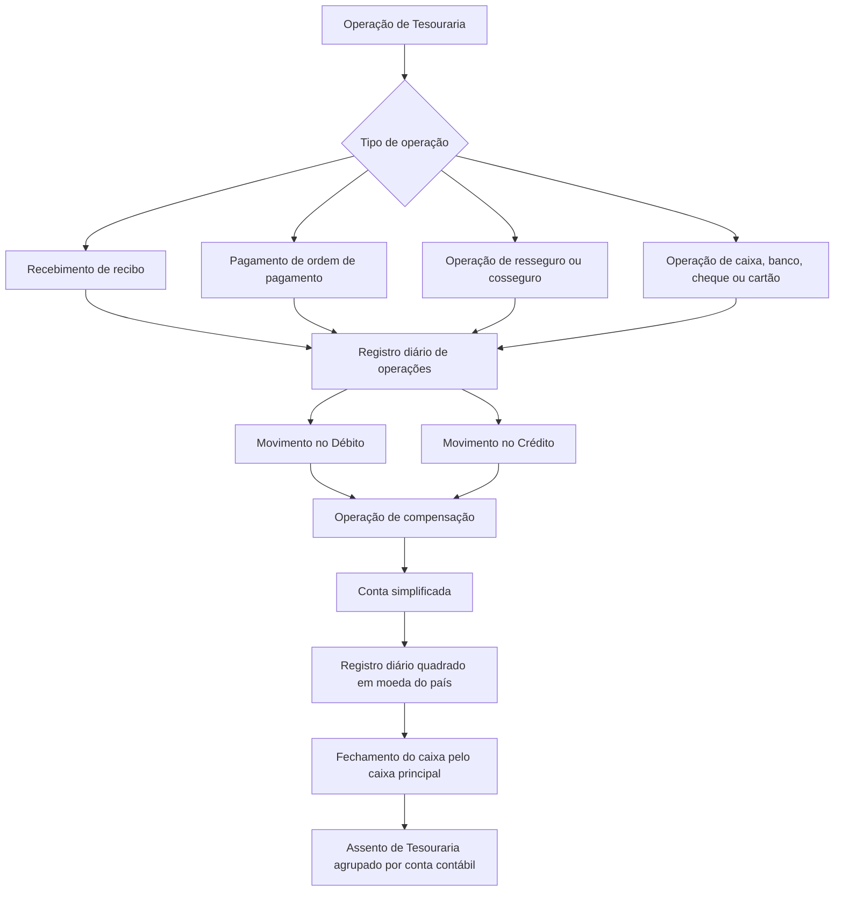
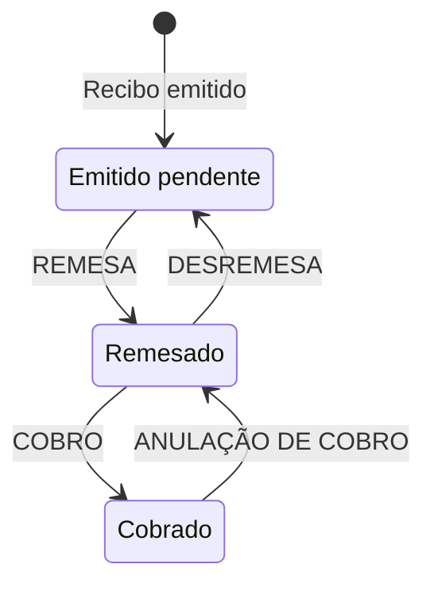
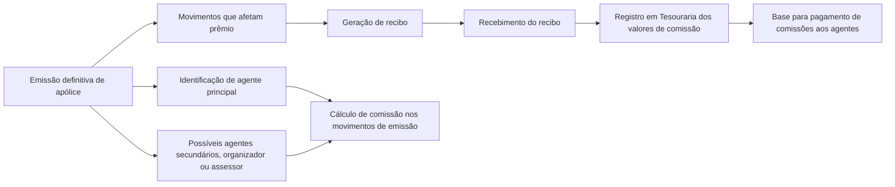

# Módulo de Tesouraria do Reef.core — Conceitos, Configuração, Operações e Processos

## 1. Metadados do Documento
- **Arquivo de Origem:** Não identificado no conteúdo extraído
- **Tipo de Documento:** Manual Operacional
- **Domínio / Sistema:** Módulo de Tesouraria — Reef.core / MAPFRE
- **Público-Alvo:** Desenvolvedores, Arquitetos, Operação, Usuários de Tesouraria e Negócio
- **Data/Versão Identificada:** Não identificada

---

## 2. Resumo Executivo & Contexto de Negócio

O módulo de Tesouraria controla os fluxos monetários da companhia, abrangendo gestão de pagamentos, gestão de cobranças e operações bancárias. O módulo registra cronologicamente operações diárias no registro diário, estruturando-as como lançamentos contábeis com movimentações no Débito e no Crédito.

A Tesouraria funciona sob o plano geral contábil, considerado pelo documento como o marco legal e normativo aplicável à elaboração da contabilidade financeira obrigatória. Todas as transações devem possuir contrapartida por meio de uma operação de compensação e devem permanecer quadradas na moeda do país.

O módulo trata recebimentos de prêmios, devoluções, pagamentos de ordens de pagamento, comissões de agentes, cobranças e recuperações de sinistros, remessas de resseguro e cosseguro, operações em caixa, bancos, cheques, cartões e contas de gestão. Também inclui operações não contábeis, consultas e processos massivos para cobrança e pagamento.

O acesso operacional depende de o usuário estar cadastrado no sistema e possuir o papel de caixa. Existem caixas principais e secundários; o caixa principal é o único perfil habilitado a encerrar o registro diário e gerar os lançamentos de Tesouraria.

O documento também descreve suporte multimoeda. Operações podem ocorrer em moedas distintas desde que a moeda e a taxa de câmbio correspondente estejam cadastradas. Mesmo movimentos realizados em moeda estrangeira carregam valor correspondente em moeda local para permitir o fechamento e o balanceamento do registro diário.

---

## 3. Arquitetura, Componentes & Tecnologias Envolvidas

### Componentes e entidades identificadas

| Componente / Entidade | Função documentada |
| :--- | :--- |
| **Reef.core** | Sistema no qual são definidas moedas utilizadas nas operações da companhia. |
| **Módulo de Tesouraria** | Controla cobranças, pagamentos, operações bancárias, registro diário, compensações, ordens de pagamento e processos massivos. |
| **Registro diário de operações** | Registra cronologicamente operações de cobrança e pagamento em Débito e Crédito. |
| **Operação de compensação** | Registra a forma de entrada ou saída do valor cobrado ou pago e realiza a contrapartida contábil. |
| **Assento de Tesouraria** | Agrupa e totaliza os movimentos do registro diário por conta contábil. |
| **Recibo** | Documento gerado na emissão de movimentos definitivos que afetam prêmio. |
| **Ordem de pagamento** | Meio para pagar pessoas físicas ou jurídicas relacionadas à companhia. |
| **Gestor de cobrança** | Pessoa ou entidade responsável pela cobrança de recibos. |
| **Agentes e comissões** | Figuras vinculadas à apólice que podem receber comissão após o recebimento dos recibos. |
| **Conta simplificada** | Chave que identifica a conta contábil usada em operações de cobrança ou pagamento de recibos. |
| **Plano de contas** | Define contas contábeis e parâmetros utilizados pela companhia no exercício contábil. |
| **Caixa** | Perfil operacional e também termo usado para os movimentos realizados no registro diário de um dia. |
| **Banco** | Entidade bancária e contexto de compensações, recebimentos, pagamentos e saldos. |
| **Processos massivos** | Processos por lote para cobranças de prêmios e pagamentos de ordens de pagamento. |
| **MAPFRE** | Entidade mencionada no contexto de terceiros com relacionamento com a companhia. |

### Fluxo contábil e operacional principal



### Fluxo de estados de recibos



### Relação entre emissão, recibos, comissões e pagamentos



> **Nota de Análise:** O documento menciona o sistema Reef.core, mas não detalha arquitetura técnica, interfaces, bancos de dados, protocolos de integração, APIs, métodos HTTP, contratos JSON, versões ou ambientes tecnológicos.

---

## 4. Regras de Negócio, Especificações Funcionais & Processos

### 4.1 Registro diário de operações

- O registro diário registra todas as operações diárias de cobrança e pagamento da companhia.
- Os registros são mantidos em ordem cronológica.
- Cada operação é apresentada como lançamento contábil, com movimentação no Débito e no Crédito.
- Despesas são refletidas no Débito.
- Receitas são registradas no Crédito.
- O conjunto dessas transações forma o lançamento contábil de Tesouraria.
- Toda operação executada no registro diário deve possuir um movimento no Débito e outro no Crédito.
- A contrapartida de um movimento é realizada por uma operação de compensação.
- Todas as transações devem estar quadradas na moeda do país.
- O registro diário é regido por uma data de lançamento.
- A data de lançamento é alterada no fechamento de caixa e na geração do lançamento de Tesouraria.
- O termo **caixa** representa todos os movimentos ou lançamentos realizados no registro diário de operações durante o dia.
- O lançamento de Tesouraria agrupa os movimentos do registro diário por conta contábil e totaliza as operações agrupadas.

### 4.2 Gestor de cobrança

- O gestor de cobrança é a pessoa ou entidade responsável pela cobrança dos recibos.
- O gestor de cobrança é identificado desde a emissão da apólice.
- A Tesouraria pode permitir a alteração do gestor de cobrança.
- A codificação do tipo de gestor é configurável por companhia.
- A classe do gestor determina suas características.

| Classe de gestor | Descrição |
| :--- | :--- |
| `1` | Agente |
| `2` | Banco |
| `3` | Cobrador |
| `4` | Débito automático em conta |
| `5` | Gestor direto |
| `6` | Gestor piloto de cosseguro |
| `7` | Escritório comercial |
| `8` | Débito com cartão de crédito |
| `10` | Gestor de inadimplências |

### 4.3 Agentes e comissões

- Toda apólice possui um agente principal.
- Uma apólice também pode possuir agentes secundários, organizador ou assessor.
- Os agentes vinculados à apólice podem ter direito a comissões.
- A comissão de cada agente é calculada nos movimentos de emissão.
- O valor de comissão é determinado pelo quadro de comissão selecionado para o agente principal.
- Nem o quadro de comissão nem os valores de comissão podem ser alterados pela Tesouraria.
- Apenas recibos cobrados geram pagamento de comissões.
- Após a cobrança do recibo, os valores de comissão relativos ao recibo são registrados na Tesouraria.
- Os valores registrados constituem a base para o pagamento de comissões aos agentes.

### 4.4 Recibos

- Recibos são gerados na emissão para movimentos definitivos que afetam o prêmio da apólice.
- O valor de um recibo não pode ser alterado pela Tesouraria.
- O recibo possui estados operacionais: Emitido Pendente, Remesado e Cobrado.
- A remessa altera o estado de `EP` para `RE`.
- A cobrança altera o estado de `RE` para `CT`.
- A desremessa altera o estado de `RE` para `EP`.
- A anulação de cobrança altera o estado de `CT` para `RE`.

| Situação | Código | Descrição |
| :--- | :--- | :--- |
| Emitido pendente | `EP` | Recibo emitido e pendente de remessa ou cobrança. |
| Remesado | `RE` | Recibo colocado em cobrança/remessa. |
| Cobrado | `CT` | Recibo cujo valor foi cobrado. |

### 4.5 Estrutura de um recibo

| Grupo de informação | Dados documentados |
| :--- | :--- |
| Dados do recibo | Número único do recibo, situação, data de efeito, vencimento do recibo, data de vencimento para pagamento e gestor de cobrança. |
| Informação econômica | Moeda do recibo e conceitos econômicos. |
| Agentes e comissões | Tipo de agente e valor de comissão. |
| Pagador | Tipo e código de documento do terceiro. |

### 4.6 Conta simplificada e compensação

- A conta simplificada identifica a conta contábil utilizada em uma operação de cobrança ou pagamento de recibo.
- Todas as operações possuem movimento de compensação.
- O movimento de compensação registra a forma de entrada ou de saída do valor cobrado ou pago.
- A conta simplificada está ligada ao movimento de compensação.
- A determinação da conta simplificada depende do tipo de compensação.
- Em cobranças ou pagamentos em dinheiro, existe uma conta simplificada predefinida.
- Em operações bancárias, a conta simplificada do banco deve ser identificada no momento da compensação.

| Tipo de compensação citado | Aplicação documentada |
| :--- | :--- |
| Cheque | Forma de entrada ou saída de valor em operações de cobrança ou pagamento. |
| Dinheiro | Forma de entrada ou saída de valor; utiliza conta simplificada predefinida. |
| Transferência | Forma de entrada ou saída de valor. |
| Cartão de crédito | Forma de entrada ou saída de valor. |
| Outros | O documento indica a existência de outros tipos sem detalhá-los. |

### 4.7 Conceitos de cobrança e pagamento

- O conceito de cobrança e pagamento é o detalhamento econômico da ordem de pagamento.
- O conceito permite detalhar a despesa.
- O conceito identifica a conta contábil utilizada para gerar a ordem de pagamento.
- Cada companhia define seus próprios conceitos de cobrança e pagamento.
- Os conceitos são classificados conforme a natureza da despesa.

| Classificação | Descrição |
| :--- | :--- |
| `SI` | Sinistros |
| `RE` | Resseguro |
| `CC` | Cosseguro cedido |
| `CA` | Cosseguro aceito |
| `CP` | Cobranças e pagamentos diversos |
| `AC` | Agentes e comissões |
| `VI` | Conceitos de vida |

### 4.8 Ordens de pagamento

- A ordem de pagamento permite que a companhia pague pessoas físicas ou jurídicas que tenham mantido relação com a organização.
- Há diferentes tipos de ordem de pagamento.
- Ordens de pagamento de sinistros são geradas no módulo de sinistros, mas são pagas pela Tesouraria.
- Ordens de sinistro são denominadas liquidações de expedientes.
- Liquidações negativas podem ser usadas para cobrança e recuperação de sinistros, como franquias e recuperações de sinistros de outra companhia.

| Tipo | Descrição |
| :--- | :--- |
| `T` | Tesouraria |
| `S` | Sinistros |
| `R` | Remessas de resseguro |
| `C` | Remessas de cosseguro |
| `A` | Comissões de agente |
| `D` | Devoluções de prêmio |

| Grupo de composição | Dados documentados |
| :--- | :--- |
| Identificação | Datas estimadas de pagamento, moeda do pagamento e dados de fatura quando o pagamento ocorre por fatura. |
| Beneficiário | Tipo e código de documento do terceiro a pagar; forma de pagamento, como dinheiro, cheque ou transferência bancária. |
| Conceito de cobrança/pagamento | Conceito de pagamento segundo a natureza da despesa. |
| Impostos ou retenções | Impostos e retenções associados ao conceito de cobrança e pagamento. |

### 4.9 Controle de acesso e fechamento

| Perfil | Regra |
| :--- | :--- |
| Caixa principal (`P`) | Único perfil habilitado a fechar o registro diário. |
| Caixa secundário (`S`) | Perfil operacional de caixa sem permissão documentada para fechar o registro diário. |

- O usuário deve estar cadastrado no sistema e possuir o papel de caixa para trabalhar no módulo.
- Para cada nível 3 da estrutura comercial, deve existir um caixa principal.
- Cada nível 3 pode possuir tantos caixas secundários quanto necessário.
- O fechamento do caixa encerra as operações do dia no registro diário e gera os lançamentos de Tesouraria.

### 4.10 Multimoeda

- As operações de Tesouraria podem ser realizadas em diferentes moedas.
- As moedas e as taxas de câmbio correspondentes devem estar registradas no sistema.
- Um recibo emitido em moeda estrangeira pode ser cobrado nessa mesma moeda.
- A compensação de um recibo emitido em moeda estrangeira pode ocorrer na mesma moeda, na moeda local ou em outra moeda.
- Todo movimento em moeda estrangeira deve registrar o respectivo valor em moeda local para permitir o quadramento do registro diário.

### 4.11 Entradas e saídas

| Origem | Resultado / operação de Tesouraria |
| :--- | :--- |
| Gestão de recibo | Recibo cobrado ou recibo pago. |
| Geração de ordem de pagamento | Ordem de pagamento. |
| Comissão de agente | Ordem de pagamento. |
| Expediente de sinistro | Ordem de pagamento. |
| Remessa de resseguro e cosseguro | Ordem de pagamento. |
| Gestão de ordem de pagamento | Ordem de pagamento paga ou ordem de pagamento cobrada. |

### 4.12 Definições necessárias

O módulo depende de definições comuns ao sistema e definições específicas de Tesouraria.

| Nível | Elemento | Descrição documentada |
| :--- | :--- | :--- |
| Comum | Usuários | Pessoas que podem acessar o sistema e seus papéis atribuídos. |
| Comum | Programas | Operações contempladas pelo sistema e suas características. |
| Comum | Companhia | Entidade ou entidades para criação de apólices e demais elementos. |
| Comum | Moeda | Divisas usadas pelo Reef.core nas operações da companhia. |
| Comum | Estrutura comercial | Organização territorial da companhia. |
| Comum | Terceiros | Pessoas físicas ou jurídicas que podem ter relação com a entidade MAPFRE. |
| Comum | Agente | Terceiros que atuam como intermediários entre cliente e companhia. |
| Comum | Subvenção de agente | Características de subsídios de comissões de agentes. |
| Comum | Conceito econômico de comissão | Conceitos econômicos cujos valores serão liquidados no processo de liquidação de comissões. |
| Comum | Seguradora | Propriedades específicas de terceiros que atuam como entidades seguradoras e podem se relacionar com a MAPFRE. |
| Comum | Bancos | Propriedades específicas de terceiros que atuam como entidades bancárias. |
| Comum | Plano de pagamento | Forma de fracionamento do pagamento do seguro. |
| Comum | Suplementos | Tipos de modificações que apólices podem sofrer, como anulação, reabilitação e renovação. |
| Comum | Datas de processo | Datas em que as informações são contabilizadas. |
| Comum | Exercício contábil | Período para operações contábeis; um novo exercício deve ser definido após cada fechamento de exercício. |
| Comum | Plano de contas | Contas usadas pela companhia dentro do exercício contábil e seus parâmetros. |
| Comum | Conceito contábil | Identificador que agrupa lançamentos contábeis para consulta posterior. |
| Tesouraria | Caixa | Usuários habilitados a trabalhar com o módulo de Tesouraria. |
| Tesouraria | Conta por tipo de atualização | Contas contábeis usadas conforme a operação do registro diário. |
| Tesouraria | Conta simplificada | Chaves que identificam contas contábeis. |
| Tesouraria | Gestor de cobrança | Tipos de gestor capazes de gerir a cobrança de recibos. |
| Tesouraria | Cobranças antecipadas | Tipos de cobranças antecipadas permitidas e suas características. |
| Tesouraria | Ordem de pagamento | Informações necessárias para criação de ordens de pagamento. |
| Tesouraria | Autorização de ordem de pagamento | Dados que determinam quando uma ordem necessita autorização e quem pode autorizá-la. |
| Tesouraria | Conceito de cobrança/pagamento | Detalhamento econômico das ordens de pagamento para detalhar despesa. |
| Tesouraria | Imposto | Obrigações tributárias, características e formas de cálculo. |
| Tesouraria | Cartões de crédito | Identificação e características dos cartões que podem ser usados em cobranças. |
| Tesouraria | Parâmetros e definições de Tesouraria | Parâmetros e definições que condicionam o funcionamento do módulo. |
| Tesouraria | Processo massivo | Definições necessárias ao funcionamento de processos massivos de cobranças e pagamentos. |

### 4.13 Operações suportadas

| Grupo | Operação | Descrição documentada |
| :--- | :--- | :--- |
| Cobranças e devoluções | Gerenciar recibo cobrança devolução | Cobra recibos ou anula a cobrança de recibos. |
| Cobranças e devoluções | Entregar caixa dinheiro | Compensa uma anulação de cobrança em dinheiro. |
| Cobranças e devoluções | Entregar banco dinheiro | Compensa uma anulação de cobrança paga no banco. |
| Cobranças e devoluções | Anular caixa banco cheque transferido | Compensa valores devolvidos de banco cobrados por cheque. |
| Cobranças e devoluções | Anular caixa banco cartão transferido | Compensa valores devolvidos de banco cobrados por cartão. |
| Cobranças e devoluções | Entregar conta de gestão | Compensa uma anulação de cobrança contra conta de gestão. |
| Cobranças e devoluções | Anular caixa cheque recebido | Compensa uma anulação de cobrança contra cheque em caixa. |
| Cobranças e devoluções | Anular caixa cartão recebido | Compensa uma anulação de cobrança contra cartão. |
| Cobranças e devoluções | Entregar caixa diferença de câmbio | Compensa diferença positiva de caixa por taxas de câmbio. |
| Cobranças e devoluções | Receber caixa dinheiro | Compensa uma cobrança em dinheiro. |
| Cobranças e devoluções | Receber caixa cheque | Compensa uma cobrança por cheque. |
| Cobranças e devoluções | Receber caixa cartão | Compensa uma cobrança por cartão. |
| Cobranças e devoluções | Receber caixa banco dinheiro | Compensa uma cobrança quando o cliente paga no banco. |
| Cobranças e devoluções | Receber caixa conta de gestão | Compensa uma cobrança contra conta de gestão. |
| Cobranças e devoluções | Receber caixa diferença de câmbio | Compensa diferença negativa de caixa por taxas de câmbio. |
| Cobranças e devoluções | Receber caixa cancelamento de cobrança antecipada | Compensa cobrança de recibo com cancelamento de cobrança antecipada. |
| Cobranças e devoluções | Criar recibo de grupo | Agrupa recibos em um documento único de cobrança para gestão conjunta. |
| Cobranças e devoluções | Anular recibo de grupo | Desagrupa recibos associados a um documento de cobrança. |
| Cobranças e devoluções | Gerar ordem de pagamento por anulação de cobrança | Cria ordem de pagamento pela anulação de um recibo cobrado. |
| Cobranças e devoluções | Criar antecipação de cobrança | Cobra valor em conta de prêmio em depósito até a cobrança do recibo da apólice. |
| Cobranças e devoluções | Cobrar sinistro | Registra cobrança de liquidações negativas de sinistros, como franquias ou recuperações. |
| Cobranças e devoluções | Anular cobrança de sinistro | Anula a cobrança de uma liquidação negativa. |
| Pagamentos | Pagar ordem de pagamento | Paga a terceiro o valor de uma ordem de pagamento. |
| Pagamentos | Autorizar ordem de pagamento | Aprova o pagamento de uma ordem de pagamento. |
| Pagamentos | Criar antecipação de comissão | Gera ordem de pagamento para antecipar total ou parte da comissão de um agente. |
| Pagamentos | Anular ordem de pagamento | Cancela ordens de pagamento geradas que estejam pendentes de pagamento. |
| Pagamentos | Anular ordem de pagamento cheque transferência | Anula cheques ou transferências de pagamento, com ou sem reexpedição. |
| Pagamentos | Anular ordem de pagamento outra forma de pagamento | Anula ordens pagas por conta de gestão, banco em dinheiro ou caixa em dinheiro. |
| Pagamentos | Alterar escritório de ordem de pagamento | Modifica o escritório de pagamento de uma ordem. |
| Pagamentos | Modificar cheque impresso danificado | Registra cheque de pagamento danificado no momento da impressão. |
| Pagamentos | Modificar cheque manual danificado | Registra cheque de pagamento danificado antes da impressão. |
| Pagamentos | Imprimir cheque | Imprime cheques para pagamentos. |
| Resseguro / Cosseguro | Gerar cobrança/pagamento de remessa | Registra crédito ou débito de remessas de cosseguro e resseguro. |
| Fechamento de caixas | Fechar caixa | Finaliza operações diárias do registro e gera lançamentos de Tesouraria. |
| Fechamento de caixas | Fechar caixa erro outra data | Finaliza operações sem gerar lançamentos de Tesouraria, em data distinta da parte ativa, quando o fechamento provocou erro. |
| Fechamento de caixas | Gerar lançamento de Tesouraria | Realiza lançamentos de Tesouraria para datas anteriores à data da parte ativa. |
| Consultas | Consultar recibo | Exibe informações de recibos por diferentes critérios de pesquisa. |
| Consultas | Consultar ordem de pagamento | Exibe dados de ordens de pagamento por diferentes critérios de pesquisa. |
| Consultas | Consultar registro diário | Exibe operações realizadas no dia por diferentes critérios de pesquisa. |
| Consultas | Consultar histórico de registro diário | Exibe operações de Tesouraria realizadas em datas anteriores. |
| Consultas | Consultar recibo agente gestor | Exibe informações de recibos por gestor de cobrança. |
| Consultas | Consultar cheque em caixa | Exibe cheques existentes em caixa. |
| Consultas | Consultar cartão em caixa | Exibe cartões existentes em caixa. |
| Consultas | Consultar saldo bancário | Exibe saldo das contas bancárias da companhia. |
| Consultas | Consultar saldo de caixa | Exibe saldo dos caixas por moeda. |
| Operações não contábeis | Ajustar liquidação de comissão | Realiza ajuste de débito ou crédito que afeta saldo da comissão do agente. |
| Operações não contábeis | Criar liquidação de comissão | Gera ordens de pagamento para pagamento de comissões de agentes. |
| Operações não contábeis | Criar informe de comissão | Gera impresso da liquidação de comissões de agentes. |
| Operações não contábeis | Remessar recibo de prêmio | Altera recibo de Emitido Pendente (`EP`) para Remesado (`RE`). |
| Operações não contábeis | Desremessar recibo | Altera recibo de Remesado (`RE`) para Emitido Pendente (`EP`). |
| Operações não contábeis | Alterar gestor de recibo de prêmio | Atribui outro gestor de cobrança a um recibo. |
| Operações não contábeis | Registrar fatura | Registra uma fatura na aplicação. |
| Processos massivos | Gerar tabela de caixa postal de cobranças massivas | Prepara recibos para cobrança massiva a partir dos dados de um arquivo. |
| Processos massivos | Gerar carga de cobranças massivas | Prepara recibos domiciliados para envio ao banco e cobrança massiva. |
| Processos massivos | Cobrar prêmio massivo | Executa cobrança massiva dos recibos incluídos no processo. |
| Processos massivos | Consultar cobranças massivas | Exibe estado das cobranças em processo massivo por critérios de pesquisa. |
| Processos massivos | Gerar carga de pagamentos massivos | Prepara ordens de pagamento que serão pagas pelo processo massivo. |
| Processos massivos | Pagar ordem de pagamento massivo | Executa o pagamento das ordens incluídas no processo. |
| Processos massivos | Consultar pagamentos massivos | Exibe estado dos pagamentos em processo massivo por critérios de pesquisa. |

---

## 5. Tabelas de Parâmetros, Ambientes e Estruturas de Dados

| Item / Parâmetro | Descrição / Função | Tipo / Valores / Formato | Ambiente / Observações |
| :--- | :--- | :--- | :--- |
| Estado do recibo | Identifica a situação operacional de um recibo. | `EP`, `RE`, `CT` | `EP` = Emitido Pendente; `RE` = Remesado; `CT` = Cobrado. |
| Tipo de caixa | Classifica o usuário de caixa. | `P`, `S` | `P` = principal; `S` = secundário. |
| Classe de gestor | Determina características do gestor de cobrança. | `1`, `2`, `3`, `4`, `5`, `6`, `7`, `8`, `10` | Configurável por companhia. |
| Tipo de ordem de pagamento | Classifica a origem ou natureza da ordem. | `T`, `S`, `R`, `C`, `A`, `D` | Tesouraria, Sinistros, Resseguro, Cosseguro, Comissões de agente e Devoluções de prêmio. |
| Classificação de conceito de cobrança/pagamento | Classifica conceitos pela natureza da despesa. | `SI`, `RE`, `CC`, `CA`, `CP`, `AC`, `VI` | Cada companhia define os próprios conceitos. |
| Conta simplificada | Identifica a conta contábil usada na operação de cobrança ou pagamento. | Chave contábil | Determinada pelo tipo de compensação. |
| Moeda | Permite executar operações em moedas distintas. | Moeda registrada no sistema | Exige taxa de câmbio correspondente registrada. |
| Valor em moeda local | Permite quadramento do registro diário. | Valor monetário local | Obrigatório inclusive para movimentos em moeda estrangeira. |
| Data de lançamento | Identifica a data do lançamento no registro diário. | Data | Alterada no fechamento de caixa e geração do lançamento de Tesouraria. |
| Gestor de cobrança | Entidade responsável por cobrar um recibo. | Tipo configurável por companhia | Identificado na emissão; pode ser alterado na Tesouraria. |
| Número do recibo | Identificador único do recibo. | Identificador único | Parte dos dados do recibo. |
| Pagador / Beneficiário | Identificação do terceiro envolvido na cobrança ou pagamento. | Tipo e código de documento | Aplicável a recibos e ordens de pagamento. |
| Forma de pagamento | Forma pela qual o pagamento é realizado. | Dinheiro, cheque, transferência bancária, entre outros | Também relacionada a movimentos de compensação. |
| Impostos ou retenções | Obrigações tributárias associadas ao conceito de cobrança ou pagamento. | Tipos, características e formas de cálculo | Requer definições de imposto. |
| Conta por tipo de atualização | Define contas contábeis usadas conforme a operação diária. | Conta contábil | Definição específica de Tesouraria. |
| Autorização de ordem de pagamento | Determina necessidade e responsável por autorizar uma ordem. | Dados de autorização | Documento não detalha critérios ou alçadas. |
| Arquivo de cobranças massivas | Origem de dados de recibos de cobrança massiva. | Arquivo não especificado | O formato do arquivo não foi informado. |

> **Nota de Análise:** O documento não apresenta URLs, hosts, portas, credenciais, rotas de log, nomes de bancos de dados, schemas, APIs, formatos de arquivo ou configurações de ambiente.

---

## 6. Bateria de Perguntas & Respostas para RAG (FAQ Sintético)

### P1: Qual é a finalidade do módulo de Tesouraria no Reef.core?
**R:** O módulo de Tesouraria controla os fluxos monetários da companhia, incluindo gestão de pagamentos, gestão de cobranças e operações bancárias. O módulo registra essas operações no registro diário de forma cronológica e contábil, com lançamentos no Débito e no Crédito.

### P2: Como o registro diário de operações deve permanecer contabilmente válido?
**R:** Toda operação no registro diário deve possuir um movimento no Débito e outro no Crédito. A contrapartida é registrada pela operação de compensação, e todas as transações devem permanecer quadradas na moeda do país.

### P3: Quais são os estados possíveis de um recibo e quais transições são permitidas?
**R:** Um recibo pode estar em `EP` — Emitido Pendente, `RE` — Remesado, ou `CT` — Cobrado. A remessa move o recibo de `EP` para `RE`; a cobrança move de `RE` para `CT`; a desremessa move de `RE` para `EP`; e a anulação de cobrança move de `CT` para `RE`.

### P4: A Tesouraria pode alterar o valor de um recibo ou a comissão de um agente?
**R:** Não. O importe do recibo não pode ser modificado pela Tesouraria. O quadro de comissão escolhido para o agente principal e os importes de comissão, calculados nos movimentos de emissão, também não podem ser modificados pela Tesouraria.

### P5: Quando uma comissão de agente pode ser paga?
**R:** Somente são pagas comissões associadas a recibos cobrados. Depois que um recibo é cobrado, os valores de comissão ligados a esse recibo são registrados na Tesouraria e servem como base para o pagamento de comissões aos agentes.

### P6: O que é uma conta simplificada no módulo de Tesouraria?
**R:** A conta simplificada é uma chave que identifica a conta contábil usada em uma operação de cobrança ou pagamento de recibo. Ela está vinculada ao movimento de compensação e é determinada conforme o tipo de compensação realizado.

### P7: Quem pode fechar o registro diário de operações?
**R:** Somente o caixa principal, identificado pelo tipo `P`, pode realizar o fechamento do registro diário. O usuário precisa estar cadastrado no sistema e possuir papel de caixa para trabalhar no módulo de Tesouraria.

### P8: Como o módulo trata operações em moeda estrangeira?
**R:** Operações podem ocorrer em diversas moedas, desde que as moedas e as taxas de câmbio estejam registradas no sistema. Mesmo quando uma transação é realizada em moeda estrangeira, o movimento deve conter o valor correspondente em moeda local para permitir o quadramento do registro diário.

### P9: Quais são os tipos de ordens de pagamento suportados?
**R:** O documento lista: `T` para Tesouraria, `S` para Sinistros, `R` para Remessas de resseguro, `C` para Remessas de cosseguro, `A` para Comissões de agente e `D` para Devoluções de prêmio.

### P10: Como são tratadas as liquidações negativas de sinistros?
**R:** Liquidações negativas podem representar cobranças ou recuperações de sinistros, como franquias ou recuperação de sinistro de outra companhia. A operação “Cobrar sinistro” registra essa cobrança, e “Anular cobrança de sinistro” anula a cobrança de uma liquidação negativa.

### P11: O que faz a operação “Fechar caixa erro outra data”?
**R:** A operação finaliza as operações do registro diário sem gerar lançamentos de Tesouraria, em uma data diferente da parte ativa, quando o fechamento anterior provocou algum erro.

### P12: Como funciona o processo massivo de cobrança de prêmios?
**R:** O processo começa com a geração da tabela de caixa postal de cobranças massivas, que prepara dados de recibos a partir de um arquivo. Depois, a carga de cobranças massivas prepara recibos domiciliados para envio ao banco. Por fim, a operação “Cobrar prêmio massivo” executa a cobrança dos recibos incluídos no processo.

---

## 7. Glossário de Termos, Siglas & Conceitos-Chave

- **AC:** Classificação de conceitos de cobrança e pagamento para agentes e comissões.
- **Assento de Tesouraria:** Agrupamento e totalização, por conta contábil, dos movimentos do registro diário.
- **Caixa:** Usuário habilitado a trabalhar no módulo de Tesouraria; também representa os movimentos realizados no registro diário durante um dia.
- **CA:** Classificação de conceitos de cobrança e pagamento para cosseguro aceito.
- **CC:** Classificação de conceitos de cobrança e pagamento para cosseguro cedido.
- **Compensação:** Operação que registra a forma de entrada ou saída de um valor e realiza a contrapartida de um movimento contábil.
- **Conceito de cobrança/pagamento:** Detalhamento econômico de uma ordem de pagamento que identifica a conta contábil e a natureza da despesa.
- **Conta simplificada:** Chave identificadora da conta contábil usada em cobrança ou pagamento de recibo.
- **CT:** Situação de recibo “Cobrado”.
- **CP:** Classificação de conceitos de cobrança e pagamento diversos.
- **EP:** Situação de recibo “Emitido Pendente”.
- **Exercício contábil:** Período de tempo no qual são realizadas operações contábeis.
- **Gestor de cobrança:** Pessoa ou entidade que realiza a cobrança de recibos.
- **MAPFRE:** Entidade mencionada como referência na definição de terceiros e entidades seguradoras relacionadas.
- **Ordem de pagamento:** Meio para realizar pagamento a pessoa física ou jurídica relacionada à companhia.
- **P:** Tipo de caixa principal.
- **Plano geral contábil:** Marco legal e normativo para elaboração da contabilidade financeira obrigatória.
- **RE:** Classificação de conceitos de cobrança e pagamento para resseguro; também código de estado “Remesado” para recibos, conforme o contexto.
- **Recibo:** Documento gerado por movimentos definitivos de emissão que afetam o prêmio.
- **Reef.core:** Sistema citado como responsável por realizar operações da companhia com as divisas definidas.
- **S:** Tipo de caixa secundário; também código de tipo de ordem de pagamento de sinistros, conforme o contexto.
- **SI:** Classificação de conceitos de cobrança e pagamento para sinistros.
- **Tesouraria:** Módulo responsável por cobranças, pagamentos, operações bancárias e registro contábil diário.
- **VI:** Classificação de conceitos de cobrança e pagamento para conceitos de vida.

---

## 8. Notas Críticas, Riscos & Limitações

- O documento não informa data, versão, autoria, identificador do arquivo nem histórico de revisões.
- O documento não detalha arquitetura de infraestrutura, integrações, APIs, endpoints, protocolos, filas, bancos de dados ou mecanismos de autenticação.
- Não há especificação dos critérios de cálculo de comissões, embora seja informado que o cálculo ocorre nos movimentos de emissão.
- Não há detalhamento de regras, alçadas, valores ou perfis específicos para autorização de ordens de pagamento.
- O formato e os campos dos arquivos utilizados em cobranças massivas não são especificados.
- A política de taxas de câmbio, fonte das cotações, precisão monetária e regras de arredondamento não são descritas.
- O documento informa que todas as transações devem estar quadradas em moeda local, mas não detalha o tratamento de divergências, exceções ou procedimentos de reconciliação.
- O documento cita “etc.” em tipos de compensação e em dados de identificação de ordens de pagamento; portanto, a lista apresentada não deve ser interpretada como exaustiva.
- **Nota de Análise:** O documento lista as operações funcionais do módulo, porém não detalha telas, permissões por programa, contratos de integração, campos obrigatórios, validações de entrada ou efeitos contábeis por operação.

---

## 9. Conteúdo Bruto Estruturado (Referência Fiel)

```text
--- [PÁGINA 1 DE 17] ---

INTRODUCCIÓN - Módulo Tesorería
Objetivo
Este módulo se encarga de controlar todos los flujos monetarios de la compañía: Gestión de Pagos,
Gestión de Cobros, Gestiones Bancarias.
Permite, fundamentalmente, realizar apuntes contables de cobros y pagos, sin tener mayor
conocimiento de contabilidad.
En este documento se abordarán los siguientes puntos:
Conceptos principales
Características
Entradas y salidas
Definiciones
Operaciones soportadas
Conceptos principales
Registro diario de operaciones
Gestor de cobro
Agentes y Comisiones
Recibos
Cuenta simplificada
 / 
 RS
Inicio Soluciones APIs Documentación Zeus
ES


--- [PÁGINA 2 DE 17] ---

Concepto de cobro y pago
Orden de pago
Registro diario de operaciones
Es donde se registran todas las operaciones diarias de cobros y pagos de la compañía, de manera
cronológica y en forma de asiento contable, es decir, registrando los movimientos en el Debe y el
Haber.
Cuando se trata de un gasto se refleja en el Debe
Cuando es un ingreso se registra en el Haber
El registro de estas transacciones conforman el asiento contable de tesorería.
Gestor de cobro
Es la persona o entidad que se encarga de realizar el cobro de los recibos. Se identifica desde la
emisión de la póliza, aunque se puede permitir modificar desde tesorería.
La codificación del tipo de gestor es configurable por cada compañía, identificando la clase de gestor
a la que pertenece. Esta clase de gestor es la que determina las características del gestor de cobro:
Clase de gestor
1: Agente
2: Banco
3: Cobrador
4: Débito automático en cuenta
5: Gestor directo
6: Gestor piloto de coaseguro
7: Oficina comercial
8: Débito con tarjeta de crédito
10: Gestor de impagos
Ejemplo de gestor de cobro:
TIPO DE GESTOR DESCRIPCIÓN CLASE DE GESTOR
AG Agente 1
OF Oficina 7
TA Tarjeta 8


--- [PÁGINA 3 DE 17] ---

TIPO DE GESTOR DESCRIPCIÓN CLASE DE GESTOR
DB Domiciliación bancaria 4
Agentes y Comisiones
Desde la emisión de la póliza se identifican las distintas figuras que intervienen en la póliza y que
pueden cobrar comisión, así, una póliza siempre tiene un agente principal, pero también puede tener
otras agentes a los que también hay que pagarles comisión, como son agentes secundarios y el
organizador o el asesor.
La comisión que corresponde a cada agente se calcula en los propios movimientos de emisión. El
importe de la comisión lo determina el cuadro de comisión que se elige para el agente principal y ni el
cuadro ni los importes pueden ser modificado desde tesorería.
Solamente se pagan comisiones de recibos cobrados. Cuando se cobra el recibo, los importes de
comisiones que pertenecen a ese recibo se registran en tesorería y esta información servirá de base
para el pago de comisiones a los agentes.
Recibos
Se generan desde la emisión en aquellos movimientos que afectan a prima, cuando el movimiento a
la póliza es definitivo. El importe de los recibos no puede ser modificado desde la tesorería.
Un recibo tiene las siguientes situaciones:
SITUACIÓN DESCRIPCIÓN
EP Emitido pendiente
RE Remesado
CT Cobrado
Según el estado del recibo se podrán realizar determinadas operaciones de tesorería:
EP
Emitido pendiente REMESA RE
Remesado


--- [PÁGINA 4 DE 17] ---

RE
Remesado
COBRO CT
Cobrado
DESREMESA EP
Emitido pendiente
CT
Cobrado ANULACIÓN COBRO RE
Remesado
Composición del recibo
RECIBO
DATOS DEL RECIBO INFORMACIÓN ECONÓMICA AGENTES Y COMISIONES PAGADOR
DATOS DEL RECIBO:
Número de recibo (identificador único)
Situación
Fecha de efecto y vencimiento del recibo
Fecha de vencimiento de pago
Gestor de cobro
INFORMACIÓN ECONÓMICA:
Moneda del recibo
Conceptos económicos
AGENTES Y COMISIONES:
Tipo de agente
Importe de comisión
PAGADOR:
Tipo y código de documento del tercero
Cuenta simplificada
Se trata de una clave que identifica la cuenta contable que se utiliza para realizar una operación de
cobro o pago de recibo.


--- [PÁGINA 5 DE 17] ---

Todas estas operaciones conllevan un movimiento de compensación, que es el que registra la forma
de entrada o salida del importe cobrado o pagado, según el tipo de compensación.
Tipos de compensación
CHEQUE
EFECTIVO
TRANSFERENCIA
TARJETA DE CRÉDITO
etc.
La cuenta simplificada está unida al movimiento de compensación y se determina según el tipo de
compensación que se realice. En un movimiento de cobro o pago en efectivo, existirá una cuenta
simplificada predefinida, mientras que si se trata de una operación con banco, será necesario
identifica la cuenta simplificada de dicho banco, en el momento de la compensación.
Concepto de cobro y pago
Es el desglose económico de la orden de pago, es decir nos va a permitir detallar el gasto. Identifica
la cuenta contable que se utiliza para generar la orden de pago.
Cada compañía definirá sus propios conceptos de cobro y pago, clasificándolos según la naturaleza
del gasto.
Clasificación de conceptos de cobro y pago:
SI: Siniestros
RE: Reaseguro
CC: Coaseguro cedido
CA: Coaseguro aceptado
CP: Cobros y pagos varios
AC: Agentes y comisiones
VI: Conceptos de vida
Ejemplo de conceptos de cobro y pago:
CONCEPTO DESCRIPCIÓN CLASIFICACIÓN
DC Descuento de comisiones AC
PC1 Anticipo de comisiones AC
S04 Indemnización talleres SI
Orden de pago


--- [PÁGINA 6 DE 17] ---

Es el medio por el cual la compañía va a poder realizar el pago a personas físicas o jurídicas que
hayan tenido relación con la misma.
Existen diferentes tipos de órdenes de pago:
T: Tesorería
S: Siniestros
R: Remesas de reaseguro
C: Remesas de coaseguro
A: Comisiones de agente
D: Devoluciones de prima
Las órdenes de pago de siniestros, se generan en el propio módulo, aunque el pago se realiza desde
tesorería. Estas órdenes de pago son las llamadas Liquidaciones de expedientes. Pueden existir
liquidaciones negativas para el cobro y recuperación de siniestros, por ejemplo, deducibles,
recuperación de siniestros de otra compañía, etc.
Composición de la orden de pago
ORDEN DE PAGO
IDENTIFICACIÓN BENEFICIARIO CONCEPTO DE
COBRO PAGO IMPUESTOS O RETENCIONES
IDENTIFICACIÓN:
Fechas estimadas de pago
Moneda del pago
Datos de la factura (siempre que el pago se haga por una factura)
etc.
BENEFICIARIO:
Tipo y código de documento del tercero a pagar
Forma en la que se realiza el pago (efectivo, cheque, transferencia bancaria, etc.)
CONCEPTO DE COBRO PAGO:
Concepto de pago según la naturaleza del gasto
IMPUESTOS O RETENCIONES:
Impuestos y retenciones asociados al concepto de cobro y pago
Características
Generales


--- [PÁGINA 7 DE 17] ---

Acceso
Multimoneda
Generales
Este módulo está basado en el plan general contable, siendo este un documento que contiene la
normativa contable vigente y aplicable a las compañías. Es el marco legal y normativo para la
elaboración de la contabilidad financiera, que es la contabilidad ‘legal’ y obligatoria.
Se trabaja con el registro diario de operaciones. Cualquier tipo de operación que se haga en el
registro diario debe tener un movimiento en el Debe y otro en el Haber. El movimiento de
contrapartida al que se está ejecutando, se realiza por medio de la operación de compensación.
Todas las transacciones del registro diario deben estar cuadradas, este cuadre se realiza en moneda
del país.
Los movimientos del registro diario se rigen por una fecha que identifica la fecha del asiento, la cual
se cambia con el cierre de "caja" y la generación del asiento de tesorería.
El término "caja" se refiere a todos los movimientos o apuntes realizados en el registro diario de
operaciones en el día.
El asiento de tesorería agrupa, por cuenta contable, todos los movimientos del registro diario de
operaciones. Es decir, totaliza las operaciones agrupadas por cuenta contable.
Acceso
Para trabajar con el módulo de tesorería, el usuario debe estar definido en el sistema y además,
tener rol de cajero.
Los cajeros se clasifican como:
P: Cajero principal
S: Cajero secundario
Por cada nivel 3 de la estructura comercial, debe existir un cajero principal y tantos secundarios
como sea necesario.
El cajero principal es el único que puede realizar el cierre del registro diario.
Multimoneda
Las operaciones de tesorería se pueden realizar en distintas monedas, siempre que estas monedas y
su correspondiente tipo de cambio estén registrados en el sistema.
Por ejemplo: Un recibo emitido en moneda extranjera se cobra en dicha moneda, pero se puede
compensar en la misma moneda, en moneda local o en cualquier otra moneda.


--- [PÁGINA 8 DE 17] ---

Todos los movimientos, aunque sean en moneda extranjera, llevan registrado su correspondiente
importe en moneda local para poder realizar el cuadre del registro diario.
Entradas y Salidas
Gestión de recibo
Recibo
OPERACIÓN
DE
TESORERÍA
Recibo cobrado
Recibo pagado
Generación orden pago
Comisión agente
Expediente de siniestro
Remesa reaseguro
y coaseguro
OPERACIÓN
DE
TESORERÍA
Orden pago
Gestión orden pago
Orden pago
OPERACIÓN
DE
TESORERÍA
Orden pago
pagada
Orden pago
cobrada
Definiciones
Para poder trabajar con el módulo de tesorería es necesario que previamente se realicen definiciones
de los distintos elementos.
Estas definiciones están englobadas en los siguientes niveles:


--- [PÁGINA 9 DE 17] ---

NIVELES DE DEFINICIÓN
COMÚN TESORERÍA
COMÚN
En este nivel se encuentran definiciones que no pertenecen al módulo
de tesorería, pero son necesarias para poder realizar la definición de
dicho módulo
USUARIOS
Definición de las personas que pueden
acceder al sistema así como los roles que
tienen asignados    
PROGRAMAS
Definición de las distintas operaciones que
contempla el sistema y sus características  
COMPAÑÍA
Definición de la entidad o entidades con las
que se van a crear las pólizas y por
consiguiente el resto de elementos  
MONEDA
Definición de las divisas con las que
Reef.core va a realizar las distintas
operaciones de la compañía  
ESTRUCTURA COMERCIAL
Definición de como se va a establecer la
organización territorial de la compañía  
TERCEROS
Definición de las personas físicas o jurídicas
que pueden tener alguna relación con la
entidad MAPFRE.  
AGENTE
Definición de los terceros que ejercerán de
intermediarios entre el cliente y la compañía  
SUBVENCIÓN AGENTE
Definición de las características de
subvenciones de comisiones de agentes
CONCEPTO ECONÓMICO COMISIÓN
 ASEGURADORA


--- [PÁGINA 10 DE 17] ---

Definición de los conceptos económicos
cuyos importes serán liquidados en el proceso
de liquidación de comisiones
Definición de las propiedades específicas de
los terceros que actúan como entidades
aseguradoras y que pueden tener relación
con MAPFRE  
BANCOS
Definición de las propiedades específicas de
los terceros que actúan como entidades
bancarias  
PLAN PAGO
Definir como se va a fraccionar el pago del
seguro  
SUPLEMENTOS
Tipos de modificaciones que podrán sufrir las
pólizas (anulación, rehabilitación, renovación,
etc.)
FECHAS DE PROCESO
Definir las fechas en las que se contabiliza la
información
EJERCICIO CONTABLE
Se define el periodo de tiempo en el que se
realizarán las operaciones contables.
Después de cada cierre de ejercicio se debe
definir el nuevo ejercicio  
PLAN DE CUENTAS
Definición de las cuentas utilizadas por la
compañía dentro del ejercicio contable y los
parámetros correspondientes a cada cuenta  
CONCEPTO CONTABLE
Se define el identificador que agrupa los
apuntes contables para su posterior consulta  
TESORERÍA
Definiciones específicas del módulo de Tesorería
CAJERO
Definición de los usuarios del sistema que
pueden trabajar con el módulo de Tesorería  
CUENTA POR TIPO ACTUALIZACIÓN


--- [PÁGINA 11 DE 17] ---

Definición de las cuentas contables que se
utilizarán según la operación del registro
diario  
CUENTA SIMPLIFICADA
Se definen las claves que identifican las
cuentas contables  
GESTOR COBRO
Identificación de los distintos tipos de gestor
de cobro que pueden gestionar el cobro de
los recibos
COBROS ANTICIPADOS
Definición de los tipos de cobros anticipados
que se permiten y sus características  
ORDEN PAGO
Definición de la información necesaria para la
creación de órdenes de pago
AUTORIZACIÓN ORDEN PAGO
Datos para determinar cuándo es necesario
autorizar una orden de pago y quien puede
autorizarla
CONCEPTO COBRO PAGO
Definición del desglose económico que
llevarán las órdenes de pago para detallar el
gasto  
IMPUESTO
Definir los tipos de obligaciones tributarias
que se deben tener en cuenta, así como sus
características y formas de cálculo
TARJETAS CRÉDITO
Identificación y características de las tarjetas
de crédito que pueden ser utilizadas en
cobros
PARÁMETROS Y DEFINICIONES
TESORERÍA
Definiciones y parámetros que condicionarán
el funcionamiento del módulo de tesorería
PROCESO MASIVO
Definiciones necesarias para el
funcionamiento de los procesos masivos de
cobros y pagos
Operaciones soportadas
El módulo de Tesorería dispone de las siguientes operaciones que se muestran agrupadas según el
criterio de la siguiente figura.


--- [PÁGINA 12 DE 17] ---

AGRUPACIÓN DE OPERACIONES
COBROS Y
DEVOLUCIONES PAGOS REASEGURO /
COASEGURO
CIERRE DE
CAJEROS
OPERACIONES NO
CONTABLES CONSULTAS PROCESOS
MASIVOS
COBROS Y DEVOLUCIONES
Operaciones relacionadas con cobros, devoluciones de cobros o
anulaciones
GESTIONAR recibo cobro devolución
Operación para cobrar o anular de cobro
recibos
ENTREGAR caja efectivo
Realiza la compensación de un anulado de
cobro en efectivo
ENTREGAR banco efectivo
Realiza la compensación de un anulado de
cobro pagado en el banco
ANULAR caja banco cheque traspasado
Realiza la compensación de los importes
devueltos de banco cobrados por cheque
ANULAR caja banco tarjeta traspasado
Realiza la compensación de los importes
devueltos de banco cobrados por tarjeta
ENTREGAR cuenta gestión
Realiza la compensación de un anulado de
cobro contra una cuenta de gestión
ANULAR caja cheque recibido
Realiza la compensación de un anulado de
cobro contra un cheque en caja
ANULAR caja tarjeta recibida
Realiza la compensación de un anulado de
cobro contra una tarjeta
ENTREGAR caja diferencia cambio
Realiza la compensación de la diferencia
positiva en la caja por tipos de cambio
RECIBIR caja efectivo
Realiza la compensación de un cobro en
efectivo
RECIBIR caja cheque
 RECIBIR caja tarjeta


--- [PÁGINA 13 DE 17] ---

Realiza la compensación de un cobro con
cheque
Realiza la compensación de un cobro con
tarjeta
RECIBIR caja banco efectivo
Realiza la compensación de un cobro cuando
el cliente paga en el banco
RECIBIR caja cuenta gestión
Realiza la compensación de un cobro contra
una cuenta de gestión
RECIBIR caja diferencia cambio
Realiza la compensación de la diferencia
negativa en la caja por tipos de cambio
RECIBIR caja cancelación cobro
anticipado
Realiza la compensación de un cobro de un
recibo con la cancelación de un cobro
anticipado
CREAR recibo grupo
Se trata de agrupar recibos en un solo
documento de cobro permitiendo su gestión
conjunta, pudiendo ser recibos de una póliza
grupo, de varias pólizas individuales, de un
tomador, etc.
ANULAR recibo grupo
Es el movimiento opuesto a CREAR recibo
grupo, ya que consiste en desagrupar los
recibos que se han asociado a un documento
de cobro
GENERAR orden pago anulado cobro
Consiste en crear una orden de pago por la
anulación de un recibo cobrado
CREAR anticipo cobro
Realiza el cobro de un importe a una cuenta
de prima en depósito hasta que se haga el
cobro del recibo de la póliza
COBRAR siniestro
Registra el cobro de liquidaciones negativas
de siniestros, pudiendo ser por franquicias,
recuperaciones de siniestros, etc.
ANULAR cobro siniestro
Esta operación realiza la anulación del cobro
de una liquidación negativa
PAGOS


--- [PÁGINA 14 DE 17] ---

Operaciones relacionadas con los pagos que realiza la compañía
PAGAR orden pago
Consiste en abonar a un tercero el importe de
una orden de pago
AUTORIZAR orden pago
Mediante esta operación se permite aprobar
el pago de una orden de pago
CREAR anticipo comisión
Genera la orden de pago que permite pagar
por adelantado la comisión o parte de esta a
un agente
ANULAR orden pago
Esta operación permite cancelar órdenes de
pago generadas que están pendientes de
pago
ANULAR orden pago cheque transferencia
Se trata de la anulación de cheques o
transferencias por pagos, con o sin
reexpedición
ANULAR orden pago otra forma pago
Consiste en la anulación de órdenes de pago
pagadas por una cuenta de gestión, banco en
efectivo o caja en efectivo
CAMBIAR oficina orden pago
Operación para modificar la oficina de pago
de una orden de pago
MODIFICAR cheque dañado impreso
Consiste en registrar un cheque de pago
deteriorado en el momento de la impresión
MODIFICAR cheque manual dañado
Se trata de registrar un cheque de pago
deteriorado antes de su impresión
IMPRIMIR cheque
Por esta operación se imprimen los cheques
para realizar pagos
REASEGURO/COASEGURO
Operaciones relacionadas con movimientos de reaseguro y coaseguro
GENERAR cobro pago remesa
Operación que permite registrar el abono o el cargo por las remesas de coaseguro y reaseguro


--- [PÁGINA 15 DE 17] ---

CIERRE DE CAJEROS
Operaciones relacionadas con la finalización del trabajo diario de los
cajeros
CERRAR cajero
Esta operación permite finalizar las
operaciones del día del registro diario y
generar los asientos de tesorería
CERRAR cajero error otra fecha
Se utiliza para finalizar las operaciones del
registro diario, sin generar asientos de
tesorería, a una fecha distinta a la del parte
activo, en la que el cierre provocó algún error
GENERAR asiento tesorería
Permite realizar apuntes de tesorería para las
fechas anteriores a la del parte activo
CONSULTAS
Distintas opciones de consulta
CONSULTAR recibo
Muestra la información de recibos por
diferentes criterios de búsqueda
CONSULTAR orden pago
Muestra los datos de órdenes de pago por
diferentes criterios de búsqueda
CONSULTAR registro diario
Muestra las operaciones realizadas en el día
por diferentes criterios de búsqueda
CONSULTAR histórico registro diario
Muestra las operaciones de tesorería
realizadas en fechas anteriores en el registro
diario
CONSULTAR recibo agente gestor
 CONSULTAR cheque en caja
Muestra los cheques que están en caja


--- [PÁGINA 16 DE 17] ---

Muestra la información de recibos por gestor
de cobro
CONSULTAR tarjeta en caja
Muestra las tarjetas que están en caja
CONSULTAR saldo banco
Muestra el saldo de las cuentas de banco de
la compañía
CONSULTAR saldo cajero
Muestra el saldo por moneda de los cajeros
OPERACIONES NO CONTABLES
Otras operaciones del módulo que no afectan a la contabilidad
AJUSTAR comisión liquidación
Consiste en hacer un ajuste de débito o
crédito que afecta al saldo de la comisión del
agente
CREAR comisión liquidación
Se trata de la generación de las órdenes de
pago con las que se abonarán la comisiones
a los agentes
CREAR comisión informe
Por esta operación se genera el impreso de la
liquidación de comisiones de agentes
REMESAR recibo prima
Esta operación permite poner al cobro recibos
de pólizas, es decir, cambia el estado del
recibo de Emitido Pendiente (EP) a
Remesado (RE)
DESREMESAR recibo
Se trata de volver a dejar en estado Emitido
pendiente (EP) un recibo que previamente
estaba en estado Remesado (RE)
CAMBIAR recibo prima gestor
Permite asignar otro gestor de cobro a un
recibo
REGISTRAR factura


--- [PÁGINA 17 DE 17] ---

Operación para ingresar una factura en la
aplicación
PROCESOS MASIVOS
Operaciones relacionadas con los procesos por lotes
GENERAR tabla buzón cobros masivos
Preparara la información de los recibos a
cobrar en un proceso masivo, tomando los
datos de un archivo
GENERAR carga cobros masivos
Prepara la información de los recibos
domiciliados que van a ser enviados al banco
para que se cobren por el proceso masivo
COBRAR prima masivo
Consiste en la ejecución del proceso masivo
por el que se realiza el cobro de los recibos
que estén incluidos en dicho proceso
CONSULTAR cobros masivos
Muestra el estado de los cobros dentro de un
proceso masivo por diferentes criterios de
búsqueda
GENERAR carga pagos masivos
Prepara la información de las órdenes de
pago que se pagarán por el proceso masivo
PAGAR orden pago masivo
Ejecuta el pago de las órdenes de pago que
están en el proceso
CONSULTAR pagos masivo
Muestra el estado de los pagos dentro de un
proceso masivo por diferentes criterios de
búsqueda
```
