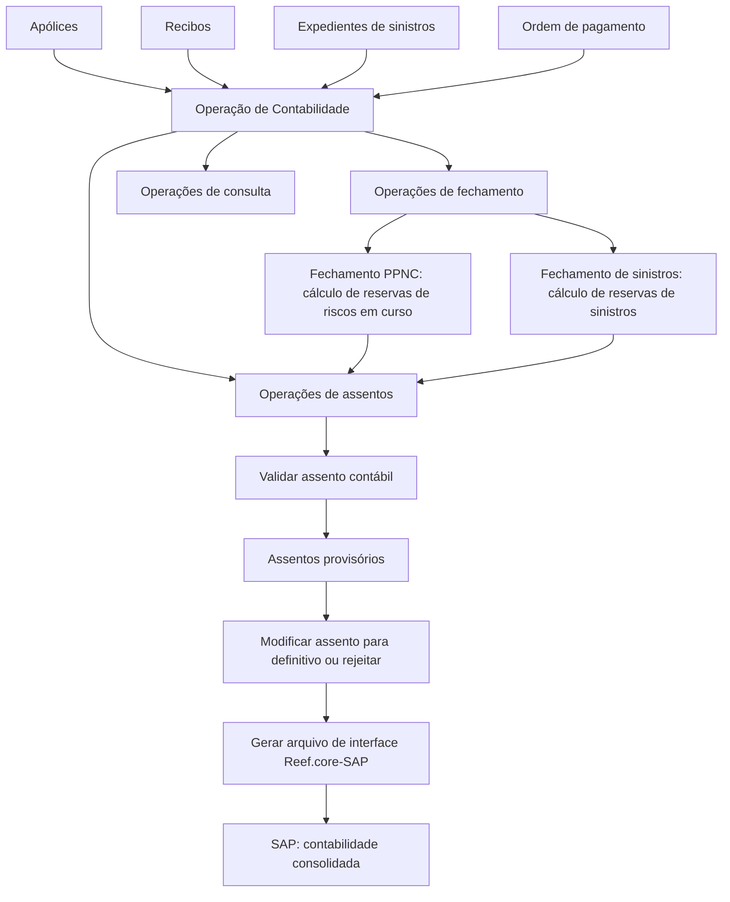
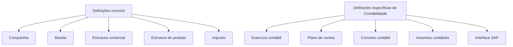

# Módulo de Contabilidade do Reef.core — Conceitos, Configuração, Operações e Integração SAP

## 1. Metadados do Documento
- **Arquivo de Origem:** `Não identificado no conteúdo fornecido`
- **Tipo de Documento:** `Manual Operacional`
- **Domínio / Sistema:** `Reef.core — Módulo de Contabilidade`
- **Público-Alvo:** `Desenvolvedores, Arquitetos, Operação, Negócio`
- **Data/Versão Identificada:** `Não identificada`

---

## 2. Resumo Executivo & Contexto de Negócio

O documento descreve o módulo de Contabilidade do sistema Reef.core. O módulo permite registrar e anotar operações contábeis por períodos denominados exercícios contábeis. A contabilidade consolidada da companhia é realizada em SAP; por isso, o Reef.core gera os movimentos contábeis básicos necessários para disponibilizar ao SAP as informações requeridas para consolidação.

A estrutura contábil apresentada é baseada em exercício contábil, plano de contas, ramos contábeis e assentos contábeis. Cada exercício possui datas de abertura e encerramento, sem obrigação de coincidir com o ano civil. Toda informação contábil é associada ao exercício que estiver aberto.

O plano de contas é definido por companhia e por exercício contábil. Ele possui estrutura piramidal de até cinco níveis, distinguindo níveis de agrupamento (`A`) e níveis de detalhe (`D`). A configuração e a imputação contábil são realizadas nas contas de nível `D`.

Os movimentos financeiros originados por apólices, recibos, expedientes de sinistros e ordens de pagamento alimentam as operações de contabilidade. Essas operações incluem cálculos de fechamento, geração e validação de assentos, consultas aos lançamentos registrados e geração de arquivo de interface entre Reef.core e SAP.

A integração com SAP é uma característica explícita do módulo. Todos os movimentos contábeis do sistema são transferidos para SAP por uma interface já desenvolvida, cuja operação de geração recupera informações dos assentos e cria um arquivo de informação contábil para o sistema SAP.

---

## 3. Arquitetura, Componentes & Tecnologias Envolvidas

### Componentes e entidades identificados

| Componente / Entidade | Papel no módulo de Contabilidade |
| :--- | :--- |
| **Reef.core** | Sistema no qual são gerados os movimentos contábeis básicos e realizadas as operações do módulo de Contabilidade. |
| **SAP** | Sistema que realiza a contabilidade consolidada da companhia e recebe os movimentos contábeis transferidos a partir do Reef.core. |
| **Exercício contábil** | Período temporal aberto no qual as operações e informações contábeis são associadas. |
| **Plano de contas** | Relação das contas necessárias para registrar os movimentos contábeis de uma companhia em determinado exercício. |
| **Conta de nível A** | Nível de agrupamento utilizado para organizar e classificar contas no plano de contas. |
| **Conta de nível D** | Nível de detalhe no qual são definidos os parâmetros das contas e realizada a imputação de informação contábil. |
| **Ramo contábil** | Chave associada à cobertura que a relaciona com a conta em que será realizada a contabilização. |
| **Cobertura** | Elemento associado ao ramo contábil no momento da definição da cobertura no ramo. |
| **Atributo de tipo de veículo** | Critério que pode determinar o ramo contábil de uma cobertura, por exemplo: automóvel, motocicleta ou caminhão. |
| **Assento contábil** | Anotação no livro de contabilidade que registra entrada ou gasto por partida dobrada, com movimentos no Débito e no Crédito. |
| **Interface SAP** | Definição e operação responsáveis pela informação levada ao SAP e pela relação entre dados de Reef.core e SAP. |
| **PPNC** | Processo de provisão de prêmio não consumido, associado ao cálculo de reservas de riscos em curso antes da execução do assento. |
| **RE21** | Componente ou referência por meio do qual os assentos de resseguro são atualmente realizados. O documento não detalha RE21. |

### Fluxo funcional e de integração



### Níveis de definição necessários



> **Nota de Análise:** O documento descreve relações funcionais entre Reef.core, SAP, entradas operacionais, fechamentos e assentos. Não informa protocolos de integração, métodos HTTP, formatos de arquivo, endpoints, credenciais, infraestrutura ou tecnologias de implementação.

---

## 4. Regras de Negócio, Especificações Funcionais & Processos

### 4.1 Exercício contábil

Um exercício contábil é o período de tempo no qual são realizadas as operações contábeis. O período possui:

- uma **data de abertura**, que indica o início do exercício;
- uma **data de encerramento**, que indica o final do exercício.

O exercício contábil não precisa coincidir obrigatoriamente com o ano civil.

#### Cenários de exercício apresentados

1. **Exercício coincidente com o ano civil**
   - Exercício: `2023`
   - Data de abertura: `01/01/2023`
   - Data de encerramento: `31/12/2023`

2. **Exercício compreendido entre dois anos civis**
   - Exercício: `2023-2024`
   - Data de abertura: `01/07/2023`
   - Data de encerramento: `30/06/2024`

3. **Mais de um exercício no mesmo ano civil**
   - Primeiro exercício: `2023-1`
     - Data de abertura: `01/01/2023`
     - Data de encerramento: `30/06/2023`
   - Segundo exercício: `2023-2`
     - Data de abertura: `01/07/2023`
     - Data de encerramento: `31/12/2023`

#### Regras do exercício

- Toda a informação contábil é associada ao exercício que estiver aberto.
- Após cada fechamento de exercício, deve ser definido um novo exercício.
- Cada companhia define o plano de contas por exercício contábil.

### 4.2 Ramo contábil

O ramo contábil é uma chave associada a uma cobertura que a relaciona à conta sobre a qual será feita sua contabilização. A associação entre ramo contábil e cobertura é realizada durante a definição da cobertura no ramo.

O ramo contábil também pode ser determinado pelo valor de algum atributo. No contexto de ramos de automóveis, o documento apresenta o atributo de tipo de veículo como critério de associação, distinguindo automóvel, motocicleta e caminhão.

### 4.3 Plano de contas

O plano de contas é a relação de contas necessárias para registrar os movimentos contábeis de uma companhia. A companhia define seu plano de contas para cada exercício contábil.

A estrutura possui dois tipos de níveis:

- **Nível `A`:** nível de agrupamento, utilizado para organizar e classificar contas.
- **Nível `D`:** nível de detalhe, utilizado para definição dos parâmetros das contas e imputação da informação contábil.

O plano de contas pode possuir até cinco níveis, embora o documento informe que atualmente somente o último nível é obrigatório.

### 4.4 Parâmetros de contas contábeis

Os parâmetros de contas descritos no documento são:

- **Moeda:** embora as contas sejam multimoeda, o parâmetro pode restringir uma conta a apenas uma moeda, como em contas de investimento em moeda específica.
- **Nível 3 da estrutura comercial:** permite limitar uma conta a uma estrutura comercial específica, como contas que somente podem ser movimentadas pela sede central.
- **Terceiro:** indica que a conta deve estar associada a um terceiro; é utilizado, por exemplo, em contas de despesa como a conta de comissões de agentes.
- **Ramo contábil:** determina que os movimentos da conta devem ser processados por ramo contábil; é utilizado em contas de receitas e despesas para análise de receitas por tipo de cobertura.
- **Canal de vendas:** determina que a informação da conta deve incluir o canal de vendas ou fonte de produção, permitindo identificar, por exemplo, vendas por internet ou canal direto.

#### Restrição para contas de receitas e despesas

Todas as contas de receitas e despesas devem informar:

1. a fonte de produção; e
2. o ramo contábil.

### 4.5 Assentos contábeis e partida dobrada

Um assento contábil é a anotação realizada no livro de contabilidade para registrar uma receita ou uma despesa. Cada assento realiza lançamento por partida dobrada, registrando movimentos no Débito e no Crédito.

| Natureza do movimento | Registro indicado |
| :--- | :--- |
| Gasto | Débito |
| Receita | Crédito |

No exemplo de emissão de apólice, a emissão gera prêmio, considerado receita, e recibos para cobrança desse prêmio. Enquanto os recibos da apólice não forem cobrados, o prêmio gera pendência. O registro indicado é:

| Débito | Crédito |
| :--- | :--- |
| Pendente de pagamento | Prêmio emitido |

Nos fechamentos mensais, a informação é extraída para os assentos contábeis, que realizam anotações nas contas definidas para cada tipo de assento.

### 4.6 Classes de assentos contábeis

| Classe de assento | Origem / conteúdo |
| :--- | :--- |
| **Assentos de emissão e anulações** | Gerados a partir de movimentos de apólices: emissões, suplementos de aumento ou redução de prêmio e anulações de apólices. |
| **Assentos de cobrança** | Contêm informações de prêmios cobrados e anulações de cobrança. |
| **Assentos de comissão** | Contêm comissões liquidadas para agentes e reservas de fundos para pagamento de comissões futuras, denominadas provisão de comissões. |
| **Assentos de sinistros** | Contêm informações de sinistros ocorridos antes da data de encerramento, incluindo reservas de sinistros, além de pagamentos de indenizações, honorários e despesas. |
| **Assentos de resseguro** | Contêm informações de resseguro sobre operações de prêmio, pagamentos de sinistros, reserva de prêmio não consumido e reserva de sinistros. O documento informa que esses assentos são atualmente realizados por RE21. |
| **Assentos de provisão de prêmios não consumidos** | Gerados a partir de apólices vigentes, usando a informação de prêmios não consumidos desde a data de encerramento até o fim da vigência da apólice. |

### 4.7 Características do módulo

| Característica | Regra ou comportamento |
| :--- | :--- |
| Informação por exercício | Toda informação contábil é associada ao exercício aberto. |
| Plano de contas piramidal | A companhia define a estrutura do plano de contas, com até cinco níveis; somente o último nível é atualmente obrigatório. |
| Contas multimoeda | As contas podem receber movimentos em qualquer moeda definida no sistema. |
| Apontamentos em moeda estrangeira | Todo lançamento em moeda estrangeira possui seu correspondente valor na moeda do país. |
| Integração com SAP | Todos os movimentos contábeis do sistema são transferidos para SAP por interface já desenvolvida. |

### 4.8 Entradas e saídas do módulo

As entradas identificadas para a operação de contabilidade são:

- Apólices;
- Recibos;
- Expedientes de sinistros;
- Ordem de pagamento.

A saída operacional central é a geração de assentos contábeis e, posteriormente, a geração do arquivo de interface Reef.core-SAP.

### 4.9 Operações suportadas

#### Fechamentos

As operações de fechamento executam cálculos prévios aos assentos contábeis.

| Operação | Finalidade |
| :--- | :--- |
| **Gerar fechamento do processo de provisão de prêmio não consumido (PPNC)** | Calcula reservas de riscos em curso antes da execução do assento. |
| **Gerar fechamento do processo de sinistros** | Calcula reservas de sinistros antes da execução do assento. |

#### Assentos

As operações de assentos registram contabilmente entradas e saídas de movimentos econômicos.

| Operação | Finalidade |
| :--- | :--- |
| **Gerar assento de emissão** | Registra mensalmente movimentos de apólices relativos a novas emissões e suplementos. |
| **Gerar assento de cobranças** | Registra contabilmente o valor de prêmios cobrados e anulações de cobrança no mês. |
| **Gerar assento de prêmios não consumidos** | Registra contabilmente a reserva de riscos em curso. |
| **Gerar assento de provisão de comissão** | Gera lançamento contábil referente a comissões pendentes de liquidação. |
| **Gerar assento de comissões incorridas** | Registra contabilmente comissões pagas a intermediários. |
| **Gerar assento de reservas de sinistros** | Registra provisões de sinistros pelo valor bruto das reservas no fechamento mensal. |
| **Gerar assento de pagamentos de sinistros** | Registra pagamentos realizados no mês para indenizações, honorários e despesas. |
| **Validar assento contábil** | Valida se os assentos estão balanceados e se todos os dados estão corretos para criação como provisórios. |
| **Modificar assento para definitivo** | Permite transformar assentos provisórios em definitivos ou rejeitá-los. |

#### Consultas

| Operação | Finalidade |
| :--- | :--- |
| **Consultar Contabilidade** | Exibe informações dos lançamentos contábeis segundo diferentes critérios. |

#### Interface SAP

| Operação | Finalidade |
| :--- | :--- |
| **Gerar arquivo de interface Reef.core-SAP** | Recupera informações dos assentos e cria arquivo com informação contábil para SAP. |

---

## 5. Tabelas de Parâmetros, Ambientes e Estruturas de Dados

### 5.1 Exemplos de ramo contábil por cobertura

| Cobertura | Ramo contábil |
| :--- | :--- |
| Responsabilidade civil | `100000007` |
| Danos próprios | `100000003` |
| Roubo do veículo | `003030001` |

### 5.2 Exemplos de ramo contábil por atributo de tipo de veículo

| Cobertura | Atributo: Tipo de veículo | Ramo contábil |
| :--- | :--- | :--- |
| Danos próprios | Automóvel | `101401001` |
| Danos próprios | Motocicleta | `101401002` |
| Danos próprios | Caminhão | `101401003` |
| Responsabilidade civil | Automóvel | `101401001` |
| Responsabilidade civil | Motocicleta | `101401002` |

> **Nota de Análise:** O conteúdo fornecido não apresenta um valor de ramo contábil para a combinação “Responsabilidade civil / Caminhão”.

### 5.3 Exemplo de plano de contas por nível

| Nível | Conta | Descrição da conta |
| :--- | :--- | :--- |
| A | `102` | Investimentos financeiros |
| A | `102101` | Investimentos a custo amortizado |
| A | `10210101` | Valores representativos de dívida |
| A | `102101011` | Emitidos por instituições estatais |
| D | `1021010111` | Investimentos Banco Central |
| D | `1021010199` | Investimentos outras entidades estatais |
| A | `102101012` | Emitidos por outras instituições |
| D | `1021010121` | Investimentos Citibank |
| D | `1021010122` | Investimentos BBVA |
| D | `1021010123` | Investimentos FMI |

### 5.4 Parâmetros de contas

| Item / Parâmetro | Descrição / Função | Tipo / Valores / Formato | Ambiente / Observações |
| :--- | :--- | :--- | :--- |
| Moeda | Pode limitar a conta a uma única moeda, embora as contas sejam multimoeda. | Moeda definida no sistema. | Exemplo citado: contas de investimento em moeda específica. |
| Nível 3 da estrutura comercial | Restringe uma conta a uma estrutura comercial específica. | Estrutura comercial. | Exemplo citado: contas movimentadas somente pela sede central. |
| Terceiro | Exige associação da conta a um terceiro. | Indicador de associação a terceiro. | Utilizado em contas de gastos, como comissões de agentes. |
| Ramo contábil | Indica que os movimentos devem ser tratados por ramo contábil. | Chave de ramo contábil. | Utilizado em contas de receitas e despesas. |
| Canal de vendas | Exige canal de vendas ou fonte de produção na informação da conta. | Canal de vendas / fonte de produção. | Permite identificar vendas por internet, canal direto e outros canais. |

### 5.5 Definições comuns e específicas

| Nível de definição | Item | Descrição / Função | Tipo / Valores / Formato | Ambiente / Observações |
| :--- | :--- | :--- | :--- | :--- |
| Comum | Companhia | Define a entidade ou entidades para criação de apólices e demais elementos. | Entidade da companhia. | Necessária para as definições do módulo. |
| Comum | Moeda | Define as divisas com as quais Reef.core realiza operações da companhia. | Moedas definidas no sistema. | Suporta contas multimoeda. |
| Comum | Estrutura comercial | Define a organização territorial da companhia. | Estrutura organizacional comercial. | Pode ser usada como restrição de conta no nível 3. |
| Comum | Estrutura de produto | Define a organização dos ramos comercializados. | Estrutura de produto. | Relacionada às coberturas e ramos. |
| Comum | Imposto | Define obrigações tributárias, características e formas de cálculo. | Tipos de obrigações tributárias. | O documento não detalha fórmulas de cálculo. |
| Contabilidade | Exercício contábil | Define o período em que serão realizadas operações contábeis. | Data de abertura e data de encerramento. | Novo exercício deve ser definido após cada fechamento. |
| Contabilidade | Plano de contas | Define contas da companhia no exercício e parâmetros de cada conta. | Níveis A e D. | Definido por companhia e exercício. |
| Contabilidade | Conceito contábil | Define identificador que agrupa lançamentos para consulta posterior. | Identificador. | O documento não apresenta estrutura ou exemplos de identificadores. |
| Contabilidade | Assentos contábeis | Define tipos e características dos assentos utilizados pela companhia. | Tipos de assento. | Inclui emissão, cobrança, comissão, sinistros, resseguro e provisões. |
| Contabilidade | Interface SAP | Define informação levada ao SAP e relação de dados entre Reef.core e SAP. | Interface de integração. | Não são informados layout, protocolo ou periodicidade de transferência. |

### 5.6 Ambientes, URLs, rotas e logs

| Item / Parâmetro | Descrição / Função | Tipo / Valores / Formato | Ambiente / Observações |
| :--- | :--- | :--- | :--- |
| Ambientes | Não identificados. | Não aplicável. | O documento não lista desenvolvimento, homologação ou produção. |
| URLs | Não identificadas. | Não aplicável. | Não há URLs no conteúdo fornecido. |
| Rotas de logs | Não identificadas. | Não aplicável. | Não há caminhos de logs no conteúdo fornecido. |
| Portas, hosts ou servidores | Não identificados. | Não aplicável. | O documento não descreve infraestrutura técnica. |

---

## 6. Bateria de Perguntas & Respostas para RAG (FAQ Sintético)

### P1: Qual é a finalidade do módulo de Contabilidade do Reef.core?
**R:** O módulo de Contabilidade do Reef.core permite registrar e anotar operações contábeis por exercícios contábeis. O Reef.core gera movimentos contábeis básicos para disponibilizar ao SAP a informação necessária, pois a contabilidade consolidada da companhia é realizada em SAP.

### P2: O exercício contábil precisa coincidir com o ano civil?
**R:** Não. O exercício contábil é definido por uma data de abertura e uma data de encerramento e não precisa coincidir obrigatoriamente com o ano civil. O documento apresenta exemplos de exercício anual, exercício entre dois anos civis e dois exercícios no mesmo ano civil.

### P3: O que acontece após o fechamento de um exercício contábil?
**R:** Após cada fechamento de exercício, deve ser definido um novo exercício contábil. Toda informação contábil é associada ao exercício que estiver aberto.

### P4: Qual é a diferença entre contas de nível A e contas de nível D no plano de contas?
**R:** Contas de nível `A` são níveis de agrupamento usados para organizar e classificar contas da companhia. Contas de nível `D` são níveis de detalhe nos quais são definidos os parâmetros das contas e realizada a imputação da informação contábil.

### P5: Quais informações são obrigatórias em contas de receitas e despesas?
**R:** Todas as contas de receitas e despesas devem ter informados a fonte de produção e o ramo contábil. O canal de vendas representa o canal ou fonte de produção, enquanto o ramo contábil permite analisar movimentos, receitas ou despesas por tipo de cobertura.

### P6: Como o ramo contábil é associado a uma cobertura?
**R:** O ramo contábil é uma chave associada à cobertura que a relaciona à conta na qual será realizada sua contabilização. A associação ocorre no momento da definição da cobertura dentro do ramo. O ramo contábil também pode ser determinado pelo valor de um atributo, como o tipo de veículo segurado.

### P7: Como os gastos e as receitas são registrados nos assentos contábeis?
**R:** Cada assento contábil utiliza partida dobrada e registra movimentos no Débito e no Crédito. Quando o movimento representa gasto, ele é refletido no Débito. Quando representa receita, ele é registrado no Crédito.

### P8: Quais entradas alimentam a operação de Contabilidade?
**R:** O documento identifica quatro entradas para a operação de Contabilidade: apólices, recibos, expedientes de sinistros e ordens de pagamento. Essas entradas são tratadas para gerar assentos contábeis e suas informações podem ser transferidas ao SAP.

### P9: O que faz a operação de validação de assento contábil?
**R:** A operação “Validar Assento Contábil” valida se os assentos contábeis estão balanceados e se todos os dados estão corretos. Quando a validação é concluída, os assentos podem ser criados como provisórios.

### P10: Como um assento provisório se torna definitivo?
**R:** A operação “Modificar Assento a Definitivo” permite transformar assentos provisórios em definitivos. A mesma operação também permite rejeitar os assentos provisórios.

### P11: Para que serve o fechamento do processo de provisão de prêmio não consumido, ou PPNC?
**R:** O fechamento do processo de provisão de prêmio não consumido, identificado como PPNC, realiza o cálculo das reservas de riscos em curso antes da execução do assento contábil correspondente.

### P12: Que informações são incluídas nos assentos de sinistros?
**R:** Os assentos de sinistros incluem informações sobre sinistros ocorridos antes da data de encerramento, relacionadas às reservas de sinistros, e também pagamentos feitos para indenizações, honorários e despesas.

### P13: Como o Reef.core integra dados contábeis com SAP?
**R:** Todos os movimentos contábeis do sistema são transferidos para SAP por uma interface já desenvolvida. A operação “Gerar Arquivo Interface Reef.core-SAP” recupera informações dos assentos e cria um arquivo com informação contábil para SAP.

### P14: O documento informa detalhes técnicos da interface Reef.core-SAP?
**R:** Não. O documento informa que existe uma interface para transferência de movimentos contábeis ao SAP e que ela gera um arquivo a partir de informações dos assentos. Contudo, não informa protocolo, layout do arquivo, campos, frequência de execução, endpoints, autenticação ou mecanismos de tratamento de erro.

---

## 7. Glossário de Termos, Siglas & Conceitos-Chave

- **Assento contábil:** Anotação no livro de contabilidade que registra receita ou despesa por meio de partida dobrada no Débito e no Crédito.
- **Canal de vendas:** Canal de venda ou fonte de produção que deve compor a informação de determinadas contas, permitindo distinguir, por exemplo, internet e canal direto.
- **Cobertura:** Elemento ao qual pode ser associado um ramo contábil para determinar a conta de contabilização.
- **Conta de nível A:** Conta de agrupamento utilizada para organizar e classificar contas no plano de contas.
- **Conta de nível D:** Conta de detalhe na qual são definidos parâmetros e realizada imputação da informação contábil.
- **Conceito contábil:** Identificador que agrupa lançamentos contábeis para consulta posterior.
- **Débito / Debe:** Lado do assento contábil utilizado, segundo o documento, para refletir gastos.
- **Exercício contábil:** Período delimitado por datas de abertura e encerramento no qual são realizadas operações contábeis.
- **Haber / Crédito:** Lado do assento contábil utilizado, segundo o documento, para registrar receitas.
- **Imputação contábil:** Registro ou atribuição da informação contábil em contas de nível de detalhe.
- **Interface SAP:** Definição e mecanismo de geração de informação contábil do Reef.core destinada ao SAP.
- **Moeda do país:** Moeda na qual deve existir valor correspondente para cada lançamento realizado em moeda estrangeira.
- **Partida dobrada:** Forma de registro em que cada assento contém movimentos no Débito e no Crédito.
- **Plano de contas:** Relação de contas necessárias para registrar movimentos contábeis de uma companhia.
- **PPNC:** Processo de provisão de prêmio não consumido; realiza cálculo de reservas de riscos em curso antes da execução do assento correspondente.
- **Prêmio não consumido:** Informação gerada a partir de apólices vigentes, considerando o período entre a data de encerramento e o final da vigência da apólice.
- **Ramo contábil:** Chave associada à cobertura ou a atributo de cobertura que relaciona a movimentação à conta de contabilização.
- **RE21:** Referência pela qual os assentos de resseguro são atualmente realizados. O documento não apresenta expansão da sigla nem detalhamento funcional ou técnico.
- **Reserva de sinistros:** Reserva relacionada a sinistros ocorridos antes da data de encerramento.
- **Reserva de riscos em curso:** Reserva calculada no fechamento de provisão de prêmio não consumido e contabilizada pelo assento de prêmios não consumidos.
- **SAP:** Sistema no qual é realizada a contabilidade consolidada da companhia, conforme o documento.
- **Terceiro:** Entidade à qual uma conta pode ser obrigatoriamente associada; o documento cita contas de comissões de agentes como exemplo.
- **Fonte de produção:** Informação que identifica a origem produtiva ou canal de venda vinculada às contas de receitas e despesas.

---

## 8. Notas Críticas, Riscos & Limitações

- A integração com SAP é descrita apenas em nível funcional. O documento não informa layout do arquivo, frequência de geração, protocolo de transmissão, campos de integração, autenticação, tratamento de erros ou mecanismos de reconciliação.
- O documento não apresenta URLs, ambientes, servidores, portas, rotas de log, variáveis de configuração ou procedimentos de monitoramento operacional.
- A interface SAP depende de assentos contábeis para recuperar informações e gerar o arquivo de integração. A qualidade e a validação dos assentos são, portanto, condições relevantes para a qualidade da informação enviada ao SAP.
- A operação de validação é necessária para verificar que os assentos estão balanceados e que os dados estão corretos antes da criação como provisórios. O documento não detalha as regras de balanceamento nem os critérios específicos de validação.
- Todas as informações contábeis são associadas ao exercício aberto; a ausência de definição de novo exercício após um fechamento pode impedir a associação de novas operações ao período contábil adequado.
- Todas as contas de receitas e despesas devem informar fonte de produção e ramo contábil. Configurações incompletas desses atributos podem comprometer a classificação e a análise contábil.
- Embora o módulo suporte contas multimoeda, lançamentos em moeda estrangeira exigem valor correspondente na moeda do país. O documento não detalha fontes de câmbio, regras de conversão ou datas de cotação.
- Assentos de resseguro são atualmente realizados por RE21, mas o documento não descreve o componente, sua responsabilidade operacional, seu fluxo de dados ou sua integração com o módulo de Contabilidade.
- O plano de contas pode ter até cinco níveis, mas apenas o último nível é atualmente obrigatório. O documento não especifica regras de validação para hierarquias incompletas, nomenclatura ou codificação das contas.
- O documento não detalha permissões, perfis de acesso, segregação de funções, trilhas de auditoria, processos de aprovação ou controles para rejeição de assentos.

---

## 9. Conteúdo Bruto Estruturado (Referência Fiel)

```text
--- [PÁGINA 1 DE 11] ---

INTRODUCCIÓN - Módulo Contabilidad
Objetivo
Este módulo permite registrar y anotar operaciones contables por períodos.
Actualmente la contabilidad consolidada de la compañía se realiza en SAP, por tanto, en Reef.core
se generan los movimientos contables básicos para poder obtener la información que necesita SAP.
En este documento se abordarán los siguientes puntos:
Conceptos principales
Características
Entradas y salidas
Definiciones
Operaciones soportadas
Conceptos principales
Ejercicio
Ramo contable
Plan de cuentas
Asientos
Ejercicio
 / 
 RS
Inicio Soluciones APIs Documentación Zeus
ES


--- [PÁGINA 2 DE 11] ---

El período de tiempo en el que se realizan las operaciones contables, se denomina ejercicio.
El período que comprende cada ejercicio se identifica con una fecha de apertura, que indica la fecha
en la que inicia el ejercicio contable, y una fecha de cierre que indica la fecha en la que finaliza el
ejercicio contable.
Este período no tiene que coincidir obligatoriamente con el año natural.
Ejemplo:
• El ejercicio coincide con el año natural
Para el ejemplo suponemos que el año natural es 2023.
2023
Fecha apertura:
01/01/2023
Fecha cierre:
31/12/2023
• El ejercicio está entre dos años naturales
Para el ejemplo suponemos que el período contempla el segundo semestre del año 2023 y el primer
semestre del año 2024.
2023-2024
Fecha apertura:
01/07/2023
Fecha cierre:
30/06/2024
• Si hay más de un ejercicio en el mismo año natural
Para el ejemplo suponemos que el año natural es 2023 y que existen dos ejercicios, uno que
comprende el primer semestre y el segundo que comprende el segundo semestre.
1. Primer ejercicio
2023-1
Fecha apertura:
01/01/2023
Fecha cierre:
30/06/2023
1. Segundo ejercicio


--- [PÁGINA 3 DE 11] ---

2023-2
Fecha apertura:
01/07/2023
Fecha cierre:
31/12/2023
Ramo contable
Se trata de una clave, asociada a la cobertura, que la relaciona con la cuenta sobre la que se va a
realizar su contabilización. La asociación del ramo contable con la cobertura se realiza en el
momento de la definición de la cobertura en el ramo.
Ejemplo ramo contable por cobertura:
COBERTURA RAMO
CONTABLE
Responsabilidad civil 100000007
Daños propios 100000003
Robo del vehículo 003030001
Además, se permite determinar el ramo contable de una cobertura por el valor de algún atributo, por
ejemplo, en ramos de autos, se puede asociar a un atributo que identifique si el tipo de vehículo
asegurado es un automóvil, una motocicleta, un camión, etc.
Ejemplo ramo contable por atributo:
COBERTURA ATRIBUTO TIPO
DE VEHÍCULO
RAMO
CONTABLE
Daños Propios Automóvil 101401001
Daños Propios Motocicleta 101401002
Daños Propios Camión 101401003
Responsabilidad civil Automóvil 101401001


--- [PÁGINA 4 DE 11] ---

COBERTURA ATRIBUTO TIPO
DE VEHÍCULO
RAMO
CONTABLE
Responsabilidad civil Motocicleta 101401002
Plan de cuentas
Es la relación de las cuentas que son necesarias para registrar los movimientos contables de una
compañía.
Cada compañía define su plan de cuentas por ejercicio contable, pudiendo definir 2 tipos de niveles:
A: Niveles de agrupación
D: Nivel de detalle
El nivel A se utiliza para organizar y clasificar las cuentas de la compañía.
La definición de los parámetros de las cuentas, así como la imputación de la información contable se
realizan sobre las cuentas de nivel D.
Ejemplo definición de cuentas por nivel:
NIVEL CUENTA DESCRIPCIÓN CUENTA
A 102 Inversiones financieras
A 102101 Inversiones a costo amortizado
A 10210101 Valores representativos de deuda
A 102101011 Emitidos por instituciones estatales
D 1021010111 Inversiones Banco Central
D 1021010199 Inversiones otras entidades estatales
A 102101012 Emitidos por otras instituciones
D 1021010121 Inversiones Citibank
D 1021010122 Inversiones BBVA


--- [PÁGINA 5 DE 11] ---

NIVEL CUENTA DESCRIPCIÓN CUENTA
D 1021010123 Inversiones FMI
Principales parámetros de las cuentas:
Moneda
Aunque las cuentas son multimoneda, por medio de este parámetro se puede limitar la cuenta a
una sola moneda. Por ejemplo, para cuentas de inversión en una moneda específica.
Nivel 3 de la estructura comercial
Se puede limitar la cuenta a una estructura comercial específica. Por ejemplo, para cuentas
contables que solo pueden ser manejadas desde la oficina central.
Tercero
Mediante este parámetro se indica que la cuenta tiene que estar asociada a un tercero. Se utiliza
en cuentas de gastos, como puede ser la cuenta de comisiones de los agentes.
Ramo contable
Indica que los movimientos de la cuenta van por ramo contable. Se utiliza en cuentas de
ingresos y gatos, por ejemplo, cuentas para analizar los ingresos por determinado tipo de
cobertura.
Canal de ventas
Indica que la información de la cuenta debe incluir el canal de venta o fuente de producción. De
esta forma se pueden identificar por ejemplo las ventas por internet o por canal directo, etc.
Todas las cuentas de ingresos y gastos deben llevar informados la fuente de producción y el ramo
contable.
Asientos
Es la anotación que se realiza en el libro de contabilidad para registrar un ingreso o un gasto. Cada
asiento contable realiza un apunte por partida doble, registrando los movimientos en el Debe y el
Haber.
Cuando se trata de un gasto se refleja en el Debe
Cuando es un ingreso se registra en el Haber


--- [PÁGINA 6 DE 11] ---

Por ejemplo, cuando se emite una póliza se genera la prima, que se considera un ingreso, y los
recibos para cobrar dicha prima, mientras los recibos de la póliza no se cobren, esta prima genera un
pendiente. El registro de este movimiento en la contabilidad quedaría de la siguiente forma:
DEBE HABER
Pendiente de pago Prima emitida
En los cierres mensuales, se extrae la información para los asientos contables, que realizan las
anotaciones en las cuentas definidas para cada uno de ellos.
Los asientos contables se clasifican en función del origen de la información que contienen.
Clases de asiento:
Asientos de emisión y anulaciones
Se generan a partir de los movimientos de pólizas, tanto de emisión, como suplementos de
aumento o disminución de prima y de anulaciones de pólizas.
Asientos de cobro
Contiene la información de las primas cobradas y anulados de cobro.
Asientos de comisión
Son asientos que contienen las comisiones liquidadas a los agentes y asientos que contienen la
reserva de fondos para el pago de comisiones futuras (provisión de comisiones).
Asientos de siniestros
Son asientos que contienen la información de los siniestros ocurridos antes de la fecha de cierre
(reservas de siniestros) y también, asientos que contienen los pagos realizados por
indemnizaciones, honorarios y gastos.
Asientos de reaseguro
Estos asientos contienen la información correspondiente al reaseguro de los movimientos de
operaciones de prima, de pagos de siniestros, así como de reserva de prima no consumida y
reserva de siniestros. Actualmente estos asientos se realizan por RE21.
Asientos de provisión de primas no consumidas
Se genera a partir de pólizas vigentes, tomando la información de las primas no consumidas
desde la fecha de cierre al final de la vigencia de la póliza.
Características
Información por ejercicio
Plan de cuentas piramidal


--- [PÁGINA 7 DE 11] ---

Cuentas multimoneda
Integración con SAP
Información por ejercicio
Toda la información contable va asociada al ejercicio que esté abierto.
Plan de cuentas piramidal
Cada compañía se define la estructura de su plan de cuentas, pudiendo tener hasta 5 niveles,
aunque actualmente solo es obligatorio el último nivel.
Cuentas multimoneda
Las cuentas permiten movimientos en cualquier moneda, siempre que esté definida en el sistema.
Todos los apuntes en moneda extranjera llevan su correspondiente importe en moneda del país.
Integración con SAP
Todos los movimientos contables del sistema se traspasan a SAP. Existe una interfaz, ya
desarrollada, para estos traspasos.
Entradas/Salidas
Pólizas
Recibos
Expedientes de siniestros
Orden Pago
OPERACIÓN
DE
CONTABILIDAD
Asientos contables
Definiciones
Para poder trabajar con el módulo de contabilidad es necesario que previamente se realicen
definiciones de los distintos elementos.
Estas definiciones están englobadas en los siguientes niveles:


--- [PÁGINA 8 DE 11] ---

NIVELES DE DEFINICIÓN
COMÚN CONTABILIDAD
COMÚN
En este nivel se encuentran definiciones que no pertenecen
exclusivamente al módulo de contabilidad, pero son necesarias para
poder realizar la definición de dicho módulo
COMPAÑÍA
Definición de la entidad o entidades con las
que se van a crear las pólizas y por
consiguiente el resto de elementos
MONEDA
Definición de las divisas con las que
Reef.core va a realizar las distintas
operaciones de la compañía
ESTRUCTURA COMERCIAL
Definición de como se va a establecer la
organización territorial de la compañía
ESTRUCTURA PRODUCTO
Definición de como estarán organizados los
ramos que se comercializan
IMPUESTO
Definir los tipos de obligaciones tributarias
que se deben tener en cuenta, así como sus
características y formas de cálculo
CONTABILIDAD
Definiciones específicas del módulo de Contabilidad
EJERCICIO CONTABLE
 PLAN DE CUENTAS


--- [PÁGINA 9 DE 11] ---

Se define el periodo de tiempo en el que se
realizarán las operaciones contables.
Después de cada cierre de ejercicio se debe
definir el nuevo ejercicio
Definición de las cuentas utilizadas por la
compañía dentro del ejercicio contable y los
parámetros correspondientes a cada cuenta
CONCEPTO CONTABLE
Se define el identificador que agrupa los
apuntes contables para su posterior consulta
ASIENTOS CONTABLES
Definición de los tipos y características de los
asientos contables con los que trabajará la
compañía
INTERFAZ SAP
Definición de la información que se llevará a
SAP así como la relación de los datos de
ambos sistemas
Operaciones soportadas
El módulo de contabilidad dispone de las siguientes operaciones que se muestran agrupadas según
el criterio de la siguiente figura.
AGRUPACIÓN DE OPERACIONES
CIERRES ASIENTOS CONSULTAS INTERFAZ SAP
CIERRES
Operaciones que realizan cálculos previos a los asientos contables
GENERAR Cierre proceso provisión prima
no consumida (PPNC)
Realiza el cálculo de las reservas de riesgos
en curso previo a la ejecución del asiento
GENERAR Cierre proceso siniestros
Realiza el cálculo de las reservas de
siniestros previo a la ejecución del asiento


--- [PÁGINA 10 DE 11] ---

ASIENTOS
Operaciones enfocadas a registrar en la contabilidad las entradas y
salidas de los distintos movimientos económicos
GENERAR Asiento de emisión
Realiza la anotación contable mensual de
movimientos de póliza correspondientes a
nuevas emisiones y suplementos
GENERAR Asiento de cobros
Realiza la anotación contable por el importe
de primas cobradas y anulados de cobro en el
mes
GENERAR Asiento de primas no
consumidas
Corresponde a la anotación contable de la
reserva de riesgos en curso
GENERAR Asiento de provisión de
comisión
Genera la anotación contable correspondiente
a las comisiones pendientes de liquidar
GENERAR Asiento de comisiones
devengadas
Corresponde a la anotación contable de las
comisiones pagadas a intermediarios
GENERAR Asiento de reservas de
siniestros
Realiza la anotación contable correspondiente
a provisiones de siniestros por el importe
bruto de las reservas al cierre de mes
GENERAR Asiento de pagos de siniestros
Corresponde a la anotación contable de
pagos de siniestros realizados por
indemnizaciones, honorarios y gastos en el
mes.
VALIDAR Asiento contable
Proceso que valida que los asientos contables
están cuadrados y todos los datos son
correctos para crearlos como provisionales
MODIFICAR Asiento a definitivo
Esta operación permite pasar los asientos
provisionales a definitivos o bien rechazarlos


--- [PÁGINA 11 DE 11] ---

CONSULTAS
Operaciones por las que se puede ver la información registrada
CONSULTAR Contabilidad
Muestra la información de los apuntes contables por distintos criterios
INTERFAZ SAP
Operaciones que generan información para integrar con otros sistemas
GENERAR Archivo interfaz Reef.core-SAP
Recupera información de los asientos y crea archivo con información contable para SAP
```
