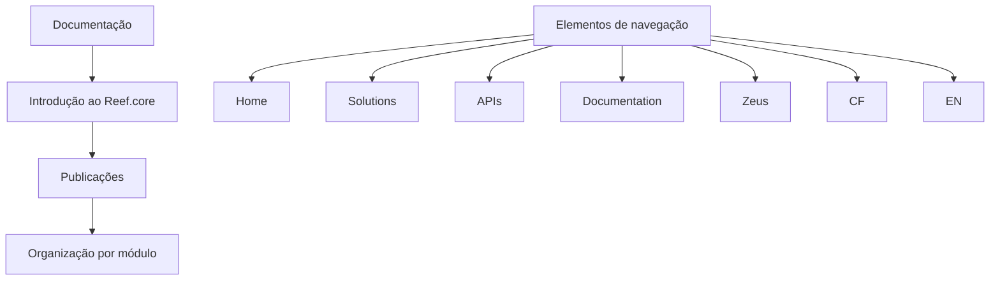

# Documentação de Introdução ao Reef.core e seus Módulos

## 1. Metadados do Documento
- **Arquivo de Origem:** Não identificado
- **Tipo de Documento:** Manual Operacional
- **Domínio / Sistema:** Reef.core
- **Público-Alvo:** Não identificado
- **Data/Versão Identificada:** Não identificada

---

## 2. Resumo Executivo & Contexto de Negócio

O conteúdo apresenta uma introdução ao sistema **Reef.core** e aos seus módulos. A organização das publicações é indicada como segmentada por módulo.

O documento também referencia uma área de documentação acessível por uma estrutura de navegação que contém os termos **Home**, **Solutions**, **APIs**, **Documentation**, **Zeus**, **CF** e **EN**.

Não há detalhamento sobre objetivos funcionais, arquitetura, responsáveis, integrações, tecnologias, regras de negócio ou procedimentos operacionais do Reef.core.

> **Nota de Análise:** O conteúdo fornecido é predominantemente introdutório e não descreve funcionalidades, contratos de APIs, métodos HTTP, estruturas de dados ou fluxos técnicos dos módulos Reef.core.

---

## 3. Arquitetura, Componentes & Tecnologias Envolvidas

Os únicos elementos explicitamente identificados são:

- **Reef.core:** sistema ou domínio introduzido pelo documento.
- **Módulos:** unidades pelas quais as publicações do Reef.core são divididas.
- **Documentation:** item de navegação associado ao conteúdo.
- **APIs:** item de navegação mencionado, sem especificação de APIs.
- **Zeus:** termo presente na navegação, sem definição adicional.
- **CF:** termo presente na navegação, sem definição adicional.
- **EN:** termo presente na navegação, possivelmente identificador de idioma, sem confirmação textual.



> **Nota de Análise:** O diagrama representa exclusivamente a relação documental explicitada no conteúdo. O documento não descreve uma arquitetura de software, integrações entre sistemas ou fluxo de dados.

---

## 4. Regras de Negócio, Especificações Funcionais & Processos

1. O documento contém uma seção de introdução ao **Reef.core** e aos diferentes módulos.
2. As publicações relacionadas ao Reef.core são divididas por módulo.
3. Não foram identificadas regras de cálculo, critérios de validação, permissões, exceções, jornadas operacionais ou especificações funcionais adicionais.

---

## 5. Tabelas de Parâmetros, Ambientes e Estruturas de Dados

| Item / Parâmetro | Descrição / Função | Tipo / Valores / Formato | Ambiente / Observações |
| :--- | :--- | :--- | :--- |
| Reef.core | Sistema ou domínio apresentado na introdução | Nome próprio | Não há detalhes técnicos adicionais |
| Módulos | Unidades usadas para dividir as publicações | Organização documental | Os nomes dos módulos não foram informados |
| Documentation | Item de navegação mencionado | Texto de navegação | Sem URL ou descrição funcional |
| APIs | Item de navegação mencionado | Texto de navegação | Não há contratos, endpoints ou métodos descritos |
| Zeus | Termo exibido na navegação | Nome/identificador não definido | Sem detalhamento adicional |
| CF | Termo exibido na navegação | Sigla não definida | Sem detalhamento adicional |
| EN | Termo exibido na navegação | Sigla/identificador não definido | Sem detalhamento adicional |
| Home | Item de navegação mencionado | Texto de navegação | Sem URL ou descrição funcional |
| Solutions | Item de navegação mencionado | Texto de navegação | Sem URL ou descrição funcional |

---

## 6. Bateria de Perguntas & Respostas para RAG (FAQ Sintético)

### P1: Qual sistema é introduzido no documento?
**R:** O documento introduz o sistema ou domínio denominado **Reef.core**.

### P2: Como as publicações do Reef.core são organizadas?
**R:** As publicações do Reef.core são divididas por módulo, conforme declarado no conteúdo: “Las publicaciones están divididas por módulo”.

### P3: Quais módulos do Reef.core são descritos no documento?
**R:** O documento afirma que há diferentes módulos, mas não informa os nomes, responsabilidades ou características desses módulos.

### P4: O documento descreve a arquitetura técnica do Reef.core?
**R:** Não. O conteúdo apenas apresenta uma introdução ao Reef.core e informa que as publicações são organizadas por módulo. Não há descrição de componentes técnicos, integrações, bancos de dados, protocolos ou tecnologias.

### P5: Existem APIs documentadas no conteúdo fornecido?
**R:** O termo **APIs** aparece como item de navegação, mas o documento não fornece endpoints, métodos HTTP, contratos, autenticação, parâmetros ou exemplos de requisição e resposta.

### P6: O que significa Zeus no contexto do documento?
**R:** O termo **Zeus** aparece na estrutura de navegação, mas não possui definição ou explicação adicional no conteúdo fornecido.

### P7: O que significa a sigla CF no documento?
**R:** A sigla **CF** é exibida na navegação, porém o documento não explica seu significado.

### P8: Há informações sobre ambientes, servidores ou URLs?
**R:** Não. O conteúdo não apresenta URLs, endereços de servidores, nomes de ambientes, portas, credenciais ou parâmetros de implantação.

### P9: O documento define regras de negócio para Reef.core?
**R:** Não foram identificadas regras de negócio, validações, cálculos ou condições funcionais. O material possui caráter exclusivamente introdutório.

### P10: Existe uma versão ou data identificada para o documento?
**R:** Não. Nenhuma data, versão, autoria ou histórico de revisão foi identificada no conteúdo fornecido.

---

## 7. Glossário de Termos, Siglas & Conceitos-Chave

- **Reef.core:** Sistema ou domínio apresentado na introdução do documento.
- **Módulo:** Unidade usada para organizar as publicações relacionadas ao Reef.core.
- **APIs:** Termo exibido como item de navegação; o documento não fornece sua definição operacional ou técnica.
- **CF:** Sigla exibida no conteúdo, sem significado definido.
- **EN:** Sigla ou identificador exibido no conteúdo, sem significado definido.
- **Zeus:** Termo exibido na navegação, sem definição no conteúdo.
- **Documentation:** Item de navegação que faz referência à documentação.

---

## 8. Notas Críticas, Riscos & Limitações

- O conteúdo é insuficiente para documentar a arquitetura técnica do Reef.core.
- Não há identificação de arquivo, autor, data, versão ou público-alvo.
- Não há descrição dos módulos mencionados.
- Não há contratos de APIs, endpoints, modelos de dados, parâmetros, ambientes ou procedimentos.
- Os termos **Zeus**, **CF** e **EN** não possuem definição contextual no material fornecido.
- A interpretação de elementos de navegação foi mantida restrita à sua presença textual; não foram inferidas URLs, tecnologias ou responsabilidades.

---

## 9. Conteúdo Bruto Estruturado (Referência Fiel)

```text
--- [PÁGINA 1 DE 2] ---

INTRODUCCIÓN
 En este apartado se encuentra la publicación de la introducción a Reef.core y a los distintos
Módulos.
INTRODUCCIÓN Reef.core
Las publicaciones están divididas por módulo:
 
 
 
 / 
 CF
Home Solutions APIs Documentation Zeus
EN


--- [PÁGINA 2 DE 2] ---

[Página em branco ou apenas elementos visuais/imagem]
```
