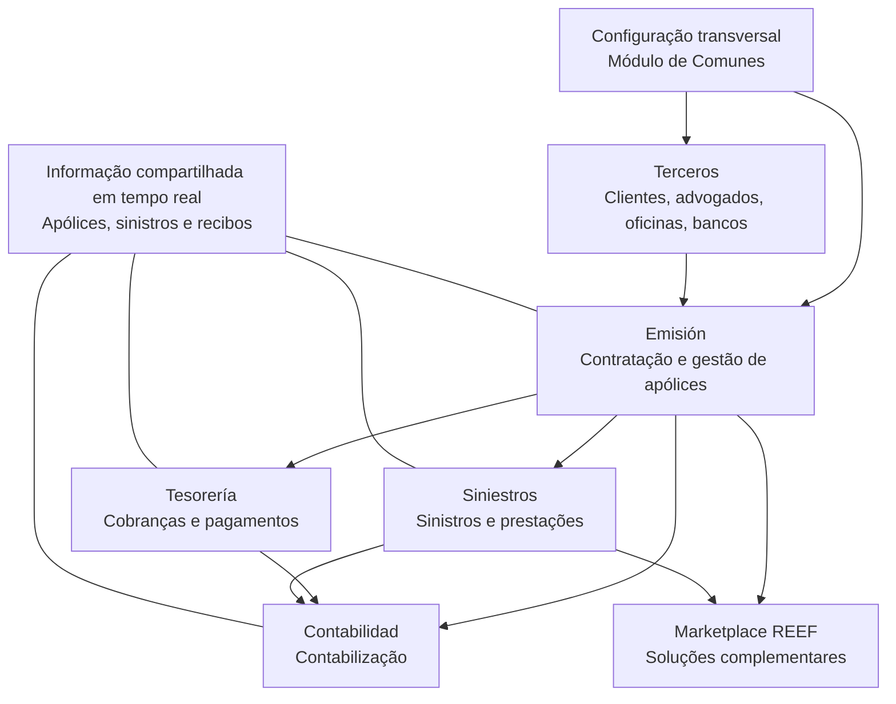

# Reef.core — Introdução, Capacidades, Modularidade e Integrações do Marketplace REEF

## 1. Metadados do Documento
- **Arquivo de Origem:** Não identificado no conteúdo fornecido
- **Tipo de Documento:** Apresentação Executiva
- **Domínio / Sistema:** Reef.core / Plataforma REEF / Gestão de Seguros MAPFRE
- **Público-Alvo:** Negócio, Arquitetos, Desenvolvedores, Operação e entidades seguradoras MAPFRE
- **Data/Versão Identificada:** Outubro de 2023, para a relação de integrações Marketplace REEF

---

## 2. Resumo Executivo & Contexto de Negócio

Reef.core é apresentado como uma solução integral para gestão de seguros, orientada a permitir que entidades MAPFRE administrem o ciclo de vida completo de apólices. O escopo funcional declarado cobre emissão e subscrição de apólices, cobrança de recibos, gestão de sinistros, gestão de prestações e contabilização de prêmios.

A evolução da solução remonta a 1989, com Tronador, passando por Tron2000, TronWeb, WebTronWeb, TRON21 e NewTron, até a denominação Reef.core em 2022. O documento associa Reef.core a uma evolução SaaS, mas não detalha a arquitetura técnica, modelo de implantação, interfaces ou mecanismos operacionais específicos dessa evolução.

A solução é caracterizada como corporativa, consolidada geográfica e temporalmente, implementada por e para MAPFRE e enriquecida pelo conhecimento funcional de diferentes países. A presença internacional citada inclui países da América Latina, Espanha, Estados Unidos, Malta, Turquia, Filipinas e Panamá. O documento ressalta que Filipinas deixou de utilizar o sistema por estar fora do perímetro do Grupo MAPFRE.

Reef.core é modular, porém totalmente integrada: os módulos compartilham em tempo real informações sobre apólices, sinistros e recibos. A flexibilidade é baseada em parâmetros configuráveis, definição de produtos, processos, regras de negócio, constantes e listas de valores. Para uso local, as entidades devem configurar processos e produtos; quando a funcionalidade padrão não atender integralmente às necessidades locais, o código-fonte pode ser configurado e personalizado.

O documento também posiciona Reef.core como núcleo integrado a soluções do Marketplace REEF. As integrações citadas ampliam capacidades de subscrição, precificação, comunicação, gestão documental, sinistros, pagamentos, identificação biométrica, assinatura eletrônica, inspeção veicular e outros processos relacionados ao negócio segurador.

---

## 3. Arquitetura, Componentes & Tecnologias Envolvidas

### Componentes funcionais de Reef.core

| Componente / Módulo | Responsabilidade declarada |
| :--- | :--- |
| **Comunes** | Realiza a configuração transversal aplicável a todos os módulos. |
| **Terceros** | Configura e gerencia clientes e outras figuras, como advogados, oficinas e bancos. |
| **Emisión** | Realiza a contratação e a gestão de apólices. |
| **Siniestros** | Realiza a gestão de sinistros e respectivas prestações. |
| **Tesorería** | Realiza a gestão financeira de cobranças e pagamentos. |
| **Contabilidad** | Realiza a contabilização. |
| **Marketplace REEF** | Disponibiliza soluções complementares que estendem a funcionalidade do núcleo Reef.core. |

### Fluxo funcional integrado



### Características arquiteturais e operacionais declaradas

- Reef.core é uma solução **multi companhia**, permitindo configurar mais de uma entidade seguradora na mesma plataforma.
- Reef.core é uma solução **multi país**.
- Reef.core é uma solução **multi moeda**, permitindo subscrição e gestão de apólices em US$ Dólares, Euros, Francos Suíços e outras moedas conforme a configuração.
- Reef.core é uma solução **multi idioma**, com literais declarados de fábrica em Espanhol e Inglês.
- A apresentação de informações nas telas ocorre conforme os acessos e papéis atribuídos aos usuários.
- Reef.core contempla o ciclo de vida da apólice de ponta a ponta: contratação, contabilização de prêmios, gestão de sinistros e demais atividades correlatas.
- Reef.core permite definir produtos, processos, regras de negócio, cálculo de prêmios e tarefas para processos de gestão de sinistros e prestações.
- Reef.core suporta múltiplas linhas de negócio: Vida, Não Vida, produtos individuais e produtos coletivos.

> **Nota de Análise:** O documento descreve capacidades funcionais e módulos, mas não especifica tecnologias de implementação, protocolos de integração, métodos HTTP, APIs, bancos de dados, infraestrutura, topologia de ambientes ou contratos de dados.

---

## 4. Regras de Negócio, Especificações Funcionais & Processos

### 4.1 Ciclo de vida de seguros

A solução contempla processos associados ao ciclo de vida de uma apólice, incluindo:

1. Contratação de apólices.
2. Emissão e subscrição de apólices.
3. Cobrança de recibos.
4. Gestão financeira de cobranças e pagamentos.
5. Gestão de sinistros.
6. Gestão de prestações relacionadas a sinistros.
7. Contabilização de prêmios.
8. Contabilização de operações.

### 4.2 Gestão orientada a produto

A solução é centrada no produto e cita, entre outros, os seguintes tipos de seguros:

- Seguro de Saúde.
- Seguro de Automóveis.
- Seguro de Lar.
- Seguro de Comércios.
- Seguro Todo Risco de Automóveis.

A definição de produtos e processos permite configurar:

- Regras de negócio de cada produto.
- Regras de cálculo de prêmios.
- Tarefas de processos de gestão de sinistros.
- Tarefas de processos de prestações.
- Produtos pré-configurados para uso pelos países.

### 4.3 Gestão de clientes e terceiros

Reef.core permite:

- Identificação única de clientes.
- Gestão centralizada de clientes.
- Classificação de pessoas físicas e jurídicas conforme atividades atribuídas.
- Gestão de agentes, segurados, fornecedores, advogados, oficinas, bancos e outras figuras.
- Gestão reforçada de coletivos.
- Identificação e gestão de terceiros como fornecedores.
- Gestão e acompanhamento de Incidências, Queixas, Reclamações e Felicitações de clientes, também denominadas **I.Q.R.F.**

### 4.4 Comercialização e canais

A solução é descrita como omnicanal para comercialização de apólices, incluindo:

- Contratação telefônica.
- Contratação via Web.
- Contratação por intermédio de agente de seguros.
- Contratação em plataforma de banca seguros.

### 4.5 Configuração por parâmetros

Os parâmetros são valores configurados manualmente que afetam o comportamento do sistema. A parametrização permite:

- Controlar aspectos dos módulos, processos, funcionalidades e interface da solução.
- Configurar características dos elementos principais dos módulos.
- Definir como clientes são identificados no sistema.
- Definir classificações de produtos.
- Definir numeração de sinistros.
- Representar e definir regras de negócio.
- Definir constantes.
- Definir listas de valores.

### 4.6 Exemplos de regras e restrições configuráveis

| Regra / Condição | Efeito declarado |
| :--- | :--- |
| Marca de veículo igual a FERRARI ou ASTON MARTIN | Pode restringir temporalmente a emissão de apólice de Seguro de Automóveis. |
| Pessoa com menos de 18 anos | Pode impedir o seguro de uma pessoa no Seguro de Saúde. |
| Alteração de valoração do sinistro | Pode exigir ou não a solicitação do motivo da alteração. |
| Formato da data de efeito em emissão de apólices ou suplementos | Pode mostrar por padrão 24:00 ou 12:00 horas para seguros configurados dessa forma. |
| Múltiplas contas ou cartões para um terceiro | Pode permitir ou não o cadastro de múltiplas contas correntes, cartões de crédito ou débito. |

### 4.7 Adaptação local

Para operar localmente o sistema, as entidades devem:

1. Configurar diretamente na solução os processos conforme necessidades operacionais locais.
2. Configurar produtos de acordo com necessidades operacionais locais.
3. Configurar e personalizar o código-fonte quando a funcionalidade padrão não cobrir, ou cobrir apenas parcialmente, as necessidades locais.

> **Nota de Análise:** O documento informa que a introdução da Plataforma REEF está sendo considerada para modificar tecnicamente esse comportamento a médio prazo, mas não detalha qual comportamento será modificado, cronograma, arquitetura-alvo ou critérios de migração.

---

## 5. Tabelas de Parâmetros, Ambientes e Estruturas de Dados

### 5.1 Evolução de versões

| Ano | Denominação | Aplicação / Característica |
| :--- | :--- | :--- |
| 1989 | Tronador | Adaptação do sistema de procedência da Argentina / RS. |
| 1993 | Tron2000 | Reengenharia, redesenho e evolução funcional. |
| 2002 | TronWeb | Frontal Java. |
| 2007 | TRON21 | Adaptação de back-end para MAPFRE Espanha. |
| 2009/2010 | WebTronWeb | HTML. |
| 2017 | NewTron | Reengenharia, redesenho e evolução funcional. |
| 2022 | Reef.core | Nomenclatura e evolução SaaS. |

### 5.2 Presença internacional

| Período | Países / Referências |
| :--- | :--- |
| Até 1990 | Argentina |
| 1990–2000 | Espanha — Mutral, Reale Mutua; México; Peru; Espanha — Mutua Valenciana de Taxis; Chile; Porto Rico; Venezuela; Portugal; Colômbia |
| 2000–2010 | Paraguai; República Dominicana; Estados Unidos; Espanha — MAPFRE Tron21 |
| 2010–2020 | Costa Rica; Uruguai; Nicarágua; Guatemala; Malta; Turquia; Filipinas; Honduras; El Salvador |
| 2020–Atual | Panamá |

**Observação:** Filipinas não utiliza mais o sistema por estar fora do perímetro do Grupo MAPFRE.

### 5.3 Parâmetros exemplificados

| Item / Parâmetro | Descrição / Função | Tipo / Valores / Formato | Ambiente / Observações |
| :--- | :--- | :--- | :--- |
| Decimais de prêmios | Define o número de decimais usado no cálculo de prêmios de apólices. | Número de decimais | Configurável. |
| Tipo de moeda | Identifica se uma moeda é divisa real ou unidade de valor financeiro. | Divisa real; UDI no México; Unidade de Fomento no Chile | Configurável. |
| Contas e cartões de terceiros | Define se a instalação permite capturar múltiplas contas correntes ou cartões para um terceiro. | Permitido ou não permitido | Inclui cartões de crédito e débito. |
| Formato de data de efeito | Define o formato padrão apresentado na captura da data de efeito em emissão de apólices ou suplementos. | 24:00 ou 12:00 horas | Aplicável a seguros configurados para esse comportamento. |
| Tratamento de pessoas físicas | Identifica tratamento de pessoas físicas por listas de valores. | Ilmo.; Excelentísimo; Señor; Don; Doña; outros | Configurável por listas de valores. |
| Alteração de valoração de sinistro | Define se deve ser solicitado o motivo da alteração de valoração. | Obrigatório ou não obrigatório | Configurável. |
| Identificação de clientes | Define como clientes são identificados no sistema. | Não detalhado | Configurável. |
| Classificação de produtos | Define como produtos são classificados. | Não detalhado | Configurável. |
| Numeração de sinistros | Define como sinistros são numerados. | Não detalhado | Configurável. |

### 5.4 Soluções Marketplace REEF citadas

| Solução | Descrição / Função | Tipo / Valores / Formato | Ambiente / Observações |
| :--- | :--- | :--- | :--- |
| NEUROTECH | Motor de subscrição centralizado com regras personalizáveis e fontes fornecidas por MAPFRE. | Motor de subscrição | Não há detalhes de integração. |
| SIRMAP 360 | Ferramenta de venda consultiva para segmento PYME, voltada à gestão comercial da rede agencial, aconselhamento, proteção, cobertura, captação e venda cruzada. | Gestão comercial | Segmento PYME. |
| CILIA | Sistema auxiliar para orçamentação de reparações automotivas com IA para identificação de danos. | IA aplicada a danos automotivos | Não há detalhes técnicos. |
| QAPTER | Conjunto modular de produtos automotivos com IA para acelerar sinistros; detecta dano por imagem e devolve custo ótimo de reparação. | IA / Sinistros | Indústria automotiva. |
| DOCUMENTUM | Plataforma para armazenamento e conservação de documentação digital. | Gestão documental | Não há detalhes de repositório ou integrações. |
| AUTOINSPECCIÓN MAPFRE | Aplicação móvel para autogestão de inspeções de veículos por clientes, intermediários e peritos. | Aplicativo móvel | Ambiente 100% digital. |
| OFICINA DIGITAL MAPFRE (ODM) | Solução para comercialização de produtos e operação de seguros. | Comercialização e operação | Não detalhada. |
| MINDBREEZE | Motor de análise de informação para processamento de dados empresariais, busca moderna, autoaprendizagem e análise semântica de documentos. | Busca e análise semântica | Produto citado: Mindbreeze InSpire. |
| ONEINC / ClaimsPay® | Solução de pagamento digital de reclamações para qualquer pessoa, método e local. | Pagamento digital | Visa retenção, redução de custos e risco. |
| MARLEY / Hi Marley | Plataforma inteligente de mensagens de texto bidirecionais para seguros. | Comunicação por mensagens | Para profissionais de seguros e segurados. |
| MAPFRE RED EN LA RED | Ferramenta para criação massiva de páginas web otimizadas para escritórios, agentes, oficinas e centros médicos. | Gestão de presença digital | Unifica imagem de marca MAPFRE. |
| CONTROL EXPERT (PolicyCheck) | Solução de IA para detecção em tempo real de dano ou ausência de dano em imagens de automóveis durante contratação de apólice. | IA / Contratação | Não há detalhes de modelo ou integração. |
| Prestadores de firma eletrônica | Serviços para assinatura e comunicação de documentos eletrônicos. | LOGALTY; EVICERTIA; DOCUSIGN; SIA | Necessita prestador de serviços de assinatura. |
| SMART INDEXING | Ferramenta de captura inteligente para identificação de tipologias, extração e validação de conteúdo documental. | Captura documental | Não há detalhes de integração. |
| MAPFRE PLANIFICADOR FINANCIERO | Ferramenta comercial que analisa bem-estar financeiro familiar e propõe proteção para falecimento, educação, poupança e aposentadoria. | Planejamento financeiro | Vida MAPFRE. |
| DUP | Ferramenta de subscrição e precificação rentável e dinâmica; calcula rentabilidade conforme coberturas antes de retornar preço. | Underwriting e pricing | Dynamic Underwriting & Pricing. |
| ORION G2 | Sistema online interno para valoração e gestão de danos materiais de veículos e gestão operacional omnicanal entre MAPFRE e cliente. | Gestão de sinistros automotivos | Integra fornecedores de peças e oficinas. |
| FINAMETRIX | Portal web seguro, moderno e escalável para simular, contratar e gerir objetivos de poupança ou investimento online. | Portal web | Para clientes e assessores MAPFRE. |
| MICROSERVICIO RTE | Ferramenta para tarifar prêmio de coberturas contratadas em objetos segurados; expõe simulador de prêmio. | Microsserviço / Tarifação | Ativo digital tarifador/cotizador. |
| CAPTIO (E-TICKET) | Solução cloud para digitalização de faturas e tickets para gestão de despesas de funcionários. | Gestão de despesas | Permite comunicação de despesas para liquidação. |
| IDENTIFICACIÓN BIOMÉTRICA | Solução para verificar identidade por biometria facial, biometria de voz e verificação de documentos. | Identificação | Não detalha fornecedor ou integração. |
| FIS CSF — GENERACIÓN de Documentos | Solução que automatiza geração documental e distribuição pelos canais digitais necessários. | Geração e distribuição de documentos | Aplicável a qualquer documento e processo de negócio. |

---

## 6. Bateria de Perguntas & Respostas para RAG (FAQ Sintético)

### P1: Qual é o objetivo principal de Reef.core?
**R:** Reef.core é uma solução integral de gestão de seguros destinada a permitir que entidades MAPFRE gerenciem o ciclo de vida das apólices. O documento cita emissão e subscrição de apólices, cobrança de recibos, gestão de sinistros, gestão de prestações e contabilização de prêmios como capacidades da solução.

### P2: Quais módulos funcionais compõem Reef.core?
**R:** Reef.core possui os módulos Comunes, Terceros, Emisión, Siniestros, Tesorería e Contabilidad. Comunes trata a configuração transversal; Terceros administra clientes e figuras como advogados, oficinas e bancos; Emisión trata contratação e apólices; Siniestros trata sinistros e prestações; Tesorería trata cobranças e pagamentos; e Contabilidad trata contabilização.

### P3: Reef.core é uma solução modular ou integrada?
**R:** Reef.core é modular e totalmente integrada. Embora as funcionalidades estejam organizadas em módulos, todos compartilham em tempo real informações sobre apólices, sinistros, recibos e outros dados relacionados.

### P4: Quais capacidades multi-entidade são declaradas para Reef.core?
**R:** O documento declara que Reef.core é multi companhia, multi país, multi moeda e multi idioma. A solução pode configurar mais de uma entidade seguradora na mesma plataforma, gerenciar apólices em moedas como dólares, euros e francos suíços, e possui de fábrica literais em Espanhol e Inglês.

### P5: Como o controle de acesso às telas é aplicado em Reef.core?
**R:** A apresentação das informações nas telas é realizada de acordo com os acessos e papéis atribuídos aos usuários da aplicação. O documento não detalha perfis específicos, mecanismos de autenticação ou matrizes de permissão.

### P6: Que exemplos de regras de negócio podem ser configuradas em Reef.core?
**R:** O documento apresenta como exemplos a restrição temporal para emissão de Seguro de Automóveis quando a marca do veículo for FERRARI ou ASTON MARTIN e o bloqueio da contratação de Seguro de Saúde para pessoas menores de 18 anos. Também podem ser configurados critérios como exigência de motivo para alteração da valoração de um sinistro.

### P7: O que uma entidade precisa fazer para operar Reef.core localmente?
**R:** A entidade deve configurar diretamente na solução os processos e produtos conforme as necessidades operacionais locais. Quando a funcionalidade padrão não atender, ou atender apenas parcialmente, as necessidades locais, a entidade pode configurar e personalizar o código-fonte do sistema.

### P8: Para que serve o microsserviço RTE?
**R:** O microsserviço RTE é um ativo digital tarifador/cotizador que permite tarifar o prêmio das coberturas contratadas para cada objeto segurado da apólice. O microsserviço também expõe um simulador para cálculo de prêmio com base em uma configuração previamente estabelecida.

### P9: Qual é a função do DUP no Marketplace REEF?
**R:** DUP, Dynamic Underwriting & Pricing, é uma ferramenta para gestão dinâmica e rentável da subscrição e do preço. Antes de retornar um preço ao cliente durante emissão de apólice, orçamento ou cotação, DUP calcula se a operação é rentável segundo as coberturas aplicáveis.

### P10: Como Qapter apoia a gestão de sinistros automotivos?
**R:** Qapter é um conjunto modular de produtos para a indústria automotiva alimentado por Inteligência Artificial. A ferramenta detecta automaticamente o dano causado a um veículo por meio de imagem enviada e devolve o custo ótimo de reparação, buscando acelerar o processo de sinistros.

### P11: O que é SIRMAP 360?
**R:** SIRMAP 360 é uma solução para estabelecer uma sistemática comercial padronizada de venda consultiva para o segmento PYME. A ferramenta apoia a rede agencial na gestão comercial com empresas, no aconselhamento sobre proteção e cobertura, na identificação de necessidades, na captação de novos negócios e na venda cruzada.

### P12: Quais recursos Reef.core oferece para gestão de clientes?
**R:** Reef.core permite identificação única e gestão centralizada de clientes. A solução também classifica pessoas físicas e jurídicas conforme atividades atribuídas, como agentes, segurados, fornecedores e advogados, além de contemplar gestão de coletivos e terceiros fornecedores.

---

## 7. Glossário de Termos, Siglas & Conceitos-Chave

- **Reef.core:** Solução integral de gestão de seguros apresentada como evolução SaaS sob essa nomenclatura desde 2022.
- **MAPFRE:** Organização citada como implementadora, usuária e contexto corporativo da solução.
- **SaaS:** Termo citado para caracterizar a evolução de Reef.core; o documento não fornece expansão ou detalhes técnicos.
- **I.Q.R.F.:** Incidências, Queixas, Reclamações e Felicitações de clientes.
- **PYME:** Segmento empresarial para o qual SIRMAP 360 oferece uma sistemática de venda consultiva.
- **ODM:** Oficina Digital MAPFRE, solução para comercialização de produtos e operação de seguros.
- **IA / AI:** Inteligência Artificial, empregada em soluções como CILIA, Qapter e Control Expert.
- **DUP:** Dynamic Underwriting & Pricing, ferramenta de gestão dinâmica de subscrição e precificação.
- **RTE:** Microsserviço ativo digital tarifador/cotizador para cálculo de prêmio.
- **UDI:** Unidade de Valor Financeiro citada como exemplo do México.
- **Unidades de Fomento:** Unidade de valor financeiro citada como exemplo do Chile.
- **ClaimsPay®:** Solução de pagamento digital de reclamações da ONEINC.
- **PolicyCheck:** Denominação associada à solução Control Expert.
- **FIS CSF:** Solução de geração e distribuição de documentos; o documento não expande a sigla.
- **TRON21:** Adaptação de back-end para MAPFRE Espanha, citada na evolução da solução.
- **NewTron:** Etapa de reengenharia, redesenho e evolução funcional anterior à denominação Reef.core.

---

## 8. Notas Críticas, Riscos & Limitações

- O documento é uma apresentação de capacidades e não fornece especificações técnicas de APIs, contratos JSON, métodos HTTP, filas, protocolos, bancos de dados, infraestrutura ou mecanismos de autenticação.
- Não são apresentados URLs, endereços de ambientes, portas, servidores, credenciais, rotas de logs ou procedimentos de operação.
- A evolução de Reef.core para SaaS é citada, mas sem descrição de arquitetura, escopo, plano de migração, modelo de tenancy ou impactos técnicos.
- A integração com soluções do Marketplace REEF é descrita funcionalmente, sem detalhamento de interfaces, dependências, responsáveis, modalidades de sincronização ou tratamento de falhas.
- As entidades locais precisam configurar produtos e processos conforme necessidades próprias; quando a funcionalidade padrão não atender, pode ser necessária personalização do código-fonte.
- O documento declara que a introdução da Plataforma REEF pode modificar tecnicamente o comportamento de personalização a médio prazo, mas não informa requisitos, datas, responsáveis ou estratégia.
- A lista de soluções do Marketplace REEF é explicitamente referenciada como válida em outubro de 2023 e pode estar desatualizada.
- Filipinas é listada historicamente, mas não utiliza mais o sistema por estar fora do perímetro do Grupo MAPFRE.

---

## 9. Conteúdo Bruto Estruturado (Referência Fiel)

```text
--- [PÁGINA 1 DE 9] ---

INTRODUCCIÓN a Reef.core
OBJETIVO
Conocer las principales capacidades de Reef.core como Solución integral de Gestión de Seguros
que permite a las entidades MAPFRE gestionar el ciclo de vida de sus pólizas.
Evolución Versiones
Presencia Internacional
Características Principales
Solución Modular
Flexibilidad de la Solución
Integraciones MarketPlace REEF
Evolución Versiones
La Evolución temporal de las soluciones Reef.core, ha sido...
AÑO DENOMINACIÓN
APLICACIÓN
1989 Tronador Adaptación del Sistema de Procedencia
ARGENTINA
 /
 RS
Inicio Soluciones APIs Documentación Zeus
ES


--- [PÁGINA 2 DE 9] ---

AÑO DENOMINACIÓN
APLICACIÓN
1993 Tron2000 Reingeniería, Rediseño y Evolución
Funcional
2002 TronWeb Frontal Java
2009/2010 WebTronWeb Html
2007 TRON21 Adaptación BACK-END para MAPFRE
España
2017 NewTron Reingeniería, Rediseño y Evolución
Funcional
2022 Reef.core Nomenclatura y Evolución SaaS
Presencia Internacional


--- [PÁGINA 3 DE 9] ---

AÑOS PAÍSES
... - 1990 Argentina
1990 - 2000 España (Mutral- Reale Mutua). México. Perú
España (Mutua Valenciana de Taxis). Chile
Puerto Rico. Venezuela. Portugal. Colombia
2000 – 2010 Paraguay. República Dominicana. U.S.A
España (MAPFRE Tron21)
2010 – 2020 Costa Rica. Uruguay. Nicaragua. Guatemala.
Malta, Turquía.
Filipinas. Honduras. El Salvador.
2020 - Actual Panamá
NOTA: Filipinas ya no utiliza el Sistema por estar fuera del perímetro del Grupo MAPFRE.
Características Principales
Para facilitar su comprensión, las capacidades de Reef.core se agrupan y dividen en:
Características Corporativas
Características Operativas
Características Orientadas al Producto
Características Orientadas al Cliente
Características Corporativas
Una Solución implementada por y para MAPFRE.
Una Solución que se aprovecha del conocimiento y de la experiencia de los países en su
evolución funcional.
Una Solución Probada y consolidada geográfica y temporalmente.
Una Plataforma de Seguros moderna y actual.


--- [PÁGINA 4 DE 9] ---

Una Plataforma de Seguros que cumple correctamente con las funciones para las que ha sido
diseñada: emitir y suscribir pólizas, cobrar recibos, gestionar siniestros, étc.
Una Solución escalable con capacidad de satisfacer las necesidades empresariales de países
tan dispares como España, Brasil o los Países CentroAmericanos.
Características Operativas
Una Solución que es fácil de utilizar.
Una Solución eficiente puesto que hace un uso adecuado de los recursos que utiliza.
Una Solución con un alto grado de fiabilidad.
Una Solución cuya funcionalidad contempla el ciclo de vida de la póliza de extremo a extremo,
es decir, desde la contratación de la póliza hasta la contabilización de sus primas, la gestión de
sus siniestros, etcétera.
Una Solución Multi Compañía que permite configurar más de una entidad aseguradora en la
misma plataforma.
Una Solución Multi País.
Una Solución Multi Moneda que permite la suscripción y gestión de las pólizas en US$ Dólares,
Euros, Francos Suizos, etcétera, de acuerdo con la configuración realizada.
Una Solución Multi Idioma que permite visualizar los literales o textos de las pantallas de la
aplicación en diferentes idiomas teniendo declarados 'de caja' los literales correspondientes a los
idiomas Español e Inglés.
La presentación de la información en las pantallas de la Solución se efectúa de acuerdo con los
accesos y roles asignados a los Usuarios de la aplicación.
Características Orientadas al Producto
Una Solución centrada en el Producto: Seguros de Salud, de Automóviles, Seguro de Hogar,
Comercios, étc.
Una Solución que cuenta con la capacidad de definir y configurar Productos y Procesos (como
por ejemplo la definición de un 'Seguro Todo Riesgo de Automóviles') que contemple sus reglas
de negocio y cálculo de sus primas, así como la configuración del conjunto de tareas del Proceso
de Gestión de Siniestros y Prestaciones sobre dicho Seguro.
Una Solución que soporta la definición y operación de múltiples Líneas de Negocio: para
productos Vida y No Vida y para productos Individuales o Colectivos.
Una Solución que contempla la posibilidad de contar con Productos Pre-Configurados para su
utilización por los países.
Características Orientadas al Cliente
Una Solución que permite la identificación única y la gestión centralizada de clientes.
Una Solución que clasifica a las Personas Físicas y Jurídicas de acuerdo con las actividades
que tengan asignadas: Agentes, Asegurados, Proveedores, Abogados, étc.


--- [PÁGINA 5 DE 9] ---

Una Solución Omni canal en la comercialización de las pólizas por parte de la compañía
(Contratación Telefónica, contratación vía Web, a través de un Agente de Seguros, en una
plataforma de Banca Seguros, etcétera.)
Una Solución que en su evolución presenta funcionalidad reforzada para el tratamiento de los
Colectivos y la identificación y gestión de los Terceros como Proveedores.
Una Solución que permite medir la calidad en la prestación de los servicios realizados, al
contabilizar y dar soporte a la gestión y seguimiento de las Incidencias, Quejas, Reclamaciones y
Felicitaciones de los Clientes (también denominadas "I.Q.R.F").
Solución Modular
La Solución agrupa y clasifica sus funcionalidades en los siguientes módulos:
La Configuración que aplica transversalmente a todos los módulos se realiza en el Módulo de
Comunes
La Configuración y Gestión de Clientes o Otras figuras como Abogados, Talleres, Bancos,
etcétera se realiza en el Módulo de Terceros
La Contratación y Gestión de Pólizas se efectúa en el Módulo de Emisión
La Gestión de los Siniestros y sus Prestaciones se realiza en el Módulo de Siniestros
La Gestión Financiera de Cobros y Pagos se efectúa en el Módulo de Tesorería
La acción y el efecto de contabilizar se realizar en el Módulo de Contabilidad.
Es Importante señalar que aún siendo una Solución Modular, es una Solución totalmente Integrada
puesto que todos los módulos comparten en tiempo real la información de las pólizas, sus siniestros,
sus recibos, etcétera.
Flexibilidad de la Solución
Una Solución basada en parámetros configurables (entendiendo como tales a los valores que se
configuran manualmente y que afectan el comportamiento del sistema) que permiten:
Controlar diferentes aspectos de los módulos, de sus procesos y de sus funcionalidades así
como la interfaz de la Solución.
Configurar determinadas características de los elementos principales de los módulos, como por
ejemplo cómo identificar a los Clientes en el sistema, cómo clasificar los diferentes Productos,
cómo numerar los Siniestros, etc.
Representar y definir reglas de negocio, como por ejemplo para restringir temporalmente la
posibilidad de emitir una póliza del Seguro de Automóviles siempre y cuando la marca del
Vehículo corresponda a un vehículo FERRARI o a un ASTON MARTIN, o en el Seguro de Salud
controlar que no puedan asegurarse personas menores de 18 años.
Definir constantes y listas de valores.


--- [PÁGINA 6 DE 9] ---

Ejemplos de parámetros de Reef.core:
El número de decimales con el que se van a calcular las primas de las pólizas.
Saber si una moneda es una divisa real o una Unidad de Valor Financiero como por ejemplo las
UDI's en México o las Unidades de Fomento en Chile.
Si la instalación permite o no la captura para un Tercero de múltiples cuentas corrientes / tarjetas
de crédito/débito.
Si en el formato que se va a mostrar por defecto en la captura de la fecha de efecto en la emisión
de las pólizas/suplementos de los Seguros que así lo tengan configurado muestra las 24:00 o las
12:00 hrs.
El uso de Listas de Valores para identificar el Tratamiento de las Personas Físicas (Ilmo.,
Excelentísimo, Señor, Don, Doña,...)
Si se solicita o no el motivo por el que se realiza un cambio en la valoración del siniestro.
etcétera.
Por otra parte, la Solución cuenta de caja con la funcionalidad necesaria para operar y gestionar la
información de las pólizas en los principales procesos de una entidad aseguradora sin embargo, para
operar localmente el Sistema, es necesario que las entidades...
Configuren directamente en la Solución los procesos y los productos de acuerdo con las
necesidades Operativas locales.
Configuren y Personalicen el código fuente del sistema para adaptarlo a sus necesidades
específicas siempre y cuando la funcionalidad de caja no cubra o cubra parcialmente las
necesidades locales.
... Si bien y a medio plazo, con la Introducción de la Plataforma REEF, se está planteando modificar
técnicamente este comportamiento.
Integraciones MarketPlace REEF
Fruto de la necesidad de integración con otras soluciones y aplicaciones, la solución Reef.core puede
realizarlo con otras Soluciones ofrecidas por la Plataforma REEF (ya sea desde los sistemas locales
de cada entidad o ser consumidas directamente sobre la propia plataforma), Soluciones que permiten
extender y complementar la funcionalidad del núcleo del Sistema.
Estas Soluciones a Octubre de 2023, son...
NEUROTECH
Es una solución de motor de suscripción centralizado con reglas personalizables utilizando
fuentes proporcionadas por MAPFRE.
SIRMAP 360


--- [PÁGINA 7 DE 9] ---

SIRMAP 360 es una solución que permite tener una sistemática comercial estandarizada para la
venta consultiva del negocio asociado al segmento PYME. Se trata de una herramienta enfocada
en promover y facilitar a la Red Agencial la gestión comercial con Empresas de manera
profesional, orientada al asesoramiento a clientes respecto al grado de protección y cobertura
aseguradora de sus negocios y la detección de necesidades de cara a promover la captación de
nuevo negocio y la venta cruzada.
CILIA
Sistema auxiliar en el proceso de presupuestación de reparaciones automotrices utilizando
Inteligencia artificial(AI) para identificación de daños.
QAPTER
Qapter es el conjunto modular de productos de industria automotriz disponible globalmente,
alimentado por Inteligencia Artificial (IA), para que aseguradoras puedan acelerar el proceso de
siniestros. Esta herramienta detecta automáticamente el daño causado a un vehículo desde una
imagen enviada y devuelve el costo óptimo de la reparación.
DOCUMENTUM
Documentum es una plataforma destinada al almacenamiento y conservación de documentación
en formato digital.
AUTOINSPECCIÓN MAPFRE
Aplicación móvil para brindar autogestión a los clientes, intermediarios y peritos que deseen
realizar las inspecciones de vehículo a través de un ambiente 100% digital.
OFICINA DIGITAL MAPFRE (ODM)
Solución para ofrecer la comercialización de productos y operativa de seguros
MINDBREEZE
Mindbreeze InSpire es un motor de análisis de información que proporciona y procesa datos
empresariales para una búsqueda moderna e intuitiva. Es un sistema inteligente de auto-
aprendizaje para el procesamiento y análisis semántico automatizado de documentos
ONEINC
ClaimsPay® es una solución de pago digital comprobada que permite a las aseguradoras
desembolsar el pago de reclamos a cualquier persona, utilizando cualquier método y desde
cualquier lugar. Creado por aseguradoras para aseguradoras, cuando se trata de desembolsos,
ClaimsPay® aumenta la retención de clientes, reduce los costos y reduce el riesgo al ofrecer
pagos digitales rápidos y seguros a través de los canales y métodos preferidos de los clientes.


--- [PÁGINA 8 DE 9] ---

MARLEY
Hi Marley es la plataforma inteligente de comunicación de mensajes de texto bidireccionales para
la industria de seguros. Creada por personas que saben de seguros, la plataforma permite enviar
mensajes de texto sin problemas en todo el ecosistema, lo que empodera a los profesionales de
seguros y a los asegurados.
MAPFRE RED EN LA RED
El Marco Global de Red en la Red de MAPFRE es una herramienta que ofrece múltiples
beneficios a todas las entidades de MAPFRE. Permite generar páginas web optimizadas de
forma masiva para oficinas, agentes, talleres, centros médicos, entre otros, mejorando su
posicionamiento en buscadores y ofreciendo una experiencia de usuario optima, unificando la
imagen de marca de MAPFRE en nuestra red.
CONTROL EXPERT (PolicyCheck)
Solución que aplica IA a la detección de daño/no daño en tiempo real en imágenes de autos en
el proceso de contratación de la póliza.
CATÁLOGO de PRESTADORES de FIRMA Electrónica (LOGALTY, EVICERTIA, DOCUSIGN,
SIA)
Se necesita un prestador de servicios de firma para la firma y comunicaciones de documentos
electrónicos.
SMART INDEXING
Herramienta de captura inteligente de documentos para automatizar la identificación de
tipologías, extracción y validación del contenido.
MAPFRE PLANIFICADOR FINANCIERO
El Planificador Financiero de Vida MAPFRE es una herramienta comercial de oferta, que analiza
el bienestar financiero de las familias, detecta sus necesidades y plantea una solución en materia
de protección ante fallecimiento, educación de los hijos, objetivos de ahorro y jubilación.
DUP (DYNAMIC UNDERWRITING & PRICING)
DUP es una herramienta para la gestión de la suscripción y el precio de manera rentable y
dinámica. Antes de devolver un precio a un cliente durante la emisión de una póliza, un
presupuesto o una cotización DUP calcula si es rentable en función de las coberturas.
ORION G2
ORIÓN G2 es un sistema integral de gestión de siniestros, 100% ON LINE, de desarrollo interno,
para la valorización y gestión de daños materiales de vehículos. Además, es el sistema de


--- [PÁGINA 9 DE 9] ---

gestión operacional omnicanal entre Mapfre y su cliente que permite conocer el riesgo asumido
de un siniestro y los tiempos y valores de mano de obra para la reparación adecuados. Integra a
proveedores para la compra de repuestos y a los talleres de reparación con sus distintas
funcionalidades.
FINAMETRIX
Finametrix es una herramienta que pone a disposición un portal web seguro, moderno y
escalable que permita tanto a clientes como asesores de Mapfre simular, contratar y gestionar
objetivos de ahorro y/o inversión online.
MICROSERVICIO RTE - ACTIVO DIGITAL TARIFICADOR/COTIZADOR
El microservicio RTE es una herramienta que permite tarificar la prima de las coberturas
contratadas en cada uno de los objetos asegurados de la póliza. También expone un simulador
para calcular la prima de acuerdo a una configuración previamente establecida.
CAPTIO (E-TICKET)
Captio es una solución en cloud de digitalización de facturas y tickets orientada a la gestión de
gastos de empleados. Permite a los empleados comunicar los gastos de empresa para su
liquidación.
IDENTIFICACIÓN BIOMÉTRICA
Esta solución sirve para verificar la identidad de las personas a través de biometría facial,
biometría de voz y verificación de documentos de identidad.
FIS CSF - GENERACIÓN de Documentos
Esta solución automatiza la generación de documentación y facilita su distribución por los
diferentes canales de comunicación digitales que necesites. Puedes utilizarlo para cualquier
documento y cualquier proceso de negocio.
(... Para una relación más actualizada de las soluciones visite la página oficial del
MaketPlace.
```
