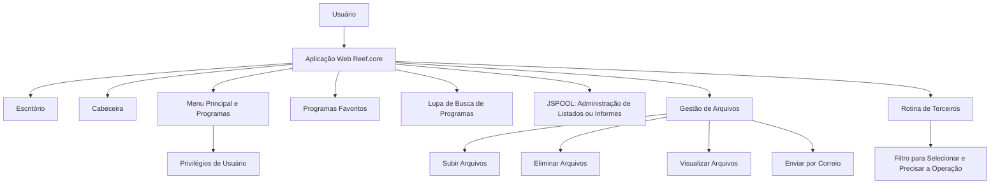

# Usabilidade da Aplicação Reef.core — Capacidades de Gestão de Seguros

## 1. Metadados do Documento
- **Arquivo de Origem:** Não identificado
- **Tipo de Documento:** Apresentação Executiva
- **Domínio / Sistema:** Reef.core / MAPFRE
- **Público-Alvo:** Usuários de negócio e operação
- **Data/Versão Identificada:** Não identificada

---

## 2. Resumo Executivo & Contexto de Negócio

O documento apresenta uma introdução à usabilidade da aplicação **Reef.core**, descrita como uma solução integral de gestão de seguros. A finalidade declarada é permitir que entidades MAPFRE gerenciem o ciclo de vida de suas apólices.

A apresentação destaca elementos da experiência de uso da aplicação Reef.core, incluindo o escritório, a cabeceira, menus, programas, programas favoritos, busca de programas e visualização da versão da aplicação e do ambiente.

O conteúdo também menciona que Reef.core é uma aplicação web adaptável ao tamanho e ao dispositivo utilizado. Entre as capacidades operacionais apresentadas estão a administração de listados ou informes por meio de **JSPOOL**, a gestão de arquivos permitidos e ações para subir, eliminar, visualizar e enviar arquivos por correio.

O documento cita ainda uma rotina de terceiros na qual é exibido um filtro para selecionar e precisar a operação. Não há detalhamento adicional sobre critérios do filtro, regras de permissão, contratos de integração, métodos HTTP, estruturas de dados ou fluxos técnicos internos.

---

## 3. Arquitetura, Componentes & Tecnologias Envolvidas

| Componente / Termo | Papel descrito no documento | Detalhamento disponível |
| :--- | :--- | :--- |
| Reef.core | Solução integral de gestão de seguros para entidades MAPFRE. | Permite gerir o ciclo de vida das apólices. |
| MAPFRE | Entidades que utilizam Reef.core para gestão de apólices. | Não há detalhamento organizacional adicional. |
| Aplicação Web | Forma de disponibilização da aplicação Reef.core. | É descrita como adaptável ao tamanho e ao dispositivo. |
| Escritório | Área ou elemento da interface da aplicação. | Não há detalhamento funcional adicional. |
| Cabeceira | Elemento da interface da aplicação. | Exibe ou se relaciona com itens como companhia, idioma e usuário. |
| Menu Principal | Área de programas condicionada aos privilégios do usuário. | O documento não informa o modelo de autorização. |
| Programas Favoritos | Área para programas favoritos. | Não há detalhamento sobre cadastro, persistência ou limites. |
| Lupa de Busca de Programas | Recurso de busca de programas. | Não há critérios ou algoritmo de busca especificados. |
| JSPOOL | Administração de listados ou informes. | Não há expansão da sigla ou descrição técnica adicional. |
| Rotina de Terceiros | Rotina com filtro para seleção e precisão da operação. | Não há descrição dos tipos de operação ou campos do filtro. |
| Home | Item apresentado na cabeceira. | Não há descrição funcional. |
| Solutions | Item apresentado na cabeceira. | Não há descrição funcional. |
| APIs | Item apresentado na cabeceira. | Não há descrição funcional. |
| Documentation | Item apresentado na cabeceira. | Não há descrição funcional. |
| Zeus | Item apresentado na cabeceira. | Não há descrição funcional. |
| EN | Indicador apresentado na cabeceira. | Possivelmente relacionado ao idioma, mas o documento não confirma a função. |



> **Nota de Análise:** O diagrama representa somente relações de navegação e capacidades explicitamente citadas. O documento não apresenta arquitetura de infraestrutura, integrações entre microsserviços, APIs, bancos de dados, protocolos ou ambientes técnicos.

---

## 4. Regras de Negócio, Especificações Funcionais & Processos

### 4.1 Objetivo funcional de Reef.core
1. Reef.core é apresentada como uma solução integral de gestão de seguros.
2. Reef.core permite às entidades MAPFRE gerir o ciclo de vida de suas apólices.
3. O documento não define as etapas que compõem o ciclo de vida das apólices.

### 4.2 Navegação por menus e programas
1. A aplicação apresenta um menu principal com programas.
2. Os programas disponíveis no menu principal dependem dos privilégios do usuário.
3. A aplicação possui programas favoritos.
4. A aplicação disponibiliza uma lupa para busca de programas.
5. O documento não especifica quais privilégios existem, como são atribuídos ou quais programas correspondem a cada privilégio.

### 4.3 Informações da cabeceira
1. A cabeceira menciona companhia, idioma e usuário.
2. A cabeceira também apresenta os itens Home, Solutions, APIs, Documentation, Zeus e EN.
3. O documento não especifica se esses elementos são links, indicadores, opções de configuração ou integrações externas.

### 4.4 Gestão de arquivos
1. O documento menciona tipos de arquivos permitidos.
2. A aplicação oferece ações para subir arquivos.
3. A aplicação oferece ações para eliminar arquivos.
4. A aplicação oferece ações para visualizar arquivos.
5. A aplicação oferece envio por correio.
6. O documento não identifica extensões de arquivos permitidas, limites de tamanho, regras de retenção, destinatários de correio ou controles de segurança.

### 4.5 Rotina de terceiros
1. A rotina de terceiros apresenta um filtro.
2. O filtro permite selecionar e precisar a operação.
3. O documento não define quais operações podem ser selecionadas, quais campos compõem o filtro ou quais validações são aplicadas.

---

## 5. Tabelas de Parâmetros, Ambientes e Estruturas de Dados

| Item / Parâmetro | Descrição / Função | Tipo / Valores / Formato | Ambiente / Observações |
| :--- | :--- | :--- | :--- |
| Versão da aplicação | Informação de versão apresentada na interface. | Não informado. | Associada à aplicação Reef.core. |
| Ambiente | Informação de ambiente apresentada na interface. | Não informado. | O documento não nomeia ambientes. |
| Companhia | Informação exibida na cabeceira. | Não informado. | Não há lista de companhias. |
| Idioma | Informação exibida na cabeceira. | `EN` é apresentado no conteúdo bruto. | Não há lista de idiomas suportados. |
| Usuário | Informação exibida na cabeceira. | Não informado. | Relacionado à navegação e aos privilégios de usuário. |
| Privilégios de usuário | Condicionam os programas disponíveis no menu principal. | Não informado. | Não há matriz de permissões. |
| Programas favoritos | Programas destacados como favoritos. | Não informado. | Não há regras de configuração ou persistência. |
| Tipos de arquivos permitidos | Restrição citada para arquivos. | Não informado. | Extensões e limites não detalhados. |
| Subir arquivo | Ação de inclusão de arquivo. | Não informado. | Não há fluxo técnico descrito. |
| Eliminar arquivo | Ação de remoção de arquivo. | Não informado. | Não há regra de exclusão ou retenção. |
| Visualizar arquivo | Ação de consulta de arquivo. | Não informado. | Não há formatos de pré-visualização especificados. |
| Enviar por correio | Ação de envio de arquivo ou conteúdo por correio. | Não informado. | Não há destinatários, protocolo ou modelo de mensagem. |
| Filtro da rotina de terceiros | Permite selecionar e precisar a operação. | Não informado. | Campos e critérios não detalhados. |
| JSPOOL | Administração de listados ou informes. | Não informado. | A sigla não é expandida no documento. |

---

## 6. Bateria de Perguntas & Respostas para RAG (FAQ Sintético)

### P1: Qual é o objetivo principal da aplicação Reef.core?
**R:** Reef.core é apresentada como uma solução integral de gestão de seguros que permite às entidades MAPFRE gerir o ciclo de vida de suas apólices. O documento não detalha quais etapas específicas compõem esse ciclo de vida.

### P2: Reef.core é uma aplicação desktop ou web?
**R:** O documento descreve Reef.core como uma aplicação web adaptável ao tamanho e ao dispositivo utilizado.

### P3: Como os programas disponíveis no menu principal são controlados?
**R:** Os programas apresentados no menu principal são condicionados pelos privilégios do usuário. O documento não informa quais privilégios existem nem como eles são administrados.

### P4: Quais recursos de navegação são citados para localizar programas em Reef.core?
**R:** O documento cita o menu principal de programas, os programas favoritos e uma lupa para busca de programas. Não há detalhamento sobre filtros, indexação ou critérios da busca.

### P5: Quais ações de gestão de arquivos são mencionadas?
**R:** O documento menciona ações para subir, eliminar e visualizar arquivos, além da capacidade de enviar por correio. As extensões permitidas, limites de tamanho e regras de segurança não são informados.

### P6: O que é o JSPOOL no contexto de Reef.core?
**R:** JSPOOL é citado como o componente ou funcionalidade responsável pela administração de listados ou informes. O documento não expande a sigla nem descreve seu funcionamento técnico.

### P7: O que acontece na rotina de terceiros?
**R:** Na rotina de terceiros aparece um filtro que permite selecionar e precisar a operação. O documento não especifica os campos disponíveis, os tipos de operação ou as regras de validação do filtro.

### P8: Quais informações são apresentadas na cabeceira da aplicação?
**R:** A apresentação menciona companhia, idioma e usuário na cabeceira. Também exibe os itens Home, Solutions, APIs, Documentation, Zeus e EN, sem especificar a funcionalidade de cada um.

### P9: O documento define quais tipos de arquivo são permitidos?
**R:** Não. O documento cita “Tipos de Arquivos Permitidos”, mas não lista extensões, formatos, tamanhos máximos ou restrições associadas.

### P10: Há URLs, servidores, portas ou detalhes de integração técnica documentados?
**R:** Não. O conteúdo não fornece URLs, nomes de servidores, portas, protocolos, contratos de API, bancos de dados ou detalhes de integração.

---

## 7. Glossário de Termos, Siglas & Conceitos-Chave

- **Reef.core:** Solução integral de gestão de seguros citada no documento.
- **MAPFRE:** Entidades mencionadas como usuárias de Reef.core para gerir o ciclo de vida de apólices.
- **Apólice:** Objeto de negócio cujo ciclo de vida é gerido por Reef.core, conforme o documento.
- **JSPOOL:** Termo associado à administração de listados ou informes; a sigla não é expandida no conteúdo.
- **Listados ou Informes:** Saídas administradas por JSPOOL, conforme o documento.
- **Privilégios de Usuário:** Condição que determina os programas visíveis no menu principal.
- **Programas Favoritos:** Programas destacados como favoritos na interface.
- **Rotina de Terceiros:** Rotina que apresenta filtro para selecionar e precisar uma operação.
- **EN:** Texto exibido na cabeceira; o documento não confirma explicitamente seu significado.

---

## 8. Notas Críticas, Riscos & Limitações

- O documento tem caráter introdutório e não apresenta especificações técnicas detalhadas.
- Não foram identificados número de versão, data, autoria, ambiente nomeado ou nome do arquivo de origem.
- Não há documentação de APIs, URLs, contratos JSON, protocolos, servidores, portas, bancos de dados ou mecanismos de integração.
- Não há matriz de privilégios, lista de programas, modelo de autenticação ou regras de autorização.
- A seção sobre arquivos não especifica extensões permitidas, tamanho máximo, armazenamento, retenção, auditoria ou controles de segurança.
- A rotina de terceiros é mencionada sem detalhamento de operações, filtros, entidades envolvidas ou regras de validação.
- **Nota de Análise:** O documento lista JSPOOL e a rotina de terceiros, mas não fornece detalhamento funcional ou técnico suficiente para inferir fluxos internos, contratos ou dependências.

---

## 9. Conteúdo Bruto Estruturado (Referência Fiel)

```text
--- [PÁGINA 1 DE 2] ---

INTRODUCCIÓN a la Usabilidad de la
Aplicación en Reef.core

OBJETIVO
Conocer las principales capacidades de Reef.core como Solución integral de Gestión de Seguros
que permite a las entidades MAPFRE gestionar el ciclo de vida de sus pólizas.

Escritorio
Detalle Cabecera
Menús & Programas
Escritorio

¿Con qué nos encontramos?

Cabecera
Lupa Búsqueda Programas
Menú Principal - Programas (Privilegios de Usuario)
Programas Favoritos
Versión App y Entorno
Aplicación Web y Adaptable (Tamaño y Dispositivo)

Detalle Cabecera

Cabecera
 /
CF
Home Solutions APIs Documentation Zeus
EN


--- [PÁGINA 2 DE 2] ---

Compañía
Idioma
JSPOOL - Administración Listados o Informes
Tipos de Archivos Permitidos
Acciones para Subir / Eliminar / Visualizar archivos
Enviar por Correo
Usuario
Menus y Programas
Rutina de Terceros
Aparece un Filtro que permite Seleccionar y Precisar la Operación
```
