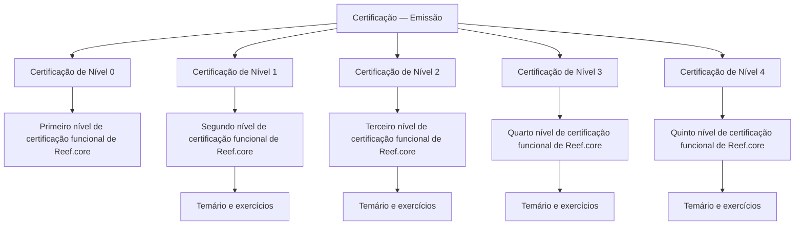

# Certificação Funcional do Módulo de Emissão — Reef.core

## 1. Metadados do Documento
- **Arquivo de Origem:** Não identificado no conteúdo fornecido
- **Tipo de Documento:** Material de certificação funcional
- **Domínio / Sistema:** Reef.core — módulo de emissão
- **Público-Alvo:** Profissionais que buscam certificação funcional em Reef.core
- **Data/Versão Identificada:** Não identificada

---

## 2. Resumo Executivo & Contexto de Negócio

O documento apresenta a estrutura de certificação do módulo de emissão do sistema Reef.core. O conteúdo organiza o processo de capacitação funcional em cinco níveis, identificados de 0 a 4.

Cada nível de certificação contém um temário que deve ser conhecido pelo participante. O nível 0 é descrito como o primeiro nível de certificação funcional de Reef.core, enquanto os níveis 1, 2, 3 e 4 correspondem, respectivamente, ao segundo, terceiro, quarto e quinto níveis de certificação funcional.

Os níveis 1 a 4 indicam explicitamente a existência de exercícios associados ao temário. O conteúdo fornecido não detalha os tópicos de cada temário, os exercícios, critérios de aprovação, pré-requisitos, duração, avaliação ou responsáveis pelo processo de certificação.

O documento também exibe elementos de navegação associados a uma interface ou portal, incluindo referências a soluções, arquiteturas, APIs, eventos, componentes, cloud, documentação, Zeus, Reef, ajuda e notícias. Não há explicação adicional sobre a função operacional desses itens.

---

## 3. Arquitetura, Componentes & Tecnologias Envolvidas

O conteúdo cita o sistema **Reef.core** e o seu **módulo de emissão** como domínio da certificação funcional. Também são exibidos termos de navegação: `Search`, `Home`, `Solutions`, `Architectures`, `APIs`, `Events`, `Components`, `Cloud`, `Documentation`, `Zeus`, `Reef`, `Help` e `News`.

Não há descrição de arquitetura de software, integração entre sistemas, microsserviços, bancos de dados, APIs, ambientes, protocolos, tecnologias de infraestrutura ou fluxos de dados.

> **Nota de Análise:** O documento menciona Reef.core e o módulo de emissão, mas não detalha componentes técnicos, relações entre sistemas ou arquitetura de camadas.

---

## 4. Regras de Negócio, Especificações Funcionais & Processos

### Estrutura de níveis de certificação

1. O processo apresentado possui cinco níveis de certificação: nível 0, nível 1, nível 2, nível 3 e nível 4.
2. Cada nível possui um temário que deve ser conhecido para obtenção da certificação funcional correspondente.
3. A certificação de nível 0 é apresentada como o primeiro nível de certificação funcional de Reef.core.
4. A certificação de nível 1 é apresentada como o segundo nível de certificação funcional de Reef.core e inclui exercícios junto ao temário.
5. A certificação de nível 2 é apresentada como o terceiro nível de certificação funcional de Reef.core e inclui exercícios junto ao temário.
6. A certificação de nível 3 é apresentada como o quarto nível de certificação funcional de Reef.core e inclui exercícios junto ao temário.
7. A certificação de nível 4 é apresentada como o quinto nível de certificação funcional de Reef.core e inclui exercícios junto ao temário.

### Fluxo conceitual identificado



> **Nota de Análise:** O diagrama representa a classificação declarada no documento. O conteúdo não afirma que os níveis devem ser cursados sequencialmente, nem apresenta regras formais de progressão, aprovação ou dependência entre níveis.

---

## 5. Tabelas de Parâmetros, Ambientes e Estruturas de Dados

| Item / Parâmetro | Descrição / Função | Tipo / Valores / Formato | Ambiente / Observações |
| :--- | :--- | :--- | :--- |
| Certificação — Emissão | Seção que concentra os temários dos níveis de certificação do módulo de emissão. | Seção de certificação | Associada ao módulo de emissão. |
| Certificação de Nível 0 | Temário necessário para obter o primeiro nível de certificação funcional de Reef.core. | Nível 0 | O documento não menciona exercícios para este nível. |
| Certificação de Nível 1 | Temário e exercícios para obter o segundo nível de certificação funcional de Reef.core. | Nível 1 | Exercícios explicitamente mencionados. |
| Certificação de Nível 2 | Temário e exercícios para obter o terceiro nível de certificação funcional de Reef.core. | Nível 2 | Exercícios explicitamente mencionados. |
| Certificação de Nível 3 | Temário e exercícios para obter o quarto nível de certificação funcional de Reef.core. | Nível 3 | Exercícios explicitamente mencionados. |
| Certificação de Nível 4 | Temário e exercícios para obter o quinto nível de certificação funcional de Reef.core. | Nível 4 | Exercícios explicitamente mencionados. |
| Reef.core | Sistema citado como contexto da certificação funcional. | Nome de sistema | Não há detalhes técnicos adicionais. |
| Módulo de emissão | Módulo ao qual os temários de certificação se referem. | Domínio funcional | Não há detalhamento de funcionalidades. |
| Search | Item de navegação exibido no conteúdo. | Navegação | Sem detalhamento adicional. |
| Home | Item de navegação exibido no conteúdo. | Navegação | Sem detalhamento adicional. |
| Solutions | Item de navegação exibido no conteúdo. | Navegação | Sem detalhamento adicional. |
| Architectures | Item de navegação exibido no conteúdo. | Navegação | Sem detalhamento adicional. |
| APIs | Item de navegação exibido no conteúdo. | Navegação | Sem detalhamento adicional. |
| Events | Item de navegação exibido no conteúdo. | Navegação | Sem detalhamento adicional. |
| Components | Item de navegação exibido no conteúdo. | Navegação | Sem detalhamento adicional. |
| Cloud | Item de navegação exibido no conteúdo. | Navegação | Sem detalhamento adicional. |
| Documentation | Item de navegação exibido no conteúdo. | Navegação | Sem detalhamento adicional. |
| Zeus | Item de navegação exibido no conteúdo. | Navegação | O vínculo com Reef.core não é explicado. |
| Reef | Item de navegação exibido no conteúdo. | Navegação | Não deve ser confundido automaticamente com Reef.core. |
| Help | Item de navegação exibido no conteúdo. | Navegação | Sem detalhamento adicional. |
| News | Item de navegação exibido no conteúdo. | Navegação | Sem detalhamento adicional. |
| EN | Indicador exibido ao final do conteúdo. | Código textual | O documento não esclarece o significado operacional. |
| CF | Sigla exibida ao final do conteúdo. | Sigla textual | O documento não define a sigla. |

---

## 6. Bateria de Perguntas & Respostas para RAG (FAQ Sintético)

### P1: Qual é o objetivo da seção “Certificación - Emisión”?
**R:** A seção “Certificación - Emisión” reúne os temários de cada nível de certificação do módulo de emissão. O documento associa essa estrutura ao processo de certificação funcional de Reef.core.

### P2: Quantos níveis de certificação funcional são apresentados para Reef.core?
**R:** O documento apresenta cinco níveis de certificação: nível 0, nível 1, nível 2, nível 3 e nível 4. Esses níveis são descritos como primeiro, segundo, terceiro, quarto e quinto níveis de certificação funcional de Reef.core.

### P3: O que é necessário para obter a certificação de nível 0?
**R:** Para obter a certificação de nível 0, o documento informa que é necessário conhecer o temário correspondente. Essa certificação é apresentada como o primeiro nível de certificação funcional de Reef.core.

### P4: A certificação de nível 1 possui exercícios?
**R:** Sim. O documento informa que a certificação de nível 1 contém o temário que deve ser conhecido juntamente com exercícios para obtenção do segundo nível de certificação funcional de Reef.core.

### P5: Qual nível representa o terceiro nível de certificação funcional de Reef.core?
**R:** A certificação de nível 2 representa o terceiro nível de certificação funcional de Reef.core. O nível 2 inclui um temário e exercícios.

### P6: Qual certificação corresponde ao quarto nível funcional de Reef.core?
**R:** A certificação de nível 3 corresponde ao quarto nível de certificação funcional de Reef.core. O documento indica que esse nível contém temário e exercícios.

### P7: Qual certificação corresponde ao quinto nível funcional de Reef.core?
**R:** A certificação de nível 4 corresponde ao quinto nível de certificação funcional de Reef.core. O documento indica que esse nível contém temário e exercícios.

### P8: O documento detalha os tópicos que compõem os temários de certificação?
**R:** Não. O documento informa que existem temários para cada nível, mas não apresenta os tópicos, conteúdos programáticos, módulos ou materiais que compõem esses temários.

### P9: O documento define critérios de aprovação ou avaliação para as certificações?
**R:** Não. Não são informados critérios de aprovação, notas mínimas, formato de prova, evidências requeridas, duração, responsáveis pela avaliação ou regras de reprovação.

### P10: Existe uma regra explícita de progressão obrigatória entre os níveis de certificação?
**R:** Não. Embora os níveis sejam apresentados como primeiro até quinto nível de certificação funcional, o documento não declara que a conclusão de um nível seja pré-requisito obrigatório para iniciar o próximo.

### P11: Quais itens de navegação são exibidos no documento?
**R:** O conteúdo exibe os itens `Search`, `Home`, `Solutions`, `Architectures`, `APIs`, `Events`, `Components`, `Cloud`, `Documentation`, `Zeus`, `Reef`, `Help` e `News`, além das marcações `EN` e `CF`. O documento não explica a função de cada item.

---

## 7. Glossário de Termos, Siglas & Conceitos-Chave

- **Certificación - Emisión:** Seção que contém os temários dos níveis de certificação relacionados ao módulo de emissão.
- **Certificação funcional:** Tipo de certificação associada a Reef.core, organizada em cinco níveis no conteúdo fornecido.
- **Módulo de emissão:** Módulo mencionado como escopo dos temários de certificação.
- **Reef.core:** Sistema citado como contexto das certificações funcionais.
- **Nível 0:** Primeiro nível de certificação funcional de Reef.core.
- **Nível 1:** Segundo nível de certificação funcional de Reef.core; inclui temário e exercícios.
- **Nível 2:** Terceiro nível de certificação funcional de Reef.core; inclui temário e exercícios.
- **Nível 3:** Quarto nível de certificação funcional de Reef.core; inclui temário e exercícios.
- **Nível 4:** Quinto nível de certificação funcional de Reef.core; inclui temário e exercícios.
- **CF:** Sigla exibida no conteúdo sem definição explícita.
- **EN:** Código exibido no conteúdo sem definição explícita.
- **Zeus:** Termo exibido como item de navegação, sem explicação adicional no texto.

---

## 8. Notas Críticas, Riscos & Limitações

- O conteúdo não identifica o nome do arquivo de origem, data, versão, autor, organização responsável ou status de vigência.
- O documento não apresenta o conteúdo dos temários de certificação.
- O documento não descreve exercícios específicos, respostas esperadas, critérios de correção ou mecanismos de avaliação.
- Não há critérios explícitos de aprovação, reprovação, recertificação, validade da certificação ou emissão de certificados.
- Não há indicação de pré-requisitos formais entre os níveis 0 a 4.
- Não há informações sobre arquitetura técnica, APIs, ambientes, URLs, servidores, rotas de log, integrações ou componentes de software.
- Os itens de navegação exibidos, incluindo Zeus, Reef, EN e CF, não possuem definição contextual adicional.
- **Nota de Análise:** A numeração dos níveis sugere uma classificação progressiva, mas o documento não estabelece formalmente uma sequência obrigatória de realização.

---

## 9. Conteúdo Bruto Estruturado (Referência Fiel)

```text
--- [PÁGINA 1 DE 1] ---

CERTIFICACIÓN - EMISIÓN
 En este apartado se encuentran los temarios de cada uno de los niveles de certificación del módulo de emisión.
CERTIFICACIÓN DE NIVEL 0
En este apartado se encuentra el
temario que se necesita conocer
para obtener el primer nivel de
certificación funcional de
Reef.core
CERTIFICACIÓN DE NIVEL 1
En este apartado se encuentra el
temario que se necesita conocer
junto con ejercicios para obtener
el segundo nivel de certificación
funcional de Reef.core
CERTIFICACIÓN DE NIVEL 2
En este apartado se encuentra el
temario que se necesita conocer
junto con ejercicios para obtener
el tercer nivel de certificación
funcional de Reef.core
CERTIFICACIÓN DE NIVEL 3
En este apartado se encuentra el
temario que se necesita conocer
junto con ejercicios para obtener
el cuarto nivel de certificación
funcional de Reef.core
CERTIFICACIÓN DE NIVEL 4
En este apartado se encuentra el
temario que se necesita conocer
junto con ejercicios para obtener
el quinto nivel de certificación
funcional de Reef.core
 / 
 CF
Search Home Solutions Architectures APIs Events Components Cloud Documentation Zeus Reef Help News
EN
```
