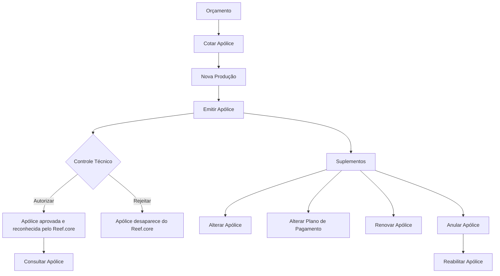

# Certificación — Emisión Nivel 1: Definiciones y Operaciones de Reef.core

## 1. Metadados do Documento
- **Arquivo de Origem:** Não identificado no conteúdo extraído.
- **Tipo de Documento:** Especificação funcional / material de certificação.
- **Domínio / Sistema:** Reef.core — módulo de emissão de seguros.
- **Público-Alvo:** Analistas funcionais, configuradores de produto, desenvolvedores, arquitetos e operação de seguros.
- **Data/Versão Identificada:** Não identificada.

---

## 2. Resumo Executivo & Contexto de Negócio

O documento descreve as definições funcionais e as operações do módulo de emissão do sistema **Reef.core**, estruturadas em níveis de configuração: definições comuns, ramo, apólice, risco e cobertura. O objetivo é estabelecer os elementos necessários para criar, cotar, emitir, alterar, renovar, cancelar, reabilitar e consultar apólices de seguro.

As definições comuns abrangem elementos corporativos e transversais, como companhia, moeda, estrutura comercial, estrutura de produto, canal, quadro de comissão, agente, conceito econômico, documentos de entrada e saída e controle técnico. Esses elementos sustentam a definição de produtos e operações de emissão.

No nível de apólice, o documento apresenta definições que afetam todos os riscos associados à apólice, incluindo moeda, importes mínimos para recibos, escala de prêmio, intervenções, cláusulas, texto anexo, plano de pagamento, controles técnicos, atributos e ocorrências. Nos níveis de risco e cobertura, a configuração é especializada para cada risco ou garantia contratada.

O documento também formaliza operações de orçamento, nova produção, suplementos, controles técnicos e consultas. Essas operações cobrem o ciclo de vida da apólice, desde a oferta de alternativas de seguro e fracionamento de pagamento até a emissão, alterações, renovação, anulação, reabilitação, autorização, rejeição e consulta.

---

## 3. Arquitetura, Componentes & Tecnologias Envolvidas

O conteúdo não apresenta arquitetura técnica de infraestrutura, APIs, bancos de dados, microsserviços, protocolos ou ambientes de implantação. A arquitetura documentada é funcional, composta pelos níveis de definição e pelas operações do módulo de emissão de seguros no Reef.core.

### Componentes funcionais identificados

- **Reef.core:** Sistema que suporta definições e operações de emissão de seguros.
- **Definição comum:** Configurações não exclusivas do módulo de emissão, mas necessárias para sua operação.
- **Ramo:** Configurações gerais aplicáveis às apólices de um ramo.
- **Apólice:** Configurações aplicáveis a todos os riscos de uma apólice.
- **Risco:** Configurações aplicáveis a cada risco possível da apólice.
- **Cobertura:** Configurações aplicáveis a cada cobertura definida.
- **Operações:** Orçamento, nova produção, suplementos, controle técnico e consultas.

```mermaid
graph TD
    A[Reef.core - Módulo de Emissão] --> B[Definições Comuns]
    A --> C[Definições do Ramo]
    A --> D[Definições da Apólice]
    A --> E[Definições do Risco]
    A --> F[Definições da Cobertura]
    A --> G[Operações]

    B --> B1[Companhia]
    B --> B2[Moeda]
    B --> B3[Estrutura Comercial]
    B --> B4[Estrutura de Produto]
    B --> B5[Canal]
    B --> B6[Quadro de Comissão]
    B --> B7[Agente]
    B --> B8[Conceito Econômico]
    B --> B9[Documentos de Entrada/Saída]
    B --> B10[Controle Técnico]

    C --> C1[Ramo]
    C --> C2[Suplemento]
    C --> C3[Documentos de Entrada/Saída]

    D --> D1[Moeda]
    D --> D2[Importe Mínimo]
    D --> D3[Escala]
    D --> D4[Intervenção]
    D --> D5[Cláusula]
    D --> D6[Texto Anexo]
    D --> D7[Plano de Pagamento]
    D --> D8[Controle Técnico]
    D --> D9[Atributo]
    D --> D10[Ocorrência]

    E --> E1[Intervenção]
    E --> E2[Atributo]
    E --> E3[Controle Técnico de Atributo]
    E --> E4[Ocorrência]
    E --> E5[Ramo Contábil Múltiplo]
    E --> E6[Modalidade]
    E --> E7[Cláusula]
    E --> E8[Texto Anexo]
    E --> E9[Comissão]

    F --> F1[Cobertura]
    F --> F2[Controle Técnico]
    F --> F3[Atributo]
    F --> F4[Ocorrência]
    F --> F5[Limite]
    F --> F6[Intervalo]
    F --> F7[Franquia]
    F --> F8[Conceito Desglose]
    F --> F9[Tarifa Multivariável]
    F --> F10[Cláusula]
    F --> F11[Comissão]

    G --> G1[Orçamento / Cotar Apólice]
    G --> G2[Emitir Apólice]
    G --> G3[Suplementos]
    G --> G4[Controle Técnico]
    G --> G5[Consultar Apólice]
```



> **Nota de Análise:** O documento não detalha métodos HTTP, contratos JSON, persistência de dados, integrações externas, URLs, ambientes, versões de software ou topologia técnica do Reef.core.

---

## 4. Regras de Negócio, Especificações Funcionais & Processos

### 4.1. Definições comuns

As definições comuns não são exclusivas do módulo de emissão, mas são necessárias para realizar a definição de seguros:

- **Companhia:** Define a entidade ou as entidades com as quais serão criadas as apólices e, consequentemente, os demais elementos.
- **Moeda:** Define as divisas com as quais o Reef.core realizará as operações da companhia.
- **Estrutura comercial:** Define como será estabelecida a organização territorial da companhia.
- **Estrutura de produto:** Define como estarão organizados os ramos comercializados.
- **Canal:** Define as vias pelas quais a nova produção chegará à companhia.
- **Quadro de comissão:** Define agrupadores que determinam as comissões a pagar aos agentes.
- **Agente:** Define terceiros que atuarão como intermediários entre o cliente e a companhia.
- **Conceito econômico:** Define conceitos que integrarão a informação econômica do recibo.
- **Documentos de entrada/saída:** Define documentos que devem ser emitidos durante uma operação e documentos que devem ser solicitados para realizar uma operação.
- **Controle técnico:** Define parâmetros necessários para validações que permitem ou não concluir uma operação.

### 4.2. Definições do ramo

As definições do ramo pertencem ao módulo de emissão, porém não são exclusivas do ramo em definição.

- **Ramo:** Define características gerais das apólices, tais como dias por ano, coletivos, cláusulas e tipo de apólice temporal.
- **Suplemento:** Define tipos de modificações que poderão ser aplicadas às apólices, incluindo anulação, reabilitação e renovação.
- **Documentos de entrada/saída:** Determina documentos que devem acompanhar uma operação e documentos necessários para permitir uma operação. O documento apresenta como exemplo a necessidade de carteira de habilitação para emitir uma apólice de automóvel.

### 4.3. Definições no nível de apólice

As definições de apólice afetam todos os riscos possíveis da apólice.

- **Moeda:** Determina as moedas possíveis para emissão de apólices. Afeta capitais, prêmios, comissões e recibos.
- **Importe mínimo:** Estabelece os importes mínimos para gerar um recibo.
- **Escala:** Define a porção de prêmio aplicável quando a apólice não é anual e o cálculo não deve ser proporcional ao tempo.
- **Intervenção:** Define figuras que podem intervir na contratação, referentes a clientes, como tomador, segurado e condutor.
- **Cláusula:** Define estipulações contratuais que especificam, ampliam, derrogam ou modificam o conteúdo do seguro.
- **Texto anexo:** Define se é possível incluir manualmente estipulações contratuais na apólice.
- **Plano de pagamento:** Define como será fracionado o pagamento do seguro.
- **Controle técnico:** Define condições nas quais a contratação pode ser paralisada ou nas quais uma ou mais pessoas podem determinar se o seguro é assumível pela seguradora.
- **Atributo:** Define características necessárias e suportadas pelo Reef.core, como o registro de um desconto que afeta a apólice.
- **Controle técnico de atributo:** Aplica controles técnicos baseados em atributos.
- **Ocorrência:** Representa o mesmo conceito de atributo, mas permite que a solicitação de atributos seja realizada “n” vezes.

### 4.4. Definições no nível de risco

As definições de risco afetam cada risco possível da apólice.

- **Intervenção:** Define figuras que podem intervir na contratação, como tomador, segurado e condutor.
- **Atributo:** Define características necessárias para o risco, como um local para registrar desconto que afeta o risco.
- **Controle técnico de atributo:** Define condições para paralisar a contratação ou permitir que uma ou mais pessoas determinem se o seguro é assumível pela seguradora.
- **Ocorrência:** Permite solicitar um conjunto de atributos repetidamente. O documento apresenta como exemplo o armazenamento de matérias cujo transporte é limitado em quantidade.
- **Ramo contábil múltiplo:** Permite definir ramos contábeis pelo conteúdo de algum atributo.
- **Modalidade:** Agrupa coberturas que, em conjunto, formam um pacote comercializável.
- **Cláusula:** Define estipulações contratuais aplicáveis ao seguro.
- **Texto anexo:** Define a possibilidade de incluir manualmente estipulações contratuais.
- **Comissão:** Define remuneração pela intermediação na contratação de seguro. Há diferentes tipos de comissão conforme a forma de intervenção do agente, além de exceções.

### 4.5. Definições no nível de cobertura

As definições de cobertura afetam cada cobertura definida.

- **Cobertura:** É a obrigação principal em um contrato de seguro. Existem tipos de cobertura que determinam o comportamento no processo de emissão e no processo de prestações.
- **Controle técnico:** Define condições para paralisar a contratação ou avaliar se o seguro é assumível.
- **Atributo:** Define características necessárias para a cobertura, como um desconto que afeta a cobertura.
- **Ocorrência:** Permite solicitar um conjunto de atributos repetidamente.
- **Limite:** Define o importe máximo contratado para o período de vigência do seguro e/ou o importe máximo aplicável para cada prestação realizada durante o período de vigência. Os importes são pré-definidos.
- **Intervalo:** Define somas seguradas entre um limite inferior e um limite superior.
- **Franquia:** Define as quantidades pelas quais o segurado responde em caso de sinistro. A redução de prêmio aplicável pode estar definida na própria franquia.
- **Conceito desglose:** Define o detalhamento necessário para segregação da informação econômica de uma cobertura.
- **Tarifa multivariável:** Define o meio de cálculo centrado no conceito de fator, que é o conceito pelo qual se realiza um cálculo.
- **Cláusula:** Define estipulações contratuais aplicáveis à cobertura.
- **Comissão:** Define a remuneração pela intermediação da contratação de seguro, incluindo tipos de comissão e exceções conforme a intervenção do agente.

### 4.6. Operações de emissão



#### Orçamento

- **Cotar apólice:** Oferece diferentes opções de seguro, com respetivo custo e opções de fracionamento de pagamento.

#### Nova produção

- **Emitir apólice:** Consiste na geração do contrato pelo qual são estabelecidos:
  - O risco ou os riscos cobertos.
  - As condições de cobertura.
  - A cobertura que será concedida quando o risco sofrer algum dano estabelecido.

#### Suplementos

- **Alterar apólice:** Permite modificar a maior parte das informações da apólice. Informações não permitidas nesse suplemento podem ser modificadas por outros suplementos. Mudanças identificadas podem afetar o custo do seguro e gerar cobrança ou devolução ao pagador do seguro.
- **Alterar plano de pagamento:** Cancela um ou vários recibos pendentes e utiliza o respetivo importe para realizar nova distribuição de recibos. O pagamento é novamente fracionado.
- **Renovar apólice:** Realiza a renovação efetiva da apólice, determinando condições e custo do seguro para um novo período de vigência.
- **Anular apólice:** Realiza o cancelamento da apólice e pode gerar um importe a devolver ao pagador.
- **Reabilitar apólice:** Anula uma anulação de apólice. A apólice volta a estar vigente na situação anterior à anulação. A reabilitação é efetiva no mesmo dia em que a apólice foi anulada.

#### Controle técnico

- **Autorizar apólice:** Uma apólice retida por controle técnico passa a estar aprovada; como consequência, o restante do Reef.core passa a reconhecê-la como apólice.
- **Rejeitar apólice:** Uma apólice retida por controle técnico não é autorizada e, como consequência, desaparece do Reef.core.

#### Consultas

- **Consultar apólice:** Permite acesso às informações de uma apólice após seleção prévia mediante diferentes critérios de busca.

---

## 5. Tabelas de Parâmetros, Ambientes e Estruturas de Dados

| Item / Parâmetro | Descrição / Função | Tipo / Valores / Formato | Ambiente / Observações |
| :--- | :--- | :--- | :--- |
| Companhia | Entidade ou entidades com as quais serão criadas apólices e os demais elementos. | Definição organizacional. | Definição comum. |
| Moeda | Divisas das operações da companhia e moedas de emissão das apólices. | Moedas possíveis de emissão. | Afeta capitais, prêmios, comissões e recibos no nível de apólice. |
| Estrutura comercial | Organização territorial da companhia. | Definição organizacional. | Definição comum. |
| Estrutura de produto | Organização dos ramos comercializados. | Estrutura de produto. | Definição comum. |
| Canal | Vias pelas quais chega a nova produção. | Canal de entrada. | Definição comum. |
| Quadro de comissão | Agrupadores que determinam comissões a pagar aos agentes. | Agrupamento de comissões. | Definição comum. |
| Agente | Terceiro intermediário entre cliente e companhia. | Participante da contratação. | Definição comum. |
| Conceito econômico | Conceitos pertencentes à informação econômica do recibo. | Elemento econômico. | Definição comum. |
| Documentos de entrada/saída | Documentos gerados e documentos exigidos para operações. | Documentação operacional. | Aplicável a definições comuns e ao ramo. |
| Controle técnico | Parâmetros e condições de validação para permitir, reter ou impedir uma operação. | Regra de validação / aprovação. | Aplicável em definições comuns, apólice, risco e cobertura. |
| Ramo | Características gerais das apólices, como dias por ano, coletivos, cláusulas e tipo temporal. | Configuração de ramo. | Nível de ramo. |
| Suplemento | Tipo de modificação possível na apólice. | Anulação, reabilitação, renovação e outros suplementos. | Nível de ramo e operações. |
| Importe mínimo | Importe mínimo para geração de recibo. | Valor mínimo. | Nível de apólice. |
| Escala | Porção de prêmio para apólice não anual sem cálculo proporcional ao tempo. | Regra de cálculo de prêmio. | Nível de apólice. |
| Intervenção | Figuras que participam da contratação. | Tomador, segurado, condutor e outras figuras de cliente. | Níveis de apólice e risco. |
| Cláusula | Estipulação que precisa, amplia, derroga ou modifica o conteúdo do seguro. | Regra contratual. | Níveis de apólice, risco e cobertura. |
| Texto anexo | Inclusão manual de estipulações contratuais na apólice. | Texto contratual manual. | Níveis de apólice e risco. |
| Plano de pagamento | Fracionamento do pagamento do seguro. | Distribuição de recibos. | Nível de apólice. |
| Atributo | Característica necessária suportada pelo Reef.core. | Dado configurável. | Pode afetar apólice, risco ou cobertura. |
| Ocorrência | Conjunto de atributos solicitado “n” vezes. | Estrutura repetível. | Pode afetar apólice, risco ou cobertura. |
| Ramo contábil múltiplo | Definição de ramos contábeis conforme conteúdo de atributo. | Regra contábil baseada em atributo. | Nível de risco. |
| Modalidade | Agrupamento de coberturas em pacote comercializável. | Pacote de coberturas. | Nível de risco. |
| Comissão | Remuneração pela intermediação na contratação. | Tipos de comissão e exceções. | Níveis de risco e cobertura. |
| Cobertura | Obrigação principal do contrato de seguro. | Tipos de cobertura. | Nível de cobertura. |
| Limite | Importe máximo por vigência e/ou prestação. | Valor pré-definido. | Nível de cobertura. |
| Intervalo | Somas seguradas entre limite inferior e superior. | Faixa de valores. | Nível de cobertura. |
| Franquia | Quantidade pela qual o segurado responde em caso de sinistro. | Valor ou condição de franquia. | Pode conter redução de prêmio. |
| Conceito desglose | Detalhe para segregação de informação econômica da cobertura. | Estrutura de detalhamento econômico. | Nível de cobertura. |
| Tarifa multivariável | Meio de cálculo baseado no conceito de fator. | Regra de cálculo. | Nível de cobertura. |
| Cotar apólice | Oferta opções de seguro, custo e fracionamento. | Operação de orçamento. | Operação de emissão. |
| Emitir apólice | Gera o contrato de seguro. | Operação de nova produção. | Operação de emissão. |
| Alterar apólice | Modifica a maior parte das informações da apólice. | Suplemento. | Pode gerar cobrança ou devolução. |
| Alterar plano de pagamento | Cancela recibos pendentes e refaz o fracionamento. | Suplemento. | Redistribui recibos. |
| Renovar apólice | Determina condições e custo para novo período de vigência. | Suplemento. | Renovação efetiva. |
| Anular apólice | Cancela a apólice. | Suplemento. | Pode gerar devolução ao pagador. |
| Reabilitar apólice | Reverte a anulação e retorna ao estado anterior. | Suplemento. | Efetiva no mesmo dia da anulação. |
| Autorizar apólice | Aprova apólice retida por controle técnico. | Operação de controle técnico. | Reef.core reconhece a apólice. |
| Rejeitar apólice | Não autoriza apólice retida por controle técnico. | Operação de controle técnico. | Apólice desaparece do Reef.core. |
| Consultar apólice | Acessa informações de apólice por critérios de busca. | Operação de consulta. | Requer seleção prévia. |

---

## 6. Bateria de Perguntas & Respostas para RAG (FAQ Sintético)

### P1: Quais são as definições comuns necessárias para configurar a emissão de seguros no Reef.core?
**R:** As definições comuns incluem companhia, moeda, estrutura comercial, estrutura de produto, canal, quadro de comissão, agente, conceito econômico, documentos de entrada e saída e controle técnico. Essas definições não são exclusivas do módulo de emissão, mas são necessárias para realizar a definição de seguros.

### P2: O que o componente Ramo define no módulo de emissão?
**R:** O componente Ramo fixa características gerais das apólices, incluindo dias por ano, coletivos, cláusulas e tipo de apólice temporal. O nível de ramo também contempla suplementos e documentos de entrada e saída.

### P3: Quais elementos da apólice são afetados pela definição de moeda?
**R:** No nível de apólice, a moeda determina as moedas possíveis de emissão e afeta capitais, prêmios, comissões e recibos.

### P4: Qual é a diferença entre atributo e ocorrência no Reef.core?
**R:** Um atributo é uma característica necessária e disponível no Reef.core, como o registro de desconto que afeta uma apólice, risco ou cobertura. Uma ocorrência representa o mesmo conceito, mas permite solicitar conjuntos de atributos “n” vezes; o documento exemplifica o armazenamento repetido de matérias cujo transporte está limitado em quantidade.

### P5: O que ocorre quando uma apólice é autorizada após retenção por controle técnico?
**R:** Uma apólice retida por controle técnico que é autorizada passa a estar aprovada. Como consequência, o restante do Reef.core passa a reconhecê-la como apólice.

### P6: O que ocorre quando uma apólice retida por controle técnico é rejeitada?
**R:** Quando uma apólice retida por controle técnico não é autorizada, a apólice desaparece do Reef.core.

### P7: Como funciona a operação de alteração do plano de pagamento?
**R:** A operação “Alterar apólice plan pago” anula um ou vários recibos pendentes e, com o respetivo importe, realiza uma nova distribuição de recibos. Em consequência, o pagamento do seguro é novamente fracionado.

### P8: Qual é o efeito da operação de reabilitar apólice?
**R:** Reabilitar apólice consiste em anular uma cancelamento de apólice. A apólice volta a vigorar na situação existente antes da anulação, e a reabilitação é efetiva no mesmo dia em que a apólice foi anulada.

### P9: O que uma cobertura representa no contrato de seguro?
**R:** Cobertura representa a obrigação principal em um contrato de seguro. Existem diversos tipos de cobertura, que determinam o comportamento tanto no processo de emissão quanto no processo de prestações.

### P10: Como são definidos limite, intervalo e franquia em uma cobertura?
**R:** O limite define o importe máximo contratado durante a vigência e/ou o máximo aplicável por prestação; os importes são pré-definidos. O intervalo estabelece somas seguradas entre um limite inferior e outro superior. A franquia define as quantidades pelas quais o segurado responde em caso de sinistro e pode conter a redução de prêmio aplicável.

### P11: O que é uma tarifa multivariável?
**R:** Tarifa multivariável é o meio pelo qual se determina um cálculo. A definição está centrada no conceito de fator, que é o conceito pelo qual o cálculo é realizado.

### P12: O que a emissão de uma apólice estabelece?
**R:** A emissão gera o contrato que estabelece o risco ou riscos cobertos, as condições em que esses riscos são cobertos e a cobertura concedida quando o risco sofre algum dano estabelecido.

### P13: Qual é a finalidade da consulta de apólice?
**R:** Consultar apólice permite acessar informações de uma apólice após uma seleção prévia realizada por meio de diferentes critérios de busca.

---

## 7. Glossário de Termos, Siglas & Conceitos-Chave

- **Reef.core:** Sistema citado como responsável por suportar definições e operações de emissão de seguros.
- **Apólice:** Contrato que estabelece riscos cobertos, condições de cobertura e cobertura aplicável diante de danos definidos.
- **Ramo:** Nível de configuração que define características gerais das apólices.
- **Risco:** Elemento da apólice para o qual podem existir definições específicas.
- **Cobertura:** Obrigação principal de um contrato de seguro.
- **Suplemento:** Operação ou tipo de modificação aplicável a uma apólice.
- **Controle técnico:** Conjunto de condições e validações que pode paralisar a contratação ou determinar se o seguro é assumível.
- **Tomador:** Figura de cliente que pode intervir na contratação.
- **Segurado:** Figura de cliente que pode intervir na contratação.
- **Condutor:** Figura de cliente que pode intervir na contratação.
- **Recibo:** Elemento econômico associado ao pagamento do seguro.
- **Prêmio:** Valor do seguro mencionado no contexto de escala, franquia, tarifa e efeitos de alterações.
- **Franquia:** Quantidade pela qual o segurado responde em caso de sinistro.
- **Modalidade:** Agrupamento de coberturas que forma um pacote comercializável.
- **Ocorrência:** Conjunto repetível de atributos solicitado “n” vezes.
- **Conceito desglose:** Detalhamento necessário para segregação da informação econômica de uma cobertura.
- **Tarifa multivariável:** Meio de determinação de cálculo baseado em fatores.
- **Ramo contábil múltiplo:** Possibilidade de definir ramos contábeis conforme o conteúdo de atributo.

---

## 8. Notas Críticas, Riscos & Limitações

- O documento não identifica arquivo de origem, autoria, data, versão ou contexto de aprovação.
- O documento não descreve arquitetura técnica de aplicação, integrações, APIs, contratos de mensagens, banco de dados, infraestrutura, observabilidade, segurança, URLs ou ambientes.
- Não são fornecidos valores concretos para moedas, importes mínimos, limites, intervalos, franquias, fatores tarifários, comissões ou regras de controle técnico.
- Não são detalhados os critérios de busca disponíveis para a operação de consulta de apólice.
- Não são apresentados os critérios específicos usados para autorizar ou rejeitar uma apólice em controle técnico.
- O documento menciona diferentes tipos de comissão e exceções, mas não detalha tipos, fórmulas, condições ou regras de cálculo.
- **Nota de Análise:** O documento lista o Reef.core e os seus conceitos funcionais, porém não detalha métodos HTTP, contratos JSON, tecnologias de implementação ou interfaces técnicas expostas.

---

## 9. Conteúdo Bruto Estruturado (Referência Fiel)

```text
--- [PÁGINA 1 DE 5] ---

CERTIFICACIÓN - EMISIÓN NIVEL 1
DEFINICIÓN
OPERACIÓN
DEFINICIÓN
COMÚN
En este nivel se encuentran definiciones que no son exclusivas del módulo de emisión, pero son necesarias para
poder realizar la definición. Entre otras definiciones se encuentra:
COMPAÑÍA
Definición de la entidad o
entidades con las que se van a
crear las pólizas y por
consiguiente el resto de
elementos
MONEDA
Definición de las divisas con las
que Reef.core va a realizar las
distintas operaciones de la
compañía
ESTRUCTURA COMERCIAL
Definición de como se va a
establecer la organización
territorial de la compañía
ESTRUCTURA PRODUCTO
Definición de como estarán
organizados los ramos que se
comercializan
CANAL
Definición de las distintas vías por
las que llegará la nueva
producción a la compañía
CUADRO COMISIÓN
Definición de los agrupadores que
determinan las comisiones que se
van a pagar a los agentes
AGENTE
Definición de los terceros que
ejercerán de intermediarios entre
el cliente y la compañía
CONCEPTO ECONÓMICO
Definición de los conceptos que
formarán parte de la información
económica del recibo
DOCUMENTOS DE
ENTRADA/SALIDA
Definición de los documentos que
deben salir cuando se realiza una
operación y de los documentos
que son necesarios solicitar
cuando se realiza una operación
CONTROL TÉCNICO
Definición de los parámetros
necesarios para realizar
validaciones que permitan o no
finalizar la operación
RAMO
 / 
 CF
Search Home Solutions Architectures APIs Events Components Cloud Documentation Zeus Reef Help News
EN


--- [PÁGINA 2 DE 5] ---

Son definiciones que siendo del módulo de emisión, no son exclusivas del ramo que se está definiendo. Por
ejemplo:
RAMO
Fija las características generales con las que
contarán las pólizas, como días por año,
colectivos, cláusulas, tipo de póliza temporal,
etc.
SUPLEMENTO
Tipos de modificaciones que podrán sufrir las
pólizas (anulación, rehabilitación, renovación,
etc.)
DOCUMENTOS DE ENTRADA/SALIDA
Determinar aquellos documentos que deben
acompañar a una operación (por ejemplo, que
documentos se generan cuando se emite una
nueva póliza) y documentos que son
necesarios disponer para poder realizar una
operación (por ejemplo, para emitir una póliza
de automóvil es necesario disponer de la
licencia de conducir)
PÓLIZA
En este nivel se encuentran definiciones que afectarán a todos los posibles riesgos de la póliza. Entre otros se
define:
MONEDA
Determina las posibles monedas
en las que se emitirán las pólizas.
Afecta a capitales, primas,
comisiones y recibos
IMPORTE MÍNIMO
Se establecen los importes
mínimos para generar un recibo
ESCALA
Se establece cual será la porción
de prima cuando una póliza no es
anual y no se desea que el cálculo
sea proporcional al tiempo
INTERVENCIÓN
Definición de aquellas figuras que
podrán intervenir en la
contratación. Estas figuras se
refieren a clientes y son del tipo
tomador, asegurado, conductor,
etc.
CLÁUSULA
Establecer diferentes
estipulaciones contractuales que
precisan, amplían, derogan o
modifican el contenido del seguro
TEXTO ANEXO
Fijar si es posible incluir de forma
manual en una póliza diferentes
estipulaciones contractuales que
precisan, amplían, derogan o
modifican el contenido del seguro
PLAN DE PAGO
Definir como se va a fraccionar el
pago del seguro
CONTROL TÉCNICO
Definición de en qué condiciones
se puede paralizar la contratación
o hacer que una o varias personas
puedan determinar si el seguro es
asumible por la aseguradora
ATRIBUTO
Son características que sea
necesario disponer y de las que
Reef.core dispone, por ejemplo
disponer de un lugar donde se
registre un descuento que afecta a
la póliza
CONTROL TÉCNICO ATRIBUTO
Definición de en qué condiciones
se puede paralizar la contratación
o hacer que una o varias personas
puedan determinar si el seguro es
asumible por la aseguradora
OCURRENCIA
Es el mismo concepto de atributo,
pero la solicitud de esos atributos
se realiza "n" veces. Es decir, es
un conjunto de atributos que su
petición se realiza varias veces.
Por ejemplo si fuera almacenar en
la póliza una serie de materias
que su transporte está limitado en
cantidad
RIESGO
Definiciones que afectan a cada uno de los posibles riesgos de la póliza. Por ejemplo:
INTERVENCIÓN
Definición de aquellas figuras que
podrán intervenir en la
ATRIBUTO
Son características que sea
necesario disponer y de las que
CONTROL TÉCNICO ATRIBUTO
Definición de en qué condiciones
se puede paralizar la contratación
OCURRENCIA
Es el mismo concepto de atributo,
pero la solicitud de esos atributos


--- [PÁGINA 3 DE 5] ---

contratación. Estas figuras se
refieren a clientes y son del tipo
tomador, asegurado, conductor,
etc.
Reef.core dispone, por ejemplo
disponer de un lugar donde se
registre un descuento que afecta
al riesgo
o hacer que una o varias personas
puedan determinar si el seguro es
asumible por la aseguradora
se realiza "n" veces. Es decir, es
un conjunto de atributos que su
petición se realiza varias veces.
Por ejemplo si fuera almacenar en
la póliza una serie de materias
que su transporte está limitado en
cantidad
RAMO CONTABLE MULTIPLE
Posibilidad de definir ramos
contables po el contenido de
algún atributo
MODALIDAD
Agrupación de coberturas que
juntas se convierten en un
paquete a comercializar
CLÁUSULA
Establecer diferentes
estipulaciones contractuales que
precisan, amplían, derogan o
modifican el contenido del seguro
TEXTO ANEXO
Fijar si es posible incluir de forma
manual en una póliza diferentes
estipulaciones contractuales que
precisan, amplían, derogan o
modifican el contenido del seguro
COMISIÓN
Establecer la remuneración por
intermediar en la contratación de
un seguro. Existen distintos tipos
de comisiones dependiendo de
como interviene el agente, así
como excepciones
COBERTURA
Definiciones que afectan a cada una de las coberturas definidas. Por ejemplo:
COBERTURA
Obligación principal en un contrato
de seguro. Existen diversos tipos
de cobertura que determinan el
comportamiento tanto en el
proceso de emisión, como en el
proceso de prestaciones
CONTROL TÉCNICO
Definición de en qué condiciones
se puede paralizar la contratación
o hacer que una o varias personas
puedan determinar si el seguro es
asumible por la aseguradora
ATRIBUTO
Son características que sea
necesario disponer y de las que
Reef.core dispone, por ejemplo
disponer de un lugar donde se
registre un descuento que afecta
a la cobertura
OCURRENCIA
Es el mismo concepto de atributo,
pero la solicitud de esos atributos
se realiza "n" veces. Es decir, es
un conjunto de atributos que su
petición se realiza varias veces.
Por ejemplo si fuera almacenar en
la póliza una serie de materias
que su transporte está limitado en
cantidad
LÍMITE
Estipulación del importe máximo
contratado por el periodo de
vigencia del seguro y/o importe
máximo aplicable por cada uno de
las prestaciones realizadas
durante le periodo de vigencia.
Estos importes están prefijados
INTERVALO
Establecimiento de sumas
aseguradas entre dos límites, uno
inferior y otro superior
FRANQUICIA
Establecer las cantidades por las
que el asegurado responde en
caso de siniestro. Existe la
posibilidad que la reducción de la
prima a aplicar se encuentre
definida en la propia franquicia
CONCEPTO DESGLOSE
Definición del detalle necesario de
segregación de la información
económica de una cobertura
TARIFA MULTIVARIABLE
Medio por el que se determina el
cálculo. La definición se centra en
el concepto factor que es el
concepto por el que se realiza un
cálculo
CLÁUSULA
Establecer diferentes
estipulaciones contractuales que
precisan, amplían, derogan o
modifican el contenido del seguro
COMISIÓN
Establecer la remuneración por
intermediar en la contratación de
un seguro. Existen distintos tipos
de comisiones dependiendo de
como interviene el agente, así
como excepciones


--- [PÁGINA 4 DE 5] ---

OPERACIÓN
PRESUPUESTO
Operaciones relacionadas con los de seguro de un posible riesgo
COTIZAR póliza
Ofrecer distintas opciones de un seguro junto con su coste y diferentes opciones de fraccionamiento de pago
NUEVA PRODUCCIÓN
Distintas formas de crear nuevas pólizas o aplicaciones
EMITIR póliza
Consiste en la generación del contrato por el que se establece el riesgo o riesgos cubiertos, las condiciones en las que se cubre y la cobertura que se
dará cuando el riesgo sufra algún tipo de daño establecido
SUPLEMENTO
Operaciones relacionadas con la modificación de la información que contiene una póliza o aplicación
ALTERAR póliza
Permite la modificación de la
mayor parte de la información de
la póliza. La información que no
se permite modificar en este
suplemento, se permite mediante
otros suplementos. Los cambios
identificados pueden afectar al
coste del seguro, provocando un
cobro o devolución al pagador del
seguro
ALTERAR póliza plan pago
Realiza la anulación de uno o
varios recibos pendientes y con
ese importe se realiza una nueva
distribución de recibos. Es decir,
se vuelve a fraccionar el pago
RENOVAR póliza
Realiza la renovación real de la
póliza. Es decir, se determina las
condiciones y el coste del seguro
para un nuevo periodo de vigencia
ANULAR póliza
Realiza la cancelación de la
póliza, puede generar un importe
a devolver al pagador
REHABILITAR póliza
Es la anulación de una
cancelación de póliza. Es decir, la
póliza vuelve a estar vigente con
la situación previa a la anulación.
La Rehabilitación es efectiva el
mismo día en el que se anuló la
póliza
CONTROL TÉCNICO
Distintas operaciones de autorización y rechazo de controles técnicos de auditoría
AUTORIZAR póliza
 RECHAZAR póliza


--- [PÁGINA 5 DE 5] ---

Una póliza retenida por control técnico pasa a estar aprobada y por
consiguiente, hace que el resto de Reef.core la reconozca como póliza
Una póliza retenida por control técnico no es autorizada y por
consiguiente desaparece de Reef.core
CONSULTAS
Distintas opciones de consulta
CONSULTAR póliza
Permite el acceso a la información de una póliza, donde previamente se ha facilitado la selección mediante distintos criterios de búsqueda
```
