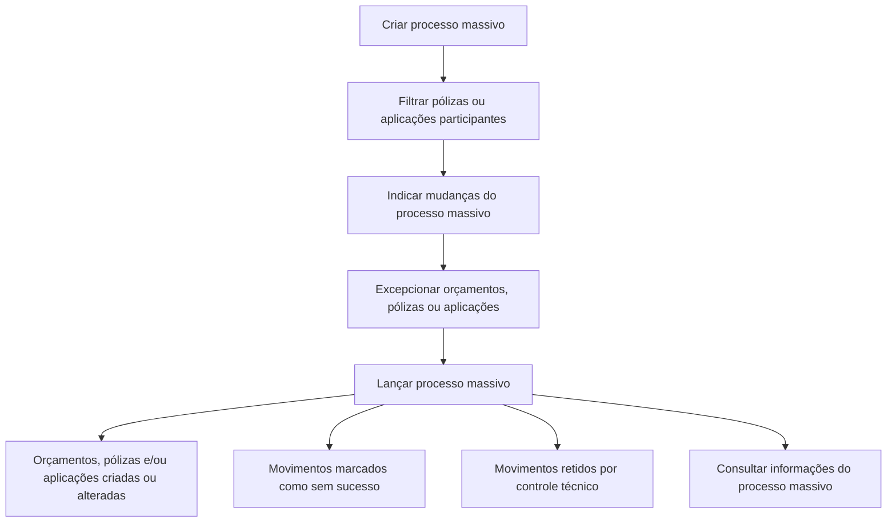

# Certificación — Emisión Nivel 2: Definiciones, Operaciones de Póliza y Procesos Masivos

## 1. Metadados do Documento
- **Arquivo de Origem:** `Não identificado — conteúdo bruto fornecido pelo usuário`
- **Tipo de Documento:** `Apresentação Executiva / Manual Funcional`
- **Domínio / Sistema:** `Emissão de seguros — certificação e operação de pólizas`
- **Público-Alvo:** `Negócio, Operação, Analistas Funcionais e Desenvolvedores`
- **Data/Versão Identificada:** `Não identificada`

---

## 2. Resumo Executivo & Contexto de Negócio

O documento descreve definições e operações do domínio de emissão de seguros no contexto de “Certificación - Emisión Nivel 2”. O conteúdo organiza regras e configurações por níveis funcionais: ramo, póliza, risco e cobertura. Cada nível contém definições que afetam o comportamento de emissão, vigência, cobrança, comissão, atributos, limites, intervalos e condições comerciais.

A estrutura apresentada permite que uma definição padrão de ramo seja modificada para clientes ou colaboradores específicos por meio de contratos e subcontratos. O contrato altera a definição do ramo para um ou mais clientes e pode determinar valores concretos ou conjuntos de valores permitidos. O subcontrato altera condições previamente definidas em um contrato, sendo exemplificado como mecanismo para condições aplicáveis a um grupo empresarial.

No nível de póliza, o documento apresenta controles de duração mínima e máxima, datas de efeito, coasseguro, planos de pagamento e revalorização ou depreciação de riscos. No nível de risco e cobertura, são apresentadas extensões contratuais para intervenções, atributos, comissões, limites, intervalos, franquias e tarifas multivariáveis.

O documento também descreve operações de suplemento, isto é, operações relacionadas à modificação de informações de uma póliza ou aplicação. Entre essas operações estão anulação da última modificação, alteração de agente, regularização de períodos anteriores, liquidação de cobranças antecipadas e diferentes modalidades de reabilitação de póliza.

Por fim, o conteúdo apresenta processos massivos para criar ou alterar orçamentos, pólizas e aplicações em lote. O processo massivo abrange a criação, filtragem de participantes, indicação de mudanças, exceção de itens, execução e consulta dos resultados. A execução pode criar ou alterar registros, marcar movimentos sem sucesso ou reter movimentos para controle técnico.

---

## 3. Arquitetura, Componentes & Tecnologias Envolvidas

O documento não descreve arquitetura técnica de software, APIs, protocolos, bancos de dados, infraestrutura, URLs operacionais, ambientes ou tecnologias de implementação. O conteúdo descreve uma arquitetura funcional de parametrização e operação para emissão de seguros.

Os principais componentes funcionais identificados são:

- **Ramo:** nível de definição padrão para regras de emissão.
- **Contrato:** mecanismo de alteração da definição de ramo para um ou mais clientes.
- **Subcontrato:** mecanismo de alteração das condições de contrato, incluindo condições para grupos empresariais.
- **Póliza Grupo:** conjunto de pólizas independentes submetidas a exceções de contrato e/ou subcontrato.
- **Póliza Cliente:** chave adicional associável a uma póliza para vincular diversas pólizas de um cliente ou colaborador.
- **Póliza:** nível de definições que afetam todos os riscos possíveis de uma póliza.
- **Risco:** nível de definições que afetam cada risco possível de uma póliza.
- **Cobertura:** nível de definições que afetam cada cobertura definida.
- **Suplemento:** conjunto de operações de modificação sobre uma póliza ou aplicação.
- **Processo Massivo:** processo em lote para criar ou alterar orçamentos, pólizas e/ou aplicações.

```mermaid
graph TD
  Emissao["Emissão — Nível 2"]

  Emissao --> Definicoes["Definições"]
  Emissao --> Operacao["Operação"]

  Definicoes --> Ramo["Ramo"]
  Definicoes --> Poliza["Póliza"]
  Definicoes --> Risco["Risco"]
  Definicoes --> Cobertura["Cobertura"]

  Ramo --> ContratoRamo["Contrato"]
  Ramo --> SubcontratoRamo["Subcontrato"]
  Ramo --> PolizaGrupo["Póliza Grupo"]
  Ramo --> PolizaCliente["Póliza Cliente"]
  Ramo --> Gracia["Dias de Graça"]
  Ramo --> AnulacaoFaltaPagamento["Anulação por Falta de Pagamento"]

  Poliza --> Duracao["Meses de Duração Mínimo/Máximo"]
  Poliza --> Efeito["Dias de Adiantamento/Atraso"]
  Poliza --> Coasseguro["Quadro de Coasseguro"]
  Poliza --> PlanoPagamento["Plano de Pagamento"]
  Poliza --> Revalorizacao["Revalorização/Depreciação"]

  Risco --> IntervencaoRisco["Intervenção Contrato"]
  Risco --> AtributoRisco["Atributo Contrato/Subcontrato"]
  Risco --> ComissaoRisco["Comissão Contrato"]

  Cobertura --> Limite["Limite Contrato"]
  Cobertura --> Intervalo["Intervalo Contrato/Subcontrato"]
  Cobertura --> Franquia["Franquia Contrato"]
  Cobertura --> Tarifa["Tarifa Multivariável Contrato/Subcontrato"]

  Operacao --> Suplemento["Suplemento"]
  Operacao --> ProcessoMassivo["Processos Massivos"]

  Suplemento --> Anular["Anular póliza modificación"]
  Suplemento --> Alterar["Alterar póliza cambio agente"]
  Suplemento --> Regularizar["Regularizar póliza"]
  Suplemento --> Liquidar["Liquidar póliza"]
  Suplemento --> Reabilitar["Reabilitar póliza"]

  ProcessoMassivo --> Criar["Criar processo massivo"]
  ProcessoMassivo --> Filtrar["Filtrar processo massivo"]
  ProcessoMassivo --> Indicar["Indicar cambio processo massivo"]
  ProcessoMassivo --> Excepcionar["Excepcionar processo massivo"]
  ProcessoMassivo --> Lancar["Lançar processo massivo"]
  ProcessoMassivo --> Consultar["Consultar processo massivo"]
```



> **Nota de Análise:** o documento não detalha relações técnicas entre sistemas, contratos de API, métodos HTTP, formatos JSON, mecanismos de persistência, autenticação, logs ou integrações externas.

---

## 4. Regras de Negócio, Especificações Funcionais & Processos

### 4.1. Definições no nível de Ramo

O ramo contém definições pertencentes ao módulo de emissão que não são exclusivas do ramo específico em definição.

- **Contrato:** estabelece condições que alteram a definição de um ramo. As condições aplicam-se sempre a um ou vários clientes. O contrato também pode determinar valores concretos ou diversos valores permitidos.
- **Subcontrato:** altera condições de um contrato e, consequentemente, altera a definição de um ramo. O documento cita como exemplo as condições que regem um grupo empresarial. O subcontrato pode determinar valores ou grupos de valores possíveis.
- **Póliza Grupo:** representa um conjunto de pólizas independentes, que podem ser individuais, coletivas ou multirriscos. O conjunto está sempre sujeito a algum tipo de exceção — contrato e/ou subcontrato — sobre a definição padrão do ramo.
- **Póliza Cliente:** consiste em chave adicional associável a uma póliza. A chave pode unir várias pólizas de um cliente ou colaborador.
- **Dias de Graça:** quantidade de dias adicionada ao efeito de um recibo para determinar que o recibo deve passar ao processo de anulação por falta de pagamento.
- **Dias de Graça Contrato:** alteração da definição específica para um cliente ou colaborador.
- **Dias de Graça Subcontrato:** alteração da definição específica para um cliente ou colaborador.
- **Anulação Falta Pagamento:** conjunto de parâmetros considerados pelo processo que determina quais pólizas devem ser anuladas por falta de pagamento.
- **Documentos de Entrada/Saída Contrato:** alteração da definição específica para um cliente ou colaborador.

### 4.2. Definições no nível de Póliza

As definições no nível de póliza afetam todos os possíveis riscos da póliza.

- **Meses de Duração Mínimo/Máximo:** fixa a quantidade máxima e/ou mínima de meses de vigência permitida para uma póliza.
- **Meses de Duração Mínimo/Máximo Contrato:** alteração da definição específica para um cliente ou colaborador.
- **Dias de Adiantamento/Atraso:** define quantos dias anteriores ou posteriores à data atual podem ser utilizados para fixar o efeito durante a criação ou modificação de uma póliza.
- **Dias de Adiantamento/Atraso Contrato:** alteração da definição específica para um cliente ou colaborador.
- **Quadro Coasseguro:** define antecipadamente as companhias participantes do risco, com conhecimento do cliente. A definição prévia destina-se a uso posterior em emissões de póliza.
- **Intervenção Contrato:** alteração da definição específica para um cliente ou colaborador.
- **Plano de Pagamento Contrato:** alteração da definição específica para um cliente ou colaborador.
- **Plano de Pagamento Cliente:** estabelece planos de pagamento por cliente e permite aplicá-los mesmo quando o ramo não dispõe de plano de pagamento.
- **Revalorização/Depreciação:** fixa como o valor de um risco é incrementado ou decrementado.
- **Contrato:** altera a definição de ramo para um ou mais clientes, permitindo valores concretos ou valores permitidos.
- **Subcontrato:** altera condições contratuais e, em consequência, altera a definição de ramo.
- **Atributo Contrato:** alteração da definição específica para um cliente ou colaborador.
- **Atributo Subcontrato:** alteração da definição específica para um cliente ou colaborador.

### 4.3. Definições no nível de Risco

As definições no nível de risco afetam cada risco possível da póliza.

- **Intervenção Contrato:** alteração da definição específica para um cliente ou colaborador.
- **Atributo Contrato:** alteração da definição específica para um cliente ou colaborador.
- **Atributo Subcontrato:** alteração da definição específica para um cliente ou colaborador.
- **Comissão Contrato:** alteração da definição específica para um cliente ou colaborador.

### 4.4. Definições no nível de Cobertura

As definições no nível de cobertura afetam cada cobertura definida.

- **Contrato:** condições que alteram a definição de um ramo para um ou mais clientes, admitindo valores concretos ou valores permitidos.
- **Subcontrato:** condições que alteram um contrato e, consequentemente, a definição de ramo; pode atender condições de um grupo empresarial.
- **Atributo Contrato:** alteração da definição específica para um cliente ou colaborador.
- **Atributo Subcontrato:** alteração da definição específica para um cliente ou colaborador.
- **Limite Contrato:** alteração da definição específica para um cliente ou colaborador.
- **Intervalo Contrato:** alteração da definição específica para um cliente ou colaborador.
- **Intervalo Subcontrato:** alteração da definição específica para um cliente ou colaborador.
- **Franquia Contrato:** alteração da definição específica para um cliente ou colaborador.
- **Tarifa Multivariável Contrato:** alteração da definição específica para um cliente ou colaborador.
- **Tarifa Multivariável Subcontrato:** alteração da definição específica para um cliente ou colaborador.
- **Comissão Contrato:** alteração da definição específica para um cliente ou colaborador.

### 4.5. Operações de Suplemento

As operações de suplemento relacionam-se à modificação das informações contidas em uma póliza ou aplicação.

1. **Anular póliza modificación**
   - Anula o último suplemento vigente realizado sobre a póliza.
   - Desfaz a última modificação sofrida pela póliza.
   - Pode afetar o custo do seguro.

2. **Alterar póliza cambio agente**
   - Anula comissões e recibos.
   - Regenera comissões e recibos para um novo agente.
   - Não afeta o custo do seguro.

3. **Regularizar póliza**
   - Modifica a póliza em relação à anualidade anterior.
   - A anualidade anterior corresponde ao período anterior à última renovação vigente.
   - O documento afirma que esse suplemento “no halla la cancelación”.
   - É normal que a operação afete o custo do seguro.

4. **Liquidar póliza**
   - Permite regularizar a situação em que houve cobrança antecipada de prêmio.
   - O documento exemplifica prêmio em depósito realizado pelo pagador.
   - Pode implicar incremento ou decremento do custo do seguro.

5. **Rehabilitar póliza extensión vigencia**
   - É análoga à operação de reabilitar póliza.
   - A data de reabilitação é posterior à data de anulação da póliza.
   - A alteração de data implica extensão da póliza.
   - O vencimento é deslocado pelo mesmo período em que a póliza permaneceu anulada.
   - Não gera custo adicional do seguro.

6. **Rehabilitar póliza sin extensión vigencia**
   - É análoga à operação de reabilitar póliza com extensão de vigência.
   - O período em que a póliza permaneceu anulada gera redução de custo no momento da reabilitação.

7. **Rehabilitar póliza modificando cualquier dato**
   - É análoga à operação de reabilitar póliza.
   - Permite modificar qualquer informação da póliza.

### 4.6. Processos Massivos

Os processos massivos são operações relacionadas ao processamento em lote.



1. **Criar processo massivo:** define um processo capaz de criar ou alterar orçamentos, pólizas e/ou aplicações.
2. **Filtrar processo massivo:** permite definir quais pólizas ou aplicações participam do processo massivo.
3. **Indicar cambio processo massivo:** especifica as alterações a realizar no processo massivo e que serão aplicadas às pólizas e/ou aplicações participantes.
4. **Excepcionar processo massivo:** define quais orçamentos, pólizas ou aplicações inicialmente selecionados ficarão excluídos do processo massivo.
5. **Lançar processo massivo:** executa o processo. Durante a execução:
   - determinados orçamentos, pólizas e/ou aplicações são criados ou alterados;
   - determinados movimentos são marcados como não realizados com êxito;
   - determinados movimentos ficam retidos por controle técnico.
6. **Consultar processo massivo:** facilita o acesso às informações existentes relacionadas ao processo massivo.

---

## 5. Tabelas de Parâmetros, Ambientes e Estruturas de Dados

| Item / Parâmetro | Descrição / Função | Tipo / Valores / Formato | Ambiente / Observações |
| :--- | :--- | :--- | :--- |
| Contrato | Altera a definição de um ramo para um ou mais clientes. | Pode determinar valores concretos ou vários valores permitidos. | Aplicável às definições de ramo, póliza e cobertura. |
| Subcontrato | Altera as condições de um contrato e, por consequência, a definição de ramo. | Pode determinar valores ou grupos de valores possíveis. | O documento cita grupos empresariais como exemplo. |
| Póliza Grupo | Conjunto de pólizas independentes. | Pólizas individuais, coletivas ou multirriscos. | Sempre sujeito a exceção de contrato e/ou subcontrato sobre o ramo padrão. |
| Póliza Cliente | Chave adicional associável a uma póliza. | Não especificado. | Pode unir várias pólizas de cliente ou colaborador. |
| Dias de Graça | Dias adicionados ao efeito de um recibo. | Número de dias. | Determina encaminhamento ao processo de anulação por falta de pagamento. |
| Dias de Graça Contrato | Alteração específica de dias de graça. | Não especificado. | Cliente ou colaborador. |
| Dias de Graça Subcontrato | Alteração específica de dias de graça. | Não especificado. | Cliente ou colaborador. |
| Anulação Falta Pagamento | Parâmetros utilizados para decidir quais pólizas serão anuladas. | Não especificado. | Processo de falta de pagamento. |
| Documentos de Entrada/Saída Contrato | Alteração de definição relativa a documentos de entrada e saída. | Não especificado. | Cliente ou colaborador. |
| Meses de Duração Mínimo/Máximo | Define duração mínima e/ou máxima da vigência de uma póliza. | Número de meses. | Nível de póliza. |
| Meses de Duração Mínimo/Máximo Contrato | Alteração específica da duração permitida. | Não especificado. | Cliente ou colaborador. |
| Dias de Adiantamento/Atraso | Define antecipação ou atraso aceito para fixar o efeito de criação ou modificação. | Quantidade de dias anteriores ou posteriores ao dia atual. | Nível de póliza. |
| Dias de Adiantamento/Atraso Contrato | Alteração específica da regra de data de efeito. | Não especificado. | Cliente ou colaborador. |
| Quadro Coasseguro | Define previamente companhias participantes do risco. | Companhias participantes não especificadas. | Uso posterior em emissões de póliza; com conhecimento do cliente. |
| Intervenção Contrato | Alteração de definição específica. | Não especificado. | Citado nos níveis de póliza e risco. |
| Plano de Pagamento Contrato | Alteração de definição específica para plano de pagamento. | Não especificado. | Cliente ou colaborador. |
| Plano de Pagamento Cliente | Define planos de pagamento por cliente. | Não especificado. | Pode ser aplicado mesmo que o ramo não disponha de plano. |
| Revalorização/Depreciação | Define incremento ou decremento do valor de um risco. | Não especificado. | Nível de póliza. |
| Atributo Contrato | Alteração de definição específica de atributo. | Não especificado. | Citado nos níveis de póliza, risco e cobertura. |
| Atributo Subcontrato | Alteração de definição específica de atributo. | Não especificado. | Citado nos níveis de póliza, risco e cobertura. |
| Comissão Contrato | Alteração específica relativa a comissão. | Não especificado. | Citado nos níveis de risco e cobertura. |
| Limite Contrato | Alteração específica de limite. | Não especificado. | Nível de cobertura. |
| Intervalo Contrato | Alteração específica de intervalo. | Não especificado. | Nível de cobertura. |
| Intervalo Subcontrato | Alteração específica de intervalo. | Não especificado. | Nível de cobertura. |
| Franquia Contrato | Alteração específica de franquia. | Não especificado. | Nível de cobertura. |
| Tarifa Multivariável Contrato | Alteração específica de tarifa multivariável. | Não especificado. | Nível de cobertura. |
| Tarifa Multivariável Subcontrato | Alteração específica de tarifa multivariável. | Não especificado. | Nível de cobertura. |
| Anular póliza modificación | Anula o último suplemento vigente. | Operação de suplemento. | Pode afetar o custo do seguro. |
| Alterar póliza cambio agente | Anula e regenera comissões e recibos para novo agente. | Operação de suplemento. | Não afeta o custo do seguro. |
| Regularizar póliza | Modifica informação referente à anualidade anterior à última renovação vigente. | Operação de suplemento. | É normal que afete o custo do seguro. |
| Liquidar póliza | Regulariza cenário de cobrança antecipada de prêmio. | Operação de suplemento. | Pode aumentar ou reduzir o custo do seguro. |
| Rehabilitar póliza extensión vigencia | Reabilita após anulação e estende vigência. | Operação de suplemento. | Não gera custo adicional; vencimento é deslocado pelo período anulado. |
| Rehabilitar póliza sin extensión vigencia | Reabilita sem estender a vigência. | Operação de suplemento. | Período anulado gera redução de custo na reabilitação. |
| Rehabilitar póliza modificando cualquier dato | Reabilita permitindo alteração de qualquer informação. | Operação de suplemento. | O documento não detalha restrições adicionais. |
| Criar processo massivo | Define processo em lote. | Processo massivo. | Cria ou altera orçamentos, pólizas e/ou aplicações. |
| Filtrar processo massivo | Define participantes do processamento. | Processo massivo. | Pólizas ou aplicações. |
| Indicar cambio processo massivo | Especifica alterações a aplicar. | Processo massivo. | Afeta participantes do processo. |
| Excepcionar processo massivo | Exclui itens previamente selecionados. | Processo massivo. | Orçamentos, pólizas ou aplicações. |
| Lançar processo massivo | Executa processamento em lote. | Processo massivo. | Pode criar, alterar, marcar falha ou reter itens. |
| Consultar processo massivo | Acessa informações relacionadas ao processo. | Processo massivo. | O documento não detalha filtros ou formato de consulta. |

> **Nota de Análise:** o documento não informa nomes de servidores, ambientes, URLs, portas, formatos de dados, tipos técnicos de campos ou valores numéricos configurados.

---

## 6. Bateria de Perguntas & Respostas para RAG (FAQ Sintético)

### P1: Qual é a diferença entre contrato e subcontrato na definição de emissão?
**R:** O contrato estabelece condições que alteram a definição de um ramo para um ou vários clientes e pode determinar valores concretos ou vários valores permitidos. O subcontrato altera condições de um contrato e, consequentemente, altera a definição de um ramo. O documento cita como exemplo condições aplicáveis a um grupo empresarial; o subcontrato também pode determinar valores ou grupos de valores possíveis.

### P2: O que é uma Póliza Grupo?
**R:** Póliza Grupo é um conjunto de pólizas independentes. As pólizas do conjunto podem ser individuais, coletivas ou multirriscos. Segundo o documento, o conjunto está sempre sujeito a algum tipo de exceção — contrato e/ou subcontrato — em relação à definição padrão do ramo.

### P3: Como os Dias de Graça são utilizados no processo de falta de pagamento?
**R:** Dias de Graça correspondem ao número de dias adicionados ao efeito de um recibo para determinar que o recibo deve passar ao processo de anulação por falta de pagamento. O documento também lista Dias de Graça Contrato e Dias de Graça Subcontrato como alterações específicas para cliente ou colaborador.

### P4: Quais regras de vigência podem ser configuradas no nível de póliza?
**R:** No nível de póliza, podem ser definidos meses de duração mínimo e/ou máximo da vigência. Também podem ser definidos dias de adiantamento ou atraso permitidos para fixar o efeito durante a criação ou modificação de uma póliza. Existem alterações específicas dessas definições por contrato.

### P5: Para que serve o Quadro Coasseguro?
**R:** O Quadro Coasseguro permite estabelecer previamente as companhias que participarão do risco, com conhecimento do cliente. Essa definição prévia deve ser utilizada posteriormente durante emissões de póliza.

### P6: O que ocorre ao executar a operação “ALTERAR póliza cambio agente”?
**R:** A operação anula as comissões e os recibos existentes e regenera as comissões e os recibos para um novo agente. O documento afirma expressamente que essa operação não afeta o custo do seguro.

### P7: Qual é o efeito da operação “ANULAR póliza modificación”?
**R:** A operação anula o último suplemento vigente realizado sobre a póliza, ou seja, desfaz a última modificação sofrida pela póliza. O documento indica que essa operação pode afetar o custo do seguro.

### P8: Em que situação deve ser usada a operação “LIQUIDAR póliza”?
**R:** A operação “LIQUIDAR póliza” permite regularizar uma situação na qual houve cobrança antecipada de prêmio. O documento apresenta como exemplo a existência de prêmio em depósito por parte do pagador. A operação pode aumentar ou diminuir o custo do seguro.

### P9: Qual é a diferença entre reabilitar uma póliza com e sem extensão de vigência?
**R:** Na reabilitação com extensão de vigência, a data de reabilitação é posterior à data de anulação, o vencimento da póliza é deslocado pelo período em que permaneceu anulada e não há custo adicional do seguro. Na reabilitação sem extensão de vigência, o tempo em que a póliza esteve anulada gera redução de custo no momento da reabilitação.

### P10: Quais etapas compõem um processo massivo?
**R:** O processo massivo inclui criar o processo, filtrar as pólizas ou aplicações participantes, indicar as alterações a aplicar, excepcionar itens inicialmente selecionados, lançar a execução e consultar as informações relacionadas. Durante o lançamento, itens podem ser criados ou alterados, marcados como movimentos sem êxito ou retidos por controle técnico.

### P11: O que significa excepcionar itens em um processo massivo?
**R:** Excepcionar um processo massivo significa determinar quais orçamentos, pólizas ou aplicações que foram inicialmente selecionados deixam de participar do processamento em lote.

### P12: Quais resultados podem ocorrer quando um processo massivo é lançado?
**R:** Na execução de um processo massivo, determinados orçamentos, pólizas e/ou aplicações podem ser criados ou alterados. Outros movimentos podem ser marcados como sem sucesso. Outros movimentos podem ficar retidos por controle técnico.

---

## 7. Glossário de Termos, Siglas & Conceitos-Chave

- **Anulação por Falta de Pagamento:** processo que determina quais pólizas devem ser anuladas por falta de pagamento, considerando parâmetros definidos para esse processo.
- **Aplicação:** entidade citada como participante de operações de suplemento e processos massivos; o documento não fornece detalhamento funcional adicional.
- **Cobertura:** nível de definições que afetam cada cobertura definida.
- **Coasseguro:** definição prévia de companhias que participarão de um risco, para uso posterior nas emissões de póliza.
- **Contrato:** condição que altera a definição de um ramo para um ou mais clientes, permitindo valores concretos ou valores permitidos.
- **Dias de Graça:** dias adicionados ao efeito de um recibo para determinar o encaminhamento ao processo de anulação por falta de pagamento.
- **Emissão:** contexto funcional do documento relacionado à definição e operação de seguros.
- **Franquia:** item configurável por contrato no nível de cobertura; o documento não apresenta definição adicional.
- **Intervenção Contrato:** item de alteração específica para cliente ou colaborador, citado nos níveis de póliza e risco.
- **Póliza:** entidade de seguro para a qual são configuradas regras de vigência, efeito, pagamento, coasseguro e modificações por suplemento.
- **Póliza Cliente:** chave adicional que pode associar uma póliza e unir várias pólizas de um cliente ou colaborador.
- **Póliza Grupo:** conjunto de pólizas independentes submetido a exceções de contrato e/ou subcontrato.
- **Processo Massivo:** operação em lote para criar ou alterar orçamentos, pólizas e/ou aplicações.
- **Ramo:** nível de definição que contém regras de emissão não exclusivas do ramo em definição.
- **Reabilitar Póliza:** operação de suplemento para reativar uma póliza anulada, com ou sem extensão de vigência.
- **Regularizar Póliza:** operação que modifica a póliza em relação à anualidade anterior à última renovação vigente.
- **Risco:** nível de definições que afetam cada risco possível de uma póliza.
- **Subcontrato:** condição que altera um contrato e, como consequência, altera a definição de ramo.
- **Suplemento:** operação relacionada à modificação de informações contidas em uma póliza ou aplicação.
- **Tarifa Multivariável:** item configurável por contrato ou subcontrato no nível de cobertura; o documento não detalha fórmula, variáveis ou critérios de cálculo.

---

## 8. Notas Críticas, Riscos & Limitações

- O documento não identifica arquivo de origem, autor, versão, data, sistema proprietário ou ambiente operacional.
- O conteúdo não descreve arquitetura técnica, APIs, bancos de dados, integrações, protocolos, mecanismos de autenticação, observabilidade ou logs.
- Não são apresentados valores concretos para parâmetros como dias de graça, duração mínima/máxima, dias de adiantamento/atraso, limites, intervalos, franquias, tarifas ou comissões.
- O documento lista várias definições como “alteração da definição específica para um cliente ou colaborador”, mas não detalha a precedência entre ramo, contrato, subcontrato, póliza, risco e cobertura.
- Não há detalhamento de critérios de sucesso, mensagens de erro, reprocessamento, auditoria ou reversão para processos massivos.
- O fluxo de processos massivos informa que itens podem ser retidos por controle técnico, mas não define o controle técnico, seus critérios ou o procedimento de liberação.
- A operação “REGULARIZAR póliza” contém a expressão literal “este suplemento no halla la cancelación”. O documento não explica o significado técnico ou de negócio dessa expressão.
- Termos presentes na navegação extraída — como `CF`, `Zeus`, `Reef`, `Search`, `Home`, `Solutions`, `Architectures`, `APIs`, `Events`, `Components`, `Cloud`, `Documentation`, `Help` e `News` — não são explicados no conteúdo e não devem ser interpretados como componentes confirmados da solução.

---

## 9. Conteúdo Bruto Estruturado (Referência Fiel)

```text
--- [PÁGINA 1 DE 4] ---

CERTIFICACIÓN - EMISIÓN NIVEL 2
DEFINICIÓN
OPERACIÓN
DEFINICIÓN
RAMO
Son definiciones que siendo del módulo de emisión, no son exclusivas del ramo que se está definiendo. Por
ejemplo:
CONTRATO
Condiciones que alteran la
definición de un ramo. Estas
condiciones aplican siempre a uno
o varios clientes. También se
pueden determinar valores
concretos o varios valores
permitidos
SUBCONTRATO
Condiciones que alteran las
condiciones de un contrato y, por
consiguiente alteran la definición
de un ramo. Un ejemplo puede ser
las distintas condiciones que rigen
a un grupo empresarial. Al igual
que el contrato, se pueden
determinar valores o grupos de
valores posibles
PÓLIZA GRUPO
Conjunto de pólizas
independientes. Estas, pueden ser
individuales, colectivas o multi-
riesgo. Siempre el conjunto está
sujeto a algún tipo de excepción
(contrato y/o subcontrato) sobre la
definición del ramo estándar
PÓLIZA CLIENTE
Clave adicional que puede
asociarse a una póliza y que
puede unir varias pólizas de un
cliente o colaborador
DÍAS DE GRACIA
Número de días que se adicionan
al efecto de un recibo para
determinar que debe pasar al
proceso de anulación por falta de
pago
DÍAS DE GRACIA CONTRATO
Alteración de la definición
específica para un cliente o
colaborador
DÍAS DE GRACIA
SUBCONTRATO
Alteración de la definición
específica para un cliente o
colaborador
ANULACIÓN FALTA PAGO
Parámetros que tendrá en cuenta
este proceso a la hora de
determinar qué pólizas deben
anularse por falta de pago
DOCUMENTOS DE
ENTRADA/SALIDA CONTRATO
Alteración de la definición
específica para un cliente o
colaborador
 / 
 CF
Search Home Solutions Architectures APIs Events Components Cloud Documentation Zeus Reef Help News
EN


--- [PÁGINA 2 DE 4] ---

PÓLIZA
En este nivel se encuentran definiciones que afectarán a todos los posibles riesgos de la póliza. Entre otros se
define:
MESES DURACIÓN
MÍNIMO/MÁXIMO
Se fija el número máximo y/o
mínimo de meses de vigencia que
una póliza puede disponer
MESES DURACIÓN
MÍNIMO/MÁXIMO CONTRATO
Alteración de la definición
específica para un cliente o
colaborador
DÍAS DE ADELANTO/ATRASO
Con cuantos días previos o
posteriores al día de hoy se puede
fijar el efecto en la creación o
modificación de una póliza
DÍAS DE ADELANTO/ATRASO
CONTRATO
Alteración de la definición
específica para un cliente o
colaborador
CUADRO COASEGURO
Se establecen de forma previa
aquellas compañías que
participarán en el riesgo con el
conocimiento del cliente. Esta
definición previa es para uso
posterior en las emisiones de
póliza
INTERVENCIÓN CONTRATO
Alteración de la definición
específica para un cliente o
colaborador
PLAN DE PAGO CONTRATO
Alteración de la definición
específica para un cliente o
colaborador
PLAN DE PAGO CLIENTE
Establecer planes de pago por
cliente y aplicarlos aunque el ramo
no disponga de él
REVALORIZACIÓN/DEPRECIACI
ÓN
Fijar como se incrementa o
decrementa el valor de un riesgo
CONTRATO
Condiciones que alteran la
definición de un ramo. Estas
condiciones aplican siempre a uno
o varios clientes. También se
pueden determinar valores
concretos o varios valores
permitidos
SUBCONTRATO
Condiciones que alteran las
condiciones de un contrato y, por
consiguiente alteran la definición
de un ramo. Un ejemplo puede ser
las distintas condiciones que rigen
a un grupo empresarial. Al igual
que el contrato, se pueden
determinar valores o grupos de
valores posibles
ATRIBUTO CONTRATO
Alteración de la definición
específica para un cliente o
colaborador
ATRIBUTO SUBCONTRATO
Alteración de la definición
específica para un cliente o
colaborador
RIESGO
Definiciones que afectan a cada uno de los posibles riesgos de la póliza. Por ejemplo:
INTERVENCIÓN CONTRATO
Alteración de la definición
específica para un cliente o
colaborador
ATRIBUTO CONTRATO
Alteración de la definición
específica para un cliente o
colaborador
ATRIBUTO SUBCONTRATO
Alteración de la definición
específica para un cliente o
colaborador
COMISIÓN CONTRATO
Alteración de la definición
específica para un cliente o
colaborador
COBERTURA
Definiciones que afectan a cada una de las coberturas definidas. Por ejemplo:


--- [PÁGINA 3 DE 4] ---

CONTRATO
Condiciones que alteran la
definición de un ramo. Estas
condiciones aplican siempre a uno
o varios clientes. También se
pueden determinar valores
concretos o varios valores
permitidos
SUBCONTRATO
Condiciones que alteran las
condiciones de un contrato y, por
consiguiente alteran la definición
de un ramo. Un ejemplo puede ser
las distintas condiciones que rigen
a un grupo empresarial. Al igual
que el contrato, se pueden
determinar valores o grupos de
valores posibles
ATRIBUTO CONTRATO
Alteración de la definición
específica para un cliente o
colaborador
ATRIBUTO SUBCONTRATO
Alteración de la definición
específica para un cliente o
colaborador
LÍMITE CONTRATO
Alteración de la definición
específica para un cliente o
colaborador
INTERVALO CONTRATO
Alteración de la definición
específica para un cliente o
colaborador
INTERVALO SUBCONTRATO
Alteración de la definición
específica para un cliente o
colaborador
FRANQUICIA CONTRATO
Alteración de la definición
específica para un cliente o
colaborador
TARIFA MULTIVARIABLE
CONTRATO
Alteración de la definición
específica para un cliente o
colaborador
TARIFA MULTIVARIABLE
SUBCONTRATO
Alteración de la definición
específica para un cliente o
colaborador
COMISIÓN CONTRATO
Alteración de la definición
específica para un cliente o
colaborador
OPERACIÓN
SUPLEMENTO
Operaciones relacionadas con la modificación de la información que contiene una póliza o aplicación
ANULAR póliza modificación
Consiste en anular el último
suplemento vigente realizado
sobre la póliza. Es decir, se
"deshace" la última modificación
que haya sufrido la póliza. Puede
afectar al coste del seguro
ALTERAR póliza cambio agente
Realiza la anulación de las
comisiones y recibos y regenera
las comisiones y recibos para un
nuevo agente. No afecta al coste
del seguro
REGULARIZAR póliza
Modificación de la póliza que
afecta a la anualidad anterior. Es
decir, al periodo previo a la última
renovación vigente. Tiene la
particularidad de que este
suplemento no halla la
cancelación por lo que es normal
que afecte al coste del seguro
LIQUIDAR póliza
Modificación que permite
regularizar la situación cuando
hubo un cobro anticipado de prima
(por ejemplo hubo una prima en
depósito por parte del pagador).
Este suplemento puede implicar
un incremento o decremento del
coste del seguro
REHABILITAR póliza extensión
vigencia
Operación análoga a
REHABILITAR póliza, salvo que la
fecha de rehabilitación es
posterior a la fecha de anulación
de la póliza. Este cambio en la
fecha, implica una extensión de la
póliza (el vencimiento se mueve
tanto tiempo como la póliza estuvo
anulada) y no genera coste
adicional del seguro
REHABILITAR póliza sin
extensión vigencia
Análoga a la operación
REHABILITAR póliza extensión
vigencia, salvo que el tiempo en el
que la póliza estuvo anulada
genera una reducción de coste a
la hora de rehabilitar
REHABILITAR póliza
modificando cualquier dato
Análoga a la operación
REHABILITAR póliza, pero
permite modificar cualquier
información de esta
PROCESOS MASIVOS


--- [PÁGINA 4 DE 4] ---

Operaciones relacionadas con procesos por lotes
CREAR proceso masivo
Se define un proceso masivo que
permita crear o alterar
presupuestos, pólizas y/o
aplicaciones
FILTRAR proceso masivo
Permite la definición de qué
pólizas o aplicaciones intervienen
en un proceso masivo
INDICAR CAMBIO proceso
masivo
Se especifican los cambios a
realizar en el proceso masivo y
que sufrirán las pólizas y/o
aplicaciones que participen en él
EXCEPCIONAR proceso masivo
Se determina qué presupuesto,
pólizas o aplicaciones inicialmente
seleccionadas pasan a estar
excluidas del proceso masivo
LANZAR proceso masivo
Ejecución del proceso masivo
donde una serie de presupuestos,
póliza y/o aplicaciones serán
creadas o alteradas, otras
quedarán marcadas como que el
movimiento no tuvo éxito y otras
quedarán retenidas por control
técnico
CONSULTAR proceso masivo
Facilita el acceso a la información
que existe relacionado con el
proceso masivo
```
