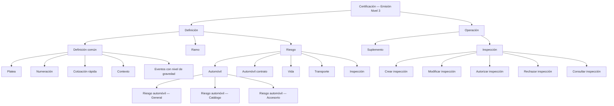
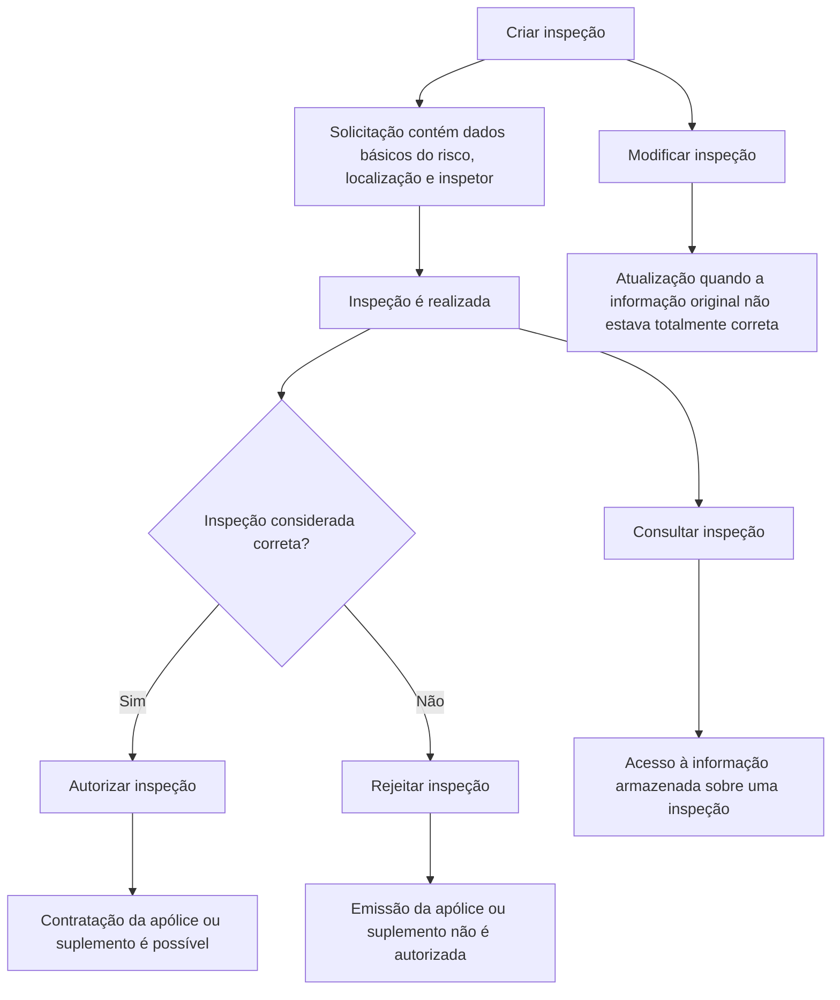

# Certificación — Emisión Nivel 3: Definiciones de Riesgo, Automóvil, Suplementos e Inspecciones

## 1. Metadados do Documento
- **Arquivo de Origem:** Não identificado no conteúdo fornecido
- **Tipo de Documento:** Especificação Funcional / Apresentação Executiva
- **Domínio / Sistema:** Certificación — Emisión Nivel 3; emissão e operação de apólices de seguros
- **Público-Alvo:** Desenvolvedores, Arquitetos, Operação e Negócio
- **Data/Versão Identificada:** Não identificada

---

## 2. Resumo Executivo & Contexto de Negócio

O documento descreve definições e operações funcionais do nível denominado **Certificación — Emisión Nivel 3**, relacionado ao processo de emissão e manutenção de apólices de seguros. O conteúdo organiza elementos de configuração comuns, definições por ramo, definições específicas de risco, catálogos de automóveis, acessórios e operações posteriores à emissão.

No nível de definição comum, o documento inclui elementos necessários à configuração de emissão que não são exclusivos de um ramo. Entre esses elementos estão integração com **Platea**, numeração de apólices e orçamentos, cotização rápida, contextos de exibição de atributos e eventos que podem desencadear ações em apólices.

A área de risco concentra definições aplicáveis aos riscos segurados em uma apólice. O documento detalha especificamente o domínio de automóveis, incluindo tipos e usos de veículos, formatos de matrículas, modalidades permitidas, características de veículos, marcas, modelos, submodelos, valores e acessórios.

A parte operacional descreve suplementos, entendidos como operações de modificação das informações de uma apólice ou aplicação. As operações incluem diminuição e restituição de capital, extensão de vigência, movimentos financeiros relacionados a seguros de vida e operações de inspeção de risco.

O documento não descreve tecnologias de implementação, endpoints HTTP, contratos JSON, servidores, URLs, bancos de dados, permissões ou integrações técnicas além da menção funcional à integração com Platea.

---

## 3. Arquitetura, Componentes & Tecnologias Envolvidas

### Componentes e áreas funcionais identificadas

| Componente / Área | Descrição sustentada pelo documento |
| :--- | :--- |
| Certificación — Emisión Nivel 3 | Nível funcional que reúne definições e operações relacionadas à emissão de seguros. |
| Definición común | Definições não exclusivas do módulo de emissão, mas necessárias para realizar definições. |
| Platea | Aplicação ou ativo citado como necessário para integração; o documento não detalha interfaces ou mecanismos de integração. |
| Ramo | Definições do módulo de emissão que não são exclusivas do ramo configurado. |
| Numeración | Determina os elementos e a ordem que formarão o número de apólice e o número de orçamento. |
| Cotización rápida | Processo que devolve o preço de várias simulações com um mínimo de informações exigidas do cliente. |
| Contexto | Permite criar ambientes para definir quais informações ou atributos não devem ser mostrados. |
| Riesgo | Definições que afetam cada um dos possíveis riscos de uma apólice. |
| Riesgo automóvil — General | Definições gerais necessárias para ramos de automóvel. |
| Riesgo automóvil — Catálogo | Catálogos de dados de veículos. |
| Riesgo automóvil — Accesorio | Definições de acessórios de automóvel. |
| Suplemento | Operações que modificam informações de uma apólice ou aplicação. |
| Inspección | Definições e operações relacionadas a revisões de riscos. |



### Fluxo funcional de inspeção



> **Nota de Análise:** O documento cita Platea como uma aplicação ou ativo integrado, mas não detalha protocolos, métodos, contratos, dados trocados ou responsabilidades técnicas dessa integração.

---

## 4. Regras de Negócio, Especificações Funcionais & Processos

### 4.1 Definições comuns

- **Platea:** definição necessária para a integração com esta aplicação.
- **Numeração:** deve determinar quais elementos formarão o número de apólice e o número de orçamento, bem como a ordem desses elementos.
- **Cotização rápida:** deve devolver o preço de várias simulações utilizando o mínimo de informações requeridas do cliente.
  - Devem ser definidas as simulações para as quais haverá cálculo de preço.
  - Deve ser definida a informação solicitada ao cliente.
  - Deve ser definida a informação que não será solicitada ao cliente.
  - Para informações não solicitadas, deve ser determinado o valor utilizado para calcular o preço.
- **Contexto:** permite criar ambientes nos quais se determina quais informações, identificadas como atributos, não devem ser mostradas.
- **Platea, como ativo:** contempla definições relacionadas à integração com o ativo.
- **Eventos com nível de gravidade:** devem ser definidos eventos com um nível de gravidade capaz de desencadear ações sobre apólices.
  - As ações podem ser **reativas**, quando a apólice já está em carteira.
  - As ações podem ser **proativas**, quando a apólice ainda não foi criada.

### 4.2 Definições de risco

- **Riesgo:** reúne definições que afetam cada um dos possíveis riscos de uma apólice.
- **Automóvil:** contém definições exclusivas para ramos do tipo de negócio automóvel, como definição de matrículas, marcas e modelos.
- **Automóvil contrato:** permite alterar uma definição específica para um cliente ou colaborador.
- **Vida:** o documento informa que são definições exclusivas para ramos do tipo de negócio automóvel, citando matrículas, marcas e modelos.
- **Transporte:** o documento informa que são definições exclusivas para ramos do tipo de negócio automóvel, citando matrículas, marcas e modelos.
- **Inspección:** define quando e como realizar inspeções sobre riscos contratados.
  - Inspeções podem ocorrer antes da contratação.
  - Inspeções podem ocorrer durante o processo de contratação.

> **Nota de Análise:** As descrições de **Vida** e **Transporte** repetem literalmente a explicação atribuída a Automóvil. O documento fornecido não esclarece se essa repetição é intencional ou um erro de conteúdo.

### 4.3 Risco automóvel — definições gerais

- **Tipo de vehículo:** define os tipos de veículos que podem ser segurados.
- **Uso de vehículo:** define os usos de veículos permitidos.
- **Tipo de vehículo por uso:** define o tipo de veículo conforme o uso.
- **Formato de matrícula:** define o formato que as matrículas dos veículos devem ter.
- **Modalidad por ramo:** define as modalidades permitidas.
- **Modalidad por tipo y uso de vehículo:** define as modalidades permitidas conforme o tipo e o uso do veículo.

### 4.4 Risco automóvel — catálogos

- **Tipo de tracción:** define os diferentes tipos de tração que os veículos podem ter.
- **Tipo de fabricación:** define os tipos de fabricação dos veículos.
- **Categoría:** define as categorias dos veículos.
- **Carrocería:** define os tipos de carroceria que os veículos podem ter.
- **Color:** identifica as cores que os veículos podem ter.
- **Marcas de vehículo:** registra as diferentes marcas de veículos.
- **Modelos de vehículo:** registra os modelos de veículos para cada marca identificada.
- **Submodelos de vehículo:** registra os submodelos das marcas e modelos identificados.
- **Valor de vehículo:** registra, por ano, o valor dos veículos segundo marca, modelo e submodelo.

### 4.5 Risco automóvel — acessórios

- **Agrupamiento de accesorio:** define um agrupamento de acessórios.
- **Tipo de accesorio:** define uma tipologia para classificar acessórios.
- **Accesorio:** define os acessórios permitidos, classificados por tipo e agrupamento.
- **Accesorio por tipo de vehículo:** identifica os acessórios permitidos conforme o tipo de veículo.

### 4.6 Operações de suplemento

| Operação | Regra funcional |
| :--- | :--- |
| DISMINUIR póliza por siniestro | Reduz a soma segurada de uma ou mais coberturas afetadas na tramitação de um sinistro. A redução coincide com a liquidação realizada na tramitação e não afeta o custo do seguro. |
| RESTITUIR póliza capital | Restitui a soma segurada que havia sido reduzida por tramitação de sinistro. A restituição afeta o custo do seguro. |
| EXTENDER póliza vigencia | Altera o vencimento da apólice para uma data posterior ao vencimento original. A alteração afeta o custo do seguro. |
| CREAR aportación extraordinaria | Gera movimento quando uma quantia econômica adicional é inserida pontualmente para aumentar expectativas de rentabilidade. |
| CREAR anticipo | No seguro de vida, para modalidades contratuais com direito de resgate previsto, corresponde ao valor que o segurado pode receber por conta do capital que lhe corresponderá quando as condições da apólice forem cumpridas. |
| CREAR cobro de anticipo | Consolidação de um anticipo. |
| CREAR prorrogado | Transformação por redução da apólice na qual o capital segurado para caso de vida é reduzido ou anulado, enquanto o capital para caso de morte permanece vigente durante determinado tempo. |
| CREAR reducción | Quando o tomador ou segurado deixa de pagar os prêmios estipulados, a apólice original é rescindida e surge um novo seguro com prêmio único, representado pelas reservas matemáticas constituídas no contrato original e com capital segurado reduzido conforme os prêmios pagos até aquele momento. |
| CREAR rescate | Por vontade do segurado, permite receber o valor de resgate da provisão matemática constituída sobre o risco garantido. Após o resgate, a apólice resgatada é rescindida automaticamente. |
| CREAR rescate parcial | Equivale a CREAR rescate, mas o valor recebido pelo segurado não corresponde ao total. |

### 4.7 Operações de inspeção

| Operação | Regra funcional |
| :--- | :--- |
| CREAR inspección | Gera uma solicitação de inspeção de risco com dados básicos do risco, localização e inspetor, para avaliar o estado do risco e determinar se ele pode ou não ser segurado pela companhia. |
| MODIFICAR inspección | Atualiza a solicitação de inspeção quando, por qualquer motivo, a informação original não estava totalmente correta. |
| AUTORIZAR inspección | Após a realização da inspeção, quando ela é considerada correta, permite a contratação da apólice ou do suplemento. |
| RECHAZAR inspección | Após a realização da inspeção, quando ela não é considerada correta, não autoriza a emissão da apólice ou do suplemento. |
| CONSULTAR inspección | Permite acessar a informação armazenada sobre uma inspeção. |

---

## 5. Tabelas de Parâmetros, Ambientes e Estruturas de Dados

| Item / Parâmetro | Descrição / Função | Tipo / Valores / Formato | Ambiente / Observações |
| :--- | :--- | :--- | :--- |
| Platea | Integração com aplicação ou ativo denominado Platea | Não detalhado | Não há contratos, URLs ou interfaces descritos |
| Numeração | Compor o número de apólice e o número de orçamento | Elementos e ordem de composição | Aplicável às definições de emissão |
| Cotização rápida | Precificar várias simulações com informação mínima do cliente | Simulações, informações solicitadas, informações não solicitadas e valores substitutos | Processo de cotação |
| Contexto | Determinar atributos que não devem ser mostrados | Ambientes e atributos | Não detalha critérios de visibilidade |
| Evento | Desencadear ação sobre apólice conforme gravidade | Reativo ou proativo | Reativo: apólice em carteira; proativo: apólice ainda não criada |
| Tipo de veículo | Identificar tipos de veículos asseguráveis | Tipos permitidos | Risco automóvel — geral |
| Uso de veículo | Identificar usos permitidos de veículos | Usos permitidos | Risco automóvel — geral |
| Tipo de veículo por uso | Relacionar tipo de veículo ao uso | Relação tipo–uso | Risco automóvel — geral |
| Formato de matrícula | Validar ou definir formato de matrículas | Formato de matrícula | Risco automóvel — geral |
| Modalidade por ramo | Definir modalidades permitidas | Modalidades | Risco automóvel — geral |
| Modalidade por tipo e uso | Definir modalidades conforme tipo e uso | Relação modalidade–tipo–uso | Risco automóvel — geral |
| Tipo de tração | Catalogar tipos de tração | Tipos de tração | Risco automóvel — catálogo |
| Tipo de fabricação | Catalogar tipos de fabricação | Tipos de fabricação | Risco automóvel — catálogo |
| Categoria | Catalogar categorias de veículos | Categorias | Risco automóvel — catálogo |
| Carroceria | Catalogar tipos de carroceria | Tipos de carroceria | Risco automóvel — catálogo |
| Cor | Identificar cores de veículos | Cores | Risco automóvel — catálogo |
| Marca | Registrar marcas de veículos | Marcas | Risco automóvel — catálogo |
| Modelo | Registrar modelos por marca | Relação modelo–marca | Risco automóvel — catálogo |
| Submodelo | Registrar submodelos por marca e modelo | Relação submodelo–marca–modelo | Risco automóvel — catálogo |
| Valor de veículo | Registrar valor anual do veículo | Ano, marca, modelo e submodelo | Risco automóvel — catálogo |
| Agrupamento de acessório | Agrupar acessórios | Agrupamentos | Risco automóvel — acessório |
| Tipo de acessório | Classificar acessórios | Tipologias | Risco automóvel — acessório |
| Acessório | Definir acessórios permitidos | Classificação por tipo e agrupamento | Risco automóvel — acessório |
| Acessório por tipo de veículo | Relacionar acessórios permitidos a tipos de veículo | Relação acessório–tipo de veículo | Risco automóvel — acessório |
| Solicitação de inspeção | Solicitar avaliação de risco | Dados básicos do risco, localização e inspetor | Operação CREAR inspección |

> **Nota de Análise:** O documento não contém URLs, servidores, nomes de ambientes técnicos, portas, variáveis de configuração, arquivos de log, esquemas de dados, tipos de campos ou formatos de payload.

---

## 6. Bateria de Perguntas & Respostas para RAG (FAQ Sintético)

### P1: Qual é a finalidade da numeração no nível de emissão?
**R:** A numeração determina quais elementos formarão o número da apólice e o número do orçamento, além de estabelecer a ordem desses elementos na composição de cada identificador.

### P2: O que é cotização rápida e quais definições ela exige?
**R:** Cotização rápida é um processo que devolve o preço de várias simulações com um mínimo de informações solicitadas ao cliente. A definição deve indicar quais simulações terão preço calculado, quais dados serão solicitados, quais dados não serão solicitados e quais valores serão utilizados para os dados não solicitados.

### P3: Qual é a diferença entre eventos reativos e proativos sobre apólices?
**R:** Eventos reativos desencadeiam ações quando a apólice já está em carteira. Eventos proativos desencadeiam ações quando a apólice ainda não foi criada.

### P4: Quais configurações gerais existem para risco automóvel?
**R:** O risco automóvel geral inclui tipo de veículo, uso de veículo, tipo de veículo por uso, formato de matrícula, modalidade por ramo e modalidade por tipo e uso de veículo.

### P5: Como é determinado o valor de um veículo no catálogo de automóveis?
**R:** O valor de veículo é registrado por ano e depende da marca, do modelo e do submodelo do veículo.

### P6: Como os acessórios de automóvel são organizados?
**R:** Os acessórios são organizados por agrupamento e tipo de acessório. A definição de acessório estabelece os acessórios permitidos classificados por tipo e agrupamento, enquanto acessório por tipo de veículo identifica os acessórios permitidos para cada tipo de veículo.

### P7: O que ocorre na operação DISMINUIR póliza por siniestro?
**R:** A operação reduz a soma segurada de uma ou mais coberturas afetadas durante a tramitação de um sinistro. A redução coincide com a liquidação realizada na tramitação e não afeta o custo do seguro.

### P8: A restituição de capital afeta o custo do seguro?
**R:** Sim. A operação RESTITUIR póliza capital restitui a soma segurada previamente reduzida pela tramitação de um sinistro, e essa restituição afeta o custo do seguro.

### P9: O que acontece após CREAR rescate?
**R:** Em CREAR rescate, o segurado recebe, por sua vontade, o valor de resgate correspondente à provisão matemática constituída sobre o risco garantido. Depois de efetuado o resgate, a apólice resgatada é automaticamente rescindida.

### P10: Em que situação é criada uma redução de apólice?
**R:** CREAR reducción ocorre quando o tomador ou segurado deixa de pagar os prêmios estipulados. A apólice original é rescindida e surge um novo seguro com prêmio único, representado pelas reservas matemáticas constituídas no contrato original e com capital segurado reduzido segundo os prêmios pagos.

### P11: Quais dados são necessários para criar uma inspeção?
**R:** CREAR inspección gera uma solicitação de inspeção de risco com os dados básicos do risco, a localização e o inspetor. A finalidade é avaliar o estado do risco e determinar se ele pode ou não ser segurado pela companhia.

### P12: Qual é a consequência de rejeitar uma inspeção?
**R:** Quando uma inspeção realizada não é considerada correta, a operação RECHAZAR inspección impede a autorização da emissão da apólice ou do suplemento.

---

## 7. Glossário de Termos, Siglas & Conceitos-Chave

- **Apólice / Póliza:** contrato de seguro mencionado nas operações de emissão, suplemento, sinistro, resgate e inspeção.
- **Certificación — Emisión Nivel 3:** nível funcional apresentado pelo documento para definições e operações de emissão.
- **Cotización rápida:** processo de precificação de várias simulações com informações mínimas do cliente.
- **Cobertura:** elemento da apólice cuja soma segurada pode ser reduzida por sinistro.
- **Contexto:** ambiente que determina quais atributos não devem ser mostrados.
- **Emisión:** emissão de apólice ou suplemento.
- **Evento reativo:** evento cuja ação ocorre quando a apólice já está em carteira.
- **Evento proativo:** evento cuja ação ocorre quando a apólice ainda não foi criada.
- **Inspección:** revisão de risco, realizada antes ou durante a contratação, e também conjunto de operações de criação, alteração, autorização, rejeição e consulta.
- **Platea:** aplicação ou ativo citado para fins de integração; o documento não detalha sua natureza técnica.
- **Prêmio / Prima:** valor cujo não pagamento pode levar à operação CREAR reducción.
- **Provisão matemática:** provisão constituída sobre risco garantido, utilizada no contexto de resgate.
- **Ramo:** categoria ou segmento de negócio de seguro para o qual existem definições.
- **Rescate:** operação pela qual o segurado recebe o valor de resgate e a apólice é rescindida.
- **Riesgo:** risco segurado ou conjunto de definições que afetam riscos possíveis de uma apólice.
- **Suplemento:** operação relacionada à modificação das informações contidas em uma apólice ou aplicação.

---

## 8. Notas Críticas, Riscos & Limitações

- O conteúdo não identifica o nome do arquivo, autor, data, versão, organização responsável ou histórico de alterações.
- O documento não apresenta arquitetura técnica de implementação, tecnologias, APIs, protocolos, URLs, servidores, ambientes, persistência de dados, logs ou controles de acesso.
- Platea é mencionada como aplicação ou ativo de integração, porém sem contratos, interfaces, fluxos técnicos ou responsabilidades detalhadas.
- O documento lista **Vida** e **Transporte**, mas suas descrições repetem o texto referente a definições exclusivas de ramos de automóvel. Não há detalhamento adicional que permita corrigir ou reinterpretar essa informação.
- As operações funcionais são descritas conceitualmente, sem critérios de elegibilidade, validações, estados de processo, perfis autorizados, regras de cálculo ou exceções operacionais.
- Não há detalhamento sobre como as modalidades, catálogos, atributos ou valores de veículo são mantidos, versionados ou validados.
- Não são definidos critérios objetivos para considerar uma inspeção “correta”, embora essa condição determine a autorização ou rejeição de emissão de apólice ou suplemento.

---

## 9. Conteúdo Bruto Estruturado (Referência Fiel)

```text
--- [PÁGINA 1 DE 4] ---

CERTIFICACIÓN - EMISIÓN NIVEL 3
DEFINICIÓN
OPERACIÓN
DEFINICIÓN
COMÚN
En este nivel se encuentran definiciones que no son exclusivas del módulo de emisión, pero son necesarias para
poder realizar la definición. Entre otras definiciones se encuentra:
PLATEA
Definición necesaria para la integración con esta aplicación
RAMO
Son definiciones que siendo del módulo de emisión, no son exclusivas del ramo que se está definiendo. Por
ejemplo:
NUMERACIÓN
Determinar que elementos
formarán y en que orden el
número de póliza y el número de
presupuesto
COTIZACIÓN RÁPIDA
Proceso que devuelve el precio de
varias simulaciones con un
mínimo de información requerida
al cliente. En este punto se define
las simulaciones con las que se
dará precio, qué información se
solicitará y qué información no se
solicita al cliente y, para aquella
información que no será
solicitada, determinar el valor con
el que se contará pra dar precio
CONTEXTO
Se pueden crear entornos en los
que determinar que información
(atributos) no mostrar
PLATEA
Definiciones relacionadas con la
integración con este activo
MARCA
 /
 CF
Search Home Solutions Architectures APIs Events Components Cloud Documentation Zeus Reef Help News
EN

--- [PÁGINA 2 DE 4] ---

Fijar eventos con un nivel de
gravedad que puede
desencadenar acciones sobre
pólizas. Estas acciones pueden
ser reactivas (la póliza ya está en
cartera) o proactivas (la póliza aún
no ha sido creada)
RIESGO
Definiciones que afectan a cada uno de los posibles riesgos de la póliza. Por ejemplo:
AUTOMÓVIL
Son definiciones exclusivas para
ramos del tipo de negocio
automóvil. Como por ejemplo, la
definición de matrículas, marcas,
modelos, etc.
AUTOMÓVIL CONTRATO
Alteración de la definición
específica para un cliente o
colaborador
VIDA
Son definiciones exclusivas para
ramos del tipo de negocio
automóvil. Como por ejemplo, la
definición de matrículas, marcas,
modelos, etc.
TRANSPORTE
Son definiciones exclusivas para
ramos del tipo de negocio
automóvil. Como por ejemplo, la
definición de matrículas, marcas,
modelos, etc.
INSPECCIÓN
Definición de cuando y como
realizar inspecciones a los riesgos
contratados. las inspecciones
pueden ser previas a la
contratación o en el proceso de
contratación
RIESGO AUTOMÓVIL - GENERAL
En este nivel se encuentran definiciones generales que son necesarias para ramos de automóvil
TIPO DE VEHÍCULO
Definición de los tipos de
vehículos que se pueden asegurar
USO DE VEHÍCULO
Definición de los usos de
vehículos permitidos
TIPO DE VEHÍCULO POR USO
Definición del tipo de vehículo
según el uso
FORMATO DE MATRÍCULA
Definición del formato que deben
tener las matrículas de los
vehículos
MODALIDAD POR RAMO
Definición de las modalidades
permitidas
MODALIDAD POR TIPO Y USO
DE VEHÍCULO
Definición de las modalidades
permitidas según el tipo y el uso
del vehículo
RIESGO AUTOMÓVIL - CATÁLOGO
Son definiciones de los distintos catálogos de datos de vehículos
TIPO DE TRACCIÓN
Definir los distintos tipo de
tracción que pueden tener los
TIPO DE FABRICACIÓN
Definir los tipos de fabricación de
los vehículos
CATEGORÍA
Definición de las categorías de los
vehículos
CARROCERÍA
Definición de los tipos de
carrocerías que pueden tener los

--- [PÁGINA 3 DE 4] ---

vehículos
vehículos
COLOR
Identificación de los colores que
pueden tener los vehículos
MARCAS DE VEHÍCULO
Registrar las distintas marcas de
vehículos
MODELOS DE VEHÍCULO
Registrar los modelos de los
vehículos de cada marca
identificada
SUBMODELOS DE VEHÍCULO
Registrar los submodelos de las
distintas marcas y modelos
identificados
VALOR DE VEHÍCULO
Registrar el valor, por año, de los
vehículos según la marca, modelo
y submodelo
RIESGO AUTOMÓVIL - ACCESORIO
En este nivel se encuentran definiciones de accesorios de automóvil
AGRUPAMIENTO DE
ACCESORIO
Definir una agrupación de los
accesorios
TIPO DE ACCESORIO
Definir una tipología para clasificar
los accesorios
ACCESORIO
Definir los accesorios permitidos,
clasificados por tipo y
agrupamiento
ACCESORIO POR TIPO DE
VEHÍCULO
Identificar los accesorios
permitidos según el tipo de
vehículo
OPERACIÓN
SUPLEMENTO
Operaciones relacionadas con la modificación de la información que contiene una póliza o aplicación
DISMINUIR póliza por siniestro
Reduce la suma asegurada de
una o varias coberturas afectadas
en la tramitación de un siniestro.
La reducción coincide con la
liquidación realizada por la
tramitación. No afecta al coste del
seguro
RESTITUIR póliza capital
Restituye la suma asegurada que
previamente ha sido reducida por
la tramitación de un siniestro. La
restitución afecta al coste del
seguro
EXTENDER póliza vigencia
Altera el vencimiento de la póliza
llevándolo a una fecha posterior al
vencimiento original. Esta
alteración afecta al coste del
seguro
CREAR aportación
extraordinaria
Movimiento que es generado
cuando se añade una cantidad
económica extra y que se realiza
de forma puntual, con el fin de
incrementar las expectativas de
rentabilidad
CREAR anticipo
En el seguro de vida, y respecto a
las modalidades de contratos en
los que se ha previsto el derecho
de rescate, es la cantidad que
puede percibir el asegurado a
cuenta del capital que en su
momento le corresponda,
cumplidas las condiciones
establecidas en la póliza
CREAR cobro de anticipo
Consolidación de un anticipo
CREAR prorrogado
Es la transformación por reducción
de la póliza en la que, si bien se
reduce o incluso anula el capital
asegurado para caso de vida,
continúa en cambio en vigor el
capital para caso de muerte
durante un cierto tiempo
CREAR reducción
Movimiento que se produce
cuando, al dejar de pagar el
contratante o asegurado las
primas estipuladas, se rescinde la
póliza original, surgiendo un
nuevo seguro con prima única
representada por las reservas
matemáticas que, a favor del
asegurado, se habían constituido
en el contrato primitivo, y con un
capital asegurado disminuido, a
tenor de las primas pagadas hasta
ese momento

--- [PÁGINA 4 DE 4] ---

CREAR rescate
Modificación que por voluntad del
asegurado, este percibe el importe
que le corresponde (valor de
rescate) de la provisión
matemática constituida sobre el
riesgo que tenía garantizado.
Efectuado el rescate, la póliza
rescatada queda automáticamente
rescindida
CREAR rescate parcial
Movimiento equivalente a CREAR
rescate, pero el importe que
recibe el asegurado no es el total
INSPECCIÓN
Operaciones relacionadas con las revisiones de riesgos
CREAR inspección
Se genera una solicitud de
inspección de riesgo con los datos
básicos del riesgo, ubicación e
inspector con el fin de que se
evalúe el estado y pueda o no ser
asegurado por la compañía
MODIFICAR inspección
Se actualiza la solicitud de
inspección si por cualquier motivo
la información original no era
totalmente correcta
AUTORIZAR inspección
Una vez realizada la inspección,
esta se considera correcta y es
posible la contratación de la póliza
o suplemento
RECHAZAR inspección
Una vez realizada la inspección,
esta no se considera correcta y no
se autoriza la emisión de la póliza
o suplemento
CONSULTAR inspección
Permite el acceso a la información
almacenada acerca de una
inspección
```
