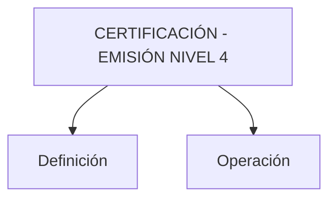

# Certificación — Emisión Nivel 4: Definición y Operación

## 1. Metadados do Documento
- **Arquivo de Origem:** `Não identificado`
- **Tipo de Documento:** `Não identificado`
- **Domínio / Sistema:** `Certificación — Emisión Nivel 4`
- **Público-Alvo:** `Não identificado`
- **Data/Versão Identificada:** `Não identificada`

---

## 2. Resumo Executivo & Contexto de Negócio

O conteúdo fornecido identifica o tema **“CERTIFICACIÓN - EMISIÓN NIVEL 4”** e apresenta os termos **“Definición”** e **“Operación”** como eixos do material. O idioma predominante do trecho é espanhol.

O trecho também contém uma barra de navegação com referências a áreas como `Solutions`, `Architectures`, `APIs`, `Events`, `Components`, `Cloud`, `Documentation`, `Zeus`, `Reef` e `Help`. Não há descrição funcional, técnica ou operacional dessas áreas.

Não foram fornecidas regras de negócio, procedimentos, contratos de API, critérios de certificação, parâmetros de emissão, responsabilidades, integrações ou detalhes de arquitetura. Portanto, o documento permite somente registrar os tópicos explicitamente apresentados.

---

## 3. Arquitetura, Componentes & Tecnologias Envolvidas

Componentes e referências textuais identificadas:

| Componente / Termo | Evidência no conteúdo | Detalhamento disponível |
| :--- | :--- | :--- |
| Certificación | Título “CERTIFICACIÓN - EMISIÓN NIVEL 4” | Não detalhado |
| Emisión Nivel 4 | Título do conteúdo | Não detalhado |
| Definición | Tópico apresentado | Não detalhado |
| Operación | Tópico apresentado | Não detalhado |
| CF | Texto exibido como “/ CF” | Significado não informado |
| Zeus | Item de navegação | Não detalhado |
| Reef | Item de navegação | Não detalhado |
| APIs | Item de navegação | Não detalhado |
| Events | Item de navegação | Não detalhado |
| Components | Item de navegação | Não detalhado |
| Cloud | Item de navegação | Não detalhado |



> **Nota de Análise:** O conteúdo não descreve relações técnicas, fluxos de dados, protocolos, integrações, tecnologias, ambientes ou responsabilidades entre os itens listados.

---

## 4. Regras de Negócio, Especificações Funcionais & Processos

O conteúdo apresenta os tópicos `Definición` e `Operación`, mas não contém regras de negócio, etapas de processo, condições de validação, critérios de aprovação, cálculos, exceções ou responsabilidades operacionais.

| Elemento identificado | Informação disponível |
| :--- | :--- |
| Definición | Apenas o termo é apresentado. |
| Operación | Apenas o termo é apresentado. |
| Certificación - Emisión Nivel 4 | Apenas o título é apresentado. |
| CF | Apenas a sigla/termo `CF` é exibida após `/`; não há definição. |

> **Nota de Análise:** Não é possível derivar o processo de certificação ou emissão de nível 4 a partir do trecho disponibilizado.

---

## 5. Tabelas de Parâmetros, Ambientes e Estruturas de Dados

| Item / Parâmetro | Descrição / Função | Tipo / Valores / Formato | Ambiente / Observações |
| :--- | :--- | :--- | :--- |
| Certificación | Tema principal exibido no título | Texto | Associado a “Emisión Nivel 4” |
| Emisión Nivel 4 | Nível ou classificação citada no título | Texto | Sem critérios ou definição |
| Definición | Seção/tópico listado | Texto | Sem detalhamento adicional |
| Operación | Seção/tópico listado | Texto | Sem detalhamento adicional |
| CF | Termo exibido no conteúdo | Texto | Significado não identificado |
| Search | Item de navegação | Texto | Sem detalhamento |
| Home | Item de navegação | Texto | Sem detalhamento |
| Solutions | Item de navegação | Texto | Sem detalhamento |
| Architectures | Item de navegação | Texto | Sem detalhamento |
| APIs | Item de navegação | Texto | Sem detalhamento |
| Events | Item de navegação | Texto | Sem detalhamento |
| Components | Item de navegação | Texto | Sem detalhamento |
| Cloud | Item de navegação | Texto | Sem detalhamento |
| Documentation | Item de navegação | Texto | Sem detalhamento |
| Zeus | Item de navegação | Texto | Sem detalhamento |
| Reef | Item de navegação | Texto | Sem detalhamento |
| Help | Item de navegação | Texto | Sem detalhamento |
| News | Item de navegação | Texto | Sem detalhamento |
| EN | Indicador textual exibido | Texto | Possível indicador de idioma; não confirmado pelo conteúdo |

---

## 6. Bateria de Perguntas & Respostas para RAG (FAQ Sintético)

### P1: Qual é o tema principal do documento?
**R:** O tema principal identificado no conteúdo é **“CERTIFICACIÓN - EMISIÓN NIVEL 4”**.

### P2: Quais tópicos principais são apresentados para Certificación - Emisión Nivel 4?
**R:** O conteúdo apresenta os tópicos **“Definición”** e **“Operación”**, sem fornecer explicações adicionais.

### P3: O documento explica o que significa Emisión Nivel 4?
**R:** Não. O termo **“Emisión Nivel 4”** aparece no título, mas não possui definição, critérios, escopo ou regras associadas no conteúdo fornecido.

### P4: Quais são as regras de negócio da certificação?
**R:** O conteúdo não descreve regras de negócio, critérios de elegibilidade, validações, cálculos ou condições para a certificação.

### P5: Existe um procedimento operacional para a emissão de nível 4?
**R:** Não. Embora o termo **“Operación”** seja apresentado, o trecho não contém etapas, responsáveis, entradas, saídas ou exceções operacionais.

### P6: O que significa a sigla CF no documento?
**R:** O conteúdo exibe o texto **“/ CF”**, mas não define o significado de **CF**.

### P7: Quais referências de navegação aparecem no conteúdo?
**R:** As referências exibidas são: `Search`, `Home`, `Solutions`, `Architectures`, `APIs`, `Events`, `Components`, `Cloud`, `Documentation`, `Zeus`, `Reef`, `Help`, `News` e `EN`.

### P8: O documento especifica APIs relacionadas à certificação?
**R:** Não. Embora `APIs` apareça como item de navegação, não há endpoints, métodos HTTP, contratos, autenticação ou exemplos de integração.

### P9: O documento detalha a relação entre Zeus e Reef?
**R:** Não. `Zeus` e `Reef` aparecem apenas como itens de navegação, sem descrição de função, arquitetura ou relacionamento.

### P10: Há informações sobre ambientes, servidores ou URLs?
**R:** Não. O conteúdo fornecido não apresenta URLs, nomes de servidores, ambientes, portas, variáveis de configuração ou rotas de log.

---

## 7. Glossário de Termos, Siglas & Conceitos-Chave

- **Certificación:** Termo apresentado no título; o conteúdo não fornece definição.
- **Emisión Nivel 4:** Termo apresentado no título; o conteúdo não explica o que caracteriza o nível 4.
- **Definición:** Tópico apresentado sem detalhamento.
- **Operación:** Tópico apresentado sem detalhamento.
- **CF:** Sigla ou termo exibido no conteúdo; significado não informado.
- **APIs:** Item de navegação apresentado sem especificação técnica.
- **Zeus:** Item de navegação apresentado sem definição.
- **Reef:** Item de navegação apresentado sem definição.

---

## 8. Notas Críticas, Riscos & Limitações

- O conteúdo é extremamente resumido e não sustenta uma especificação funcional, técnica ou operacional completa.
- Não há identificação do arquivo de origem, autor, data, versão ou público-alvo.
- Não foram encontrados critérios para `Emisión Nivel 4`.
- Não foram encontrados fluxos operacionais, contratos de integração, APIs, parâmetros, ambientes ou dados estruturados.
- Os termos `CF`, `Zeus` e `Reef` não são definidos.
- As referências de navegação não devem ser interpretadas como componentes integrados ao processo de certificação sem evidência adicional.

---

## 9. Conteúdo Bruto Estruturado (Referência Fiel)

```text
--- [PÁGINA 1 DE 1] ---

CERTIFICACIÓN - EMISIÓN NIVEL 4
Definición
Operación
DEFINICIÓN
OPERACIÓN
 / 
 CF
Search Home Solutions Architectures APIs Events Components Cloud Documentation Zeus Reef Help News
EN
```
