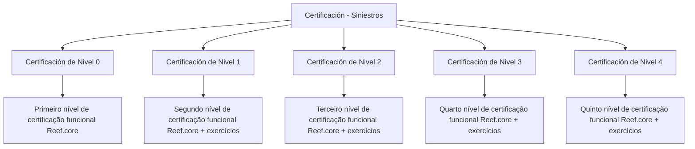

# Certificação de Sinistros — Trilhas de Certificação Funcional Reef.core

## 1. Metadados do Documento
- **Arquivo de Origem:** Não identificado
- **Tipo de Documento:** Procedimento / Documentação de certificação
- **Domínio / Sistema:** Siniestros; Reef.core
- **Público-Alvo:** Profissionais que buscam certificação funcional em Reef.core
- **Data/Versão Identificada:** Não identificada

---

## 2. Resumo Executivo & Contexto de Negócio

O documento apresenta a área **“Certificación - Siniestros”**, que reúne os conteúdos programáticos dos níveis de certificação relacionados a sinistros. A estrutura descrita organiza uma progressão de cinco níveis: do nível 0 ao nível 4.

A certificação funcional em **Reef.core** é apresentada como uma trilha incremental. O nível 0 corresponde ao primeiro nível de certificação funcional; os níveis 1, 2, 3 e 4 correspondem, respectivamente, ao segundo, terceiro, quarto e quinto níveis.

A partir do nível 1, o texto declara que o conteúdo programático é acompanhado por exercícios. O documento não especifica os temas, critérios de aprovação, duração, pré-requisitos formais, formato dos exercícios ou mecanismos de avaliação.

---

## 3. Arquitetura, Componentes & Tecnologias Envolvidas

Os elementos identificados no conteúdo são:

- **Siniestros:** domínio ou seção funcional que agrupa os conteúdos de certificação.
- **Reef.core:** sistema mencionado como objeto da certificação funcional.
- **Níveis de certificação:** níveis 0, 1, 2, 3 e 4.
- **Exercícios:** mencionados nos níveis 1 a 4.



> **Nota de Análise:** O conteúdo não descreve arquitetura de software, integrações, APIs, tecnologias de implementação, ambientes ou contratos técnicos do Reef.core.

---

## 4. Regras de Negócio, Especificações Funcionais & Processos

1. A seção **“Certificación - Siniestros”** concentra os conteúdos programáticos de cada nível de certificação de sinistros.
2. A **Certificación de Nivel 0** requer o conhecimento do conteúdo programático necessário para obter o primeiro nível de certificação funcional de Reef.core.
3. A **Certificación de Nivel 1** requer o conhecimento do conteúdo programático e exercícios para obter o segundo nível de certificação funcional de Reef.core.
4. A **Certificación de Nivel 2** requer o conhecimento do conteúdo programático e exercícios para obter o terceiro nível de certificação funcional de Reef.core.
5. A **Certificación de Nivel 3** requer o conhecimento do conteúdo programático e exercícios para obter o quarto nível de certificação funcional de Reef.core.
6. A **Certificación de Nivel 4** requer o conhecimento do conteúdo programático e exercícios para obter o quinto nível de certificação funcional de Reef.core.
7. O texto não declara explicitamente que a conclusão de um nível seja pré-requisito formal para acessar o próximo nível.
8. O texto não detalha conteúdos específicos, notas mínimas, frequência, carga horária, evidências de conclusão ou critérios de correção dos exercícios.

---

## 5. Tabelas de Parâmetros, Ambientes e Estruturas de Dados

| Item / Parâmetro | Descrição / Função | Tipo / Valores / Formato | Ambiente / Observações |
| :--- | :--- | :--- | :--- |
| Certificación - Siniestros | Seção que contém os conteúdos programáticos dos níveis de certificação de sinistros | Área de documentação | Não detalha ambiente técnico |
| Certificación de Nivel 0 | Conteúdo necessário para o primeiro nível de certificação funcional de Reef.core | Nível de certificação | Exercícios não são mencionados |
| Certificación de Nivel 1 | Conteúdo e exercícios para o segundo nível de certificação funcional de Reef.core | Nível de certificação | Exercícios são mencionados |
| Certificación de Nivel 2 | Conteúdo e exercícios para o terceiro nível de certificação funcional de Reef.core | Nível de certificação | Exercícios são mencionados |
| Certificación de Nivel 3 | Conteúdo e exercícios para o quarto nível de certificação funcional de Reef.core | Nível de certificação | Exercícios são mencionados |
| Certificación de Nivel 4 | Conteúdo e exercícios para o quinto nível de certificação funcional de Reef.core | Nível de certificação | Exercícios são mencionados |
| Reef.core | Sistema associado à certificação funcional | Sistema / domínio funcional | Não há detalhamento técnico adicional |
| APIs | Item visível na navegação da página | Navegação | Não há especificações de API no conteúdo extraído |
| Documentación | Item visível na navegação da página | Navegação | Não há detalhamento adicional |
| Zeus | Item visível na navegação da página | Navegação | Não há explicação sobre sua função |

---

## 6. Bateria de Perguntas & Respostas para RAG (FAQ Sintético)

### P1: Qual é o objetivo da seção “Certificación - Siniestros”?
**R:** A seção “Certificación - Siniestros” reúne os conteúdos programáticos de cada um dos níveis de certificação relacionados a sinistros.

### P2: Quantos níveis de certificação funcional Reef.core são mencionados?
**R:** O documento menciona cinco níveis de certificação funcional Reef.core: níveis 0, 1, 2, 3 e 4.

### P3: O que é necessário para obter a certificação de nível 0?
**R:** Para obter o primeiro nível de certificação funcional Reef.core, o documento informa que é necessário conhecer o conteúdo programático da Certificación de Nivel 0.

### P4: A certificação de nível 1 inclui exercícios?
**R:** Sim. A Certificación de Nivel 1 inclui o conteúdo programático necessário e exercícios para obter o segundo nível de certificação funcional Reef.core.

### P5: Qual nível corresponde ao terceiro nível de certificação funcional Reef.core?
**R:** A Certificación de Nivel 2 corresponde ao terceiro nível de certificação funcional Reef.core e inclui conteúdo programático e exercícios.

### P6: Qual certificação corresponde ao quarto nível funcional de Reef.core?
**R:** A Certificación de Nivel 3 corresponde ao quarto nível de certificação funcional Reef.core e inclui conteúdo programático e exercícios.

### P7: Qual certificação permite obter o quinto nível funcional de Reef.core?
**R:** A Certificación de Nivel 4 apresenta o conteúdo programático e exercícios necessários para obter o quinto nível de certificação funcional Reef.core.

### P8: O documento define os temas que devem ser estudados em cada nível?
**R:** Não. O documento informa que existem conteúdos programáticos para cada nível, mas não lista os temas, módulos ou tópicos específicos.

### P9: O documento informa critérios de aprovação ou notas mínimas?
**R:** Não. Não há critérios de aprovação, notas mínimas, duração, carga horária ou método de avaliação descritos no conteúdo extraído.

### P10: O nível 0 possui exercícios?
**R:** O texto da Certificación de Nivel 0 menciona apenas o conteúdo programático necessário para o primeiro nível funcional de Reef.core. Exercícios não são mencionados para o nível 0.

---

## 7. Glossário de Termos, Siglas & Conceitos-Chave

- **Siniestros:** termo em espanhol utilizado como título da área de certificação; o documento não fornece definição adicional.
- **Reef.core:** sistema ou produto associado à certificação funcional.
- **Certificación de Nivel 0:** trilha para obtenção do primeiro nível de certificação funcional Reef.core.
- **Certificación de Nivel 1:** trilha para obtenção do segundo nível de certificação funcional Reef.core.
- **Certificación de Nivel 2:** trilha para obtenção do terceiro nível de certificação funcional Reef.core.
- **Certificación de Nivel 3:** trilha para obtenção do quarto nível de certificação funcional Reef.core.
- **Certificación de Nivel 4:** trilha para obtenção do quinto nível de certificação funcional Reef.core.
- **Temario:** conteúdo programático necessário para um nível de certificação.

---

## 8. Notas Críticas, Riscos & Limitações

- O documento não identifica arquivo de origem, autoria, versão ou data de publicação.
- Não há detalhamento dos conteúdos programáticos de nenhum nível de certificação.
- Não há critérios explícitos de aprovação, pré-requisitos, duração, notas ou formato de avaliação.
- Não há descrição dos exercícios citados nos níveis 1 a 4.
- Não há especificações técnicas sobre Reef.core, APIs, Zeus ou ambientes.
- O texto do nível 4 é dividido entre as duas páginas extraídas, mas mantém a indicação de obtenção do quinto nível funcional de Reef.core.

---

## 9. Conteúdo Bruto Estruturado (Referência Fiel)

```text
--- [PÁGINA 1 DE 2] ---

CERTIFICACIÓN - SINIESTROS
 En este apartado se encuentran los temarios de cada uno de los niveles de
certificación de siniestros
CERTIFICACIÓN DE NIVEL 0
En este apartado se encuentra el temario que
se necesita conocer para obtener el primer
nivel de certificación funcional de Reef.core
CERTIFICACIÓN DE NIVEL 1
En este apartado se encuentra el temario que
se necesita conocer junto con ejercicios para
obtener el segundo nivel de certificación
funcional de Reef.core
CERTIFICACIÓN DE NIVEL 2
En este apartado se encuentra el temario que
se necesita conocer junto con ejercicios para
obtener el tercer nivel de certificación
funcional de Reef.core
CERTIFICACIÓN DE NIVEL 3
En este apartado se encuentra el temario que
se necesita conocer junto con ejercicios para
obtener el cuarto nivel de certificación
funcional de Reef.core
CERTIFICACIÓN DE NIVEL 4
En este apartado se encuentra el temario que
se necesita conocer junto con ejercicios para
 / 
 RS
Inicio Soluciones APIs Documentación Zeus
ES


--- [PÁGINA 2 DE 2] ---

obtener el quinto nivel de certificación
funcional de Reef.core
```
