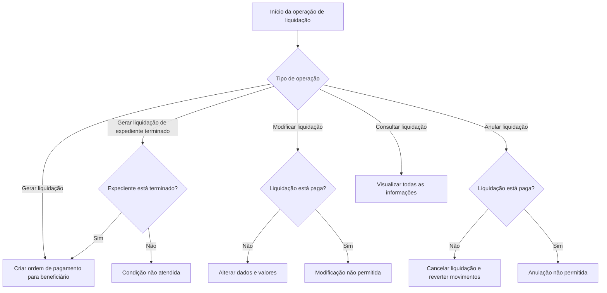

# Certificação de Sinistros — Liquidações de Expedientes: Definições e Operações

## 1. Metadados do Documento
- **Arquivo de Origem:** Não identificado no conteúdo fornecido
- **Tipo de Documento:** Apresentação Executiva / Manual Funcional
- **Domínio / Sistema:** Certificação de Sinistros — Liquidações de Expedientes
- **Público-Alvo:** Analistas funcionais, operação, negócio, desenvolvedores e arquitetos
- **Data/Versão Identificada:** Não identificada

---

## 2. Resumo Executivo & Contexto de Negócio

O documento descreve definições e operações do domínio de **liquidações de expedientes** no contexto de certificação de sinistros. O conteúdo organiza as configurações necessárias para registrar, validar, controlar e executar liquidações associadas a um expediente de sinistro.

As definições funcionais são apresentadas em níveis distintos: **Comum**, **Geral**, **Ramo** e **Liquidação**. O nível Comum contém cadastros reutilizáveis e não exclusivos do módulo de sinistros, como oficinas pagadoras, documentos de pagamento, conceitos de cobrança e pagamento, impostos, numeração de ordens de pagamento e controle técnico.

O nível Geral concentra definições que afetam todas as liquidações, especialmente as causas de processo, que categorizam os motivos pelos quais operações de liquidação são realizadas. O nível Ramo reúne características gerais do módulo de sinistros e causas de processo, incluindo comportamentos como o eventual registro de faturas de sinistros.

O nível Liquidação contém as configurações que afetam cada possível liquidação de um expediente: atributos, estruturas de informação, dados iniciais, validações, conceitos econômicos, beneficiários, valores iniciais e máximos e controles técnicos. Por fim, o documento relaciona operações disponíveis para liquidações de expedientes, executáveis em linha ou de forma diferida.

---

## 3. Arquitetura, Componentes & Tecnologias Envolvidas

O conteúdo não especifica arquitetura técnica de infraestrutura, protocolos, bancos de dados, APIs, microsserviços, URLs, ambientes, linguagens ou ferramentas de desenvolvimento. A estrutura apresentada é funcional e hierárquica, composta por níveis de definição e operações de liquidação.

### Componentes funcionais identificados

| Componente / Módulo | Descrição sustentada pelo documento |
| :--- | :--- |
| Certificação de Sinistros | Contexto no qual o documento apresenta liquidações de expedientes. |
| Liquidações de Expedientes | Domínio funcional que concentra definições e operações de liquidação associadas a um expediente. |
| Nível Comum | Reúne definições não exclusivas do módulo de sinistros, mas necessárias para a configuração de liquidações. |
| Nível Geral | Reúne definições que afetam todas as liquidações. |
| Nível Ramo | Reúne definições que afetam todas as liquidações e características gerais do módulo de sinistros. |
| Nível Liquidação | Reúne definições que afetam cada possível liquidação de um expediente. |
| Operações de Liquidação | Operações de gerar, gerar para expediente terminado, modificar, anular e consultar liquidações. |
| Ordem de Pagamento | Resultado gerado para um beneficiário nas operações de geração de liquidação. |
| Controle Técnico | Definições de erros, tipos de erros e condições de paralisação ou autorização de operações de liquidação. |

```mermaid
graph TD
    A[Certificação de Sinistros] --> B[Liquidações de Expedientes]

    B --> C[Definições]
    B --> D[Operações]

    C --> C1[Nível Comum]
    C --> C2[Nível Geral]
    C --> C3[Nível Ramo]
    C --> C4[Nível Liquidação]

    C1 --> C11[Oficinas Pagadoras]
    C1 --> C12[Documentos de Pagamento]
    C1 --> C13[Conceitos de Cobrança e Pagamento]
    C1 --> C14[Impostos]
    C1 --> C15[Numeração de Ordens de Pagamento]
    C1 --> C16[Controle Técnico]

    C2 --> C21[Causas de Processos]

    C3 --> C31[Características Gerais]
    C3 --> C32[Causa de Processo]

    C4 --> C41[Atributo]
    C4 --> C42[Estrutura]
    C4 --> C43[Informação Inicial]
    C4 --> C44[Validação de Informação]
    C4 --> C45[Conceito de Cobrança e Pagamento]
    C4 --> C46[Beneficiários da Liquidação]
    C4 --> C47[Valor Inicial]
    C4 --> C48[Valor Máximo]
    C4 --> C49[Controle Técnico]

    D --> D1[Gerar Liquidação]
    D --> D2[Gerar Liquidação de Expediente Terminado]
    D --> D3[Modificar Liquidação]
    D --> D4[Anular Liquidação]
    D --> D5[Consultar Liquidação]

    D1 --> E[Ordem de Pagamento para Beneficiário]
    D2 --> E
```



> **Nota de Análise:** O documento não detalha componentes técnicos, métodos HTTP, contratos JSON, integrações, mecanismos de persistência, trilhas de auditoria ou fluxos de aprovação específicos.

---

## 4. Regras de Negócio, Especificações Funcionais & Processos

### 4.1. Organização das definições de liquidação

As definições de liquidações de expedientes são organizadas em quatro níveis funcionais:

1. **Comum:** contém definições necessárias à configuração, mas não exclusivas do módulo de sinistros.
2. **Geral:** contém definições que afetam todas as liquidações.
3. **Ramo:** contém definições que afetam todas as liquidações e características do módulo de sinistros.
4. **Liquidação:** contém definições específicas para cada possível liquidação de um expediente.

### 4.2. Regras e definições do nível Comum

- **Oficinas Pagadoras:** permitem registrar oficinas que podem realizar pagamentos.
- **Documentos de Pagamento:** permitem registrar documentos que podem ser pagos ou cobrados. Os exemplos citados são fatura e nota de crédito.
- **Conceitos de Cobrança e Pagamento:** definem o detalhamento econômico que as ordens de pagamento transportarão para detalhar o gasto.
- **Imposto:** define tipos de obrigações tributárias a considerar, além de características e formas de cálculo.
- **Numeração de Ordens de Pagamento:** define o conjunto de ordens de pagamento.
- **Controle Técnico:** define erros e tipos de erros de liquidações.

### 4.3. Regras e definições do nível Geral

- **Causas de Processos:** classificam os motivos pelos quais uma operação de liquidações deve ser realizada.

### 4.4. Regras e definições do nível Ramo

- **Características Gerais:** definem características gerais do módulo de sinistros e determinam comportamentos do módulo de liquidações.
- O documento cita como exemplo de comportamento a definição de se serão registradas faturas de sinistros.
- **Causa de Processo:** cataloga os motivos para executar uma operação de liquidação.
- O documento cita como exemplo a causa ou motivo para a anulação de uma liquidação.

### 4.5. Regras e definições do nível Liquidação

- **Atributo:** define informações adicionais da liquidação, como dados de quitação (*finiquito*).
- **Estrutura:** organiza informações adicionais da liquidação compostas por atributos, pela obrigatoriedade ou não de solicitar informação e pela ordem em que a informação será solicitada.
- **Informação Inicial:** permite registrar informações prévias para atributos das operações de liquidação, evitando a inserção posterior dessas informações.
  - Exemplo apresentado: preencher inicialmente a moeda de uma fatura com a moeda do país.
- **Validação de Informação:** define comportamentos e validações das informações de núcleo (*core*) solicitadas nas operações de liquidações.
  - Exemplo apresentado: se o documento for Real, o fornecedor da fatura não pode ser o tomador nem o segurado.
- **Conceito de Cobrança e Pagamento:** determina o detalhamento econômico das liquidações.
- **Beneficiários da Liquidação:** determina as pessoas físicas e jurídicas às quais uma liquidação pode pagar ou cobrar.
- **Valor Inicial:** define o valor pelo qual serão liquidados o conceito de reserva e o conceito de cobrança e pagamento diverso.
- **Valor Máximo:** determina o valor máximo pelo qual podem ser liquidados uma cobertura, um conceito de reserva ou um conceito de cobrança e pagamento diverso.
- **Controle Técnico:** define as condições em que operações de liquidação podem ser paralisadas ou em que se tornam obrigatoriamente sujeitas a autorização.

### 4.6. Operações de liquidação de expedientes

As operações de liquidações de um expediente podem ser realizadas **em linha** ou **de forma diferida**.

| Operação | Regra funcional |
| :--- | :--- |
| Gerar liquidação | Permite criar uma ordem de pagamento para um beneficiário. |
| Gerar liquidação — Expediente Terminado | Permite criar uma ordem de pagamento para um beneficiário quando o expediente está terminado. |
| Modificar liquidação | Permite alterar informações e valores de uma liquidação, desde que a liquidação não esteja paga. |
| Anular liquidação | Cancela uma liquidação e reverte seus movimentos, desde que a liquidação não esteja paga. |
| Consultar liquidação | Permite visualizar todas as informações de uma liquidação. |



---

## 5. Tabelas de Parâmetros, Ambientes e Estruturas de Dados

### 5.1. Definições do nível Comum

| Item / Parâmetro | Descrição / Função | Tipo / Valores / Formato | Ambiente / Observações |
| :--- | :--- | :--- | :--- |
| Oficinas Pagadoras | Registro de oficinas que podem realizar pagamentos. | Cadastro funcional. | Não exclusivo do módulo de sinistros. |
| Documentos de Pagamento | Registro de documentos que podem ser pagos ou cobrados. | Exemplos: fatura; nota de crédito. | Não exclusivo do módulo de sinistros. |
| Conceitos de Cobrança e Pagamento | Define o detalhamento econômico das ordens de pagamento para detalhar o gasto. | Definição econômica. | Não exclusivo do módulo de sinistros. |
| Imposto | Define tipos de obrigações tributárias, características e formas de cálculo. | Definição tributária. | Não exclusivo do módulo de sinistros. |
| Numeração de Ordens de Pagamento | Define o conjunto de ordens de pagamento. | Numeração de ordens. | Não exclusivo do módulo de sinistros. |
| Controle Técnico | Define erros e tipos de erros de liquidações. | Regras de controle e erro. | Não exclusivo do módulo de sinistros. |

### 5.2. Definições dos níveis Geral e Ramo

| Item / Parâmetro | Descrição / Função | Tipo / Valores / Formato | Ambiente / Observações |
| :--- | :--- | :--- | :--- |
| Causas de Processos | Cataloga os motivos pelos quais uma operação de liquidações deve ser realizada. | Catálogo de causas. | Nível Geral; afeta todas as liquidações. |
| Características Gerais | Define características gerais do módulo de sinistros e comportamentos do módulo de liquidações. | Configuração funcional. | Nível Ramo. Exemplo: definir se serão registradas faturas de sinistros. |
| Causa de Processo | Cataloga motivos para realizar uma operação de liquidação. | Catálogo de causas. | Nível Ramo. Exemplo: motivo para anulação de uma liquidação. |

### 5.3. Definições do nível Liquidação

| Item / Parâmetro | Descrição / Função | Tipo / Valores / Formato | Ambiente / Observações |
| :--- | :--- | :--- | :--- |
| Atributo | Define informação adicional da liquidação. | Dados adicionais. | Exemplo: dados de quitação (*finiquito*). |
| Estrutura | Organiza informações adicionais compostas por atributos, obrigatoriedade e ordem de solicitação. | Estrutura de atributos. | Define se uma informação deve ou não ser solicitada. |
| Informação Inicial | Registra informações prévias para atributos de operações de liquidação. | Valor inicial de atributo. | Exemplo: moeda inicial da fatura igual à moeda do país. |
| Validação de Informação | Define comportamentos e validações da informação de núcleo solicitada em operações de liquidação. | Regra de validação. | Se documento for Real, fornecedor não pode ser tomador nem segurado. |
| Conceito de Cobrança e Pagamento | Determina o detalhamento econômico das liquidações. | Definição econômica. | Nível Liquidação. |
| Beneficiários da Liquidação | Determina pessoas físicas e jurídicas que podem receber ou pagar uma liquidação. | Pessoas físicas e jurídicas. | Nível Liquidação. |
| Valor Inicial | Define o valor para liquidar conceito de reserva e conceito de cobrança e pagamento diverso. | Valor monetário. | Nível Liquidação. |
| Valor Máximo | Define o valor máximo para liquidar cobertura, conceito de reserva ou conceito de cobrança e pagamento diverso. | Valor monetário máximo. | Nível Liquidação. |
| Controle Técnico | Define condições de paralisação ou de autorização obrigatória das operações de liquidação. | Regra de controle técnico. | Nível Liquidação. |

### 5.4. Restrições operacionais

| Item / Parâmetro | Descrição / Função | Tipo / Valores / Formato | Ambiente / Observações |
| :--- | :--- | :--- | :--- |
| Canal de execução | As operações de liquidações podem ser executadas em linha ou de forma diferida. | Em linha; diferido. | Aplicável a liquidações de expedientes. |
| Condição para modificar | A liquidação pode ter dados e valores modificados somente quando não estiver paga. | Estado: não paga. | Restrição explícita da operação Modificar liquidação. |
| Condição para anular | A liquidação pode ser cancelada e ter movimentos revertidos somente quando não estiver paga. | Estado: não paga. | Restrição explícita da operação Anular liquidação. |
| Geração para expediente terminado | A ordem de pagamento pode ser criada para beneficiário quando o expediente está terminado. | Estado: expediente terminado. | Aplicável à operação Gerar liquidação — Expediente Terminado. |

> **Nota de Análise:** O documento não informa nomes de ambientes, servidores, URLs, caminhos de logs, portas, variáveis de configuração, formatos de payload ou estruturas técnicas de banco de dados.

---

## 6. Bateria de Perguntas & Respostas para RAG (FAQ Sintético)

### P1: Quais são os níveis de definição usados nas liquidações de expedientes?
**R:** As definições são organizadas em quatro níveis: Comum, Geral, Ramo e Liquidação. O nível Comum reúne cadastros necessários, mas não exclusivos de sinistros; o nível Geral afeta todas as liquidações; o nível Ramo define características e causas ligadas ao módulo de sinistros; e o nível Liquidação reúne configurações específicas de cada possível liquidação de um expediente.

### P2: O que são Oficinas Pagadoras no contexto de liquidações?
**R:** Oficinas Pagadoras são um registro de oficinas que podem realizar pagamentos. O documento posiciona essa definição no nível Comum, indicando que ela não é exclusiva do módulo de sinistros, embora seja necessária para a definição de liquidações.

### P3: Qual é a finalidade dos Documentos de Pagamento?
**R:** Documentos de Pagamento registram documentos que podem ser pagos ou cobrados. O documento apresenta fatura e nota de crédito como exemplos desses documentos.

### P4: Como os conceitos de cobrança e pagamento são utilizados?
**R:** Os Conceitos de Cobrança e Pagamento definem o detalhamento econômico das ordens de pagamento para detalhar o gasto. No nível Liquidação, o mesmo conceito determina o detalhamento econômico das liquidações.

### P5: Qual validação é aplicada quando o documento é Real?
**R:** Quando o documento é Real, o fornecedor da fatura não pode ser o tomador nem o segurado. Essa regra é citada como exemplo das validações de informação de núcleo solicitadas nas operações de liquidações.

### P6: O que a Estrutura de uma liquidação configura?
**R:** A Estrutura configura informações adicionais da liquidação compostas por atributos. Também define a obrigatoriedade ou não de solicitar cada informação e a ordem em que essas informações serão solicitadas.

### P7: Para que serve a Informação Inicial em uma operação de liquidação?
**R:** A Informação Inicial permite registrar previamente dados para atributos das operações de liquidação, evitando sua introdução posterior. O exemplo fornecido define que a moeda inicial de uma fatura pode receber o valor da moeda do país.

### P8: Quem pode ser beneficiário de uma liquidação?
**R:** Beneficiários da Liquidação são as pessoas físicas e jurídicas para as quais uma liquidação pode efetuar pagamento ou cobrança. O documento não apresenta critérios adicionais de elegibilidade.

### P9: Em quais situações uma liquidação pode ser modificada?
**R:** Uma liquidação pode ter suas informações e valores modificados somente quando ainda não estiver paga. A operação de modificação permite alterar tanto dados quanto importes, respeitando essa condição.

### P10: Quando uma liquidação pode ser anulada?
**R:** Uma liquidação pode ser anulada quando não estiver paga. A anulação cancela a liquidação e reverte seus movimentos; se a liquidação estiver paga, o documento não permite essa operação.

### P11: O que significa Gerar liquidação — Expediente Terminado?
**R:** Essa operação permite criar uma ordem de pagamento para um beneficiário quando o expediente está terminado. O estado de expediente terminado é a condição explicitamente indicada pelo documento para essa modalidade de geração.

### P12: Quais são as responsabilidades do Controle Técnico em liquidações?
**R:** O Controle Técnico define erros e tipos de erros de liquidações. No nível Liquidação, o Controle Técnico também determina em quais condições uma operação de liquidação pode ser paralisada ou deve ser obrigatoriamente autorizada.

### P13: O que são Causas de Processos?
**R:** Causas de Processos são classificações dos motivos pelos quais se deseja realizar uma operação de liquidações. No nível Ramo, o documento exemplifica uma causa de processo como o motivo para anular uma liquidação.

### P14: As operações de liquidações de expedientes são apenas on-line?
**R:** Não. O documento informa que as operações de liquidações de um expediente podem ser realizadas tanto em linha quanto de forma diferida.

---

## 7. Glossário de Termos, Siglas & Conceitos-Chave

- **Certificação de Sinistros:** Contexto funcional indicado pelo título do documento para as liquidações de expedientes.
- **Expediente:** Entidade à qual as operações e definições de liquidações estão associadas.
- **Liquidação:** Operação ou registro cujo objetivo inclui criar ordens de pagamento, modificar dados ou importes, anular e consultar informações.
- **Oficinas Pagadoras:** Oficinas registradas que podem realizar pagamentos.
- **Documento de Pagamento:** Documento que pode ser pago ou cobrado, como fatura ou nota de crédito.
- **Conceito de Cobrança e Pagamento:** Definição do detalhamento econômico associado a ordens de pagamento e liquidações.
- **Imposto:** Tipo de obrigação tributária com características e formas de cálculo a considerar.
- **Ordem de Pagamento:** Ordem criada para um beneficiário durante a geração de uma liquidação.
- **Causa de Processo:** Motivo catalogado para realizar uma operação de liquidação.
- **Atributo:** Informação adicional da liquidação.
- **Estrutura:** Organização de atributos, obrigatoriedade de solicitação e ordem de apresentação ou solicitação de informações.
- **Informação Inicial:** Informação previamente registrada para atributos de operações de liquidação.
- **Validação de Informação:** Regras que definem comportamentos e validações da informação de núcleo solicitada nas operações.
- **Core:** Termo utilizado no documento para se referir à informação de núcleo que é solicitada nas operações de liquidações.
- **Tomador:** Papel citado na regra de validação que impede o fornecedor da fatura de ser o tomador quando o documento é Real.
- **Segurado:** Papel citado na regra de validação que impede o fornecedor da fatura de ser o segurado quando o documento é Real.
- **Cobertura:** Elemento para o qual pode ser determinado um valor máximo de liquidação.
- **Conceito de Reserva:** Conceito cujo valor inicial e valor máximo podem ser definidos para liquidação.
- **Cobrança e Pagamento Vario / Diverso:** Conceito citado para definição de valor inicial e valor máximo de liquidação.
- **Finiquito:** Exemplo de dado adicional de liquidação, apresentado pelo documento como “dados de finiquito”.
- **Controle Técnico:** Definição de erros, tipos de erros, paralisação de operações e obrigação de autorização.

---

## 8. Notas Críticas, Riscos & Limitações

- O documento não identifica arquivo de origem, data, versão, autor, área responsável ou histórico de alterações.
- O documento não descreve arquitetura técnica, integrações, APIs, contratos de dados, serviços, bancos de dados, tecnologias, ambientes, URLs, logs ou mecanismos de autenticação.
- Não são fornecidos critérios completos para estados de uma liquidação além da condição explícita de “não paga” para modificação e anulação.
- Não são detalhados fluxos de autorização, papéis responsáveis, níveis de aprovação ou condições concretas do Controle Técnico.
- Não são especificadas fórmulas de cálculo tributário, regras de cálculo de valores iniciais ou máximos, nem critérios quantitativos de validação.
- Não são detalhadas as diferenças funcionais entre execução em linha e execução diferida.
- Não há detalhamento adicional sobre métodos de pagamento, formato de documentos, composição de ordens de pagamento ou regras para seleção de beneficiários.
- **Nota de Análise:** O documento cita o termo “core”, mas não identifica qual sistema, módulo ou plataforma representa esse núcleo.
- **Nota de Análise:** O documento cita “documento Real” como condição de validação, mas não define os demais tipos possíveis de documento nem o significado operacional completo da classificação Real.

---

## 9. Conteúdo Bruto Estruturado (Referência Fiel)

```text
--- [PÁGINA 1 DE 4] ---

CERTIFICACIÓN de SINIESTROS -
LIQUIDACIONES
Definiciones Liquidaciones de Expedientes
Operaciones Liquidaciones de Expedientes
DEFINICIONES
COMÚN
En este nivel se encuentran definiciones que NO son exclusivas del
módulo de siniestros, pero son necesarias para poder realizar la
definición. Entre otras definiciones se encuentra:
OFICINAS PAGADORAS
Registro de Oficinas que pueden realizar
pagos
DOCUMENTOS DE PAGO
Registro de Documentos que se pueden
pagar o cobrar. Factura, Nota de Crédito..
/
RS
Inicio Soluciones APIs Documentación Zeus
ES


--- [PÁGINA 2 DE 4] ---

CONCEPTOS COBRO Y PAGO
Definición del desglose económico que
llevarán las órdenes de pago para detallar el
gasto
IMPUESTO
Definición de los tipos de obligaciones
tributarias que se deben tener en cuenta, así
como sus características y formas de cálculo
NUMERACIÓN ORDENES PAGO
Definición del saco de órdenes de pago
CONTROL TÉCNICO
Definición de errores, tipos de Errores de
liquidaciones
GENERAL
En este nivel se encuentran definiciones que afectarán a todas las
liquidaciones
CAUSAS DE PROCESOS
Permite catalogar los motivos por los que se quiere realizar una operación de liquidaciones
RAMO
En este nivel se encuentran definiciones que afectarán a todos las
liquidaciones. Entre otros se define:
CARACTERÍSTICAS GENERALES
Características Generales del módulo de
siniestros, determina comportamientos del
módulo liquidaciones por ejemplo si se va van
a registrar las facturas de siniestros...
CAUSA PROCESO
Permite catalogar los motivos por los que se
quiere realizar una operación de
liquidaciones. Ejemplo: Motivo para la
Anulación de una liquidación
LIQUIDACIÓN


--- [PÁGINA 3 DE 4] ---

Definiciones que afectan a cada uno de las posibles liquidaciones de un
expediente
ATRIBUTO
Permite definir la información adicional de la
liquidación, como datos de finiquito
ESTRUCTURA
Información adicional de la liquidación
compuesta por atributos, obligatoriedad o no
de pedir información, orden en el que se va a
pedir
INFORMACIÓN INICIAL
Registrar información previa para los atributos
de las operaciones de liquidaciones, para no
tener que introducirla posteriormente. Un
ejemplo sería dar a la moneda de la factura
inicialmente el valor de la moneda del país
VALIDACIÓN INFORMACIÓN
Definir comportamientos y validaciones de la
información de core que se piden en las
operaciones de liquidaciones. Ejemplo si el
documento es Real el Proveedor de la factura
no puede ser el tomador, o el asegurado
CONCEPTO COBRO PAGO
Determina el desglose económico de las
liquidaciones
BENEFICIARIOS LIQUIDACIÓN
Determina las personas físicas y Jurídicas a
las que se les puede pagar o cobrar una
liquidación
VALOR INICIAL
Definición del importe con el que se va a
liquidar el concepto de reserva y el concepto
de cobro y pago vario
VALOR MÁXIMO
Determinar el importe Máximo por el que se
puede liquidar una cobertura concepto de
reserva, concepto de cobro y pago vario
CONTROL TÉCNICO
Definir en qué condiciones se puede paralizar
las operaciones de liquidación u obligación de
ser autorizada
OPERACIONES


--- [PÁGINA 4 DE 4] ---

LIQUIDACIÓN DE EXPEDIENTES
Operaciones de liquidaciones de un expediente, se pueden realizar tanto
en línea como diferido
GENERAR liquidación
Permite crear una orden de pago para un
beneficiario
GENERAR liquidación Expediente
Terminado
Permite crear una orden de pago para un
beneficiario,cuando el expediente está
terminado
MODIFICAR liquidación
Permite cambiar la información de una
liquidación, tanto datos, como importes
siempre que no esté pagada
ANULAR liquidación
Cancela una liquidación, revierte sus
movimientos siempre y cuando no esté
pagada
CONSULTAR liquidación
Visualiza toda la información de una
liquidación
```
