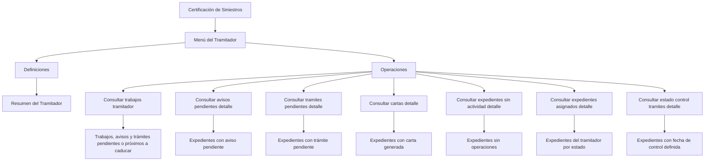

# Certificación de Siniestros — Menú del Tramitador: Definiciones y Operaciones

## 1. Metadados do Documento
- **Arquivo de Origem:** `Não informado`
- **Tipo de Documento:** `Manual Operacional`
- **Domínio / Sistema:** `Certificación de Siniestros / Menú del Tramitador`
- **Público-Alvo:** `Tramitadores, operação e analistas funcionais`
- **Data/Versão Identificada:** `Não identificada`

---

## 2. Resumo Executivo & Contexto de Negócio

O documento descreve o **Menú del Tramitador** no contexto de **Certificación de Siniestros**. O menu é apresentado como a ferramenta básica e fundamental pela qual um tramitador realiza o seu trabalho operacional.

O conteúdo organiza o menu em definições e operações. A área de definições contém elementos que afetarão o **Resumen del Tramitador**, sem detalhar quais definições, campos ou regras são aplicados nesse resumo.

As operações descritas são predominantemente consultas sobre trabalhos, avisos, trâmites, cartas, expedientes sem atividade, expedientes atribuídos e estados de controle de trâmites. Em diversas consultas, os resultados dependem das condições filtradas pelo tramitador.

O documento evidencia que o Menú del Tramitador permite acompanhar pendências, identificar itens próximos da caducidade, consultar expedientes por estado e verificar prazos máximos associados a datas de controle. Não são detalhados métodos técnicos, telas, contratos de integração, permissões ou regras de cálculo.

---

## 3. Arquitetura, Componentes & Tecnologias Envolvidas

Os componentes funcionais explicitamente citados são:

- **Certificación de Siniestros:** domínio indicado no título do material.
- **Menú del Tramitador:** ferramenta operacional principal usada pelo tramitador.
- **Resumen del Tramitador:** resumo afetado por definições existentes neste nível.
- **Operaciones:** conjunto de consultas disponíveis no menu.
- **Expedientes:** registros consultados pelas operações.
- **Avisos, trâmites, cartas, trabalhos pendentes e datas de controle:** critérios ou entidades de consulta.
- **RS / Inicio Soluciones APIs Documentación Zeus:** elementos de navegação ou referência visíveis no conteúdo bruto; o documento não explica suas funções.



**Nota de Análise:** o documento não descreve arquitetura técnica, microsserviços, bancos de dados, APIs, protocolos, tecnologias de implementação, URLs de ambiente ou contratos de dados.

---

## 4. Regras de Negócio, Especificações Funcionais & Processos

### 4.1 Papel operacional do Menú del Tramitador

O Menú del Tramitador é definido como a ferramenta básica e fundamental na qual um tramitador realiza todo o seu trabalho. O documento também indica que o menu permite catalogar os motivos pelos quais se deseja realizar uma operação de liquidaciones.

### 4.2 Definições relacionadas ao Resumen del Tramitador

No nível apresentado pelo documento existem definições que afetarão o Resumen del Tramitador.

**Nota de Análise:** o material não especifica os nomes dessas definições, os critérios de impacto no Resumen del Tramitador, nem o comportamento funcional resultante.

### 4.3 Operações de consulta

1. **Consultar trabajos tramitador**
   - Exibe todos os trabalhos pendentes.
   - Exibe avisos pendentes.
   - Exibe trâmites próximos de caducar.

2. **Consultar avisos pendientes detalle**
   - Exibe todos os expedientes que possuem o aviso indicado pendente.
   - A consulta considera as condições filtradas pelo tramitador.

3. **Consultar tramites pendientes detalle**
   - Exibe todos os expedientes que possuem o trâmite indicado pendente.
   - A consulta considera as condições filtradas pelo tramitador.

4. **Consultar cartas detalle**
   - Exibe todos os expedientes para os quais a carta indicada tenha sido gerada.
   - A consulta considera as condições filtradas pelo tramitador.

5. **Consultar expedientes sin actividad detalle**
   - Exibe todos os expedientes nos quais não tenha sido realizada nenhuma operação.
   - A consulta considera as condições filtradas pelo tramitador.

6. **Consultar expedientes asignados detalle**
   - Exibe todos os expedientes atribuídos ao tramitador.
   - A consulta admite estado como `pendiente`, `en juicio` e `retenido por c.t.`.
   - A consulta considera as condições filtradas pelo tramitador.

7. **Consultar estado control tramites detalle**
   - Exibe todos os expedientes que possuam uma data de controle definida.
   - A data de controle representa o tempo máximo para realização.
   - A consulta é aplicada ao estado indicado pelo tramitador.
   - A consulta considera as condições filtradas pelo tramitador.

---

## 5. Tabelas de Parâmetros, Ambientes e Estruturas de Dados

| Item / Parâmetro | Descrição / Função | Tipo / Valores / Formato | Ambiente / Observações |
| :--- | :--- | :--- | :--- |
| Menú del Tramitador | Ferramenta básica e fundamental para execução do trabalho do tramitador. | Menu funcional. | Associado a Certificación de Siniestros. |
| Definiciones | Definições existentes no nível apresentado que afetam o Resumen del Tramitador. | Não detalhado. | Não há campos ou regras descritos. |
| Resumen del Tramitador | Resumo impactado pelas definições mencionadas. | Não detalhado. | O comportamento do resumo não é especificado. |
| Operaciones | Conjunto de consultas que podem ser realizadas no Menú del Tramitador. | Consultas funcionais. | Inclui sete operações descritas. |
| Condiciones filtradas | Critérios de filtro definidos pelo tramitador para restringir resultados. | Não detalhado. | Citados em consultas de avisos, trâmites, cartas, expedientes sem atividade, expedientes atribuídos e controle de trâmites. |
| Aviso indicado | Aviso que deve estar pendente para seleção de expedientes. | Não detalhado. | Usado em `CONSULTAR avisos pendientes detalle`. |
| Trámite indicado | Trâmite que deve estar pendente para seleção de expedientes. | Não detalhado. | Usado em `CONSULTAR tramites pendientes detalle`. |
| Carta indicada | Carta cuja geração é usada como critério de consulta. | Não detalhado. | Usado em `CONSULTAR cartas detalle`. |
| Estado do expediente | Estado usado para consulta de expedientes atribuídos ao tramitador. | `pendiente`; `en juicio`; `retenido por c.t.` | A lista pode não ser exaustiva; o documento usa reticências. |
| Fecha de control | Data de controle associada ao tempo máximo para realização de um trâmite. | Data; formato não informado. | Usada em `CONSULTAR estado control tramites detalle`. |
| Trabajos pendientes | Trabalhos pendentes apresentados ao tramitador. | Não detalhado. | Usado em `CONSULTAR trabajos tramitador`. |
| Avisos pendientes | Avisos pendentes apresentados ao tramitador. | Não detalhado. | Usado em `CONSULTAR trabajos tramitador`. |
| Trámites a punto de caducar | Trâmites próximos de caducar apresentados ao tramitador. | Não detalhado. | Usado em `CONSULTAR trabajos tramitador`. |
| RS | Elemento apresentado na navegação do conteúdo bruto. | Sigla não expandida. | Sem função documentada. |
| Zeus | Elemento apresentado na navegação do conteúdo bruto. | Nome não detalhado. | Sem função documentada. |

---

## 6. Bateria de Perguntas & Respostas para RAG (FAQ Sintético)

### P1: Qual é a finalidade do Menú del Tramitador em Certificación de Siniestros?
**R:** O Menú del Tramitador é a ferramenta básica e fundamental usada pelo tramitador para realizar o seu trabalho. O documento apresenta o menu como o ponto de acesso às operações de consulta de trabalhos, avisos, trâmites, cartas e expedientes.

### P2: O que a operação CONSULTAR trabajos tramitador apresenta?
**R:** A operação `CONSULTAR trabajos tramitador` mostra todos os trabalhos pendentes, os avisos pendentes e os trâmites que estão próximos de caducar.

### P3: Como consultar expedientes que possuem um aviso pendente?
**R:** A operação `CONSULTAR avisos pendientes detalle` mostra todos os expedientes que tenham o aviso indicado pendente. Os resultados são condicionados aos filtros definidos pelo tramitador.

### P4: Qual operação permite consultar expedientes com um trâmite pendente?
**R:** A operação `CONSULTAR tramites pendientes detalle` mostra os expedientes que possuem o trâmite indicado pendente, considerando as condições filtradas pelo tramitador.

### P5: Como localizar expedientes para os quais uma carta foi gerada?
**R:** A operação `CONSULTAR cartas detalle` mostra os expedientes aos quais a carta indicada tenha sido gerada. A consulta também respeita as condições aplicadas pelo tramitador.

### P6: Como identificar expedientes sem atividade?
**R:** A operação `CONSULTAR expedientes sin actividad detalle` mostra os expedientes nos quais não foi realizada nenhuma operação. Os resultados dependem das condições filtradas pelo tramitador.

### P7: Quais estados são mencionados para a consulta de expedientes atribuídos ao tramitador?
**R:** A operação `CONSULTAR expedientes asignados detalle` menciona os estados `pendiente`, `en juicio` e `retenido por c.t.`. O documento inclui reticências após esses exemplos, portanto não confirma que a lista seja completa.

### P8: O que representa a fecha de control na consulta de controle de trâmites?
**R:** A `fecha de control` é definida como o tempo máximo para realização. A operação `CONSULTAR estado control tramites detalle` mostra expedientes que tenham essa data de controle definida, no estado indicado pelo tramitador e conforme os filtros aplicados.

### P9: As operações do Menú del Tramitador usam filtros?
**R:** Sim. O documento afirma explicitamente que as consultas detalhadas de avisos pendentes, trâmites pendentes, cartas, expedientes sem atividade, expedientes atribuídos e estado de controle de trâmites consideram as condições filtradas pelo tramitador.

### P10: O que o documento informa sobre as definições do Resumen del Tramitador?
**R:** O documento informa apenas que, nesse nível, existem definições que afetarão o Resumen del Tramitador. Não são fornecidos detalhes sobre quais definições existem, como são configuradas ou quais efeitos produzem.

---

## 7. Glossário de Termos, Siglas & Conceitos-Chave

- **Certificación de Siniestros:** domínio mencionado no título do documento; o material não fornece uma definição adicional.
- **Menú del Tramitador:** ferramenta básica e fundamental na qual o tramitador realiza o seu trabalho.
- **Tramitador:** papel operacional que utiliza o Menú del Tramitador e aplica condições de filtro às consultas.
- **Resumen del Tramitador:** resumo afetado por definições existentes no nível apresentado.
- **Operaciones:** consultas que podem ser executadas a partir do Menú del Tramitador.
- **Expediente:** registro retornado pelas consultas de avisos, trâmites, cartas, atividade, atribuição e controle.
- **Aviso pendiente:** aviso pendente associado a um expediente ou apresentado entre os trabalhos do tramitador.
- **Trámite pendiente:** trâmite pendente associado a um expediente.
- **Fecha de control:** data de controle que representa o tempo máximo para realização.
- **En juicio:** estado de expediente mencionado na consulta de expedientes atribuídos.
- **Retenido por c.t.:** estado de expediente mencionado no documento; a sigla `c.t.` não é expandida.
- **RS:** sigla apresentada na navegação do conteúdo bruto; sem significado definido.
- **Zeus:** termo apresentado na navegação do conteúdo bruto; sem função definida.

---

## 8. Notas Críticas, Riscos & Limitações

- O documento possui escopo funcional resumido e não descreve arquitetura técnica, APIs, bancos de dados, integrações, autenticação, autorização ou observabilidade.
- As condições de filtro usadas pelo tramitador são mencionadas, mas seus campos, operadores, valores permitidos e comportamento não são detalhados.
- A data de controle é definida como tempo máximo para realização, porém não há regra para cálculo, alerta, caducidade ou tratamento de vencimento.
- Os estados `pendiente`, `en juicio` e `retenido por c.t.` são citados como exemplos; o documento não fornece uma lista completa de estados.
- A sigla `c.t.` não é expandida.
- As definições que afetam o Resumen del Tramitador não são especificadas.
- **Nota de Análise:** o documento lista operações do Menú del Tramitador, porém não detalha telas, métodos HTTP, contratos JSON, regras de permissão ou fluxos de exceção.

---

## 9. Conteúdo Bruto Estruturado (Referência Fiel)

```text
--- [PÁGINA 1 DE 2] ---

CERTIFICACIÓN
de
SINIESTROS
-
MENÚ
DEL
TRAMITADOR
Definicione
s Menú del
Tramitador
Operacion
es Menú
del
Tramitador
DEFINICIONES
div class="grid
cards"
markdown>
GENERAL
DESGLOSE
RESUMEN
TRAMITADOR
Permite
catalogar los
motivos por
los que se
quiere realizar
una operación
de
liquidaciones
OPERACIONES¶
MENÚ DEL
TRAMITADOR
Operaciones que se
pueden realizar desde el
menú del tamitador. Esta
es la herramienta básica y
fundamental en la que un
tramitador va a realizar
todo su trabajo
CONSULTAR trabajos
tramitador
Muestra todos los
trabajos pendientes,
avisos pendientes,
trámites a punto de
caducar...
CONSULTAR avisos
pendientes detalle
Muestra todos los
expedientes que tengan
el aviso indicado
pendiente, con las
condiciones que haya
filtrado el tramitador
CONSULTAR tramites
pendientes detalle
Muestra todos los
expedientes que tengan
el trámite indicado
pendiente con las
condiciones que haya
filtrado el tramitador
CONSULTAR cartas
detalle
Muestra todos los
expedientes a los que se
les haya generado la
carta indicada, con las
condiciones que haya
filtrado el tramitador
CONSULTAR
expedientes sin
actividad detalle
Muestra todos los
expedientes que no se
haya realizado ninguna
operación con ellos, con
las condiciones que
haya filtrado el
tramitador
CONSULTAR
expedientes asignados
detalle
Muestra todos los
expedientes que tenga el
tramitador con el estado
(pendiente, en juicio,
retenido por c.t...) y las
condiciones que haya
filtrado el tramitador
CONSULTAR estado
control tramites detalle
Muestra todos los
expedientes que tengan
definido fecha de control
(tiempo máximo para
realizarse) en el estado
que indique el tramitador
y las condiciones que
haya filtrado el
tramitador
 / 
 RS
Inicio Soluciones APIs Documentación Zeus
ES


--- [PÁGINA 2 DE 2] ---

En este
nivel se
encuentran
definiciones
que
afectarán
al
Resumen
del
Tramitador
```
