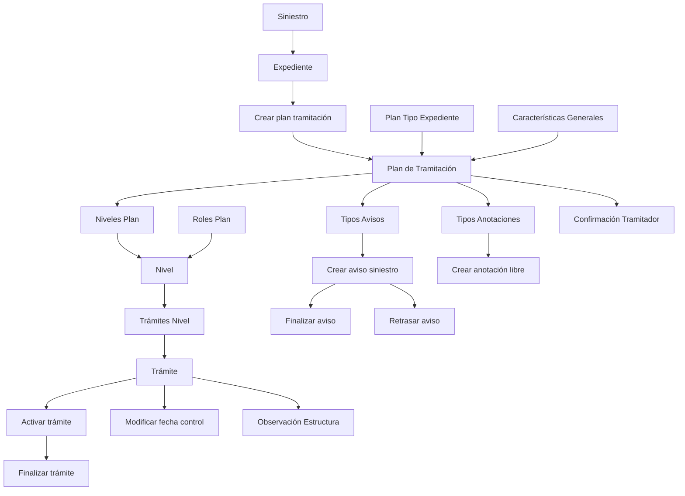

# Certificación de Siniestros — Plan de Tramitación: Definiciones y Operaciones

## 1. Metadados do Documento
- **Arquivo de Origem:** Não informado
- **Tipo de Documento:** Apresentação Executiva
- **Domínio / Sistema:** Certificação de Siniestros — Plan de Tramitación
- **Público-Alvo:** Desenvolvedores, Arquitetos, Operação e Negócio
- **Data/Versão Identificada:** Não identificada

---

## 2. Resumo Executivo & Contexto de Negócio

O documento descreve as definições e operações do **Plan de Tramitación** no contexto de **siniestros**. O Plan de Tramitación estrutura os passos necessários para tramitar um expediente, organizando atividades em níveis e associando planos aos tipos de expediente e tipos de danos.

A modelagem é dividida em definições comuns, definições gerais do plano e definições por ramo. As definições comuns abrangem estruturas, agrupações e notas; as definições gerais determinam características do módulo, planos, níveis, trâmites, avisos, anotações, observações e papéis; as definições por ramo associam planos a tipos de expediente.

O módulo permite controlar a execução de trâmites de um expediente por meio de operações como criar plano, incluir nível ou trâmite, ativar e finalizar trâmites, gerar avisos, registrar anotações livres, modificar datas de controle e consultar o plano.

O documento indica que as características gerais do módulo podem determinar comportamentos como uso de roles, datas de controle e calendário laboral para cálculo de datas. Entretanto, não apresenta detalhes de implementação, contratos de integração, métodos HTTP, URLs, bancos de dados ou tecnologias utilizadas.

---

## 3. Arquitetura, Componentes & Tecnologias Envolvidas

O documento apresenta uma estrutura funcional do Plan de Tramitación, sem detalhar arquitetura técnica de software, servidores, APIs, integrações, tecnologias, protocolos ou ambientes.

### Componentes funcionais identificados

| Componente | Descrição fundamentada no documento |
| :--- | :--- |
| Plan de Tramitación | Plano que reúne os diferentes passos para tramitar um expediente, agrupados em níveis. |
| Expediente | Entidade para a qual um plano de tramitação pode ser atribuído e executado. |
| Siniestro | Contexto no qual podem ser criados avisos e anotações visíveis em seus expedientes. |
| Plan | Definição de códigos de planos associados a tipos de expediente. |
| Nivel | Agrupação de trâmites. |
| Trámite | Cada passo que deve ser realizado para completar um processo. |
| Trámites Nivel | Associação de trâmites da mesma natureza sob um nível. |
| Niveles Plan | Definição dos níveis que um plano conterá. |
| Plan Nivel Trámite | Definição completa de um plano de tramitação e dos passos agrupados em níveis. |
| Roles Plan | Papéis que podem trabalhar com planos de tramitação, potencialmente restritos a determinados níveis. |
| Tipos Avisos | Tipificação dos avisos que podem ser gerados. |
| Tipos Anotaciones | Definição de anotações livres que podem ser realizadas. |
| Observación Estructura | Observação gravada no plano cada vez que uma operação é executada. |
| Confirmación Tramitador | Perguntas para confirmação de trâmites. |
| Plan Tipo Expediente | Regra que define qual plano tramitará determinado tipo de expediente ou dano. |



> **Nota de Análise:** O documento contém a expressão de navegação “Inicio Soluciones APIs Documentación Zeus ES”, mas não explica o significado de “Zeus”, “RS”, “APIs” ou qualquer relação técnica desses termos com o Plan de Tramitación.

---

## 4. Regras de Negócio, Especificações Funcionais & Processos

### 4.1 Definições comuns

As definições comuns são prévias ao Plan de Tramitación. Nesse nível existem definições que não são exclusivas de siniestros, mas são necessárias para construir a definição do plano.

- **Estructura:** definição de um conjunto de atributos que forma uma estrutura de informação.
- **Agrupación / RS:** associação de estruturas de informação à agrupação do plano de tramitação.
- **Notas:** definição de informação de notas para obter comunicados.

### 4.2 Definições gerais do Plan de Tramitación

- **Características Generales:** determinam comportamentos do módulo de siniestros e do módulo de Plan de Tramitación.
- As características gerais podem estabelecer se o módulo trabalhará com:
  - roles;
  - datas de controle;
  - calendário laboral para cálculo de datas.
- **Plan:** define códigos de planos que serão associados aos tipos de expediente.
- **Nivel:** representa uma agrupação de trâmites.
- **Trámite:** representa cada passo que deve ser realizado para completar um processo.
- **Trámites Nivel:** associa trâmites de mesma natureza sob um nível. O exemplo fornecido é o nível de peritación, que agrupa os trâmites de peritações.
- **Niveles Plan:** define os diversos níveis que um plano conterá.
- **Plan Nivel Trámite:** representa a definição completa de um plano, incluindo os passos para tramitar o expediente agrupados em níveis.
- **Tipos Avisos:** tipificam os diferentes avisos que podem ser gerados.
- **Tipos Anotaciones:** definem as diferentes anotações livres que podem ser realizadas.
- **Observación Estructura:** define a observação gravada no plano a cada execução de operação. O documento exemplifica a execução de uma liquidação, registrando a quem se paga e o valor.
- **Roles Plan:** definem papéis que podem trabalhar com os planos. Um papel pode estar autorizado somente a executar o nível de peritações ou somente o nível de juicios.
- **Confirmación Tramitador:** define perguntas de confirmação de trâmites, como confirmação de perda total, coberturas ou situação de apólice.

### 4.3 Definições por ramo

A definição **Plan Tipo Expediente** determina, para cada tipo de expediente e tipo de danos, qual plano será responsável pela tramitação do dano.

O plano associado pode ser:

1. Um plano fixo; ou
2. Um plano determinado por lógica de negócio que avalia condições especiais.

> **Nota de Análise:** O documento não detalha quais são as condições especiais, quais regras compõem a lógica de negócio, nem como ocorre sua configuração ou execução.

### 4.4 Operações do Plan de Tramitación

| Operação | Regra funcional |
| :--- | :--- |
| Crear plan tramitación | Permite atribuir um plano de tramitação a um expediente quando o expediente não possuir um plano atribuído. |
| Incluir trámite | Permite adicionar ao plano um trâmite previamente definido no plano. |
| Incluir nivel | Permite adicionar ao plano um nível previamente definido no plano. |
| Activar trámite | Executa o trâmite. |
| Finalizar trámite | Encerra o trâmite. |
| Crear aviso siniestro | Registra um lembrete no nível de siniestro, visível nos planos de tramitação de todos os expedientes; também pode existir no nível de expediente e no nível de trâmite. |
| Crear anotación libre | Permite registrar uma anotação no nível de siniestro, visível em todos os expedientes do siniestro; também pode existir no nível de expediente e no nível de trâmite. |
| Finalizar aviso | Permite encerrar o lembrete para que ele não volte a avisar, nos níveis de siniestro, expediente e trâmite. |
| Retrasar aviso | Permite postergar a data de aviso do siniestro. |
| Crear carta, email | Gera a carta ou o texto. |
| Modificar fecha control | Permite alterar a data de controle do trâmite. |
| Consultar plan tramitación | Exibe todas as informações do Plan de Tramitación. |

---

## 5. Tabelas de Parâmetros, Ambientes e Estruturas de Dados

### 5.1 Parâmetros e definições funcionais

| Item / Parâmetro | Descrição / Função | Tipo / Valores / Formato | Ambiente / Observações |
| :--- | :--- | :--- | :--- |
| Estructura | Conjunto de atributos que forma uma estrutura de informação. | Não detalhado | Definição comum, prévia ao plano. |
| Agrupación / RS | Associação de estruturas de informação à agrupação do plano. | Não detalhado | O significado de RS não é definido. |
| Notas | Informação de notas para obter comunicados. | Não detalhado | Definição comum. |
| Características Generales | Define comportamentos do módulo de siniestros e do Plan de Tramitación. | Uso de roles, datas de controle e calendário laboral são exemplos citados. | Não detalha valores configuráveis. |
| Plan | Código de plano associado a tipos de expediente. | Código não especificado | Associado a tipos de expediente. |
| Nivel | Agrupação de trâmites. | Não detalhado | Pode representar uma natureza de atividades, como peritación. |
| Trámite | Passo necessário para completar um processo. | Não detalhado | Pode ser incluído, ativado e finalizado. |
| Trámites Nivel | Associação de trâmites de mesma natureza em um nível. | Não detalhado | Exemplo: nível de peritación. |
| Niveles Plan | Níveis contidos em um plano. | Não detalhado | Componente da definição do plano. |
| Plan Nivel Trámite | Definição completa dos passos de tramitação agrupados em níveis. | Não detalhado | Estrutura central do plano. |
| Tipos Avisos | Tipos de avisos que podem ser gerados. | Não detalhado | Relacionado à criação e gestão de avisos. |
| Tipos Anotaciones | Tipos de anotações livres. | Não detalhado | Relacionado à criação de anotação livre. |
| Observación Estructura | Informação gravada ao executar uma operação. | Pode incluir beneficiário e importe em liquidação. | Não detalha a estrutura dos campos. |
| Roles Plan | Papéis aptos a trabalhar com planos. | Restrições por nível são possíveis. | Exemplos: peritaciones e juicios. |
| Plan Tipo Expediente | Determina plano para tipo de expediente e tipo de danos. | Plano fixo ou lógica de negócio com condições especiais. | Definição por ramo. |
| Confirmación Tramitador | Perguntas de confirmação de trâmites. | Exemplos: perda total, coberturas, situação de apólice. | Não detalha perguntas, respostas ou critérios. |

### 5.2 Alcance operacional por entidade

| Operação / Informação | Siniestro | Expediente | Trámite | Observações |
| :--- | :---: | :---: | :---: | :--- |
| Crear aviso siniestro | Sim | Sim | Sim | No nível de siniestro, o aviso é visível nos planos de tramitação de todos os expedientes. |
| Crear anotación libre | Sim | Sim | Sim | No nível de siniestro, a anotação é visível em todos os expedientes do siniestro. |
| Finalizar aviso | Sim | Sim | Sim | Evita que o lembrete volte a avisar. |
| Retrasar aviso | Sim | Não detalhado | Não detalhado | O texto menciona postergar a data de aviso do siniestro. |
| Modificar fecha control | Não detalhado | Não detalhado | Sim | Altera a data de controle do trâmite. |
| Crear plan tramitación | Não detalhado | Sim | Não detalhado | Aplicável quando o expediente não possui plano atribuído. |

### 5.3 Ambientes, URLs, logs e infraestrutura

| Item / Parâmetro | Descrição / Função | Tipo / Valores / Formato | Ambiente / Observações |
| :--- | :--- | :--- | :--- |
| Ambientes | Não identificados no documento. | Não aplicável | Nenhuma URL, servidor ou ambiente foi informado. |
| Logs | Não identificados no documento. | Não aplicável | O documento não fornece rotas, níveis ou formatos de log. |
| APIs | Mencionadas apenas na expressão de navegação “Inicio Soluciones APIs Documentación Zeus ES”. | Não detalhado | Não há contratos, endpoints ou métodos descritos. |

---

## 6. Bateria de Perguntas & Respostas para RAG (FAQ Sintético)

### P1: O que é o Plan de Tramitación no contexto de siniestros?
**R:** O Plan de Tramitación é a definição dos diferentes passos que podem ser realizados para tramitar um expediente. Esses passos são organizados e agrupados em níveis, compondo a definição completa do plano de tramitação.

### P2: Quando um plano de tramitação pode ser criado para um expediente?
**R:** A operação **Crear plan tramitación** permite atribuir um plano de tramitação a um expediente quando esse expediente ainda não possui um plano atribuído.

### P3: Como o sistema determina qual plano deve tramitar um tipo de expediente?
**R:** A definição **Plan Tipo Expediente**, localizada nas definições por ramo, indica qual plano será responsável pela tramitação de cada tipo de expediente e tipo de danos. O plano pode ser fixo ou determinado por lógica de negócio que avalia condições especiais.

### P4: Qual é a diferença entre Nivel e Trámite?
**R:** **Nivel** é uma agrupação de trâmites. **Trámite** é cada passo que deve ser executado para completar um processo. Os trâmites de mesma natureza podem ser associados sob um mesmo nível por meio de **Trámites Nivel**.

### P5: O que são Roles Plan e como podem restringir atividades?
**R:** **Roles Plan** definem os papéis que podem trabalhar com planos de tramitação. O documento informa que pode haver papéis autorizados somente a executar o nível de peritações ou somente o nível de juicios.

### P6: Para que servem as Características Generales do Plan de Tramitación?
**R:** As Características Generales determinam comportamentos do módulo de siniestros e do módulo de Plan de Tramitación. Entre os comportamentos exemplificados estão trabalhar com roles, trabalhar com datas de controle e utilizar o calendário laboral para cálculo de datas.

### P7: Em quais níveis um aviso de siniestro pode ser criado e visualizado?
**R:** Um aviso pode ser registrado no nível de siniestro, de expediente e de trâmite. Quando criado no nível de siniestro, o lembrete é visível nos planos de tramitação de todos os expedientes relacionados ao siniestro.

### P8: Como um aviso deixa de gerar notificações?
**R:** A operação **Finalizar aviso** encerra o lembrete para que ele não volte a avisar. Essa operação pode ocorrer nos níveis de siniestro, expediente e trâmite.

### P9: O que ocorre ao executar a operação Modificar fecha control?
**R:** A operação **Modificar fecha control** permite alterar a data de controle de um trâmite.

### P10: Para que serve a Observación Estructura?
**R:** A Observación Estructura define a observação registrada no plano cada vez que uma operação é executada. Como exemplo, em uma liquidação, a observação pode registrar a quem se paga e o importe.

### P11: Quais confirmações podem ser definidas em Confirmación Tramitador?
**R:** Confirmación Tramitador permite definir perguntas para confirmação de trâmites. O documento fornece como exemplos a confirmação de uma perda total, de coberturas e da situação de uma apólice.

### P12: Quais informações são exibidas ao consultar um plano de tramitação?
**R:** A operação **Consultar plan tramitación** mostra todas as informações do Plan de Tramitación. O documento não detalha quais campos, telas, formatos ou filtros compõem essa consulta.

---

## 7. Glossário de Termos, Siglas & Conceitos-Chave

- **Agrupación:** Associação de estruturas de informação à agrupação do plano de tramitação.
- **Aviso:** Lembrete que pode existir nos níveis de siniestro, expediente e trâmite.
- **Calendario laboral:** Calendário que pode ser utilizado para o cálculo de datas, conforme características gerais.
- **Confirmación Tramitador:** Definição de perguntas para confirmar trâmites.
- **Estructura:** Conjunto de atributos que forma uma estrutura de informação.
- **Expediente:** Entidade que pode receber e executar um Plan de Tramitación.
- **Fecha control:** Data de controle de um trâmite, passível de modificação.
- **Nivel:** Agrupação de trâmites.
- **Observación Estructura:** Informação registrada no plano quando uma operação é executada.
- **Plan:** Código de plano associado a tipos de expediente.
- **Plan de Tramitación:** Estrutura de passos necessários para tramitar um expediente, agrupados em níveis.
- **Plan Nivel Trámite:** Definição completa de um plano, com passos agrupados em níveis.
- **Plan Tipo Expediente:** Regra que associa um plano a um tipo de expediente e tipo de danos.
- **RAMO:** Nível de definições do Plan de Tramitación que contém Plan Tipo Expediente; o documento não fornece definição adicional.
- **Roles Plan:** Papéis que podem trabalhar com planos e potencialmente executar apenas determinados níveis.
- **RS:** Termo associado à Agrupación; seu significado não é definido no documento.
- **Siniestro:** Contexto no qual avisos e anotações podem ser registrados e compartilhados entre expedientes.
- **Trámite:** Passo a realizar para completar um processo.
- **Trámites Nivel:** Associação de trâmites de mesma natureza sob um nível.

---

## 8. Notas Críticas, Riscos & Limitações

- O documento não identifica arquivo de origem, data, versão, autor, proprietário funcional ou responsável técnico.
- Não há descrição de arquitetura técnica, serviços, APIs, contratos, métodos HTTP, autenticação, persistência de dados, infraestrutura, ambientes, URLs, servidores ou portas.
- O significado de **RS** não é informado.
- O significado e a relevância de **Zeus**, mencionado apenas em uma expressão de navegação, não são detalhados.
- A lógica de negócio para escolher um plano mediante “condiciones especiales” não é especificada.
- O documento não detalha os campos que compõem Estructura, Observación Estructura, avisos, anotações, planos, níveis ou trâmites.
- Não há critérios de autorização, exceções, transições de estado, pré-condições ou pós-condições detalhadas para ativar e finalizar trâmites.
- Não são descritas regras para cálculo de datas com calendário laboral, apesar de esse uso ser citado como possível.
- Não são definidos os modelos de carta, email, destinatários, canais de envio ou comportamento da operação **Crear carta, email**.

---

## 9. Conteúdo Bruto Estruturado (Referência Fiel)

```text
--- [PÁGINA 1 DE 4] ---

CERTIFICACIÓN de SINIESTROS - PLAN
TRAMITACIÓN
Definiciones Plan de Tramitación
Operaciones Plan de Tramitación
DEFINICIONES
COMÚN
Son definiciones Previas al Plan de tramitación. En este nivel se
encuentran definiciones que NO son exclusivas de siniestros, pero son
necesarias para poder realizar la definición. Entre otras definiciones se
encuentra:
ESTRUCTURA
 AGRUPACIÓN
 / 
 RS
Inicio Soluciones APIs Documentación Zeus
ES


--- [PÁGINA 2 DE 4] ---

Definición de un conjunto de atributos que
forman una estructura de información.
Asociación de Estructuras de información a la
agrupación del plan de tramitación
NOTAS
Definición de información de notas para
obtener comunicados
GENERAL
Definiciones Generales del Plan de Tramitación
CARACTERÍSTICAS GENERALES 
Características Generales del módulo de
siniestros, determina comportamientos del
módulo de plan de tramitación por ejemplo si
se va a trabajar con roles, si se va a trabajar
con fechas de control, si se va a utilizar el
calendario laboral para el cálculo de fechas...
PLAN 
Definición de códigos que planes que serán
asociados a los tipos de expedientes
NIVEL 
Agrupación de Trámites
TRÁMITE 
Definición de cada paso que hay que realizar
para completar un proceso
TRAMITES NIVEL 
Asociación de trámites de la misma
naturaleza bajo un nivel, por ejemplo Nivel de
peritación aglutinará todos los trámites de
peritaciones
NIVELES PLAN 
Definición de los distintos niveles que va a
contener un plan
PLAN NIVEL TRÁMITE 
Definición completa de un plan de tramitación,
todos los diferentes pasos que se pueden
TIPOS AVISOS 
Tipificar los distintos avisos que se pueden
generar


--- [PÁGINA 3 DE 4] ---

realizar para tramitar el expediente agrupados
en niveles.
TIPOS ANOTACIONES
Definir las distintas anotaciones libres que se
pueden realizar
OBSERVACIÓN ESTRUCTURA
Definición de la observación que se grabará
en el plan cada vez que se ejecute una
operación. Ejemplo si se ejecuta una
liquidación a quien se paga, el importe, etc
ROLES PLAN
Definir los distintos roles para poder trabajar
con los planes de tramitación. Puede haber
roles que sólo puedan ejecutar el nivel de
peritaciones, o roles que sólo puedan ejecutar
el nivel de juicios etc
RAMO
Definiciones por RAMO del Plan de Tramitación
PLAN TIPO EXPEDIENTE 
Definir para cada tipo de expediente, tipo de
daños qué plan se va a encargar de tramitar
ese daño. Puede ser un plan fijo o que se
determine mediante una lógica de negocio
evaluando condiciones especiales
CONFIRMACIÓN TRAMITADOR
Definición de preguntas para confirmación de
trámites. Ejemplo confirmar una pérdida total,
confirmar unas coberturas, una situación de
póliza, etc
OPERACIONES
PLAN TRAMITACIÓN


--- [PÁGINA 4 DE 4] ---

Operaciones que se pueden realizar dentro del Plan de tramitación de un
expediente
CREAR plan tramitación
Permite asignar el plan de tramitación a un
expediente, si este no tuviera uno asignado
INCLUIR trámite
Permite añadir un trámite al Plan, previamente
definido en el plan
INCLUIR nivel
Permite añadir un nivel al Plan, previamente
definido en el plan
ACTIVAR trámite
Ejecutar el trámite
FINALIZAR trámite
Terminar el trámite
CREAR aviso siniestro
Registrar un recordatorio a nivel de siniestro,
visible en los planes de tramitación de todos
los expedientes, a nivel de expediente y a
nivel de trámite.
CREAR anotación libre
Permite ingresar una anotación a nivel de
siniestro visible en todos los expedientes del
siniestro, a nivel de expediente y a nivel de
trámite.
FINALIZAR aviso
Permite terminar el recordatorio para que no
avise más, a nivel de siniestro, expediente y
trámite.
RETRASAR aviso
Permite post-poner la fecha de aviso del
siniestro
CREAR carta, email
Genera la carta o texto
MODIFICAR fecha control
Permite cambiar la fecha de control del
trámite
CONSULTAR plan tramitación
Muestra toda la información del Plan de
tramitación
```
