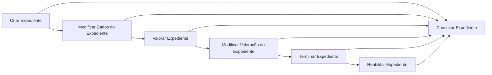

# Certificação de Sinistros — Tramitação de Expedientes: Definições e Operações

## 1. Metadados do Documento
- **Arquivo de Origem:** `Não informado no conteúdo fornecido`
- **Tipo de Documento:** `Especificação Técnica`
- **Domínio / Sistema:** `Certificação de Sinistros — Tramitação de Expedientes`
- **Público-Alvo:** `Negócio, analistas funcionais, operação e equipes de desenvolvimento`
- **Data/Versão Identificada:** `Não identificada`

---

## 2. Resumo Executivo & Contexto de Negócio

O documento descreve definições e operações do domínio de **tramitação de expedientes** no contexto de certificação de sinistros. A tramitação organiza os elementos necessários para registrar, consultar, valorar, alterar, terminar e reabilitar expedientes associados a danos ocasionados por um sinistro.

A estrutura funcional apresentada é segmentada em níveis de definição: **Comum**, **Geral**, **Ramo** e **Expediente**. O nível Comum concentra definições não exclusivas do módulo de sinistros, porém necessárias para a configuração do processo. Os níveis subsequentes especializam regras aplicáveis a todos os expedientes, a cada ramo e a cada expediente individual.

O modelo permite configurar estruturas de tramitação, coberturas, franquias, controles técnicos, causas de processo, tipos de expediente, sub-limites, atributos, validações de informações e regras econômicas de reserva. Dessa forma, as operações podem respeitar as características do produto, ramo, dano, cobertura e conceito de reserva envolvidos.

As operações de tramitação podem ser realizadas **em linha** ou **de forma diferida**. O ciclo operacional cobre a criação do expediente, a alteração de dados, a valoração e alteração de reservas, o encerramento com reajuste de reserva, a reabilitação de expedientes terminados e a consulta integral das informações registradas.

---

## 3. Arquitetura, Componentes & Tecnologias Envolvidas

O conteúdo não apresenta tecnologias, linguagens de programação, APIs, servidores, URLs, ambientes ou contratos de integração. O documento apresenta uma arquitetura funcional e hierárquica de definições para a tramitação de expedientes de sinistros.

### Componentes funcionais identificados

- **Estrutura de Tramitação:** definição das oficinas que tramitam expedientes, com associação de supervisores e tramitadores.
- **Cobertura:** obrigação principal em um contrato de seguro; os tipos de cobertura determinam comportamentos nos processos de emissão e prestações.
- **Franquia:** valor pelo qual o segurado responde em caso de sinistro.
- **Controle Técnico:** definição de erros, tipos de erros e condições para paralisar a tramitação ou exigir autorização.
- **Características Gerais:** configuração do comportamento de operações de expediente, incluindo solicitação de causas na abertura ou na alteração de valoração.
- **Causas de Processo:** catalogação dos motivos para realização de uma operação de expediente.
- **Tipo de Expediente:** definição de tipos de dano.
- **Sub-limites:** definição, por ramo, dos tipos de expediente e coberturas que utilizam sub-limites.
- **Atributos e Estruturas:** configuração das informações adicionais do expediente, da obrigatoriedade e da ordem de solicitação.
- **Validações de Informação:** regras e validações aplicadas às informações de core solicitadas nas operações.
- **Conceito de Reserva:** detalhamento econômico do expediente, incluindo Indenização, Honorários ou Gastos.
- **Valor Inicial:** custo médio utilizado para valorar um expediente quando não houver valoração clara.
- **Valor Máximo:** importe máximo para valorar uma cobertura e conceito de reserva de um expediente.

```mermaid
graph TD
    A[Tramitação de Expedientes] --> B[Definições]
    A --> C[Operações]

    B --> B1[Comum]
    B --> B2[Geral]
    B --> B3[Ramo]
    B --> B4[Expediente]

    B1 --> B11[Estrutura de Tramitação]
    B1 --> B12[Cobertura]
    B1 --> B13[Franquia]
    B1 --> B14[Controle Técnico]

    B2 --> B21[Características Gerais]
    B2 --> B22[Causas de Processos]
    B2 --> B23[Tipo de Expediente]

    B3 --> B31[Tipo de Expediente por Produto]
    B3 --> B32[Causa de Processo por Ramo]
    B3 --> B33[Sub-limites]

    B4 --> B41[Atributo]
    B4 --> B42[Estrutura]
    B4 --> B43[Validações de Informação]
    B4 --> B44[Conceito de Reserva]
    B4 --> B45[Cobertura por Tipo de Expediente]
    B4 --> B46[Causa-Consequência]
    B4 --> B47[Valor Inicial]
    B4 --> B48[Valor Máximo]
    B4 --> B49[Controle Técnico]

    C --> C1[Criar Expediente]
    C --> C2[Modificar Dados]
    C --> C3[Valorar Expediente]
    C --> C4[Modificar Valoração]
    C --> C5[Terminar Expediente]
    C --> C6[Reabilitar Expediente]
    C --> C7[Consultar Expediente]
```





> **Nota de Análise:** o documento não especifica critérios de transição, permissões, métodos de execução, contratos de dados, APIs ou regras que determinem em quais circunstâncias cada operação deve ser executada.

---

## 4. Regras de Negócio, Especificações Funcionais & Processos

### 4.1. Nível Comum

O nível **Comum** contém definições que não são exclusivas do módulo de sinistros, mas são necessárias para definir a tramitação de expedientes.

- A **Estrutura de Tramitação** define as oficinas nas quais os expedientes são tramitados.
- A Estrutura de Tramitação associa supervisores e tramitadores às oficinas.
- A **Cobertura** é caracterizada como obrigação principal em um contrato de seguro.
- Existem diversos tipos de cobertura.
- Os tipos de cobertura determinam o comportamento tanto no processo de emissão como no processo de prestações.
- A **Franquia** estabelece a quantidade pela qual o segurado responde em caso de sinistro.
- O **Controle Técnico** abrange a definição de erros e de tipos de erros para a tramitação de expedientes.

### 4.2. Nível Geral

O nível **Geral** contém definições que afetam todos os possíveis expedientes de um sinistro.

- As **Características Gerais** definem características gerais do módulo de sinistros.
- As Características Gerais permitem definir o comportamento das operações de expedientes.
- Como exemplo, as Características Gerais podem determinar se serão solicitadas causas na abertura de um expediente.
- Como exemplo, as Características Gerais podem determinar se serão solicitadas causas em uma alteração de valoração.
- As **Causas de Processos** permitem catalogar os motivos pelos quais se deseja realizar uma operação de expediente.
- O **Tipo de Expediente** permite definir os tipos de dano.

### 4.3. Nível Ramo

O nível **Ramo** contém definições exclusivas do ramo que está sendo definido.

- O **Tipo de Expediente** no nível Ramo permite associar, para cada Produto:
  - Tipos de danos possíveis;
  - Coberturas;
  - Características.
- A **Causa de Processo** no nível Ramo permite catalogar os motivos para a realização de operações de expedientes para cada ramo.
- Os **Sub-limites** permitem definir, por Ramo:
  - Quais tipos de expediente utilizarão sub-limites;
  - Quais coberturas utilizarão sub-limites.

### 4.4. Nível Expediente

O nível **Expediente** contém definições que afetam cada um dos possíveis expedientes de um sinistro.

- O **Atributo** define a informação adicional do expediente.
- A **Estrutura** organiza a informação adicional do expediente composta por atributos.
- A Estrutura define se será obrigatório solicitar determinada informação.
- A Estrutura define a ordem em que a informação será solicitada.
- As **Validações de Informação** definem comportamentos e validações das informações de core solicitadas nas operações de expediente.
- Um exemplo de validação é tornar obrigatória a data de declaração de um expediente.
- O **Conceito de Reserva** determina o detalhamento econômico do expediente.
- Os tipos de conceito de reserva podem ser:
  - Indenização;
  - Honorários;
  - Gastos.
- A **Cobertura**, no nível Expediente, define qual cobertura dentre as coberturas do produto será afetada por cada tipo de expediente e qual será seu comportamento.
- A relação **Causa-Consequência** permite propor os possíveis Tipos de Expediente que poderão ser abertos por causa-consequência.
- O **Valor Inicial** define o custo médio com o qual o expediente será valorado quando não houver uma valoração clara.
- O **Valor Máximo** determina o importe máximo pelo qual uma cobertura e um conceito de reserva de um expediente podem ser valorados.
- O **Controle Técnico** define as condições nas quais a tramitação de um expediente pode ser paralisada ou submetida à obrigação de autorização.

### 4.5. Operações de Tramitação de Expedientes

As operações podem ser realizadas em linha ou de forma diferida.

1. **Criar Expediente**
   - Registra os diferentes danos ocasionados pelo sinistro.

2. **Modificar Dados do Expediente**
   - Permite alterar as informações e os dados registrados em um expediente.

3. **Valorar Expediente**
   - Permite reservar um importe para um expediente por cobertura e conceito de reserva.

4. **Modificar Valoração do Expediente**
   - Permite alterar a reserva de um expediente por cobertura e conceito de reserva.

5. **Terminar Expediente**
   - Finaliza expedientes reajustando sua reserva.

6. **Reabilitar Expediente**
   - Reabre um expediente terminado.

7. **Consultar Expediente**
   - Mostra todas as informações do expediente.

---

## 5. Tabelas de Parâmetros, Ambientes e Estruturas de Dados

| Item / Parâmetro | Descrição / Função | Tipo / Valores / Formato | Ambiente / Observações |
| :--- | :--- | :--- | :--- |
| Estrutura de Tramitação | Define as oficinas onde os expedientes são tramitados. | Definição organizacional. | Associa supervisores e tramitadores. |
| Cobertura | Representa a obrigação principal em um contrato de seguro. | Existem diversos tipos de cobertura. | Os tipos de cobertura determinam comportamentos em emissão e prestações. |
| Franquia | Define a quantidade pela qual o segurado responde em caso de sinistro. | Quantidade não detalhada. | Não são apresentados formato, moeda ou regras de cálculo. |
| Controle Técnico — Comum | Define erros e tipos de erros para tramitação de expedientes. | Erros e tipos de erros não detalhados. | Aplicável à tramitação de expedientes. |
| Características Gerais | Define o comportamento das operações de expedientes. | Configuração funcional. | Pode definir solicitação de causas na abertura e em alteração de valoração. |
| Causas de Processos | Cataloga os motivos para realização de uma operação de expediente. | Catálogo de motivos. | Aplicável no nível Geral. |
| Tipo de Expediente — Geral | Define os tipos de dano. | Tipos de dano não detalhados. | Aplicável a todos os possíveis expedientes de um sinistro. |
| Tipo de Expediente — Ramo | Associa tipos de danos, coberturas e características a cada Produto. | Associação por Produto. | Exclusivo do ramo definido. |
| Causa de Processo — Ramo | Cataloga motivos de operações de expediente para cada ramo. | Catálogo de motivos. | Exclusivo do ramo definido. |
| Sub-limites | Define os tipos de expediente e coberturas que utilizarão sub-limites. | Configuração por Ramo. | O documento não detalha cálculo ou valores dos sub-limites. |
| Atributo | Define informação adicional do expediente. | Informação adicional não detalhada. | Aplicável a cada expediente. |
| Estrutura | Organiza informação adicional composta por atributos. | Atributos, obrigatoriedade e ordem. | Define solicitação obrigatória ou não de informações. |
| Validações de Informação | Define comportamentos e validações das informações de core. | Regras de validação. | Exemplo: data de declaração obrigatória. |
| Conceito de Reserva | Determina o detalhamento econômico do expediente. | Indenização, Honorários ou Gastos. | Aplicável às operações de valoração. |
| Cobertura — Expediente | Define a cobertura do produto afetada por cada tipo de expediente e seu comportamento. | Associação entre cobertura e tipo de expediente. | Comportamento não detalhado. |
| Causa-Consequência | Propõe possíveis Tipos de Expediente que podem ser abertos. | Relação causa-consequência. | Critérios de proposta não detalhados. |
| Valor Inicial | Define o custo médio para valorar o expediente sem valoração clara. | Custo médio; formato não informado. | Aplicável à valoração do expediente. |
| Valor Máximo | Determina o importe máximo de valoração por cobertura e conceito de reserva. | Importe máximo; valor e moeda não informados. | Aplicável à reserva de expediente. |
| Controle Técnico — Expediente | Define condições de paralisação ou obrigação de autorização. | Condições não detalhadas. | Aplicável à tramitação de cada expediente. |
| Criar Expediente | Registra danos ocasionados pelo sinistro. | Operação de tramitação. | Pode ser realizada em linha ou de forma diferida. |
| Modificar Dados do Expediente | Altera informações e dados registrados. | Operação de tramitação. | Pode ser realizada em linha ou de forma diferida. |
| Valorar Expediente | Reserva um importe por cobertura e conceito de reserva. | Operação de tramitação. | Pode ser realizada em linha ou de forma diferida. |
| Modificar Valoração do Expediente | Altera a reserva por cobertura e conceito de reserva. | Operação de tramitação. | Pode ser realizada em linha ou de forma diferida. |
| Terminar Expediente | Finaliza expediente e reajusta sua reserva. | Operação de tramitação. | Pode ser realizada em linha ou de forma diferida. |
| Reabilitar Expediente | Reabre um expediente terminado. | Operação de tramitação. | Pode ser realizada em linha ou de forma diferida. |
| Consultar Expediente | Mostra todas as informações do expediente. | Operação de consulta. | Pode ser realizada em linha ou de forma diferida. |

> **Nota de Análise:** não foram identificados ambientes técnicos, URLs, servidores, variáveis de configuração, caminhos de logs, portas, tecnologias ou estruturas de payload no conteúdo fornecido.

---

## 6. Bateria de Perguntas & Respostas para RAG (FAQ Sintético)

### P1: O que é a Estrutura de Tramitação de Expedientes?
**R:** A Estrutura de Tramitação define as oficinas onde os expedientes são tramitados. Também permite associar supervisores e tramitadores às oficinas responsáveis pela tramitação.

### P2: Qual é a função da franquia na tramitação de sinistros?
**R:** A franquia estabelece a quantidade pela qual o segurado responde em caso de sinistro. O documento não detalha valores, moeda, método de cálculo ou regras adicionais para aplicação da franquia.

### P3: O que as Características Gerais podem configurar nas operações de expediente?
**R:** As Características Gerais definem comportamentos das operações de expedientes para todos os possíveis expedientes de um sinistro. O documento cita como exemplos a configuração para solicitar causas na abertura de expediente e em alterações de valoração.

### P4: Como o Tipo de Expediente é utilizado nos níveis Geral e Ramo?
**R:** No nível Geral, o Tipo de Expediente permite definir os tipos de dano. No nível Ramo, o Tipo de Expediente permite associar a cada Produto os tipos de danos possíveis, suas coberturas e suas características.

### P5: Para que servem os sub-limites no processo de tramitação?
**R:** Os sub-limites permitem definir, por Ramo, quais tipos de expediente e quais coberturas utilizarão sub-limites. O documento não especifica valores, fórmulas ou critérios de aplicação dos sub-limites.

### P6: Como as informações adicionais de um expediente são estruturadas?
**R:** As informações adicionais são definidas por Atributos. A Estrutura organiza essas informações adicionais compostas por atributos e determina a obrigatoriedade de solicitar cada informação, bem como a ordem em que as informações serão solicitadas.

### P7: O que pode ser validado pelas Validações de Informação?
**R:** As Validações de Informação definem comportamentos e validações das informações de core solicitadas nas operações de expediente. O exemplo explícito é tornar obrigatória a data de declaração de um expediente.

### P8: Quais são os conceitos de reserva identificados no documento?
**R:** O Conceito de Reserva determina o detalhamento econômico do expediente. Os tipos de conceitos de reserva citados são Indenização, Honorários e Gastos.

### P9: Quando o Valor Inicial é utilizado na valoração de um expediente?
**R:** O Valor Inicial define o custo médio com o qual um expediente será valorado quando não existir uma valoração clara.

### P10: O que restringe o Valor Máximo de um expediente?
**R:** O Valor Máximo determina o importe máximo pelo qual uma cobertura e um conceito de reserva de um expediente podem ser valorados. O documento não informa os valores máximos nem os critérios específicos de cálculo.

### P11: Qual operação deve ser utilizada para registrar os danos de um sinistro?
**R:** A operação **Criar Expediente** deve ser utilizada para registrar os diferentes danos ocasionados pelo sinistro.

### P12: Qual é a diferença entre Valorar Expediente e Modificar Valoração do Expediente?
**R:** Valorar Expediente permite reservar um importe para o expediente por cobertura e conceito de reserva. Modificar Valoração do Expediente permite alterar uma reserva já existente para o expediente, também por cobertura e conceito de reserva.

### P13: O que ocorre ao terminar um expediente?
**R:** A operação Terminar Expediente finaliza o expediente e reajusta sua reserva.

### P14: Um expediente terminado pode voltar a ser aberto?
**R:** Sim. A operação Reabilitar Expediente permite reabrir um expediente que foi terminado.

### P15: O que o Controle Técnico pode determinar no nível de expediente?
**R:** No nível de expediente, o Controle Técnico define em quais condições a tramitação de um expediente pode ser paralisada ou em quais condições existe obrigação de autorização. O documento não descreve as condições específicas.

---

## 7. Glossário de Termos, Siglas & Conceitos-Chave

- **Atributo:** informação adicional definida para um expediente.
- **Causa-Consequência:** relação que permite propor possíveis Tipos de Expediente que poderão ser abertos.
- **Causa de Processo:** motivo catalogado para realizar operações de expediente.
- **Cobertura:** obrigação principal em um contrato de seguro.
- **Conceito de Reserva:** detalhamento econômico do expediente; pode ser Indenização, Honorários ou Gastos.
- **Controle Técnico:** conjunto de definições de erros, tipos de erro, condições de paralisação da tramitação ou obrigação de autorização.
- **Expediente:** entidade de tramitação relacionada aos danos ocasionados por um sinistro.
- **Franquia:** quantidade pela qual o segurado responde em caso de sinistro.
- **Produto:** elemento ao qual podem ser associados tipos de danos, coberturas e características no nível Ramo.
- **Ramo:** nível de definição exclusivo do ramo configurado.
- **Reserva:** importe reservado para um expediente por cobertura e conceito de reserva.
- **Sub-limite:** configuração, por ramo, aplicada a determinados tipos de expediente e coberturas.
- **Tipo de Expediente:** definição de tipo de dano; no nível Ramo também se associa a Produto, cobertura e características.
- **Valoração:** operação de reserva de importe para expediente por cobertura e conceito de reserva.

---

## 8. Notas Críticas, Riscos & Limitações

- O conteúdo não identifica o nome do arquivo, data, versão, autor, organização responsável ou histórico de alterações.
- Não são especificadas tecnologias, integrações, APIs, contratos JSON, métodos HTTP, bancos de dados, interfaces, ambientes, servidores ou URLs.
- Não são apresentados valores concretos para franquias, valores iniciais, valores máximos ou sub-limites.
- O documento não detalha os tipos de erro nem as condições específicas de paralisação ou autorização do Controle Técnico.
- Não são descritas permissões, papéis de acesso, matrizes de autorização ou responsabilidades operacionais para supervisores e tramitadores.
- Não são definidos os critérios de transição entre Criar, Modificar, Valorar, Terminar e Reabilitar um expediente.
- Não são detalhadas as regras que determinam o comportamento das coberturas, os critérios para associação causa-consequência ou a lógica de proposta de tipos de expediente.
- Não há detalhamento sobre execução em linha versus execução diferida, incluindo filas, agendamento, processamento assíncrono, reprocessamento ou tratamento de falhas.

---

## 9. Conteúdo Bruto Estruturado (Referência Fiel)

```text
--- [PÁGINA 1 DE 4] ---

CERTIFICACIÓN de SINIESTROS -
TRAMITACIÓN EXPEDIENTES
Definiciones Tramitación de Expedientes
Operaciones de Tramitación de Expedientes
DEFINICIONES
COMÚN
En este nivel se encuentran definiciones que NO son exclusivas del
módulo de siniestros, pero son necesarias para poder realizar la
definición. Entre otras definiciones se encuentra:
ESTRUCTURA TRAMITACIÓN
Definición de oficinas donde se tramitan
expedientes, se asocian supervisores,
COBERTURA
Obligación principal en un contrato de seguro.
Existen diversos tipos de cobertura que
 / 
 RS
Inicio Soluciones APIs Documentación Zeus
ES


--- [PÁGINA 2 DE 4] ---

tramitadores
 determinan el comportamiento tanto en el
proceso de emisión, como en el proceso de
prestaciones
FRANQUICIA
Establecer la cantidad por la que el
asegurado responde en caso de siniestro
CONTROL TÉCNICO
Definición de errores, tipos de Errores para
tramitación de expedientes
GENERAL
En este nivel se encuentran definiciones que afectarán a todos los
posibles expedientes de un siniestro. Entre otros se define:
CARACTERÍSTICAS GENERALES 
Características generales del módulo de
siniestros, permite definir el comportamiento
de las operaciones de expedientes como por
ejemplo si se va a pedir causas en la apertura
de expediente, en al cambio de valoración...
CAUSAS DE PROCESOS 
Permite catalogar los motivos por los que se
quiere realizar una operación de expediente
TIPO EXPEDIENTE 
Permite definir los Tipos de Daño
RAMO
Son exclusivas del ramo que se está definiendo
TIPO EXPEDIENTE 
Permite asociar a cada Producto los Tipos de
daños posibles , sus coberturas y sus
características
CAUSA PROCESO 
Permite catalogar los motivos por los que se
quiere realizar las operaciones de
expedientes para cada ramo


--- [PÁGINA 3 DE 4] ---

SUB-LIMITES
Permite definir por Ramo, qué tipos de
expediente y coberturas van a utilizar sub-
límites.
EXPEDIENTE
Definiciones que afectan a cada uno de los posibles expedientes del
siniestro
ATRIBUTO
Permite definir la información adicional del
expediente.
ESTRUCTURA
Información adicional del expediente
compuesta por atributos, obligatoriedad o no
de pedir información, orden en el que se va a
pedir
VALIDACIONES INFORMACIÓN 
Definir comportamientos y validaciones de la
información de core, que se piden en las
operaciones de expedientes. Ejemplo poner
obligatoria la fecha de declaración de un
expediente
CONCEPTO RESERVA 
Determinar el desglose económico del
expediente. Los tipos de conceptos de
reserva pueden ser Indemnización,
Honorarios o Gastos
COBERTURA 
Definir de todas las coberturas definidas en el
producto, cual va a ser afectada por cada uno
de los tipos de expedientes y su
comportamiento
CAUSA-CONSECUENCIA 
Permite proponer los posibles Tipos de
Expedientes que se podrán aperturar por
causa consecuencia
VALOR INICIAL 
Definición del coste medio con el que se va a
valorar el expediente si no se tiene una
VALOR MÁXIMO 
Determinar el importe Máximo por el que se
puede valorar una cobertura concepto de


--- [PÁGINA 4 DE 4] ---

valoración clara
 reserva de un expediente
CONTROL TÉCNICO
Definir en qué condiciones se puede paralizar
la tramitación de un expediente u obligación
de ser autorizado
OPERACIONES
TRAMITACIÓN DE EXPEDIENTES
Operaciones que se pueden realizar a cada uno de los posibles
expedientes del siniestro, se pueden realizar tanto en línea como
diferido
CREAR Expediente
En esta operación se registran los distintos
daños que ha ocasionado el siniestro
MODIFICAR Datos del Expediente
Permite cambiar la información, los datos
registrados de un expediente
VALORAR Expediente
Permite reservar un importe a un expediente
por cobertura y concepto de reserva
MODIFICAR Valoración Expediente
Permite cambiar la reserva de un expediente
por cobertura y concepto de reserva
TERMINAR Expediente
Finaliza expedientes reajustando su reserva
REHABILITAR Expediente
Reabre un Expediente Terminado
CONSULTAR Expediente
Muestra toda la información del Expediente
```
