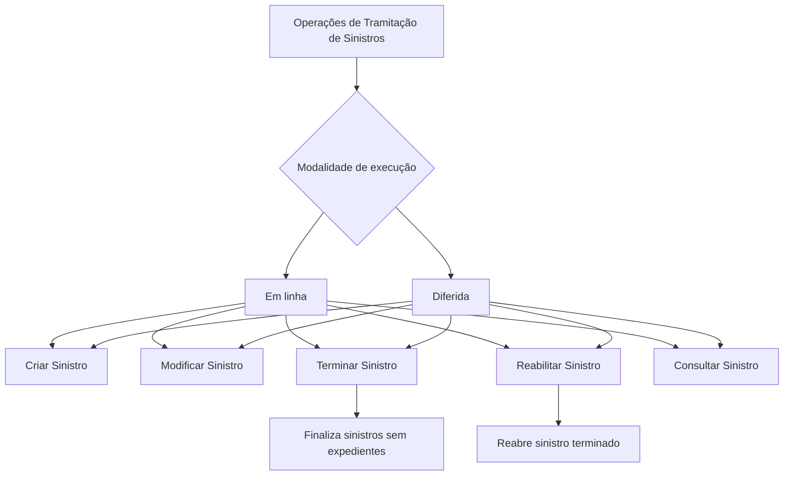

# Certificação de Operações de Sinistros — Definições e Operações de Tramitação de Sinistros

## 1. Metadados do Documento
- **Arquivo de Origem:** Não identificado no conteúdo fornecido
- **Tipo de Documento:** Especificação Técnica
- **Domínio / Sistema:** Operações de Sinistros — Tramitação de Sinistros
- **Público-Alvo:** Desenvolvedores, Arquitetos, Operação e Negócio
- **Data/Versão Identificada:** Não identificada

---

## 2. Resumo Executivo & Contexto de Negócio

O documento descreve definições e operações relacionadas à tramitação de sinistros. O conteúdo organiza a configuração do módulo de sinistros em níveis de definição: comum, geral, ramo e sinistro. Cada nível agrupa elementos que determinam informações organizacionais, comportamentos funcionais, regras aplicáveis a ramos e dados associados a um sinistro.

No nível comum, o documento reúne definições não exclusivas do módulo de sinistros, mas necessárias para sua operação. Essas definições incluem companhia, moeda, estruturas geográfica, comercial, de produto e de tramitação, além de controle técnico. Esse conjunto estabelece referências corporativas, organizacionais e operacionais utilizadas pelo processo de sinistros.

No nível geral, são definidos elementos aplicáveis ao módulo de sinistros e não exclusivos de um ramo. O documento destaca numeração de sinistros, registro de eventos catastróficos por área geográfica, características gerais e causas de processos. Essas definições determinam comportamentos compartilhados do módulo e critérios de catalogação para operações.

No nível de ramo, o documento apresenta configurações específicas para o ramo em definição. Entre elas estão extemporaneidade, características gerais por ramo, causas de processo, especialidade de supervisores e especialidade de tramitadores. Essas configurações permitem adequar a tramitação de sinistros às características de produtos determinados.

No nível de sinistro, o documento descreve definições aplicáveis aos possíveis expedientes de um sinistro, incluindo causa de origem, consequência, relação causa-consequência, atributos, estrutura de informação inicial, validações de informação e controle técnico. O documento também lista as operações de criação, modificação, término, reabilitação e consulta de sinistros, que podem ser executadas em linha ou de forma diferida.

---

## 3. Arquitetura, Componentes & Tecnologias Envolvidas

O documento não identifica tecnologias, linguagens, bancos de dados, URLs, ambientes, microsserviços, APIs, contratos HTTP ou ferramentas de implantação.

A estrutura funcional identificada é composta pelos seguintes níveis e componentes:

| Componente / Nível | Descrição fundamentada no documento |
| :--- | :--- |
| Comum | Definições não exclusivas do módulo de sinistros, necessárias para realizar a definição. |
| Companhia | Informação geral da empresa. |
| Moeda | Informação geral das moedas. |
| Estrutura Geográfica | Divisões do país por zonas. |
| Estrutura Comercial | Divisões organizativas da companhia. |
| Estrutura Produto | Divisões dos ramos. |
| Estrutura Tramitação | Definição de escritórios onde são tramitados expedientes e associação de supervisores e tramitadores. |
| Controle Técnico | Definição de erros, tipos de erros e condições relacionadas à paralisação ou autorização da tramitação. |
| Geral | Definições não exclusivas de um ramo e utilizadas no módulo de sinistros. |
| Ramo | Definições exclusivas do ramo que está sendo configurado. |
| Sinistro | Definições que afetam todos os possíveis expedientes de um sinistro. |
| Operações de Tramitação de Sinistros | Operações executáveis sobre um sinistro em linha ou de forma diferida. |

```mermaid
graph TD
    A[Tramitação de Sinistros] --> B[Definições]

    B --> C[Comum]
    B --> D[Geral]
    B --> E[Ramo]
    B --> F[Sinistro]

    C --> C1[Companhia]
    C --> C2[Moeda]
    C --> C3[Estrutura Geográfica]
    C --> C4[Estrutura Comercial]
    C --> C5[Estrutura Produto]
    C --> C6[Estrutura Tramitação]
    C --> C7[Controle Técnico]

    D --> D1[Numeração]
    D --> D2[Eventos]
    D --> D3[Características Gerais]
    D --> D4[Causas de Processos]

    E --> E1[Extemporaneidade]
    E --> E2[Características Gerais por Ramo]
    E --> E3[Causa Processo por Ramo]
    E --> E4[Especialidade Supervisores]
    E --> E5[Especialidade Tramitadores]

    F --> F1[Causa Origem]
    F --> F2[Consequência]
    F --> F3[Causa-Consequência]
    F --> F4[Atributo]
    F --> F5[Estrutura Informação Inicial]
    F --> F6[Validações Informação]
    F --> F7[Controle Técnico]

    A --> G[Operações de Tramitação]
    G --> G1[Criar Sinistro]
    G --> G2[Modificar Sinistro]
    G --> G3[Terminar Sinistro]
    G --> G4[Reabilitar Sinistro]
    G --> G5[Consultar Sinistro]
```



> *Nota de Análise: O documento apresenta uma estrutura funcional de definições e operações de sinistros, mas não detalha arquitetura de software, integrações técnicas, métodos HTTP, contratos JSON, persistência de dados ou mecanismos de autenticação.*

---

## 4. Regras de Negócio, Especificações Funcionais & Processos

### 4.1 Nível Comum

O nível comum contém definições que não são exclusivas do módulo de sinistros, mas são necessárias para realizar a definição de tramitação de sinistros.

- **Companhia:** contém informação geral da empresa.
- **Moeda:** contém informação geral das moedas.
- **Estrutura Geográfica:** estabelece divisões do país por zonas.
- **Estrutura Comercial:** estabelece divisões organizativas da companhia.
- **Estrutura Produto:** estabelece divisões dos ramos.
- **Estrutura Tramitação:** define os escritórios onde os expedientes são tramitados e associa supervisores e tramitadores.
- **Controle Técnico:** define erros e tipos de erros.

### 4.2 Nível Geral

O nível geral contém definições que não são exclusivas de um ramo e são utilizadas no módulo de sinistros.

- **Numeração:** determina quais elementos formarão parte do número de sinistros e em qual ordem esses elementos serão utilizados.
- **Eventos:** registra todos os fenômenos catastróficos ocorridos em uma zona geográfica determinada.
- **Características Gerais:** determina comportamentos do módulo de sinistros.
- **Causas de Processos:** permite catalogar os motivos pelos quais se deseja realizar uma operação.

### 4.3 Nível de Ramo

O nível de ramo contém definições exclusivas do ramo que está sendo definido.

- **Extemporaneidade:** indica o número máximo de dias que pode transcorrer entre a data de ocorrência do sinistro e a data em que o sinistro é notificado à companhia.
- **Características Gerais:** determina comportamentos do módulo de sinistros para cada ramo.
- **Causa Processo:** permite catalogar os motivos pelos quais se deseja realizar operações de sinistros para cada ramo.
- **Especialidade Supervisores:** permite especializar supervisores em produtos determinados.
- **Especialidade Tramitadores:** permite especializar tramitadores em produtos determinados.

### 4.4 Nível de Sinistro

O nível de sinistro contém definições que afetarão todos os possíveis expedientes de um sinistro.

- **Causa Origem:** cataloga as diferentes causas que originam um sinistro.
- **Consequência:** define os possíveis danos causados pelo sinistro, incluindo danos materiais e danos pessoais.
- **Causa-Consequência:** define, para cada causa de origem de sinistro, os possíveis danos ocorridos devido ao sinistro.
- **Atributo:** define informação adicional do sinistro, como dados de veículo contrário e dados de lesionado.
- **Estrutura Informação Inicial:** organiza a informação adicional do sinistro por atributos, obrigatoriedade ou não de solicitação da informação e ordem em que a informação será solicitada.
- **Informação Prévia para Atributos:** registra informação prévia para atributos das operações de sinistros, evitando a necessidade de introduzir posteriormente essa informação. O exemplo fornecido é a data de comunicação do sinistro preenchida com a data do dia.
- **Validações Informação:** define comportamentos e validações para a informação de core solicitada nas operações de sinistros. O documento exemplifica a obrigatoriedade da hora de declaração de um sinistro.
- **Controle Técnico:** define em quais condições a tramitação de um sinistro pode ser paralisada ou em quais condições existe obrigação de autorização.

### 4.5 Operações de Tramitação de Sinistros

As operações de tramitação de sinistros podem ser realizadas tanto **em linha** quanto de forma **diferida**.

| Operação | Regra funcional descrita |
| :--- | :--- |
| Criar Sinistro | Permite gerar um novo sinistro. |
| Modificar Sinistro | Permite alterar a informação do sinistro. |
| Terminar Sinistro | Finaliza sinistros sem expedientes. |
| Reabilitar Sinistro | Reabre um sinistro terminado. |
| Consultar Sinistro | Exibe toda a informação do sinistro. |



---

## 5. Tabelas de Parâmetros, Ambientes e Estruturas de Dados

| Item / Parâmetro | Descrição / Função | Tipo / Valores / Formato | Ambiente / Observações |
| :--- | :--- | :--- | :--- |
| Companhia | Informação geral da empresa. | Não especificado. | Definição de nível comum. |
| Moeda | Informação geral das moedas. | Não especificado. | Definição de nível comum. |
| Estrutura Geográfica | Divide o país por zonas. | Zonas geográficas. | Definição de nível comum. |
| Estrutura Comercial | Define divisões organizativas da companhia. | Estrutura organizativa. | Definição de nível comum. |
| Estrutura Produto | Define divisões dos ramos. | Ramos. | Definição de nível comum. |
| Estrutura Tramitação | Define escritórios de tramitação de expedientes e associa supervisores e tramitadores. | Escritórios, supervisores e tramitadores. | Definição de nível comum. |
| Controle Técnico — comum | Define erros e tipos de erros. | Erros e tipos de erros. | Definição de nível comum. |
| Numeração | Determina os elementos que compõem o número de sinistros e sua ordem. | Elementos e ordem não especificados. | Definição de nível geral. |
| Eventos | Registra fenômenos catastróficos ocorridos em zona geográfica determinada. | Fenômenos catastróficos e zona geográfica. | Definição de nível geral. |
| Características Gerais — geral | Determina comportamentos do módulo de sinistros. | Comportamentos não especificados. | Definição de nível geral. |
| Causas de Processos | Cataloga motivos para realizar uma operação. | Motivos de operação. | Definição de nível geral. |
| Extemporaneidade | Indica o número máximo de dias entre ocorrência e notificação do sinistro à companhia. | Número máximo de dias. | Definição exclusiva do ramo. |
| Características Gerais — ramo | Determina comportamentos do módulo de sinistros para cada ramo. | Comportamentos por ramo não especificados. | Definição de nível de ramo. |
| Causa Processo — ramo | Cataloga motivos para realizar operações de sinistros para cada ramo. | Motivos de operações por ramo. | Definição de nível de ramo. |
| Especialidade Supervisores | Especializa supervisores em produtos determinados. | Supervisores e produtos determinados. | Definição de nível de ramo. |
| Especialidade Tramitadores | Especializa tramitadores em produtos determinados. | Tramitadores e produtos determinados. | Definição de nível de ramo. |
| Causa Origem | Cataloga diferentes causas que originam um sinistro. | Causas de origem. | Definição de nível de sinistro. |
| Consequência | Define possíveis danos ocorridos por um sinistro. | Exemplos: danos materiais e danos pessoais. | Definição de nível de sinistro. |
| Causa-Consequência | Define possíveis danos para cada causa de origem de sinistro. | Relação entre causa de origem e danos. | Definição de nível de sinistro. |
| Atributo | Define informação adicional do sinistro. | Exemplos: dados de veículo contrário e dados de lesionado. | Definição de nível de sinistro. |
| Estrutura Informação Inicial | Define atributos, obrigatoriedade de informação e ordem de solicitação. | Atributos, obrigatoriedade e ordem. | Definição de nível de sinistro. |
| Informação Prévia para Atributos | Registra informação prévia para não precisar introduzi-la posteriormente. | Exemplo: data de comunicação do sinistro com a data do dia. | Associada às operações de sinistros. |
| Validações Informação | Define comportamentos e validações da informação de core solicitada nas operações. | Exemplo: hora de declaração obrigatória. | Definição de nível de sinistro. |
| Controle Técnico — sinistro | Define condições para paralisação da tramitação ou obrigação de autorização. | Condições não especificadas. | Definição de nível de sinistro. |
| Criar Sinistro | Gera um novo sinistro. | Operação. | Pode ser realizada em linha ou de forma diferida. |
| Modificar Sinistro | Altera a informação do sinistro. | Operação. | Pode ser realizada em linha ou de forma diferida. |
| Terminar Sinistro | Finaliza sinistros sem expedientes. | Operação. | Pode ser realizada em linha ou de forma diferida. |
| Reabilitar Sinistro | Reabre um sinistro terminado. | Operação. | Pode ser realizada em linha ou de forma diferida. |
| Consultar Sinistro | Mostra toda a informação do sinistro. | Operação. | Pode ser realizada em linha ou de forma diferida. |

> *Nota de Análise: O documento não fornece valores numéricos para extemporaneidade, formatos de numeração, catálogos de causas, tipos de erro, estruturas de dados, URLs, servidores, portas, credenciais ou ambientes técnicos.*

---

## 6. Bateria de Perguntas & Respostas para RAG (FAQ Sintético)

### P1: Quais são os níveis de definição utilizados na tramitação de sinistros?
**R:** O documento organiza as definições de tramitação de sinistros nos níveis comum, geral, ramo e sinistro. O nível comum reúne definições necessárias, mas não exclusivas do módulo de sinistros. O nível geral reúne definições utilizadas no módulo e não exclusivas de um ramo. O nível de ramo contém definições exclusivas de cada ramo. O nível de sinistro reúne definições que afetam todos os possíveis expedientes de um sinistro.

### P2: Qual é a função da estrutura de tramitação no módulo de sinistros?
**R:** A estrutura de tramitação define os escritórios onde os expedientes de sinistros são tramitados. A estrutura de tramitação também associa supervisores e tramitadores a esses escritórios.

### P3: Como a numeração de sinistros é definida?
**R:** A numeração determina quais elementos formarão parte do número de sinistros e define a ordem em que esses elementos serão utilizados. O documento não especifica quais são os elementos de numeração nem fornece um formato concreto para o número de sinistro.

### P4: O que é extemporaneidade no contexto de um ramo de sinistros?
**R:** Extemporaneidade permite indicar o número máximo de dias que pode transcorrer entre a data de ocorrência do sinistro e a data em que o sinistro é notificado à companhia. O documento não informa o valor máximo de dias aplicável.

### P5: Para que servem as especialidades de supervisores e tramitadores?
**R:** A especialidade de supervisores permite especializar supervisores em produtos determinados. A especialidade de tramitadores permite especializar tramitadores em produtos determinados. Ambas são definições exclusivas do nível de ramo.

### P6: Como o módulo define as causas e consequências de um sinistro?
**R:** A causa de origem cataloga as diferentes causas que originam um sinistro. A consequência define os possíveis danos ocorridos pelo sinistro, como danos materiais e danos pessoais. A definição causa-consequência relaciona cada causa de origem de sinistro aos possíveis danos associados.

### P7: O que são atributos de sinistro?
**R:** Atributos são informações adicionais do sinistro. O documento cita como exemplos os dados de veículo contrário e os dados de lesionado. A estrutura de informação inicial define os atributos, a obrigatoriedade ou não de solicitar cada informação e a ordem em que a informação será solicitada.

### P8: Qual é o objetivo das validações de informação nas operações de sinistros?
**R:** As validações de informação definem comportamentos e validações da informação de core solicitada nas operações de sinistros. O documento fornece como exemplo a configuração da hora de declaração de um sinistro como informação obrigatória.

### P9: Como pode ocorrer o preenchimento prévio de atributos em operações de sinistros?
**R:** O documento informa que é possível registrar informação prévia para atributos das operações de sinistros, evitando a necessidade de introduzir posteriormente essa informação. Como exemplo, a data de comunicação do sinistro pode ser preenchida com a data do dia.

### P10: Em que situações o controle técnico pode interferir na tramitação de um sinistro?
**R:** No nível de sinistro, o controle técnico define as condições em que a tramitação de um sinistro pode ser paralisada ou em que existe obrigação de autorização. O documento não detalha quais condições, erros ou autorizações específicas são configuráveis.

### P11: Quais operações podem ser realizadas sobre um sinistro?
**R:** As operações listadas são criar sinistro, modificar sinistro, terminar sinistro, reabilitar sinistro e consultar sinistro. Essas operações podem ser realizadas em linha ou de forma diferida.

### P12: Qual é a diferença entre terminar e reabilitar um sinistro?
**R:** Terminar sinistro finaliza sinistros sem expedientes. Reabilitar sinistro reabre um sinistro que foi terminado. O documento não apresenta condições adicionais, permissões ou validações para executar essas operações.

---

## 7. Glossário de Termos, Siglas & Conceitos-Chave

- **Atributo:** Informação adicional associada a um sinistro, como dados de veículo contrário ou dados de lesionado.
- **Causa Origem:** Definição que cataloga as diferentes causas que originam um sinistro.
- **Causa-Consequência:** Relação que define os possíveis danos para cada causa de origem de sinistro.
- **Causa Processo:** Definição que cataloga os motivos pelos quais se deseja realizar operações de sinistros para cada ramo.
- **Causas de Processos:** Definição geral que cataloga os motivos pelos quais se deseja realizar uma operação.
- **Companhia:** Informação geral da empresa.
- **Consequência:** Definição dos possíveis danos ocorridos por um sinistro, como danos materiais e danos pessoais.
- **Controle Técnico:** Definição de erros, tipos de erros e, no nível de sinistro, condições para paralisação da tramitação ou obrigação de autorização.
- **Core:** Informação de core solicitada em operações de sinistros. O documento não expande ou define tecnicamente o termo.
- **Evento:** Registro de fenômeno catastrófico ocorrido em uma zona geográfica determinada.
- **Expediente:** Termo utilizado pelo documento para os casos relacionados a um sinistro. O documento não fornece definição adicional.
- **Extemporaneidade:** Número máximo de dias entre a ocorrência do sinistro e sua notificação à companhia.
- **Ramo:** Nível de definições exclusivas do ramo que está sendo configurado.
- **Sinistro:** Objeto sobre o qual são aplicadas definições e operações de tramitação.
- **Tramitador:** Papel associado aos escritórios de tramitação e que pode ser especializado em produtos determinados.
- **Tramitação:** Processo de tratamento de expedientes e execução de operações sobre sinistros.

---

## 8. Notas Críticas, Riscos & Limitações

- O documento não identifica o arquivo de origem, autor, data, versão, sistema proprietário ou organização responsável.
- O documento não descreve tecnologias, integrações, APIs, microsserviços, bancos de dados, ambientes, URLs, mecanismos de autenticação ou modelos de segurança.
- Não são especificados os valores máximos de dias para extemporaneidade.
- Não são apresentados os elementos concretos, formatos ou regras de composição da numeração de sinistros.
- Não são fornecidos catálogos de causas de origem, consequências, causas de processo, tipos de erro ou atributos de sinistro.
- O documento não detalha as condições que paralisam a tramitação de um sinistro nem as condições que exigem autorização.
- O documento indica que as operações podem ser realizadas em linha ou de forma diferida, mas não detalha processamento, agendamento, filas, estados, reprocessamento ou comportamento em caso de falha.
- Não há detalhamento adicional sobre permissões, perfis de acesso, matrizes de responsabilidade ou regras de autorização para criar, modificar, terminar, reabilitar ou consultar sinistros.
- Não foram fornecidas notas de apresentador, anexos ou conteúdo adicional além do texto extraído.

---

## 9. Conteúdo Bruto Estruturado (Referência Fiel)

```text
--- [PÁGINA 1 DE 4] ---

CERTIFICACIÓN OPERACIONES de
SINIESTROS - TRAMITACIÓN SINIESTROS
Definiciones Tramitación de Siniestros
Operaciones de Tramitación Siniestros
DEFINICIONES
COMÚN
En este nivel se encuentran definiciones que NO son exclusivas del
módulo de siniestros, pero son necesarias para poder realizar la
definición. Entre otras definiciones se encuentra:
COMPAÑÍA
Información General de la empresa
MONEDA
Información General de las monedas
 / 
 RS
Inicio Soluciones APIs Documentación Zeus
ES


--- [PÁGINA 2 DE 4] ---

ESTRUCTURA GEOGRÁFICA
Divisiones del país por zonas
ESTRUCTURA COMERCIAL
Divisiones organizativas de la compañía
ESTRUCTURA PRODUCTO
Divisiones de los ramos
ESTRUCTURA TRAMITACIÓN
Definición de oficinas donde se tramitan
expedientes, se asocian supervisores,
tramitadores
CONTROL TÉCNICO
Definición de errores, tipos de Errores
GENERAL
Son definiciones que NO son exclusivas de un ramo y se utilizan en el
módulo de siniestros. Las más importantes son:
NUMERACIÓN 
Determina qué elementos formarán parte del
número de siniestros y en qué orden
EVENTOS :
Registra todos los fenómenos catrastróficos
ocurridos en una zona geográfica
determinada
CARACTERÍSTICAS GENERALES 
Determinar comportamientos del módulo de
siniestros
CAUSAS DE PROCESOS 
Permite catalogar los motivos por los que se
quiere realizar una operación
RAMO
Son exclusivas del ramo que se está definiendo. Por ejemplo:


--- [PÁGINA 3 DE 4] ---

EXTEMPORANEIDAD
Permite indicar el número máximo de días
que pueden transcurrir entre la fecha de
ocurrencia del siniestro y la fecha en la que se
notifica a la compañía
CARACTERÍSTICAS GENERALES 
Determinar comportamientos del módulo de
siniestros para cada ramo
CAUSA PROCESO 
Permite catalogar los motivos por los que se
quiere realizar las operaciones de siniestros
para cada ramo
ESPECIALIDAD SUPERVISORES 
Permite especializar a los supervisores en
Productos determinados
ESPECIALIDAD TRAMITADORES 
Permite especializar a los tramitadores en
Productos determinados
SINIESTRO
En este nivel se encuentran definiciones que afectarán a todos los
posibles expedientes de un siniestro. Entre otros se define:
CAUSA ORIGEN 
Catalogar las diferentes causas que originan
un siniestro
CONSECUENCIA 
Permite definir los posibles daños ocurridos
por el siniestro (Daños materiales, daños
personales...)
CAUSA-CONSECUENCIA 
Permite definir para cada causa de origen de
siniestros las posibles daños ocurridos por el
siniestro (Daños materiales, daños
personales...)
ATRIBUTO
Permite definir la información adicional del
siniestro, como datos vehículo contrario,
datos lesionado, etc.
ESTRUCTURA
 INFORMACIÓN INICIAL


--- [PÁGINA 4 DE 4] ---

Información adicional del siniestro compuesta
por atributos, obligatoriedad o no de pedir
información, orden en el que se va a pedir
Registrar información previa para los atributos
de las operaciones de siniestros, para no
tener que introducirla posteriormente. Un
ejemplo sería la fecha de comunicación del
siniestro que salga la fecha del día
VALIDACIONES INFORMACIÓN 
Definir comportamientos y validaciones de la
información de core, que se piden en las
operaciones de siniestros. Ejemplo poner
obligatoria la hora de declaración de un
siniestro
CONTROL TÉCNICO
Definición de en qué condiciones se puede
paralizar la tramitación de un siniestro u
obligación de ser autorizado
OPERACIONES
TRAMITACIÓN DE SINIESTROS
Operaciones que se pueden realizar a un siniestro, se pueden realizar
tanto en línea como diferido:
CREAR Siniestro
Permite generar un nuevo siniestro
MODIFICAR Siniestro
Permite cambiar la información del siniestro
TERMINAR Siniestro
Finaliza siniestros sin expedientes
REHABILITAR Siniestro
Reabre un siniestro Terminado
CONSULTAR Siniestro
Muestra toda la información del siniestro
```
