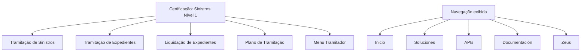

# Certificação — Sinistros Nível 1: Estrutura de Conteúdos de Tramitação

## 1. Metadados do Documento
- **Arquivo de Origem:** Não identificado
- **Tipo de Documento:** Apresentação Executiva
- **Domínio / Sistema:** Certificação de Sinistros — Nível 1
- **Público-Alvo:** Operação, Negócio e profissionais em capacitação sobre sinistros
- **Data/Versão Identificada:** Não identificada

---

## 2. Resumo Executivo & Contexto de Negócio

O documento apresenta a estrutura temática da certificação de **Sinistros Nível 1**. O conteúdo está organizado em áreas relacionadas à tramitação, ao tratamento de expedientes, à liquidação e ao plano de tramitação.

A seção **Tramitação de Sinistros** concentra o temário das operações associadas à tramitação de um sinistro. O material não detalha procedimentos, regras, sistemas, responsáveis, prazos ou critérios de conclusão dessas operações.

A seção **Tramitação de Expedientes** reúne o temário das operações de tramitação de um expediente. Em paralelo, a seção **Liquidação de Expedientes** concentra o conteúdo relacionado às operações de liquidação de expedientes.

O documento também indica conteúdos para **Plano de Tramitação** e para o **Menu Tramitador**. A navegação ou cabeçalho exibido menciona “Inicio”, “Soluciones”, “APIs”, “Documentación” e “Zeus”, além da indicação de idioma “ES”.

---

## 3. Arquitetura, Componentes & Tecnologias Envolvidas

O documento não descreve arquitetura de software, integrações, APIs, tecnologias, microsserviços, ambientes ou contratos técnicos. Os únicos elementos identificáveis são áreas de conteúdo da certificação e itens de navegação apresentados no material.



**Nota de Análise:** o documento menciona “APIs” e “Zeus”, mas não fornece detalhamento técnico, endpoints, métodos HTTP, contratos JSON, autenticação, ambientes ou relação explícita desses itens com a certificação de sinistros.

---

## 4. Regras de Negócio, Especificações Funcionais & Processos

O conteúdo extraído não apresenta regras de negócio explícitas, condições de validação, cálculos, fluxos operacionais detalhados, exceções ou critérios de aprovação.

As informações funcionais identificadas são:

1. A certificação é denominada **Sinistros Nível 1**.
2. A área **Tramitação de Sinistros** contém o temário das operações relacionadas à tramitação de um sinistro.
3. A área **Tramitação de Expedientes** contém o temário das operações relacionadas à tramitação de um expediente.
4. A área **Liquidação de Expedientes** contém o temário das operações relacionadas às liquidações.
5. A área **Plano de Tramitação** contém o temário das operações do plano de tramitação.
6. A área **Menu Tramitador** contém o temário das operações do menu utilizado pelo tramitador.

**Nota de Análise:** não há detalhamento adicional sobre as operações que compõem cada temário.

---

## 5. Tabelas de Parâmetros, Ambientes e Estruturas de Dados

| Item / Parâmetro | Descrição / Função | Tipo / Valores / Formato | Ambiente / Observações |
| :--- | :--- | :--- | :--- |
| Certificação — Sinistros Nível 1 | Título principal do conteúdo apresentado | Certificação | Não há versão ou data identificada |
| Tramitação de Sinistros | Área com o temário das operações de tramitação de um sinistro | Seção temática | Operações não detalhadas |
| Tramitação de Expedientes | Área com o temário das operações de tramitação de um expediente | Seção temática | Operações não detalhadas |
| Liquidação de Expedientes | Área com o temário das operações de liquidações | Seção temática | Operações não detalhadas |
| Plano de Tramitação | Área com o temário das operações do plano de tramitação | Seção temática | Operações não detalhadas |
| Menu Tramitador | Área com o temário das operações do menu do tramitador | Seção temática | Operações não detalhadas |
| Inicio | Item de navegação exibido | Navegação | Sem detalhamento |
| Soluciones | Item de navegação exibido | Navegação | Sem detalhamento |
| APIs | Item de navegação exibido | Navegação | Sem documentação técnica no conteúdo |
| Documentación | Item de navegação exibido | Navegação | Sem detalhamento |
| Zeus | Item de navegação exibido | Navegação / sistema citado | Relação com sinistros não especificada |
| ES | Indicação exibida no documento | Idioma | Provavelmente espanhol, sem explicação adicional |

---

## 6. Bateria de Perguntas & Respostas para RAG (FAQ Sintético)

### P1: Qual é o tema principal do documento?
**R:** O documento apresenta a certificação denominada **Sinistros Nível 1**, estruturada em temas relacionados à tramitação de sinistros, tramitação de expedientes, liquidação de expedientes, plano de tramitação e menu do tramitador.

### P2: O que está incluído na seção Tramitação de Sinistros?
**R:** A seção Tramitação de Sinistros contém o temário de todas as operações relacionadas à tramitação de um sinistro. O documento não descreve quais são essas operações.

### P3: Qual é a finalidade da seção Tramitação de Expedientes?
**R:** A seção Tramitação de Expedientes reúne o temário de todas as operações relacionadas à tramitação de um expediente. Não há detalhamento dos passos, regras ou responsáveis por essas operações.

### P4: O documento detalha como realizar a liquidação de expedientes?
**R:** Não. O documento apenas informa que a seção Liquidação de Expedientes contém o temário das operações de liquidações, sem apresentar procedimentos ou regras operacionais.

### P5: O que é apresentado sobre o Plano de Tramitação?
**R:** O Plano de Tramitação é apresentado como uma seção que contém o temário de todas as operações do plano de tramitação. O conteúdo extraído não explica essas operações.

### P6: Qual conteúdo está associado ao Menu Tramitador?
**R:** O Menu Tramitador possui uma seção própria com o temário de todas as operações relacionadas ao menu do tramitador. O documento não informa menus, opções, permissões ou fluxos de uso.

### P7: O documento fornece especificações técnicas de APIs?
**R:** Não. Embora “APIs” apareça entre os itens de navegação, não há endpoints, métodos HTTP, payloads, autenticação, contratos ou documentação técnica de APIs no conteúdo extraído.

### P8: O sistema Zeus é descrito no documento?
**R:** Não. “Zeus” é citado na navegação exibida, mas o documento não descreve sua função, arquitetura, integração ou vínculo operacional com a certificação de sinistros.

### P9: Há data ou versão identificada para a certificação?
**R:** Não. O conteúdo fornecido não apresenta data, versão, histórico de alterações ou identificação do arquivo de origem.

### P10: O documento descreve regras de negócio para sinistros?
**R:** Não. O material apresenta apenas a organização temática da certificação e não fornece regras de negócio, cálculos, validações, condições ou exceções.

---

## 7. Glossário de Termos, Siglas & Conceitos-Chave

- **Sinistros:** termo central da certificação; o documento relaciona sinistros a operações de tramitação.
- **Tramitação:** conjunto de operações abordadas no temário para sinistros, expedientes e plano de tramitação.
- **Expedientes:** entidade tratada nas seções de tramitação e liquidação.
- **Liquidação de Expedientes:** área temática com operações de liquidação de expedientes.
- **Plano de Tramitação:** área temática que concentra operações do plano de tramitação.
- **Menu Tramitador:** área temática associada às operações do menu do tramitador.
- **APIs:** item de navegação citado; sem definição técnica adicional no documento.
- **Zeus:** item de navegação citado; sem definição adicional no documento.
- **ES:** indicação de idioma exibida no material; não explicada no conteúdo.

---

## 8. Notas Críticas, Riscos & Limitações

- O arquivo de origem, tipo de arquivo, autoria, data e versão não foram identificados.
- O conteúdo apresenta títulos e descrições resumidas de seções, sem detalhamento operacional.
- Não há processos passo a passo, regras de negócio, critérios de validação, responsabilidades ou indicadores.
- Não há informações técnicas sobre APIs, sistemas, integrações, segurança, ambientes, logs ou arquitetura.
- A menção a “Zeus” não é suficiente para estabelecer sua função ou sua relação com o domínio de sinistros.
- Não são apresentados detalhes adicionais sobre as operações de tramitação, liquidação, plano de tramitação ou menu do tramitador.

---

## 9. Conteúdo Bruto Estruturado (Referência Fiel)

```text
--- [PÁGINA 1 DE 2] ---

CERTIFICACIÓN - SINIESTROS NIVEL 1
CERTIFICACIÓN
Siniestros nivel-1
 TRAMITACIÓN SINIESTROS
En este apartado se encuentra el temario de
todas las operaciones de la tramitación de un
siniestro
 TRAMITACIÓN EXPEDIENTES
En este apartado se encuentra el temario de
todas las operaciones de la tramitación de un
expediente
 LIQUIDACIÓN EXPEDIENTES
En este apartado se encuentra el temario de
todas las operaciones de las liquidaciones
 PLAN TRAMITACIÓN
En este apartado se encuentra el temario de
todas las operaciones del plan de tramitación
 /
 RS
Inicio Soluciones APIs Documentación Zeus
ES


--- [PÁGINA 2 DE 2] ---

MENÚ TRAMITADOR
En este apartado se encuentra el temario de
todas las operaciones del Menú del tramitador
```
