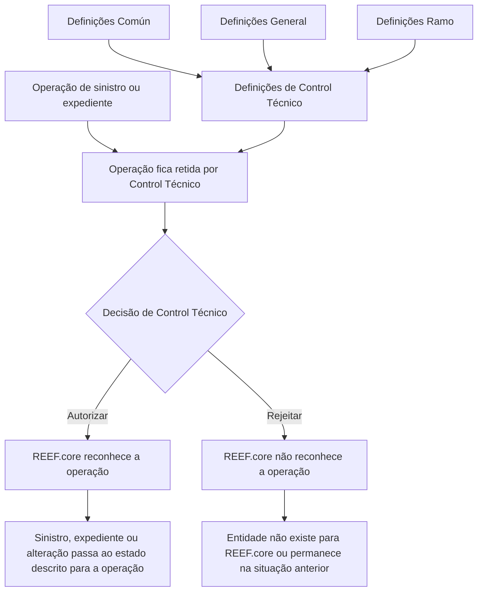

# Certificación de Siniestros — Control Técnico no REEF.core

## 1. Metadados do Documento
- **Arquivo de Origem:** Não identificado no conteúdo extraído
- **Tipo de Documento:** Manual Operacional
- **Domínio / Sistema:** Siniestros (sinistros), Control Técnico e REEF.core
- **Público-Alvo:** Operação, negócio, auditoria e equipes responsáveis pelo módulo de sinistros
- **Data/Versão Identificada:** Não identificada

---

## 2. Resumo Executivo & Contexto de Negócio

O documento descreve definições e operações de **Control Técnico** aplicadas ao módulo de sinistros. O Control Técnico administra erros de sinistros, procedimentos relacionados aos sistemas **3-Liquidaciones** e **7-Siniestros**, além de mencionar papéis (*Roles*) associados ao processo.

As definições são organizadas em níveis: **Común**, para elementos não exclusivos do módulo de sinistros, mas necessários para sua configuração; **General**, para definições no nível da companhia; e **Ramo**, para definições exclusivas do ramo que está sendo configurado. Entre os elementos destacados estão características gerais e causas de processo.

O processo operacional central decide se alterações retidas por Control Técnico são autorizadas ou rejeitadas. A autorização faz com que o restante do **REEF.core** reconheça o evento ou a alteração. A rejeição impede esse reconhecimento, preservando a situação anterior quando aplicável ou fazendo com que a entidade ou operação não exista para o REEF.core.

As operações abrangem abertura, modificação e reabilitação de sinistros; abertura, mudança de valoração, reabilitação e liquidação de expedientes; além de criação e modificação de faturamento e criação de plano de renda. O documento não especifica interfaces, métodos HTTP, contratos JSON, persistência, usuários autorizadores, critérios automáticos de retenção ou trilhas de auditoria.

---

## 3. Arquitetura, Componentes & Tecnologias Envolvidas

### Componentes, módulos e conceitos citados

| Componente / Termo | Papel descrito no documento |
| :--- | :--- |
| Control Técnico | Gerencia definições de erros de sinistros e operações de autorização ou rejeição de controles técnicos de auditoria. |
| Siniestros | Módulo de sinistros ao qual se aplicam as definições e operações de Control Técnico. |
| REEF.core | Componente cujo reconhecimento de sinistros, expedientes, alterações, liquidações, faturas e planos de renda depende da autorização do Control Técnico. |
| 3-Liquidaciones | Sistema citado como relacionado aos procedimentos definidos no Control Técnico. |
| 7-Siniestros | Sistema citado como relacionado aos procedimentos definidos no Control Técnico. |
| Común | Nível de definições não exclusivas do módulo de sinistros, necessárias para realizar definições. |
| General | Nível de definições no âmbito da companhia. |
| Ramo | Nível de definições exclusivo do ramo configurado. |
| Características | Características gerais do módulo de sinistros que determinam comportamentos dos módulos de sinistros. |
| Causa Proceso | Catálogo de motivos para rejeitar um sinistro ou um expediente. |
| Expediente | Entidade associada a operações de abertura, valoração, reabilitação, liquidação, faturamento e plano de renda. |
| Facturación | Criação ou modificação de fatura associada a um expediente. |
| Plan Renta | Plano de renda criado para um expediente. |

### Fluxo operacional de Control Técnico



> **Nota de Análise:** O documento não detalha a implementação técnica do Control Técnico, os mecanismos de integração entre Control Técnico e REEF.core, nem as tecnologias usadas pelos sistemas 3-Liquidaciones e 7-Siniestros.

---

## 4. Regras de Negócio, Especificações Funcionais & Processos

### 4.1 Definições de Control Técnico

1. O nível **Común** contém definições que não são exclusivas do módulo de sinistros, mas são necessárias para realizar a definição.
2. No nível **Común**, o documento cita a definição de erros de sinistros, procedimentos para os sistemas **3-Liquidaciones** e **7-Siniestros**, além de *Roles*.
3. O nível **General** contém definições em nível de companhia.
4. As **Características** definem características gerais do módulo de sinistros e determinam comportamentos dos módulos de sinistros.
5. A **Causa Proceso** permite catalogar motivos pelos quais se pretende rejeitar um sinistro ou um expediente.
6. O nível **Ramo** contém definições exclusivas do ramo que está sendo definido.
7. No nível **Ramo**, a **Causa Proceso** também permite catalogar motivos para rejeitar um sinistro ou um expediente.

### 4.2 Regra geral de autorização

Uma operação retida por Control Técnico, quando autorizada, é aprovada ou aceita conforme o tipo de operação. Como consequência, o restante do REEF.core reconhece a entidade, a modificação ou o efeito operacional correspondente.

### 4.3 Regra geral de rejeição

Uma operação retida por Control Técnico, quando rejeitada, não é autorizada. Como consequência, o REEF.core não reconhece a entidade ou alteração. Nos casos em que uma alteração já existia antes da operação retida, o REEF.core preserva a situação anterior explicitamente indicada no documento.

### 4.4 Operações de autorização

| Operação | Regra funcional | Efeito no REEF.core |
| :--- | :--- | :--- |
| AUTORIZAR Apertura Siniestro | Um sinistro retido por Control Técnico passa a estar aprovado. | O restante do REEF.core reconhece o sinistro. |
| AUTORIZAR Modificación siniestro | Uma modificação de sinistro retida por Control Técnico passa a estar aprovada. | O restante do REEF.core reconhece a modificação do sinistro. |
| AUTORIZAR Rehabilitación siniestro | Uma reabilitação de sinistro retida por Control Técnico passa a estar aprovada. | O restante do REEF.core reconhece que o sinistro volta a estar pendente. |
| AUTORIZAR Apertura expediente | Um expediente retido por Control Técnico passa a estar aprovado. | O restante do REEF.core reconhece o expediente. |
| AUTORIZAR Cambio valoración | Uma modificação de valoração de expediente retida por Control Técnico passa a estar aprovada. | O restante do REEF.core reconhece a nova valoração do expediente. |
| AUTORIZAR Rehabilitación expediente | Uma reabilitação de expediente retida por Control Técnico passa a estar aprovada. | O restante do REEF.core reconhece que o expediente volta a estar pendente. |
| AUTORIZAR Liquidación | Uma liquidação realizada para um expediente e retida por Control Técnico passa a estar aprovada. | O restante do REEF.core reconhece a nova liquidação e a ordem de pagamento do expediente. |
| AUTORIZAR creación facturación | A criação de uma fatura de expediente retida por Control Técnico é autorizada e validada. | O restante do REEF.core reconhece a nova fatura. |
| AUTORIZAR modificación facturación | A modificação de uma fatura de expediente retida por Control Técnico é aceita. | O restante do REEF.core reconhece a modificação da fatura. |
| AUTORIZAR plan renta | Um plano de renda criado para um expediente e retido por Control Técnico é autorizado. | O restante do REEF.core reconhece o plano de renda. |

### 4.5 Operações de rejeição

| Operação | Regra funcional | Efeito no REEF.core |
| :--- | :--- | :--- |
| RECHAZAR Apertura siniestro | Um sinistro retido por Control Técnico não é autorizado. | Para o REEF.core, o sinistro não existe nem existiu. |
| RECHAZAR Modificación siniestro | Uma modificação de sinistro retida por Control Técnico não é autorizada. | O documento informa que, para o restante do REEF.core, a modificação não existe. |
| RECHAZAR Rehabilitación siniestro | Uma reabilitação de sinistro retida por Control Técnico não é autorizada. | Para o restante do REEF.core, o sinistro continua terminado. |
| RECHAZAR Apertura expediente | Um expediente retido por Control Técnico não é autorizado. | Para o restante do REEF.core, o expediente não existe. |
| RECHAZAR Cambio valoración | Uma modificação de valoração de expediente retida por Control Técnico não é autorizada. | O restante do REEF.core permanece com a valoração anterior à alteração. |
| RECHAZAR Rehabilitación expediente | Uma reabilitação de expediente retida por Control Técnico não é autorizada. | Para o restante do REEF.core, o expediente continua terminado. |
| RECHAZAR Liquidación | Uma liquidação de expediente retida por Control Técnico não é autorizada. | Para o restante do REEF.core, a liquidação não existe. |
| RECHAZAR creación facturación | A criação de uma fatura de expediente retida por Control Técnico não é autorizada. | A fatura não existe. |
| RECHAZAR modificación facturación | A modificação de uma fatura retida por Control Técnico não é autorizada. | Para o restante do REEF.core, a modificação não existe e a fatura permanece na situação anterior à modificação. |
| RECHAZAR plan renta | Um plano de renda criado para um expediente e retido por Control Técnico não é autorizado. | Para o restante do REEF.core, o plano de renda não existe. |

---

## 5. Tabelas de Parâmetros, Ambientes e Estruturas de Dados

### 5.1 Níveis de definição

| Item / Parâmetro | Descrição / Função | Tipo / Valores / Formato | Ambiente / Observações |
| :--- | :--- | :--- | :--- |
| Común | Reúne definições não exclusivas do módulo de sinistros, necessárias para realizar a definição. | Nível de definição | O documento cita erros de sinistros, procedimentos dos sistemas 3-Liquidaciones e 7-Siniestros e Roles. |
| General | Reúne definições no nível da companhia. | Nível de definição | Inclui Características e Causa Proceso. |
| Ramo | Reúne definições exclusivas do ramo configurado. | Nível de definição | Inclui Causa Proceso. |
| Características | Determinam comportamentos dos módulos de sinistros. | Definição funcional | O documento não apresenta campos, valores ou regras de configuração. |
| Causa Proceso | Cataloga motivos para rejeitar um sinistro ou expediente. | Definição funcional / catálogo | Citada nos níveis General e Ramo. |
| Roles | Termo citado no contexto das definições de Control Técnico. | Não detalhado | O documento não especifica papéis, permissões ou matriz de autorização. |

### 5.2 Sistemas e entidades

| Item / Parâmetro | Descrição / Função | Tipo / Valores / Formato | Ambiente / Observações |
| :--- | :--- | :--- | :--- |
| REEF.core | Reconhece ou deixa de reconhecer operações segundo a decisão de Control Técnico. | Sistema / componente | Não há URL, servidor, versão ou contrato de integração informado. |
| 3-Liquidaciones | Sistema citado nos procedimentos definidos pelo Control Técnico. | Sistema | Sem detalhamento adicional. |
| 7-Siniestros | Sistema citado nos procedimentos definidos pelo Control Técnico. | Sistema | Sem detalhamento adicional. |
| Siniestro | Entidade sujeita a abertura, modificação e reabilitação. | Entidade de negócio | O documento não especifica atributos. |
| Expediente | Entidade sujeita a abertura, valoração, reabilitação, liquidação, faturamento e plano de renda. | Entidade de negócio | O documento não especifica atributos. |
| Liquidación | Operação realizada sobre expediente. | Operação de negócio | A autorização permite reconhecer nova liquidação e ordem de pagamento. |
| Factura | Entidade criada ou modificada para um expediente. | Entidade de negócio | A rejeição de modificação preserva a situação anterior. |
| Plan Renta | Plano de renda criado para um expediente. | Entidade de negócio | A rejeição faz com que não exista para o REEF.core. |

### 5.3 Ambientes, rotas e parâmetros técnicos

| Item / Parâmetro | Descrição / Função | Tipo / Valores / Formato | Ambiente / Observações |
| :--- | :--- | :--- | :--- |
| URLs de ambiente | Não identificadas. | Não informado | O documento não apresenta URLs. |
| Servidores | Não identificados. | Não informado | O documento não apresenta servidores. |
| Portas | Não identificadas. | Não informado | O documento não apresenta portas. |
| Rotas de log | Não identificadas. | Não informado | O documento não apresenta caminhos ou variáveis de log. |
| APIs / métodos HTTP | Não identificados. | Não informado | O documento não detalha endpoints, métodos HTTP ou contratos JSON. |
| Versionamento | Não identificado. | Não informado | Não há data ou versão explícita. |

---

## 6. Bateria de Perguntas & Respostas para RAG (FAQ Sintético)

### P1: Qual é a finalidade do Control Técnico no módulo de sinistros?
**R:** O Control Técnico contém definições de erros de sinistros, procedimentos para os sistemas 3-Liquidaciones e 7-Siniestros e referências a Roles. Operacionalmente, o Control Técnico decide a autorização ou a rejeição de operações retidas, determinando se o restante do REEF.core reconhecerá sinistros, expedientes, alterações, liquidações, faturas ou planos de renda.

### P2: O que acontece quando uma abertura de sinistro retida por Control Técnico é autorizada?
**R:** Quando uma abertura de sinistro retida por Control Técnico é autorizada, o sinistro passa a estar aprovado. Como consequência, o restante do REEF.core reconhece o sinistro.

### P3: Qual é o efeito de rejeitar uma abertura de sinistro?
**R:** Quando uma abertura de sinistro retida por Control Técnico é rejeitada, o sinistro não é autorizado. Para o REEF.core, esse sinistro não existe nem existiu.

### P4: Como o REEF.core trata uma modificação de valoração de expediente rejeitada?
**R:** Quando uma modificação de valoração de expediente retida por Control Técnico é rejeitada, a modificação não é autorizada. O restante do REEF.core mantém a valoração anterior à alteração rejeitada.

### P5: O que significa autorizar uma liquidação de expediente?
**R:** Autorizar uma liquidação de expediente que estava retida por Control Técnico significa aprovar a liquidação. O restante do REEF.core passa a reconhecer a nova liquidação e a ordem de pagamento do expediente.

### P6: O que ocorre se uma liquidação for rejeitada pelo Control Técnico?
**R:** Uma liquidação de expediente retida por Control Técnico que é rejeitada não é autorizada. Para o restante do REEF.core, essa liquidação não existe.

### P7: Qual é a diferença entre os níveis Común, General e Ramo?
**R:** Común contém definições não exclusivas do módulo de sinistros, mas necessárias para realizar a definição. General contém definições em nível de companhia. Ramo contém definições exclusivas do ramo que está sendo definido.

### P8: Para que serve a Causa Proceso?
**R:** A Causa Proceso permite catalogar os motivos pelos quais se pretende rejeitar um sinistro ou um expediente. O documento cita a Causa Proceso nos níveis General e Ramo.

### P9: O que ocorre ao rejeitar uma reabilitação de sinistro?
**R:** Quando uma reabilitação de sinistro retida por Control Técnico é rejeitada, ela não é autorizada. Para o restante do REEF.core, o sinistro permanece terminado.

### P10: O que acontece quando uma reabilitação de expediente é autorizada?
**R:** Quando uma reabilitação de expediente retida por Control Técnico é autorizada, a operação passa a estar aprovada. O restante do REEF.core reconhece que o expediente volta a estar pendente.

### P11: Como o Control Técnico afeta a criação e a modificação de faturas?
**R:** A criação de uma fatura de expediente, quando autorizada e validada, faz com que o REEF.core reconheça a nova fatura. A modificação de uma fatura, quando aceita, faz com que o REEF.core reconheça a modificação. Se a criação for rejeitada, a fatura não existe; se a modificação for rejeitada, o REEF.core mantém a situação anterior da fatura.

### P12: O que acontece se um plano de renda for rejeitado?
**R:** Um plano de renda criado para um expediente e retido por Control Técnico, quando rejeitado, não é autorizado. Para o restante do REEF.core, o plano de renda não existe.

---

## 7. Glossário de Termos, Siglas & Conceitos-Chave

- **Control Técnico:** Mecanismo de definições e operações de autorização ou rejeição aplicado ao domínio de sinistros e expedientes.
- **REEF.core:** Componente citado como responsável por reconhecer ou não reconhecer entidades e alterações segundo o resultado do Control Técnico.
- **Siniestro:** Sinistro; entidade sujeita a abertura, modificação e reabilitação.
- **Expediente:** Entidade sujeita a abertura, alteração de valoração, reabilitação, liquidação, faturamento e plano de renda.
- **Apertura:** Abertura de sinistro ou expediente.
- **Modificación:** Modificação aplicada a sinistro ou fatura.
- **Rehabilitación:** Reabilitação de sinistro ou expediente; quando autorizada, faz a entidade voltar a estar pendente.
- **Cambio valoración:** Modificação de valoração de um expediente.
- **Liquidación:** Liquidação realizada para um expediente; sua autorização permite o reconhecimento de uma nova liquidação e da ordem de pagamento.
- **Facturación:** Criação ou modificação de fatura associada a expediente.
- **Plan Renta:** Plano de renda criado para um expediente.
- **Causa Proceso:** Catálogo de motivos para rejeitar sinistro ou expediente.
- **Ramo:** Nível de definição exclusivo do ramo configurado.
- **Roles:** Termo citado no documento sem detalhamento de papéis ou permissões.
- **3-Liquidaciones:** Sistema mencionado nos procedimentos do Control Técnico, sem detalhamento adicional.
- **7-Siniestros:** Sistema mencionado nos procedimentos do Control Técnico, sem detalhamento adicional.

---

## 8. Notas Críticas, Riscos & Limitações

- O documento não identifica arquivo de origem, autor, data, versão ou status de aprovação.
- O documento não especifica critérios que fazem uma operação ser retida por Control Técnico.
- O documento não define quais Roles podem autorizar ou rejeitar cada operação.
- Não há matriz de permissões, sequência de telas, APIs, métodos HTTP, contratos JSON, eventos, filas, banco de dados, URLs, servidores, portas ou ambientes.
- Não há detalhamento da integração técnica entre Control Técnico, REEF.core, 3-Liquidaciones e 7-Siniestros.
- Não há definição dos campos ou da estrutura de dados de sinistro, expediente, liquidação, fatura ou plano de renda.
- A descrição de **RECHAZAR Modificación siniestro** informa que a modificação não existe para o restante do REEF.core, mas não explicita de forma equivalente à modificação de faturamento qual estado anterior deve permanecer visível.
- A operação **AUTORIZAR creación facturación** menciona que a fatura é “autorizada, validada”; o documento não detalha o significado nem as regras da validação.
- A expressão “orden de pago” é citada como consequência da autorização de liquidação, mas não possui definição adicional.
- **Nota de Análise:** O documento lista sistemas e operações de negócio, porém não detalha a implementação técnica ou os contratos de integração necessários para execução automatizada.

---

## 9. Conteúdo Bruto Estruturado (Referência Fiel)

```text
--- [PÁGINA 1 DE 4] ---

CERTIFICACIÓN de SINIESTROS CONTROL
TÉCNICO
Definiciones Control Técnico
Operaciones Control Técnico
DEFINICIONES
COMÚN
En este nivel se encuentran definiciones que NO son exclusivas del
módulo de siniestros, pero son necesarias para poder realizar la
definición. Entre otras definiciones se encuentra:
CONTROL TÉCNICO
Definir los errores de Siniestros, los procedimientos para los sistemas 3-Liquidaciones y 7-
Siniestros, Roles...
 / 
 RS
Inicio Soluciones APIs Documentación Zeus
ES


--- [PÁGINA 2 DE 4] ---

GENERAL
En este nivel se encuentran definiciones a nivel de compañía .
CARACTERÍSTICAS 
Características Generales del módulo de
siniestros, determina comportamientos de los
módulos de siniestros
CAUSA PROCESO 
Permite catalogar los motivos por los que se
quiere rechazar un siniestro o un expediente
RAMO
Son exclusivas del ramo que se está definiendo.
CAUSA PROCESO 
Permite catalogar los motivos por los que se quiere rechazar un siniestro o un expediente
OPERACIONES
CONTROL TÉCNICO
Distintas operaciones de autorización y rechazo de controles técnicos de auditoría
AUTORIZAR Apertura Siniestro
Un siniestro que está retenido por control
técnico pasa a estar aprobado y por
consiguiente, hace que el resto de Reef.core
lo reconozca como siniestro
AUTORIZAR Modificación siniestro
Una modificación realizada a un siniestro que
se quedó retenida por control técnico, pasa a
estar aprobada y por consiguiente, hace que
el resto de Reef.core reconozca la
modificación del siniestro
AUTORIZAR Rehabilitación siniestro
 AUTORIZAR Apertura expediente


--- [PÁGINA 3 DE 4] ---

La rehabilitación realizada a un siniestro que
se quedó retenida por control técnico, pasa a
estar aprobada y por consiguiente, hace que
el resto de Reef.core reconozca que el
siniestro vuelve a estar pendiente
Un expediente que está retenido por control
técnico pasa a estar aprobado y por
consiguiente, hace que el resto de Reef.core
lo reconozca como expediente
AUTORIZAR Cambio valoración
La modificación de valoración realizada a un
expediente que se quedó retenida por control
técnico, pasa a estar aprobada y por consiguiente,
hace que el resto de Reef.core
reconozca la nueva valoración del expediente
AUTORIZAR Rehabilitación expediente
La rehabilitación realizada a un expediente
que se quedó retenida por control técnico,
pasa a estar aprobada y por consiguiente,
hace que el resto de Reef.core reconozca que
el expediente vuelva a estar pendiente
AUTORIZAR Liquidación
Una Liquidación realizada a un expediente
que se quedó retenida por control técnico,
pasa a estar aprobada y por consiguiente,
hace que el resto de Reef.core reconozca la
nueva liquidación, orden de pago del
expediente
RECHAZAR Apertura siniestro
Un siniestro que está retenido por control
técnico no es autorizado y por consiguiente
para el Reef.core no existe, ni ha existido
RECHAZAR Modificación siniestro
Una modificación realizada a un siniestro que
se quedó retenida por control técnico, no es
autorizada y por consiguiente, hace que el
resto de Reef.core no existe
RECHAZAR Rehabilitación siniestro
La rehabilitación realizada a un siniestro que
se quedó retenida por control técnico, no es
autorizada y por consiguiente, hace que el
resto de Reef.core el siniestro sigue
terminado
RECHAZAR Apertura expediente
Un expediente que está retenido por control
técnico,no es autorizado y por consiguiente,
hace que el resto de Reef.core ese
expediente no existe
RECHAZAR Cambio valoración
La modificación de valoración realizada a un
expediente que se quedó retenida por control
técnico, no es autorizada y por consiguiente,
hace que el resto de Reef.core se quede con
la valoración anterior a este cambio
RECHAZAR Rehabilitación expediente
 RECHAZAR Liquidación


--- [PÁGINA 4 DE 4] ---

La rehabilitación realizada a un expediente
que se quedó retenida por control técnico, no
es autorizada y por consiguiente, hace que el
resto de Reef.core el expediente sigue
terminado
Una Liquidación realizada a un expediente
que se quedó retenida por control técnico, no
es autorizada y por consiguiente, hace que
para el resto de Reef.core esta liquidación no
exista
AUTORIZAR creación facturación
La creación de una factura de un expediente
que se quedó retenida por control técnico, y
es autorizada, validada y por consiguiente,
hace que el resto de Reef.core reconozca la
nueva factura
AUTORIZAR modificación facturación
La modificación de una factura realizada a un
expediente que se quedó retenida por control
técnico, es aceptada y por consiguiente, hace
que el resto de Reef.core reconozca la
modificación de dicha factura
AUTORIZAR plan renta
Un Plan de Renta creado a un expediente que
se quedó retenida por control técnico, es
autorizada y por consiguiente, hace que el
resto de Reef.core reconozca el plan de renta
RECHAZAR creación facturación
La creación de una factura de un expediente
que se quedó retenida por control técnico,no
es autorizada y por consiguiente hace que
esta factura no exista
RECHAZAR modificación facturación
La modificación de una factura se quedó
retenida por control técnico,no es autorizada y
por consiguiente, hace que para el resto de
Reef.core la modificación de la factura no
exista, se queda con la situación anterior a la
modificación
RECHAZAR plan renta
Un Plan de Renta creado a un expediente que
se quedó retenida por control técnico, no es
autorizada y por consiguiente, hace que para
el resto de Reef.core plan de renta no exista
```
