# Certificação de Sinistros — Juízos: Definições, Configurações e Operações

## 1. Metadados do Documento
- **Arquivo de Origem:** Não identificado
- **Tipo de Documento:** Manual Operacional / Especificação Funcional
- **Domínio / Sistema:** Módulo de sinistros — gestão de juízos
- **Público-Alvo:** Negócio, operação, analistas funcionais e equipes de configuração do módulo de sinistros
- **Data/Versão Identificada:** Não identificada

---

## 2. Resumo Executivo & Contexto de Negócio

O documento descreve as definições necessárias e as operações disponíveis para a gestão de **juízos** no módulo de sinistros. O conteúdo organiza as configurações em níveis distintos: definições comuns à companhia, definições gerais aplicáveis aos expedientes com juízos, definições específicas por ramo e definições próprias do objeto de juízo.

As definições comuns cobrem os participantes e entidades que trabalham com a companhia, incluindo advogados, procuradores, tribunais e julgados. Essas configurações não são exclusivas do módulo de sinistros, mas são necessárias para suportar a definição e a operação de juízos.

No nível geral, o documento apresenta configurações que afetam todos os expedientes com juízos, como características gerais do módulo, causas de processo para reabertura, tipos de juros de mora, validações da informação de núcleo e o detalhamento econômico dos juízos.

As operações de juízo permitem criar, modificar, associar, consultar e registrar elementos processuais, como demanda, sentença e intervenções. Todas as operações indicadas podem ser realizadas tanto **em linha** quanto de forma **diferida**.

---

## 3. Arquitetura, Componentes & Tecnologias Envolvidas

O documento não detalha arquitetura técnica, tecnologias, URLs, contratos de integração, bancos de dados, APIs, microsserviços ou ambientes. O conteúdo apresenta uma arquitetura funcional de configuração e operação do módulo de juízos dentro do módulo de sinistros.

```mermaid
graph TD
  A[Módulo de Sinistros] --> B[Gestão de Juízos]

  B --> C[Definições Comuns]
  B --> D[Definições Gerais]
  B --> E[Definições por Ramo]
  B --> F[Definições de Juízos]
  B --> G[Operações de Juízos]

  C --> C1[Advogados]
  C --> C2[Procuradores]
  C --> C3[Tribunais]
  C --> C4[Julgados]

  D --> D1[Características]
  D --> D2[Causa Processo]
  D --> D3[Juros de Mora]

  E --> E1[Causa Processo por Ramo]
  E --> E2[Tipo de Expediente]

  F --> F1[Atributo]
  F --> F2[Estrutura]
  F --> F3[Informação Inicial]
  F --> F4[Validações de Informação]
  F --> F5[Detalhe Econômico de Juízos]

  G --> G1[Criar Demanda]
  G --> G2[Modificar Demanda]
  G --> G3[Associar Juízo a Expediente]
  G --> G4[Criar Sentença]
  G --> G5[Modificar Sentença]
  G --> G6[Criar Intervenção]
  G --> G7[Modificar Intervenção]
  G --> G8[Consultar Juízo]
```



> **Nota de Análise:** O documento apresenta uma estrutura funcional do módulo de juízos, mas não detalha componentes de software, métodos HTTP, contratos JSON, tecnologias de persistência, autenticação ou integrações externas.

---

## 4. Regras de Negócio, Especificações Funcionais & Processos

### 4.1 Definições comuns

As definições comuns não são exclusivas do módulo de sinistros, mas são necessárias para a configuração de juízos.

- **Advogados:** devem ser definidos para indicar os advogados que trabalharão com a companhia.
- **Procuradores:** devem ser definidos para indicar os procuradores que trabalharão com a companhia.
- **Tribunais:** devem ser definidos para indicar os tribunais que trabalharão com a companhia.
- **Julgados:** devem ser definidos para indicar os julgados que trabalharão com a companhia.

### 4.2 Definições gerais para expedientes com juízos

As definições gerais afetam todos os expedientes que possuem juízos.

- **Características:** configuram características gerais do módulo de sinistros e determinam comportamentos do módulo de juízos.
  - Exemplo explicitamente citado: definir se é permitido mais de um sinistro em um juízo.
- **Causa Processo:** permite catalogar os motivos pelos quais se pretende reabrir um juízo no nível da companhia.
- **Juros de Mora:** permite definir diferentes tipos de juros de mora aplicáveis aos juízos.

### 4.3 Definições específicas por ramo

As definições por ramo são exclusivas do ramo que está sendo configurado.

- **Causa Processo por ramo:** permite catalogar os motivos pelos quais se pretende realizar a reabertura de um juízo para cada ramo.
- **Tipo de Expediente:** permite definir os tipos de danos aos quais um juízo será associado.

### 4.4 Definições próprias de juízos

- **Atributo:** permite definir a informação adicional necessária em cada instalação de juízos.
- **Estrutura:** representa informação adicional do juízo composta por atributos, incluindo:
  - obrigatoriedade ou não de solicitar determinada informação;
  - ordem em que a informação será solicitada.
- **Informação Inicial:** permite registrar informação padrão e inicial para os atributos das operações de juízo, reduzindo a necessidade de inserção posterior.
- **Validações de Informação:** permite definir comportamentos e validações para a informação de núcleo solicitada nas operações de juízos.
- **Detalhe Econômico de Juízos:** determina o desdobramento econômico dos juízos.
  - Exemplos citados: consignações judiciais e honorários de advogado.

### 4.5 Operações de juízos

Todas as operações de juízos podem ser executadas tanto **em linha** quanto **de forma diferida**.

1. **Criar demanda**
   - Cria a demanda de um juízo.

2. **Modificar demanda**
   - Permite alterar informações da demanda de um juízo, incluindo dados e valores.

3. **Associar juízo a expediente**
   - Indica quais expedientes estão relacionados ao juízo.

4. **Criar sentença**
   - Gera os dados da sentença de um juízo.

5. **Modificar sentença**
   - Permite alterar informações da sentença de um juízo, incluindo dados e valores.

6. **Criar intervenção de juízo**
   - Associa ao juízo as pessoas relacionadas, incluindo advogados, testemunhas e outros participantes.

7. **Modificar intervenção de juízo**
   - Permite modificar as intervenções e as pessoas associadas ao juízo.

8. **Consultar juízo**
   - Visualiza todas as informações de um juízo.

---

## 5. Tabelas de Parâmetros, Ambientes e Estruturas de Dados

| Item / Parâmetro | Descrição / Função | Tipo / Valores / Formato | Ambiente / Observações |
| :--- | :--- | :--- | :--- |
| Advogados | Define os advogados que trabalharão com a companhia. | Definição comum | Não exclusiva do módulo de sinistros. |
| Procuradores | Define os procuradores que trabalharão com a companhia. | Definição comum | Não exclusiva do módulo de sinistros. |
| Tribunais | Define os tribunais que trabalharão com a companhia. | Definição comum | Não exclusiva do módulo de sinistros. |
| Julgados | Define os julgados que trabalharão com a companhia. | Definição comum | Não exclusiva do módulo de sinistros. |
| Características | Determina comportamentos gerais do módulo de juízos. | Configuração geral | Exemplo: permitir mais de um sinistro em um juízo. |
| Causa Processo | Cataloga motivos para reabrir um juízo. | Configuração geral | Aplicável no nível da companhia. |
| Juros de Mora | Define diferentes tipos de juros de mora para juízos. | Configuração geral | O documento não informa fórmulas, percentuais ou critérios de cálculo. |
| Causa Processo por ramo | Cataloga motivos para reabertura de juízo por ramo. | Configuração por ramo | Exclusiva do ramo configurado. |
| Tipo de Expediente | Define tipos de danos aos quais um juízo será associado. | Configuração por ramo | Exclusiva do ramo configurado. |
| Atributo | Define informações adicionais necessárias em cada instalação de juízos. | Definição de juízo | O documento não especifica atributos concretos. |
| Estrutura | Organiza a informação adicional do juízo por atributos. | Definição de juízo | Inclui obrigatoriedade e ordem de solicitação. |
| Informação Inicial | Registra valores padrão e iniciais para atributos das operações de juízo. | Definição de juízo | Evita a necessidade de inserção posterior. |
| Validações de Informação | Define comportamentos e validações para informações de núcleo. | Definição de juízo | Aplicável às operações de juízos. |
| Detalhe Econômico de Juízos | Determina o desdobramento econômico de um juízo. | Definição de juízo | Exemplos: consignações judiciais e honorários de advogado. |
| Modalidade de execução | Define como operações de juízo podem ser realizadas. | Em linha ou diferido | Aplicável a todas as operações de juízo listadas. |

| Operação | Descrição / Função | Dados mencionados | Observações |
| :--- | :--- | :--- | :--- |
| Criar demanda | Cria a demanda de um juízo. | Demanda | Sem detalhamento de campos obrigatórios. |
| Modificar demanda | Altera a demanda de um juízo. | Dados e valores | Sem detalhamento de validações. |
| Associar juízo a expediente | Relaciona expedientes ao juízo. | Expedientes relacionados | Não informa cardinalidade ou critérios de associação. |
| Criar sentença | Gera dados de sentença de um juízo. | Dados da sentença | Sem detalhamento de campos. |
| Modificar sentença | Altera dados da sentença de um juízo. | Dados e valores | Sem detalhamento de validações. |
| Criar intervenção de juízo | Associa pessoas relacionadas ao juízo. | Advogados, testemunhas e outros | Não informa tipos adicionais de interveniente. |
| Modificar intervenção de juízo | Altera intervenções e pessoas associadas. | Intervenções e pessoas | Sem detalhamento de regras de alteração. |
| Consultar juízo | Visualiza todas as informações de um juízo. | Informação completa do juízo | Não informa filtros ou critérios de consulta. |

---

## 6. Bateria de Perguntas & Respostas para RAG (FAQ Sintético)

### P1: Quais são os níveis de configuração descritos para a gestão de juízos no módulo de sinistros?
**R:** O documento organiza a gestão de juízos em quatro níveis: definições comuns, definições gerais que afetam todos os expedientes com juízos, definições exclusivas por ramo e definições próprias de juízos.

### P2: Quais entidades precisam ser definidas nas configurações comuns para suportar a gestão de juízos?
**R:** As configurações comuns incluem advogados, procuradores, tribunais e julgados que trabalharão com a companhia. Essas definições não são exclusivas do módulo de sinistros, mas são necessárias para a definição de juízos.

### P3: O módulo permite associar mais de um sinistro a um juízo?
**R:** O documento informa que as características gerais do módulo de sinistros determinam comportamentos do módulo de juízos e cita como exemplo a configuração que define se é permitido mais de um sinistro em um juízo. O valor ou comportamento padrão dessa configuração não é informado.

### P4: Como são definidos os motivos para reabertura de um juízo?
**R:** Os motivos são catalogados por meio da definição de **Causa Processo**. Existe uma configuração no nível da companhia e outra específica por ramo, permitindo catalogar os motivos de reabertura conforme o escopo aplicável.

### P5: Para que serve a definição de Tipo de Expediente?
**R:** A definição de Tipo de Expediente permite definir os tipos de danos aos quais um juízo será associado. Essa definição é exclusiva do ramo que está sendo configurado.

### P6: Qual é a finalidade da estrutura de juízo?
**R:** A estrutura de juízo organiza a informação adicional do juízo por meio de atributos. A estrutura define se determinada informação é obrigatória e a ordem em que cada informação será solicitada.

### P7: Como a informação inicial reduz o trabalho operacional nas operações de juízo?
**R:** A Informação Inicial permite registrar informação padrão e inicial para os atributos usados nas operações de juízo. Dessa forma, evita-se a necessidade de introduzir posteriormente essas informações padrão.

### P8: O que pode compor o detalhe econômico de um juízo?
**R:** O detalhe econômico de juízos determina o desdobramento econômico associado ao juízo. O documento cita como exemplos consignações judiciais e honorários de advogado.

### P9: Quais operações podem ser realizadas sobre a demanda de um juízo?
**R:** É possível criar uma demanda e modificar uma demanda. A modificação permite alterar informações da demanda, incluindo dados e valores.

### P10: Como são gerenciadas as sentenças de um juízo?
**R:** A operação Criar Sentença gera os dados da sentença de um juízo. A operação Modificar Sentença permite alterar informações da sentença, incluindo dados e valores.

### P11: Como advogados e testemunhas são associados a um juízo?
**R:** A operação Criar intervenção de juízo associa ao juízo as pessoas relacionadas, incluindo advogados, testemunhas e outros participantes. A operação Modificar intervenção de juízo permite alterar as intervenções e as pessoas associadas.

### P12: As operações de juízos devem ser realizadas apenas em tempo real?
**R:** Não. O documento estabelece que todas as operações de juízos podem ser realizadas tanto em linha quanto de forma diferida.

---

## 7. Glossário de Termos, Siglas & Conceitos-Chave

- **Sinistros:** módulo citado como contexto funcional da gestão de juízos.
- **Juízo:** entidade funcional cuja definição, informação, situação econômica e operações são tratadas pelo documento.
- **Expediente:** elemento que pode ser associado a um juízo.
- **Ramo:** nível de configuração no qual determinadas definições são exclusivas do ramo configurado.
- **Causa Processo:** configuração usada para catalogar motivos de reabertura de juízo.
- **Juros de Mora:** tipos de juros de mora definidos para juízos.
- **Atributo:** informação adicional necessária em uma instalação de juízos.
- **Estrutura:** composição de informações adicionais do juízo por atributos, obrigatoriedade e ordem de solicitação.
- **Informação Inicial:** informação padrão inicial dos atributos de operações de juízo.
- **Validações de Informação:** comportamentos e validações para informações de núcleo solicitadas nas operações de juízos.
- **Detalhe Econômico de Juízos:** desdobramento econômico de um juízo, como consignações judiciais e honorários de advogado.
- **Demanda:** operação e informação de um juízo que pode ser criada ou modificada.
- **Sentença:** dados de decisão do juízo que podem ser criados ou modificados.
- **Intervenção de Juízo:** associação de pessoas relacionadas a um juízo, como advogados e testemunhas.
- **Em linha:** modalidade de execução de operações citada no documento, sem detalhamento técnico adicional.
- **Diferido:** modalidade de execução de operações citada no documento, sem detalhamento técnico adicional.

---

## 8. Notas Críticas, Riscos & Limitações

- O documento não identifica nome de arquivo, versão, data, autor, sistema proprietário, ambiente ou responsável funcional.
- Não há detalhamento de arquitetura de software, APIs, integrações, tecnologias, autenticação, bancos de dados, servidores, URLs, portas ou rotas de logs.
- Não são informados os campos, formatos, obrigatoriedades específicas ou regras de validação para demanda, sentença, intervenção, expediente ou detalhe econômico.
- O documento menciona que as operações podem ser realizadas em linha ou diferido, mas não explica critérios de seleção, processamento, filas, agendamento, tratamento de erro ou reconciliação.
- A regra sobre múltiplos sinistros em um juízo é apresentada como exemplo de comportamento configurável, mas o documento não informa o valor padrão nem os impactos da configuração.
- As definições de juros de mora são mencionadas sem fórmulas, índices, períodos, arredondamentos ou critérios de aplicação.

---

## 9. Conteúdo Bruto Estruturado (Referência Fiel)

```text
--- [PÁGINA 1 DE 4] ---

CERTIFICACIÓN de SINIESTROS - JUICIOS
Definiciones Juicios
Operaciones Juicios
DEFINICIONES
COMÚN
En este nivel se encuentran definiciones que NO son exclusivas del
módulo de siniestros, pero son necesarias para poder realizar la
definición. Entre otras definiciones se encuentra:
ABOGADOS
Definir los abogados que van a trabajar con la
compañía
PROCURADORES
Definir los procuradores que van a trabajar
con la compañía
TRIBUNALES
 JUZGADO
 / 
 RS
Inicio Soluciones APIs Documentación Zeus
ES


--- [PÁGINA 2 DE 4] ---

Definir los tribunales que van a trabajar con la
compañía
Definir los juzgados que van a trabajar con la
compañía
GENERAL
En este nivel se encuentran definiciones que afectarán a todos los
expedientes con juicios.
CARACTERÍSTICAS 
Características Generales del módulo de
siniestros, determina comportamientos del
módulo de juicios por ejemplo si se permite
más de un siniestro en un juicio
CAUSA PROCESO 
Permite catalogar los motivos por los que se
quiere re-aperturar un juicio a nivel de
compañía
INTERESES DE DEMORA
Permite definir los Tipos distintos tipos de
interés de demora para los juicios
RAMO
Son exclusivas del ramo que se está definiendo.
CAUSA PROCESO 
Permite catalogar los motivos por los que se
quiere realizar la reapertura de un juicio para
cada ramo
TIPO EXPEDIENTE 
Permite definir los Tipos de Daños a los que
se le va a asociar un juicio
JUICIO


--- [PÁGINA 3 DE 4] ---

Definiciones de juicios
ATRIBUTO
Permite definir la información adicional que se
necesite en cada instalación de los juicios.
ESTRUCTURA
Información adicional del juicio compuesta por
atributos, obligatoriedad o no de pedir
información, orden en el que se va a pedir
INFORMACIÓN INICIAL 
Permite registrar información por defecto,
inicial de los atributos de las operaciones de
juicio, para no tener que introducirla
posteriormente
VALIDACIONES INFORMACIÓN 
Definir comportamientos y validaciones de la
información de core que se piden en las
operaciones de juicios
DETALLE ECONÓMICO JUICIOS
Determinar el desglose económico de los
juicios. Por ejemplo consignaciones judiciales
u honorarios abogado...
OPERACIONES
JUICIOS
Todas las Operaciones que se pueden realizar con un Juicios, se
pueden realizar tanto en línea como diferido
CREAR demanda
En esta operación se crea la demanda de un
juicio
MODIFICAR demanda
Permite cambiar información de la demanda
de un juicio, datos e importes
ASOCIAR juicio expediente
 CREAR Sentencia


--- [PÁGINA 4 DE 4] ---

En esta operación se indica que expedientes
están relacionados con el juicio
En esta operación se generan los datos de la
sentencia de un juicio
MODIFICAR Sentencia
Permite cambiar la información de la
sentencia de un juicio, datos e importes
CREAR intervención juicio
Asociar al juicio las personas relacionadas
con el mismo, abogados, testigos.. etc
MODIFICAR intervención juicio
Permite modificar las intervenciones, las
personas asociadas al juicio
CONSULTAR juicio
Visualiza toda la información de un juicio
```
