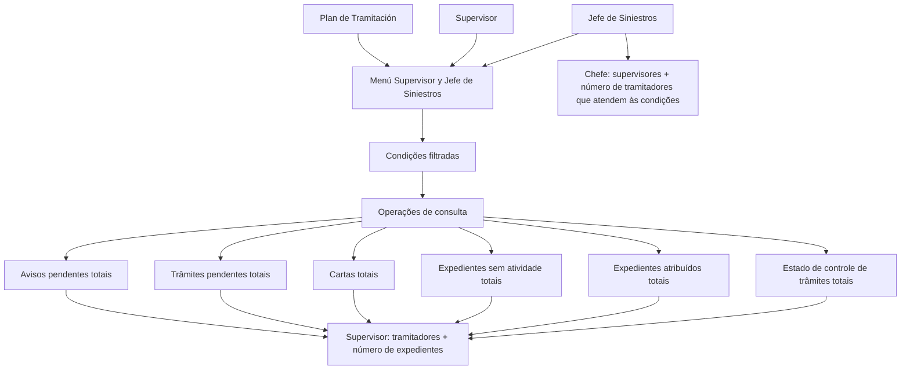

# Certificación de Siniestros — Menú del Supervisor de Auditoría

## 1. Metadados do Documento
- **Arquivo de Origem:** Não identificado
- **Tipo de Documento:** Manual Operacional
- **Domínio / Sistema:** Certificación de Siniestros; auditoria e gestão de sinistros
- **Público-Alvo:** Supervisores, chefes de sinistros, tramitadores e auditoria
- **Data/Versão Identificada:** Não identificada

---

## 2. Resumo Executivo & Contexto de Negócio

O documento descreve os menus de Supervisor e Jefe de Siniestros da funcionalidade **Certificación de Siniestros — Menú del Supervisor Auditoría**. A ferramenta organiza o trabalho de gestão e auditoria dos supervisores com base no **Plan de Tramitación**.

O objetivo principal é controlar a gestão dos tramitadores. Para responsáveis ou chefes de sinistros, a ferramenta também suporta a gestão dos supervisores sob sua responsabilidade.

No contexto do supervisor, as consultas exibem os tramitadores associados e a quantidade de expedientes que atendem às condições selecionadas. No contexto do chefe de sinistros, a visualização apresenta os supervisores e a quantidade de tramitadores do supervisor que atendem às condições.

As operações descritas cobrem avisos pendentes, trâmites pendentes, cartas geradas, expedientes sem atividade, expedientes atribuídos por estado e estado de controle de trâmites. O documento não detalha telas, URLs, métodos HTTP, regras de autenticação, contratos de integração ou critérios completos dos filtros.

---

## 3. Arquitetura, Componentes & Tecnologias Envolvidas

### Componentes e papéis identificados

| Componente / Papel | Função descrita |
| :--- | :--- |
| Certificación de Siniestros | Contexto funcional do menu de auditoria e gestão de sinistros. |
| Menú del Supervisor Auditoría | Ferramenta de consulta para organização do trabalho de gestão e auditoria. |
| Plan de Tramitación | Base indicada para a organização do trabalho na ferramenta. |
| Supervisor | Consulta tramitadores e o número de expedientes que atendem às condições filtradas. |
| Jefe de Siniestros | Consulta supervisores e o número de tramitadores de cada supervisor que atendem às condições. |
| Tramitador | Entidade cujos expedientes, trâmites, cartas, atividades, estados e controles são consultados. |
| Expediente | Unidade consultada nas operações de gestão de sinistros. |
| RS | Sigla exibida na navegação; não há detalhamento no texto. |
| Zeus | Nome exibido na navegação; não há detalhamento funcional no texto. |
| Soluciones APIs / Documentación | Itens exibidos na navegação; não há detalhamento no texto. |



> **Nota de Análise:** O documento descreve a relação funcional entre perfis, filtros e consultas, mas não apresenta uma arquitetura técnica de software, integrações, bancos de dados, microsserviços ou tecnologias de implementação.

---

## 4. Regras de Negócio, Especificações Funcionais & Processos

### Regra geral de organização e controle

1. A ferramenta organiza o trabalho de gestão e auditoria dos supervisores.
2. A organização é baseada no **Plan de Tramitación**.
3. O principal objetivo declarado é o controle da gestão dos tramitadores.
4. Para responsáveis ou chefes de sinistros, a ferramenta permite a gestão de seus supervisores.
5. Para o perfil de supervisor, o resultado apresenta:
   - Os tramitadores do supervisor.
   - O número de expedientes que cumprem as condições aplicáveis.
6. Para o perfil de chefe de sinistros, o resultado apresenta:
   - Os supervisores.
   - O número de tramitadores do supervisor que cumprem as condições.

### Operações de consulta

#### CONSULTAR avisos pendientes totales
- Exibe os tramitadores do supervisor.
- Exibe o número de expedientes que possuem aviso pendente.
- Aplica as condições filtradas pelo supervisor.

#### CONSULTAR tramites pendientes totales
- Exibe os tramitadores do supervisor.
- Exibe o número de expedientes que possuem o trâmite indicado pendente.
- Aplica as condições filtradas pelo tramitador.

#### CONSULTAR cartas totales
- Exibe os tramitadores do supervisor.
- Exibe o número de expedientes para os quais foi gerada a carta indicada.
- Aplica as condições filtradas pelo tramitador.

#### CONSULTAR expedientes sin actividad totales
- Exibe os tramitadores do supervisor.
- Exibe o número de expedientes nos quais não foi realizada nenhuma operação.
- Aplica as condições filtradas pelo tramitador.

#### CONSULTAR expedientes asignados totales
- Exibe os tramitadores do supervisor.
- Exibe o número de expedientes que o tramitador possui no estado informado.
- Os exemplos de estado citados são: `pendiente`, `en juicio` e `retenido por c.t...`.
- Aplica as condições filtradas pelo tramitador.

#### CONSULTAR estado control tramites totales
- Exibe os tramitadores do supervisor.
- Exibe o número de expedientes que possuem uma data de controle definida.
- A data de controle é definida como o tempo máximo para a realização.
- A consulta considera o estado indicado pelo tramitador.
- Aplica as condições filtradas pelo tramitador.

> **Nota de Análise:** O documento não especifica os campos disponíveis para filtragem, os valores permitidos, o significado completo de `c.t...`, a definição de “nenhuma operação”, nem o comportamento de consulta quando nenhum resultado atende às condições.

---

## 5. Tabelas de Parâmetros, Ambientes e Estruturas de Dados

| Item / Parâmetro | Descrição / Função | Tipo / Valores / Formato | Ambiente / Observações |
| :--- | :--- | :--- | :--- |
| Plan de Tramitación | Base para organizar o trabalho de gestão e auditoria. | Referência funcional | Sem detalhamento adicional. |
| Perfil Supervisor | Consulta tramitadores e número de expedientes que atendem às condições. | Papel funcional | Associado aos tramitadores do supervisor. |
| Perfil Jefe de Siniestros | Consulta supervisores e número de tramitadores que atendem às condições. | Papel funcional | Associado à gestão dos supervisores. |
| Condições filtradas pelo supervisor | Critério aplicado na consulta de avisos pendentes totais. | Filtros não especificados | O documento não lista campos ou valores. |
| Condições filtradas pelo tramitador | Critério aplicado nas consultas de trâmites, cartas, expedientes sem atividade, expedientes atribuídos e controle de trâmites. | Filtros não especificados | O documento não lista campos ou valores. |
| Aviso pendente | Condição para contagem de expedientes na operação de avisos pendentes. | Estado/condição | Sem detalhamento de regras. |
| Trâmite indicado pendente | Condição para contagem na operação de trâmites pendentes. | Trâmite não especificado | O trâmite deve ser indicado. |
| Carta indicada | Carta cuja geração determina a contagem na operação de cartas totais. | Carta não especificada | O documento não informa tipos de carta. |
| Sem atividade | Expediente no qual não foi realizada nenhuma operação. | Condição de atividade | Período e operações consideradas não são definidos. |
| Estado de expediente | Critério da consulta de expedientes atribuídos. | `pendiente`, `en juicio`, `retenido por c.t...` | Lista apresentada como exemplos. |
| Data de controle | Data definida para controle de trâmites. | Data; tempo máximo para realização | Formato da data não informado. |
| Estado de controle | Estado indicado pelo tramitador para a consulta de controle de trâmites. | Estado não especificado | Sem catálogo de valores. |
| RS | Elemento exibido na navegação. | Sigla não definida | Sem detalhamento adicional. |
| Zeus | Elemento exibido na navegação. | Nome não definido | Sem detalhamento adicional. |
| Idioma ES | Indicador de idioma exibido na navegação. | `ES` | O texto do documento está em espanhol. |

---

## 6. Bateria de Perguntas & Respostas para RAG (FAQ Sintético)

### P1: Qual é o objetivo principal do Menú del Supervisor Auditoría?
**R:** O objetivo principal é controlar a gestão dos tramitadores. A ferramenta também organiza o trabalho de gestão e auditoria dos supervisores com base no Plan de Tramitación.

### P2: Qual informação um supervisor visualiza nas consultas do menu?
**R:** O supervisor visualiza os tramitadores sob sua responsabilidade e o número de expedientes que cumprem as condições aplicáveis à consulta selecionada.

### P3: Qual informação um Jefe de Siniestros visualiza no menu?
**R:** O Jefe de Siniestros visualiza os supervisores e o número de tramitadores de cada supervisor que cumprem as condições. O documento relaciona esse perfil à gestão dos supervisores.

### P4: O que retorna a operação CONSULTAR avisos pendientes totales?
**R:** A operação mostra os tramitadores do supervisor e o número de expedientes que possuem aviso pendente, considerando as condições filtradas pelo supervisor.

### P5: Como funciona a consulta de trâmites pendentes totais?
**R:** A operação mostra os tramitadores do supervisor e o número de expedientes que possuem o trâmite indicado pendente, considerando as condições filtradas pelo tramitador.

### P6: O que é contabilizado em CONSULTAR cartas totales?
**R:** São contabilizados os expedientes para os quais foi gerada a carta indicada. O resultado mostra os tramitadores do supervisor e o número de expedientes correspondente, com as condições filtradas pelo tramitador.

### P7: Como o sistema identifica expedientes sem atividade?
**R:** A consulta CONSULTAR expedientes sin actividad totales mostra os tramitadores do supervisor e o número de expedientes nos quais não foi realizada nenhuma operação, usando as condições filtradas pelo tramitador.

### P8: Quais estados são citados para a consulta de expedientes atribuídos?
**R:** O documento cita os estados `pendiente`, `en juicio` e `retenido por c.t...` como exemplos de estados que podem ser usados na consulta CONSULTAR expedientes asignados totales.

### P9: O que significa a data de controle na consulta de estado de controle de trâmites?
**R:** A data de controle é descrita como o tempo máximo para a realização. A operação contabiliza expedientes que possuem uma data de controle definida no estado indicado pelo tramitador.

### P10: O documento especifica quais filtros estão disponíveis para as consultas?
**R:** Não. O documento menciona condições filtradas pelo supervisor ou pelo tramitador, mas não detalha os campos, valores, operadores ou regras de combinação desses filtros.

---

## 7. Glossário de Termos, Siglas & Conceitos-Chave

- **Certificación de Siniestros:** Contexto funcional do documento relacionado a sinistros.
- **Siniestro:** Termo utilizado no documento para o domínio de sinistros.
- **Plan de Tramitación:** Base indicada para organizar o trabalho de gestão e auditoria.
- **Supervisor:** Perfil que visualiza tramitadores e números de expedientes que atendem às condições.
- **Jefe de Siniestros:** Perfil responsável ou chefe de sinistros que gerencia supervisores.
- **Tramitador:** Entidade associada à gestão de expedientes, trâmites, cartas, estados e controles.
- **Expediente:** Registro ou caso contabilizado nas operações de consulta.
- **Aviso pendiente:** Condição de expediente com aviso pendente.
- **Trámite pendiente:** Trâmite indicado que permanece pendente em um expediente.
- **Carta:** Documento indicado cuja geração em um expediente é considerada na consulta de cartas totais.
- **Fecha de control:** Data de controle definida como tempo máximo para realização.
- **RS:** Sigla exibida na navegação; significado não definido no documento.
- **Zeus:** Nome exibido na navegação; função não definida no documento.
- **ES:** Indicador de idioma exibido na navegação; significado expandido não fornecido.

---

## 8. Notas Críticas, Riscos & Limitações

- O documento não apresenta data, versão, autor, responsável, sistema técnico de origem ou nome do arquivo.
- Não há detalhamento de arquitetura de software, APIs, integrações, infraestrutura, ambientes, servidores, URLs ou logs.
- Não são especificados os campos, valores e regras de aplicação das condições filtradas.
- O texto diferencia filtros aplicados pelo supervisor na consulta de avisos pendentes e filtros aplicados pelo tramitador nas demais consultas; não há explicação adicional sobre essa diferença.
- O documento cita `retenido por c.t...` de forma truncada, sem expandir a sigla ou definir o estado completo.
- Não há definição formal dos conceitos de aviso pendente, trâmite indicado, carta indicada ou ausência de atividade.
- O documento não especifica critérios temporais para “expedientes sem atividade”.
- Não há detalhamento sobre permissões, segregação de acesso, auditoria, tratamento de erros ou exportação de resultados.

---

## 9. Conteúdo Bruto Estruturado (Referência Fiel)

```text
--- [PÁGINA 1 DE 2] ---

CERTIFICACIÓN de SINIESTROS - MENÚ DEL
SUPERVISOR AUDITORIA
MENÚ SUPERVISOR Y JEFE DE SINIESTROS
Herramienta para organizar el trabajo de gestión y auditoria de los supervisores, basado en el
"Plan de Tramitación", cuyo principal objetivo es el Control de la gestión de sus tramitadores y
en el caso de los responsables o jefes de siniestros la gestión de sus supervisores. A
continuación se detallan las distintas operaciones de ambos menús.
En el caso del supervisor lo que muestra son los tramitadores y el número de expedientes que
cumplen las condiciones, en el caso del jefe del siniestros, muestra los supervisores, y el número
de tramitadores del supervisor que cumplen con las condiciones.
CONSULTAR avisos pendientes totales
Muestra los tramitadores del supervisor y el
número de expedientes que tengan aviso
pendiente, con las condiciones que haya
filtrado el supervisor
CONSULTAR tramites pendientes totales
Muestra los tramitadores del supervisor y el
número expedientes que tengan el trámite
indicado pendiente con las condiciones que
haya filtrado el tramitador
 / 
 RS
Inicio Soluciones APIs Documentación Zeus
ES

--- [PÁGINA 2 DE 2] ---

CONSULTAR cartas totales
Muestra los tramitadores del supervisor y el
número expedientes a los que se les haya
generado la carta indicada, con las
condiciones que haya filtrado el tramitador
CONSULTAR expedientes sin actividad
totales
Muestra los tramitadores del supervisor y el
número expedientes que no se haya realizado
ninguna operación con ellos, con las
condiciones que haya filtrado el tramitador
CONSULTAR expedientes asignados
totales
Muestra los tramitadores del supervisor y el
número expedientes que tenga el tramitador
con el estado (pendiente, en juicio, retenido
por c.t...) y las condiciones que haya filtrado el
tramitador
CONSULTAR estado control tramites
totales
Muestra los tramitadores del supervisor y el
número expedientes que tengan definido
fecha de control (tiempo máximo para
realizarse) en el estado que indique el
tramitador y las condiciones que haya filtrado
el tramitador
```
