# Certificación de Siniestros — Peritaciones: Definições e Operações

## 1. Metadados do Documento
- **Arquivo de Origem:** Não identificado no conteúdo fornecido
- **Tipo de Documento:** Apresentação Executiva
- **Domínio / Sistema:** Certificação de Sinistros — Peritaciones
- **Público-Alvo:** Negócio, operação, analistas funcionais e equipes responsáveis pela configuração de peritagens
- **Data/Versão Identificada:** Não identificada

---

## 2. Resumo Executivo & Contexto de Negócio

O documento descreve definições e operações do domínio de **peritaciones** no contexto de certificação de sinistros. O conteúdo estrutura os elementos necessários para configurar e executar processos de perícia ou investigação associados a expedientes, propriedades, danos e ordens de reparação.

As definições são organizadas em níveis funcionais: **Común**, para cadastros reutilizáveis e não exclusivos do módulo de sinistros; **General**, para definições aplicáveis a todos os expedientes que podem receber uma peritagem; **Ramo**, para definições exclusivas da linha de negócio configurada; e **Peritación**, para informações aplicáveis às peritagens em geral.

O processo cobre a solicitação de uma perícia, o registro e a alteração de resultados, o cadastro de danos em propriedades como veículos ou imóveis e a geração, modificação ou anulação de ordens de reparação. As operações podem ser realizadas tanto **em linha** quanto **em diferido**.

O documento também prevê mecanismos de controle operacional, como validações de informação de core, configuração de resultados de visita que podem ou não disparar o resultado de uma perícia, definição de atividades habilitadas e composição de detalhes econômicos relacionados a uma ordem de reparação.

---

## 3. Arquitetura, Componentes & Tecnologias Envolvidas

O conteúdo não descreve arquitetura tecnológica, microsserviços, protocolos, bancos de dados, URLs, ambientes, APIs ou ferramentas de desenvolvimento. A arquitetura identificável é exclusivamente funcional, baseada em níveis de configuração e operações de peritagem.

### Componentes funcionais identificados

- **Común:** Perito, Taller e Centro de Peritación.
- **General:** Causa Proceso, Lugares Peritación, Actividad Peritar, Cuadro Honorarios, Resultado Visitas e Peritos por Centro.
- **Ramo:** Tipo Expediente, Causa Proceso e Características Peritación.
- **Peritación:** Atributo, Estructura, Información Inicial, Validaciones Información, Detalle Económico Peritación, Partes, Daños e Reparación.
- **Operaciones Peritaciones:** criação, modificação, consulta e anulação de solicitações, resultados, danos e ordens de reparação.

```mermaid
graph TD
  A[Certificación de Siniestros<br/>Peritaciones] --> B[Definiciones Peritaciones]
  A --> C[Operaciones Peritaciones]

  B --> B1[Común]
  B --> B2[General]
  B --> B3[Ramo]
  B --> B4[Peritación]

  B1 --> B11[Perito]
  B1 --> B12[Taller]
  B1 --> B13[Centro de Peritación]

  B2 --> B21[Causa Proceso]
  B2 --> B22[Lugares Peritación]
  B2 --> B23[Actividad Peritar]
  B2 --> B24[Cuadro Honorarios]
  B2 --> B25[Resultado Visitas]
  B2 --> B26[Peritos por Centro]

  B3 --> B31[Tipo Expediente]
  B3 --> B32[Causa Proceso]
  B3 --> B33[Características Peritación]

  B4 --> B41[Atributo]
  B4 --> B42[Estructura]
  B4 --> B43[Información Inicial]
  B4 --> B44[Validaciones Información]
  B4 --> B45[Detalle Económico Peritación]
  B4 --> B46[Partes]
  B4 --> B47[Daños]
  B4 --> B48[Reparación]

  C --> C1[Crear solicitud peritación]
  C --> C2[Modificar solicitud]
  C --> C3[Crear resultado]
  C --> C4[Modificar resultado]
  C --> C5[Crear daño peritación]
  C --> C6[Modificar daño peritación]
  C --> C7[Crear orden reparación]
  C --> C8[Modificar orden reparación]
  C --> C9[Anular orden reparación]
  C --> C10[Consultar peritación]

  C1 --> C3
  C3 --> C5
  C5 --> C7
```



> **Nota de Análise:** O diagrama representa relações funcionais explícitas ou diretamente inferíveis da sequência de operações apresentada. O documento não especifica integrações técnicas, dependências sistêmicas ou contratos de dados entre os componentes.

---

## 4. Regras de Negócio, Especificações Funcionais & Processos

### 4.1 Definições no nível Común

O nível **Común** contém definições que não são exclusivas do módulo de sinistros, mas são necessárias para definir peritagens.

- **Perito:** permite registrar todos os peritos da companhia.
- **Taller:** permite registrar todos os talleres da companhia.
- **Centro de Peritación:** permite registrar diferentes centros de peritagem para associar peritos posteriormente.

### 4.2 Definições no nível General

O nível **General** reúne definições que afetam todos os possíveis expedientes aos quais pode ser realizada uma peritagem.

- **Causa Proceso:** cataloga os motivos pelos quais se deseja realizar uma peritagem.
- **Lugares Peritación:** define os locais de trabalho de peritos e inspetores onde poderão realizar peritagens. Os exemplos apresentados são taller, domicílio do segurado e empresa do segurado.
- **Actividad Peritar:** define quais atividades estão capacitadas para realizar peritagens, incluindo peritos, inspetores e tramitadores.
- **Cuadro Honorarios:** define diferentes honorários para peritos, inspetores externos e outros participantes, conforme os distintos locais de trabalho dos peritos.
- **Resultado Visitas:** define resultados possíveis de visitas e determina se cada resultado pode ou não disparar o resultado da peritagem. Uma visita falida não dispara o resultado da peritagem, pois será necessário realizar a visita novamente.
- **Peritos por Centro:** associa peritos aos diferentes centros de peritagem.

### 4.3 Definições exclusivas do Ramo

As definições do nível **Ramo** são exclusivas da linha de negócio configurada.

- **Tipo Expediente:** define os tipos de dano aos quais poderá ser realizada uma peritagem e se a peritagem é obrigatória ou não.
- **Causa Proceso:** cataloga os motivos pelos quais se deseja realizar uma operação. O documento apresenta como exemplos: causa da peritagem, subscrição e avaliação de danos para reparação.
- **Características Peritación:** define a propriedade que será peritada por tipo de dano.

### 4.4 Definições aplicáveis a todas as Peritaciones

- **Atributo:** define informação adicional da peritagem.
- **Estructura:** representa informação adicional da peritagem.
- **Información Inicial:** registra informação prévia para atributos das operações de peritagem, evitando que essa informação precise ser inserida posteriormente. O exemplo apresentado indica atribuir, por padrão, a atividade de realização da peritagem a um perito.
- **Validaciones Información:** define comportamentos e validações das informações de core solicitadas nas operações de peritagem.
- **Detalle Económico Peritación:** determina o conceito de detalhe da peritagem para realizar uma ordem de reparação. Os exemplos apresentados são reparação, chapa, pintura e mão de obra.
- **Partes:** define partes de uma propriedade. Para veículos, os exemplos incluem parte dianteira e parte lateral direita.
- **Daños:** define danos por propriedade.
- **Reparación:** codifica reparações possíveis para uma propriedade, como substituir ou reparar.

### 4.5 Operações de Peritaciones

As operações de peritagem de um expediente podem ser realizadas em linha ou em diferido.

1. **Crear solicitud peritación:** registra a solicitação para realização de uma peritagem ou investigação.
2. **Modificar solicitud:** altera informações da solicitação de peritagem.
3. **Crear resultado:** gera os dados do resultado da peritagem realizada por um profissional.
4. **Modificar resultado:** altera informações do resultado da peritagem.
5. **Crear daño peritación:** registra danos ocasionados em veículo, imóvel ou outra propriedade.
6. **Modificar daño peritación:** altera danos ocasionados em veículo, imóvel ou outra propriedade.
7. **Crear orden reparación:** gera uma ordem para pagamento a um profissional que tenha participado da peritagem.
8. **Modificar orden reparación:** altera dados e importes de uma ordem.
9. **Anular orden reparación:** cancela uma ordem de reparação.
10. **Consultar peritación:** visualiza todas as informações de uma peritagem.

---

## 5. Tabelas de Parâmetros, Ambientes e Estruturas de Dados

| Item / Parâmetro | Descrição / Função | Tipo / Valores / Formato | Ambiente / Observações |
| :--- | :--- | :--- | :--- |
| Perito | Registrar todos os peritos da companhia | Cadastro funcional | Nível Común |
| Taller | Registrar todos os talleres da companhia | Cadastro funcional | Nível Común |
| Centro de Peritación | Registrar centros de peritagem para associar peritos posteriormente | Cadastro funcional | Nível Común |
| Causa Proceso | Catalogar motivos para realizar uma peritagem | Catálogo de causas | Nível General |
| Lugares Peritación | Definir locais de trabalho para realização de peritagens | Exemplos: taller, domicílio do segurado, empresa do segurado | Nível General |
| Actividad Peritar | Definir atividades capacitadas para realizar peritagens | Exemplos: peritos, inspetores, tramitadores | Nível General |
| Cuadro Honorarios | Definir honorários conforme participante e local de trabalho | Peritos, inspetores externos e outros | Nível General |
| Resultado Visitas | Definir resultados de visita e seu efeito sobre o resultado da peritagem | Visita falida não dispara resultado da peritagem | Nível General |
| Peritos por Centro | Associar peritos a centros de peritagem | Associação entre entidades | Nível General |
| Tipo Expediente | Definir tipos de dano elegíveis para peritagem e obrigatoriedade | Tipo de dano; obrigatória ou não | Nível Ramo |
| Causa Proceso | Catalogar motivos para realizar uma operação | Exemplos: peritagem, subscrição, avaliação de danos para reparação | Nível Ramo |
| Características Peritación | Definir propriedade a ser peritada por tipo de dano | Configuração funcional | Nível Ramo |
| Atributo | Definir informação adicional de peritagem | Atributo | Nível Peritación |
| Estructura | Representar informação adicional de peritagem | Estrutura | Nível Peritación |
| Información Inicial | Registrar informação prévia para atributos de operações | Exemplo: atividade padrão atribuída a perito | Nível Peritación |
| Validaciones Información | Definir comportamentos e validações para dados de core | Regras de validação | Nível Peritación |
| Detalle Económico Peritación | Determinar conceitos para composição de ordem de reparação | Exemplos: reparação, chapa, pintura, mão de obra | Nível Peritación |
| Partes | Definir partes da propriedade | Exemplos de veículo: dianteira, lateral direita | Nível Peritación |
| Daños | Definir danos por propriedade | Cadastro de danos | Nível Peritación |
| Reparación | Codificar reparações possíveis para propriedade | Exemplos: substituir, reparar | Nível Peritación |
| Modalidade operacional | Executar operações de peritagem | Em linha ou em diferido | Operaciones Peritaciones |
| Crear solicitud peritación | Registrar solicitação de peritagem ou investigação | Operação de criação | Operaciones Peritaciones |
| Modificar solicitud | Alterar informação da solicitação | Operação de modificação | Operaciones Peritaciones |
| Crear resultado | Gerar dados do resultado da peritagem por profissional | Operação de criação | Operaciones Peritaciones |
| Modificar resultado | Alterar informação do resultado de peritagem | Operação de modificação | Operaciones Peritaciones |
| Crear daño peritación | Registrar danos em veículo, imóvel ou outra propriedade | Operação de criação | Operaciones Peritaciones |
| Modificar daño peritación | Alterar danos registrados | Operação de modificação | Operaciones Peritaciones |
| Crear orden reparación | Gerar ordem para pagamento a profissional participante | Operação de criação | Operaciones Peritaciones |
| Modificar orden reparación | Alterar dados ou importes de uma ordem | Operação de modificação | Operaciones Peritaciones |
| Anular orden reparación | Cancelar ordem de reparação | Operação de anulação | Operaciones Peritaciones |
| Consultar peritación | Visualizar todas as informações de uma peritagem | Operação de consulta | Operaciones Peritaciones |

---

## 6. Bateria de Perguntas & Respostas para RAG (FAQ Sintético)

### P1: Qual é a finalidade do nível Común nas definições de peritaciones?
**R:** O nível Común contém definições que não são exclusivas do módulo de sinistros, mas são necessárias para configurar peritagens. O documento inclui os cadastros de Perito, Taller e Centro de Peritación nesse nível.

### P2: Como são associados os peritos aos centros de peritagem?
**R:** A associação é realizada pela definição **Peritos por Centro**, localizada no nível General. O Centro de Peritación é previamente registrado para que os peritos possam ser associados posteriormente.

### P3: O que acontece quando uma visita de peritagem possui resultado falido?
**R:** Segundo a definição de Resultado Visitas, uma visita falida não dispara o resultado da peritagem. Nesse caso, é necessário realizar a visita novamente.

### P4: Onde são definidos os locais em que peritos e inspetores podem trabalhar?
**R:** Os locais são definidos em **Lugares Peritación**, no nível General. O documento cita como exemplos um taller, o domicílio do segurado e a empresa do segurado.

### P5: Como o sistema define se uma peritagem é obrigatória?
**R:** A obrigatoriedade é configurada em **Tipo Expediente**, no nível Ramo. Essa definição determina os tipos de dano para os quais pode ser realizada uma peritagem e se a peritagem será obrigatória ou não.

### P6: Qual definição controla os honorários de peritos e inspetores externos?
**R:** A definição **Cuadro Honorarios**, no nível General, permite configurar diferentes honorários para peritos, inspetores externos e outros participantes, conforme os locais de trabalho dos peritos.

### P7: Quais informações podem compor o detalhe econômico de uma peritagem?
**R:** O componente **Detalle Económico Peritación** determina os conceitos de detalhe usados para realizar uma ordem de reparação. Os exemplos fornecidos são reparação, chapa, pintura e mão de obra.

### P8: Como são tratadas as informações adicionais de uma peritagem?
**R:** A informação adicional é tratada pelos componentes **Atributo** e **Estructura**. O documento informa que ambos pertencem ao nível Peritación, sem detalhar campos, formatos ou estruturas específicas.

### P9: Para que serve Información Inicial nas operações de peritagem?
**R:** Información Inicial registra previamente informações para atributos das operações de peritagem, evitando a necessidade de inseri-las posteriormente. O exemplo do documento é atribuir por padrão a atividade de realização da peritagem a um perito.

### P10: Quais operações podem ser realizadas sobre uma solicitação de peritagem?
**R:** É possível criar uma solicitação de peritagem ou investigação por meio de **Crear solicitud peritación** e alterar suas informações por meio de **Modificar solicitud**.

### P11: Como são registrados e modificados os danos de uma propriedade?
**R:** A operação **Crear daño peritación** registra danos ocasionados em veículos, imóveis ou outras propriedades. A operação **Modificar daño peritación** permite alterar os danos anteriormente registrados.

### P12: Quais ações estão disponíveis para uma ordem de reparação?
**R:** É possível criar uma ordem para pagamento a um profissional participante da peritagem, modificar dados e importes da ordem e anular a ordem de reparação. As operações correspondentes são Crear orden reparación, Modificar orden reparación e Anular orden reparación.

### P13: As operações de peritagem são executadas somente em tempo real?
**R:** Não. O documento afirma que as operações de peritagem de um expediente podem ser realizadas tanto em linha quanto em diferido.

---

## 7. Glossário de Termos, Siglas & Conceitos-Chave

- **Certificación de Siniestros:** contexto funcional no qual o documento apresenta as definições e operações de peritaciones.
- **Peritación / Peritaciones:** processo de perícia ou investigação associado a um expediente.
- **Perito:** profissional registrado pela companhia para atuação em peritagens.
- **Taller:** entidade cadastrada no nível Común; o documento não fornece definição adicional.
- **Centro de Peritación:** centro de peritagem utilizado para posterior associação de peritos.
- **Expediente:** caso ao qual pode ser realizada uma peritagem.
- **Ramo:** linha de negócio cujas definições são exclusivas da configuração correspondente.
- **Causa Proceso:** catálogo de motivos para realizar uma peritagem ou operação, conforme o nível em que é configurado.
- **Actividad Peritar:** atividade habilitada para realizar peritagens.
- **Resultado Visitas:** resultado de uma visita que pode ou não disparar o resultado da peritagem.
- **Atributo:** informação adicional de uma peritagem.
- **Estructura:** informação adicional de uma peritagem.
- **Core:** informação de core solicitada nas operações de peritagem; o documento não expande o significado do termo.
- **Detalle Económico Peritación:** conceito econômico da peritagem utilizado para realizar uma ordem de reparação.
- **Orden reparación:** ordem gerada para pagamento a profissional que participou da peritagem.
- **Daños:** danos definidos ou registrados por propriedade.
- **Reparación:** codificação de possíveis reparações de uma propriedade.

---

## 8. Notas Críticas, Riscos & Limitações

- O documento não identifica nome do arquivo, autor, data, versão ou histórico de alterações.
- O documento não apresenta arquitetura técnica, integrações, tecnologias, APIs, protocolos, ambientes, URLs, credenciais, logs ou mecanismos de segurança.
- O documento não detalha contratos de dados, campos obrigatórios, formatos de atributos, regras de cálculo de honorários ou estrutura de importes das ordens de reparação.
- O termo **core** é citado em Validaciones Información, mas não é definido.
- A relação sequencial entre operações é parcialmente inferível pelo domínio, mas o documento não determina uma máquina de estados formal nem pré-condições técnicas entre criação, modificação, consulta e anulação.
- **Nota de Análise:** O documento lista Atributo e Estructura como informação adicional da peritagem, porém não detalha campos, modelos de dados ou regras de preenchimento.
- **Nota de Análise:** O documento menciona execução em linha e em diferido, porém não descreve critérios de seleção, processamento assíncrono, filas ou tempos operacionais.

---

## 9. Conteúdo Bruto Estruturado (Referência Fiel)

```text
--- [PÁGINA 1 DE 5] ---

CERTIFICACIÓN de SINIESTROS -
PERITACIONES
Definiciones Peritaciones
Operaciones Peritaciones
DEFINICIONES
COMÚN
En este nivel se encuentran definiciones que NO son exclusivas del
módulo de siniestros, pero son necesarias para poder realizar la
definición de peritaciones. En otros se encuentran:
PERITO
Registrar todos los peritos de la compañía
TALLER
Registrar todos los talleres de la compañía
 /
 RS
Inicio Soluciones APIs Documentación Zeus
ES


--- [PÁGINA 2 DE 5] ---

CENTRO DE PERITACIÓN
Registrar los diferentes Centros de Peritación,
para posteriormente asociar peritos
GENERAL
En este Nivel se encuentran definiciones que afectarán a todos los
posibles expedientes a los que se les pueda realizar una peritación.
Entre otros se define:
CAUSA PROCESO
Permite catalogar los motivos por los que se
quiere realizar una peritación
LUGARES PERITACIÓN
Permite definir los lugares de trabajo de los
peritos, inspectores, es decir dónde va a
poder realizar las peritaciones. Por ejemplo
en un taller, en el hogar del asegurado, en la
empresa del asegurado, etc
ACTIVIDAD PERITAR
Definir que actividad está capacitada para
realizar peritaciones, peritos, inspectores,
tramitadores..
CUADRO HONORARIOS
Permite definir para peritos, inspectores
externos etc, diferentes honorarios según los
distintos lugares de trabajo de los peritos
RESULTADO VISITAS
Permite definir diferentes resultados de las
visitas pudiendo desencadenar o no el
resultado de la peritación. Por ejemplo si la
visita es fallida no se disparará el resultado de
la peritación, ya que habrá que volver a
realizar la visita
PERITOS POR CENTRO
Permite asociar los peritos a los distintos
centros de periración
RAMO


--- [PÁGINA 3 DE 5] ---

Son exclusivas del ramo que se está definiendo
TIPO EXPEDIENTE
Permite definir los Tipos de Daño a los que se
les va a poder realizar una peritación y si esta
es obligatoria o no
CAUSA PROCESO
Permite catalogar los motivos por los que se
quiere realizar una operación. Ejemplo causa
de la peritación, para suscripción, evaluación
de daños para reparación
CARACTERÍSTICAS PERITACIÓN
Definición de la propiedad que se va a peritar
por tipo de daño
PERITACIÓN
Afecta a todas las peritaciones
ATRIBUTO
Permite definir la información adicional de la
peritación
ESTRUCTURA
Información adicional de la peritación
INFORMACIÓN INICIAL
Registrar información previa para los atributos
de las operaciones de peritaciones, para no
tener que introducirla posteriormente. Un
ejemplo sería dar a la actividad para realizar
la peritación por defecto perito
VALIDACIONES INFORMACIÓN
Definir comportamientos y validaciones de la
información de core, que se piden en las
operaciones de peritación.
DETALLE ECONÓMICO PERITACIÓN
Determina el concepto de detalle de la
peritación para realizar una orden de
PARTES
Partes de una propiedad Si es un vehículo,
parte delantera, parte lateral derecha...


--- [PÁGINA 4 DE 5] ---

reparación. Ejemplo Reparación, chapa,
pintura, mano de obra...
DAÑOS
Definición de Daños por propiedad
REPARACIÓN
Codificación de las posibles reparaciones de
una propiedad, sustituir, reparar
OPERACIONES
PERITACIONES
Operaciones de peritación de un expediente, se pueden realizar tanto en
línea como diferido
CREAR solicitud peritación
En esta operación se registra la solicitud para
que se realice una peritación / investigación
MODIFICAR solicitud
Permite cambiar información de la solicitud de
peritación
CREAR resultado
En esta operación se generan los datos del
resultado de la peritación realizada por un
profesional
MODIFICAR resultado
Permite cambiar la información del resultado
de la peritación
CREAR daño peritación
Permite registrar los daños ocasionados del
vehículo, del inmueble...
MODIFICAR daño peritación
Permite modificar los daños ocasionados del
vehículo, del inmueble...
CREAR orden reparación
Permite generar una orden para poder pagar
a un profesional que haya intervenido en la
peritación
MODIFICAR orden reparación
Permite modificar una orden tanto los datos,
como los importes de la misma


--- [PÁGINA 5 DE 5] ---

ANULAR orden reparación
Permite cancelar una orden de reparación
CONSULTAR peritación
Visualiza toda la información de una
peritación.
```
