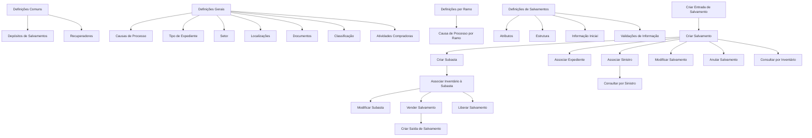

# Certificação de Sinistros — Salvamentos: Definições e Operações do Módulo

## 1. Metadados do Documento
- **Arquivo de Origem:** Não informado
- **Tipo de Documento:** Apresentação Executiva / Guia Funcional
- **Domínio / Sistema:** Certificação de Sinistros — Salvamentos
- **Público-Alvo:** Negócio, analistas funcionais, operação e equipes de sinistros
- **Data/Versão Identificada:** Não identificada

---

## 2. Resumo Executivo & Contexto de Negócio

O documento descreve as definições de configuração e as operações funcionais do módulo de **Salvamentos** no contexto de certificação de sinistros. O módulo trata bens recuperados, incluindo veículos ou propriedades de segurados que foram roubados, desde o registro de entrada até a venda, saída ou anulação do salvamento.

A configuração do módulo está organizada em níveis: **Comum**, **Geral**, **Setor**, **Ramo** e definições específicas de **Salvamentos**. O nível Comum contém definições não exclusivas de sinistros, mas necessárias ao funcionamento do processo, como depósitos de salvamentos e recuperadores.

O nível Geral reúne definições aplicáveis a todos os expedientes de salvamentos, incluindo causas de processo, tipos de expediente, localizações, documentos, classificações e atividades compradoras. Para que um expediente seja tratado pelo módulo de Salvamentos, o documento estabelece que o expediente deve possuir o tipo de expediente de **recobro de salvamento**.

O processo operacional inclui registrar a entrada e as características do salvamento, associar sinistros e expedientes, organizar subastas, vincular inventário, registrar vendas, liberar bens não vendidos para outra subasta, anular registros e registrar a saída após a venda. O material não detalha interfaces, contratos técnicos, métodos HTTP, integrações, persistência de dados ou regras de cálculo financeiro.

---

## 3. Arquitetura, Componentes & Tecnologias Envolvidas

O documento não apresenta arquitetura de software, tecnologias, microsserviços, URLs, servidores, APIs, bancos de dados ou ambientes técnicos. O conteúdo descreve uma arquitetura funcional de configurações e operações do módulo de Salvamentos.

### Componentes funcionais identificados

| Componente / Área | Função descrita |
| :--- | :--- |
| Certificação de Sinistros | Contexto funcional no qual o módulo de Salvamentos está inserido. |
| Módulo de Salvamentos | Gerencia definições e operações relacionadas a bens recuperados e sua venda. |
| Definições Comuns | Configurações não exclusivas de sinistros, necessárias para a definição do módulo. |
| Depósitos de Salvamentos | Lugares definidos em terceiros onde os salvados podem ser depositados. |
| Recuperadores | Pessoas responsáveis por buscar veículos ou propriedades roubadas dos segurados. |
| Definições Gerais | Configurações que afetam todos os possíveis expedientes de salvamentos. |
| Causas de Processo | Catálogo de motivos para realização de operações. |
| Tipo de Expediente | Define tipos de dano e suas classes; controla a entrada de expedientes no módulo. |
| Setor | Afeta todos os ramos do setor definido. |
| Localizações | Define possíveis localizações dos bens recuperados. |
| Documentos | Define documentos necessários para que bens recuperados possam ser vendidos. |
| Classificação | Define classificações dos bens recuperados quanto ao estado para venda. |
| Atividades Compradoras | Define atividades que podem comprar salvados. |
| Ramo | Contém definições exclusivas do ramo configurado. |
| Atributo | Define informações adicionais de salvamentos, como dados do salvado. |
| Estrutura | Organiza atributos, obrigatoriedade da informação e ordem de solicitação. |
| Informação Inicial | Registra informações prévias para atributos das operações de salvamentos. |
| Validações de Informação | Define comportamentos e validações das informações solicitadas nas operações. |
| Operações de Salvamentos | Conjunto de operações para registrar, alterar, associar, vender, liberar, anular e consultar salvamentos. |
| Subasta | Registro de informações de leilões para venda de salvamentos. |
| Inventário de Subasta | Vínculo de salvamentos pendentes de venda a uma subasta. |



> **Nota de Análise:** O diagrama representa relações funcionais explicitamente descritas no documento. O material não especifica uma sequência obrigatória completa entre todas as operações, nem detalha integrações técnicas entre os componentes.

---

## 4. Regras de Negócio, Especificações Funcionais & Processos

### 4.1. Definições Comuns

As definições comuns não são exclusivas do módulo de sinistros, mas são necessárias para realizar a configuração do módulo de Salvamentos.

1. **Depósitos de Salvamentos**
   - Devem ser definidos em terceiros.
   - Representam os lugares onde os salvados podem ser depositados.

2. **Recuperadores**
   - Devem ser definidas as pessoas que buscarão veículos ou propriedades dos segurados que tenham sido roubados.

### 4.2. Definições Gerais

As definições gerais afetam todos os possíveis expedientes de salvamentos.

1. **Causas de Processo**
   - Permitem catalogar os motivos pelos quais se deseja realizar uma operação.

2. **Tipo de Expediente**
   - Permite definir os tipos de dano e sua classe.
   - Para que um expediente entre no módulo de Salvamentos, o expediente deve possuir o tipo de expediente de **recobro de salvamento**.

3. **Setor**
   - Afeta todos os ramos do setor que está sendo definido.

4. **Localizações**
   - Definem possíveis localizações dos bens recuperados.

5. **Documentos**
   - Definem os documentos necessários para que os bens recuperados possam ser vendidos.

6. **Classificação**
   - Define possíveis classificações dos bens recuperados em relação ao seu estado para venda.

7. **Atividades Compradoras**
   - Definem as atividades que podem comprar salvados.

### 4.3. Definições por Ramo

1. **Ramo**
   - Contém definições exclusivas do ramo que está sendo definido.

2. **Causa de Processo por Ramo**
   - Permite catalogar os motivos para realizar operações para cada ramo.

### 4.4. Definições Específicas de Salvamentos

1. **Atributo**
   - Define informação adicional de salvamentos.
   - Exemplos citados: dados do salvado.

2. **Estrutura**
   - Representa informação adicional de salvamentos composta por atributos.
   - Define se uma informação é obrigatória ou não.
   - Define a ordem em que as informações são solicitadas.

3. **Informação Inicial**
   - Permite registrar previamente informações para atributos das operações de salvamentos.
   - O objetivo declarado é evitar a necessidade de introduzir posteriormente essas informações.

4. **Validações de Informação**
   - Definem comportamentos e validações para as informações solicitadas nas operações de salvamentos.

### 4.5. Operações de Salvamentos

| Operação | Regra / Resultado funcional |
| :--- | :--- |
| Criar entrada de salvamento | Registra a entrada do salvado na companhia. |
| Criar salvamento | Detalha as características do salvamento. |
| Modificar salvamento | Permite alterar as características do salvado. |
| Associar sinistro ao salvamento | Vincula o sinistro ao salvamento registrado. |
| Associar expediente ao salvamento | Vincula o expediente ao salvamento. |
| Criar subasta | Registra informações de subastas para venda de salvamentos, incluindo data, localização e outros dados não detalhados. |
| Associar inventário à subasta | Vincula salvamentos pendentes de venda à subasta. |
| Modificar subasta | Permite alterar dados da subasta. |
| Vender salvamento | Registra a venda de um salvamento, incluindo comprador, valor e outros dados não detalhados. |
| Liberar salvamento | Desvincula o salvamento da subasta quando o bem não foi vendido, permitindo associá-lo a outra subasta. |
| Anular salvamento | Permite eliminar o salvamento quando não será vendido ou quando está incorreto. |
| Criar saída de salvamento | Registra a saída do salvamento quando o bem foi vendido. |
| Consultar salvamentos por sinistro | Mostra todas as informações do salvado a partir da introdução do sinistro. |
| Consultar salvamentos por inventário | Mostra todas as informações do salvado a partir da introdução da identificação do bem. |

> **Nota de Análise:** O documento não detalha pré-condições, permissões, campos obrigatórios, estados formais, regras de cálculo, moedas, critérios de aprovação ou consequências de auditoria para as operações de venda, liberação e anulação.

---

## 5. Tabelas de Parâmetros, Ambientes e Estruturas de Dados

| Item / Parâmetro | Descrição / Função | Tipo / Valores / Formato | Ambiente / Observações |
| :--- | :--- | :--- | :--- |
| Depósitos de Salvamentos | Lugares onde os salvados podem ser depositados. | Definição em terceiros. | Não detalhado. |
| Recuperadores | Pessoas que buscam veículos ou propriedades roubadas dos segurados. | Pessoas. | Não detalhado. |
| Causas de Processo | Motivos para realizar uma operação. | Catálogo de motivos. | Aplicável às definições gerais. |
| Causa de Processo por Ramo | Motivos para realizar operações em cada ramo. | Catálogo por ramo. | Exclusivo do ramo definido. |
| Tipo de Expediente | Define tipos de dano e sua classe. | Tipo de expediente. | O expediente deve ser de recobro de salvamento para entrar no módulo. |
| Setor | Escopo que afeta todos os ramos definidos no setor. | Setor. | Não detalhado. |
| Localizações | Possíveis localizações dos bens recuperados. | Localização. | Não detalhado. |
| Documentos | Documentos necessários à venda dos bens recuperados. | Documentação. | O documento não especifica quais documentos são exigidos. |
| Classificação | Estado dos bens recuperados para fins de venda. | Classificação. | Valores não detalhados. |
| Atividades Compradoras | Atividades que podem comprar salvados. | Atividade compradora. | Não detalhado. |
| Atributo | Informação adicional de salvamentos. | Atributo; exemplo: dados do salvado. | Não detalhado. |
| Estrutura | Organização de atributos, obrigatoriedade e ordem de solicitação. | Estrutura de informação. | Não detalhado. |
| Informação Inicial | Informação previamente registrada para atributos das operações. | Informação de atributo. | Evita introdução posterior da informação. |
| Validações de Informação | Comportamentos e validações das informações solicitadas. | Regras de validação. | Regras específicas não detalhadas. |
| Data da Subasta | Informação registrada ao criar uma subasta. | Data. | Formato não detalhado. |
| Localização da Subasta | Informação registrada ao criar uma subasta. | Localização. | Formato não detalhado. |
| Comprador da Venda | Destinatário da venda do salvamento. | Comprador. | Não detalhado. |
| Valor da Venda | Valor pelo qual o salvamento foi vendido. | Valor. | Moeda e critérios de cálculo não detalhados. |
| Identificação do Salvamento | Dado usado para consulta por inventário. | Identificação. | Formato não detalhado. |
| Sinistro | Dado usado para consulta de salvamentos por sinistro. | Sinistro. | Formato não detalhado. |
| Ambientes técnicos | Não identificados no documento. | Não aplicável. | Não há URLs, servidores, portas ou logs descritos. |

---

## 6. Bateria de Perguntas & Respostas para RAG (FAQ Sintético)

### P1: Qual é a finalidade do módulo de Salvamentos no contexto de certificação de sinistros?
**R:** O módulo de Salvamentos gerencia definições e operações relacionadas a bens recuperados. O escopo documentado inclui registrar a entrada do salvado, detalhar suas características, associá-lo a sinistros e expedientes, organizar subastas, registrar vendas, liberar bens não vendidos, anular registros, registrar saídas e consultar informações por sinistro ou inventário.

### P2: Qual condição um expediente deve atender para entrar no módulo de Salvamentos?
**R:** Para que um expediente entre no módulo de Salvamentos, o expediente deve possuir o tipo de expediente de **recobro de salvamento**. O documento também informa que o tipo de expediente permite definir os tipos de dano e suas classes.

### P3: O que são depósitos de salvamentos?
**R:** Depósitos de Salvamentos são lugares definidos em terceiros onde os salvados podem ser depositados. Essa definição está no nível Comum, que contém configurações não exclusivas do módulo de sinistros, mas necessárias para a definição do processo de Salvamentos.

### P4: Qual é a função dos recuperadores no processo de Salvamentos?
**R:** Recuperadores são pessoas definidas para buscar veículos ou propriedades dos segurados que tenham sido roubados. O documento não apresenta critérios de seleção, permissões ou processos de atribuição para recuperadores.

### P5: Para que servem as causas de processo?
**R:** As causas de processo permitem catalogar os motivos pelos quais se deseja realizar uma operação. O documento também descreve uma causa de processo por ramo, usada para catalogar os motivos de realização das operações para cada ramo.

### P6: Quais informações são configuradas por meio da estrutura de Salvamentos?
**R:** A Estrutura de Salvamentos organiza informações adicionais compostas por atributos. A estrutura define os atributos aplicáveis, a obrigatoriedade ou não de solicitar cada informação e a ordem em que essas informações serão solicitadas.

### P7: Qual é o objetivo da informação inicial nas operações de Salvamentos?
**R:** A Informação Inicial permite registrar previamente informações para os atributos das operações de Salvamentos. O objetivo explícito é evitar que essas informações precisem ser introduzidas posteriormente durante a operação.

### P8: O que acontece quando um salvamento é vendido?
**R:** Quando um salvamento é vendido, a operação de venda registra que o bem foi vendido, para quem foi vendido e por quanto foi vendido. Após a venda, a operação Criar Saída de Salvamento permite registrar a saída do salvamento.

### P9: Quando um salvamento pode ser liberado de uma subasta?
**R:** Um salvamento pode ser liberado quando está vinculado a uma subasta, mas não foi vendido. A operação Liberar Salvamento desvincula o bem da subasta para que ele possa ser associado a outra subasta.

### P10: Em quais situações um salvamento pode ser anulado?
**R:** A operação Anular Salvamento permite eliminar o salvamento quando o bem não será vendido ou quando o registro está incorreto. O documento não especifica regras de autorização, reversibilidade ou auditoria para a anulação.

### P11: Quais são as formas de consultar informações de salvamentos?
**R:** O documento prevê consulta por sinistro e consulta por inventário. A consulta por sinistro mostra todas as informações do salvado a partir da introdução do sinistro. A consulta por inventário mostra todas as informações do salvado a partir da identificação do bem.

### P12: Quais informações são registradas na criação de uma subasta?
**R:** A criação de uma subasta registra informações para a venda de salvamentos, incluindo data e localização. O texto usa “etc.”, portanto existem informações adicionais não especificadas no documento.

---

## 7. Glossário de Termos, Siglas & Conceitos-Chave

- **Salvamento / Salvado:** Bem recuperado tratado pelo módulo de Salvamentos; o documento cita veículos ou propriedades de segurados roubados como exemplos de bens buscados por recuperadores.
- **Sinistro:** Entidade que pode ser associada a um salvamento e usada como critério de consulta.
- **Expediente:** Entidade que pode ser associada ao salvamento. Para entrar no módulo de Salvamentos, deve possuir o tipo de expediente de recobro de salvamento.
- **Recobro de salvamento:** Tipo de expediente exigido para que um expediente entre no módulo de Salvamentos.
- **Ramo:** Nível de definição que contém configurações exclusivas do ramo definido.
- **Setor:** Escopo que afeta todos os ramos do setor configurado.
- **Causa de Processo:** Motivo catalogado para realização de uma operação.
- **Atributo:** Informação adicional de Salvamentos, como dados do salvado.
- **Estrutura:** Composição de atributos que define obrigatoriedade e ordem de solicitação das informações.
- **Informação Inicial:** Informação previamente registrada para atributos das operações de Salvamentos.
- **Validações de Informação:** Comportamentos e validações aplicáveis às informações solicitadas nas operações.
- **Subasta:** Subasta para venda de salvamentos, na qual são registrados dados como data e localização.
- **Inventário de Subasta:** Vínculo de salvamentos pendentes de venda a uma subasta.
- **Recuperador:** Pessoa responsável por buscar veículos ou propriedades roubadas de segurados.
- **Atividade Compradora:** Atividade que pode comprar salvados.

---

## 8. Notas Críticas, Riscos & Limitações

- O documento não identifica o nome do arquivo, autor, data, versão, sistema, plataforma ou ambiente técnico.
- Não há especificação de arquitetura de software, integrações, APIs, métodos HTTP, contratos JSON, filas, bancos de dados, logs ou monitoramento.
- Não são informados URLs de ambientes, servidores, portas, credenciais, perfis de acesso ou matrizes de permissão.
- O documento menciona documentos necessários para venda de bens recuperados, mas não lista quais documentos são exigidos.
- O documento cita validações de informação, mas não descreve regras concretas, mensagens de erro, condições de bloqueio ou critérios de aprovação.
- A operação de venda registra comprador e valor, porém não detalha moeda, impostos, regras de cálculo, aprovação comercial ou liquidação financeira.
- A operação de anulação permite eliminar um salvamento quando não será vendido ou estiver incorreto, mas não define rastreabilidade, reversão, autorização ou retenção histórica.
- A expressão “etc.” aparece na descrição de criação de subasta e venda de salvamento, indicando existência de informações não detalhadas no material.
- O fluxo Mermaid representa relações funcionais extraídas do conteúdo; não deve ser interpretado como especificação técnica de execução, máquina de estados ou sequência transacional obrigatória.

---

## 9. Conteúdo Bruto Estruturado (Referência Fiel)

```text
--- [PÁGINA 1 DE 4] ---

CERTIFICACIÓN de SINIESTROS -
SALVAMENTOS
Definiciones Salvamentos
Operaciones Salvamentos
DEFINICIONES
COMÚN
En este nivel se encuentran definiciones que NO son exclusivas del
módulo de siniestros, pero son necesarias para poder realizar la
definición. Entre otras definiciones se encuentra:
DEPÓSITOS DE SALVAMENTOS
Definir en terceros los lugares donde se
pueden depositar los salvados
RECUPERADORES
Definir a las personas que se van a dedidar a
buscar vehículos o propiedades de nuestros
 / 
 RS
Inicio Soluciones APIs Documentación Zeus
ES


--- [PÁGINA 2 DE 4] ---

asegurados que han sido robados
GENERAL
En este nivel se encuentran definiciones que afectarán a todos los
posibles expedientes de salvamentos
CAUSAS DE PROCESOS 
Permite catalogar los motivos por los que se
quiere realizar una operación
TIPO EXPEDIENTE 
Permite definir los Tipos de Daño y su clase.
Para que el expediente entre en el módulo de
salvamentos, el expediente tiene que tener el
tipo de expediente de recobro de salvamento
SECTOR
Afectan a todos los ramos del sector que se está definiendo
UBICACIONES
Definición de las Posibles ubicaciones de los
bienes recuperados
DOCUMENTOS
Definición de Documentos necesarios para
que los bienes recuperados puedan ser
vendidos
CLASIFICACIÓN
Posibles clasificaciones de los bienes
recuperados con respecto al estado para ser
vendidos
ACTIVIDADES COMPRADORAS 
Definición de las Actividades que pueden
Comprar salvados
RAMO
Son exclusivas del ramo que se está definiendo


--- [PÁGINA 3 DE 4] ---

CAUSA PROCESO 
Permite catalogar los motivos por los que se quiere realizar las operaciones para cada ramo
SALVAMENTOS
Definiciones propias de salvamentos
ATRIBUTO
Permite definir la información adicional de
salvamentos , como datos del salvado, etc
ESTRUCTURA
Información adicional de salvamentos
compuesta por atributos, obligatoriedad o no
de pedir información, orden en el que se va a
pedir
INFORMACIÓN INICIAL 
Registrar información previa para los atributos
de las operaciones de salvamentos, para no
tener que introducirla posteriormente.
VALIDACIONES INFORMACIÓN 
Definir comportamientos y validaciones de la
información que se pide en las operaciones
de salvamentos
OPERACIONES
SALVAMENTOS
Operaciones posibles de salvamentos
CREAR entrada salvamento
Se Registra el ingreso del salvado a la
compañía
CREAR salvamento
Se detalla las características del salvamento
MODIFICAR salvamento
 ASOCIAR siniestro al salvamento


--- [PÁGINA 4 DE 4] ---

Permite cambiar las características del
salvado
Se necesita para vincular el siniestro al
salvamento registrado
ASOCIAR expediente al salvamento
Permite vincular el expediente al salvamento.
CREAR subasta
Se registra la información de las subastas
para la venta de salvamentos, fecha,
ubicación, etc
ASOCIAR inventario subasta
Se vinculan los salvamentos pendientes para
ser vendidos
MODIFICAR subasta
Permite cambiar los datos de la subasta
VENDER salvamento
Si un salvamento es vendido se registra su
venta, a quien se le ha vendido, por cuanto,
etc
LIBERAR salvamento
Permite desvincular el salvamento de la
subasta si este no ha sido vendido para poder
asociarse a otra subasta
ANULAR salvamento
Esta operación permite eliminar el
salvamento, porque no se vende, porque está
erróneo
CREAR salida salvamento
Permite registrar la salida del salvamento
cuando es vendido
CONSULTAR salvamentos (Por Siniestro)
Muestra toda la información del salvado
introduciendo el siniestro
CONSULTAR salvamentos (Por Inventario)
Muestra toda la información del salvado,
introduciendo la identificación del mismo
```
