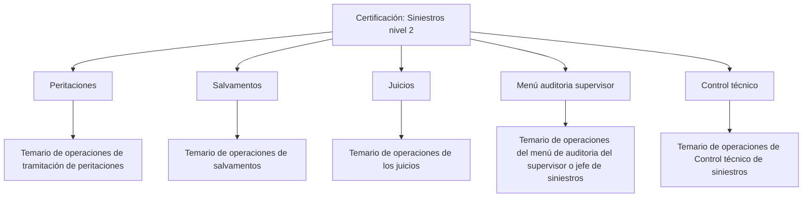

# Certificación — Siniestros Nivel 2: Temario de Operaciones

## 1. Metadados do Documento
- **Arquivo de Origem:** Não identificado no conteúdo fornecido
- **Tipo de Documento:** Apresentação Executiva
- **Domínio / Sistema:** Certificación — Siniestros Nivel 2
- **Público-Alvo:** Operação, Supervisão e Negócio
- **Data/Versão Identificada:** Não identificada

---

## 2. Resumo Executivo & Contexto de Negócio

O documento apresenta a estrutura temática da certificação de **Siniestros nivel 2**, organizada em áreas operacionais relacionadas à gestão de sinistros. O conteúdo identifica os blocos de conhecimento que compõem o temário, sem detalhar procedimentos, regras de elegibilidade, sistemas transacionais ou responsabilidades individuais.

A certificação abrange operações de **peritaciones**, **salvamentos**, **juicios**, **menú auditoria supervisor** e **control técnico**. Cada área é descrita como um ponto de acesso ao temário das operações correspondentes dentro do escopo de sinistros de nível 2.

O material também contém referências textuais de navegação ou interface: “Inicio”, “Soluciones”, “APIs”, “Documentación”, “Zeus”, “ES” e “RS”. O documento não esclarece se esses elementos correspondem a um portal, sistema, menus de navegação, integrações ou ambientes operacionais.

O benefício explícito do conteúdo é a organização do conhecimento de certificação por domínio operacional. Não há detalhamento adicional sobre critérios de aprovação, duração da certificação, processos de treinamento, indicadores, fluxos de execução ou contratos técnicos.

---

## 3. Arquitetura, Componentes & Tecnologias Envolvidas

O documento não descreve uma arquitetura técnica, microsserviços, tecnologias, APIs, bancos de dados, servidores ou ambientes. O conteúdo permite apenas reconstruir uma estrutura conceitual de categorias do temário de **Siniestros nivel 2**.



### Componentes e áreas citadas

| Componente / Área | Descrição sustentada pelo documento | Detalhamento disponível |
| :--- | :--- | :--- |
| Certificación — Siniestros nivel 2 | Certificação cujo conteúdo é organizado em áreas de operações de sinistros. | O documento não informa critérios, duração ou mecanismo de certificação. |
| Peritaciones | Área que contém o temário de todas as operações da tramitação de peritaciones. | Não descreve operações específicas. |
| Salvamentos | Área que contém o temário de todas as operações de salvamentos. | Não descreve operações específicas. |
| Juicios | Área que contém o temário de todas as operações dos juicios. | Não descreve operações específicas. |
| Menú auditoria supervisor | Área que contém o temário de operações do menu de auditoria do supervisor ou chefe de sinistros. | Não detalha telas, permissões ou auditorias. |
| Control técnico | Área que contém o temário das operações de controle técnico de sinistros. | Não descreve controles, critérios ou indicadores. |
| Inicio / Soluciones / APIs / Documentación / Zeus / ES / RS | Termos presentes no conteúdo bruto, possivelmente elementos de navegação ou contexto de interface. | A finalidade e a relação entre esses termos não são explicadas. |

> **Nota de Análise:** O documento não apresenta arquitetura de software, métodos HTTP, contratos JSON, integrações, tecnologias, versões, URLs, portas, caminhos de log ou identificação de ambientes.

---

## 4. Regras de Negócio, Especificações Funcionais & Processos

O conteúdo não define regras de negócio explícitas, cálculos, critérios de validação, condições de aprovação, etapas transacionais ou exceções operacionais. As informações funcionais disponíveis são as seguintes:

1. A certificação é identificada como **Siniestros nivel 2**.
2. O conteúdo de **Peritaciones** corresponde ao temário de operações de tramitação de peritaciones.
3. O conteúdo de **Salvamentos** corresponde ao temário de operações de salvamentos.
4. O conteúdo de **Juicios** corresponde ao temário de operações dos juicios.
5. O conteúdo de **Menú auditoria supervisor** corresponde ao temário das operações do menu de auditoria do supervisor ou do chefe de sinistros.
6. O conteúdo de **Control técnico** corresponde ao temário das operações de controle técnico de sinistros.

> **Nota de Análise:** O documento classifica áreas de conhecimento, mas não detalha os fluxos internos de cada operação. Não é possível inferir etapas, responsáveis, regras de autorização, entradas, saídas ou critérios de conclusão para peritaciones, salvamentos, juicios, auditoria ou control técnico.

---

## 5. Tabelas de Parâmetros, Ambientes e Estruturas de Dados

| Item / Parâmetro | Descrição / Função | Tipo / Valores / Formato | Ambiente / Observações |
| :--- | :--- | :--- | :--- |
| Certificación | Identificação do material como conteúdo de certificação. | Texto: “CERTIFICACIÓN” | Associada a “Siniestros nivel 2”. |
| Siniestros nivel 2 | Escopo ou nível da certificação apresentada. | Texto | Não há definição do que diferencia o nível 2. |
| Peritaciones | Categoria temática de operações de tramitação de peritaciones. | Seção / categoria | Sem operações individualizadas. |
| Salvamentos | Categoria temática de operações de salvamentos. | Seção / categoria | Sem operações individualizadas. |
| Juicios | Categoria temática de operações de juicios. | Seção / categoria | Sem operações individualizadas. |
| Menú auditoria supervisor | Categoria relacionada à auditoria do supervisor ou chefe de sinistros. | Seção / categoria | Sem matriz de permissões ou ações de auditoria. |
| Control técnico | Categoria relacionada a operações de controle técnico de sinistros. | Seção / categoria | Sem critérios de controle técnico. |
| Inicio | Termo exibido no conteúdo bruto. | Texto de interface ou navegação não confirmada | Não detalhado. |
| Soluciones | Termo exibido no conteúdo bruto. | Texto de interface ou navegação não confirmada | Não detalhado. |
| APIs | Termo exibido no conteúdo bruto. | Texto de interface ou navegação não confirmada | Não há APIs descritas. |
| Documentación | Termo exibido no conteúdo bruto. | Texto de interface ou navegação não confirmada | Não há documentação adicional reproduzida. |
| Zeus | Termo exibido no conteúdo bruto. | Texto / nome não contextualizado | O documento não define Zeus. |
| ES | Termo exibido no conteúdo bruto. | Código ou rótulo não contextualizado | Não expandido pelo documento. |
| RS | Termo exibido no conteúdo bruto. | Código ou rótulo não contextualizado | Não expandido pelo documento. |

---

## 6. Bateria de Perguntas & Respostas para RAG (FAQ Sintético)

### P1: Qual é o tema central do documento “Certificación — Siniestros nivel 2”?
**R:** O documento apresenta a estrutura temática de uma certificação denominada **Siniestros nivel 2**. O conteúdo organiza o temário em peritaciones, salvamentos, juicios, menu de auditoria do supervisor ou chefe de sinistros e controle técnico de sinistros.

### P2: O que está incluído na seção de Peritaciones?
**R:** A seção **Peritaciones** contém o temário de todas as operações relacionadas à tramitação de peritaciones. O documento não enumera ou descreve as operações específicas dessa tramitação.

### P3: O documento detalha o processo operacional de Salvamentos?
**R:** Não. O documento informa apenas que a seção **Salvamentos** contém o temário de todas as operações de salvamentos. Não há fluxo, regras, responsáveis, critérios de validação ou etapas operacionais descritos.

### P4: Qual conteúdo está associado à área de Juicios?
**R:** A área **Juicios** contém o temário de todas as operações dos juicios. O conteúdo fornecido não detalha quais operações, sistemas, documentos ou regras estão envolvidos nesses juicios.

### P5: Para que serve o Menú auditoria supervisor?
**R:** Segundo o documento, o **Menú auditoria supervisor** contém o temário de todas as operações do menu de auditoria do supervisor ou do chefe de sinistros. Não há detalhamento das permissões, opções de menu, registros auditáveis ou funções disponíveis.

### P6: O que é abordado em Control técnico?
**R:** A seção **Control técnico** contém o temário de todas as operações de controle técnico de sinistros. O documento não especifica quais controles técnicos são realizados nem quais critérios são aplicados.

### P7: Existem APIs documentadas para a certificação de Siniestros nivel 2?
**R:** Não. Embora o termo “APIs” esteja presente no conteúdo bruto, não há endpoints, métodos HTTP, contratos, autenticação, payloads ou qualquer especificação técnica de APIs no documento.

### P8: O documento informa critérios de aprovação ou conclusão da certificação?
**R:** Não. O conteúdo identifica a certificação e suas áreas temáticas, mas não apresenta critérios de aprovação, provas, pontuação, duração, pré-requisitos ou mecanismos de conclusão.

### P9: O documento identifica tecnologias, sistemas ou ambientes técnicos?
**R:** Não há tecnologias, ambientes, URLs, servidores, bancos de dados ou ferramentas técnicas descritos. Os termos “Inicio”, “Soluciones”, “APIs”, “Documentación”, “Zeus”, “ES” e “RS” aparecem sem explicação contextual suficiente para classificá-los tecnicamente.

### P10: Qual é a relação entre o supervisor e o chefe de sinistros no documento?
**R:** O documento menciona que o temário do **Menú auditoria supervisor** abrange operações do menu de auditoria do supervisor ou do chefe de sinistros. Não define diferenças de função, responsabilidades, hierarquia ou permissões entre esses papéis.

---

## 7. Glossário de Termos, Siglas & Conceitos-Chave

- **Certificación:** Identificação do material como conteúdo de certificação.
- **Siniestros nivel 2:** Nome do nível de certificação abordado; o documento não define o significado operacional de “nível 2”.
- **Peritaciones:** Área cujo temário cobre operações de tramitação de peritaciones.
- **Salvamentos:** Área cujo temário cobre operações de salvamentos.
- **Juicios:** Área cujo temário cobre operações dos juicios.
- **Menú auditoria supervisor:** Área que reúne o temário de operações do menu de auditoria do supervisor ou chefe de sinistros.
- **Control técnico:** Área que reúne o temário de operações de controle técnico de sinistros.
- **APIs:** Termo presente no conteúdo bruto, sem expansão ou especificação técnica adicional.
- **Zeus:** Termo presente no conteúdo bruto, sem definição contextual.
- **ES:** Termo ou código presente no conteúdo bruto, sem definição contextual.
- **RS:** Termo ou código presente no conteúdo bruto, sem definição contextual.

---

## 8. Notas Críticas, Riscos & Limitações

- O documento apresenta apenas uma visão resumida das áreas do temário de **Siniestros nivel 2**.
- Não há procedimentos operacionais detalhados para peritaciones, salvamentos, juicios, auditoria ou controle técnico.
- Não há regras de negócio, critérios de validação, cálculos, exceções, SLAs, indicadores ou critérios de aprovação.
- Não há documentação de arquitetura, integrações, APIs, contratos de dados, logs, URLs, ambientes ou tecnologias.
- Os termos “Zeus”, “ES” e “RS” não são definidos; qualquer interpretação adicional seria especulativa.
- O conteúdo não permite derivar uma matriz de permissões para supervisor, chefe de sinistros ou demais perfis.
- A ausência de detalhamento reduz a capacidade de usar este documento como manual operacional completo; ele deve ser tratado como índice ou visão de alto nível do temário.

---

## 9. Conteúdo Bruto Estruturado (Referência Fiel)

```text
--- [PÁGINA 1 DE 2] ---

CERTIFICACIÓN - SINIESTROS NIVEL 2
CERTIFICACIÓN
Siniestros nivel 2
 PERITACIONES
En este apartado se encuentra el temario de
todas las operaciones de la tramitación de
peritaciones
 SALVAMENTOS
En este apartado se encuentra el temario de
todas las operaciones de salvamentos
 JUICIOS
En este apartado se encuentra el temario de
todas las operaciones de los juicios
 MENÚ AUDITORIA
SUPERVISOR
En este apartado se encuentra el temario de
todas las operaciones del menú de auditoria
del supervisor o del jefe de siniestros
 / 
 RS
Inicio Soluciones APIs Documentación Zeus
ES


--- [PÁGINA 2 DE 2] ---

CONTROL TÉCNICO
En este apartado se encuentra el temario de
todas las operaciones de Control técnico de
siniestros
```
