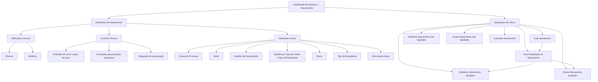

# Certificação de Sinistros — Faturamento: Definições e Operações de Fatura

## 1. Metadados do Documento
- **Arquivo de Origem:** `Não informado`
- **Tipo de Documento:** `Manual Operacional`
- **Domínio / Sistema:** `Certificação de Sinistros — Faturamento`
- **Público-Alvo:** `Analistas funcionais, operadores de faturamento e equipes de sinistros`
- **Data/Versão Identificada:** `Não identificada`

---

## 2. Resumo Executivo & Contexto de Negócio

O documento descreve definições e operações do módulo de faturamento no contexto de certificação de sinistros. O conteúdo organiza elementos compartilhados, controles técnicos, definições por setor e ramo, além das operações disponíveis para uma fatura.

No nível comum, o material apresenta definições que não são exclusivas do módulo de sinistros, mas são necessárias para definir perícias. Entre essas definições estão o registro de clínicas e médicos da companhia.

O documento estabelece mecanismos de classificação para despesas não cobertas, tipos de danos, informações iniciais de atributos da fatura e regras de controle técnico. Os controles técnicos determinam condições em que operações de faturamento podem ser paralisadas ou submetidas à autorização obrigatória.

As operações de fatura podem ser executadas em modalidade online ou diferida. O ciclo operacional inclui criação, modificação de faturas liquidadas e não liquidadas, geração de liquidação, anulação e consulta.

O material não apresenta detalhes sobre interfaces, métodos HTTP, contratos de dados, persistência, perfis de acesso, responsáveis por aprovação ou critérios técnicos concretos para autorizações e paralisações.

---

## 3. Arquitetura, Componentes & Tecnologias Envolvidas

O documento não descreve arquitetura de software, microsserviços, tecnologias, ambientes, bancos de dados ou integrações. O fluxo abaixo representa exclusivamente a organização funcional e operacional explicitada no conteúdo.



**Nota de Análise:** O documento não detalha os mecanismos técnicos, a sequência transacional completa nem as pré-condições formais entre criação, liquidação, alteração, anulação e consulta de faturas.

---

## 4. Regras de Negócio, Especificações Funcionais & Processos

### 4.1 Definições comuns

As definições comuns correspondem a informações não exclusivas do módulo de sinistros, mas necessárias para realizar a definição de perícias.

- **Clínicas:** permite registrar todas as clínicas da companhia.
- **Médicos:** permite registrar todos os médicos da companhia.

### 4.2 Controle técnico

O controle técnico abrange:

- Definição de erros.
- Definição de tipos de erros.
- Determinação das condições nas quais operações de faturamento podem ser paralisadas.
- Determinação das condições nas quais operações de faturamento devem ser autorizadas.

**Nota de Análise:** O documento não informa quais são os erros, tipos de erro, condições de paralisação, regras de autorização ou responsáveis por autorizar operações.

### 4.3 Definições gerais

As definições gerais afetam todos os possíveis expedientes de faturamento.

- **Causa de processo:** permite catalogar as causas de despesas não amparadas ou não cobertas, para as quais se deseja realizar operações em cada ramo.
- **Setor:** contém definições exclusivas para todos os ramos do setor que está sendo definido.
- **Detalhe de faturamento:** determina o detalhamento econômico e o detalhe da fatura. Os exemplos mencionados são medicamentos, ressonância e honorários de anestesista.
- **Detalhe por tipo de fatura e tipo de expediente:** determina o detalhamento econômico permitido conforme o tipo de fatura, tipo de expediente e atividade. Os exemplos mencionados são medicamentos, ressonância e honorários de anestesista.
- **Ramo:** contém definições exclusivas do ramo que está sendo definido.
- **Tipo de expediente:** permite definir os tipos de danos que poderão ser utilizados pelo módulo de faturamento.
- **Informação inicial:** permite definir valores iniciais para atributos da fatura.

### 4.4 Operações de fatura

As operações de fatura podem ser realizadas **em linha** ou **em diferido**.

| Operação | Regra funcional descrita |
| :--- | :--- |
| Criar faturamento | Permite inserir uma fatura. |
| Modificar faturamento liquidado | Permite alterar informações de uma fatura liquidada e não paga, modificando a liquidação. |
| Modificar faturamento não liquidado | Permite alterar informações de uma fatura não liquidada. |
| Gerar liquidação de faturamento | Permite criar uma liquidação a partir das informações introduzidas na fatura. |
| Anular faturamento liquidado | Permite anular uma fatura e sua liquidação. |
| Anular faturamento não liquidado | Permite anular uma fatura não liquidada. |
| Consultar faturamento | Exibe todas as informações da fatura. |

---

## 5. Tabelas de Parâmetros, Ambientes e Estruturas de Dados

| Item / Parâmetro | Descrição / Função | Tipo / Valores / Formato | Ambiente / Observações |
| :--- | :--- | :--- | :--- |
| Clínicas | Registro de todas as clínicas da companhia. | Cadastro funcional | Definição comum necessária para perícias. |
| Médicos | Registro de todos os médicos da companhia. | Cadastro funcional | Definição comum necessária para perícias. |
| Erros | Definição de erros de faturamento. | Não detalhado | Associado ao controle técnico. |
| Tipos de erros | Classificação de erros. | Não detalhado | Associado ao controle técnico. |
| Causa de processo | Catalogação de causas de despesas não amparadas ou não cobertas. | Catálogo | Aplicável às operações de cada ramo. |
| Setor | Definições exclusivas para os ramos do setor definido. | Classificação organizacional ou funcional | Não detalhado adicionalmente. |
| Detalhe de faturamento | Determina detalhamento econômico e detalhe da fatura. | Detalhamento econômico | Exemplos: medicamentos, ressonância e honorários de anestesista. |
| Tipo de fatura | Critério para determinar detalhamento econômico permitido. | Classificação | Utilizado com tipo de expediente e atividade. |
| Tipo de expediente | Define os tipos de danos utilizáveis pelo módulo de faturamento. | Classificação | Também integra a regra de detalhamento permitido. |
| Atividade | Critério para determinar detalhamento econômico permitido. | Não detalhado | Utilizada com tipo de fatura e tipo de expediente. |
| Ramo | Definições exclusivas do ramo definido. | Classificação de ramo | Não detalhado adicionalmente. |
| Informação inicial | Define valores iniciais para atributos da fatura. | Valores iniciais | Atributos não especificados. |
| Fatura | Entidade submetida a criação, modificação, liquidação, anulação e consulta. | Documento/registro de faturamento | Operações online ou diferidas. |
| Liquidação | Registro gerado a partir das informações introduzidas na fatura. | Processo ou entidade de liquidação | Pode ser modificado para fatura liquidada não paga; é anulada junto com a fatura liquidada. |
| Fatura liquidada não paga | Fatura que pode ter suas informações e liquidação modificadas. | Estado funcional | O documento não especifica demais transições de estado. |
| Fatura não liquidada | Fatura que pode ser modificada ou anulada. | Estado funcional | O documento não especifica pré-condições adicionais. |

---

## 6. Bateria de Perguntas & Respostas para RAG (FAQ Sintético)

### P1: Qual é o objetivo das definições comuns no módulo de faturamento de sinistros?
**R:** As definições comuns reúnem informações que não são exclusivas do módulo de sinistros, mas que são necessárias para realizar a definição de perícias. O documento cita os cadastros de clínicas e médicos da companhia como exemplos dessas definições.

### P2: O que pode ser cadastrado nas definições comuns de faturamento?
**R:** O documento informa que é possível registrar todas as clínicas da companhia e todos os médicos da companhia.

### P3: Para que serve a causa de processo no faturamento?
**R:** A causa de processo permite catalogar as causas de despesas não amparadas ou não cobertas. Essas causas são utilizadas para realizar operações para cada ramo.

### P4: Como o documento define o detalhe de faturamento?
**R:** O detalhe de faturamento determina o detalhamento econômico e o detalhe da fatura. O documento cita como exemplos medicamentos, ressonância e honorários de anestesista.

### P5: Quais critérios definem o detalhe econômico permitido de uma fatura?
**R:** O detalhe por tipo de fatura e tipo de expediente determina o detalhamento econômico permitido segundo o tipo de fatura, o tipo de expediente e a atividade. O documento exemplifica o detalhamento com medicamentos, ressonância e honorários de anestesista.

### P6: Qual é a finalidade do tipo de expediente?
**R:** O tipo de expediente permite definir os tipos de danos que poderão ser utilizados pelo módulo de faturamento.

### P7: O que a informação inicial permite configurar?
**R:** A informação inicial permite definir valores iniciais para atributos da fatura. O documento não especifica quais atributos ou quais valores podem ser definidos.

### P8: Em quais modalidades as operações de fatura podem ser realizadas?
**R:** As operações sobre faturas podem ser realizadas em linha ou em diferido.

### P9: Quando uma fatura liquidada pode ser modificada?
**R:** Uma fatura liquidada pode ser modificada quando ainda não tiver sido paga. A operação permite alterar informações da fatura liquidada não paga e modificar sua liquidação.

### P10: Como é gerada uma liquidação de faturamento?
**R:** A liquidação de faturamento é gerada a partir das informações introduzidas na fatura.

### P11: O que ocorre ao anular uma fatura liquidada?
**R:** A anulação de uma fatura liquidada anula tanto a fatura quanto a sua liquidação.

### P12: Qual é a diferença entre anular uma fatura liquidada e uma não liquidada?
**R:** A anulação de uma fatura liquidada anula a fatura e sua liquidação. A anulação de uma fatura não liquidada anula somente a fatura, pois não há liquidação mencionada para esse estado.

### P13: Qual é a responsabilidade do controle técnico no faturamento?
**R:** O controle técnico define erros e tipos de erros, além de estabelecer as condições em que operações de faturamento podem ser paralisadas ou obrigatoriamente autorizadas. O documento não detalha essas condições.

---

## 7. Glossário de Termos, Siglas & Conceitos-Chave

- **Certificação de Sinistros:** contexto do documento relacionado ao faturamento de sinistros.
- **Faturamento / Facturación:** conjunto de definições e operações aplicáveis a faturas.
- **Fatura / Factura:** entidade para a qual podem ser realizadas operações de criação, modificação, liquidação, anulação e consulta.
- **Liquidação / Liquidación:** registro ou processo criado a partir das informações introduzidas na fatura.
- **Fatura liquidada:** fatura que possui liquidação associada.
- **Fatura não liquidada:** fatura sem liquidação associada, conforme a nomenclatura operacional apresentada.
- **Despesa não amparada:** gasto não coberto, catalogado por meio de causa de processo.
- **Causa de processo / Causa Proceso:** classificação das causas de despesas não amparadas.
- **Setor / Sector:** nível de definição cujas regras são exclusivas para todos os ramos do setor definido.
- **Ramo:** nível de definição cujas regras são exclusivas do ramo definido.
- **Expediente / Expediente:** conceito utilizado para classificar tipos de danos e compor o critério de detalhamento econômico permitido.
- **Perícia / Peritación:** atividade cuja definição requer informações comuns, como clínicas e médicos.
- **Controle técnico:** conjunto de definições de erros, tipos de erro, paralisações e obrigações de autorização.

---

## 8. Notas Críticas, Riscos & Limitações

- O documento não identifica arquivo de origem, data, versão, autor, sistema específico, ambiente ou responsáveis operacionais.
- Não há descrição de arquitetura técnica, componentes de software, integrações, APIs, contratos de dados, mecanismos de autenticação ou autorização.
- As condições concretas que levam à paralisação de operações de faturamento ou à autorização obrigatória não são especificadas.
- Não são apresentados os tipos de erro, códigos de erro, severidades, tratamento operacional ou fluxos de resolução.
- O documento não define os atributos da fatura, os campos de clínicas e médicos, os tipos de dano, as atividades ou os critérios de validação.
- Não são informadas transições completas de estado para faturas, especialmente entre criação, liquidação, pagamento, alteração e anulação.
- A página 4 não contém conteúdo textual funcional adicional, sendo descrita como página em branco ou composta apenas por elementos visuais/imagem.

---

## 9. Conteúdo Bruto Estruturado (Referência Fiel)

```text
--- [PÁGINA 1 DE 4] ---

CERTIFICACIÓN de SINIESTROS -
FACTURACIÓN
Definiciones Facturación
Operaciones Facturación
DEFINICIONES
COMÚN
En este nivel se encuentran definiciones que NO son exclusivas del
módulo de siniestros, pero son necesarias para poder realizar la
definición de peritaciones. En otros se encuentran:
CLÍNICAS
Registrar todas los clínicas de la compañía
MÉDICOS
Registrar todos los médicos de la compañía
 / 
 RS
Inicio Soluciones APIs Documentación Zeus
ES


--- [PÁGINA 2 DE 4] ---

CONTROL TÉCNICO
Definición de errores, tipos de Errores
GENERAL
En este nivel se encuentran definiciones que afectarán a todos los
posibles expedientes de facturación
CAUSA PROCESO 
Permite catalogar los causas de los gastos no amparados
SECTOR
Son exclusivas para todos los ramos del sector que se está definiendo
DETALLE FACTURACIÓN 
Determinar el desglose económico, el detalle
de la factura . Por ejemplo medicinas,
resonancia, honorarios anestesista...
DETALLE POR TIPO FACTURA Y TIPO DE
EXPEDIENTE
Determina por tipo de factura, tipo de
expediente y actividad, el desglose
económico permitido, el detalle de la factura .
Por ejemplo medicinas, resonancia,
honorarios anestesista...
RAMO
Son exclusivas del ramo que se está definiendo
CAUSA PROCESO 
 TIPO EXPEDIENTE


--- [PÁGINA 3 DE 4] ---

Permite catalogar las causas de gastos no
amparados por los que se quiere realizar las
operaciones para cada ramo. Estos son
gastos que no se cubren
Permite definir los Tipos de Daños que va a
poder utilizar el módulo de facturación
INFORMACIÓN INICIAL 
Permite definir valores iniciales para atributos
de la factura
CONTROL TÉCNICO
Definir en qué condiciones se puede paralizar
las operaciones de facturación u obligación de
ser autorizada
Operaciones de Factura
FACTURA
Operaciones que se pueden realizar con las facturas, se pueden realizar
tanto en línea como diferido
CREAR facturación
Permite ingresar una factura
MODIFICAR facturación liquidada
Permite cambiar información de factura
liquidada no pagada, modificando la
liquidación
MODIFICAR facturación no liquidada
Permite cambiar información de una factura
GENERAR liquidación facturación
Permite crear una liquidación a partir de la
información introducida en la factura
ANULAR facturación liquidada
Permite anular una factura y su liquidación
ANULAR facturación no liquidada
Permite anular una factura
CONSULTAR facturación
Se muestra toda la información de la factura


--- [PÁGINA 4 DE 4] ---

[Página em branco ou apenas elementos visuais/imagem]
```
