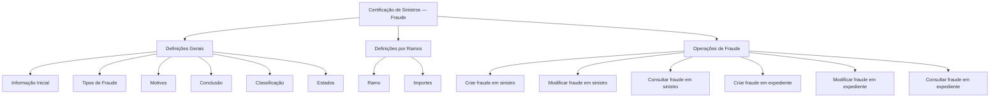

# Certificação de Sinistros — Módulo de Fraude: Definições, Operações e Classificações

## 1. Metadados do Documento
- **Arquivo de Origem:** Não identificado no conteúdo fornecido
- **Tipo de Documento:** Apresentação Executiva
- **Domínio / Sistema:** Certificação de Sinistros — Fraude
- **Público-Alvo:** Negócio, analistas funcionais, desenvolvedores e operação
- **Data/Versão Identificada:** Não identificada

---

## 2. Resumo Executivo & Contexto de Negócio

O documento apresenta o módulo de **Fraude** no contexto de **Certificação de Sinistros**. O conteúdo organiza definições aplicáveis a todos os ramos, classificações, estados, motivos, tipos de conclusão e operações para registrar, modificar e consultar informações de fraude.

A estrutura apresentada separa definições gerais das definições específicas por ramo. As definições gerais abrangem comportamento do módulo, tipologias de fraude, motivos, conclusões, classificações e estados. As definições por ramo abrangem importes fixos ou regras de negócio para calcular dinheiro poupado.

O módulo suporta o gerenciamento de fraude tanto para **sinistros** quanto para **expedientes**. As operações explicitamente descritas permitem criar, modificar e consultar registros de fraude associados a essas duas entidades.

O documento menciona fontes ou pontos de navegação denominados **Soluciones**, **APIs**, **Documentación**, **Zeus** e **ES**, mas não descreve suas responsabilidades, integrações, contratos técnicos, URLs ou métodos de acesso.

---

## 3. Arquitetura, Componentes & Tecnologias Envolvidas

O conteúdo não apresenta uma arquitetura técnica detalhada, tecnologias de implementação, servidores, bancos de dados, APIs, contratos JSON ou protocolos de integração. A estrutura funcional identificável contém o módulo de Fraude, as entidades Sinistro e Expediente, as definições gerais, as definições por ramo e as operações disponíveis.



**Nota de Análise:** O documento lista “APIs”, “Documentación”, “Zeus” e “Soluciones”, porém não detalha os componentes técnicos, métodos HTTP, contratos de integração, autenticação ou responsabilidades desses elementos.

---

## 4. Regras de Negócio, Especificações Funcionais & Processos

### 4.1 Definições gerais para todos os ramos

O documento estabelece que existem definições aplicáveis a todos os ramos. Essas definições gerais incluem:

1. **Informação inicial:** definição de comportamentos do módulo de Fraude.
2. **Tipos:** tipologias de fraude, incluindo:
   - Fraude identificada sem provas.
   - Fraude parcial.
   - Fraude confirmada.
3. **Motivos:** razões associadas à fraude.
4. **Conclusão:** tipo de conclusão, incluindo:
   - Procedente.
   - Rejeitado.
   - RS.
5. **Classificação:** classificação dos casos de fraude, incluindo:
   - Fraude dolosa.
   - Fraude ocasional.
6. **Estados:** estados possíveis para uma fraude, incluindo:
   - Atribuído.
   - Revisão.
   - Revisão D.I.S.M.A.

### 4.2 Motivos de fraude

O documento cita os seguintes exemplos de motivos de fraude:

- Delinquência organizada.
- Reclama valor superior ao autorizado.
- Reclama os mesmos danos.
- Reclama lesões fora do acidente.

O conteúdo também menciona a existência de uma relação de **motivos por conclusão e tipo**, descrita como “Motivos de Fraude por tipos de conclusão”. Não são fornecidas combinações específicas entre motivo, tipo e conclusão.

### 4.3 Definições por ramo

O documento indica que existem definições específicas por ramo. Entre essas definições estão os **importes**, que podem ser valores fixos ou regras de negócio para calcular dinheiro poupado.

**Nota de Análise:** O documento não informa os ramos existentes, os valores fixos, as fórmulas de cálculo, as moedas, os critérios de aplicação ou os limites associados aos importes.

### 4.4 Operações de fraude para sinistro

| Operação | Entidade | Regra funcional descrita |
| :--- | :--- | :--- |
| Criar fraude sinistro | Sinistro | Permite registrar uma fraude em um sinistro. |
| Modificar fraude sinistro | Sinistro | Permite modificar as informações de fraude de um sinistro. |
| Consultar fraude sinistro | Sinistro | Mostra todas as informações de uma fraude associada a um sinistro. |

### 4.5 Operações de fraude para expediente

| Operação | Entidade | Regra funcional descrita |
| :--- | :--- | :--- |
| Criar fraude expediente | Expediente | Permite registrar uma fraude em um expediente. |
| Modificar fraude expediente | Expediente | Permite modificar as informações de fraude de um expediente. |
| Consultar fraude expediente | Expediente | Mostra todas as informações de uma fraude associada a um expediente. |

---

## 5. Tabelas de Parâmetros, Ambientes e Estruturas de Dados

| Item / Parâmetro | Descrição / Função | Tipo / Valores / Formato | Ambiente / Observações |
| :--- | :--- | :--- | :--- |
| Informação inicial | Define comportamentos do módulo de Fraude. | Comportamento funcional. | Aplicável às definições gerais. |
| Tipologia de fraude | Classifica a situação de fraude. | Fraude identificada sem provas; fraude parcial; fraude confirmada. | Não são descritos critérios de seleção. |
| Motivo de fraude | Registra a razão associada à fraude. | Delinquência organizada; reclama valor superior ao autorizado; reclama os mesmos danos; reclama lesões fora do acidente. | A lista apresentada é exemplificativa no conteúdo extraído. |
| Conclusão | Registra o resultado ou tipo de conclusão da fraude. | Procedente; rejeitado; RS. | O significado de “RS” não é detalhado. |
| Motivos por conclusão e tipo | Relaciona motivos de fraude com tipos de conclusão. | Não especificado. | Não há matriz de relacionamento no documento. |
| Classificação de fraude | Classifica a natureza da fraude. | Fraude dolosa; fraude ocasional. | Não são descritos critérios de classificação. |
| Estado da fraude | Indica a situação em que a fraude se encontra. | Atribuído; revisão; revisão D.I.S.M.A. | Não há transições de estado descritas. |
| Ramo | Agrupa definições específicas por ramo. | Não especificado. | Os ramos não são enumerados. |
| Importes | Define valores ou regras para cálculo de dinheiro poupado. | Valores fixos ou regras de negócio. | Fórmulas, valores e unidades não são apresentados. |
| Criar fraude sinistro | Registra uma fraude em um sinistro. | Operação funcional. | Sem detalhamento de campos obrigatórios ou permissões. |
| Modificar fraude sinistro | Altera informações de fraude de um sinistro. | Operação funcional. | Sem regras de alteração ou auditoria. |
| Consultar fraude sinistro | Exibe informações de fraude associada a um sinistro. | Operação funcional. | Sem filtros ou critérios de consulta. |
| Criar fraude expediente | Registra uma fraude em um expediente. | Operação funcional. | Sem detalhamento de campos obrigatórios ou permissões. |
| Modificar fraude expediente | Altera informações de fraude de um expediente. | Operação funcional. | Sem regras de alteração ou auditoria. |
| Consultar fraude expediente | Exibe informações de fraude associada a um expediente. | Operação funcional. | Sem filtros ou critérios de consulta. |
| Soluciones | Item citado como ponto de navegação ou referência. | Não especificado. | Responsabilidade não detalhada. |
| APIs | Item citado como ponto de navegação ou referência. | Não especificado. | Não há endpoints, contratos ou protocolos descritos. |
| Documentación | Item citado como ponto de navegação ou referência. | Não especificado. | Conteúdo não detalhado. |
| Zeus | Item citado como ponto de navegação ou referência. | Não especificado. | Responsabilidade não detalhada. |
| ES | Item citado no conteúdo. | Não especificado. | Significado não detalhado. |

---

## 6. Bateria de Perguntas & Respostas para RAG (FAQ Sintético)

### P1: Qual é o objetivo do módulo de Fraude na Certificação de Sinistros?
**R:** O módulo de Fraude organiza definições, classificações, motivos, conclusões, estados e operações para registrar, modificar e consultar fraudes associadas a sinistros e expedientes.

### P2: Quais tipologias de fraude são mencionadas no documento?
**R:** O documento menciona três tipologias de fraude: fraude identificada sem provas, fraude parcial e fraude confirmada.

### P3: Quais tipos de conclusão de fraude estão disponíveis?
**R:** Os tipos de conclusão mencionados são procedente, rejeitado e RS. O documento não detalha o significado de RS nem as regras para selecionar cada conclusão.

### P4: Quais classificações de fraude são citadas?
**R:** O documento cita fraude dolosa e fraude ocasional como classificações de fraude. Não são apresentados critérios funcionais para diferenciar essas classificações.

### P5: Em quais estados uma fraude pode se encontrar?
**R:** Uma fraude pode estar nos estados atribuído, revisão ou revisão D.I.S.M.A. O conteúdo não descreve as transições permitidas entre esses estados.

### P6: Quais motivos de fraude são apresentados?
**R:** Os motivos citados são delinquência organizada, reclamação de valor superior ao autorizado, reclamação dos mesmos danos e reclamação de lesões fora do acidente.

### P7: O que permite a operação “Criar fraude sinistro”?
**R:** A operação “Criar fraude sinistro” permite registrar uma fraude em um sinistro. O documento não especifica campos obrigatórios, validações, permissões ou integração técnica dessa operação.

### P8: O que permite a operação “Modificar fraude expediente”?
**R:** A operação “Modificar fraude expediente” permite modificar as informações de fraude associadas a um expediente. O conteúdo não informa quais atributos podem ser alterados ou se existem restrições por estado.

### P9: O que exibe a consulta de fraude em sinistro?
**R:** A operação “Consultar fraude sinistro” mostra todas as informações de uma fraude associada a um sinistro. O documento não detalha filtros, critérios de pesquisa ou formato de resposta.

### P10: Como o documento trata valores e dinheiro poupado?
**R:** O documento informa que, nas definições por ramo, podem existir importes fixos ou regras de negócio para calcular dinheiro poupado. Não são fornecidos valores, fórmulas, moedas ou regras específicas.

### P11: Existe uma relação entre motivos, conclusões e tipos de fraude?
**R:** Sim. O documento menciona “motivos por conclusão e tipo” e “motivos de fraude por tipos de conclusão”. Entretanto, não fornece a matriz de relacionamento nem as combinações permitidas.

### P12: O documento descreve APIs ou contratos técnicos do módulo de Fraude?
**R:** Não. Embora o conteúdo cite “APIs”, não há endpoints, métodos HTTP, contratos JSON, autenticação, URLs, tecnologias ou detalhes de integração técnica.

---

## 7. Glossário de Termos, Siglas & Conceitos-Chave

- **Certificação de Sinistros:** Contexto funcional no qual o módulo de Fraude é apresentado.
- **Sinistro:** Entidade para a qual é possível criar, modificar e consultar uma fraude.
- **Expediente:** Entidade para a qual é possível criar, modificar e consultar uma fraude.
- **Fraude identificada sem provas:** Tipologia de fraude mencionada no documento.
- **Fraude parcial:** Tipologia de fraude mencionada no documento.
- **Fraude confirmada:** Tipologia de fraude mencionada no documento.
- **Fraude dolosa:** Classificação de fraude mencionada no documento.
- **Fraude ocasional:** Classificação de fraude mencionada no documento.
- **Procedente:** Tipo de conclusão mencionado para fraude.
- **Rejeitado:** Tipo de conclusão mencionado para fraude.
- **RS:** Tipo de conclusão mencionado; significado não detalhado no documento.
- **D.I.S.M.A.:** Termo associado ao estado “revisão D.I.S.M.A.”; significado não detalhado no documento.
- **Ramo:** Agrupamento para definições específicas, incluindo importes.
- **Importes:** Valores fixos ou regras de negócio para calcular dinheiro poupado.
- **Zeus:** Item citado no conteúdo; papel não detalhado.
- **ES:** Item citado no conteúdo; significado não detalhado.

---

## 8. Notas Críticas, Riscos & Limitações

- O documento possui caráter resumido e não detalha a implementação técnica do módulo de Fraude.
- Não há descrição de APIs, endpoints, métodos HTTP, contratos de dados, URLs, autenticação, integrações, servidores ou ambientes.
- Não há matriz de permissões para criar, modificar ou consultar fraudes.
- Não são apresentadas regras de transição entre os estados atribuído, revisão e revisão D.I.S.M.A.
- O significado dos termos **RS**, **D.I.S.M.A.**, **Zeus** e **ES** não é definido.
- Não são apresentados os ramos disponíveis, os valores de importes, fórmulas de cálculo de dinheiro poupado ou condições de aplicação.
- Não há critérios para classificar uma fraude como identificada sem provas, parcial, confirmada, dolosa ou ocasional.
- Não há detalhamento da relação entre motivos, tipos de fraude e tipos de conclusão.

---

## 9. Conteúdo Bruto Estruturado (Referência Fiel)

```text
--- [PÁGINA 1 DE 3] ---

CERTIFICACIÓN de SINIESTROS - FRAUDE
Definiciones Fraude
Operaciones Fraude
DEFINICIONES
GENERAL
Definiciones para todos los Ramos
INFORMACIÓN INICIAL
Definición de comportamientos del módulo
TIPOS
Tipología de Fraudes: Fraude identificado sin
pruebas, Fraude parcial, Fraude Confirmado...
MOTIVOS
 CONCLUSIÓN
Tipo de Conclusión: Procedente, Rechazado
 / 
 RS
Inicio Soluciones APIs Documentación Zeus
ES


--- [PÁGINA 2 DE 3] ---

Motivos del Fraude: Delincuencia organizada,
Reclama monto superior al autorizado,
Reclama los mismos daños, Reclama
lesiones fuera del accidente...
MOTIVOS POR CONCLUSIÓN Y TIPO
Motivos de Fraude por tipos de conclusión
CLASIFICACIÓN
Clasificación de los fraudes: fraude doloso,
fraude ocasional
ESTADOS
Estado en el que se puede encontrar el
Fraude: asignado, revisión, revisión
D.I.S.M.A.,
RAMO
Definiciones por Ramos
IMPORTES
Importes fijos o reglas de negocio para calcular dinero ahorrado
OPERACIONES
FRAUDE
Operaciones de FRAUDE
CREAR fraude siniestro
Permite registrar un Fraude en un siniestro
MODIFICAR fraude siniestro
Permite modificar la información de Fraude de
un siniestro


--- [PÁGINA 3 DE 3] ---

CREAR fraude expediente
Permite registrar un Fraude en un expediente
MODIFICAR fraude expediente
Permite modificar la información de Fraude de
un expediente
CONSULTAR fraude siniestro
Muestra toda la información de un Fraude
asociado a un siniestro
CONSULTAR fraude expediente
Muestra toda la información de un Fraude
asociado a un expediente
```
