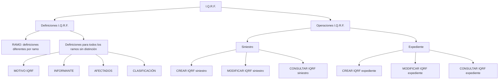

# Certificación de Siniestros — Definiciones y Operaciones I.Q.R.F.

## 1. Metadados do Documento
- **Arquivo de Origem:** Não identificado
- **Tipo de Documento:** Apresentação Executiva
- **Domínio / Sistema:** Certificación de Siniestros / I.Q.R.F.
- **Público-Alvo:** Negócio, Operação, Desenvolvedores e Arquitetos
- **Data/Versão Identificada:** Não identificada

---

## 2. Resumo Executivo & Contexto de Negócio

O documento apresenta definições e operações relacionadas a I.Q.R.F. no contexto de certificação de sinistros (`siniestros`) e expedientes (`expedientes`). I.Q.R.F. é associado a quatro categorias de registro: Incidência, Queja, Reclamación e Felicitación.

A apresentação separa o conteúdo em dois grupos principais: definições I.Q.R.F. e operações I.Q.R.F. As definições incluem elementos que podem variar por ramo (`RAMO`) e elementos aplicáveis a todos os ramos sem distinção.

Para todos os ramos, o documento relaciona as definições de motivo I.Q.R.F., informante, afetados e classificação. Esses elementos caracterizam uma Incidência, Queja, Reclamación ou Felicitación.

As operações I.Q.R.F. permitem criar, modificar e consultar registros I.Q.R.F. vinculados a um sinistro ou a um expediente. O documento não detalha métodos HTTP, contratos JSON, autenticação, persistência, regras de transição de estado ou validações específicas por operação.

---

## 3. Arquitetura, Componentes & Tecnologias Envolvidas

O conteúdo cita I.Q.R.F., `RS`, soluções, APIs, documentação e Zeus, mas não fornece detalhamento técnico sobre arquitetura de software, interfaces, tecnologias, ambientes ou integração entre esses elementos.

| Componente / Termo | Papel identificado no documento | Detalhamento disponível |
| :--- | :--- | :--- |
| I.Q.R.F. | Domínio de definições e operações para Incidencia, Queja, Reclamación ou Felicitación | Há operações de criação, modificação e consulta |
| Siniestro | Entidade associada às operações I.Q.R.F. | Permite criar, modificar e consultar I.Q.R.F. |
| Expediente | Entidade associada às operações I.Q.R.F. | Permite criar, modificar e consultar I.Q.R.F. |
| RAMO | Critério para definições diferenciadas | Não especifica os ramos existentes |
| RS | Termo exibido no documento | Significado não detalhado |
| Zeus | Termo exibido na navegação ou referência documental | Papel técnico não detalhado |
| APIs | Termo exibido na navegação ou referência documental | APIs não são descritas |



---

## 4. Regras de Negócio, Especificações Funcionais & Processos

### 4.1 Definições I.Q.R.F.

1. O documento indica que existem definições diferentes por `RAMO`.
2. A definição I.Q.R.F. contempla valores por defeito e validações das informações de I.Q.R.F.
3. O documento não informa quais são os valores por defeito, quais validações são aplicadas ou como as definições variam entre ramos.
4. Existem definições aplicáveis a todos os ramos sem distinção:
   - **MOTIVO IQRF:** definição dos motivos de uma Incidencia, Queja, Reclamación ou Felicitación.
   - **INFORMANTE:** definição dos possíveis informantes de uma Incidencia, Queja, Reclamación ou Felicitación.
   - **AFECTADOS:** definição dos possíveis afetados por uma Incidencia, Queja, Reclamación ou Felicitación.
   - **CLASIFICACIÓN:** definição da classificação de uma Incidencia, Queja, Reclamación ou Felicitación.

### 4.2 Operações I.Q.R.F.

| Operação | Entidade associada | Regra funcional explicitada |
| :--- | :--- | :--- |
| CREAR IQRF siniestro | Siniestro | Permite registrar uma Incidencia, Queja, Reclamación ou Felicitación em um sinistro |
| MODIFICAR IQRF siniestro | Siniestro | Permite alterar uma Incidencia, Queja, Reclamación ou Felicitación em sinistros |
| CONSULTAR IQRF siniestro | Siniestro | Mostra toda a informação I.Q.R.F. de um sinistro |
| CREAR IQRF expediente | Expediente | Permite registrar uma Incidencia, Queja, Reclamación ou Felicitación em um expediente |
| MODIFICAR IQRF expediente | Expediente | Permite alterar uma Incidencia, Queja, Reclamación ou Felicitación em um expediente |
| CONSULTAR IQRF expediente | Expediente | Mostra toda a informação I.Q.R.F. de um expediente |

---

## 5. Tabelas de Parâmetros, Ambientes e Estruturas de Dados

| Item / Parâmetro | Descrição / Função | Tipo / Valores / Formato | Ambiente / Observações |
| :--- | :--- | :--- | :--- |
| RAMO | Base para definições diferentes de I.Q.R.F. | Não especificado | O documento não lista ramos nem regras específicas |
| Valores por defeito I.Q.R.F. | Valores padrão da informação I.Q.R.F. | Não especificado | Mencionados, mas não detalhados |
| Validações I.Q.R.F. | Validações da informação I.Q.R.F. | Não especificado | Mencionadas, mas não detalhadas |
| MOTIVO IQRF | Motivos de Incidencia, Queja, Reclamación ou Felicitación | Não especificado | Aplicável a todos os ramos sem distinção |
| INFORMANTE | Possíveis informantes de Incidencia, Queja, Reclamación ou Felicitación | Não especificado | Aplicável a todos os ramos sem distinção |
| AFECTADOS | Possíveis afetados de Incidencia, Queja, Reclamación ou Felicitación | Não especificado | Aplicável a todos os ramos sem distinção |
| CLASIFICACIÓN | Classificação de Incidencia, Queja, Reclamación ou Felicitación | Não especificado | Aplicável a todos os ramos sem distinção |
| CREAR IQRF siniestro | Registro de I.Q.R.F. em sinistro | Operação | Sem detalhes de entrada, saída ou validação |
| MODIFICAR IQRF siniestro | Alteração de I.Q.R.F. em sinistro | Operação | Sem detalhes de entrada, saída ou validação |
| CONSULTAR IQRF siniestro | Consulta de I.Q.R.F. de sinistro | Operação | Exibe toda a informação I.Q.R.F. do sinistro |
| CREAR IQRF expediente | Registro de I.Q.R.F. em expediente | Operação | Sem detalhes de entrada, saída ou validação |
| MODIFICAR IQRF expediente | Alteração de I.Q.R.F. em expediente | Operação | Sem detalhes de entrada, saída ou validação |
| CONSULTAR IQRF expediente | Consulta de I.Q.R.F. de expediente | Operação | Exibe toda a informação I.Q.R.F. do expediente |

---

## 6. Bateria de Perguntas & Respostas para RAG (FAQ Sintético)

### P1: Qual é o escopo funcional apresentado para I.Q.R.F.?
**R:** O documento apresenta definições e operações I.Q.R.F. relacionadas a Incidencia, Queja, Reclamación ou Felicitación, vinculadas a sinistros e expedientes.

### P2: Quais categorias são tratadas pelo domínio I.Q.R.F.?
**R:** O domínio I.Q.R.F. trata Incidencia, Queja, Reclamación e Felicitación. O documento não fornece definições conceituais adicionais para cada categoria.

### P3: As definições I.Q.R.F. podem variar conforme o ramo?
**R:** Sim. O documento declara que existem “Definiciones diferentes por Ramo”, mas não informa quais ramos existem nem descreve as diferenças entre eles.

### P4: Quais definições I.Q.R.F. se aplicam a todos os ramos sem distinção?
**R:** As definições aplicáveis a todos os ramos são MOTIVO IQRF, INFORMANTE, AFECTADOS e CLASIFICACIÓN.

### P5: O que representa MOTIVO IQRF?
**R:** MOTIVO IQRF corresponde à definição dos motivos de uma Incidencia, Queja, Reclamación ou Felicitación.

### P6: Qual é a finalidade da operação CREAR IQRF siniestro?
**R:** CREAR IQRF siniestro permite registrar uma Incidencia, Queja, Reclamación ou Felicitación associada a um sinistro.

### P7: Qual é a diferença entre CREAR IQRF expediente e CREAR IQRF siniestro?
**R:** CREAR IQRF expediente registra uma Incidencia, Queja, Reclamación ou Felicitación em um expediente. CREAR IQRF siniestro registra a mesma categoria de informação em um sinistro.

### P8: O que a operação CONSULTAR IQRF siniestro retorna?
**R:** CONSULTAR IQRF siniestro mostra toda a informação I.Q.R.F. de um sinistro. O documento não especifica os campos retornados, o formato da resposta ou filtros de consulta.

### P9: Há operações de modificação para I.Q.R.F.?
**R:** Sim. MODIFICAR IQRF siniestro permite alterar uma Incidencia, Queja, Reclamación ou Felicitación em sinistros, e MODIFICAR IQRF expediente permite alterar essas informações em expedientes.

### P10: O documento descreve valores padrão e validações para I.Q.R.F.?
**R:** O documento indica que a definição I.Q.R.F. inclui valores por defeito e validações da informação I.Q.R.F., mas não informa os valores padrão nem as regras de validação.

### P11: Quais detalhes técnicos das APIs I.Q.R.F. estão disponíveis?
**R:** Nenhum detalhe técnico de API é apresentado. O conteúdo cita “APIs”, mas não fornece endpoints, métodos HTTP, contratos JSON, autenticação, códigos de resposta ou integração técnica.

### P12: Quem pode ser definido como informante ou afetado em I.Q.R.F.?
**R:** O documento informa que existem definições de possíveis informantes e possíveis afetados para Incidencia, Queja, Reclamación ou Felicitación, mas não lista os valores possíveis.

---

## 7. Glossário de Termos, Siglas & Conceitos-Chave

- **I.Q.R.F.:** Sigla utilizada no documento para o conjunto de definições e operações relacionadas a Incidencia, Queja, Reclamación ou Felicitación. A expansão formal da sigla não é fornecida.
- **Incidencia:** Categoria de registro citada no contexto I.Q.R.F.; não possui definição adicional no documento.
- **Queja:** Categoria de registro citada no contexto I.Q.R.F.; não possui definição adicional no documento.
- **Reclamación:** Categoria de registro citada no contexto I.Q.R.F.; não possui definição adicional no documento.
- **Felicitación:** Categoria de registro citada no contexto I.Q.R.F.; não possui definição adicional no documento.
- **Siniestro:** Entidade para a qual há operações de criação, modificação e consulta de I.Q.R.F.
- **Expediente:** Entidade para a qual há operações de criação, modificação e consulta de I.Q.R.F.
- **RAMO:** Critério pelo qual o documento informa existirem definições I.Q.R.F. diferenciadas.
- **MOTIVO IQRF:** Definição dos motivos de uma Incidencia, Queja, Reclamación ou Felicitación.
- **INFORMANTE:** Definição dos possíveis informantes de uma Incidencia, Queja, Reclamación ou Felicitación.
- **AFECTADOS:** Definição dos possíveis afetados de uma Incidencia, Queja, Reclamación ou Felicitación.
- **CLASIFICACIÓN:** Definição da classificação de uma Incidencia, Queja, Reclamación ou Felicitación.
- **RS:** Termo apresentado no documento sem expansão ou explicação.
- **Zeus:** Termo apresentado no documento sem descrição funcional ou técnica.

---

## 8. Notas Críticas, Riscos & Limitações

- **Nota de Análise:** O documento cita APIs, mas não detalha endpoints, métodos HTTP, contratos JSON, autenticação, autorização, mensagens de erro ou mecanismos de integração.
- **Nota de Análise:** O documento menciona valores por defeito e validações de I.Q.R.F., porém não especifica os valores, regras, obrigatoriedade de campos ou critérios de rejeição.
- **Nota de Análise:** As definições diferenciadas por `RAMO` são citadas, mas os ramos e suas regras específicas não são informados.
- **Nota de Análise:** Os possíveis valores de motivo, informante, afetados e classificação não são listados.
- **Nota de Análise:** Os termos `RS` e `Zeus` aparecem no conteúdo, mas não possuem detalhamento que permita estabelecer sua função no processo I.Q.R.F.
- **Nota de Análise:** Não há informações sobre ambientes, URLs, servidores, rotas de logs, versões, dependências externas ou responsabilidades de equipes.

---

## 9. Conteúdo Bruto Estruturado (Referência Fiel)

```text
--- [PÁGINA 1 DE 2] ---

CERTIFICACIÓN de SINIESTROS - I.Q.R.F.
Definiciones I.Q.R.F.
Operaciones I.Q.R.F
DEFINICIONES
RAMO
Definiciones diferentes por Ramo
DEFINICIÓN IQRF
Definición de los valores por defecto y validaciones de la información de IQRF
I.Q.R.F.
 / 
 RS
Inicio Soluciones APIs Documentación Zeus
ES


--- [PÁGINA 2 DE 2] ---

Definiciones para todos los ramos sin distinción
MOTIVO IQRF
Definición de los motivos de una Incidencia,
Queja, Reclamación o Felicitación
INFORMANTE
Definición de los posibles informantes de una
Incidencia, Queja, Reclamación o Felicitación
AFECTADOS
Definición de los posibles afectados por una
Incidencia, Queja, Reclamación o Felicitación
CLASIFICACIÓN
Definición de la clasificación de una
Incidencia, Queja, Reclamación o Felicitación
OPERACIONES
I.Q.R.F.
Todas las Operaciones que se pueden realizar I.Q.R.F.
CREAR IQRF siniestro
Permite registrar una Incidencia, Queja,
Reclamación o Felicitación a un siniestro
MODIFICAR IQRF siniestro
Permite cambiar una Incidencia, Queja,
Reclamación o Felicitación a un siniestros
CREAR IQRF expediente
Permite registrar una Incidencia, Queja,
Reclamación o Felicitación a un expediente
MODIFICAR IQRF expediente
Permite cambiar una Incidencia, Queja,
Reclamación o Felicitación a un expediente.
CONSULTAR IQRF siniestro
Muestra toda la información de IQRF de un
siniestro
CONSULTAR IQRF expediente
Muestra toda la información de IQRF de un
expediente
```
