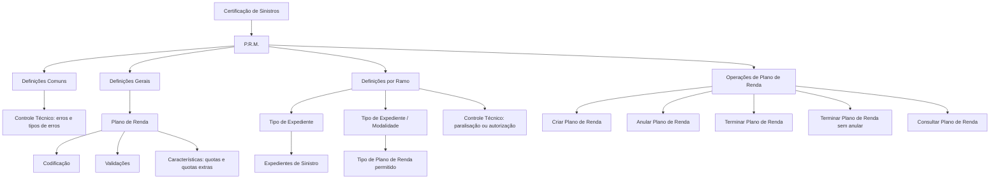
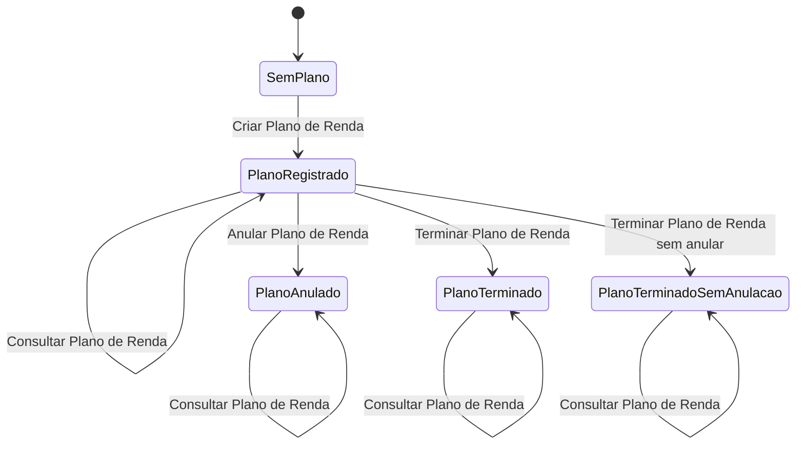

# Certificação de Sinistros — Definições e Operações de P.R.M.

## 1. Metadados do Documento
- **Arquivo de Origem:** `Não identificado no conteúdo fornecido`
- **Tipo de Documento:** `Apresentação Executiva / Manual Funcional resumido`
- **Domínio / Sistema:** `Certificação de Sinistros — P.R.M.`
- **Público-Alvo:** `Negócio, analistas funcionais, operação e equipes técnicas`
- **Data/Versão Identificada:** `Não identificada`

---

## 2. Resumo Executivo & Contexto de Negócio

O documento descreve definições e operações relacionadas ao P.R.M. no contexto de certificação de sinistros. O conteúdo organiza o domínio em níveis de definição — comum, geral e ramo — e enumera as operações disponíveis para planos de renda.

No nível **Comum**, o documento posiciona definições que não são exclusivas do módulo de sinistros, mas que são necessárias para realizar a configuração. Entre essas definições está o controle técnico, utilizado para definir erros e tipos de erros das operações do P.R.M.

No nível **Geral**, o documento descreve definições que impactam todos os possíveis expedientes que possuem um plano de renda. Esse nível abrange a codificação e validações dos planos de renda e suas características, como número de quotas e existência de quotas extras.

No nível **Ramo**, o documento concentra definições aplicáveis a todos os possíveis expedientes de um sinistro. São definidos os tipos de expediente por ramo que trabalham com planos de renda, a associação entre ramo, tipo de expediente, modalidade e tipo de plano de renda, além de condições de controle técnico que podem paralisar operações ou exigir autorização.

O documento também apresenta o conjunto de operações de ciclo de vida de um plano de renda: criar, anular, terminar, terminar sem anular e consultar. Não há detalhamento de telas, métodos HTTP, contratos de integração, regras de cálculo, perfis de autorização ou fluxos técnicos de execução.

---

## 3. Arquitetura, Componentes & Tecnologias Envolvidas

Os componentes funcionais explicitamente mencionados são:

- **Certificação de Sinistros:** contexto funcional apresentado no documento.
- **P.R.M.:** domínio para o qual são definidas configurações, controle técnico e operações de plano de renda.
- **Plano de Renda:** entidade funcional registrada, cancelada, finalizada ou consultada no expediente.
- **Expediente:** elemento que pode possuir um plano de renda.
- **Ramo:** dimensão utilizada para classificar e associar tipos de expediente, modalidades e planos de renda.
- **Tipo de Expediente:** definição por ramo para expedientes que trabalham com planos de renda.
- **Modalidade:** dimensão associada, juntamente com ramo e tipo de expediente, ao tipo de plano de renda permitido.
- **Controle Técnico:** definição de erros, tipos de erros e condições capazes de paralisar operações ou obrigar autorização.



> **Nota de Análise:** o documento não identifica arquitetura de software, microsserviços, bancos de dados, URLs, ambientes, tecnologias de implementação, protocolos ou contratos de integração.

---

## 4. Regras de Negócio, Especificações Funcionais & Processos

### 4.1 Definições no nível Comum

O nível **Comum** contém definições que não são exclusivas do módulo de sinistros, mas são necessárias para realizar a definição no contexto do P.R.M.

A definição explicitamente indicada nesse nível é:

- **Controle Técnico:** definição de erros e tipos de erros para as operações do P.R.M.

O documento não detalha:
- Quais erros existem.
- Quais tipos de erro podem ser configurados.
- Como os erros são classificados.
- Quais operações do P.R.M. são afetadas por cada erro.
- Como as mensagens, códigos ou tratamentos de erro são apresentados.

### 4.2 Definições no nível Geral

O nível **Geral** contém definições que afetam todos os possíveis expedientes que possuem um plano de renda.

As definições descritas são:

1. **Plano de Renda**
   - Permite definir a codificação dos possíveis planos de renda.
   - Permite definir validações dos possíveis planos de renda.

2. **Características**
   - Permite definir características do plano de renda.
   - Inclui o número de quotas.
   - Inclui a indicação de existência de quotas extras.

O documento não especifica valores permitidos, formatos de codificação, regras de validação, fórmulas de cálculo, periodicidade das quotas ou critérios para quotas extras.

### 4.3 Definições no nível Ramo

O nível **Ramo** contém definições que afetam todos os possíveis expedientes de um sinistro.

As definições descritas são:

1. **Tipo de Expediente**
   - Define os tipos de expediente por ramo que trabalharão com planos de renda.

2. **Tipo de Expediente / Modalidade**
   - Permite associar, por ramo, tipo de expediente e modalidade, qual tipo de plano de renda pode ser associado.

3. **Controle Técnico**
   - Define condições que podem paralisar as operações de plano de renda.
   - Define condições que tornam obrigatória a autorização das operações de plano de renda.

O documento não determina:
- A lista de ramos.
- Os tipos de expediente disponíveis.
- As modalidades disponíveis.
- As combinações válidas entre ramo, tipo de expediente, modalidade e plano de renda.
- As condições concretas que paralisam uma operação.
- Os responsáveis ou perfis autorizadores.
- O procedimento para solicitar, aprovar ou rejeitar uma autorização.

### 4.4 Operações de Plano de Renda

| Operação | Finalidade funcional | Condição ou observação explicitamente descrita |
| :--- | :--- | :--- |
| Criar Plano de Renda | Registrar o plano de renda no expediente. | O documento não descreve campos obrigatórios nem validações. |
| Anular Plano de Renda | Cancelar um plano de renda. | O documento não define efeitos sobre quotas ou expedientes. |
| Terminar Plano de Renda | Finalizar um plano de renda quando ele não terá mais quotas. | A ausência de futuras quotas é a condição descrita. |
| Terminar Plano de Renda sem anular | Finalizar um plano de renda sem cancelá-lo. | O documento distingue finalização de cancelamento, sem detalhar implicações adicionais. |
| Consultar Plano de Renda | Mostrar toda a informação do P.R.M. | O documento não lista os dados exibidos. |

### 4.5 Fluxo funcional inferido exclusivamente das operações descritas



> **Nota de Análise:** o diagrama representa somente os estados sugeridos pelos nomes das operações. O documento não especifica formalmente uma máquina de estados, transições permitidas, reversões, pré-condições ou pós-condições.

---

## 5. Tabelas de Parâmetros, Ambientes e Estruturas de Dados

| Item / Parâmetro | Descrição / Função | Tipo / Valores / Formato | Ambiente / Observações |
| :--- | :--- | :--- | :--- |
| P.R.M. | Domínio funcional para o qual são apresentadas definições e operações. | Sigla não expandida no documento. | Contexto de certificação de sinistros. |
| Controle Técnico — nível Comum | Define erros e tipos de erros para operações do P.R.M. | Erros e tipos de erros não especificados. | Não exclusivo do módulo de sinistros, mas necessário para a definição. |
| Plano de Renda | Entidade funcional que pode ser registrada no expediente. | Codificação e validações mencionadas; formatos não especificados. | Afeta expedientes que possuem plano de renda. |
| Codificação do Plano de Renda | Define a codificação dos possíveis planos de renda. | Não especificado. | Nível Geral. |
| Validações do Plano de Renda | Define validações dos possíveis planos de renda. | Não especificado. | Nível Geral. |
| Características do Plano de Renda | Define características do plano de renda. | Inclui número de quotas e indicação de quotas extras. | Nível Geral. |
| Número de quotas | Característica do plano de renda. | Formato e limites não especificados. | Nível Geral. |
| Quotas extras | Característica que indica se o plano possui quotas extras. | Valores não especificados. | Nível Geral. |
| Ramo | Dimensão para definição de expedientes e associação de planos de renda. | Lista de valores não especificada. | Nível Ramo. |
| Tipo de Expediente | Define tipos de expediente por ramo que trabalham com planos de renda. | Lista de valores não especificada. | Nível Ramo. |
| Modalidade | Dimensão usada na associação com ramo, tipo de expediente e tipo de plano de renda. | Lista de valores não especificada. | Nível Ramo. |
| Tipo de Plano de Renda | Tipo de plano que pode ser associado conforme ramo, tipo de expediente e modalidade. | Tipos não especificados. | Nível Ramo. |
| Controle Técnico — nível Ramo | Define condições que podem paralisar operações ou exigir autorização. | Condições e autorizações não especificadas. | Aplicável às operações de plano de renda. |
| Criar Plano de Renda | Registra o plano de renda no expediente. | Operação funcional. | Sem detalhamento de interface ou integração. |
| Anular Plano de Renda | Cancela um plano de renda. | Operação funcional. | Sem detalhamento de efeitos. |
| Terminar Plano de Renda | Finaliza o plano quando não haverá mais quotas. | Operação funcional. | Condição explicitamente mencionada: inexistência de futuras quotas. |
| Terminar Plano de Renda sem anular | Finaliza o plano sem cancelá-lo. | Operação funcional. | Diferença entre finalizar e cancelar não é detalhada. |
| Consultar Plano de Renda | Exibe toda a informação do P.R.M. | Operação funcional. | Campos da consulta não especificados. |
| Ambientes | Não mencionados. | Não aplicável. | O documento não fornece URLs, servidores ou identificadores de ambiente. |
| Logs | Não mencionados. | Não aplicável. | O documento não fornece caminhos, variáveis ou políticas de log. |

---

## 6. Bateria de Perguntas & Respostas para RAG (FAQ Sintético)

### P1: Qual é o objetivo do documento de Certificação de Sinistros — P.R.M.?
**R:** O documento apresenta definições e operações do P.R.M. no contexto de certificação de sinistros. O conteúdo organiza as definições nos níveis Comum, Geral e Ramo, além de listar as operações disponíveis para um plano de renda.

### P2: O que é definido no nível Comum do P.R.M.?
**R:** No nível Comum são apresentadas definições que não são exclusivas do módulo de sinistros, mas são necessárias para realizar a definição. O documento cita o Controle Técnico, responsável por definir erros e tipos de erros para as operações do P.R.M.

### P3: Quais elementos são definidos no nível Geral para expedientes com plano de renda?
**R:** O nível Geral define elementos que afetam todos os possíveis expedientes que possuem um plano de renda. Esses elementos incluem o Plano de Renda, com sua codificação e validações, e as Características do plano, como número de quotas e existência de quotas extras.

### P4: O documento informa como deve ser codificado um plano de renda?
**R:** Não. O documento informa que o Plano de Renda inclui a definição da codificação dos possíveis planos e suas validações, mas não apresenta formatos, padrões de código, valores permitidos ou exemplos de codificação.

### P5: Quais características de um plano de renda são explicitamente mencionadas?
**R:** O documento menciona que as características do plano de renda incluem o número de quotas e a existência de quotas extras. Não são fornecidos limites, formatos, periodicidade ou regras de cálculo dessas quotas.

### P6: Qual é a finalidade da definição Tipo de Expediente no nível Ramo?
**R:** A definição Tipo de Expediente estabelece os tipos de expediente por ramo que trabalharão com planos de renda. O documento não apresenta a lista dos ramos nem dos tipos de expediente disponíveis.

### P7: Como é associada a elegibilidade de um tipo de plano de renda?
**R:** A associação é definida por ramo, tipo de expediente e modalidade. A definição Tipo de Expediente/Modalidade permite determinar qual tipo de plano de renda pode ser associado para cada combinação desses elementos.

### P8: O que o Controle Técnico pode fazer no nível Ramo?
**R:** No nível Ramo, o Controle Técnico define condições que podem paralisar as operações de plano de renda ou tornar obrigatória a autorização dessas operações. O documento não descreve quais condições existem nem quais perfis realizam as autorizações.

### P9: O que faz a operação Criar Plano de Renda?
**R:** A operação Criar Plano de Renda permite registrar um plano de renda no expediente. O documento não detalha dados obrigatórios, validações, permissões, telas ou integrações necessárias para o registro.

### P10: Quando deve ser utilizada a operação Terminar Plano de Renda?
**R:** A operação Terminar Plano de Renda permite finalizar o plano de renda quando ele não terá mais quotas. O documento não especifica se a finalização é automática ou manual, nem quais efeitos gera sobre o expediente.

### P11: Qual é a diferença documentada entre Terminar Plano de Renda e Terminar Plano de Renda sem anular?
**R:** Terminar Plano de Renda permite finalizar um plano quando ele não terá mais quotas. Terminar Plano de Renda sem anular permite finalizar o plano sem cancelá-lo. O documento não detalha a diferença operacional, contábil ou funcional entre finalização com e sem anulação.

### P12: O que é exibido pela operação Consultar Plano de Renda?
**R:** A operação Consultar Plano de Renda mostra toda a informação do P.R.M. O documento não especifica quais campos, históricos, estados, dados de quotas ou mensagens são apresentados na consulta.

---

## 7. Glossário de Termos, Siglas & Conceitos-Chave

- **P.R.M.:** sigla utilizada pelo documento para identificar o domínio cujas definições e operações são apresentadas. O significado expandido da sigla não é informado.
- **Certificação de Sinistros:** contexto funcional no qual o P.R.M. é apresentado.
- **Sinistro:** domínio mencionado pelo documento para classificação de expedientes por ramo. O documento não fornece uma definição adicional.
- **Expediente:** entidade que pode possuir um plano de renda e que pode ser classificada por ramo, tipo de expediente e modalidade.
- **Plano de Renda:** entidade funcional que pode ser registrada, anulada, terminada, terminada sem anulação ou consultada.
- **Quota:** elemento característico do plano de renda. O documento menciona número de quotas e quotas extras, sem definição adicional.
- **Quota Extra:** quota adicional cuja existência pode ser definida como característica de um plano de renda.
- **Ramo:** dimensão utilizada para organizar definições aplicáveis a expedientes de sinistro.
- **Tipo de Expediente:** classificação do expediente por ramo para determinar quais expedientes trabalham com planos de renda.
- **Modalidade:** dimensão associada ao ramo e ao tipo de expediente para determinar o tipo de plano de renda que pode ser associado.
- **Controle Técnico:** conjunto de definições relativas a erros, tipos de erros, paralisação de operações e obrigatoriedade de autorização.
- **Anular Plano de Renda:** operação de cancelamento de um plano de renda.
- **Terminar Plano de Renda:** operação de finalização de um plano de renda quando ele não terá mais quotas.

---

## 8. Notas Críticas, Riscos & Limitações

- O conteúdo fornecido é resumido e não especifica data, versão, autor, organização responsável ou nome do arquivo de origem.
- A sigla **P.R.M.** não é expandida no documento.
- Não são fornecidos diagramas originais, arquitetura tecnológica, integrações, APIs, contratos JSON, endpoints, métodos HTTP, bancos de dados, ambientes, URLs, servidores ou rotas de log.
- As regras de validação de planos de renda são mencionadas, mas não detalhadas.
- O documento menciona erros e tipos de erros de Controle Técnico, porém não fornece catálogo, códigos, severidades ou tratamento operacional.
- As condições capazes de paralisar operações de plano de renda ou exigir autorização não são especificadas.
- Não há matriz de permissões, perfis de acesso, responsabilidades de aprovação nem fluxo de autorização.
- O documento diferencia “terminar” de “anular” um plano de renda, mas não detalha os efeitos funcionais, financeiros, históricos ou de consulta de cada estado.
- Não há detalhamento adicional de notas de apresentador, exemplos, casos de uso ou cenários excepcionais no conteúdo fornecido.

---

## 9. Conteúdo Bruto Estruturado (Referência Fiel)

```text
--- [PÁGINA 1 DE 3] ---

CERTIFICACIÓN de SINIESTROS - P.R.M.
Definiciones P.R.M.
Operaciones P.R.M.
DEFINICIONES
COMÚN
En este nivel se encuentran definiciones que NO son exclusivas del
módulo de siniestros, pero son necesarias para poder realizar la
definición. Entre otras definiciones se encuentra:
CONTROL TÉCNICO
Definición de errores, tipos de Errores para las operaciones del P.R.M.
 / 
 RS
Inicio Soluciones APIs Documentación Zeus
ES


--- [PÁGINA 2 DE 3] ---

GENERAL
En este nivel se encuentran definiciones que afectarán a todos los
posibles expedientes que tienen un plan de renta
PLAN DE RENTA 
Definición de la codificación de los posibles
planes y sus validaciones
CARACTERÍSTICAS 
Definición de las características del plan de
renta, número de cuotas, si tiene cuotas
extras, etc
RAMO
En este nivel se encuentran definiciones que afectarán a todos los
posibles expedientes de un siniestro
TIPO DE EXPEDIENTE 
Definición de los tipos de expediente por
Ramo que van a trabajar con planes de Renta
TIPO EXPEDIENTE/MODALIDAD 
Permite asociar por ramo, tipo de expediente
y modalidad que tipo de plan de renta se
puede asociar
CONTROL TÉCNICO
Definición de las condiciones que puede
paralizar las operaciones de plan de renta u
obligación de ser autorizada
OPERACIONES
PLAN DE RENTA
Operaciones que se pueden realizar con un Plan de Renta


--- [PÁGINA 3 DE 3] ---

CREAR Plan Renta
Permite registrar el Plan de Renta al
expediente
ANULAR Plan Renta
Permite cancelar un Plan de Renta
TERMINAR Plan Renta
Permite finalizar el Plan de Renta cuando este
ya no va a tener más cuotas
TERMINAR Plan Renta sin anular
Permite finalizar el Plan de Renta sin
cancelarlo
CONSULTAR Plan Renta
Muestra toda la información del P.R.M
```
