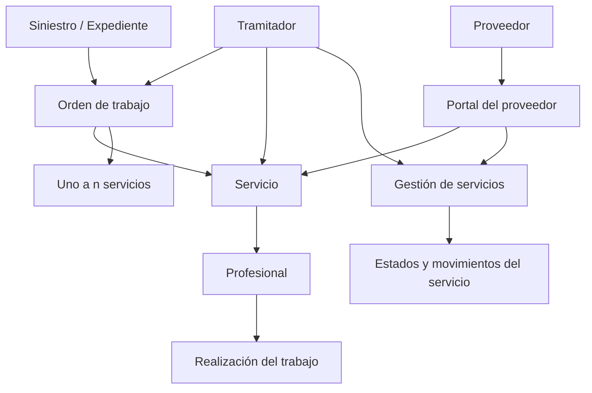
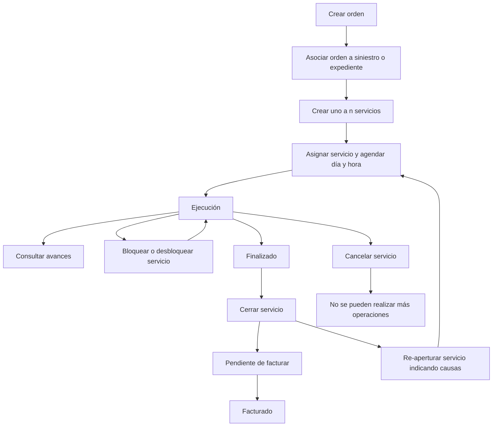

# Certificação de Sinistros — Definições e Operações de Serviços

## 1. Metadados do Documento
- **Arquivo de Origem:** Não identificado
- **Tipo de Documento:** Apresentação Executiva
- **Domínio / Sistema:** Certificação de Sinistros — Serviços
- **Público-Alvo:** Tramitadores, provedores e equipes de operação de sinistros
- **Data/Versão Identificada:** Não identificada

---

## 2. Resumo Executivo & Contexto de Negócio

O documento descreve definições e operações relacionadas a serviços associados a sinistros ou expedientes. O domínio organiza informações necessárias para administrar provedores, ordens de trabalho, solicitações de serviço, agendamentos, bloqueios, notificações e mudanças de estado.

As definições são segmentadas em três níveis: **Comum**, contendo dados não exclusivos do módulo de sinistros; **General**, contendo definições aplicáveis a todos os expedientes que podem ter um serviço associado; e **Ramo**, contendo definições específicas para cada ramo. Entre os cadastros mencionados estão oficinas, causas de processo, motivos de bloqueio, motivos de bloqueio por estado e avisos de serviços.

A operação central é a criação de uma ordem de trabalho vinculada a um sinistro ou expediente. Uma ordem de trabalho pode requerer de um a “n” serviços. Cada serviço representa a solicitação de execução de um trabalho por um profissional e obrigatoriamente está inserido em uma ordem.

O fluxo operacional distribui responsabilidades entre o **tramitador** e o **provedor**, incluindo ações realizadas pelo portal do provedor. O tramitador possui funções de criação, modificação, bloqueio, desbloqueio, encerramento, cancelamento, reabertura e notificação. O provedor pode realizar determinadas operações no portal, incluindo atribuição/agendamento, alteração para estados de execução, finalizado e faturado, bloqueio, desbloqueio, encerramento e cancelamento.

O documento não descreve tecnologias, integrações, contratos de API, persistência de dados, URLs, ambientes, métodos HTTP ou regras detalhadas de transição entre todos os estados. A descrição é funcional e operacional.

---

## 3. Arquitetura, Componentes & Tecnologias Envolvidas

### Componentes e atores identificados

| Componente / Ator | Papel identificado no documento |
| :--- | :--- |
| Módulo de sinistros | Contexto no qual serviços e ordens de trabalho são associados a sinistros ou expedientes. |
| Ordem de trabalho | Entidade criada para ser associada a um sinistro/expediente; pode requerer de um a “n” serviços. |
| Serviço | Solicitação para que um profissional execute um trabalho; sempre pertence a uma ordem. |
| Tramitador | Ator com permissões para criar, modificar, bloquear, desbloquear, encerrar, cancelar, reabrir e notificar serviços. |
| Provedor | Ator que executa trabalhos e realiza determinadas operações por meio do portal. |
| Portal do provedor | Canal pelo qual o provedor pode atribuir/agendar, alterar certos estados, bloquear, desbloquear, encerrar, cancelar e consultar informações de serviços. |
| Oficinas | Cadastro comum de oficinas da companhia, incluindo meios de pagamento e contato. |
| Profissional | Responsável pela realização do trabalho solicitado por um serviço. |
| Expediente | Registro ao qual uma ordem ou serviço pode ser associado, conforme o contexto descrito. |
| Ramo | Nível de definições específicas, incluindo causas de cancelamento ou reabertura por ramo. |



> **Nota de Análise:** O documento não identifica tecnologias, bancos de dados, microsserviços, APIs, URLs, servidores, ambientes ou mecanismos de integração.

---

## 4. Regras de Negócio, Especificações Funcionais & Processos

### Estrutura de definições

1. **Nível Comum**
   - Contém definições que não são exclusivas do módulo de sinistros.
   - Essas definições são necessárias para realizar a definição de perícias.
   - Inclui o cadastro de oficinas da companhia, com meios de pagamento, meios de contato e outros dados não detalhados.

2. **Nível General**
   - Contém definições que afetam todos os possíveis expedientes aos quais um serviço pode ser associado.
   - Permite catalogar causas de processo para cancelamento ou reabertura de um serviço.
   - Permite catalogar motivos de bloqueio de um serviço.
   - Permite catalogar motivos de bloqueio conforme o estado em que o serviço se encontra.
   - Permite definir avisos por tipo de serviço, tipo de expediente, nível, trâmite e outros critérios não detalhados.

3. **Nível Ramo**
   - Contém definições para cada ramo.
   - Permite catalogar causas de processo para cancelamento ou reabertura de um serviço para cada ramo.

### Regras para ordens e serviços

1. A criação de uma ordem gera uma ordem de trabalho e a associa a um sinistro ou expediente.
2. Uma ordem pode requerer de um a “n” serviços.
3. A criação de um serviço gera uma solicitação de realização de trabalho para um profissional.
4. Todo serviço deve estar englobado em uma ordem.
5. A atribuição de serviço agenda dia e hora para o provedor iniciar o trabalho.
6. O documento fornece como exemplos de atribuição/agendamento:
   - agendar a entrada de um veículo na oficina;
   - agendar a visita de um pedreiro a um domicílio.
7. O tramitador pode modificar dados de um serviço quando considerar necessário.
8. O provedor, e somente o provedor, pode alterar o serviço para os estados **Ejecución**, **Finalizado** e **Facturado** por meio do portal.
9. O tramitador pode criar notificações manuais para o provedor.
10. O tramitador pode verificar se uma notificação manual foi lida pelo provedor.
11. O tramitador pode paralisar ou bloquear a execução de um serviço por motivos catalogados e pode desbloqueá-lo.
12. O provedor também pode bloquear e desbloquear o serviço pelo portal.
13. O encerramento de serviço indica que o serviço foi concluído, mas está pendente de faturamento.
14. O tramitador pode encerrar o serviço.
15. O provedor também pode encerrar o serviço pelo portal.
16. O cancelamento suspende a realização do serviço.
17. Após o cancelamento, não podem ser realizadas mais operações no serviço.
18. O tramitador pode cancelar o serviço.
19. O provedor também pode cancelar o serviço pelo portal.
20. O tramitador pode reabrir um serviço fechado, indicando as causas.
21. A consulta de avanços mostra movimentos ocorridos dentro do estado **Ejecución**.
22. A consulta de avanços está disponível para o tramitador e para o portal do provedor.
23. A consulta de histórico de movimentos mostra todos os estados pelos quais um serviço passou.
24. A consulta de histórico de movimentos está disponível para o tramitador e para o portal do provedor.

### Fluxo funcional reconstruído



> **Nota de Análise:** O diagrama representa relações e sequências explicitamente descritas ou diretamente inferíveis da apresentação. O documento não define uma máquina de estados formal, nem informa todas as transições permitidas entre os estados.

---

## 5. Tabelas de Parâmetros, Ambientes e Estruturas de Dados

| Item / Parâmetro | Descrição / Função | Tipo / Valores / Formato | Ambiente / Observações |
| :--- | :--- | :--- | :--- |
| Talleres | Registro de oficinas da companhia. | Inclui meios de pagamento, meios de contato e outros dados não detalhados. | Definição de nível Comum. |
| Causa Proceso — General | Catalogação de motivos para cancelar ou reabrir um serviço. | Motivos catalogados; valores não informados. | Aplicável aos possíveis expedientes associados a serviços. |
| Motivos Bloqueo | Catalogação das causas de bloqueio de um serviço. | Motivos catalogados; valores não informados. | Definição de nível General. |
| Motivos Bloqueo por Estado | Catalogação de causas de bloqueio conforme o estado do serviço. | Relação entre motivo de bloqueio e estado; valores não informados. | Definição de nível General. |
| Avisos Servicios | Definição de avisos para serviços. | Por tipo de serviço, tipo de expediente, nível, trâmite e outros critérios não detalhados. | Definição de nível General. |
| Causa Proceso — Ramo | Catalogação dos motivos de cancelamento ou reabertura de serviço por ramo. | Motivos catalogados por ramo; valores não informados. | Definição de nível Ramo. |
| Orden de trabajo | Ordem de trabalho vinculada a sinistro ou expediente. | Pode requerer de um a “n” serviços. | Criada pelo tramitador. |
| Servicio | Solicitação para execução de trabalho por um profissional. | Sempre pertence a uma ordem. | Gerenciado por tramitador e, parcialmente, pelo provedor via portal. |
| Asignar Servicio | Agendamento do início do trabalho pelo provedor. | Dia e hora. | Pode ser realizado pelo portal do provedor. |
| Ejecución | Estado de serviço no qual há movimentos consultáveis como avanços. | Estado citado explicitamente. | O provedor pode definir esse estado no portal. |
| Finalizado | Estado de serviço disponível para alteração pelo provedor. | Estado citado explicitamente. | Alterado pelo provedor via portal. |
| Facturado | Estado de serviço disponível para alteração pelo provedor. | Estado citado explicitamente. | Alterado pelo provedor via portal. |
| Cerrado | Estado que indica serviço acabado e pendente de faturamento. | Estado citado explicitamente. | Pode ser fechado por tramitador ou provedor pelo portal. |
| Cancelado | Estado que suspende a realização do serviço. | Após cancelamento, não há novas operações no serviço. | Pode ser cancelado por tramitador ou provedor pelo portal. |
| Reapertura | Reabertura de serviço fechado. | Requer indicação das causas. | Operação atribuída ao tramitador. |
| Notificaciones manuales | Notificações geradas manualmente ao provedor. | Possui indicação de leitura pelo provedor. | Geradas pelo tramitador. |
| Consultar avances | Consulta dos movimentos no estado Ejecución. | Movimentos de execução. | Disponível ao tramitador e no portal do provedor. |
| Consultar Histórico Mvtos. | Consulta de todos os estados pelos quais o serviço passou. | Histórico de estados. | Disponível ao tramitador e no portal do provedor. |

---

## 6. Bateria de Perguntas & Respostas para RAG (FAQ Sintético)

### P1: O que é uma ordem de trabalho no contexto de Certificação de Sinistros?
**R:** Uma ordem de trabalho é criada e associada a um sinistro ou expediente. Para satisfazer uma ordem de trabalho, pode ser necessário utilizar de um a “n” serviços.

### P2: Um serviço pode existir sem estar vinculado a uma ordem?
**R:** Não. O documento estabelece que um serviço representa a solicitação de realização de um trabalho a um profissional e sempre estará englobado dentro de uma ordem.

### P3: Quem pode agendar o início do trabalho de um provedor?
**R:** A atribuição de serviço permite agendar dia e hora para o provedor iniciar o trabalho. O documento informa que essa operação também pode ser realizada pelo provedor por meio do portal.

### P4: Quais estados um provedor pode atribuir diretamente a um serviço pelo portal?
**R:** O documento determina que, pelo portal, o provedor — e somente o provedor — pode colocar o serviço nos estados **Ejecución**, **Finalizado** e **Facturado**.

### P5: O que ocorre após o cancelamento de um serviço?
**R:** O cancelamento suspende a realização do serviço. A partir do estado de cancelamento, não podem ser realizadas mais operações com o serviço.

### P6: Qual é o significado do encerramento de um serviço?
**R:** O encerramento indica que o serviço foi concluído, mas continua pendente de faturamento. Essa funcionalidade pode ser realizada pelo tramitador e também pelo provedor no portal.

### P7: Quem pode reabrir um serviço fechado?
**R:** O tramitador pode reabrir um serviço que esteja fechado. A reabertura exige a indicação das causas.

### P8: Como são tratados bloqueios de serviços?
**R:** O tramitador pode intervir para paralisar ou bloquear a execução do serviço usando motivos catalogados e também pode desbloqueá-lo. Pelo portal, o provedor também pode bloquear e desbloquear o serviço.

### P9: O que são os motivos de bloqueio por estado?
**R:** São definições de nível General que permitem catalogar as causas pelas quais um serviço é bloqueado conforme o estado no qual o serviço se encontra.

### P10: Quem pode consultar os avanços de um serviço em execução?
**R:** A consulta de avanços mostra os diferentes movimentos dentro do estado **Ejecución**. Essa consulta está habilitada para o tramitador e para o portal do provedor.

### P11: Qual informação é exibida no histórico de movimentos do serviço?
**R:** A consulta de histórico de movimentos mostra todos os estados pelos quais um serviço passou. Ela está habilitada tanto para o tramitador quanto para o portal do provedor.

### P12: Para que servem as causas de processo definidas por ramo?
**R:** As causas de processo definidas por ramo permitem catalogar, para cada ramo, os motivos pelos quais se deseja cancelar ou reabrir um serviço.

---

## 7. Glossário de Termos, Siglas & Conceitos-Chave

- **Avisos Servicios:** Definições de avisos por tipo de serviço, tipo de expediente, nível, trâmite e outros critérios não detalhados.
- **Bloqueo:** Bloqueio ou paralisação da execução de um serviço por motivos catalogados.
- **Causa Proceso:** Motivo catalogado utilizado para cancelamento ou reabertura de um serviço.
- **Cerrar servicio:** Operação de encerrar um serviço concluído e pendente de faturamento.
- **Ejecución:** Estado de serviço no qual são registrados movimentos consultáveis como avanços.
- **Expediente:** Registro ao qual um serviço ou ordem de trabalho pode ser associado.
- **Facturado:** Estado de serviço que pode ser definido pelo provedor no portal.
- **Finalizado:** Estado de serviço que pode ser definido pelo provedor no portal.
- **Portal del proveedor:** Portal por meio do qual o provedor realiza operações autorizadas sobre serviços.
- **Proveedor:** Ator responsável pela realização do trabalho e autorizado a executar operações específicas pelo portal.
- **Ramo:** Nível de definições específicas para cada ramo.
- **Servicio:** Solicitação de realização de trabalho por um profissional, sempre vinculada a uma ordem.
- **Siniestro:** Sinistro ao qual uma ordem de trabalho pode ser associada.
- **Talleres:** Oficinas da companhia cadastradas com meios de pagamento, contato e outros dados.
- **Tramitador:** Ator que administra serviços, incluindo criação, modificação, bloqueio, desbloqueio, encerramento, cancelamento, reabertura e notificações.

---

## 8. Notas Críticas, Riscos & Limitações

- O documento não identifica o arquivo de origem, data, versão, autor ou sistema tecnológico específico.
- Não há detalhamento de APIs, métodos HTTP, contratos JSON, bancos de dados, filas, integrações ou ambientes.
- Não são informados os valores possíveis para causas de processo, motivos de bloqueio, ramos, avisos ou tipos de expediente.
- O documento cita os estados **Ejecución**, **Finalizado**, **Facturado**, fechado e cancelado, mas não fornece uma matriz formal de transições de estado.
- A operação de reabertura é descrita apenas para serviços fechados; o documento não esclarece se serviços cancelados podem ser reabertos.
- Há uma regra explícita de que o cancelamento impede novas operações, mas não há detalhamento técnico de como essa restrição é aplicada.
- O documento menciona que somente o provedor pode alterar o estado para Ejecución, Finalizado e Facturado no portal, porém não descreve controles de autorização ou mecanismos de auditoria.
- **Nota de Análise:** O documento lista funcionalidades do portal do provedor, mas não detalha telas, endpoints, permissões granulares ou contratos de integração.

---

## 9. Conteúdo Bruto Estruturado (Referência Fiel)

```text
--- [PÁGINA 1 DE 4] ---

CERTIFICACIÓN de SINIESTROS - SERVICIOS
Definiciones Servicios
Operaciones Servicios
DEFINICIONES
COMÚN
En este nivel se encuentran definiciones que NO son exclusivas del
módulo de siniestros, pero son necesarias para poder realizar la
definición de peritaciones. En otros se encuentran:
TALLERES
Registrar todos los talleres de la compañía con sus medios de pago, medio de contacto, etc
 / 
 RS
Inicio Soluciones APIs Documentación Zeus
ES


--- [PÁGINA 2 DE 4] ---

GENERAL
En este Nivel se encuentran definiciones que afectarán a todos los
posibles expedientes a los que se les pueda asociar un servicio. Entre
otros se define:
CAUSA PROCESO
Permite catalogar los motivos por los que se
quiere cancelar un servicio o reaperturar un
servicio
MOTIVOS BLOQUEO
Permite catalogar las causas por las que se
bloquea un servicio
MOTIVOS BLOQUEO POR ESTADO
Permite catalogar las causas por las que se
bloquea un servicio en función del estado en
el que se encuentra.
AVISOS SERVICIOS
Permite definir los avisos por tipo de servicio,
tipo de expediente, nivel, trámite etc
RAMO
En este Nivel se encuentran definiciones para cada ramo
CAUSA PROCESO
Permite catalogar los motivos por los que se quiere realizar la cancelación o reapertura de un
servicio para cada ramo
OPERACIONES
SERVICIOS
Operaciones se pueden realizar con los servicios de los proveedores


--- [PÁGINA 3 DE 4] ---

CREAR orden
Permite generar una orden de trabajo y
asociarla a un siniestro/expediente. Para
satisfacer una orden puede necesitarse de
uno a "n" servicios
CREAR servicio
Permite generar la petición de la realización
de un trabajo a un profesional, que siempre
estará englobado dentro una orden
ASIGNAR Servicio
Agendar día y hora para que el proveedor
comience el trabajo. Ejemplo: Agendar al
taller cuando entra un vehículo, agendar a
una albañil cuando tiene que ir a un
domicilio...
Desde el portal, el proveedor también puede
realizar esta operación.
MODIFICAR servicio
El tramitador podrá modificar datos del
servicio cuando así lo considere
MODIFICAR estados
Desde el portal el proveedor y sólo el
proveedor, podrá poner el servicio en
Ejecución, Finalizado y Facturado.
CREAR notificaciones manuales
El tramitador puede generar notificaciones
manualmente al proveedor. El tramitador
puede visualizar si esta ha sido leída por el
proveedor
GESTIONAR Bloqueos
El tramitador, puede intervenir para paralizar,
bloquear la ejecución del servicio, por motivos
catalogados o para desbloquear el mismo.
Desde el portal, el proveedor también puede
realizar ambas operaciones, bloquear y
desbloquear el servicio.
CERRAR servicio
El tramitador puede cerrar el servicio, este
estado indica que el servicio está acabado,
pendiente de facturar.
Desde el portal, el proveedor también puede
realizar esta funcionalidad
CANCELAR servicio
El tramitador puede cancelar el servicio. Este
estado indica que se suspende la realización
del servicio, desde este estado ya no se
RE-APERTURAR servicio
El tramitador puede reaperturar un servicio
que está cerrado, indicando las causas


--- [PÁGINA 4 DE 4] ---

puede realizar más operaciones con el
servicio
Desde el portal, el proveedor también puede
realizar esta funcionalidad
CONSULTAR avances
Muestra los diferentes movimientos dentro del
estado de Ejecución. Habilitado para el
tramitador y el portal del proveedor
CONSULTAR Histórico Mvtos.
Muestra todos los estados por los que ha
pasado un servicio. Habilitado para el
tramitador y el portal del proveedor
```
