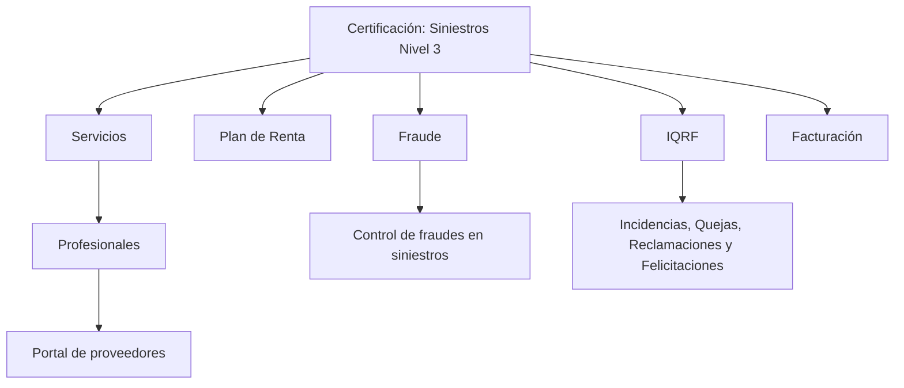

# Certificación — Siniestros Nivel 3: Temário de Operações e Módulos

## 1. Metadados do Documento
- **Arquivo de Origem:** `Não identificado no conteúdo fornecido`
- **Tipo de Documento:** `Material de certificação / apresentação de temário`
- **Domínio / Sistema:** `Siniestros Nivel 3`
- **Público-Alvo:** `Profissionais envolvidos em sinistros, serviços, fraude, faturação e portal de fornecedores`
- **Data/Versão Identificada:** `Não identificada`

---

## 2. Resumo Executivo & Contexto de Negócio

O conteúdo apresenta a certificação **Siniestros Nivel 3**, organizada como um temário de operações associadas ao contexto de sinistros. O material lista áreas funcionais que compõem o escopo da certificação.

As áreas identificadas são **Servicios**, **Plan de Renta**, **Fraude**, **IQRF** e **Facturación**. Cada área é descrita como um apartado que reúne o temário das operações correspondentes ao respectivo módulo ou domínio.

A seção **Servicios** menciona operações realizadas por profissionais em comunicação com o **portal de proveedores**. A seção **Fraude** relaciona o módulo ao controle de fraudes em sinistros.

O extrato não apresenta detalhes sobre fluxos operacionais, contratos de API, regras de cálculo, perfis de acesso, ambientes, integrações técnicas ou procedimentos específicos de cada operação. Portanto, o documento deve ser usado como referência de escopo temático, não como especificação técnica detalhada.

---

## 3. Arquitetura, Componentes & Tecnologias Envolvidas

Os componentes e domínios explicitamente citados são:

- Certificación — Siniestros Nivel 3
- Servicios
- Portal de proveedores
- Plan de Renta
- Fraude
- IQRF
- Incidencias, Quejas, Reclamaciones y Felicitaciones
- Facturación
- Soluciones
- APIs
- Documentación
- Zeus



> **Nota de Análise:** O conteúdo cita “Soluciones”, “APIs”, “Documentación” e “Zeus” na navegação, mas não explica a função técnica, integrações ou responsabilidades desses elementos.

---

## 4. Regras de Negócio, Especificações Funcionais & Processos

### Escopo da certificação

A certificação **Siniestros Nivel 3** reúne temários relacionados a operações dos seguintes domínios:

1. **Servicios**
   - Inclui operações que podem ser realizadas com serviços executados por profissionais.
   - Menciona comunicação entre profissionais e o portal de fornecedores.

2. **Plan de Renta**
   - Inclui operações que podem ser realizadas em um plano de aluguel.

3. **Fraude**
   - Inclui operações relacionadas ao controle de fraudes em sinistros.

4. **IQRF**
   - Inclui operações do módulo de Incidências, Queixas, Reclamações e Felicitações.

5. **Facturación**
   - Inclui operações do módulo de faturação.

> **Nota de Análise:** O conteúdo não detalha regras de elegibilidade, condições de validação, sequências de execução, estados de processo, métodos HTTP, mensagens de erro, contratos JSON ou responsabilidades por operação.

---

## 5. Tabelas de Parâmetros, Ambientes e Estruturas de Dados

| Item / Parâmetro | Descrição / Função | Tipo / Valores / Formato | Ambiente / Observações |
| :--- | :--- | :--- | :--- |
| Certificación — Siniestros Nivel 3 | Certificação que agrupa o temário de operações citadas no documento. | Certificação / temário | Não há versão ou data identificada. |
| Servicios | Apartado com operações relativas a serviços executados por profissionais. | Módulo / área funcional | Relacionado à comunicação com o portal de fornecedores. |
| Portal de proveedores | Portal mencionado no contexto da comunicação com profissionais. | Portal | Não há URL, autenticação ou contrato de integração informado. |
| Plan de Renta | Apartado com operações aplicáveis a um plano de aluguel. | Módulo / área funcional | Não há operações específicas detalhadas. |
| Fraude | Apartado com operações para controle de fraudes em sinistros. | Módulo / área funcional | Não há critérios de fraude ou fluxo de análise informado. |
| IQRF | Módulo associado a Incidências, Queixas, Reclamações e Felicitações. | Sigla / módulo | A expansão é inferida diretamente do texto apresentado. |
| Facturación | Apartado com operações do módulo de faturação. | Módulo / área funcional | Não há campos de fatura, impostos ou regras de cálculo informados. |
| Soluciones | Item de navegação citado no extrato. | Navegação / seção | Sem detalhamento adicional. |
| APIs | Item de navegação citado no extrato. | Navegação / seção | Não há APIs ou endpoints descritos. |
| Documentación | Item de navegação citado no extrato. | Navegação / seção | Sem detalhamento adicional. |
| Zeus | Item de navegação citado no extrato. | Sistema ou seção não especificada | O papel de Zeus não é explicado. |
| ES | Indicador de idioma exibido no extrato. | Código de idioma | Provavelmente espanhol; o documento não explicita essa definição. |

---

## 6. Bateria de Perguntas & Respostas para RAG (FAQ Sintético)

### P1: Qual é o tema principal da certificação Siniestros Nivel 3?
**R:** A certificação Siniestros Nivel 3 apresenta um temário das operações associadas a Serviços, Plano de Aluguel, Fraude, IQRF e Faturação no contexto de sinistros.

### P2: O que é tratado no apartado Servicios?
**R:** O apartado Servicios reúne o temário das operações que podem ser realizadas com serviços executados por profissionais em comunicação com o portal de fornecedores.

### P3: O documento especifica quais operações estão disponíveis no portal de fornecedores?
**R:** Não. O conteúdo informa apenas que existem operações relacionadas a serviços realizados por profissionais em comunicação com o portal de fornecedores; não lista operações, APIs, telas ou contratos específicos.

### P4: O que o módulo Fraude cobre?
**R:** O módulo Fraude abrange o temário das operações relacionadas ao controle de fraudes em sinistros.

### P5: Existem regras ou critérios de detecção de fraude no conteúdo fornecido?
**R:** Não. O documento cita o controle de fraudes em sinistros, mas não apresenta critérios, indicadores, regras de decisão, responsáveis ou etapas de tratamento.

### P6: O que significa IQRF no contexto do documento?
**R:** IQRF corresponde ao módulo de Incidências, Queixas, Reclamações e Felicitações, conforme a descrição apresentada no conteúdo.

### P7: Qual é o escopo do Plan de Renta?
**R:** O Plan de Renta contém o temário das operações que podem ser realizadas em um plano de aluguel. O extrato não detalha quais operações são essas.

### P8: O que está incluído no módulo Facturación?
**R:** O módulo Facturación inclui o temário das operações de faturação. O documento não descreve campos, regras fiscais, emissão de documentos ou integrações financeiras.

### P9: O documento descreve APIs para Siniestros Nivel 3?
**R:** Não. Embora “APIs” apareça como item de navegação, o conteúdo não apresenta endpoints, métodos HTTP, autenticação, payloads, respostas ou contratos técnicos.

### P10: Qual é a função de Zeus no material?
**R:** O termo “Zeus” aparece na navegação do conteúdo, mas sua função, integração, arquitetura ou responsabilidade não são detalhadas.

---

## 7. Glossário de Termos, Siglas & Conceitos-Chave

- **Siniestros:** Contexto de sinistros abordado pela certificação.
- **Servicios:** Área que reúne operações relacionadas a serviços realizados por profissionais.
- **Portal de proveedores:** Portal citado como meio de comunicação com profissionais envolvidos em serviços.
- **Plan de Renta:** Área que reúne operações aplicáveis a um plano de aluguel.
- **Fraude:** Área relacionada ao controle de fraudes em sinistros.
- **IQRF:** Incidências, Queixas, Reclamações e Felicitações.
- **Facturación:** Módulo ou área relacionada a operações de faturação.
- **Zeus:** Termo exibido na navegação; não possui definição no conteúdo fornecido.
- **ES:** Indicador exibido na navegação; não definido explicitamente no material.

---

## 8. Notas Críticas, Riscos & Limitações

- O conteúdo fornecido é resumido e não apresenta detalhamento operacional das áreas listadas.
- Não há identificação de arquivo, autor, data, versão ou histórico de revisões.
- Não existem URLs, ambientes, servidores, rotas de log, credenciais, parâmetros técnicos ou contratos de API.
- Não há diagramas originais, fluxos de processo, regras de negócio detalhadas ou matrizes de responsabilidade.
- **Nota de Análise:** O documento lista os módulos Servicios, Plan de Renta, Fraude, IQRF e Facturación, porém não detalha operações específicas, métodos HTTP, contratos JSON ou procedimentos de execução.

---

## 9. Conteúdo Bruto Estruturado (Referência Fiel)

```text
--- [PÁGINA 1 DE 2] ---

CERTIFICACIÓN - SINIESTROS NIVEL 3
CERTIFICACIÓN
Siniestros nivel 3
 SERVICIOS
En este apartado se encuentra el temario de
todas las operaciones que se pueden realizar
con los servicios realizados por profesionales
en comunicación con el portal de proveedores
 PLAN DE RENTA
En este apartado se encuentra el temario de
todas las operaciones que se le pueden
realizar a un plan de renta
 FRAUDE
En este apartado se encuentra el temario de
todas las operaciones que se pueden realizar
 IQRF
En este apartado se encuentra el temario de
todas las operaciones del módulo de
 / 
 RS
Inicio Soluciones APIs Documentación Zeus
ES


--- [PÁGINA 2 DE 2] ---

para el control de fraudes en siniestros
 Incidencias, Quejas,Reclamaciones y
Felicitaciones
 FACTURACIÓN
En este apartado se encuentra el temario de
todas las operaciones del módulo de
facturación
```
