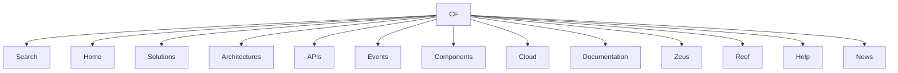

# Portal de Documentação CF — Conteúdo de Navegação Extraído

## 1. Metadados do Documento
- **Arquivo de Origem:** Não identificado
- **Tipo de Documento:** Não identificado
- **Domínio / Sistema:** CF
- **Público-Alvo:** Não identificado
- **Data/Versão Identificada:** Não identificada

---

## 2. Resumo Executivo & Contexto de Negócio

O conteúdo extraído apresenta uma interface de navegação associada a **CF**, contendo opções para acesso a recursos de documentação, arquiteturas, APIs, eventos, componentes, nuvem, ajuda e notícias.

A estrutura sugere a existência de um portal centralizado de conhecimento técnico. Entretanto, o texto não descreve objetivos de negócio, funcionalidades, processos, responsabilidades ou benefícios corporativos específicos.

O idioma exibido na navegação é `EN`. Não há conteúdo adicional que permita identificar escopo funcional, regras de negócio, arquitetura de software ou integrações.

---

## 3. Arquitetura, Componentes & Tecnologias Envolvidas

Os únicos termos de sistemas, produtos ou áreas identificados são `CF`, `Zeus` e `Reef`. O documento não explica a natureza, responsabilidade, relacionamento ou tecnologia desses termos.



> **Nota de Análise:** O conteúdo não detalha componentes técnicos, microsserviços, protocolos, contratos de API, tecnologias, ambientes ou fluxos de integração.

---

## 4. Regras de Negócio, Especificações Funcionais & Processos

Não foram identificadas regras de negócio, validações, cálculos, condições operacionais, procedimentos ou fluxos funcionais no conteúdo fornecido.

O texto apresenta exclusivamente os seguintes elementos de navegação:

1. Search  
2. Home  
3. Solutions  
4. Architectures  
5. APIs  
6. Events  
7. Components  
8. Cloud  
9. Documentation  
10. Zeus  
11. Reef  
12. Help  
13. News  
14. EN  

---

## 5. Tabelas de Parâmetros, Ambientes e Estruturas de Dados

| Item / Parâmetro | Descrição / Função | Tipo / Valores / Formato | Ambiente / Observações |
| :--- | :--- | :--- | :--- |
| CF | Identificador exibido no conteúdo extraído | Texto | Não detalhado |
| Search | Opção de navegação para pesquisa | Texto | Não detalhado |
| Home | Opção de navegação para página inicial | Texto | Não detalhado |
| Solutions | Opção de navegação para soluções | Texto | Não detalhado |
| Architectures | Opção de navegação para arquiteturas | Texto | Não detalhado |
| APIs | Opção de navegação para APIs | Texto | Não detalhado |
| Events | Opção de navegação para eventos | Texto | Não detalhado |
| Components | Opção de navegação para componentes | Texto | Não detalhado |
| Cloud | Opção de navegação para conteúdo de nuvem | Texto | Não detalhado |
| Documentation | Opção de navegação para documentação | Texto | Não detalhado |
| Zeus | Item identificado na navegação | Texto | Função não detalhada |
| Reef | Item identificado na navegação | Texto | Função não detalhada |
| Help | Opção de navegação para ajuda | Texto | Não detalhado |
| News | Opção de navegação para notícias | Texto | Não detalhado |
| EN | Indicador de idioma | Texto | Inglês |

---

## 6. Bateria de Perguntas & Respostas para RAG (FAQ Sintético)

### P1: Qual identificador principal é exibido no conteúdo extraído?
**R:** O conteúdo apresenta `CF` como identificador principal. O texto não fornece expansão, definição funcional ou contexto adicional para a sigla `CF`.

### P2: Quais seções de navegação relacionadas a tecnologia são apresentadas?
**R:** As seções relacionadas a tecnologia exibidas são `Solutions`, `Architectures`, `APIs`, `Events`, `Components`, `Cloud` e `Documentation`.

### P3: O documento descreve a arquitetura técnica de CF?
**R:** Não. O conteúdo apresenta apenas uma opção de navegação denominada `Architectures`; não há descrição de camadas, componentes, integrações, tecnologias ou padrões arquiteturais.

### P4: Quais itens específicos além das categorias gerais de navegação são mencionados?
**R:** Os itens específicos mencionados são `Zeus` e `Reef`. O texto não informa se são sistemas, produtos, módulos, projetos ou domínios.

### P5: Há URLs, endpoints, portas ou contratos de API no conteúdo?
**R:** Não. Embora exista a opção de navegação `APIs`, o conteúdo não apresenta URLs, métodos HTTP, endpoints, parâmetros, payloads, autenticação ou contratos.

### P6: Qual idioma é indicado pela interface extraída?
**R:** O indicador de idioma presente é `EN`, que corresponde a inglês.

### P7: Existe uma seção de ajuda no portal identificado?
**R:** Sim. O conteúdo inclui o item de navegação `Help`, mas não detalha quais canais, procedimentos ou materiais de suporte estão disponíveis.

### P8: O conteúdo apresenta informações sobre eventos?
**R:** O texto inclui a opção `Events`, mas não informa tipos de evento, produtores, consumidores, esquemas, mecanismos de mensageria ou procedimentos operacionais.

### P9: O conteúdo detalha recursos de nuvem?
**R:** Não. A opção `Cloud` está presente na navegação, mas não há detalhes sobre provedores, serviços, ambientes, contas, redes ou configurações de nuvem.

### P10: O conteúdo inclui acesso a notícias?
**R:** Sim. O item `News` aparece na navegação. Não há artigos, datas, fontes ou conteúdos de notícias no texto extraído.

---

## 7. Glossário de Termos, Siglas & Conceitos-Chave

- **CF:** Identificador exibido no conteúdo; significado não definido no texto.
- **API:** Sigla exibida como item de navegação. O documento não apresenta sua expansão nem especificações de interfaces.
- **EN:** Indicador de idioma em inglês.
- **Zeus:** Termo exibido na navegação; significado e função não detalhados.
- **Reef:** Termo exibido na navegação; significado e função não detalhados.

---

## 8. Notas Críticas, Riscos & Limitações

- O conteúdo extraído é limitado a elementos de navegação e não contém corpo documental técnico ou funcional.
- Não há identificação do arquivo de origem, autoria, data, versão ou classificação documental.
- Não há evidências sobre arquitetura, integrações, regras de negócio, dados, ambientes, segurança, operação ou governança.
- `Zeus`, `Reef` e `CF` são mencionados sem definição; qualquer interpretação adicional representaria inferência não sustentada pelo documento.
- Não foram identificadas Notas do Apresentador, URLs, rotas de log, parâmetros técnicos ou tabelas originais.

---

## 9. Conteúdo Bruto Estruturado (Referência Fiel)

```text
--- [PÁGINA 1 DE 1] ---

/
CF
Search Home Solutions Architectures APIs Events Components Cloud Documentation Zeus Reef Help News
EN
```
