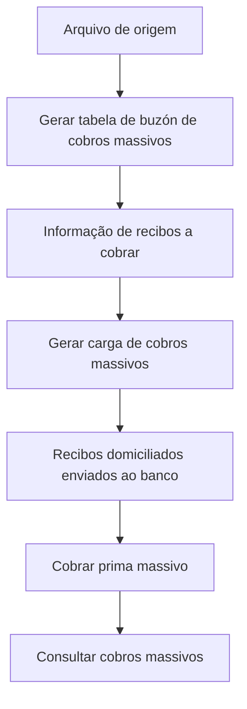
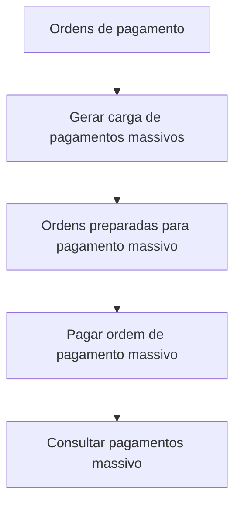

# Certificação Tesouraria Nível 3 — Definições e Operações de Tesouraria

## 1. Metadados do Documento
- **Arquivo de Origem:** Não identificado no conteúdo fornecido
- **Tipo de Documento:** Manual Operacional / Apresentação de referência
- **Domínio / Sistema:** Tesouraria
- **Público-Alvo:** Operação, Negócio e usuários do módulo de Tesouraria
- **Data/Versão Identificada:** Não identificada

---

## 2. Resumo Executivo & Contexto de Negócio

O documento apresenta conteúdos da certificação de Tesouraria nível 3, organizados em definições e operações do módulo de Tesouraria. O escopo inclui cobros antecipados, processos massivos de cobros e pagamentos, operações sobre recibos, ordens de pagamento, cheques, reaseguro e coaseguro.

Na área de cobros, o documento descreve operações para criar e anular recibos agrupados, além de criar antecipos de cobro. A criação de recibo grupo permite administrar conjuntamente múltiplos recibos vinculados a uma ou mais apólices ou a um tomador. O anticipo de cobro registra um valor em uma conta de prima em depósito até o cobro do recibo da apólice.

Na área de pagamentos, o material relaciona operações de anulação de ordens de pagamento, alteração de oficina de pagamento e tratamento de cheques danificados ou destinados à impressão. As anulações abrangem cheques, transferências e outras formas de pagamento associadas a conta de gestão, banco em efetivo ou caixa em efetivo.

O documento também apresenta processos massivos por lotes. Esses processos preparam informações de recibos e ordens de pagamento, executam cobros ou pagamentos massivos e permitem consultar o estado das operações por critérios de busca. Para reaseguro e coaseguro, é descrita uma operação para registrar abonos ou cargos associados a remesas.

---

## 3. Arquitetura, Componentes & Tecnologias Envolvidas

O conteúdo fornecido não descreve arquitetura de software, tecnologias, protocolos, bancos de dados, APIs, URLs de ambiente, servidores ou contratos de integração. O documento organiza funcionalidades do domínio de Tesouraria em categorias operacionais.

### Componentes e áreas funcionais identificadas

| Componente / Área | Finalidade descrita |
| :--- | :--- |
| Definição de Tesouraria | Apresenta definições específicas do módulo de Tesouraria. |
| Cobros antecipados | Define os tipos de cobros antecipados permitidos e suas características. |
| Processo massivo | Reúne definições necessárias ao funcionamento de processos massivos de cobros e pagamentos. |
| Cobros e devoluções | Agrupa operações relacionadas a cobros, devoluções de cobros e anulações. |
| Pagamentos | Agrupa operações relacionadas aos pagamentos realizados pela companhia. |
| Reaseguro / Coaseguro | Agrupa operações relacionadas a movimentos de reaseguro e coaseguro. |
| Processos massivos | Agrupa operações por lotes para cobros e pagamentos. |

```mermaid
flowchart TD
  T[Tesouraria] --> D[Definições]
  T --> O[Operação]

  D --> CA[Cobros antecipados]
  D --> PMD[Processo massivo]

  O --> CD[Cobros e devoluções]
  O --> P[Pagamentos]
  O --> RC[Reaseguro / Coaseguro]
  O --> PMO[Processos massivos]

  CD --> CRG[Criar recibo grupo]
  CD --> ARG[Anular recibo grupo]
  CD --> CAC[Criar anticipo cobro]

  P --> AOPT[Anular ordem de pagamento: cheque ou transferência]
  P --> AOF[Aular ordem de pagamento: outra forma de pagamento]
  P --> COP[Alterar oficina da ordem de pagamento]
  P --> CDI[Modificar cheque danificado impresso]
  P --> CDM[Modificar cheque manual danificado]
  P --> IC[Imprimir cheque]

  RC --> GCPR[Gerar cobro/pagamento de remesa]

  PMO --> GTBCM[Gerar tabela de buzón de cobros massivos]
  PMO --> GCCM[Gerar carga de cobros massivos]
  PMO --> CPM[Cobrar prima massivo]
  PMO --> CCM[Consultar cobros massivos]
  PMO --> GCPM[Gerar carga de pagamentos massivos]
  PMO --> POPM[Pagar ordem de pagamento massivo]
  PMO --> CPM2[Consultar pagamentos massivos]
```



> **Nota de Análise:** O diagrama representa exclusivamente a organização funcional descrita no documento. O conteúdo não detalha integração técnica, sequência sistêmica, responsáveis, entradas/saídas de dados ou dependências entre as operações.

---

## 4. Regras de Negócio, Especificações Funcionais & Processos

### 4.1 Definições de Tesouraria

- **Cobros antecipados:** contempla a definição dos tipos de cobros antecipados permitidos e suas características. O conteúdo fornecido não detalha quais são os tipos, critérios de elegibilidade ou características.
- **Processo massivo:** contempla as definições necessárias ao funcionamento de processos massivos de cobros e pagamentos. O conteúdo fornecido não especifica arquivos, layouts, validações ou agendamentos.

### 4.2 Cobros e devoluções

#### Criar recibo grupo
- Agrupa recibos em um único documento de cobro.
- Permite a gestão conjunta dos recibos associados.
- Os recibos agrupados podem pertencer:
  - A uma apólice grupo.
  - A várias apólices individuais.
  - A um tomador.
  - A outros contextos não detalhados, indicados pela expressão “etc.” no documento.

#### Anular recibo grupo
- Representa o movimento oposto à criação de recibo grupo.
- Desagrupa os recibos que foram associados a um documento de cobro.

#### Criar anticipo cobro
- Realiza o cobro de um importe.
- Registra o importe em uma conta de prima em depósito.
- O valor permanece em depósito até a realização do cobro do recibo da apólice.

### 4.3 Pagamentos

#### Anular ordem de pagamento por cheque ou transferência
- Anula cheques ou transferências associados a pagamentos.
- A anulação pode ocorrer com ou sem reexpedição.

#### Anular ordem de pagamento por outra forma de pagamento
- Anula ordens de pagamento pagadas por:
  - Conta de gestão.
  - Banco em efetivo.
  - Caixa em efetivo.

#### Mudar oficina da ordem de pagamento
- Modifica a oficina de pagamento de uma ordem de pagamento.

#### Modificar cheque danificado impresso
- Registra um cheque de pagamento deteriorado no momento da impressão.

#### Modificar cheque manual danificado
- Registra um cheque de pagamento deteriorado antes de sua impressão.

#### Imprimir cheque
- Imprime cheques destinados à realização de pagamentos.

### 4.4 Reaseguro e coaseguro

#### Gerar cobro/pagamento de remesa
- Registra o abono ou o cargo relacionado a remesas de coaseguro e reaseguro.

### 4.5 Processos massivos

#### Fluxo funcional de cobros massivos



1. **Gerar tabela de buzón de cobros massivos:** prepara a informação dos recibos a cobrar em um processo massivo, utilizando dados de um arquivo.
2. **Gerar carga de cobros massivos:** prepara a informação dos recibos domiciliados que serão enviados ao banco para cobro pelo processo massivo.
3. **Cobrar prima massivo:** executa o processo massivo que realiza o cobro dos recibos incluídos no processo.
4. **Consultar cobros massivos:** mostra o estado dos cobros dentro de um processo massivo utilizando diferentes critérios de busca.

#### Fluxo funcional de pagamentos massivos



1. **Gerar carga de pagamentos massivos:** prepara a informação das ordens de pagamento que serão pagadas pelo processo massivo.
2. **Pagar ordem de pagamento massivo:** executa o pagamento das ordens de pagamento que estão no processo.
3. **Consultar pagamentos massivo:** mostra o estado dos pagamentos dentro de um processo massivo utilizando diferentes critérios de busca.

---

## 5. Tabelas de Parâmetros, Ambientes e Estruturas de Dados

| Item / Parâmetro | Descrição / Função | Tipo / Valores / Formato | Ambiente / Observações |
| :--- | :--- | :--- | :--- |
| Recibo grupo | Documento de cobro que reúne recibos para gestão conjunta. | Pode incluir recibos de apólice grupo, várias apólices individuais ou tomador. | Não são informados identificadores, campos ou critérios de agrupamento. |
| Anticipo cobro | Cobro de importe mantido em depósito até o cobro do recibo da apólice. | Importe associado a conta de prima em depósito. | Não são informadas regras de liquidação, moeda ou contabilização. |
| Ordem de pagamento | Ordem associada a uma operação de pagamento. | Pode ser anulada, ter a oficina alterada ou ser incluída em processo massivo. | Não são informados campos, estados ou identificadores. |
| Cheque | Meio utilizado para realizar pagamentos. | Impresso; danificado impresso; danificado manual; anulável quando associado a pagamento. | O cheque manual danificado é registrado antes da impressão. |
| Transferência | Forma de pagamento sujeita à anulação. | Anulação com ou sem reexpedição. | Não são informadas informações bancárias, formatos ou canais. |
| Conta de gestão | Forma/contexto de pagamento citado para anulação de ordem. | Conta de gestão. | Sem detalhamento adicional. |
| Banco em efetivo | Forma/contexto de pagamento citado para anulação de ordem. | Banco em efetivo. | Sem detalhamento adicional. |
| Caixa em efetivo | Forma/contexto de pagamento citado para anulação de ordem. | Caixa em efetivo. | Sem detalhamento adicional. |
| Remesa | Elemento associado a movimentos de coaseguro e reaseguro. | Permite registrar abono ou cargo. | Não são detalhados formato, origem ou destino da remesa. |
| Arquivo de cobros massivos | Fonte de dados para preparação de recibos a cobrar. | Arquivo não especificado. | Layout, extensão e validações não informados. |
| Recibos domiciliados | Recibos preparados para envio ao banco no processo massivo. | Incluídos na carga de cobros massivos. | Banco e mecanismo de envio não detalhados. |
| Critérios de busca | Critérios usados para consultar estados de cobros e pagamentos massivos. | Diferentes critérios de busca. | O documento não lista os critérios disponíveis. |
| Ambientes | Ambientes técnicos de execução. | Não informado. | Não há URLs, servidores, portas ou nomes de ambiente. |
| Logs | Rotas, variáveis ou mecanismos de log. | Não informado. | Não há detalhes de observabilidade no conteúdo fornecido. |

---

## 6. Bateria de Perguntas & Respostas para RAG (FAQ Sintético)

### P1: Qual é a finalidade da operação “Criar recibo grupo” em Tesouraria?
**R:** A operação “Criar recibo grupo” agrupa recibos em um único documento de cobro para permitir sua gestão conjunta. Os recibos podem ser de uma apólice grupo, de várias apólices individuais ou de um tomador.

### P2: O que acontece ao anular um recibo grupo?
**R:** A operação “Anular recibo grupo” é o movimento oposto à criação do recibo grupo. Ela desagrupa os recibos que haviam sido associados a um documento de cobro.

### P3: Como funciona a criação de um anticipo de cobro?
**R:** A operação “Criar anticipo cobro” realiza o cobro de um importe para uma conta de prima em depósito. O importe permanece nessa conta até que ocorra o cobro do recibo da apólice.

### P4: Quais situações são tratadas pela anulação de ordem de pagamento por cheque ou transferência?
**R:** A operação anula cheques ou transferências associadas a pagamentos. A anulação pode ser realizada com reexpedição ou sem reexpedição.

### P5: Quais meios de pagamento são abrangidos pela anulação de ordem de pagamento por outra forma de pagamento?
**R:** A operação anula ordens de pagamento que foram pagadas por conta de gestão, banco em efetivo ou caixa em efetivo.

### P6: Qual a diferença entre cheque danificado impresso e cheque manual danificado?
**R:** O cheque danificado impresso corresponde a um cheque de pagamento deteriorado no momento da impressão. O cheque manual danificado corresponde a um cheque deteriorado antes de sua impressão.

### P7: Qual operação prepara recibos para cobrança massiva a partir de um arquivo?
**R:** A operação “Gerar tabela buzón cobros masivos” prepara a informação dos recibos a cobrar em um processo massivo utilizando os dados de um arquivo.

### P8: Qual é o papel da operação “Gerar carga cobros masivos”?
**R:** “Gerar carga cobros masivos” prepara a informação dos recibos domiciliados que serão enviados ao banco para cobrança por meio do processo massivo.

### P9: O que executa a operação “Cobrar prima masivo”?
**R:** A operação “Cobrar prima masivo” executa o processo massivo que realiza o cobro dos recibos incluídos naquele processo.

### P10: Como consultar a situação de cobros e pagamentos massivos?
**R:** “Consultar cobros masivos” mostra o estado dos cobros dentro de um processo massivo por diferentes critérios de busca. “Consultar pagos masivo” mostra o estado dos pagamentos dentro de um processo massivo também por diferentes critérios de busca.

### P11: Como são tratados pagamentos em lote?
**R:** Primeiro, a operação “Gerar carga pagos masivos” prepara a informação das ordens de pagamento que serão pagadas no processo massivo. Depois, “Pagar orden pago masivo” executa o pagamento das ordens presentes no processo.

### P12: Para que serve “Generar cobro pago remesa” em reaseguro e coaseguro?
**R:** A operação permite registrar o abono ou o cargo relacionado às remesas de coaseguro e reaseguro.

---

## 7. Glossário de Termos, Siglas & Conceitos-Chave

- **Tesouraria:** domínio funcional abordado pelo documento, contendo definições e operações relacionadas a cobros, pagamentos e processos massivos.
- **Cobro:** operação de cobrança.
- **Cobro antecipado:** cobro de um importe depositado em conta de prima até o cobro do recibo da apólice.
- **Recibo:** elemento associado a uma apólice e utilizado em operações de cobro.
- **Recibo grupo:** documento de cobro que agrupa múltiplos recibos para gestão conjunta.
- **Apólice grupo:** tipo de apólice citado como possível origem de recibos agrupados.
- **Tomador:** entidade citada como possível contexto dos recibos incluídos em um recibo grupo.
- **Ordem de pagamento:** ordem usada em operações de pagamento, anulação, alteração de oficina ou processamento massivo.
- **Oficina de pagamento:** oficina associada a uma ordem de pagamento e passível de modificação.
- **Cheque:** instrumento utilizado para realizar pagamentos e sujeito a impressão, anulação ou registro de dano.
- **Reexpedição:** possibilidade associada à anulação de cheques ou transferências por pagamentos.
- **Conta de gestão:** contexto ou meio citado para pagamento de uma ordem que pode ser anulada.
- **Banco em efetivo:** contexto ou meio citado para pagamento de uma ordem que pode ser anulada.
- **Caixa em efetivo:** contexto ou meio citado para pagamento de uma ordem que pode ser anulada.
- **Reaseguro:** área relacionada a movimentos para os quais pode ser gerado cobro ou pagamento de remesa.
- **Coaseguro:** área relacionada a movimentos para os quais pode ser gerado cobro ou pagamento de remesa.
- **Remesa:** elemento de reaseguro ou coaseguro que pode gerar registro de abono ou cargo.
- **Abono:** registro possível para remesas de coaseguro e reaseguro.
- **Cargo:** registro possível para remesas de coaseguro e reaseguro.
- **Processo massivo:** processo por lotes para preparação, execução e consulta de cobros ou pagamentos.
- **Recibo domiciliado:** recibo preparado para envio ao banco no processo de cobros massivos.
- **Buzón de cobros massivos:** tabela gerada para preparar informações dos recibos a cobrar a partir de um arquivo.

---

## 8. Notas Críticas, Riscos & Limitações

- O conteúdo não identifica o arquivo de origem, versão, data de publicação, autor, sistema técnico ou ambiente operacional.
- Não são descritos contratos de API, integrações, formatos de arquivos, layouts, schemas, campos, códigos de erro ou mecanismos de autenticação.
- Não há especificação dos estados possíveis de recibos, ordens de pagamento, cobros massivos ou pagamentos massivos.
- O documento afirma que consultas de cobros e pagamentos massivos aceitam diferentes critérios de busca, mas não lista esses critérios.
- Não são informados critérios de autorização, perfis de acesso, segregação de funções, aprovações ou trilha de auditoria.
- Não são detalhadas regras de contabilização, reconciliação, tratamento de falhas, reprocessamento, reversão ou exceções operacionais.
- **Nota de Análise:** O documento cita o envio de recibos domiciliados ao banco, porém não detalha banco destinatário, canal, arquivo, protocolo ou confirmação de processamento.
- **Nota de Análise:** A relação entre as operações é apresentada funcionalmente; não há detalhamento suficiente para afirmar dependências técnicas obrigatórias além das descrições textuais.

---

## 9. Conteúdo Bruto Estruturado (Referência Fiel)

```text
--- [PÁGINA 1 DE 2] ---

CERTIFICACIÓN Tesorería nivel 3
DEFINICIÓN
OPERACIÓN
DEFINICIÓN
TESORERÍA
Definiciones específicas del módulo de Tesorería
COBROS ANTICIPADOS
Definición de los tipos de cobros anticipados que se permiten y sus
características
 Accede al documento
 Accede al vídeo
PROCESO MASIVO
Definiciones necesarias para el funcionamiento de los procesos masivos
de cobros y pagos
 Accede al documento
OPERACIÓN
COBROS Y DEVOLUCIONES
Operaciones relacionadas con cobros, devoluciones de cobros o anulaciones
CREAR recibo grupo
Se trata de agrupar recibos en un solo
documento de cobro permitiendo su gestión
conjunta, pudiendo ser recibos de una póliza
grupo, de varias pólizas individuales, de un
tomador, etc.
 Accede al documento
 Accede al vídeo
ANULAR recibo grupo
Es el movimiento opuesto a CREAR recibo
grupo, ya que consiste en desagrupar los
recibos que se han asociado a un documento
de cobro
 Accede al documento
 Accede al vídeo
CREAR anticipo cobro
Realiza el cobro de un importe a una cuenta de
prima en depósito hasta que se haga el cobro
del recibo de la póliza
 Accede al documento
 Accede al vídeo
PAGOS
 /
 CF
Search Home Solutions Architectures APIs Events Components Cloud Documentation Zeus Reef Help News
EN


--- [PÁGINA 2 DE 2] ---

Operaciones relacionadas con los pagos que realiza la compañía
ANULAR orden pago cheque
transferencia
Se trata de la anulación de
cheques o transferencias por
pagos, con o sin reexpedición
 Accede al documento
 Accede al vídeo
ANULAR orden pago otra forma
pago
Consiste en la anulación de
órdenes de pago pagadas por una
cuenta de gestión, banco en
efectivo o caja en efectivo
 Accede al documento
 Accede al vídeo
CAMBIAR oficina orden pago
Operación para modificar la oficina
de pago de una orden de pago
 Accede al documento
 Accede al vídeo
MODIFICAR cheque dañado
impreso
Consiste en registrar un cheque
de pago deteriorado en el
momento de la impresión
 Accede al documento
 Accede al vídeo
MODIFICAR cheque manual
dañado
Se trata de registrar un cheque de
pago deteriorado antes de su
impresión
 Accede al documento
 Accede al vídeo
IMPRIMIR cheque
Por esta operación se imprimen
los cheques para realizar pagos
 Accede al documento
 Accede al vídeo
REASEGURO/COASEGURO
Operaciones relacionadas con movimientos de reaseguro y coaseguro
GENERAR cobro pago remesa
Operación que permite registrar el abono o el cargo por las remesas de coaseguro y reaseguro
 Accede al documento
 Accede al vídeo
PROCESOS MASIVOS
Operaciones relacionadas con los procesos por lotes
GENERAR tabla buzón cobros
masivos
Preparara la información de los
recibos a cobrar en un proceso
masivo, tomando los datos de un
archivo
 Accede al documento
GENERAR carga cobros
masivos
Prepara la información de los
recibos domiciliados que van a ser
enviados al banco para que se
cobren por el proceso masivo
 Accede al documento
COBRAR prima masivo
Consiste en la ejecución del
proceso masivo por el que se
realiza el cobro de los recibos que
estén incluidos en dicho proceso
 Accede al documento
CONSULTAR cobros masivos
Muestra el estado de los cobros
dentro de un proceso masivo por
diferentes criterios de búsqueda
 Accede al documento
GENERAR carga pagos masivos
Prepara la información de las
órdenes de pago que se pagarán
por el proceso masivo
 Accede al documento
PAGAR orden pago masivo
Ejecuta el pago de las órdenes de
pago que están en el proceso
 Accede al documento
CONSULTAR pagos masivo
Muestra el estado de los pagos
dentro de un proceso masivo por
diferentes criterios de búsqueda
 Accede al documento
```
