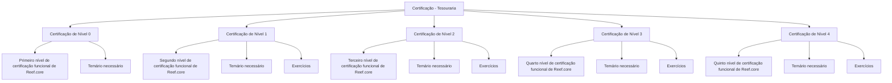

# Certificação Funcional de Tesouraria no Reef.core — Estrutura de Níveis 0 a 4

## 1. Metadados do Documento
- **Arquivo de Origem:** Não identificado no conteúdo fornecido
- **Tipo de Documento:** Manual Operacional
- **Domínio / Sistema:** Tesouraria; Reef.core
- **Público-Alvo:** Profissionais em processo de certificação funcional de Tesouraria no Reef.core
- **Data/Versão Identificada:** Não identificada

---

## 2. Resumo Executivo & Contexto de Negócio

O documento apresenta a estrutura de certificação de Tesouraria, organizada em cinco níveis progressivos: Nível 0, Nível 1, Nível 2, Nível 3 e Nível 4. Cada nível está relacionado à certificação funcional da plataforma Reef.core.

O Nível 0 corresponde ao primeiro nível de certificação funcional de Reef.core e informa que existe um temário necessário para sua obtenção. O conteúdo fornecido não descreve quais tópicos compõem esse temário.

Os níveis 1 a 4 representam, respectivamente, o segundo, terceiro, quarto e quinto níveis de certificação funcional de Reef.core. Além do temário requerido, cada um desses níveis menciona a existência de exercícios associados ao processo de obtenção da certificação.

O material também exibe uma navegação institucional com referências a áreas como *Solutions Architectures*, *APIs*, *Events*, *Components*, *Cloud Documentation*, *Zeus*, *Reef Help* e *News*. Entretanto, o documento não explica a relação funcional ou arquitetural dessas áreas com a certificação de Tesouraria.

---

## 3. Arquitetura, Componentes & Tecnologias Envolvidas

O conteúdo cita o sistema **Reef.core** como a plataforma associada à certificação funcional. Também são exibidos itens de navegação ou áreas documentais: **Search**, **Home**, **Solutions Architectures**, **APIs**, **Events**, **Components**, **Cloud Documentation**, **Zeus**, **Reef Help** e **News**.

Não há descrição de arquitetura de software, integrações, microsserviços, interfaces, contratos de API, tecnologias de implementação, ambientes ou fluxos de dados.



> **Nota de Análise:** O documento identifica Reef.core como plataforma de certificação funcional, mas não detalha arquitetura, módulos, APIs, métodos HTTP, contratos JSON, infraestrutura, servidores ou tecnologias utilizadas.

---

## 4. Regras de Negócio, Especificações Funcionais & Processos

1. A certificação abordada é denominada **Certificación - Tesorería**.
2. A certificação de Tesouraria possui cinco níveis identificados de forma sequencial: Nível 0, Nível 1, Nível 2, Nível 3 e Nível 4.
3. O **Nível 0** exige o conhecimento de um temário para obtenção do primeiro nível de certificação funcional de Reef.core.
4. O **Nível 1** exige o conhecimento de um temário e a realização de exercícios para obtenção do segundo nível de certificação funcional de Reef.core.
5. O **Nível 2** exige o conhecimento de um temário e a realização de exercícios para obtenção do terceiro nível de certificação funcional de Reef.core.
6. O **Nível 3** exige o conhecimento de um temário e a realização de exercícios para obtenção do quarto nível de certificação funcional de Reef.core.
7. O **Nível 4** exige o conhecimento de um temário e a realização de exercícios para obtenção do quinto nível de certificação funcional de Reef.core.
8. O conteúdo não explicita critérios de aprovação, pontuações mínimas, duração dos exercícios, pré-requisitos formais entre níveis, responsáveis pela avaliação ou processo de emissão dos certificados.

---

## 5. Tabelas de Parâmetros, Ambientes e Estruturas de Dados

| Item / Parâmetro | Descrição / Função | Tipo / Valores / Formato | Ambiente / Observações |
| :--- | :--- | :--- | :--- |
| Certificação | Estrutura de certificação associada à Tesouraria | `CERTIFICACIÓN - TESORERÍA` | O documento informa que esta seção contém os temários de cada nível. |
| Nível 0 | Primeiro nível de certificação funcional de Reef.core | Temário necessário | Não há menção a exercícios para o Nível 0. |
| Nível 1 | Segundo nível de certificação funcional de Reef.core | Temário necessário e exercícios | Conteúdo detalhado do temário e exercícios não informado. |
| Nível 2 | Terceiro nível de certificação funcional de Reef.core | Temário necessário e exercícios | Conteúdo detalhado do temário e exercícios não informado. |
| Nível 3 | Quarto nível de certificação funcional de Reef.core | Temário necessário e exercícios | Conteúdo detalhado do temário e exercícios não informado. |
| Nível 4 | Quinto nível de certificação funcional de Reef.core | Temário necessário e exercícios | Conteúdo detalhado do temário e exercícios não informado. |
| Plataforma | Sistema mencionado no contexto das certificações funcionais | Reef.core | Não são apresentados detalhes técnicos da plataforma. |
| Navegação documental | Itens exibidos na interface de navegação | Search, Home, Solutions Architectures, APIs, Events, Components, Cloud Documentation, Zeus, Reef Help, News, EN | A relação desses itens com a certificação não é detalhada. |
| Idioma de interface | Idioma indicado na navegação | EN | O corpo principal fornecido está em espanhol. |

---

## 6. Bateria de Perguntas & Respostas para RAG (FAQ Sintético)

### P1: Quantos níveis existem na certificação de Tesouraria apresentada no documento?
**R:** O documento apresenta cinco níveis de certificação de Tesouraria: Nível 0, Nível 1, Nível 2, Nível 3 e Nível 4.

### P2: Qual é o objetivo da Certificação de Nível 0 em Reef.core?
**R:** A Certificação de Nível 0 tem como objetivo obter o primeiro nível de certificação funcional de Reef.core. Para isso, o documento informa que é necessário conhecer o temário correspondente.

### P3: O Nível 0 inclui exercícios para a certificação funcional de Reef.core?
**R:** Não há menção a exercícios no Nível 0. O documento apenas informa que o participante precisa conhecer o temário necessário para obter o primeiro nível de certificação funcional de Reef.core.

### P4: O que é necessário para obter a certificação de Nível 1?
**R:** Para obter o segundo nível de certificação funcional de Reef.core, correspondente ao Nível 1, o documento informa que é necessário conhecer o temário e realizar exercícios. Os conteúdos específicos não são detalhados.

### P5: Qual nível corresponde ao terceiro nível de certificação funcional de Reef.core?
**R:** O Nível 2 corresponde ao terceiro nível de certificação funcional de Reef.core. O documento indica que esse nível envolve o conhecimento de um temário e exercícios.

### P6: Quais níveis mencionam explicitamente a realização de exercícios?
**R:** Os níveis 1, 2, 3 e 4 mencionam explicitamente exercícios junto ao temário necessário. O Nível 0 não menciona exercícios.

### P7: Qual nível representa o quinto nível de certificação funcional de Reef.core?
**R:** O Nível 4 representa o quinto nível de certificação funcional de Reef.core. A obtenção desse nível requer o conhecimento do temário e a realização de exercícios, conforme o documento.

### P8: O documento descreve os temas específicos cobrados em cada nível de certificação?
**R:** Não. O documento informa que cada nível possui um temário, mas não apresenta os tópicos, conteúdos programáticos, critérios de avaliação ou materiais de estudo de nenhum nível.

### P9: O documento define pré-requisitos formais entre os níveis de certificação?
**R:** Não. Embora os níveis sejam apresentados em sequência de 0 a 4 e associados ao primeiro até o quinto nível de certificação funcional de Reef.core, não há uma regra explícita exigindo aprovação em um nível anterior para iniciar o seguinte.

### P10: Quais áreas de navegação são exibidas junto ao conteúdo de certificação?
**R:** O documento exibe os itens Search, Home, Solutions Architectures, APIs, Events, Components, Cloud Documentation, Zeus, Reef Help, News e EN. Não é detalhado como essas áreas se conectam ao processo de certificação de Tesouraria.

---

## 7. Glossário de Termos, Siglas & Conceitos-Chave

- **Certificación - Tesorería:** Seção de certificação relacionada ao domínio de Tesouraria.
- **Tesorería:** Termo em espanhol para Tesouraria; domínio organizacional referido no documento.
- **Reef.core:** Plataforma citada como objeto da certificação funcional nos níveis 0 a 4.
- **Certificação funcional:** Tipo de certificação mencionada para Reef.core; o documento não define seus critérios, escopo ou metodologia.
- **Temario:** Termo em espanhol para temário ou conteúdo programático requerido para certificação.
- **Nível 0:** Primeiro nível de certificação funcional de Reef.core.
- **Nível 1:** Segundo nível de certificação funcional de Reef.core.
- **Nível 2:** Terceiro nível de certificação funcional de Reef.core.
- **Nível 3:** Quarto nível de certificação funcional de Reef.core.
- **Nível 4:** Quinto nível de certificação funcional de Reef.core.
- **APIs:** Item de navegação exibido no documento; sem detalhamento adicional.
- **Events:** Item de navegação exibido no documento; sem detalhamento adicional.
- **Components:** Item de navegação exibido no documento; sem detalhamento adicional.
- **Cloud Documentation:** Item de navegação exibido no documento; sem detalhamento adicional.
- **Zeus:** Item de navegação exibido no documento; sem definição adicional.
- **Reef Help:** Item de navegação exibido no documento; sem definição adicional.
- **EN:** Indicador de idioma exibido na navegação, presumivelmente inglês; o documento não apresenta explicação adicional.

---

## 8. Notas Críticas, Riscos & Limitações

- O conteúdo fornecido não identifica o arquivo de origem, autor, data, versão, área responsável ou ciclo de atualização.
- Não são especificados os tópicos que compõem os temários dos níveis de certificação.
- Não são descritos os exercícios, formatos de avaliação, critérios de aprovação, notas mínimas, prazos ou evidências de conclusão.
- Não há detalhamento de pré-requisitos, embora os níveis estejam organizados de Nível 0 a Nível 4.
- Não são apresentadas informações de arquitetura, integrações, ambientes, URLs, credenciais, permissões, logs, APIs ou estruturas de dados.
- A relação entre a navegação institucional exibida e a certificação de Tesouraria não é explicada.
- **Nota de Análise:** O documento lista Reef.core e os níveis de certificação funcional, porém não detalha as capacidades funcionais da plataforma nem o conteúdo técnico ou operacional avaliado em cada nível.

---

## 9. Conteúdo Bruto Estruturado (Referência Fiel)

```text
--- [PÁGINA 1 DE 1] ---

CERTIFICACIÓN - TESORERÍA
 En este apartado se encuentran los temarios de cada uno de los niveles de certificación de tesorería.
CERTIFICACIÓN DE NIVEL 0
En este apartado se encuentra el
temario que se necesita conocer
para obtener el primer nivel de
certificación funcional de
Reef.core
CERTIFICACIÓN DE NIVEL 1
En este apartado se encuentra el
temario que se necesita conocer
junto con ejercicios para obtener
el segundo nivel de certificación
funcional de Reef.core
CERTIFICACIÓN DE NIVEL 2
En este apartado se encuentra el
temario que se necesita conocer
junto con ejercicios para obtener
el tercer nivel de certificación
funcional de Reef.core
CERTIFICACIÓN DE NIVEL 3
En este apartado se encuentra el
temario que se necesita conocer
junto con ejercicios para obtener
el cuarto nivel de certificación
funcional de Reef.core
CERTIFICACIÓN DE NIVEL 4
En este apartado se encuentra el
temario que se necesita conocer
junto con ejercicios para obtener
el quinto nivel de certificación
funcional de Reef.core
 / 
 CF
Search Home Solutions Architectures APIs Events Components Cloud Documentation Zeus Reef Help News
EN
```
