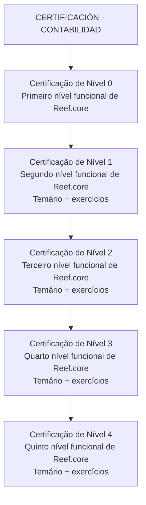

# Certificação de Contabilidade — Trilhas Funcionais do Reef.core

## 1. Metadados do Documento
- **Arquivo de Origem:** Não identificado no conteúdo fornecido
- **Tipo de Documento:** Procedimento
- **Domínio / Sistema:** Certificação funcional de contabilidade — Reef.core
- **Público-Alvo:** Profissionais buscando certificação funcional de Reef.core
- **Data/Versão Identificada:** Não identificada

---

## 2. Resumo Executivo & Contexto de Negócio

O conteúdo descreve a seção **“CERTIFICACIÓN - CONTABILIDAD”**, destinada a apresentar os programas de certificação na área de contabilidade. A seção organiza os conteúdos necessários para os diferentes níveis de certificação funcional do sistema **Reef.core**.

A trilha possui cinco níveis, denominados **Nível 0** a **Nível 4**. O Nível 0 corresponde ao primeiro nível de certificação funcional de Reef.core. Os Níveis 1, 2, 3 e 4 correspondem, respectivamente, ao segundo, terceiro, quarto e quinto níveis de certificação funcional.

O documento informa que os Níveis 1 a 4 incluem tanto o conteúdo programático quanto exercícios. Para o Nível 0, o conteúdo fornecido apenas indica a existência do temário necessário para a obtenção do primeiro nível; não há menção explícita a exercícios.

O texto também apresenta elementos de navegação de um portal, incluindo as áreas Search, Home, Solutions, Architectures, APIs, Events, Components, Cloud, Documentation, Zeus, Reef, Help e News. Não são detalhadas tecnologias, critérios de aprovação, carga horária, pré-requisitos, avaliações ou conteúdo específico de cada temário.

---

## 3. Arquitetura, Componentes & Tecnologias Envolvidas

O documento não descreve uma arquitetura técnica, integrações, microsserviços, APIs, ambientes, bancos de dados ou tecnologias de implementação. O único sistema explicitamente citado é **Reef.core**, no contexto de certificação funcional.

A estrutura apresentada é uma progressão de certificação funcional composta por cinco níveis.



> **Nota de Análise:** O documento cita Reef.core, porém não detalha suas funcionalidades, arquitetura, módulos, interfaces, métodos HTTP, contratos de dados ou infraestrutura.

---

## 4. Regras de Negócio, Especificações Funcionais & Processos

1. A seção de certificação é voltada ao domínio de **contabilidade**.
2. Existem cinco níveis de certificação funcional de Reef.core: Nível 0, Nível 1, Nível 2, Nível 3 e Nível 4.
3. O **Nível 0** é apresentado como o primeiro nível de certificação funcional de Reef.core.
4. O **Nível 1** é apresentado como o segundo nível de certificação funcional de Reef.core e inclui temário e exercícios.
5. O **Nível 2** é apresentado como o terceiro nível de certificação funcional de Reef.core e inclui temário e exercícios.
6. O **Nível 3** é apresentado como o quarto nível de certificação funcional de Reef.core e inclui temário e exercícios.
7. O **Nível 4** é apresentado como o quinto nível de certificação funcional de Reef.core e inclui temário e exercícios.
8. O conteúdo não estabelece critérios formais de conclusão, aprovação, reprovação, pré-requisitos entre níveis, ordem obrigatória de execução, responsáveis, duração ou modalidade de avaliação.

---

## 5. Tabelas de Parâmetros, Ambientes e Estruturas de Dados

| Item / Parâmetro | Descrição / Função | Tipo / Valores / Formato | Ambiente / Observações |
| :--- | :--- | :--- | :--- |
| Área de certificação | Seção de certificação para contabilidade | `CERTIFICACIÓN - CONTABILIDAD` | O documento informa que essa seção contém os temários de cada nível de certificação de contabilidade. |
| Sistema certificado | Sistema ao qual a certificação funcional se refere | Reef.core | Não há descrição técnica do sistema. |
| Certificação de Nível 0 | Primeiro nível de certificação funcional | Temário necessário para obtenção do primeiro nível | O texto não cita exercícios para o Nível 0. |
| Certificação de Nível 1 | Segundo nível de certificação funcional | Temário + exercícios | Associado a Reef.core. |
| Certificação de Nível 2 | Terceiro nível de certificação funcional | Temário + exercícios | Associado a Reef.core. |
| Certificação de Nível 3 | Quarto nível de certificação funcional | Temário + exercícios | Associado a Reef.core. |
| Certificação de Nível 4 | Quinto nível de certificação funcional | Temário + exercícios | Associado a Reef.core. |
| Idioma exibido | Idioma indicado no portal | `EN` | O conteúdo principal está em espanhol, apesar da indicação `EN`. |
| Navegação do portal | Opções de navegação apresentadas | Search, Home, Solutions, Architectures, APIs, Events, Components, Cloud, Documentation, Zeus, Reef, Help, News | O documento não descreve as funções dessas opções. |

---

## 6. Bateria de Perguntas & Respostas para RAG (FAQ Sintético)

### P1: Qual é o objetivo da seção “CERTIFICACIÓN - CONTABILIDAD”?
**R:** A seção apresenta os temários correspondentes aos níveis de certificação de contabilidade. Esses níveis são relacionados à certificação funcional do sistema Reef.core.

### P2: Quantos níveis de certificação funcional de Reef.core são apresentados?
**R:** O documento apresenta cinco níveis: Certificação de Nível 0, Nível 1, Nível 2, Nível 3 e Nível 4.

### P3: Qual nível representa a primeira certificação funcional de Reef.core?
**R:** A Certificação de Nível 0 representa o primeiro nível de certificação funcional de Reef.core.

### P4: O que é necessário para obter a Certificação de Nível 0?
**R:** O documento informa que é necessário conhecer o temário apresentado para obter o primeiro nível de certificação funcional de Reef.core. Não há detalhamento dos tópicos do temário, avaliações ou exercícios.

### P5: A Certificação de Nível 1 possui exercícios?
**R:** Sim. O conteúdo informa que a Certificação de Nível 1 inclui o temário necessário e exercícios para obter o segundo nível de certificação funcional de Reef.core.

### P6: A que nível funcional corresponde a Certificação de Nível 2?
**R:** A Certificação de Nível 2 corresponde ao terceiro nível de certificação funcional de Reef.core e inclui temário e exercícios.

### P7: Qual certificação corresponde ao quarto nível funcional de Reef.core?
**R:** A Certificação de Nível 3 corresponde ao quarto nível de certificação funcional de Reef.core. O documento indica que ela inclui temário e exercícios.

### P8: Qual é o nível mais alto de certificação mencionado no documento?
**R:** O nível mais alto mencionado é a Certificação de Nível 4, descrita como o quinto nível de certificação funcional de Reef.core, com temário e exercícios.

### P9: O documento especifica critérios de aprovação para as certificações?
**R:** Não. O conteúdo não informa critérios de aprovação, notas mínimas, tipos de prova, carga horária, pré-requisitos ou regras de progressão entre os níveis.

### P10: O documento descreve a arquitetura técnica do Reef.core?
**R:** Não. O documento apenas cita Reef.core como o sistema associado à certificação funcional. Não há informações sobre arquitetura, componentes, APIs, ambientes ou tecnologias.

### P11: Quais opções de navegação são exibidas no portal da certificação?
**R:** O documento exibe as opções Search, Home, Solutions, Architectures, APIs, Events, Components, Cloud, Documentation, Zeus, Reef, Help e News.

---

## 7. Glossário de Termos, Siglas & Conceitos-Chave

- **CERTIFICACIÓN - CONTABILIDAD:** Seção dedicada aos temários dos níveis de certificação de contabilidade.
- **Certificação funcional:** Classificação usada pelo documento para os níveis de certificação associados ao Reef.core.
- **Nível 0:** Primeiro nível de certificação funcional de Reef.core.
- **Nível 1:** Segundo nível de certificação funcional de Reef.core, com temário e exercícios.
- **Nível 2:** Terceiro nível de certificação funcional de Reef.core, com temário e exercícios.
- **Nível 3:** Quarto nível de certificação funcional de Reef.core, com temário e exercícios.
- **Nível 4:** Quinto nível de certificação funcional de Reef.core, com temário e exercícios.
- **Reef.core:** Sistema citado como objeto da certificação funcional. O documento não apresenta uma definição técnica adicional.
- **Temario:** Termo em espanhol utilizado para designar o conteúdo programático necessário para a certificação.

---

## 8. Notas Críticas, Riscos & Limitações

- O documento não identifica o arquivo de origem, autor, data, versão ou responsável pelo conteúdo.
- Não há detalhamento dos temas, exercícios ou materiais de estudo de nenhum nível de certificação.
- O documento não informa pré-requisitos, ordem obrigatória, critérios de aprovação, duração, modalidade de exame ou evidências de conclusão.
- Não há descrição funcional ou técnica do Reef.core além de sua associação às certificações.
- Não são apresentados links, URLs, contatos de suporte ou instruções de acesso aos conteúdos.
- A indicação `EN` aparece no portal, mas o conteúdo de certificação está redigido em espanhol.
- **Nota de Análise:** O documento lista uma estrutura de certificação em cinco níveis, mas não fornece detalhamento adicional que permita inferir conteúdo programático, competências avaliadas ou mecanismos de progressão.

---

## 9. Conteúdo Bruto Estruturado (Referência Fiel)

```text
--- [PÁGINA 1 DE 1] ---

CERTIFICACIÓN - CONTABILIDAD
 En este apartado se encuentran los temarios de cada uno de los niveles de certificación de contabilidad.
CERTIFICACIÓN DE NIVEL 0
En este apartado se encuentra el
temario que se necesita conocer
para obtener el primer nivel de
certificación funcional de
Reef.core
CERTIFICACIÓN DE NIVEL 1
En este apartado se encuentra el
temario que se necesita conocer
junto con ejercicios para obtener
el segundo nivel de certificación
funcional de Reef.core
CERTIFICACIÓN DE NIVEL 2
En este apartado se encuentra el
temario que se necesita conocer
junto con ejercicios para obtener
el tercer nivel de certificación
funcional de Reef.core
CERTIFICACIÓN DE NIVEL 3
En este apartado se encuentra el
temario que se necesita conocer
junto con ejercicios para obtener
el cuarto nivel de certificación
funcional de Reef.core
CERTIFICACIÓN DE NIVEL 4
En este apartado se encuentra el
temario que se necesita conocer
junto con ejercicios para obtener
el quinto nivel de certificación
funcional de Reef.core
 / 
 CF
Search Home Solutions Architectures APIs Events Components Cloud Documentation Zeus Reef Help News
EN
```
