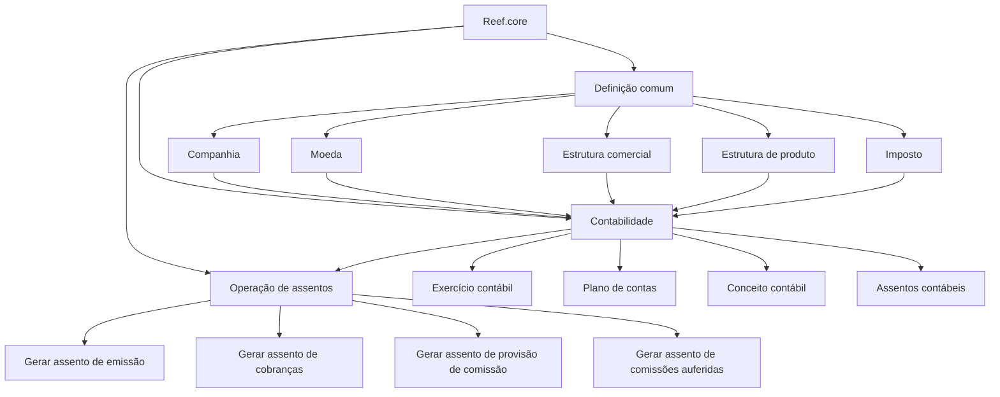

# Certificación Contabilidad Nivel 1 — Definições e Operações Contábeis no Reef.core

## 1. Metadados do Documento
- **Arquivo de Origem:** Não identificado no conteúdo fornecido
- **Tipo de Documento:** Manual Operacional
- **Domínio / Sistema:** Reef.core — Contabilidade
- **Público-Alvo:** Negócio, Operação, Analistas Funcionais e Configuradores do módulo contábil
- **Data/Versão Identificada:** Não identificada

---

## 2. Resumo Executivo & Contexto de Negócio

O documento apresenta a estrutura de certificação de **Contabilidad nivel 1** do sistema **Reef.core**, separando conteúdos de definição e conteúdos operacionais do módulo de Contabilidade. O material organiza os elementos necessários para parametrizar entidades, moedas, estruturas organizacionais, produtos, impostos e definições específicas da contabilidade.

A seção de definições comuns reúne cadastros que não pertencem exclusivamente ao módulo contábil, mas que são necessários para a configuração da contabilidade. Esses cadastros incluem companhia, moeda, estrutura comercial, estrutura de produto e imposto.

A seção específica de Contabilidade abrange o exercício contábil, o plano de contas, o conceito contábil e os assentos contábeis. Esses itens estruturam o período contábil, as contas utilizadas pela companhia, os agrupadores de lançamentos e as características dos tipos de lançamentos contábeis.

A seção operacional descreve processos de geração de assentos para registrar movimentos econômicos na contabilidade. São citados assentos de emissão, cobranças, provisão de comissão e comissões auferidas, cada qual associado a um tipo de evento econômico ou movimento de apólice.

O conteúdo apresenta links conceituais de acesso a documento e vídeo para cada tópico, porém não fornece URLs, procedimentos detalhados, contratos técnicos, telas, regras de contabilização por conta ou critérios de execução dos processos.

---

## 3. Arquitetura, Componentes & Tecnologias Envolvidas

O documento cita o sistema **Reef.core** como plataforma responsável por realizar operações da companhia com base em definições de moedas e configurações contábeis.

Os componentes funcionais identificados são:

- **Definição comum**
  - Companhia
  - Moeda
  - Estrutura comercial
  - Estrutura de produto
  - Imposto
- **Contabilidade**
  - Exercício contábil
  - Plano de contas
  - Conceito contábil
  - Assentos contábeis
- **Operação de assentos**
  - Gerar assento de emissão
  - Gerar assento de cobranças
  - Gerar assento de provisão de comissão
  - Gerar assento de comissões auferidas



**Nota de Análise:** O documento não detalha arquitetura técnica, microsserviços, bancos de dados, APIs, protocolos de integração, ambientes, URLs ou tecnologias de implementação além da referência ao sistema Reef.core.

---

## 4. Regras de Negócio, Especificações Funcionais & Processos

### 4.1 Definições comuns necessárias para Contabilidade

1. **Companhia**
   - Define a entidade ou as entidades com as quais serão criadas as apólices.
   - A definição de companhia também suporta a criação dos demais elementos associados às apólices.

2. **Moeda**
   - Define as divisas utilizadas pelo Reef.core para realizar as diferentes operações da companhia.

3. **Estrutura comercial**
   - Define como será estabelecida a organização territorial da companhia.

4. **Estrutura de produto**
   - Define como estarão organizados os ramos comercializados.

5. **Imposto**
   - Define os tipos de obrigações tributárias que devem ser considerados.
   - Define características e formas de cálculo aplicáveis às obrigações tributárias.

### 4.2 Definições específicas do módulo de Contabilidade

1. **Exercício contábil**
   - Define o período de tempo no qual serão realizadas as operações contábeis.
   - Após cada fechamento de exercício, deve ser definido um novo exercício.

2. **Plano de contas**
   - Define as contas utilizadas pela companhia dentro do exercício contábil.
   - Define os parâmetros correspondentes a cada conta.

3. **Conceito contábil**
   - Define o identificador que agrupa os apontamentos contábeis para consulta posterior.

4. **Assentos contábeis**
   - Define os tipos e as características dos assentos contábeis com os quais a companhia trabalhará.

### 4.3 Operação de assentos contábeis

A operação de assentos está direcionada ao registro, na contabilidade, das entradas e saídas dos diferentes movimentos econômicos.

1. **Gerar assento de emissão**
   - Realiza a anotação contábil mensal dos movimentos de apólice correspondentes a novas emissões e suplementos.

2. **Gerar assento de cobranças**
   - Realiza a anotação contábil pelo valor das primas cobradas e dos anulamentos de cobrança ocorridos no mês.

3. **Gerar assento de provisão de comissão**
   - Gera a anotação contábil correspondente às comissões pendentes de liquidação.

4. **Gerar assento de comissões auferidas**
   - Corresponde à anotação contábil das comissões pagas a intermediários.

---

## 5. Tabelas de Parâmetros, Ambientes e Estruturas de Dados

| Item / Parâmetro | Descrição / Função | Tipo / Valores / Formato | Ambiente / Observações |
| :--- | :--- | :--- | :--- |
| Companhia | Define a entidade ou entidades para criação de apólices e demais elementos associados. | Definição organizacional | Necessária para a definição do módulo contábil. |
| Moeda | Define as divisas utilizadas pelo Reef.core nas operações da companhia. | Definição de divisas | O documento não especifica códigos de moeda ou formatos monetários. |
| Estrutura comercial | Estabelece a organização territorial da companhia. | Estrutura organizacional territorial | Não há níveis territoriais ou regras de hierarquia detalhados. |
| Estrutura de produto | Organiza os ramos comercializados. | Estrutura de produto | O documento não lista ramos ou produtos específicos. |
| Imposto | Define obrigações tributárias, características e formas de cálculo. | Definição tributária | Não há alíquotas, fórmulas ou tipos de imposto informados. |
| Exercício contábil | Determina o período de realização das operações contábeis. | Período contábil | Após o fechamento de um exercício, um novo exercício deve ser definido. |
| Plano de contas | Define contas da companhia e parâmetros de cada conta no exercício contábil. | Estrutura contábil | O documento não informa códigos, natureza ou níveis de conta. |
| Conceito contábil | Agrupa apontamentos contábeis para consulta posterior. | Identificador de agrupamento | Não há formato ou regra de geração do identificador. |
| Assentos contábeis | Define tipos e características dos lançamentos contábeis utilizados pela companhia. | Tipos de assento | O documento não detalha débito, crédito ou regras de contabilização. |
| Gerar assento de emissão | Registra mensalmente movimentos de novas emissões e suplementos de apólice. | Operação contábil mensal | Não há cronograma, gatilho técnico ou condições de reprocessamento informados. |
| Gerar assento de cobranças | Registra valores de primas cobradas e anulamentos de cobrança no mês. | Operação contábil mensal | O documento não define o tratamento de divergências ou estornos. |
| Gerar assento de provisão de comissão | Registra contabilmente comissões pendentes de liquidação. | Operação contábil | Não há critérios de provisão ou cálculo apresentados. |
| Gerar assento de comissões auferidas | Registra contabilmente comissões pagas a intermediários. | Operação contábil | O documento não especifica intermediários, contas ou critérios de pagamento. |

---

## 6. Bateria de Perguntas & Respostas para RAG (FAQ Sintético)

### P1: Qual é o objetivo da seção de definições comuns na certificação de Contabilidade nível 1?
**R:** A seção de definições comuns reúne configurações que não pertencem exclusivamente ao módulo de Contabilidade, mas são necessárias para a definição e a operação contábil. O documento lista companhia, moeda, estrutura comercial, estrutura de produto e imposto.

### P2: O que é definido no cadastro de companhia?
**R:** O cadastro de companhia define a entidade ou as entidades com as quais serão criadas as apólices e, consequentemente, os demais elementos relacionados às apólices.

### P3: Qual é a finalidade da definição de moeda no Reef.core?
**R:** A definição de moeda estabelece as divisas que o Reef.core utilizará para realizar as diferentes operações da companhia. O documento não detalha moedas específicas, códigos monetários ou regras de conversão.

### P4: Como o documento define o exercício contábil?
**R:** O exercício contábil é definido como o período de tempo no qual serão realizadas as operações contábeis. Após cada fechamento de exercício, deve ser definido um novo exercício contábil.

### P5: O que deve ser configurado no plano de contas?
**R:** O plano de contas define as contas utilizadas pela companhia dentro do exercício contábil e os parâmetros correspondentes a cada conta. O documento não apresenta a estrutura dos códigos de conta nem os parâmetros específicos.

### P6: Para que serve o conceito contábil?
**R:** O conceito contábil define um identificador que agrupa os apontamentos contábeis para permitir sua consulta posterior.

### P7: O que são assentos contábeis no contexto apresentado?
**R:** Assentos contábeis são definições dos tipos e das características dos lançamentos contábeis com os quais a companhia trabalhará. O material não detalha partidas de débito e crédito, contas envolvidas ou critérios de validação.

### P8: O que é registrado pelo processo de gerar assento de emissão?
**R:** O processo de gerar assento de emissão realiza a anotação contábil mensal dos movimentos de apólice correspondentes a novas emissões e suplementos.

### P9: Quais movimentos são contabilizados pelo processo de gerar assento de cobranças?
**R:** O processo de gerar assento de cobranças realiza a anotação contábil pelo valor das primas cobradas e pelos anulamentos de cobrança ocorridos no mês.

### P10: Quando é utilizado o assento de provisão de comissão?
**R:** O assento de provisão de comissão é utilizado para gerar a anotação contábil correspondente às comissões pendentes de liquidação.

### P11: Qual evento é registrado pelo assento de comissões auferidas?
**R:** O assento de comissões auferidas corresponde à anotação contábil das comissões pagas a intermediários.

### P12: O documento informa URLs, APIs ou detalhes técnicos dos acessos a documentos e vídeos?
**R:** Não. O documento apresenta a indicação “Accede al documento” e “Accede al vídeo” para os tópicos, mas não fornece URLs, contratos de API, autenticação, métodos HTTP ou detalhes técnicos dos conteúdos vinculados.

---

## 7. Glossário de Termos, Siglas & Conceitos-Chave

- **Reef.core:** Sistema mencionado como responsável por realizar operações da companhia utilizando as divisas definidas.
- **Companhia:** Entidade ou conjunto de entidades com as quais serão criadas apólices e elementos relacionados.
- **Apólice:** Elemento associado à companhia; o documento cita movimentos de apólice para novas emissões e suplementos.
- **Divisa:** Moeda utilizada pelo Reef.core nas operações da companhia.
- **Estrutura comercial:** Organização territorial da companhia.
- **Estrutura de produto:** Organização dos ramos comercializados.
- **Imposto:** Definição de obrigações tributárias, características e formas de cálculo.
- **Exercício contábil:** Período no qual as operações contábeis são realizadas.
- **Plano de contas:** Conjunto de contas utilizadas pela companhia no exercício contábil e seus parâmetros.
- **Conceito contábil:** Identificador que agrupa apontamentos contábeis para consulta posterior.
- **Assento contábil:** Tipo de anotação ou lançamento contábil com características definidas para uso pela companhia.
- **Prima:** Valor citado como objeto de cobrança e registro no assento de cobranças.
- **Suplemento:** Movimento de apólice citado no processo de geração do assento de emissão.
- **Comissão pendente de liquidação:** Comissão que ainda não foi liquidada e deve ser objeto de provisão contábil.
- **Intermediário:** Entidade que recebe comissões registradas pelo processo de assento de comissões auferidas.

---

## 8. Notas Críticas, Riscos & Limitações

- O documento tem caráter introdutório e não detalha configurações de tela, responsabilidades operacionais, permissões ou sequência de execução.
- Não são apresentados códigos de contas, contas contábeis, regras de débito e crédito, mecanismos de fechamento, critérios de cálculo de imposto ou regras de provisão de comissão.
- Não há informações sobre APIs, integrações, bancos de dados, infraestrutura, ambientes, URLs, autenticação, logs ou monitoramento.
- Os links “Accede al documento” e “Accede al vídeo” são citados sem conteúdo de destino ou endereço recuperável.
- O documento não especifica a periodicidade operacional dos assentos de provisão de comissão e de comissões auferidas; somente os assentos de emissão e cobranças são explicitamente associados a movimentos do mês.
- **Nota de Análise:** O material cita o Reef.core, mas não detalha a versão do sistema, os módulos dependentes ou os contratos funcionais e técnicos entre os componentes.

---

## 9. Conteúdo Bruto Estruturado (Referência Fiel)

```text
--- [PÁGINA 1 DE 2] ---

CERTIFICACIÓN Contabilidad nivel 1
DEFINICIÓN
OPERACIÓN
DEFINICIÓN
COMÚN
En este nivel se encuentran definiciones que no pertenecen exclusivamente al módulo de contabilidad, pero son
necesarias para poder realizar la definición de dicho módulo
COMPAÑÍA
Definición de la entidad o
entidades con las que se van a
crear las pólizas y por
consiguiente el resto de
elementos
 Accede al documento
 Accede al vídeo
MONEDA
Definición de las divisas con las
que Reef.core va a realizar las
distintas operaciones de la
compañía
 Accede al documento
 Accede al vídeo
ESTRUCTURA COMERCIAL
Definición de como se va a
establecer la organización
territorial de la compañía
 Accede al documento
 Accede al vídeo
ESTRUCTURA PRODUCTO
Definición de como estarán
organizados los ramos que se
comercializan
 Accede al documento
 Accede al vídeo
IMPUESTO
Definir los tipos de obligaciones
tributarias que se deben tener en
cuenta, así como sus
características y formas de cálculo
 Accede al documento
 Accede al vídeo
CONTABILIDAD
Definiciones específicas del módulo de Contabilidad
EJERCICIO CONTABLE
 PLAN DE CUENTAS
 CONCEPTO CONTABLE
 ASIENTOS CONTABLES
 / 
 CF
Search Home Solutions Architectures APIs Events Components Cloud Documentation Zeus Reef Help News
EN


--- [PÁGINA 2 DE 2] ---

Se define el periodo de tiempo en
el que se realizarán las
operaciones contables. Después
de cada cierre de ejercicio se
debe definir el nuevo ejercicio
 Accede al documento
 Accede al vídeo
Definición de las cuentas
utilizadas por la compañía dentro
del ejercicio contable y los
parámetros correspondientes a
cada cuenta
 Accede al documento
 Accede al vídeo
Se define el identificador que
agrupa los apuntes contables para
su posterior consulta
 Accede al documento
 Accede al vídeo
Definición de los tipos y
características de los asientos
contables con los que trabajará la
compañía
 Accede al documento
 Accede al vídeo
OPERACIÓN
ASIENTOS
Operaciones enfocadas a registrar en la contabilidad las entradas y salidas de los distintos movimientos
económicos
GENERAR Asiento de emisión
Realiza la anotación contable
mensual de movimientos de póliza
correspondientes a nuevas
emisiones y suplementos
 Accede al documento
 Accede al vídeo
GENERAR Asiento de cobros
Realiza la anotación contable por
el importe de primas cobradas y
anulados de cobro en el mes
 Accede al documento
 Accede al vídeo
GENERAR Asiento de provisión
de comisión
Genera la anotación contable
correspondiente a las comisiones
pendientes de liquidar
 Accede al documento
 Accede al vídeo
GENERAR Asiento de
comisiones devengadas
Corresponde a la anotación
contable de las comisiones
pagadas a intermediarios
 Accede al documento
 Accede al vídeo
```
