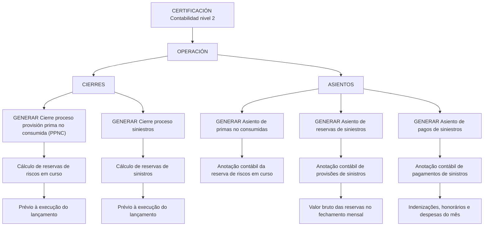

# Certificação Contabilidade Nível 2 — Operações de Fechamento e Lançamentos Contábeis

## 1. Metadados do Documento
- **Arquivo de Origem:** Não identificado no conteúdo fornecido
- **Tipo de Documento:** Manual Operacional
- **Domínio / Sistema:** Certificação Contabilidade nível 2
- **Público-Alvo:** Operação, Contabilidade e usuários responsáveis por processos de fechamento
- **Data/Versão Identificada:** Não identificada

---

## 2. Resumo Executivo & Contexto de Negócio

O documento apresenta a área **OPERACIÓN** da “CERTIFICACIÓN Contabilidad nivel 2”, organizada em dois grupos funcionais: **CIERRES** e **ASIENTOS**. O conteúdo descreve operações associadas ao cálculo prévio de reservas e ao posterior registro contábil de movimentos econômicos.

A seção **CIERRES** concentra operações que realizam cálculos antes da execução de lançamentos contábeis. Estão listados o processo de provisão de prima não consumida (PPNC), relacionado ao cálculo de reservas de riscos em curso, e o processo de sinistros, relacionado ao cálculo de reservas de sinistros.

A seção **ASIENTOS** reúne operações destinadas a registrar contabilmente entradas e saídas de diferentes movimentos econômicos. O documento relaciona lançamentos de primas não consumidas, reservas de sinistros e pagamentos de sinistros.

O conteúdo também informa a disponibilidade de documentos e, em determinados processos, vídeos de apoio. Não são apresentados detalhes técnicos sobre sistemas de origem, integrações, contratos, fórmulas de cálculo, periodicidade de execução, responsáveis ou critérios de aprovação.

---

## 3. Arquitetura, Componentes & Tecnologias Envolvidas

O documento não descreve uma arquitetura de software, microsserviços, tecnologias, APIs, bancos de dados ou integrações técnicas. A estrutura funcional identificada organiza-se como um fluxo operacional entre cálculos prévios de fechamento e registros contábeis.



**Nota de Análise:** O documento lista operações de fechamento e lançamento contábil, mas não detalha os sistemas executores, métodos de acesso, URLs operacionais, contratos de dados, tecnologias utilizadas ou dependências de integração.

---

## 4. Regras de Negócio, Especificações Funcionais & Processos

### 4.1. Estrutura funcional de operação

A operação está dividida em duas categorias:

1. **CIERRES**
   - Engloba operações que realizam cálculos antes dos lançamentos contábeis.
   - Os cálculos de reservas são executados previamente à execução dos respectivos lançamentos.

2. **ASIENTOS**
   - Engloba operações voltadas ao registro contábil de entradas e saídas dos diferentes movimentos econômicos.

### 4.2. Processo de fechamento de provisão de prima não consumida

A operação **“GENERAR Cierre proceso provisión prima no consumida (PPNC)”** realiza o cálculo das reservas de riscos em curso antes da execução do lançamento contábil.

O documento indica que há acesso a:
- Documento de apoio.
- Vídeo de apoio.

**Nota de Análise:** O documento não define a fórmula da PPNC, as fontes dos dados, os critérios de seleção, os períodos considerados, as exceções ou as validações aplicáveis ao cálculo das reservas de riscos em curso.

### 4.3. Processo de fechamento de sinistros

A operação **“GENERAR Cierre proceso siniestros”** realiza o cálculo das reservas de sinistros antes da execução do lançamento contábil.

O documento indica que há acesso a:
- Documento de apoio.
- Vídeo de apoio.

**Nota de Análise:** O documento não especifica quais tipos de sinistro compõem as reservas, como os valores são calculados, quais são os critérios de fechamento ou quais controles devem ser aplicados antes do lançamento.

### 4.4. Lançamento de primas não consumidas

A operação **“GENERAR Asiento de primas no consumidas”** corresponde à anotação contábil da reserva de riscos em curso.

O documento indica que há acesso a:
- Documento de apoio.

### 4.5. Lançamento de reservas de sinistros

A operação **“GENERAR Asiento de reservas de siniestros”** realiza a anotação contábil correspondente às provisões de sinistros pelo valor bruto das reservas no fechamento do mês.

O documento indica que há acesso a:
- Documento de apoio.
- Vídeo de apoio.

### 4.6. Lançamento de pagamentos de sinistros

A operação **“GENERAR Asiento de pagos de siniestros”** corresponde à anotação contábil dos pagamentos de sinistros realizados no mês.

Os pagamentos de sinistros citados abrangem:
- Indenizações.
- Honorários.
- Despesas.

O documento indica que há acesso a:
- Documento de apoio.
- Vídeo de apoio.

---

## 5. Tabelas de Parâmetros, Ambientes e Estruturas de Dados

| Item / Parâmetro | Descrição / Função | Tipo / Valores / Formato | Ambiente / Observações |
| :--- | :--- | :--- | :--- |
| CERTIFICACIÓN Contabilidad nivel 2 | Título ou contexto funcional exibido no documento. | Texto | Não há versão ou data identificada. |
| OPERACIÓN | Área funcional que agrupa os processos apresentados. | Categoria funcional | Contém CIERRES e ASIENTOS. |
| CIERRES | Grupo de operações que realizam cálculos prévios aos lançamentos contábeis. | Categoria funcional | Inclui fechamento de PPNC e fechamento de sinistros. |
| ASIENTOS | Grupo de operações focadas no registro contábil de entradas e saídas de movimentos econômicos. | Categoria funcional | Inclui lançamentos de primas não consumidas, reservas de sinistros e pagamentos de sinistros. |
| PPNC | Sigla apresentada para “provisión prima no consumida”. | Sigla / processo | Associada ao cálculo de reservas de riscos em curso. |
| GENERAR Cierre proceso provisión prima no consumida (PPNC) | Executa cálculo de reservas de riscos em curso antes do lançamento. | Operação | Possui acesso a documento e vídeo. |
| GENERAR Cierre proceso siniestros | Executa cálculo de reservas de sinistros antes do lançamento. | Operação | Possui acesso a documento e vídeo. |
| GENERAR Asiento de primas no consumidas | Registra contabilmente a reserva de riscos em curso. | Operação | Possui acesso a documento. |
| GENERAR Asiento de reservas de siniestros | Registra contabilmente provisões de sinistros pelo valor bruto das reservas no fechamento mensal. | Operação | Possui acesso a documento e vídeo. |
| GENERAR Asiento de pagos de siniestros | Registra contabilmente pagamentos de sinistros realizados no mês. | Operação | Inclui indenizações, honorários e despesas; possui acesso a documento e vídeo. |
| Documento | Recurso de apoio indicado para determinadas operações. | Recurso documental | O conteúdo e o endereço dos documentos não foram fornecidos. |
| Vídeo | Recurso de apoio indicado para determinadas operações. | Recurso audiovisual | O conteúdo e o endereço dos vídeos não foram fornecidos. |
| Search | Item de navegação exibido no rodapé. | Navegação | Sem detalhamento funcional. |
| Home | Item de navegação exibido no rodapé. | Navegação | Sem detalhamento funcional. |
| Solutions | Item de navegação exibido no rodapé. | Navegação | Sem detalhamento funcional. |
| Architectures | Item de navegação exibido no rodapé. | Navegação | Sem detalhamento funcional. |
| APIs | Item de navegação exibido no rodapé. | Navegação | Sem detalhamento funcional. |
| Events | Item de navegação exibido no rodapé. | Navegação | Sem detalhamento funcional. |
| Components | Item de navegação exibido no rodapé. | Navegação | Sem detalhamento funcional. |
| Cloud | Item de navegação exibido no rodapé. | Navegação | Sem detalhamento funcional. |
| Documentation | Item de navegação exibido no rodapé. | Navegação | Sem detalhamento funcional. |
| Zeus | Item de navegação exibido no rodapé. | Navegação | Sem detalhamento funcional. |
| Reef | Item de navegação exibido no rodapé. | Navegação | Sem detalhamento funcional. |
| Help | Item de navegação exibido no rodapé. | Navegação | Sem detalhamento funcional. |
| News | Item de navegação exibido no rodapé. | Navegação | Sem detalhamento funcional. |
| EN | Indicador de idioma exibido no rodapé. | Idioma | Sem detalhamento adicional. |
| CF | Texto ou sigla exibida no rodapé. | Não detalhado | O significado não é definido no documento. |

---

## 6. Bateria de Perguntas & Respostas para RAG (FAQ Sintético)

### P1: Qual é o objetivo da seção CIERRES na Certificação Contabilidade nível 2?
**R:** A seção **CIERRES** reúne operações que realizam cálculos prévios aos lançamentos contábeis. O documento cita o cálculo de reservas de riscos em curso no processo PPNC e o cálculo de reservas de sinistros no processo de fechamento de sinistros.

### P2: O que faz a operação “GENERAR Cierre proceso provisión prima no consumida (PPNC)”?
**R:** A operação **“GENERAR Cierre proceso provisión prima no consumida (PPNC)”** realiza o cálculo das reservas de riscos em curso antes da execução do lançamento contábil. O documento informa a existência de um documento e de um vídeo de apoio.

### P3: O documento informa como é calculada a PPNC?
**R:** Não. O documento informa que o processo PPNC calcula reservas de riscos em curso antes do lançamento contábil, mas não apresenta fórmulas, regras de cálculo, fontes de dados, períodos, critérios de validação ou exceções.

### P4: Para que serve o processo “GENERAR Cierre proceso siniestros”?
**R:** O processo **“GENERAR Cierre proceso siniestros”** realiza o cálculo das reservas de sinistros antes da execução do lançamento contábil. O documento indica acesso a um documento e a um vídeo de apoio.

### P5: Qual operação registra contabilmente a reserva de riscos em curso?
**R:** A operação **“GENERAR Asiento de primas no consumidas”** corresponde à anotação contábil da reserva de riscos em curso.

### P6: Como são contabilizadas as reservas de sinistros?
**R:** A operação **“GENERAR Asiento de reservas de siniestros”** realiza a anotação contábil das provisões de sinistros pelo valor bruto das reservas no fechamento do mês.

### P7: Quais movimentos estão incluídos no lançamento de pagamentos de sinistros?
**R:** A operação **“GENERAR Asiento de pagos de siniestros”** registra pagamentos de sinistros realizados por indenizações, honorários e despesas no mês.

### P8: Qual é a diferença entre CIERRES e ASIENTOS?
**R:** **CIERRES** agrupa operações que calculam reservas antes dos lançamentos contábeis. **ASIENTOS** agrupa operações destinadas a registrar contabilmente entradas e saídas de movimentos econômicos.

### P9: Quais operações possuem vídeo de apoio?
**R:** O documento indica vídeo de apoio para: **GENERAR Cierre proceso provisión prima no consumida (PPNC)**, **GENERAR Cierre proceso siniestros**, **GENERAR Asiento de reservas de siniestros** e **GENERAR Asiento de pagos de siniestros**.

### P10: O documento fornece URLs, ambientes ou contratos de integração para os processos contábeis?
**R:** Não. O documento apresenta nomes de operações e indica acesso a documentos ou vídeos, mas não fornece URLs, ambientes, APIs, contratos de integração, tecnologias, credenciais, logs ou rotas operacionais.

---

## 7. Glossário de Termos, Siglas & Conceitos-Chave

- **ASIENTOS:** Operações focadas em registrar na contabilidade as entradas e saídas dos diferentes movimentos econômicos.
- **CIERRES:** Operações que realizam cálculos prévios aos lançamentos contábeis.
- **Contabilidad:** Termo em espanhol para contabilidade.
- **PPNC:** Sigla apresentada como “provisión prima no consumida”.
- **Provisión prima no consumida:** Processo associado ao cálculo de reservas de riscos em curso.
- **Reserva de riesgos en curso:** Reserva cujo cálculo é realizado no processo de provisão de prima não consumida e cuja anotação contábil é tratada pelo lançamento de primas não consumidas.
- **Reservas de siniestros:** Reservas calculadas no processo de fechamento de sinistros e contabilizadas como provisões de sinistros.
- **Siniestros:** Termo em espanhol utilizado no documento para sinistros.
- **Valor bruto de las reservas:** Valor bruto das reservas utilizado na anotação contábil das provisões de sinistros no fechamento mensal.
- **CF:** Sigla ou texto exibido no rodapé; o significado não é definido no documento.
- **Zeus:** Item de navegação exibido no rodapé; não há definição adicional.
- **Reef:** Item de navegação exibido no rodapé; não há definição adicional.

---

## 8. Notas Críticas, Riscos & Limitações

- O documento não identifica o arquivo de origem, data, versão, autor, responsáveis, ambiente ou sistema executor das operações.
- Não há descrição de arquitetura de software, integrações, APIs, eventos, bancos de dados, infraestrutura ou tecnologias.
- O documento não apresenta fórmulas nem critérios de cálculo para PPNC, reservas de riscos em curso ou reservas de sinistros.
- Não são detalhados os procedimentos de execução, pré-requisitos, permissões, periodicidade, controles de aprovação, tratamento de erros ou rotinas de reconciliação.
- Os links identificados como “Accede al documento” e “Accede al vídeo” não foram fornecidos no conteúdo bruto; portanto, seus destinos e conteúdos não podem ser analisados.
- Os itens de navegação “Search”, “Home”, “Solutions”, “Architectures”, “APIs”, “Events”, “Components”, “Cloud”, “Documentation”, “Zeus”, “Reef”, “Help”, “News”, “EN” e “CF” são exibidos sem contexto funcional adicional.

---

## 9. Conteúdo Bruto Estruturado (Referência Fiel)

```text
--- [PÁGINA 1 DE 1] ---

CERTIFICACIÓN Contabilidad nivel 2
OPERACIÓN
OPERACIÓN
CIERRES
Operaciones que realizan cálculos previos a los asientos contables
GENERAR Cierre proceso provisión prima no consumida (PPNC)
Realiza el cálculo de las reservas de riesgos en curso previo a la
ejecución del asiento
 Accede al documento
 Accede al vídeo
GENERAR Cierre proceso siniestros
Realiza el cálculo de las reservas de siniestros previo a la ejecución del
asiento
 Accede al documento
 Accede al vídeo
ASIENTOS
Operaciones enfocadas a registrar en la contabilidad las entradas y salidas de los distintos movimientos
económicos
GENERAR Asiento de primas no
consumidas
Corresponde a la anotación contable de la
reserva de riesgos en curso
 Accede al documento
GENERAR Asiento de reservas de siniestros
Realiza la anotación contable correspondiente
a provisiones de siniestros por el importe bruto
de las reservas al cierre de mes
 Accede al documento
 Accede al vídeo
GENERAR Asiento de pagos de siniestros
Corresponde a la anotación contable de pagos
de siniestros realizados por indemnizaciones,
honorarios y gastos en el mes.
 Accede al documento
 Accede al vídeo
 / 
 CF
Search Home Solutions Architectures APIs Events Components Cloud Documentation Zeus Reef Help News
EN
```
