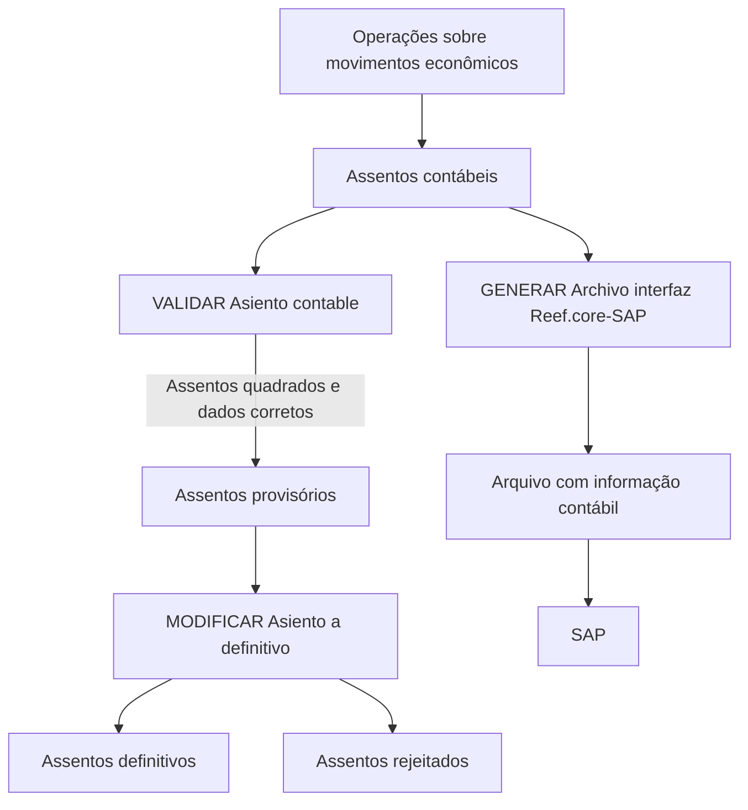

# Certificação de Contabilidade Nível 3 — Definição, Operação e Interface SAP

## 1. Metadados do Documento
- **Arquivo de Origem:** `Não identificado`
- **Tipo de Documento:** `Apresentação Executiva`
- **Domínio / Sistema:** `Contabilidade / Reef.core / SAP`
- **Público-Alvo:** `Negócio, Operação e usuários do módulo de Contabilidade`
- **Data/Versão Identificada:** `Não identificada`

---

## 2. Resumo Executivo & Contexto de Negócio

O conteúdo apresenta a “Certificación Contabilidad nivel 3”, organizada nos eixos de **definição**, **operação**, **consultas** e **interface SAP** para o módulo de Contabilidade.

A seção de definição abrange as definições específicas do módulo de Contabilidade e a definição das informações que serão levadas ao SAP, incluindo a relação dos dados entre os dois sistemas.

A seção operacional descreve operações sobre assentos contábeis. O processo **VALIDAR Asiento contable** verifica se os assentos estão quadrados e se todos os dados estão corretos para criação como provisórios. O processo **MODIFICAR Asiento a definitivo** permite transformar assentos provisórios em definitivos ou rejeitá-los.

O documento também descreve consultas da informação registrada e uma operação de integração: **GENERAR Archivo interfaz Reef.core-SAP**, que recupera informações dos assentos e cria um arquivo contábil para SAP.

---

## 3. Arquitetura, Componentes & Tecnologias Envolvidas

| Componente / Sistema | Papel identificado no conteúdo |
| :--- | :--- |
| Módulo de Contabilidade | Contém definições, operações, consultas e processos relacionados a assentos contábeis. |
| Assentos contábeis | Registros das entradas e saídas dos movimentos econômicos. |
| Reef.core | Sistema citado como origem no processo de geração do arquivo de interface para SAP. |
| SAP | Sistema de destino da informação contábil gerada pela interface. |
| Interface Reef.core-SAP | Processo que recupera informação de assentos e gera arquivo com informação contábil para SAP. |
| Zeus Reef | Nome exibido na navegação do conteúdo; o documento não detalha sua função. |



> **Nota de Análise:** O conteúdo cita Reef.core, SAP e a interface entre ambos, mas não detalha tecnologias, protocolos, formatos de arquivo, endpoints, métodos HTTP, contratos JSON, servidores ou ambientes.

---

## 4. Regras de Negócio, Especificações Funcionais & Processos

### 4.1 Definições do módulo de Contabilidade
- O documento inclui “Definiciones específicas del módulo de Contabilidad”.
- O conteúdo fornecido não detalha quais são essas definições específicas.

### 4.2 Definição da interface SAP
- A interface SAP define a informação que será levada ao SAP.
- A interface SAP estabelece a relação dos dados entre o módulo de Contabilidade e o SAP.
- O conteúdo não especifica o mapeamento de campos, as estruturas do arquivo, as regras de transformação ou os critérios de envio.

### 4.3 Operações sobre assentos contábeis
- As operações de assentos são orientadas ao registro contábil das entradas e saídas dos diferentes movimentos econômicos.

### 4.4 Processo: VALIDAR Asiento contable
1. O processo valida os assentos contábeis.
2. A validação verifica se os assentos estão quadrados.
3. A validação verifica se todos os dados estão corretos.
4. Quando os critérios são atendidos, os assentos podem ser criados como provisórios.

### 4.5 Processo: MODIFICAR Asiento a definitivo
1. O processo atua sobre assentos provisórios.
2. O processo permite passar os assentos provisórios para definitivos.
3. O processo também permite rejeitar os assentos provisórios.

### 4.6 Consultas de Contabilidade
- As consultas permitem visualizar informações registradas.
- A operação **CONSULTAR Contabilidad** mostra informações dos apontamentos contábeis segundo diferentes critérios.
- O documento não enumera os critérios disponíveis para consulta.

### 4.7 Processo: GENERAR Archivo interfaz Reef.core-SAP
1. O processo recupera informações dos assentos.
2. O processo cria um arquivo com informações contábeis.
3. O arquivo é destinado ao SAP.

---

## 5. Tabelas de Parâmetros, Ambientes e Estruturas de Dados

| Item / Parâmetro | Descrição / Função | Tipo / Valores / Formato | Ambiente / Observações |
| :--- | :--- | :--- | :--- |
| Contabilidade | Módulo abordado pelo documento. | Módulo funcional. | Não detalhado. |
| Assentos contábeis | Registros das entradas e saídas de movimentos econômicos. | Registro contábil. | Não detalhado. |
| VALIDAR Asiento contable | Valida quadratura e correção dos dados dos assentos para criá-los como provisórios. | Processo operacional. | Não detalhado. |
| MODIFICAR Asiento a definitivo | Converte assentos provisórios em definitivos ou os rejeita. | Processo operacional. | Não detalhado. |
| CONSULTAR Contabilidad | Consulta informações de apontamentos contábeis por diferentes critérios. | Operação de consulta. | Critérios não especificados. |
| Interface SAP | Define informação a levar para SAP e a relação dos dados entre sistemas. | Integração. | Mapeamentos não detalhados. |
| GENERAR Archivo interfaz Reef.core-SAP | Recupera informações dos assentos e gera arquivo contábil para SAP. | Processo de geração de arquivo. | Formato, local e frequência não detalhados. |
| Reef.core | Sistema citado no nome da interface de geração de arquivo. | Sistema. | Função adicional não detalhada. |
| SAP | Destino da informação contábil gerada pela interface. | Sistema externo de integração. | Não detalhado. |
| Accede al documento | Referência de acesso a documento complementar. | Link ou recurso de navegação. | URL não fornecida. |
| Accede al vídeo | Referência de acesso a vídeo complementar. | Link ou recurso de navegação. | URL não fornecida. |

---

## 6. Bateria de Perguntas & Respostas para RAG (FAQ Sintético)

### P1: Qual é o objetivo da certificação de Contabilidade nível 3?
**R:** A certificação apresenta conteúdos de definição, operação, consultas e interface SAP relacionados ao módulo de Contabilidade, incluindo assentos contábeis e geração de arquivo para integração entre Reef.core e SAP.

### P2: O que são os assentos contábeis no contexto do documento?
**R:** Os assentos contábeis são registros utilizados para contabilizar as entradas e saídas dos diferentes movimentos econômicos.

### P3: O que o processo VALIDAR Asiento contable valida?
**R:** O processo VALIDAR Asiento contable verifica se os assentos contábeis estão quadrados e se todos os dados estão corretos, permitindo criá-los como provisórios quando essas condições são atendidas.

### P4: Um assento provisório pode ser rejeitado?
**R:** Sim. O processo MODIFICAR Asiento a definitivo permite converter assentos provisórios em definitivos ou rejeitá-los.

### P5: Qual processo transforma um assento provisório em definitivo?
**R:** O processo MODIFICAR Asiento a definitivo permite passar assentos provisórios para definitivos.

### P6: O que a operação CONSULTAR Contabilidad permite visualizar?
**R:** A operação CONSULTAR Contabilidad mostra a informação dos apontamentos contábeis por diferentes critérios. O conteúdo não especifica quais critérios de consulta estão disponíveis.

### P7: Qual é a finalidade da interface SAP descrita?
**R:** A interface SAP define a informação que será levada ao SAP e a relação dos dados entre o sistema de Contabilidade e o SAP.

### P8: O que faz o processo GENERAR Archivo interfaz Reef.core-SAP?
**R:** O processo GENERAR Archivo interfaz Reef.core-SAP recupera informações dos assentos e cria um arquivo com informação contábil para SAP.

### P9: O documento informa o formato do arquivo gerado pela interface Reef.core-SAP?
**R:** Não. O conteúdo informa somente que a operação cria um arquivo com informação contábil para SAP, sem especificar formato, estrutura, local de armazenamento ou mecanismo de transferência.

### P10: O documento detalha os campos e o mapeamento de dados entre Contabilidade e SAP?
**R:** Não. O documento declara que a interface SAP define a informação a ser levada ao SAP e a relação de dados entre ambos os sistemas, mas não apresenta campos, regras de transformação ou mapeamento técnico.

---

## 7. Glossário de Termos, Siglas & Conceitos-Chave

- **SAP:** Sistema citado como destino da informação contábil produzida pela interface Reef.core-SAP. O significado da sigla não é expandido no conteúdo.
- **Reef.core:** Sistema citado como origem no nome da interface de geração do arquivo contábil para SAP.
- **Assento contábil:** Registro utilizado para contabilizar entradas e saídas de movimentos econômicos.
- **Assento provisório:** Assento criado após validação de que está quadrado e possui dados corretos.
- **Assento definitivo:** Assento provisório convertido para estado definitivo pelo processo MODIFICAR Asiento a definitivo.
- **Rejeição:** Resultado possível do processo MODIFICAR Asiento a definitivo aplicado a um assento provisório.
- **Apontamentos contábeis:** Informações registradas que podem ser visualizadas pela operação CONSULTAR Contabilidad.
- **Interface SAP:** Conjunto de definições e operações para levar informação contábil ao SAP.

---

## 8. Notas Críticas, Riscos & Limitações

- O documento não apresenta data, versão, autoria ou nome de arquivo de origem.
- O conteúdo faz referência a documentos e vídeos complementares por meio de “Accede al documento” e “Accede al vídeo”, mas não fornece URLs ou o conteúdo desses materiais.
- Não há detalhamento de campos, layouts, formatos, codificação, protocolos, frequência ou tratamento de erros da interface Reef.core-SAP.
- Não são informados os critérios específicos utilizados por CONSULTAR Contabilidad.
- Não são apresentados critérios adicionais para aprovação, rejeição ou alteração de assentos além da validação de quadratura e correção dos dados.
- Não há informações sobre ambientes, servidores, permissões, perfis de acesso, logs, auditoria ou mecanismos de reprocessamento.
- **Nota de Análise:** O documento lista o processo “GENERAR Archivo interfaz Reef.core-SAP”, porém não detalha o contrato técnico, o formato do arquivo ou o procedimento de disponibilização para SAP.

---

## 9. Conteúdo Bruto Estruturado (Referência Fiel)

```text
--- [PÁGINA 1 DE 2] ---

CERTIFICACIÓN Contabilidad nivel 3
DEFINICIÓN
OPERACIÓN
DEFINICIÓN
CONTABILIDAD
Definiciones específicas del módulo de Contabilidad
INTERFAZ SAP
Definición de la información que se llevará a SAP así como la relación de los datos de ambos sistemas
 Accede al documento
 Accede al vídeo
OPERACIÓN
ASIENTOS
Operaciones enfocadas a registrar en la contabilidad las entradas y salidas de los distintos movimientos
económicos
VALIDAR Asiento contable
Proceso que valida que los asientos contables están cuadrados y todos
los datos son correctos para crearlos como provisionales
 Accede al documento
 Accede al vídeo
MODIFICAR Asiento a definitivo
Esta operación permite pasar los asientos provisionales a definitivos o
bien rechazarlos
 Accede al documento
 Accede al vídeo
CONSULTAS
Operaciones por las que se puede ver la información registrada
 / 
 CF
Search Home Solutions Architectures APIs Events Components Cloud Documentation Zeus Reef Help News
EN


--- [PÁGINA 2 DE 2] ---

CONSULTAR Contabilidad
Muestra la información de los apuntes contables por distintos criterios
 Accede al documento
 Accede al vídeo
INTERFAZ SAP
Operaciones que generan información para integrar con otros sistemas
GENERAR Archivo interfaz Reef.core-SAP
Recupera información de los asientos y crea archivo con información contable para SAP
 Accede al documento
 Accede al vídeo
```
