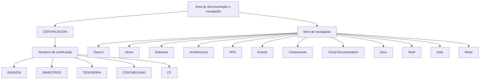

# Certificación — Temários por Módulo e Navegação da Plataforma

## 1. Metadados do Documento
- **Arquivo de Origem:** Não identificado
- **Tipo de Documento:** Procedimento / Índice de certificação
- **Domínio / Sistema:** Certificación; módulos de Emisión, Siniestros, Tesorería, Contabilidad e CF
- **Público-Alvo:** Usuários em processo de certificação; profissionais que consultam documentação, arquiteturas, APIs, eventos e componentes
- **Data/Versão Identificada:** Não identificada

---

## 2. Resumo Executivo & Contexto de Negócio

O conteúdo apresenta uma seção denominada **CERTIFICACIÓN**, destinada a disponibilizar os temários de cada nível de certificação. O documento estabelece que os temários são organizados por módulo, mas não informa os níveis existentes, critérios de aprovação, duração, formato de avaliação ou responsáveis pela certificação.

Os módulos explicitamente listados são **EMISIÓN**, **SINIESTROS**, **TESORERÍA**, **CONTABILIDAD** e **CF**. Não há descrição funcional, técnica ou de negócio para esses módulos no conteúdo fornecido.

Além da área de certificação, o material registra opções de navegação para conteúdos como busca, página inicial, soluções, arquiteturas, APIs, eventos, componentes, documentação em nuvem, Zeus, Reef, ajuda e notícias. A presença desses itens indica um ambiente de consulta documental, mas o documento não especifica a plataforma, URLs, mecanismos de acesso ou permissões.

O conteúdo está em espanhol e apresenta o seletor de idioma **EN**, porém não esclarece se existem traduções completas, idiomas adicionais ou regras de localização.

---

## 3. Arquitetura, Componentes & Tecnologias Envolvidas

O documento não descreve arquitetura de software, integrações, tecnologias, protocolos, microsserviços, bancos de dados, ambientes ou infraestrutura. A estrutura recuperável corresponde a uma organização documental: a área de certificação contém temários divididos por módulos, enquanto a navegação disponibiliza outras áreas de consulta.



> **Nota de Análise:** O documento não detalha a natureza funcional ou técnica dos módulos **EMISIÓN**, **SINIESTROS**, **TESORERÍA**, **CONTABILIDAD** e **CF**, nem explica as relações entre eles.

---

## 4. Regras de Negócio, Especificações Funcionais & Processos

1. A seção **CERTIFICACIÓN** contém os temários de cada nível de certificação.
2. Os temários de certificação são divididos por módulo.
3. Os módulos listados no conteúdo são:
   - EMISIÓN
   - SINIESTROS
   - TESORERÍA
   - CONTABILIDAD
   - CF
4. O documento disponibiliza navegação para áreas identificadas como Search, Home, Solutions, Architectures, APIs, Events, Components, Cloud Documentation, Zeus, Reef, Help e News.
5. O conteúdo exibe a identificação de idioma **EN**.

> **Nota de Análise:** Não há regras de elegibilidade, sequência obrigatória entre módulos, pré-requisitos, critérios de avaliação, notas mínimas, fluxos de inscrição, responsáveis ou processos operacionais detalhados.

---

## 5. Tabelas de Parâmetros, Ambientes e Estruturas de Dados

| Item / Parâmetro | Descrição / Função | Tipo / Valores / Formato | Ambiente / Observações |
| :--- | :--- | :--- | :--- |
| CERTIFICACIÓN | Seção que reúne temários de níveis de certificação. | Título de seção. | Não há versão, URL ou ambiente informado. |
| Temários | Conteúdo associado a cada nível de certificação. | Organização por módulo. | Os níveis de certificação não são enumerados. |
| EMISIÓN | Módulo listado na seção de certificação. | Nome de módulo. | Sem detalhamento adicional. |
| SINIESTROS | Módulo listado na seção de certificação. | Nome de módulo. | Sem detalhamento adicional. |
| TESORERÍA | Módulo listado na seção de certificação. | Nome de módulo. | Sem detalhamento adicional. |
| CONTABILIDAD | Módulo listado na seção de certificação. | Nome de módulo. | Sem detalhamento adicional. |
| CF | Módulo listado na seção de certificação. | Sigla ou nome abreviado. | Significado não definido no conteúdo. |
| Search | Item de navegação. | Rótulo de interface. | Sem comportamento descrito. |
| Home | Item de navegação. | Rótulo de interface. | Sem comportamento descrito. |
| Solutions | Item de navegação. | Rótulo de interface. | Sem comportamento descrito. |
| Architectures | Item de navegação. | Rótulo de interface. | Sem comportamento descrito. |
| APIs | Item de navegação. | Rótulo de interface. | Sem contratos, endpoints ou métodos descritos. |
| Events | Item de navegação. | Rótulo de interface. | Sem eventos, produtores ou consumidores descritos. |
| Components | Item de navegação. | Rótulo de interface. | Sem catálogo de componentes descrito. |
| Cloud Documentation | Item de navegação. | Rótulo de interface. | Sem provedor, ambiente ou tecnologia especificados. |
| Zeus | Item de navegação. | Nome próprio de área, sistema ou conteúdo. | O significado não é definido. |
| Reef | Item de navegação. | Nome próprio de área, sistema ou conteúdo. | O significado não é definido. |
| Help | Item de navegação. | Rótulo de interface. | Sem canal de suporte informado. |
| News | Item de navegação. | Rótulo de interface. | Sem periodicidade ou conteúdo informado. |
| EN | Indicador de idioma exibido. | Código/rótulo de idioma. | O documento não detalha o mecanismo de seleção de idioma. |

---

## 6. Bateria de Perguntas & Respostas para RAG (FAQ Sintético)

### P1: Qual é o objetivo da seção CERTIFICACIÓN?
**R:** A seção **CERTIFICACIÓN** reúne os temários de cada nível de certificação. O conteúdo informa que esses temários são divididos por módulo, mas não explica os níveis existentes nem os critérios associados à certificação.

### P2: Como os temários de certificação são organizados?
**R:** Os temários são organizados por módulo. O documento não apresenta uma estrutura adicional, como ordem de estudo, dependências entre módulos, carga horária ou etapas de avaliação.

### P3: Quais módulos são listados na área de certificação?
**R:** Os módulos listados são **EMISIÓN**, **SINIESTROS**, **TESORERÍA**, **CONTABILIDAD** e **CF**.

### P4: O que o documento explica sobre o módulo EMISIÓN?
**R:** O documento apenas lista **EMISIÓN** como um módulo da área de certificação. Não há descrição de objetivos, tópicos, processos de negócio, tecnologias ou requisitos relacionados ao módulo EMISIÓN.

### P5: O documento detalha o significado da sigla CF?
**R:** Não. **CF** aparece somente como um módulo listado na seção CERTIFICACIÓN. O significado da sigla não é definido no conteúdo fornecido.

### P6: Existem informações sobre APIs, endpoints ou contratos de integração?
**R:** Não. **APIs** aparece como um item de navegação, mas o documento não fornece endpoints, métodos HTTP, contratos, formatos de mensagem, autenticação ou detalhes de integração.

### P7: Quais áreas de consulta aparecem na navegação?
**R:** A navegação apresenta os itens **Search**, **Home**, **Solutions**, **Architectures**, **APIs**, **Events**, **Components**, **Cloud Documentation**, **Zeus**, **Reef**, **Help** e **News**.

### P8: O documento informa ambientes, servidores ou URLs?
**R:** Não. Não são apresentados ambientes, servidores, endereços URL, portas, credenciais, parâmetros de configuração ou caminhos de log.

### P9: O documento define critérios para aprovação na certificação?
**R:** Não. O conteúdo não informa notas mínimas, tipos de prova, requisitos de participação, pré-requisitos, validade da certificação ou critérios de aprovação.

### P10: Há indicação de idioma no conteúdo?
**R:** Sim. O conteúdo exibe **EN**. Entretanto, o documento não explica se esse indicador representa o idioma atual, uma opção de troca de idioma ou a disponibilidade de conteúdo em inglês.

### P11: O documento descreve a função de Zeus e Reef?
**R:** Não. **Zeus** e **Reef** aparecem como itens de navegação, mas o material não descreve seus objetivos, funcionalidades, integrações ou responsáveis.

---

## 7. Glossário de Termos, Siglas & Conceitos-Chave

- **CERTIFICACIÓN:** Seção que contém os temários de cada nível de certificação.
- **Temarios:** Temários ou conteúdos programáticos associados à certificação.
- **EMISIÓN:** Nome de módulo listado na seção CERTIFICACIÓN; não detalhado.
- **SINIESTROS:** Nome de módulo listado na seção CERTIFICACIÓN; não detalhado.
- **TESORERÍA:** Nome de módulo listado na seção CERTIFICACIÓN; não detalhado.
- **CONTABILIDAD:** Nome de módulo listado na seção CERTIFICACIÓN; não detalhado.
- **CF:** Sigla ou nome abreviado de módulo; significado não identificado no conteúdo.
- **APIs:** Item de navegação; o documento não apresenta definição adicional.
- **Events:** Item de navegação; o documento não apresenta definição adicional.
- **Cloud Documentation:** Item de navegação para documentação em nuvem; não há detalhamento.
- **Zeus:** Item de navegação; significado não definido.
- **Reef:** Item de navegação; significado não definido.
- **EN:** Indicador de idioma exibido no conteúdo.

---

## 8. Notas Críticas, Riscos & Limitações

- O conteúdo é extremamente resumido e não fornece os temários efetivos de cada módulo.
- Não há identificação do arquivo de origem, versão, data, autor, área responsável ou histórico de alterações.
- Não são detalhados os níveis de certificação mencionados.
- Não há critérios de aprovação, pré-requisitos, papéis, responsabilidades, cronogramas ou procedimentos operacionais.
- Não há arquitetura técnica, tecnologias, integrações, APIs, eventos, URLs, ambientes, servidores ou dados de configuração.
- Os termos **CF**, **Zeus** e **Reef** não são definidos.
- A classificação funcional dos módulos EMISIÓN, SINIESTROS, TESORERÍA e CONTABILIDAD não é descrita além de seus nomes.

---

## 9. Conteúdo Bruto Estruturado (Referência Fiel)

```text
--- [PÁGINA 1 DE 1] ---

CERTIFICACIÓN
 En este apartado se encuentran los temarios de cada uno de los niveles de certificación. Los temarios están divididos por
módulo.
 EMISIÓN
  SINIESTROS
  TESORERÍA
  CONTABILIDAD
 / 
 CF
Search Home Solutions Architectures APIs Events Components Cloud Documentation Zeus Reef Help News
EN
```
