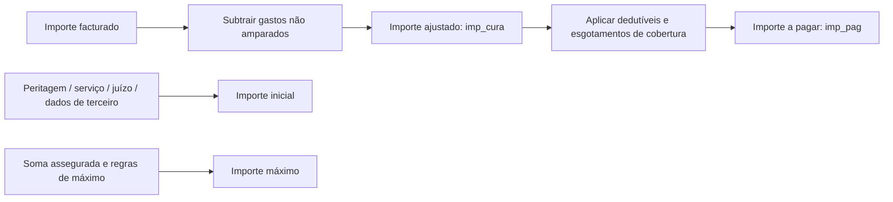

# Lógicas de Negocio de Siniestros — Facturación e Processo de Liquidación de Expedientes

## 1. Metadados do Documento
- **Arquivo de Origem:** `Não identificado no conteúdo fornecido`
- **Tipo de Documento:** Especificação Técnica
- **Domínio / Sistema:** Siniestros, Facturación, Liquidaciones de Expedientes, Reef.core e Tesorería
- **Público-Alvo:** Desenvolvedores, Arquitetos, Operação e Analistas Funcionais
- **Data/Versão Identificada:** Não identificada

---

## 2. Resumo Executivo & Contexto de Negócio

O documento descreve lógicas de negócio, tabelas de configuração, procedimentos e funções associados ao processo de faturamento e liquidação de expedientes de sinistros. O foco declarado é eliminar do documento tudo o que não afete a faturação de saúde, embora o conteúdo também contenha referências a automóveis, peritagens, oficinas, advogados, fornecedores, livros de compras e ordens de reparação.

A arquitetura funcional usa lógicas de negócio configuráveis por instalação. O documento afirma que o tratamento e a validação dos campos variam consideravelmente entre instalações; por essa razão, quase todos os campos do processo de liquidações possuem uma lógica de validação ou uma função responsável por retornar um valor selecionado ou padrão.

O processo cobre o cálculo de importes iniciais, máximos, ajustados e pagáveis para conceitos de cobrança e pagamento diversos, considerando cobertura, conceito de reserva, tipo de expediente, moeda, retificação, peritagem, dedutíveis, esgotamento de cobertura e outros critérios configuráveis. Há validações específicas para documentos, moedas, datas, tipos de câmbio, beneficiários e valores liquidados.

O package `ts_k_liquidaciones` concentra procedimentos e funções ligados às liquidações. As globais `cod_cia`, `num_sini` e `num_exp` são transmitidas aos procedimentos e funções; valores informados durante a navegação pelos campos também são mantidos em globais para uso nas validações subsequentes.

O documento também descreve controles de acesso por setor, ramo e programa, bem como o preenchimento de observações destinadas ao Plano de Tramitação. A configuração permite que a lógica de negócio determine a mensagem de erro de negação de acesso, que deve ser concatenada com o código do programa cujo acesso foi recusado.

---

## 3. Arquitetura, Componentes & Tecnologias Envolvidas

### Componentes, objetos e estruturas citados

| Componente / Objeto | Papel descrito |
| :--- | :--- |
| `G3000420` | Configura conceitos de cobrança e pagamento diversos por tipo de expediente e conceito de reserva. |
| `G3000430` | Configura o desdobramento de conceito de cobrança/pagamento diverso e conceito de reserva. |
| `G7001200` | Trata importes por causa, consequência, cobertura, tipo de expediente e conceito de reserva. |
| `G9990020` | Define lógicas de negócio para controle de acesso a programas por setor, ramo e código de programa. |
| `AP700300` | Processo de Liquidação de Expedientes. |
| `ts_k_liquidaciones` | Package que inclui procedimentos e funções do processo de liquidação. |
| `T_LSF_TRN_D_DSD` | Estrutura/tabela de valores por defeito associada a atributos de beneficiário e documento. |
| `DF_LSF_NWT_XX_PPD` | Aplicação de Primas Pendentes; indica à Tesouraria se recibos/primas pendentes são compensados contra o pagamento do sinistro. |
| `g1002700` | Referência para a oficina do utilizador, por meio de `cod_nivel3`. |
| `a5021105` | Referência de definição da oficina de pagamento. |
| `AS700001` | Rotina de impostos, ou a rotina correspondente, na qual é acionada a lógica de IVA padrão. |
| `Reef.core` | Sistema mencionado para codificação de atividades de terceiros, especialmente fornecedores. |
| Tesorería | Área destinatária da indicação sobre compensação de recibos/primas pendentes contra pagamento do sinistro. |
| Plano de Tramitación | Consumidor de `obs_tramite`, inserindo a informação como observações do plano quando aplicável. |

### Fluxo funcional reconstruído

```mermaid
graph TD
    A[Utilizador inicia Liquidação de Expediente] --> B[AP700300 / ts_k_liquidaciones]
    B --> C[Carrega globais cod_cia, num_sini, num_exp]
    B --> D[Obtém valores por defeito]
    D --> D1[Beneficiário]
    D --> D2[Atividade de terceiro]
    D --> D3[Terceiro]
    D --> D4[Documento]
    D --> D5[Oficina de pagamento e envio]
    D --> D6[Datas, moeda, IVA e tipo de documento]

    B --> E[Valida campos da liquidação]
    E --> E1[Documento e beneficiário]
    E --> E2[Moedas e câmbio]
    E --> E3[Datas]
    E --> E4[Importe liquidado]
    E --> E5[Tipo e número de documento]

    B --> F[Calcula importes]
    F --> F1[Importe inicial]
    F --> F2[Importe máximo]
    F --> F3[Importe ajustado]
    F --> F4[Importe a pagar]

    B --> G[Aplica controlos adicionais]
    G --> G1[Opção de liquidação]
    G --> G2[Anulação ou retificação]
    G --> G3[Ordens pendentes]
    G --> G4[Permissão de consulta de pagamentos profissionais]

    H[G9990020: Controlo de acesso] --> I[Cabecera de Siniestros]
    H --> J[Cabecera de Expedientes]
    I --> K[Mensagem de erro + código do programa]
    J --> K

    L[nom_prg_obs_tramite] --> M[Global obs_tramite]
    M --> N[Plano de Tramitación]
```



### Relações entre cálculos de importes



> **Nota de Análise:** O documento cita lógicas de negócio e funções com nomes técnicos, mas não detalha contratos JSON, métodos HTTP, tecnologias de middleware, versões de base de dados ou interfaces de integração.

---

## 4. Regras de Negócio, Especificações Funcionais & Processos

### 4.1. Conceitos de cobrança e pagamento diversos — `G3000420`

#### `nom_prg_1` — Importe inicial

A lógica `nom_prg_1` devolve o importe inicial para conceitos de cobrança e pagamento diversos nas liquidações. É acionada por `ts_k_ap700300.p_devuelve_imp_liq_inicial`.

Exemplos apresentados:

- Para o conceito de cobrança e pagamento diverso correspondente a indemnização à oficina, quando existe uma peritagem, o importe inicial pode ser o indicado na peritagem.
- Para pagamentos a profissionais externos:
  - Se existir custo de serviço por atividade na informação do terceiro, o importe pode ser obtido dessa informação.
  - Para advogado com honorários detalhados no módulo de juízos, o importe pode ser obtido do módulo de juízos.
  - Para perito com valor detalhado em peritagem, o importe pode ser obtido da peritagem.
- A origem concreta do valor muda conforme a instalação.

#### `nom_prg_2` — Importe máximo

A lógica `nom_prg_2` devolve o importe máximo para conceitos de cobrança e pagamento diversos nas liquidações. É acionada por `ts_k_ap700300.p_v_imp_liq_fra_2`.

### 4.2. Desdobramento de conceito de cobrança/pagamento e reserva — `G3000430`

#### `nom_prg_1` — Importe ajustado

A lógica `nom_prg_1` é acionada durante a faturação por `ts_k_ap300000.p_llama_procedimiento_1`.

A regra parte do importe faturado e subtrai gastos não amparados para devolver o importe ajustado. O documento menciona como referências:

- Saúde: custos usuais, razoáveis e habituais.
- Automóveis: peritagem.

A saída indicada é `imp_cura`.

#### `nom_prg_2` — Importe a pagar

A lógica `nom_prg_2` é acionada durante a faturação por `ts_k_ap300000.p_llama_procedimiento_2`.

A regra parte do importe ajustado e devolve o importe a pagar. O documento associa o cálculo a:

- Dedutíveis.
- Esgotamentos de cobertura.

A saída indicada é `imp_pag`.

### 4.3. Importes de ordem de peritagem

#### `nom_prg_ini_orden`

Retorna o importe inicial da valoração da ordem de peritagem para o conceito de cobrança/pagamento diverso e conceito de detalhe. É acionada por `ts_k_ap700610.p_imp_cto_defecto`.

#### `nom_prg_max_orden`

Retorna o importe máximo da valoração da ordem para o conceito de cobrança/pagamento diverso e conceito de detalhe. É acionada por `ts_k_ap700610.p_v_imp_cto`.

### 4.4. Importes por causa, consequência, cobertura, tipo de expediente e reserva — `G7001200`

A lógica `nom_prg_validacion` devolve o importe máximo durante:

- Ajuste de reservas.
- Mudança de valoração de um expediente.
- Avaliação por cobertura e conceito de reserva.

Quando o parâmetro da tabela determinar que deve ser usada a mesma lógica da valoração máxima nas liquidações, essa lógica também será acionada nas liquidações de um expediente por cobertura e conceito de reserva.

O acionamento ocorre em `ts_k_ap700300.p_aceptar_liquidacion`.

### 4.5. Controlo de acesso a programas — `G9990020`

A tabela define, por setor, ramo e código de programa, as lógicas de negócio que devem ser executadas no início dos programas para verificar se uma pessoa possui acesso.

Regras explícitas:

- A definição aceita os valores `999` para setor e ramo.
- O controlo é executado na cabeceira de sinistros ou na cabeceira de expedientes após a introdução do número de sinistro ou do número de expediente.
- A lógica de negócio deve controlar a mensagem de erro a apresentar.
- A mensagem de erro deve ser concatenada com o código do programa cujo acesso está a ser negado.

Pontos de acionamento:

- `ts_k_cabsini.pp_control_acceso_programa`
- `ts_k_cabexp.pp_control_acceso_programa`

### 4.6. Observações de tramitação — `nom_prg_obs_tramite`

A tabela pode definir, por setor, ramo e código de programa, lógicas de negócio que devolvem observações por meio da global `obs_tramite`.

Regras explícitas:

- As cabeceiras de sinistros e expedientes carregam a global `nom_prg_obs_tramite` após a introdução do sinistro e/ou expediente.
- A lógica de negócio é executada no final de cada programa.
- Quando a lógica é chamada pelo Plano de Tramitação, o Plano de Tramitação recolhe a global `obs_tramite` e insere o conteúdo como observações.

### 4.7. Processo de Liquidação de Expedientes — `AP700300`

O processo de liquidações possui validações e funções configuráveis por instalação. Além da validação de campos, existem objetos de base de dados para processos como:

- Exclusão de ordens de pagamento.
- Tratamento de Livros de Compras.

O package `ts_k_liquidaciones` contém cada procedimento e função. As globais comuns transmitidas a essas rotinas são:

- `cod_cia`
- `num_sini`
- `num_exp`

Quando o utilizador passa por um campo, o valor é armazenado numa global. Assim, durante a validação da moeda do documento, estão disponíveis informações como:

- `cod_act_tercero`
- `tip_benef`
- `tip_docum`
- `cod_docum`
- Moeda de pagamento.

O documento remete para `Proceso_de_Liquidaciones_de_Siniestros.doc` para informação detalhada adicional.

### 4.8. Valores por defeito — `T_LSF_TRN_D_DSD`

| Atributo / Função | Regra descrita |
| :--- | :--- |
| `bnf_typ_prd_nam` | Contém a lógica que devolve o tipo inicial de beneficiário para liquidações e justificantes soltos. Na versão de núcleo, chama `ts_f_liq_tip_benef_defecto`, que devolve `NULL`. |
| `pym_thp_acv_prd_nam` | Contém a lógica que devolve o código de atividade inicial do beneficiário. Na versão de núcleo, chama `ts_f_liq_act_tercero_def`, que devolve `NULL`. |
| `pym_thp_prd_nam` | Contém a lógica que devolve o código inicial de terceiro quando a atividade é codificada em `Reef.core`; fornecedores são mencionados como exemplo. Na versão de núcleo, chama `ts_f_liq_cod_tercero_def`, que devolve `NULL`. |
| `pym_thp_dcm_typ_prd_nam` | Contém a lógica que devolve o tipo de documento identificador inicial do terceiro. Na versão de núcleo, chama `ts_f_liq_tip_docum_defecto`, que devolve `NULL`. |
| `pym_thp_dcm_prd_nam` | Contém a lógica que devolve o número do documento do beneficiário. Na versão de núcleo, chama `ts_f_liq_cod_docum_defecto`. |

Exemplos explicitamente indicados:

- O tipo de beneficiário pode depender do tipo de expediente.
- Para liquidação de ordem de peritagem, o beneficiário pode ser obtido da própria ordem de peritagem.
- O código de atividade de terceiro pode ser obtido da ordem de reparação ou de um registo de fatura.
- O código de terceiro pode ser obtido da ordem de reparação ou de um registo de fatura.
- Para segurado em Espanha, o tipo de documento comum pode ser `DNI`.
- Para fornecedor em Espanha, o tipo de documento comum pode ser `CIF`.
- Para atividade de perito, pode ser obtido o perito atribuído à peritagem.
- Para atividade de advogado, pode ser obtido o advogado do expediente.
- Para atividade de oficina, pode ser usada a peritagem do encargo de peritagem.

### 4.9. Funções padrão de pagamento, envio, datas, documentos, impostos e moeda

- `pym_thr_lvl_prd_nam` devolve a oficina de pagamento padrão. A oficina corresponde à oficina do utilizador, `cod_nivel3` de `g1002700`, definida em `a5021105`.
- `ts_f_liq_ofi_envio_defecto` devolve a oficina de envio padrão.
- `ts_f_liq_fec_recep_fra_def` devolve a data de receção padrão da fatura; no núcleo devolve a data do sistema.
- `ts_f_fec_est_pago` devolve a data estimada de pagamento; no núcleo devolve a data de processo recebida em `fec_proceso`.
- `ts_f_liq_tip_docto_defecto` devolve o tipo de documento padrão. Os tipos citados são `FA`, `BV` e `NC`; no núcleo o padrão é `FA`.
- `ts_f_liq_tip_aprovecha` devolve o tipo de aproveitamento com base no tipo de IVA.
- `ts_f_tipo_iva_defecto` devolve o tipo de IVA padrão do documento. É acionada no início da rotina de impostos; no núcleo devolve `E`, correspondente a Exento.
- `ts_f_liq_mon_doc_defecto` devolve a moeda do documento padrão nas liquidações.

### 4.10. Aplicação de Primas Pendentes — `DF_LSF_NWT_XX_PPD`

A estrutura é usada no processo de liquidação de expedientes para indicar à Tesouraria se, havendo recibos ou primas pendentes, esses valores devem ser compensados contra o pagamento do sinistro.

Valores de `TYP_APY_RCP_PND`:

1. Importe pendente na data de ocorrência do sinistro.
2. Importe pendente na data de vencimento da apólice.
3. Não aplicável.

`TYP_APY_RCP_PND_PRD_TYP_VAL` indica se a forma de aplicação será devolvida por:

- `3`: Procedimento.
- `4`: Função.

`TYP_APY_RCP_PND_PRD_NAM` armazena o procedimento ou função. Quando o tipo anterior for `3`, armazena um procedimento; quando for `4`, armazena uma função.

### 4.11. Controlos adicionais das liquidações

| Procedimento / Função | Regra ou controlo |
| :--- | :--- |
| `ts_p_liq_valida_opcion` | Valida a opção selecionada após informar o sinistro: Liquidação, Retificação, Justificante Solto ou Anulação. |
| `ts_p_liq_anu_rect_liq` | Verifica se uma liquidação pode ser anulada ou retificada. |
| `ts_f_liq_perm_con_ord_pend` | Verifica se podem ser feitas liquidações de expedientes com ordens de reparação pendentes de liquidar. Na versão de núcleo devolve `N`. |
| `ts_f_liq_perm_cons_act` | Determina se o utilizador pode visualizar pagamentos profissionais. Na versão de núcleo devolve `TRUE`. |

### 4.12. Validações de campos

| Procedimento | Regra de validação |
| :--- | :--- |
| `ts_p_liq_documento_benef` | Valida o documento do beneficiário da liquidação. |
| `ts_p_valida_moneda_de_pago` | Se moeda de pagamento e moeda da liquidação forem diferentes, uma delas deve ser a moeda do país. |
| `ts_p_valida_mon_documento` | Valida a moeda do documento da liquidação; o importe é introduzido nessa moeda e internamente convertido para a moeda da liquidação/expediente. |
| `ts_p_liq_val_cambio_pago` | Valida o tipo de câmbio aplicado ao pagamento. |
| `ts_p_liq_val_fec_recep_fra` | Valida a data de receção da fatura da liquidação. |
| `ts_p_liq_fec_est_pago` | Valida a data estimada de pagamento. |
| `ts_p_liq_tipo_de_documento` | Valida o tipo de documento: Fatura, Boleta ou Nota de Crédito. |
| `ts_p_liq_moneda_exp` | Valida a moeda do expediente; em função da moeda do expediente e do tipo de documento, valida se o documento é correto. |
| `ts_p_liq_num_documento` | Valida o número do documento: Fatura, Boleta ou Nota de Crédito. |
| `ts_p_liq_fec_documento` | Valida a data do documento: Fatura, Boleta ou Nota de Crédito. |
| `ts_p_liq_emisor_documento` | Valida o emissor do documento. |
| `ts_p_liq_observaciones` | Executa validações necessárias antes de aceitar os Dados Fixos da Liquidação. |
| `ts_p_liq_valida_imp_liq` | Valida o importe liquidado por cobertura, conceito de reserva e conceito de cobrança/pagamento diverso. Permite controlo por tipo de documento além da lógica de importe máximo de `G3000420`. |

---

## 5. Tabelas de Parâmetros, Ambientes e Estruturas de Dados

### 5.1. Entradas e saídas — `G3000420 / nom_prg_1`

| Item / Parâmetro | Descrição / Função | Tipo / Valores / Formato | Ambiente / Observações |
| :--- | :--- | :--- | :--- |
| `cod_cia` | Código da companhia | Entrada | Liquidações |
| `num_sini` | Número de sinistro | Entrada | Liquidações |
| `num_exp` | Número de expediente | Entrada | Liquidações |
| `cod_pgm` | Código de programa | Entrada | Liquidações |
| `cod_ramo` | Código de ramo | Entrada | Liquidações |
| `tip_exp` | Tipo de expediente | Entrada | Liquidações |
| `cod_cob` | Código de cobertura | Entrada | Liquidações |
| `cod_cto_rva` | Código de conceito de reserva | Entrada | Liquidações |
| `cod_cto_cob_pag` | Código de conceito de cobrança/pagamento | Entrada | Liquidações |
| `cod_causa_sini` | Código de causa do sinistro | Entrada | Liquidações |
| `tip_liquidacion` | Tipo de liquidação | Entrada | Liquidações |
| `cod_mon` | Código de moeda | Entrada | Liquidações |
| `num_liq` | Número de liquidação | Entrada | Usado em retificação |
| `num_insp` | Número de inspeção/peritagem | Entrada | Usado quando não há retificação |
| `num_orden` | Número de ordem | Entrada | Usado quando não há retificação |
| `imp_inicial` | Importe inicial | Saída | Devolvido por `nom_prg_1` |

### 5.2. Entradas e saídas — `G3000420 / nom_prg_2`

| Item / Parâmetro | Descrição / Função | Tipo / Valores / Formato | Ambiente / Observações |
| :--- | :--- | :--- | :--- |
| `cod_cia` | Código da companhia | Entrada | Liquidações |
| `num_sini` | Número de sinistro | Entrada | Liquidações |
| `num_exp` | Número de expediente | Entrada | Liquidações |
| `cod_pgm` | Código de programa | Entrada | Liquidações |
| `cod_ramo` | Código de ramo | Entrada | Liquidações |
| `tip_exp` | Tipo de expediente | Entrada | Liquidações |
| `cod_cob` | Código de cobertura | Entrada | Liquidações |
| `cod_cto_rva` | Código de conceito de reserva | Entrada | Liquidações |
| `cod_causa_sini` | Código de causa do sinistro | Entrada | Liquidações |
| `tip_liquidacion` | Tipo de liquidação | Entrada | Liquidações |
| `cod_mon` | Código de moeda | Entrada | Liquidações |
| `num_liq` | Número de liquidação | Entrada | Retificação |
| `num_insp` | Número de inspeção/peritagem | Entrada | Não retificação |
| `num_orden` | Número de ordem | Entrada | Não retificação |
| `suma_aseg` | Soma assegurada | Saída indicada | Importe máximo |

### 5.3. Entradas e saídas — `G3000430`

| Item / Parâmetro | Descrição / Função | Tipo / Valores / Formato | Ambiente / Observações |
| :--- | :--- | :--- | :--- |
| `cod_cia` | Código da companhia | Entrada | `nom_prg_1` |
| `cod_causa_sini` | Código de causa do sinistro | Entrada | `nom_prg_1` |
| `num_sini` | Número de sinistro | Entrada | `nom_prg_1` |
| `num_exp` | Número de expediente | Entrada | `nom_prg_1` |
| `cod_cob` | Código de cobertura | Entrada | `nom_prg_1` |
| `cod_cto_rva` | Código de conceito de reserva | Entrada | `nom_prg_1` |
| `cod_cto_cob_pag` | Código de conceito de cobrança/pagamento | Entrada | `nom_prg_1` |
| `cod_det_cto` | Código de detalhe de conceito | Entrada | `nom_prg_1` |
| `num_ocurrencia` | Número de ocorrência | Entrada | `nom_prg_1` |
| `imp_cura` | Importe ajustado | Entrada e saída indicada | Ajustado após gastos não amparados |
| `num_factura` | Número de fatura | Entrada | `nom_prg_2` |
| `imp_pag` | Importe a pagar | Entrada e saída indicada | Após dedutíveis e esgotamentos |

### 5.4. Entradas e saídas — ordem de peritagem

| Item / Parâmetro | Descrição / Função | Tipo / Valores / Formato | Ambiente / Observações |
| :--- | :--- | :--- | :--- |
| `cod_cia` | Código da companhia | Entrada | Importe inicial e máximo de ordem |
| `cod_sector` | Código de setor | Entrada | Importe inicial e máximo de ordem |
| `num_sini` | Número de sinistro | Entrada | Importe inicial e máximo de ordem |
| `num_exp` | Número de expediente | Entrada | Importe inicial e máximo de ordem |
| `num_insp` | Número de inspeção/peritagem | Entrada | Importe inicial e máximo de ordem |
| `num_orden` | Número de ordem | Entrada | Importe inicial e máximo de ordem |
| `tip_propiedad` | Tipo de propriedade | Entrada | Importe inicial e máximo de ordem |
| `cod_cto_rva` | Conceito de reserva | Entrada | Importe inicial e máximo de ordem |
| `cod_cto_cob_pag` | Conceito de cobrança/pagamento | Entrada | Importe inicial e máximo de ordem |
| `cod_det_cto` | Conceito de detalhe | Entrada | Importe inicial e máximo de ordem |
| `imp_ini_orden` | Importe inicial da ordem | Saída | `nom_prg_ini_orden` |
| `imp_max_orden` | Importe máximo da ordem | Saída | `nom_prg_max_orden` |

### 5.5. Entradas e saídas — `G7001200`

| Item / Parâmetro | Descrição / Função | Tipo / Valores / Formato | Ambiente / Observações |
| :--- | :--- | :--- | :--- |
| `cod_cia` | Código da companhia | Entrada | Aceitação de liquidação |
| `cod_ramo` | Código de ramo | Entrada | Aceitação de liquidação |
| `num_sini` | Número de sinistro | Entrada | Aceitação de liquidação |
| `num_exp` | Número de expediente | Entrada | Aceitação de liquidação |
| `cod_cob` | Código de cobertura | Entrada | Aceitação de liquidação |
| `cod_cto_rva` | Código de conceito de reserva | Entrada | Aceitação de liquidação |
| `suma_aseg` | Soma assegurada | Entrada/saída conforme extração | Documento apresenta o campo em ambas as áreas |
| `max_spto_40` | Máximo indicado pela lógica | Saída | Ajuste de reservas e valoração |
| `max_spto_apli_40` | Máximo aplicável indicado pela lógica | Saída | Ajuste de reservas e valoração |

### 5.6. Entradas — controlo de acesso

| Item / Parâmetro | Descrição / Função | Tipo / Valores / Formato | Ambiente / Observações |
| :--- | :--- | :--- | :--- |
| `cod_cia` | Código da companhia | Entrada | Cabeceira de sinistros e expedientes |
| `num_sini` | Número de sinistro | Entrada | Cabeceira de sinistros e expedientes |
| `num_exp` | Número de expediente | Entrada | Cabeceira de expedientes |
| `cod_pgm` | Código de programa | Entrada | Cabeceira de sinistros e expedientes |
| `cod_procedimiento` | Procedimento configurado | Configuração | `G9990020` |
| Setor / ramo | Critérios de configuração | Valores `999` aceitos | `G9990020` |

### 5.7. Valores por defeito e respetivas entradas

| Item / Parâmetro | Descrição / Função | Tipo / Valores / Formato | Ambiente / Observações |
| :--- | :--- | :--- | :--- |
| `pym_thr_lvl_prd_nam` | Define a lógica da oficina de pagamento padrão | Atributo | Acionada por `ts_k_liquidaciones.f_oficina_pago_defecto` |
| `cod_nivel3_envio` | Nível de envio / oficina do utilizador | Entrada | Saída: código da oficina |
| `ts_f_liq_ofi_envio_defecto` | Devolve oficina de envio padrão | Função | Entradas: `cod_cia`, `cod_usr` |
| `ts_f_liq_fec_recep_fra_def` | Devolve data de receção padrão da fatura | Função | No núcleo: data do sistema |
| `ts_f_fec_est_pago` | Devolve data estimada de pagamento padrão | Função | No núcleo: `fec_proceso` |
| `fec_proceso` | Data de processo | Entrada | `ts_f_fec_est_pago` |
| `ts_f_liq_tip_docto_defecto` | Devolve tipo de documento padrão | Função | No núcleo: `FA` |
| `ts_f_liq_tip_aprovecha` | Devolve tipo de aproveitamento | Função | Baseado no tipo de IVA |
| `THP_TAX_TYP_PRD_NAM` | Atributo ligado ao tipo de IVA | Atributo | `T_LSF_TRN_D_DSD` |
| `ts_f_tipo_iva_defecto` | Devolve tipo de IVA padrão | Função | Entrada: `tip_dcto`; núcleo: `E` |
| `ts_f_liq_mon_doc_defecto` | Devolve moeda padrão do documento | Função | Entradas: `cod_cia`, `num_sini`, `cod_exp` |

### 5.8. Aplicação de primas pendentes

| Item / Parâmetro | Descrição / Função | Tipo / Valores / Formato | Ambiente / Observações |
| :--- | :--- | :--- | :--- |
| `TYP_APY_RCP_PND` | Tipo de aplicação de recibos/primas pendentes | `1`, `2` ou `3` | Data de ocorrência, vencimento da apólice ou não aplicável |
| `TYP_APY_RCP_PND_PRD_TYP_VAL` | Tipo de objeto configurado | `3` ou `4` | `3`: procedimento; `4`: função |
| `TYP_APY_RCP_PND_PRD_NAM` | Nome do procedimento ou função | Configuração | Conforme o tipo configurado |
| `TIP_APLICA_REC` | Tipo de aplicação de recibo | Entrada | Associado ao procedimento/função |

### 5.9. Entradas — validações de moeda

| Item / Parâmetro | Descrição / Função | Tipo / Valores / Formato | Ambiente / Observações |
| :--- | :--- | :--- | :--- |
| `cod_cia` | Código da companhia | Entrada | Validações de moeda |
| `num_sini` | Número de sinistro | Entrada | Validações de moeda |
| `num_exp` | Número de expediente | Entrada | Validações de moeda |
| `cod_mon_liq` | Moeda da liquidação | Entrada | Pagamento e documento |
| `cod_mon_pago` | Moeda de pagamento | Entrada | Pagamento e documento |
| `cod_mon_fra` | Moeda da fatura/documento | Entrada | Validação de moeda do documento |

---

## 6. Bateria de Perguntas & Respostas para RAG (FAQ Sintético)

### P1: Como é calculado o importe ajustado de uma liquidação?
**R:** O importe ajustado é obtido pela lógica `nom_prg_1` de `G3000430`, acionada por `ts_k_ap300000.p_llama_procedimiento_1`. A regra parte do importe faturado e subtrai os gastos não amparados. O documento cita custos usuais, razoáveis e habituais para Saúde e peritagem para Automóveis como referências do ajuste. A saída é `imp_cura`.

### P2: Qual lógica calcula o importe a pagar depois do ajuste de faturação?
**R:** A lógica `nom_prg_2` de `G3000430`, acionada por `ts_k_ap300000.p_llama_procedimiento_2`, recebe o importe ajustado e devolve o importe a pagar, `imp_pag`. O documento associa esse cálculo à aplicação de dedutíveis e esgotamentos de cobertura.

### P3: De onde pode vir o importe inicial de uma liquidação para profissionais externos?
**R:** A lógica `nom_prg_1` de `G3000420` pode obter o importe inicial de diferentes fontes conforme a instalação. Para profissionais externos, o valor pode vir do custo de serviço por atividade na informação do terceiro, dos honorários detalhados no módulo de juízos para advogados ou da peritagem para peritos.

### P4: Como o sistema controla acesso a programas no processo de sinistros?
**R:** A tabela `G9990020` configura lógicas de negócio por setor, ramo e código de programa. Essas lógicas são acionadas nas cabeceiras de sinistros e expedientes depois de informar o sinistro ou expediente. A lógica deve decidir se a pessoa possui acesso e definir a mensagem de erro; o código do programa cujo acesso é negado deve ser concatenado à mensagem.

### P5: Quais valores de setor e ramo são aceitos na configuração de controlo de acesso?
**R:** A definição de controlo de acesso a programas em `G9990020` aceita o valor `999` tanto para setor como para ramo.

### P6: Quais dados globais são sempre passados às funções e procedimentos do package `ts_k_liquidaciones`?
**R:** O documento indica que `cod_cia`, `num_sini` e `num_exp` são as globais transmitidas a cada procedimento e função do package `ts_k_liquidaciones`. Além dessas globais, valores dos campos percorridos no processo são guardados para estarem disponíveis nas validações posteriores.

### P7: Qual é a validação quando a moeda de pagamento é diferente da moeda da liquidação?
**R:** `ts_p_valida_moneda_de_pago`, acionada por `ts_k_liquidaciones.p_valida_moneda_de_pago`, valida que, caso a moeda de pagamento e a moeda da liquidação sejam diferentes, uma das duas moedas deve ser a moeda do país.

### P8: Qual é o valor padrão do tipo de documento na versão de núcleo?
**R:** A função `ts_f_liq_tip_docto_defecto`, acionada por `ts_k_liquidaciones.f_tipo_documento_defecto`, devolve `FA` como tipo de documento padrão na versão de núcleo. O documento cita `FA`, `BV` e `NC` como tipos de documento usados em liquidações.

### P9: Como são tratados recibos ou primas pendentes contra o pagamento de sinistro?
**R:** A tabela `DF_LSF_NWT_XX_PPD` informa à Tesouraria se recibos ou primas pendentes devem ser compensados contra o pagamento do sinistro. `TYP_APY_RCP_PND` permite calcular o pendente na data de ocorrência do sinistro, na data de vencimento da apólice ou definir que não se aplica. A forma de aplicação pode ser fornecida por procedimento ou função.

### P10: O que a função `ts_f_liq_perm_con_ord_pend` controla?
**R:** A função verifica se é permitido realizar liquidações de expedientes mesmo quando existirem ordens de reparação pendentes de liquidar. É acionada ao fechar a janela de seleção de ordens de reparação. Na versão de núcleo, a função devolve `N`.

### P11: Qual é o valor padrão de IVA no núcleo?
**R:** A função `ts_f_tipo_iva_defecto`, acionada por `ts_k_liquidaciones.f_tipo_iva_defecto` no início da rotina de impostos, devolve `E`, correspondente a Exento, na versão de núcleo. A função recebe `tip_dcto` como parâmetro de entrada.

### P12: Como são gravadas observações no Plano de Tramitação?
**R:** Uma lógica configurada em `nom_prg_obs_tramite` devolve observações por meio da global `obs_tramite`. A lógica é executada no final de cada programa. Quando invocada pelo Plano de Tramitação, o Plano recolhe `obs_tramite` e insere esse valor como observações.

---

## 7. Glossário de Termos, Siglas & Conceitos-Chave

- **AP700300:** Processo de Liquidação de Expedientes.
- **AS700001:** Rotina de impostos mencionada como ponto de execução da lógica de IVA padrão.
- **BV:** Tipo de documento citado em conjunto com `FA` e `NC`; o documento não expande a sigla.
- **CIF:** Código de Identificação Fiscal, citado como tipo de documento comum para fornecedor em Espanha.
- **DNI:** Documento Nacional de Identidad, citado como tipo de documento comum para segurado em Espanha.
- **Expediente:** Processo ou caso associado a um sinistro.
- **FA:** Tipo de documento devolvido como padrão pela versão de núcleo.
- **G3000420:** Conceitos de cobrança e pagamento diversos por tipo de expediente e conceito de reserva.
- **G3000430:** Desdobramento de conceito de cobrança/pagamento diverso e conceito de reserva.
- **G7001200:** Importes por causa, consequência, cobertura, tipo de expediente e conceito de reserva.
- **G9990020:** Controlo de acesso a programas.
- **IVA:** Imposto sobre o Valor Acrescentado; o valor padrão do núcleo é `E`, Exento.
- **NC:** Tipo de documento citado em conjunto com `FA` e `BV`; o documento não expande a sigla.
- **Peritagem:** Avaliação/perícia associada a sinistro, ordem ou oficina.
- **Plano de Tramitación:** Componente que recolhe `obs_tramite` e grava observações.
- **Reef.core:** Sistema citado para codificação de atividades de terceiro, tipicamente fornecedores.
- **Siniestro:** Sinistro.
- **Tesorería:** Área que recebe a indicação sobre aplicação de recibos/primas pendentes.
- **T_LSF_TRN_D_DSD:** Tabela/estrutura de valores por defeito.
- **`cod_cia`:** Código da companhia.
- **`num_sini`:** Número de sinistro.
- **`num_exp`:** Número de expediente.
- **`obs_tramite`:** Global que contém observações para o Plano de Tramitação.
- **`imp_cura`:** Importe ajustado.
- **`imp_pag`:** Importe a pagar.

---

## 8. Notas Críticas, Riscos & Limitações

- O documento declara que o tratamento e a validação dos campos podem variar consideravelmente entre instalações. Portanto, valores e comportamentos de uma instalação não devem ser assumidos como universais.
- Diversas funções da versão de núcleo devolvem `NULL`, `N`, `TRUE`, `FA`, `E` ou a data do sistema. Esses valores são comportamentos explicitamente descritos para o núcleo e podem ser substituídos por lógicas configuradas.
- O documento fornece nomes de objetos, entradas, saídas e pontos de execução, mas não apresenta a implementação SQL/PLSQL, assinaturas completas, regras de erro detalhadas, mensagens concretas, contratos de integração ou modelo físico de dados.
- O texto cita o documento `Proceso_de_Liquidaciones_de_Siniestros.doc` como fonte de detalhe adicional, mas esse documento não foi disponibilizado no conteúdo analisado.
- A extração apresenta algumas listas de entrada/saída com formatação incompleta ou ambígua, especialmente em `G7001200` e em algumas funções de valores por defeito. Os campos foram preservados sem inferir semântica adicional.
- Não foram identificadas URLs, servidores, portas, ambientes de implantação, versões de software ou políticas de autenticação.
- **Nota de Análise:** O documento menciona Saúde, Automóveis, oficinas, advogados, peritos e fornecedores, mas não especifica integralmente quais regras são exclusivas de cada ramo ou instalação.

---

## 9. Conteúdo Bruto Estruturado (Referência Fiel)

```text
--- [PÁGINA 1 DE 15] ---

LÓGICAS de NEGOCIO SINIESTROS-
FACTURACIÓN
ELIMINAR TODO LO QUE NO AFECTE A LA FACTURACIÓN DE SALUD.ESTE DOCUMENTO ES
UN A COPIA DE LAS LIQUIDACIONES.
Liquidaciones
Conceptos Cobro y pago vario por Tipo de Expediente y concepto de reserva
(G3000420)
nom_prg_1
Importe inicial para los conceptos de cobro y pago vario de las liquidaciones.
Lanzado desde ts_k_ap700300.p_devuelve_imp_liq_inicial
ENTRADA SALIDA
cod_cia imp_inicial
num_sini
num_exp
cod_pgm
cod_ramo
tip_exp
cod_cob
 /
 CF
Home Solutions APIs Documentation Zeus
EN


--- [PÁGINA 2 DE 15] ---

ENTRADA SALIDA
cod_cto_rva
cod_cto_cob_pag
cod_causa_sini
tip_liquidacion
cod_mon
Rectificación: num_liq
NO Rectificación: num_insp, num_orden
Ejemplos: En el caso de concepto de cobro y pago vario indemnización al taller, el importe inicial,
si se tiene una peritación, sería el indicado en la peritación.
En caso de conceptos de cobro y pago varios para pagar a profesionales externos podríamos
obtenerlo de:
- Si tenemos el coste de servicio por actividad, en la información del tercero, se tomaría de ahí.
- Si es un abogado y se ha detallado los honorarios en el módulo de juicio, se obtendría del módulo
de juicios.
- Si es un perito y se ha detallado en la peritación...
Esto cambia por instalación.
nom_prg_2
Importe máximo para los conceptos de cobro y pago vario de las liquidaciones.
Lanzado desde ts_k_ap700300.p_v_imp_liq_fra_2
ENTRADA SALIDA
cod_cia suma_aseg
num_sini


--- [PÁGINA 3 DE 15] ---

ENTRADA SALIDA
num_exp
cod_pgm
cod_ramo
tip_exp
cod_cob
cod_cto_rva
cod_causa_sini
tip_liquidacion
cod_mon
si Rectificación: num_liq
si NO Rectificación: num_insp, num_orden
Desglose de Concepto de cobro y pago vario y concepto de reserva (G3000430)
nom_prg_1
Se lanza en la facturación. Partiendo del importe facturado menos los gastos no amparados, nos
devuelve el importe ajustado. (Salud costos usuales razonables y acostumbrados, Autos peritación). -
Lanzado desde ts_k_ap300000.p_llama_procedimiento_1
ENTRADA SALIDA
cod_cia imp_cura
cod_causa_sini
num_sini


--- [PÁGINA 4 DE 15] ---

ENTRADA SALIDA
num_exp
cod_cob
cod_cto_rva
cod_cto_cob_pag
cod_det_cto
num_ocurrencia
imp_cura
nom_prg_2
Se lanza en la facturación. Partiendo del importe ajustado, se obtiene el importe a pagar. (Deducibles
y agotamientos de cobertura). - Lanzado desde ts_k_ap300000.p_llama_procedimiento_2
ENTRADA SALIDA
cod_cia imp_pag
num_sini
num_exp
num_factura
cod_cob
cod_cto_rva
cod_cto_cob_pag
cod_det_cto


--- [PÁGINA 5 DE 15] ---

ENTRADA SALIDA
imp_pag
nom_prg_ini_orden
Será el importe inicial de la valoración de la orden de peritación, para el concepto de cobro y pago
vario y concepto de detalle.
Lanzado desde ts_k_ap700610.p_imp_cto_defecto
ENTRADA SALIDA
cod_cia imp_ini_orden
cod_sector
num_sini
num_exp
num_insp
num_orden
tip_propiedad
cod_cto_rva
cod_cto_cob_pag
cod_det_cto
nom_prg_max_orden
Será el importe máximo de la valoración de la orden para el concepto de cobro y pago vario y
concepto de detalle.
Lanzado desde ts_k_ap700610.p_v_imp_cto.


--- [PÁGINA 6 DE 15] ---

ENTRADA SALIDA
cod_cia imp_max_orden
cod_sector
num_sini
num_exp
num_insp
num_orden
tip_propiedad
cod_cto_rva
cod_cto_cob_pag
cod_det_cto
Importes Causa/Consec./Cob./Tipo Exp./Cto.Rva. (G7001200)
nom_prg_validacion
Lógica de Negocio que devuelve el Importe máximo en el ajuste de reservas y cambio de valoración
de un expediente, para cada cobertura, concepto de reserva. Si el parámetro de la tabla indica que
es la misma lógica de Lógica de Negocio de valoración máxima, se utilice en las liquidaciones, se
lanzará también en las liquidaciones de un expediente por cobertura / concepto de reserva.
Lanzado desde: ts_k_ap700300.p_aceptar_liquidacion.
ENTRADA SALIDA
cod_cia suma_aseg
cod_ramo


--- [PÁGINA 7 DE 15] ---

ENTRADA SALIDA
num_sini
num_exp
max_spto_40
max_spto_apli_40
cod_cob
cod_cto_rva
suma_aseg
max_spto_40
max_spto_apli_40
Control de acceso a programas (G9990020)
En esta tabla, por sector, ramo y código de programa, se definirán las lógicas de negocio que se
quieran lanzar al inicio de cada uno de los programas para controlar si la persona tiene o no acceso.
En dicha definición, se aceptan el sector y el ramo 999.
cod_procedimiento
Se lanzará tanto en la cabecera de siniestros como en la cabecera de expedientes una vez que se
hayan introducido el número de siniestro o el número de expediente.
Lanzado desde: ts_k_cabsini.pp_control_acceso_programa.
ENTRADA
cod_cia
num_sini


--- [PÁGINA 8 DE 15] ---

ENTRADA
cod_pgm
Lanzado desde: ts_k_cabexp.pp_control_acceso_programa.
ENTRADA
cod_cia
num_sini
num_exp
cod_pgm
Cada lógica de Negocio, deberá controlar el mensaje de error que quiere que aparezca y se le debe
concatenar el código del programa al cual se le está negando el acceso.
nom_prg_obs_tramite
En esta tabla, por sector, ramo y código de programa, se definirán los Lógicas de Negocios que
mediante la global ‘obs_tramite’ nos devolverán las observaciones que quieren grabarse en el Plan
de Tramitación.
En las cabeceras de siniestros y de expedientes se cargará la global ‘nom_prg_obs_tramite’ una vez
que se haya introducido el siniestro y/o el expediente. Este Lógica de Negocio, se lanzará al final de
cada uno de los programas y si es llamado por el Plan de Tramitación, este será el encargado de
recoger la global ‘obs_tramite’ e insertarla como observaciones del Plan.
ENTRADA SALIDA
nom_prg_obs_tramite obs_tramite
Proceso de Liquidación de Expedientes (AP700300)
Debido a que en cada instalación, el tratamiento y validación de cada uno de los campos varía
considerablemente, prácticamente por cada uno de los campos que se piden en el proceso de
Liquidaciones de expedientes, se ha realizado una lógica de negocio de validación o una función que
nos devuelve el valor elegido.


--- [PÁGINA 9 DE 15] ---

Aparte de las validaciones de los campos, también hay objetos de base de datos para realizar otros
procesos, como la exclusión de órdenes de pago, tratamiento de Libros de Compras etc.
Cada uno de dichos procedimientos y funciones se incluyen en un package ts_k_liquidaciones
Las globales que se pasan a cada uno de los procedimientos y funciones son la cod_cia, num_sini
y num_exp. Además, cada vez que pasamos por un campo, dicho valor se almacena en una
global, de forma que si estamos en el procedimiento que valida la moneda del documento,
tendremos disponibles el beneficiario de la liquidación (cod_act_tercero, tip_benef, tip_docum,
cod_docum) y la moneda de pago. Para una información más detallada, ver Documento
“Proceso_de_Liquidaciones_de_Siniestros.doc”.
Valores por defecto T_LSF_TRN_D_DSD
bnf_typ_prd_nam
En este atributo está la lógica de negocio que devuelve el tipo de beneficiario inicial en las
liquidaciones y justificantes sueltos. En la versión de núcleo el atributo contiene ts_k_liquidaciones.f
tip_benef_defecto_ que llama al ts_f_liq_tip_benef_defecto, que devuelve NULL.
Ejemplo: Se podría realizar la función que devuelta el tipo beneficiario, dependiendo del tipo de
expediente o si la liquidación es de una orden de peritación traer el beneficiario de la orden de
peritación.
pym_thp_acv_prd_nam
En este atributo está la lógica que devuelve el código de actividad del beneficiario inicial en las
liquidaciones. En la versión de núcleo contiene ts_k_liquidaciones.f_ cod_act_tercero_defecto que
llama al ts_f_liq_act_tercero_def, devuelve ‘NULL’.
Ejemplo: Puede obtenerse de la orden de reparación, o de un registro de factura.
pym_thp_prd_nam
Este atributo contendrá la Lógica de Negocio que devuelve el código de tercero inicial, siempre y
cuando sea una actividad que esté definida como que se codifica en Reef.core, que suelen ser los
proveedores.En la versión de núcleo contiene ts_k_liquidaciones.f cod_tercero_defecto que llama al
ts_f_liq_cod_tercero_def, que devuelve ‘NULL’.
Ejemplo: Puede obtenerse de la orden de reparación, o de un registro de factura.
pym_thp_dcm_typ_prd_nam
Este atributo contendrá la Lógica de Negocio que devuelve el tipo de documento que identifica aun
tercero, inicial. En la versión de núcleo contiene ts_k_liquidaciones.f_tip_docum_defecto que llama al
ts_f_liq_tip_docum_defecto, que devuelve ‘NULL’.


--- [PÁGINA 10 DE 15] ---

Ejemplo: Lo normal es devolver el tipo de documento más común para la actividad del beneficiario.
En España si es una asegurado sería DNI (Documento Nacional de Identidad.) Si es un proveedor
sería CIF, (Código de Identificación Fiscal)
pym_thp_dcm_prd_nam
Este atributo contendrá la lógica de Negocio que devuelve el número del documento del beneficiario
en las liquidaciones. En la versión de núcleo contiene ts_k_liquidaciones.f cod_docum_defecto_ que
llama al ts_f_liq_cod_docum_defecto.
Ejemplo: Si se introduce la actividad de perito, se puede obtener el peritos asignado a la peritación ,
la actividad de es abogado, se puede obtener el abogado del expediente, si la actividad es taller, se
puede obtener la peritación del encargo de la peritación.
pym_thr_lvl_prd_nam
Devuelve la oficina de pago que se va a utilizar por defecto en las liquidaciones. La oficina de pago
que corresponde a la oficina del usuario (cod_nivel3 de la g1002700) y que está definida en la
a5021105. LANZADO desde ts_k_liquidaciones.f_oficina_pago_defecto
ENTRADA SALIDA
cod_cia código de la oficina
cod_nivel3_envio
ts_f_liq_ofi_envio_defecto
Devuelve la oficina de envió que se va a utilizar por defecto en las liquidaciones. LANZADO desde
ts_k_liquidaciones.f_oficina_envio_defecto
ENTRADA
cod_cia
cod_usr
ts_f_liq_fec_recep_fra_def
Devuelve la fecha de recepción de la factura por defecto. LANZADO desde
ts_k_liquidaciones.f_fec_recep_fra_def En la versión de núcleo devuelve la fecha del sistema
ts_f_fec_est_pago


--- [PÁGINA 11 DE 15] ---

Devuelve la fecha que por defecto se va a poner como fecha estimada de pago. En la versión de
núcleo devuelve la fecha de proceso pasado por parámetro (fec_proceso) LANZADO desde
ts_k_liquidaciones.f_fec_est_pago_defecto |ENTRADA| |:--| |cod_cia |cod_ramo |num_sini |num_exp
|fec_proceso |cod_act_tercero, |tip_docum, |cod_docum.
ts_f_liq_tip_docto_defecto
Devuelve el tipo de documento por defecto que se utiliza en las liquidaciones. (FA, BV, NC) En la
versión De núcleo devuelve ‘FA’ como tipo de documento por defecto. LANZADO desde
ts_k_liquidaciones.f_tipo_documento_defecto
ts_f_liq_tip_aprovecha
Devuelve el tipo de aprovechamiento, en base al tipo de iva. LANZADO desde
ts_k_liquidaciones.f_tip_aprovechamiento
(T_LSF_TRN_D_DSD) THP_TAX_TYP_PRD_NAM
ts_f_tipo_iva_defecto
Devuelve el tipo de IVA que por defecto tiene el documento. Se lanza en el inicio de la Rutina de
Impuestos (AS700001 o la que corresponda). En la versión De núcleo devuelve ‘E’ (Exento).
LANZADO desde ts_k_liquidaciones.f_tipo_iva_defecto Parámetro de ENTRADA: tip_dcto
ts_f_liq_mon_doc_defecto
Devuelve la moneda del documento que se va a utilizar por defecto en las liquidaciones. LANZADO
desde ts_k_liquidaciones.f_moneda_docum_defecto |ENTRADA|
|:--| |cod_cia, |num_sini, |cod_exp
Aplicación Primas Pendientes
(DF_LSF_NWT_XX_PPD)
Tabla de definición utilizada en el proceso de liquidaciones de expedientes, para indicar a Tesorería si
en caso de tener recibos/primas pendientes, se netea contra el pago del siniestro.
TYP_APY_RCP_PND
Dependiendo de este tipo, se calculará el importe de los recibos:
1 = Importe pendiente a la fecha de ocurrencia del siniestro 2 = Importe pendiente a la fecha de
vencimiento de la póliza 3 = No se aplica
TYP_APY_RCP_PND_PRD_TYP_VAL
Será una lógica de negocio o una función el que devuelva el tipo a aplicar: 3 = Procedimiento. 4 =
Función.
TYP_APY_RCP_PND_PRD_NAM


--- [PÁGINA 12 DE 15] ---

Procedimiento/Función que nos indica la forma en la que se aplican las primas pendientes. Si el
campo anterior (TYP_APY_RCP_PND_PRD_TYP_VAL) es un 3, se almacena un procedimiento. Si
el campo anterior es un 4 se almacena una función.
ENTRADA
TIP_APLICA_REC
Controles Extras de las Liquidaciones
ts_p_liq_valida_opcion
Procedimiento que valida la opción seleccionada una vez que se introduzca el número de siniestro
(LIQuidacion, RECtificacion, JUStificante Suelto, ANUlacion).
Este procedimiento, se lanza cuando se selecciona la opción que se quiere realizar.
Lanzado desde ts_k_liquidaciones.p_valida_opcion.
ts_p_liq_anu_rect_liq
Procedimiento que se encarga de verificar si una liquidación puede ser anulada o rectificada Se lanza
cuando se selecciona una liquidación para ser rectificada o anulada.
Lanzado desde ts_k_liquidaciones.p_puedo_anu_rect_liquidacion
ts_f_liq_perm_con_ord_pend
Función que se encarga de verificar si se pueden realizar liquidaciones de expedientes, aunque
tengan órdenes de reparación pendientes de liquidar. Esta función se lanza cuando se cierra la
ventana de selección de órdenes de reparación. En la versión de núcleo devuelve ‘N’
Lanzado desde ts_k_liquidaciones.f_perm_con_ord_pend
ts_f_liq_perm_cons_act
Función que se encarga en determinar si el usuario puede visualizar o no los pagos profesionales. En
la versión de núcleo devuelve “TRUE” - Lanzado desde ts_k_liquidaciones.f_perm_cons_act
Validaciones de campos
ts_p_liq_documento_benef
Valida el documento del beneficiario de la liquidación. - LANZADO desde
ts_k_liquidaciones.p_valida_documento_benef
ts_p_valida_moneda_de_pago


--- [PÁGINA 13 DE 15] ---

Valida que, si la moneda de pago y la de la liquidación son diferentes, una de las dos ha de ser la
moneda del país - LANZADO desde ts_k_liquidaciones.p_valida_moneda_de_pago
ENTRADA
cod_cia
num_sini
num_exp
cod_mon_liq
cod_mon_pago
ts_p_valida_mon_documento
Valida la moneda del documento de la liquidación. Será la moneda en la cual se introduce el importe
de la liquidación. Internamente, será cambiado a la moneda de la liquidación (expediente).
LANZADO desde ts_k_liquidaciones.p_valida_moneda_documento
ENTRADA
cod_cia
num_sini
num_exp
cod_mon_liq
cod_mon_pago
cod_mon_fra
ts_p_liq_val_cambio_pago
Valida el tipo de cambio que se va a aplicar para el pago de la liquidación.
LANZADO desde ts_k_liquidaciones.p_valida_val_cambio_pago


--- [PÁGINA 14 DE 15] ---

ts_p_liq_val_fec_recep_fra
Valida la fecha de recepción de la factura de la liquidación.
LANZADO desde ts_k_liquidaciones.p_val_fec_recep_fra
ts_p_liq_fec_est_pago
Valida la fecha estimada de pago de la liquidación.
LANZADO desde ts_k_liquidaciones.p_valida_fec_est_pago
ts_p_liq_tipo_de_documento
Valida el tipo de documento de la liquidación: Factura, Boleta, Nota de Crédito. - LANZADO desde
ts_k_liquidaciones.p_valida_tipo_de_documento
ts_p_liq_moneda_exp
Valida la moneda del expediente de la liquidación. En base a la moneda del expediente y al tipo de
documento podremos validar si el documento es o no correcto.
LANZADO desde ts_k_liquidaciones.p_valida_moneda_expediente
ts_p_liq_num_documento
Valida el número del documento de la liquidación. Factura, Boleta, Nota de Crédito. - LANZADO
desde ts_k_liquidaciones.p_valida_num_documento
ts_p_liq_fec_documento
Valida la fecha del documento de la liquidación. Factura, Boleta, Nota de Crédito. - LANZADO desde
ts_k_liquidaciones.p_valida_fec_documento
ts_p_liq_emisor_documento
Valida el emisor del documento de la liquidación. - LANZADO desde
ts_k_liquidaciones.p_valida_emisor_documento
ts_p_liq_observaciones
Realiza las validaciones necesarias antes de aceptar los Datos Fijos de la Liquidación.
LANZADO desde ts_k_liquidaciones.p_valida_observaciones
ts_p_liq_valida_imp_liq
Valida el importe liquidado por cobertura/concepto de reserva y concepto de cobro y pago vario.
Aunque en la G3000420 (conceptos de cobro y pago vario por tipo de expediente) tenemos una
lógica de negocio de importe máximo, este procedimiento nos servirá para cuando necesitemos un
control por tipo de documento de los conceptos de cobro y pago vario
LANZADO desde ts_k_liquidaciones.p_valida_imp_liq


--- [PÁGINA 15 DE 15] ---

ts_p_liq_val_cambio_pago
Valida el tipo de cambio que se aplicará en el momento del pago.
LANZADO desde ts_k_liquidaciones.p_valida_val_cambio_pago
```
