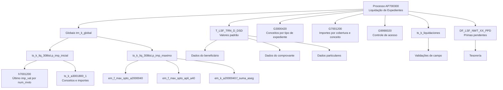

# Lógicas de Negocio de Siniestros — Liquidaciones en Reef.core

## 1. Metadados do Documento
- **Arquivo de Origem:** Não identificado no conteúdo extraído.
- **Tipo de Documento:** Especificação Técnica / Manual Funcional.
- **Domínio / Sistema:** Siniestros (sinistros), Liquidaciones (liquidações), Reef.core e Tesorería.
- **Público-Alvo:** Desenvolvedores, arquitetos, analistas funcionais e operação de sinistros/liquidações.
- **Data/Versão Identificada:** `ts_k_liq_308tst` versão `1.00`; diversas funções exemplo na versão `1.0`, com referências de criação em `2011/05/09` e `1998/04/16`.

---

## 2. Resumo Executivo & Contexto de Negócio

O documento descreve lógicas de negócio configuráveis para o processo de liquidação de expedientes de sinistros, incluindo cálculo de valores iniciais, limites máximos de liquidação, valores padrão de beneficiário e documento, validações de campos, permissões de acesso e integração com Tesorería para primas pendentes.

O processo de Liquidações de Expedientes é identificado como `AP700300`. O comportamento de campos e validações pode variar consideravelmente entre instalações. Por esse motivo, a solução usa atributos, procedimentos, funções e tabelas de configuração para decidir valores iniciais, validar dados e controlar regras operacionais.

O pacote `ts_k_liq_308tst` contém procedimentos de personalização para importes máximos e importes iniciais no ramo `308`. A lógica apresentada aplica-se especificamente quando o tipo de expediente (`tip_exp`) é `AOV`, utilizando dados globais de `trn_k_global`, informações de avaliação em `h7001200`, conceitos de reserva e conceitos de cobrança/pagamento.

O pacote `ts_k_liquidaciones` é citado como o agrupador de procedimentos e funções relacionados a validações e processos complementares, tais como exclusão de ordens de pagamento e tratamento de Livros de Compras. As globais essenciais passadas aos procedimentos e funções incluem `cod_cia`, `num_sini` e `num_exp`; valores já informados em campos também são preservados em globais.

O documento também estabelece regras de valores padrão para beneficiário, documento de pagamento, moeda, escritórios de pagamento e envio, datas e tipo de IVA. Várias implementações de núcleo existem por compatibilidade entre Reef.core, TW e NWT, e algumas retornam explicitamente `NULL`, `E`, `N` ou `TRUE`.

---

## 3. Arquitetura, Componentes & Tecnologias Envolvidas

### Componentes, pacotes, tabelas e objetos citados

| Componente / Objeto | Tipo | Papel documentado |
| :--- | :--- | :--- |
| `AP700300` | Processo | Processo de Liquidação de Expedientes. |
| `Reef.core` | Sistema | Plataforma referenciada para compatibilidade e execução de lógicas. |
| `ts_k_liq_308tst` | Package Oracle PL/SQL | Personaliza importes iniciais e máximos do ramo `308`. |
| `p_imp_inicial` | Procedimento PL/SQL | Calcula o importe inicial por cobertura e conceito de reserva. |
| `p_imp_maximo` | Procedimento PL/SQL | Calcula/atribui o limite máximo de liquidação em `suma_aseg`. |
| `ts_k_liquidaciones` | Package Oracle PL/SQL | Reúne procedimentos e funções do processo de liquidações. |
| `trn_k_global` | Objeto de globais | Recupera e atribui valores globais usados pelas lógicas. |
| `h7001200` | Tabela | Contém valores de avaliação (`imp_val`) por companhia, sinistro, expediente, conceito de reserva e movimento. |
| `g3000440` | Tabela / referência de tipos | Fornece tipos para `cod_cto_rva`, `cod_act_tercero` e `cod_cto_cob_pag`. |
| `g7001200` | Tabela | Importes por causa/consequência/cobertura/tipo de expediente/conceito de reserva; contém `imp_inicial`. |
| `a7001000` | Tabela | Fornece o tipo de expediente e a moeda do expediente. |
| `a2000040` | Tabela | Fonte da soma assegurada da cobertura. |
| `a7000900` | Tabela | Fonte alternativa para o período do sinistro. |
| `a3001700` | Tabela / referência de tipos | Tipos de beneficiário, terceiro, documento, companhia, ramo, sinistro e expediente. |
| `a5021105` | Tabela / função associada | Associação para obtenção da oficina de pagamento. |
| `g1002700` | Tabela | Contém o nível 3 (`cod_nivel3`) da oficina do usuário. |
| `g1010031` | Tabela | Lista de tipos de IVA. |
| `G3000420` | Tabela Geral | Conceitos de cobrança e pagamento diversos por tipo de expediente e conceito de reserva. |
| `G7001200` | Tabela Geral | Importes por causa, consequência, cobertura, tipo de expediente e conceito de reserva. |
| `G9990020` | Tabela Geral | Controle de acesso a programas por setor, ramo e programa. |
| `T_LSF_TRN_D_DSD` | Definição / estrutura | Agrupa atributos de valores iniciais/defaults para liquidações. |
| `DF_LSF_NWT_XX_PPD` | Aplicação / definição | Aplicação de primas pendentes. |
| `AS700001` | Rotina | Rotina de impostos citada para inicialização do IVA de terceiro. |
| Tesorería | Área / sistema dependente | Recebe indicação sobre compensação de recibos ou primas pendentes com pagamento do sinistro. |



> **Nota de Análise:** O documento descreve objetos Oracle PL/SQL, tabelas, funções e procedimentos, mas não detalha versões de banco de dados, contratos HTTP, APIs REST, URLs, portas, servidores ou pipelines de CI/CD.

---

## 4. Regras de Negócio, Especificações Funcionais & Processos

### 4.1 Cálculo de importe inicial — `p_imp_inicial`

O procedimento `ts_k_liq_308tst.p_imp_inicial` calcula o valor inicial (`imp_inicial`) para conceitos de cobrança e pagamento diversos nas liquidações do ramo `308`.

A lógica só é executada quando `trn_k_global.devuelve('tip_exp') = 'AOV'`.

A consulta ao cursor `c_h7001200` obtém o `imp_val` da tabela `h7001200` para a combinação de companhia, sinistro, expediente e conceito de reserva, escolhendo o registro com maior `num_mvto`.

#### Regras para `cod_cto_rva = 1`

| Conceito de cobrança/pagamento | Condição | Regra de cálculo |
| :--- | :--- | :--- |
| `S06` | `lv_imp_valorado` não nulo e diferente de zero | `imp_inicial = imp_valorado`. |
| Diferente de `S06` | `lv_imp_valorado` não nulo e diferente de zero | `imp_inicial = imp_valorado + 100`. O comentário associa esse caso a `S05`, atividade `18`, clínicas. |

O documento comenta que `S06` corresponde a atividade `1`, Tomador.

#### Regras para `cod_cto_rva = 2`

| Conceito de cobrança/pagamento | Condição | Regra de cálculo |
| :--- | :--- | :--- |
| `S12` | `lv_imp_valorado` não nulo e diferente de zero | `imp_inicial = imp_valorado`. |
| Diferente de `S12` | `lv_imp_valorado` não nulo e diferente de zero | `imp_inicial = imp_valorado`. |

O documento associa `S12` à atividade `5`, médico, e o outro caso a `S13`, atividade `6`, advogado.

#### Regras para `cod_cto_rva = 3`

A lógica consulta a quantidade máxima de conceitos por `ts_k_a3001800_1.f_nro_max_cptos`. Para cada posição, se o conceito for `S12` ou `S13`, `lv_imp_cto_2` recebe `NVL(ts_k_a3001800_1.f_imp_liq(i), 0)`.

| Conceito de cobrança/pagamento | Atividade do terceiro | Regra de cálculo |
| :--- | :--- | :--- |
| `S08` | `cod_act_tercero = 5` | `imp_inicial = imp_cto_2 * 0.25`. |
| `S08` | Atividade diferente de `5` | `imp_inicial = imp_cto_2 * 0.3`. O comentário identifica o caso como advogado. |
| Diferente de `S08` | Não especificada | `imp_inicial = imp_cto_2 * 0.15`. O comentário associa o caso a `S09` para atividade médica. |

Ao final, o procedimento atribui `imp_inicial` à global usando:

```plsql
trn_k_global.p_asigna(
  p_variable => 'imp_inicial',
  p_valor    => lv_imp_inicial
);
```

Qualquer exceção é encapsulada como:

```plsql
RAISE_APPLICATION_ERROR(
  -20000,
  '[ts_k_liq_308_tst.p_imp_inicial]' || SQLERRM
);
```

### 4.2 Cálculo de importe máximo — `p_imp_maximo`

O procedimento `ts_k_liq_308tst.p_imp_maximo` valida/calcula o limite máximo (`suma_aseg`) para liquidações quando `tip_exp = 'AOV'`.

O processo obtém o suplemento aplicável:

- Se `num_apli = 0`, chama `em_f_max_spto_a2000040` usando companhia, apólice, risco, suplemento de risco, data do sinistro, temporal `S` e ramo.
- Caso contrário, usa `num_spto` da global e chama `em_f_max_spto_apli_a40`.
- Os valores encontrados são gravados nas globais `max_spto_40` e `max_spto_apli_40`.
- O período (`num_periodo`) é recuperado da global; em exceção, o processo executa `ts_k_a7000900.p_lee_a7000900` e usa `ts_k_a7000900.f_num_periodo`.
- A cobertura consultada em `em_k_a2000040.p_lee` é `1040`.
- O importe assegurado é obtido por `em_k_a2000040.f_suma_aseg`.

#### Regras de limite máximo

| `cod_cto_rva` | Condição adicional | Regra de `suma_aseg` |
| :--- | :--- | :--- |
| `1` | `cod_cto_cob_pag = 'S06'` | `suma_aseg = imp_aseg`. |
| `1` | Conceito diferente de `S06` | `suma_aseg = imp_aseg * 0.8`. |
| `2` | Não aplicável | `suma_aseg = imp_aseg * 0.5`. |
| Diferente de `1` e `2` | Não aplicável | `suma_aseg = imp_aseg * 0.25`. |

Ao final, o procedimento atribui o resultado à global `suma_aseg`. Exceções são relançadas com o identificador `[ts_k_liq_308_tst.p_imp_maximo]`.

### 4.3 Lógica de importe máximo em `G7001200`

A tabela `G7001200` contém lógica de negócio para determinar o importe máximo no ajuste de reservas e na alteração de avaliação de um expediente, por cobertura e conceito de reserva.

Quando o parâmetro da tabela indicar que a lógica de negócio de avaliação máxima também é aplicável às liquidações, a lógica é executada nas liquidações de um expediente por cobertura e conceito de reserva.

Se não existir lógica específica de importe máximo e a marca indicar aplicação em liquidações, o valor máximo do conceito de reserva/conceito de cobrança e pagamento diverso para toda a cobertura será a soma assegurada.

### 4.4 Controle de acesso a programas — `G9990020`

A tabela `G9990020` define lógicas de negócio de acesso por setor, ramo e código de programa. A definição aceita os valores `999` para setor e ramo.

No contexto de liquidações, o controle é executado no cabeçalho de expedientes após o preenchimento do número do sinistro e do número do expediente. Também é executado nas cabeças da operação de Liquidação e Justificante Suelto.

O lançamento em Reef.core ocorre a partir de:

```text
ts_k_cabexp.pp_control_acceso_programa
```

Exemplos documentados de regras possíveis:

- Permitir liquidar um expediente somente ao tramitador responsável.
- Permitir liquidação aos tramitadores que tenham o mesmo supervisor do tramitador responsável.

Cada lógica deve controlar a própria mensagem de erro e concatenar o código do programa cujo acesso foi negado.

### 4.5 Observações do Plano de Tramitación

A configuração `nom_prg_obs_tramite` define lógicas que devolvem observações por meio da global `obs_tramite`.

Após informar o sinistro e/ou expediente nos cabeçalhos correspondentes, a global `nom_prg_obs_tramite` é carregada. A lógica é executada no fim de cada programa. Quando chamada pelo Plano de Tramitación, o próprio Plano coleta `obs_tramite` e a insere como observação.

### 4.6 Valores padrão de beneficiário

| Atributo | Finalidade | Comportamento de núcleo documentado |
| :--- | :--- | :--- |
| `bnf_typ_prd_nam` | Retorna o tipo inicial de beneficiário. | `ts_k_liquidaciones.f_tip_benef_defecto` chama `ts_f_liq_tip_benef_defecto`; retorna `NULL`. |
| `pym_thp_acv_prd_nam` | Retorna o código inicial da atividade do beneficiário. | `ts_k_liquidaciones.f_cod_act_tercero_defecto` chama `ts_f_liq_act_tercero_def`; retorna `NULL`. |
| `pym_thp_prd_nam` | Retorna o código inicial de terceiro quando a atividade é codificada em Reef.core, normalmente fornecedores. | `ts_k_liquidaciones.f_cod_tercero_defecto` chama `ts_f_liq_cod_tercero_def`; retorna `NULL`. |
| `pym_thp_dcm_typ_prd_nam` | Retorna o tipo inicial de documento identificador do terceiro. | `ts_k_liquidaciones.f_tip_docum_defecto` chama `ts_f_liq_tip_docum_defecto`; o exemplo retorna `DNI`. |
| `pym_thp_dcm_prd_nam` | Retorna o número do documento do beneficiário. | `ts_k_liquidaciones.f_cod_docum_defecto` chama `ts_f_liq_cod_docum_defecto_`; o exemplo retorna `NULL`. |

### 4.7 Valores padrão do comprovante da transação

| Atributo | Finalidade | Regra documentada |
| :--- | :--- | :--- |
| `tsy_dcm_prd_nam` | Tipo de documento de pagamento inicial. | Para `cod_cia = 1`, retorna `FA`; caso contrário, retorna `IN`. O texto associa `FA` a Factura e `IN` a Indemnización. |
| `dcm_dat_prd_nam` | Data padrão do documento de pagamento. | Retorna a data de processo de sinistros, usando `TO_DATE(trn_k_global.devuelve('fec_proceso'), 'DDMMYYYY')`. |
| `dcm_rcn_dat_prd_nam` | Data padrão de recebimento do documento de pagamento. | Retorna `SYSDATE`. |
| `est_pym_dat_prd_nam` | Data estimada de pagamento. | A função exemplo retorna `p_fec_proceso`. |
| Atributo não identificado na extração | Moeda padrão do documento. | Retorna a moeda do expediente, obtida por `ts_k_a7001000.f_cod_mon`. |

### 4.8 Valores padrão particulares da liquidação

| Atributo | Finalidade | Regra documentada |
| :--- | :--- | :--- |
| `pym_thr_lvl_prd_nam` | Oficina de pagamento padrão. | Obtida a partir de `cod_nivel3_envio` e da função `ts_f_a5021105_1`; a oficina de envio do usuário é relacionada à oficina de pagamento. |
| `snd_thr_lvl_prd_nam` | Oficina de envio padrão. | Retorna a oficina do usuário, lendo `g1002700` via `dc_k_g1002700.p_lee`. |
| Tipo de IVA | Tipo de IVA inicial do documento de pagamento. | Retorna `E`, correspondente a Exento. |
| `thp_tax_typ_nam` | Tipo de IVA do terceiro. | Retorna `E`, correspondente a Exento. |

### 4.9 Primas pendentes

A definição usada no processo de liquidações informa à Tesorería se, existindo recibos/primas pendentes, deve ocorrer compensação contra o pagamento do sinistro.

| Campo | Função |
| :--- | :--- |
| `typ_apy_rcp_pnd_prd_typ_val` | Indica o tipo de objeto a aplicar: `3 = Procedimento`; `4 = Função`. |
| `typ_apy_rcp_pnd_prd_nam` | Armazena o procedimento ou função que determina como as primas pendentes são aplicadas. |
| `TIP_APLICA_REC` | Entrada documentada para a lógica de aplicação de primas pendentes. |

### 4.10 Validações de campos

| Procedimento / Função | Finalidade | Chamador documentado |
| :--- | :--- | :--- |
| `ts_p_liq_documento_benef` | Validação do documento do beneficiário. | `ts_k_liquidaciones.p_valida_documento_benef` |
| `ts_p_valida_moneda_de_pago` | Se moeda de pagamento e moeda da liquidação forem diferentes, uma delas deve ser a moeda do país. | `ts_k_liquidaciones.p_valida_moneda_de_pago` |
| `ts_p_valida_mon_documento` | Valida moeda do documento de liquidação; o importe é informado nessa moeda e internamente convertido para a moeda da liquidação/expediente. | `ts_k_liquidaciones.p_valida_moneda_documento` |
| `ts_p_liq_val_cambio_pago` | Valida o tipo de câmbio a aplicar no pagamento. | `ts_k_liquidaciones.p_valida_val_cambio_pago` |
| `ts_p_liq_val_fec_recep_fra` | Valida a data de recepção da fatura. | `ts_k_liquidaciones.p_val_fec_recep_fra` |
| `ts_p_liq_fec_est_pago` | Valida a data estimada de pagamento. | `ts_k_liquidaciones.p_valida_fec_est_pago` |
| `ts_p_liq_tipo_de_documento` | Valida tipo de documento: Factura, Boleta ou Nota de Crédito. | `ts_k_liquidaciones.p_valida_tipo_de_documento` |
| `ts_p_liq_moneda_exp` | Valida moeda do expediente conforme moeda do expediente e tipo de documento. | `ts_k_liquidaciones.p_valida_moneda_expediente` |
| `ts_p_liq_num_documento` | Valida número do documento: Factura, Boleta ou Nota de Crédito. | `ts_k_liquidaciones.p_valida_num_documento` |
| `ts_p_liq_fec_documento` | Valida data do documento: Factura, Boleta ou Nota de Crédito. | `ts_k_liquidaciones.p_valida_fec_documento` |
| `ts_p_liq_emisor_documento` | Valida emissor do documento. | `ts_k_liquidaciones.p_valida_emisor_documento` |
| `ts_p_liq_observaciones` | Validações antes de aceitar os Dados Fixos da Liquidação. | `ts_k_liquidaciones.p_valida_observaciones` |

### 4.11 Controles extras

| Procedimento / Função | Regra |
| :--- | :--- |
| `ts_p_liq_valida_opcion` | Valida a opção selecionada após informar o número do sinistro: `LIQ`, `REC`, `JUS` ou `ANU`. |
| `ts_p_liq_anu_rect_liq` | Verifica se uma liquidação pode ser anulada ou retificada. |
| `ts_f_liq_perm_con_ord_pend` | Verifica se liquidações são permitidas com ordens de reparação pendentes; a versão de núcleo retorna `N`. |
| `ts_f_liq_perm_cons_act` | Determina se o usuário pode visualizar pagamentos profissionais; a versão de núcleo retorna `TRUE`. |
| `ts_p_liq_valida_imp_liq` | Valida importe liquidado por cobertura, conceito de reserva e conceito de cobrança/pagamento diverso; permite controle por tipo de documento além da lógica máxima configurada em `G3000420`. |
| `ts_p_liq_val_cambio_pago` | Valida o tipo de câmbio que será aplicado no momento do pagamento. |

---

## 5. Tabelas de Parâmetros, Ambientes e Estruturas de Dados

### 5.1 Entradas e saídas de lógicas principais

| Item / Parâmetro | Descrição / Função | Tipo / Valores / Formato | Ambiente / Observações |
| :--- | :--- | :--- | :--- |
| `cod_cto_rva` | Código de conceito de reserva. | Valores exemplificados: `1`, `2`, `3`. | Entrada de `p_imp_inicial` e `p_imp_maximo`. |
| `cod_cto_cob_pag` | Código de conceito de cobrança/pagamento. | Valores exemplificados: `S05`, `S06`, `S08`, `S09`, `S12`, `S13`. | Usado no cálculo de importes. |
| `cod_mon` | Código de moeda. | Não detalhado. | Entrada das lógicas de importes. |
| `imp_inicial` | Importe inicial calculado. | Valor monetário. | Saída de `p_imp_inicial`. |
| `suma_aseg` | Limite máximo / soma assegurada aplicável. | Valor monetário. | Saída de `p_imp_maximo`. |
| `num_liq` | Número de liquidação. | Não detalhado. | Usado para retificação. |
| `num_insp` | Número de inspeção. | Não detalhado. | Usado quando não há retificação. |
| `num_orden` | Número de ordem. | Não detalhado. | Usado quando não há retificação. |
| `tip_exp` | Tipo de expediente. | Valor relevante: `AOV`. | Gatilho das lógicas do package `ts_k_liq_308tst`. |
| `cod_act_tercero` | Código de atividade do terceiro. | Valores exemplificados: `5` médico; outro caso associado a advogado. | Usado em `cod_cto_rva = 3`. |
| `imp_val` | Importe avaliado. | Valor monetário. | Lido da tabela `h7001200`. |
| `num_mvto` | Número de movimento. | Numérico. | É selecionado o maior movimento em `h7001200`. |
| `num_apli` | Número de aplicação. | Numérico; comparação com `0`. | Define a estratégia de recuperação de suplemento. |
| `num_spto` | Número de suplemento. | Numérico. | É calculado ou obtido das globais. |
| `num_spto_apli` | Número de suplemento aplicável. | Numérico. | É calculado para aplicação diferente de zero. |
| `num_periodo` | Número do período. | Numérico. | Obtido da global ou de `a7000900`. |
| `cod_cob` | Código de cobertura. | Valor usado: `1040`. | Consultado em `em_k_a2000040.p_lee`. |
| `cod_cia` | Código de companhia. | Valor relevante no exemplo: `1`. | Define `FA` versus `IN` para documento padrão. |
| `num_sini` | Número de sinistro. | Não detalhado. | Global transversal do processo. |
| `num_exp` | Número de expediente. | Não detalhado. | Global transversal do processo. |
| `cod_pgm` | Código de programa. | Não detalhado. | Entrada de controle de acesso. |
| `nom_prg_obs_tramite` | Nome/programa de observação de tramitação. | Não detalhado. | Entrada da lógica de observações. |
| `obs_tramite` | Observação devolvida para o Plano de Tramitación. | Texto. | Saída da lógica de observações. |
| `cod_nivel3_envio` | Código de nível 3 da oficina de envio. | Numérico. | Entrada para a oficina de pagamento padrão. |
| `TIP_APLICA_REC` | Tipo de aplicação de recibos/primas pendentes. | Não detalhado. | Entrada da lógica de primas pendentes. |
| `cod_mon_liq` | Moeda da liquidação. | Não detalhado. | Entrada de validação monetária. |
| `cod_mon_pago` | Moeda de pagamento. | Não detalhado. | Entrada de validação monetária. |
| `cod_mon_fra` | Moeda da fatura/documento. | Não detalhado. | Entrada de validação de moeda do documento. |
| `tip_dcto` | Tipo de documento. | Não detalhado. | Entrada de regras de IVA. |

### 5.2 Valores de IVA

| Código | Descrição documentada | Tabela |
| :--- | :--- | :--- |
| `I` | Incluido. | `G1010031` |
| `S` | Soportado — IVA Compras / Crédito. | `G1010031` |
| `R` | Repercutido — IVA Ventas / Débito. | `G1010031` |
| `E` | Exento. | `G1010031`; retorno padrão das funções de IVA apresentadas. |

### 5.3 Relações de compatibilidade

| Objeto de núcleo | Função chamada / comportamento | Motivo documentado |
| :--- | :--- | :--- |
| `ts_k_liquidaciones.f_tip_benef_defecto` | Chama `ts_f_liq_tip_benef_defecto`. | Compatibilidade Reef.core–TW. |
| `ts_k_liquidaciones.f_cod_act_tercero_defecto` | Chama `ts_f_liq_act_tercero_def`. | Compatibilidade entre versões. |
| `ts_k_liquidaciones.f_cod_tercero_defecto` | Chama `ts_f_liq_cod_tercero_def`. | Compatibilidade NWT–TW. |
| `ts_k_liquidaciones.f_tip_docum_defecto` | Chama `ts_f_liq_tip_docum_defecto`. | Compatibilidade NWT–TW. |
| `ts_k_liquidaciones.f_cod_docum_defecto` | Chama `ts_f_liq_cod_docum_defecto_`. | Compatibilidade TW–NWT. |
| `ts_k_liquidaciones.f_cod_documento_defecto` | Chama `ts_f_liq_tip_docto_defecto_`. | Compatibilidade TW–NWT. |
| `ts_k_liquidaciones.f_fec_fra_defecto` | Chama `ts_f_liq_fec_fra_defecto_`. | Compatibilidade TW–NWT. |
| `ts_k_liquidaciones.f_fec_recep_fra_def_` | Chama `ts_f_liq_fec_recep_fra_def_`. | Compatibilidade TW–NWT. |
| `ts_k_liquidaciones.f_fec_est_pago_defecto` | Chama `ts_f_fec_est_pago`. | Compatibilidade entre versões de Reef.core. |
| `ts_k_liquidaciones.f_moneda_docum_defecto` | Chama `ts_f_liq_mon_doc_defecto`. | Compatibilidade entre versões de Reef.core. |
| `ts_k_liquidaciones.f_oficina_pago_defecto` | Chama `ts_f_liq_ofi_pago_defecto`. | Compatibilidade entre versões de Reef.core. |
| `ts_k_liquidaciones.f_oficina_envio_defecto` | Chama `ts_f_liq_ofi_envio_defecto`. | Compatibilidade entre versões de Reef.core. |
| `ts_k_liquidaciones.f_tipo_iva_defecto` | Chama `ts_f_tipo_iva_defecto`. | Compatibilidade entre versões de Reef.core. |

---

## 6. Bateria de Perguntas & Respostas para RAG (FAQ Sintético)

### P1: Em que condição o procedimento `p_imp_inicial` calcula o importe inicial de uma liquidação?
**R:** O procedimento `ts_k_liq_308tst.p_imp_inicial` executa a lógica de cálculo quando a global `tip_exp`, recuperada por `trn_k_global.devuelve('tip_exp')`, possui o valor `AOV`. Ao final, o valor calculado é atribuído à global `imp_inicial`.

### P2: Como é determinado o importe inicial para o conceito de reserva `1` e conceito `S06`?
**R:** Quando `cod_cto_rva = 1`, `cod_cto_cob_pag = 'S06'` e o valor avaliado em `h7001200.imp_val` não é nulo nem zero, a lógica define `imp_inicial` com o mesmo valor de `imp_valorado`.

### P3: Qual é a regra para o importe inicial de clínicas no caso `cod_cto_rva = 1`?
**R:** Para `cod_cto_rva = 1` e um conceito diferente de `S06`, o documento comenta o caso `S05` para atividade `18`, clínicas. Se `imp_valorado` não for nulo nem zero, o importe inicial é calculado como `imp_valorado + 100`.

### P4: Como o sistema obtém o valor avaliado usado no cálculo de importe inicial?
**R:** O cursor `c_h7001200` consulta a tabela `h7001200` pelos valores de companhia, sinistro, expediente e conceito de reserva. A consulta escolhe o registro cujo `num_mvto` é o maior para essa combinação e retorna o campo `imp_val`.

### P5: Como `p_imp_maximo` calcula o limite máximo para `cod_cto_rva = 2`?
**R:** Quando o tipo de expediente é `AOV`, o procedimento obtém o importe assegurado da cobertura `1040` por meio de `em_k_a2000040.f_suma_aseg`. Se `cod_cto_rva = 2`, define `suma_aseg` como 50% desse importe: `imp_aseg * 0.5`.

### P6: O que acontece quando não há lógica específica de importe máximo em `G7001200`?
**R:** Se não existir lógica de negócio específica para importe máximo e a configuração indicar que a lógica se aplica a liquidações, o valor máximo do conceito de reserva/conceito de cobrança e pagamento diverso para toda a cobertura passa a ser a soma assegurada.

### P7: Quando o controle de acesso de `G9990020` é executado no processo de liquidações?
**R:** O controle é executado no cabeçalho de expedientes depois de informar número de sinistro e número de expediente. Também é lançado nas cabeças da operação de Liquidação e Justificante Suelto. Em Reef.core, o documento informa o lançamento por `ts_k_cabexp.pp_control_acceso_programa`.

### P8: Qual tipo de documento de pagamento é atribuído por padrão para companhia `1`?
**R:** A função `ts_f_liq_tip_docto_defecto_trn` obtém `cod_cia` da global. Se `cod_cia = 1`, retorna `FA`, identificado pelo documento como Factura. Para outras companhias, retorna `IN`, identificado como Indemnización.

### P9: Qual data é utilizada como padrão para o documento de pagamento e para a recepção da fatura?
**R:** A data padrão do documento de pagamento é a data de processo, obtida de `fec_proceso` e convertida pelo formato `DDMMYYYY`. A data padrão de recepção da fatura é a data corrente retornada por `SYSDATE`.

### P10: Como é determinada a moeda padrão do documento de liquidação?
**R:** A função `ts_f_liq_mon_doc_defecto_trn` recupera companhia, sinistro e expediente das globais, carrega os dados do expediente por `ts_k_a7001000.p_lee_a7001000` e retorna `ts_k_a7001000.f_cod_mon`, ou seja, a moeda do expediente.

### P11: Qual regra monetária é aplicada quando moeda de pagamento e moeda de liquidação são diferentes?
**R:** O procedimento `ts_p_valida_moneda_de_pago`, lançado por `ts_k_liquidaciones.p_valida_moneda_de_pago`, valida que, se a moeda de pagamento e a moeda da liquidação forem diferentes, uma das duas deve ser a moeda do país.

### P12: O que fazem as configurações de primas pendentes?
**R:** A definição de Primas Pendentes informa à Tesorería se recibos ou primas pendentes devem ser compensados contra o pagamento do sinistro. `typ_apy_rcp_pnd_prd_typ_val` define se a implementação é procedimento (`3`) ou função (`4`), enquanto `typ_apy_rcp_pnd_prd_nam` contém o objeto que determina a forma de aplicação.

---

## 7. Glossário de Termos, Siglas & Conceitos-Chave

- **AOV:** Valor de `tip_exp` que habilita as lógicas apresentadas em `ts_k_liq_308tst`.
- **AP700300:** Processo de Liquidação de Expedientes.
- **Beneficiário:** Terceiro que recebe a liquidação ou justificante.
- **Cobertura:** Cobertura de seguro; no cálculo de importe máximo é usada a cobertura `1040`.
- **Codificação em Reef.core:** Condição mencionada para retorno de terceiro inicial, normalmente aplicável a fornecedores.
- **Concepto de cobro y pago vario:** Conceito de cobrança e pagamento diverso, configurado por tipo de expediente e conceito de reserva.
- **Concepto de reserva (`cod_cto_rva`):** Identificador do conceito de reserva usado em cálculos de importes.
- **Factura (`FA`):** Tipo de documento de pagamento retornado por padrão para `cod_cia = 1`.
- **Indemnización (`IN`):** Tipo de documento de pagamento retornado por padrão para companhias diferentes de `1`.
- **Justificante Suelto:** Opção/processo citado no fluxo de liquidações e no controle de acesso.
- **Liquidación:** Processo de pagamento/liquidação relacionado a um expediente de sinistro.
- **NWT:** Sigla citada em notas de compatibilidade com TW; o documento não expande o significado.
- **Plan de Tramitación:** Processo que coleta `obs_tramite` e grava observações.
- **Primas Pendientes:** Recibos/primas pendentes que podem ser compensados contra pagamento de sinistro.
- **Reef.core:** Sistema/plataforma corporativa referenciada pelo documento.
- **Siniestro:** Sinistro.
- **Tesorería:** Área ou sistema que trata a compensação de pendências contra pagamentos.
- **TW:** Sigla citada em notas de compatibilidade com Reef.core e NWT; o documento não expande o significado.
- **IVA:** Imposto sobre Valor Agregado; os tipos documentados são `I`, `S`, `R` e `E`.
- **`trn_k_global`:** Objeto usado para recuperar e atribuir globais do processo.
- **`imp_inicial`:** Importe inicial calculado para liquidações.
- **`suma_aseg`:** Soma assegurada utilizada como limite máximo em determinadas regras.

---

## 8. Notas Críticas, Riscos & Limitações

- O documento afirma que o tratamento e a validação dos campos podem variar consideravelmente por instalação. Portanto, comportamentos apresentados não devem ser assumidos como universais sem validar a configuração local.
- Diversas funções exemplo retornam `NULL`; isso significa que o núcleo pode não fornecer um valor padrão para tipo de beneficiário, atividade, terceiro ou número de documento.
- A lógica `p_imp_inicial` só apresenta comportamento explícito para `tip_exp = 'AOV'`. O documento não detalha cálculos alternativos para outros tipos de expediente.
- O cursor de avaliação consulta apenas o maior `num_mvto`, mas o documento não especifica critérios adicionais de ordenação, estados de avaliação ou tratamentos para ausência de registros.
- Em `cod_cto_rva = 3`, a variável `lv_imp_cto_2` é sobrescrita ao encontrar conceitos `S12` ou `S13`; o texto não documenta prioridade, agregação ou comportamento quando ambos existem.
- O documento fornece exemplos e comentários para algumas associações de códigos (`S05`, `S06`, `S08`, `S09`, `S12`, `S13`), mas não apresenta um catálogo completo de conceitos.
- A função de oficina de pagamento depende de `cod_nivel3_envio` e `a5021105`; o documento não detalha como a associação é mantida ou quais condições causam ausência de resultado.
- A validação de IVA apresentada retorna sempre `E` (Exento), embora a tabela `G1010031` contenha outros valores possíveis.
- As siglas TW e NWT são citadas apenas em contexto de compatibilidade; seus significados não são definidos no conteúdo extraído.
- Não há detalhes sobre autenticação, autorização técnica, infraestrutura, URLs, ambientes, banco de dados, contratos de integração, APIs ou tratamento transacional além dos procedimentos PL/SQL citados.

---

## 9. Conteúdo Bruto Estruturado (Referência Fiel)

```text
--- [PÁGINA 1 DE 24] ---

LÓGICAS de NEGOCIO SINIESTROS-
LIQUIDACIONES
Liquidaciones
Tablas Generales
Tablas General Liquidaciones G3000420
Tabla General Atributo de Liquidaciones G7001200
Control Acceso programas (G9990020)
Valores Iniciales Liquidaciones
Datos Beneficiario
Datos Comprobante de la transacción
Datos Particulares de La liquidación
Validaciones de campos
Tablas Generales de Liquidaciones
Conceptos Cobro y pago vario por Tipo de Expediente y concepto de reserva
(G3000420)
Lógica de Negocio para importe inicial de las liquidaciones
Este atributo contiene una Lógica de Negocio que devuelve el Importe inicial para los conceptos de
cobro y pago vario de las liquidaciones.
Además de todas las globales de todos los atributos por los que se ha ido pasando y validando,
antes de lanzar esta lógica de negocio se van a asignar las siguientes:
 / 
 RS
Inicio Soluciones APIs Documentación Zeus
ES

--- [PÁGINA 2 DE 24] ---

ENTRADA SALIDA
cod_cto_rva imp_inicial
cod_cto_cob_pag
cod_mon
Rectificación: num_liq
NO Rectificación: num_insp, num_orden
Ejemplos:
En el caso de concepto de cobro y pago vario indemnización al taller, el importe inicial, si se tiene
una peritación, sería el indicado en la peritación.
En caso de conceptos de cobro y pago varios para pagar a profesionales externos podríamos
obtenerlo de:
Si tenemos el coste de servicio por actividad, en la información del tercero, se obtendría de ahí.
Si es un abogado y se ha detallado los honorarios en el módulo de juicio, se obtendría del
módulo de juicios.
Si es un perito y se ha detallado en la peritación...
Esto puede cambiar para cada instalación.

--- [PÁGINA 3 A 5 DE 24] ---

CREATE OR REPLACE PACKAGE BODY ts_k_liq_308tst AS

PROCEDURE p_imp_inicial IS
    lv_tip_exp          a7001000.tip_exp%TYPE;
    lv_cod_cto_rva      g3000440.cod_cto_rva%TYPE;
    lv_cod_act_tercero  g3000440.cod_act_tercero%TYPE;
    lv_cod_cto_cob_pag  g3000440.cod_cto_cob_pag%TYPE;
    lv_imp_valorado     h7001200.imp_val%TYPE;
    lv_imp_inicial      g7001200.imp_inicial%TYPE := NULL;
    lv_imp_cto_2        g7001200.imp_inicial%TYPE;
    l_num_reg_a3001800  NUMBER;

    CURSOR c_h7001200 (...) IS
      SELECT a.imp_val
        FROM h7001200 a
       WHERE a.cod_cia = c_cod_cia
         AND a.num_sini = c_num_sini
         AND a.num_exp = c_num_exp
         AND a.cod_cto_rva = c_cod_cto_rva
         AND a.num_mvto = (
           SELECT MAX(t.num_mvto)
             FROM h7001200 t
            WHERE t.cod_cia = c_cod_cia
              AND t.num_sini = c_num_sini
              AND t.num_exp = c_num_exp
              AND t.cod_cto_rva = c_cod_cto_rva
         );

    lv_tip_exp := trn_k_global.devuelve('tip_exp');

    IF lv_tip_exp = 'AOV' THEN
      lv_cod_cto_cob_pag := trn_k_global.devuelve('cod_cto_cob_pag');
      lv_cod_cto_rva := trn_k_global.devuelve('cod_cto_rva');

      IF lv_cod_cto_rva = 1 THEN
        IF lv_cod_cto_cob_pag = 'S06' THEN
          IF lv_imp_valorado IS NOT NULL AND lv_imp_valorado != 0 THEN
            lv_imp_inicial := lv_imp_valorado;
          END IF;
        ELSE
          IF lv_imp_valorado IS NOT NULL AND lv_imp_valorado != 0 THEN
            lv_imp_inicial := lv_imp_valorado + 100;
          END IF;
        END IF;
      ELSIF lv_cod_cto_rva = 2 THEN
        IF lv_cod_cto_cob_pag = 'S12' THEN
          IF lv_imp_valorado IS NOT NULL AND lv_imp_valorado != 0 THEN
            lv_imp_inicial := lv_imp_valorado;
          END IF;
        ELSE
          IF lv_imp_valorado IS NOT NULL AND lv_imp_valorado != 0 THEN
            lv_imp_inicial := lv_imp_valorado;
          END IF;
        END IF;
      ELSE
        l_num_reg_a3001800 := NVL(ts_k_a3001800_1.f_nro_max_cptos, 0);

        IF l_num_reg_a3001800 > 0 THEN
          FOR i IN 1..l_num_reg_a3001800 LOOP
            IF ts_k_a3001800_1.f_cod_cto_cob_pag(i) = 'S12' THEN
              lv_imp_cto_2 := NVL(ts_k_a3001800_1.f_imp_liq(i), 0);
            END IF;

            IF ts_k_a3001800_1.f_cod_cto_cob_pag(i) = 'S13' THEN
              lv_imp_cto_2 := NVL(ts_k_a3001800_1.f_imp_liq(i), 0);
            END IF;
          END LOOP;
        END IF;

        lv_cod_act_tercero := trn_k_global.devuelve('cod_act_tercero');

        IF lv_cod_cto_cob_pag = 'S08' THEN
          IF lv_cod_act_tercero = 5 THEN
            lv_imp_inicial := lv_imp_cto_2 * 0.25;
          ELSE
            lv_imp_inicial := lv_imp_cto_2 * 0.3;
          END IF;
        ELSE
          lv_imp_inicial := lv_imp_cto_2 * 0.15;
        END IF;
      END IF;
    END IF;

    trn_k_global.p_asigna(
      p_variable => 'imp_inicial',
      p_valor => lv_imp_inicial
    );

--- [PÁGINA 6 A 9 DE 24] ---

Lógica de negocio para validar importe liquidado
En este atributo se ubica la Lógica de Negocio que validará que el importe liquidado no sobrepase un
límite.

ENTRADA SALIDA
cod_cto_rva suma_aseg
cod_mon
si Rectificación: num_liq
si NO Rectificación: num_insp, num_orden

PROCEDURE p_imp_maximo IS
    lv_tip_exp          a7001000.tip_exp%TYPE;
    lv_num_spto         a2000040.num_spto%TYPE;
    lv_num_spto_apli    a2000040.num_spto_apli%TYPE;
    lv_suma_aseg        a2000040.suma_aseg%TYPE;
    lv_imp_aseg         a2000040.suma_aseg%TYPE;
    lv_cod_cto_rva      g3000440.cod_cto_rva%TYPE;
    lv_cod_act_tercero  g3000440.cod_act_tercero%TYPE;
    lv_cod_cto_cob_pag  g3000440.cod_cto_cob_pag%TYPE;
    lv_num_periodo      a7000900.num_periodo%TYPE;

    IF trn_k_global.devuelve('tip_exp') = 'AOV' THEN
      IF trn_k_global.devuelve('num_apli') = 0 THEN
        lv_num_spto := em_f_max_spto_a2000040(...);
        lv_num_spto_apli := 0;
      ELSE
        lv_num_spto := trn_k_global.devuelve('num_spto');
        lv_num_spto_apli := em_f_max_spto_apli_a40(...);
      END IF;

      trn_k_global.asigna(p_variable => 'max_spto_40', p_valor => lv_num_spto);
      trn_k_global.asigna(
        p_variable => 'max_spto_apli_40',
        p_valor => lv_num_spto_apli
      );

      em_k_a2000040.p_lee(
        p_cod_cob => 1040,
        ...
      );

      lv_imp_aseg := em_k_a2000040.f_suma_aseg;
      lv_cod_cto_rva := trn_k_global.devuelve('cod_cto_rva');
      lv_cod_cto_cob_pag := trn_k_global.devuelve('cod_cto_cob_pag');

      IF lv_cod_cto_rva = 1 THEN
        IF lv_cod_cto_cob_pag = 'S06' THEN
          lv_suma_aseg := lv_imp_aseg;
        ELSE
          lv_suma_aseg := lv_imp_aseg * 0.8;
        END IF;
      ELSIF lv_cod_cto_rva = 2 THEN
        lv_suma_aseg := lv_imp_aseg * 0.5;
      ELSE
        lv_suma_aseg := lv_imp_aseg * 0.25;
      END IF;
    END IF;

    trn_k_global.p_asigna(
      p_variable => 'suma_aseg',
      p_valor => lv_suma_aseg
    );

Importes Causa/Consec./Cob./Tipo Exp./Cto.Rva. (G7001200)
Lógica de negocio para validación importe máximo valoración
Lógica de Negocio que devuelve el Importe máximo en el ajuste de reservas y cambio de valoración
de un expediente, para cada cobertura, concepto de reserva.

Control de acceso a programas (G9990020)
En esta tabla, por sector, ramo y código de programa, se definirán las lógicas de negocio que se
quieran lanzar al inicio de cada uno de los programas para controlar si la persona tiene o no acceso.

--- [PÁGINA 10 A 12 DE 24] ---

ENTRADA
cod_cia
num_sini
num_exp
cod_pgm

nom_prg_obs_tramite
ENTRADA SALIDA
nom_prg_obs_tramite obs_tramite

Proceso de Liquidación de Expedientes (AP700300)
Debido a que en cada instalación, el tratamiento y validación de cada uno de los campos varía
considerablemente, prácticamente por cada uno de los campos que se piden en el proceso de
Liquidaciones de expedientes, se ha realizado una lógica de negocio de validación o una función que
nos devuelve el valor elegido.

Aparte de las validaciones de los campos, también hay objetos de base de datos para realizar otros
procesos, como la exclusión de órdenes de pago, tratamiento de Libros de Compras etc.
Cada uno de dichos procedimientos y funciones se incluyen en un package ts_k_liquidaciones.

VALORES INICIALES - VALORES POR DEFECTO
T_LSF_TRN_D_DSD

Datos Beneficiario
bnf_typ_prd_nam
En este atributo se ubica la lógica de negocio que devuelve el tipo de beneficiario inicial a las
liquidaciones y justificantes sueltos.
En la versión de núcleo el atributo contiene ts_k_liquidaciones.f_tip_benef_defecto que llama al
ts_f_liq_tip_benef_defecto. Núcleo tiene esta funcionalidad por compatibilidad Reef.core- TW.
Devuelve NULL.

pym_thp_acv_prd_nam
Lógica que devuelve el código de actividad del beneficiario inicial.
Devuelve NULL.

pym_thp_prd_nam
Lógica que devuelve el código de tercero inicial.
Devuelve NULL.

--- [PÁGINA 13 A 16 DE 24] ---

pym_thp_dcm_typ_prd_nam
Lógica que devuelve el tipo de documento del tercero inicial.
El ejemplo ts_f_liq_tip_docum_defecto_trn devuelve 'DNI'.

pym_thp_dcm_prd_nam
Lógica que devuelve el número del documento del beneficiario.
El ejemplo ts_f_liq_cod_docum_defecto_trn devuelve NULL.

Datos Comprobante de la transacción
tsy_dcm_prd_nam
Lógica que devuelve el tipo de documento de pago por defecto.
Si cod_cia = 1 devuelve 'FA'.
En caso contrario devuelve 'IN'.

dcm_dat_prd_nam
Lógica que devuelve la fecha del documento de pago por defecto.
Devuelve la fecha de proceso:
RETURN TO_DATE(trn_k_global.devuelve('fec_proceso'),'DDMMYYYY');

dcm_rcn_dat_prd_nam
Lógica que devuelve la fecha de recepción del documento de pago.
Devuelve:
RETURN SYSDATE;

est_pym_dat_prd_nam
Lógica que devuelve la fecha estimada de pago para la liquidación.
El ejemplo ts_f_fec_est_pago_trn retorna p_fec_proceso.

--- [PÁGINA 17 A 20 DE 24] ---

Lógica de Negocio que devuelve la moneda del documento que se va a utilizar por defecto en las
liquidaciones. Devuelve la moneda del expediente.

Datos Particulares de La liquidación
pym_thr_lvl_prd_nam
Atributo que devuelve la oficina de pago por defecto.
Devuelve la oficina de pago correspondiente a la oficina del usuario, definida en a5021105.

ENTRADA SALIDA
cod_nivel3_envio código de la oficina

snd_thr_lvl_prd_nam
Devuelve a las liquidaciones la oficina de envío.
Devuelve la oficina del usuario.

Tipo de IVA
Devuelve el tipo de IVA inicial del documento de pago.
Devuelve 'E' (Exento).

G1010031:
"I" [I]ncluido
"S" [S]oportado (IVA Compras - Credito)
"R" [R]epercutido (IVA Ventas - Debito)
"E" [E]xento

thp_tax_typ_nam
Devuelve el tipo de IVA del tercero.
Devuelve 'E' (Exento).

--- [PÁGINA 21 DE 24] ---

Aplicación Primas Pendientes (DF_LSF_NWT_XX_PPD)

Tabla de definición utilizada en el proceso de liquidaciones de expedientes, para indicar a Tesorería si
en caso de tener recibos/primas pendientes, se netea contra el pago del siniestro.

typ_apy_rcp_pnd_prd_typ_val
Será una lógica de negocio o una función el que devuelva el tipo a aplicar:
3 = Procedimiento.
4 = Función.

typ_apy_rcp_pnd_prd_nam
Procedimiento/Función que nos indica la forma en la que se aplican las primas pendientes.

Validaciones de campos
ts_p_liq_documento_benef
LANZADO desde ts_k_liquidaciones.p_valida_documento_benef

ts_p_valida_moneda_de_pago
Valida que, si la moneda de pago y la de la liquidación son diferentes, una de las dos ha de ser la
moneda del país.
LANZADO desde ts_k_liquidaciones.p_valida_moneda_de_pago

ts_p_valida_mon_documento
Valida la moneda del documento de la liquidación.
LANZADO desde ts_k_liquidaciones.p_valida_moneda_documento

--- [PÁGINA 22 DE 24] ---

ENTRADA
cod_mon_liq
cod_mon_pago
cod_mon_fra

ts_p_liq_val_cambio_pago
Valida el tipo de cambio que se va a aplicar para el pago de la liquidación.

ts_p_liq_val_fec_recep_fra
Valida la fecha de recepción de la factura de la liquidación.

ts_p_liq_fec_est_pago
Valida la fecha estimada de pago de la liquidación.

ts_p_liq_tipo_de_documento
Valida el tipo de documento de la liquidación: Factura, Boleta, Nota de Crédito.

ts_p_liq_moneda_exp
Valida la moneda del expediente de la liquidación.

ts_p_liq_num_documento
Valida el número del documento de la liquidación: Factura, Boleta, Nota de Crédito.

ts_p_liq_fec_documento
Valida la fecha del documento de la liquidación: Factura, Boleta, Nota de Crédito.

ts_p_liq_emisor_documento

--- [PÁGINA 23 DE 24] ---

ts_p_liq_emisor_documento
Valida el emisor del documento de la liquidación.

ts_p_liq_observaciones
Realiza las validaciones necesarias antes de aceptar los Datos Fijos de la Liquidación.

Controles Extras de las Liquidaciones
ts_p_liq_valida_opcion
Valida la opción seleccionada una vez que se introduzca el número de siniestro:
LIQuidacion, RECtificacion, JUStificante Suelto, ANUlacion.

ts_p_liq_anu_rect_liq
Verifica si una liquidación puede ser anulada o rectificada.

ts_f_liq_perm_con_ord_pend
Verifica si se pueden realizar liquidaciones aunque tengan órdenes de reparación pendientes.
En la versión de núcleo devuelve 'N'.

ts_f_liq_perm_cons_act
Determina si el usuario puede visualizar o no los pagos profesionales.
En la versión de núcleo devuelve TRUE.

ts_p_liq_valida_imp_liq
Valida el importe liquidado por cobertura/concepto de reserva y concepto de cobro y pago vario.

ts_p_liq_val_cambio_pago
Valida el tipo de cambio que se aplicará en el momento del pago.

--- [PÁGINA 24 DE 24] ---

ts_p_liq_val_cambio_pago
LANZADO desde ts_k_liquidaciones.p_valida_val_cambio_pago
```
