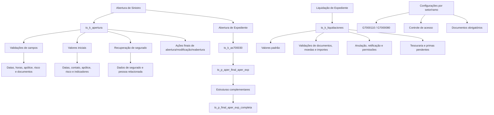

# Lógicas de Negocio de Siniestros, Expedientes y Liquidaciones

## 1. Metadados do Documento
- **Arquivo de Origem:** Não identificado no conteúdo fornecido
- **Tipo de Documento:** Especificação Técnica
- **Domínio / Sistema:** Gestão de Siniestros, Expedientes e Liquidaciones; Reef.core; TRN/NWT/TW
- **Público-Alvo:** Desenvolvedores, Arquitetos, Analistas Funcionais e Operação
- **Data/Versão Identificada:** Não identificada

---

## 2. Resumo Executivo & Contexto de Negócio

O documento descreve lógicas de negócio associadas ao ciclo de vida de sinistros: abertura, validação, modificação, reabertura, abertura de expedientes, documentação, baixa de capital, avaliação, liquidação e integração com processos de tesouraria. As lógicas são predominantemente procedimentos e funções identificados pelo prefixo `ts_`, organizados em packages como `ts_k_apertura` e `ts_k_liquidaciones`.

A arquitetura funcional exposta permite que cada instalação adapte regras, validações, permissões, valores padrão e cálculos financeiros sem alterar necessariamente o fluxo-base dos programas. Essa extensibilidade ocorre por meio de atributos e tabelas de configuração que apontam para procedimentos ou funções de lógica de negócio.

Abertura de sinistros e expedientes concentra validações de datas, horários, apólices, riscos, documentos, contatos e estruturas complementares. O processo também disponibiliza mecanismos para recuperar dados do segurado, calcular valores iniciais, determinar suplementos aplicáveis e controlar se uma apólice, risco ou sinistro pode ser tratado em determinadas condições.

O domínio de liquidações possui regras específicas para importes iniciais e máximos, moedas, documentos, beneficiários, impostos, ordens de reparação, pagamentos, recibos ou primas pendentes e retificações/anulações. O documento indica que, devido às variações entre instalações, praticamente cada campo da liquidação pode ter uma lógica de validação ou de valor padrão configurável.

---

## 3. Arquitetura, Componentes & Tecnologias Envolvidas

### Componentes e packages identificados

| Componente / Objeto | Papel identificado |
| :--- | :--- |
| `ts_k_apertura` | Package de lógicas de negócio de abertura, validação, valores iniciais e ações finais de sinistros e expedientes. |
| `ts_k_liquidaciones` | Package de validações, valores padrão e processos complementares de liquidações. |
| `ts_k_a7001005` | Processa baixa de capital por sinistro e acessórios relacionados. |
| `ts_k_as700030` | Rotina de abertura de expedientes. |
| `ts_k_ap700300` | Processo de liquidação de expedientes. |
| `ts_k_ap300000` | Processo de faturação que chama lógicas de ajuste e cálculo de pagamento. |
| `ts_k_g7000110` | Controle de obrigatoriedade e visibilidade de estruturas por setor/ramo. |
| `ts_k_g7000500` | Controle de obrigatoriedade e validação de número de documento. |
| `ts_k_g7000510` | Controle de documentos obrigatórios por tipo de expediente. |
| `ts_k_cabsini` | Controle de acesso a programas na cabeceira de sinistros. |
| `ts_k_cabexp` | Controle de acesso a programas na cabeceira de expedientes. |
| `A7001000` | Tabela atualizada com dados de pessoa relacionada ao expediente. |
| `A7001005` | Contexto/tabela de baixa de capital por sinistros. |
| `A7001090` | Origem de acessórios afetados pelo sinistro/expediente. |
| `G7000080` | Configuração de visibilidade de tipos de expediente por ramo, causa, consequência e cobertura. |
| `G7000110` | Estruturas por setor/ramo. |
| `G7000500` | Códigos de documentos. |
| `G7000510` | Códigos de documentos por tipo de expediente. |
| `G7000900` | Tabela de extemporaneidade. |
| `G3000420` | Conceitos de cobrança/pagamento diversos por tipo de expediente e conceito de reserva. |
| `G3000430` | Detalhamento de conceito de cobrança/pagamento diverso e conceito de reserva. |
| `DF_LSF_NWT_XX_Fid` | Referência de tabela associada à obtenção de tramitadores. |
| `DF_LSF_NWT_XX_PPD` | Definição para aplicação de primas pendentes em liquidações. |
| `T_LSF_TRN_D_LSF` | Estrutura/configuração associada a lógicas gerais de sinistros. |
| `T_LSF_TRN_D_DSD` | Estrutura/configuração de valores padrão de liquidações. |
| `rl_lss_nwt_xx_elp` | Tabela de suplementos de vida pendentes. |
| `Reef.core` | Sistema citado para atividades codificadas, normalmente fornecedores. |
| `NWT` | Ambiente/sistema citado em estruturas e tabelas. |
| `TW` | Ambiente/sistema citado no controle de exibição de estruturas. |
| `TRN` | Versão/ambiente citado para comportamento de extemporaneidade. |



> **Nota de Análise:** O documento descreve objetos de banco de dados, packages, tabelas e pontos de chamada, mas não detalha tecnologias de implementação, protocolos de integração, métodos HTTP, contratos JSON, servidores, URLs ou portas.

---

## 4. Regras de Negócio, Especificações Funcionais & Processos

### 4.1 Causas de sinistro e importes iniciais/máximos

- `nom_prg_valida_causa` valida a causa selecionada por ramo.
- A lógica é acionada a partir de `ts_k_as700040.p_marca_causa`.
- A abertura de sinistros e expedientes obtém tramitadores e supervisores por meio de `get_lop_prd_nam` e `get_spv_prn_nam`.
- `nom_prg_imp_inicial` devolve o importe inicial, utilizado no ajuste de reservas e na alteração de avaliação de expediente.
- A lógica de importe inicial deve atribuir valor às duas globais para suportar abertura de expediente com avaliação média ou avaliação ajustada.
- `nom_prg_validacion` devolve o importe máximo para ajuste de reservas e alteração de avaliação por cobertura e conceito de reserva.
- Quando a tabela indicar que a mesma lógica de avaliação máxima deve ser utilizada em liquidações, a regra também será executada nas liquidações por cobertura/conceito de reserva.

### 4.2 Controle de acesso a programas

- O controle de acesso é configurado por setor, ramo e código de programa.
- Os valores `999` são aceitos para setor e ramo.
- A lógica é executada na cabeceira de sinistros e na cabeceira de expedientes após a introdução do número de sinistro ou do número de expediente.
- Cada lógica deve controlar a mensagem de erro apresentada ao utilizador.
- O código do programa cujo acesso foi negado deve ser concatenado à mensagem de erro.

### 4.3 Observações de tramitação

- `nom_prg_obs_tramite` define lógicas que devolvem observações por meio da global `obs_tramite`.
- A global `nom_prg_obs_tramite` é carregada nas cabeceiras de sinistros e expedientes depois da introdução do sinistro e/ou expediente.
- A lógica é executada ao final de cada programa.
- Quando chamada pelo Plano de Tramitação, o próprio plano recolhe `obs_tramite` e insere o valor como observação.

### 4.4 Estruturas por setor e ramo

- `nom_pgm_mca_obligatorio` determina se uma estrutura de informação será obrigatória na tramitação de sinistros.
- `nom_prg_muestra_est` determina se uma estrutura será exibida em TW.
- O controle de exibição prevalece sobre a obrigatoriedade.
- A regra existe para preservar a compatibilidade entre NWT e TW, pois algumas companhias possuem estruturas usadas apenas em NWT.

### 4.5 Baixa de capital por sinistros

- Ao terminar o expediente, a baixa de capital por sinistros é tratada quando `a1002150.mca_baja_suma_aseg_stro = 'S'`.
- `ts_p_trata_acc_7001005_trn` insere em `a7001005` os acessórios afetados pelo sinistro/expediente.
- Os acessórios são obtidos de `a7001090`.
- Se o acessório já existir em `a7001005` e a baixa de capital ainda não tiver sido realizada, o acessório é lido.
- Caso contrário, o acessório é inserido em `a7001005`.
- Se algum acessório for inserido, o registo de `cod_accesorio = 0` da cobertura tratada é eliminado.

### 4.6 Abertura de sinistros

As validações extras da abertura de sinistros abrangem:

- Número de sinistro de referência: `ts_p_aper_num_sini_ref`.
- Data de ocorrência: `ts_p_aper_fec_sini`.
- Hora de ocorrência: `ts_p_aper_hora_sini`.
- Data de denúncia: `ts_p_aper_fec_denu`.
- Hora de denúncia: `ts_p_aper_hora_denu`.
- Número de apólice: `ts_p_aper_num_poliza`.
- Número de aplicação da apólice: `ts_p_aper_num_apli`.
- Número de risco: `ts_p_aper_num_riesgo`.
- Dados de segurado conforme tipo de relação: `ts_p_aper_relacion_aseg`.

A lógica `ts_p_aper_relacion_aseg` devolve dados do segurado com `tip_relacion = '5'`, incluindo documentos, telefone e e-mail de contacto.

### 4.7 Valores padrão na abertura

O package de abertura disponibiliza funções para determinar valores padrão de:

- Data e hora do sinistro.
- Data e hora de denúncia.
- Número de apólice.
- Número de risco.
- Número de aplicação.
- Tipo de relação de contacto.
- Tipo e código de documento de contacto.
- Nome e apelido de contacto.
- País, zona e número de telefone de contacto.
- E-mail de contacto.

Indicadores padrão citados:

- Consulta de vigência/início: versão núcleo devolve `V`.
- Possibilidade de modificar data do sinistro: versão núcleo devolve `S`.
- Possibilidade de sinistrar apólice ou risco não vigente: versão núcleo devolve `N`.
- Tipo de apólice: versão núcleo devolve `R`, correspondente a real.
- Consideração de suplementos temporais: versão núcleo devolve `S`.
- Abertura de sinistro futuro: versão núcleo devolve `N`.
- Consideração da tabela `G7000900` de extemporaneidade: versão TRN devolve `S`.

### 4.8 Ações de finalização

- `ts_p_aper_final_aper_stro` permite realizar ação após a abertura de sinistro e é executada imediatamente antes da eliminação das globais.
- `ts_p_final_modif_stro` permite realizar ação ao finalizar modificação de sinistro.
- `ts_p_final_reap_stro` permite realizar ação ao finalizar reabertura de sinistro.
- `ts_p_aper_final_aper_exp` é executada ao final da abertura de expediente, antes da chamada às estruturas complementares.
- `ts_p_final_aper_exp_completa` é executada depois da chamada às estruturas complementares.
- `ts_p_final_modif_exp` é executada ao final da modificação de expediente, depois das estruturas complementares.

Na versão núcleo, para ramos que trabalham com gestão de fundos, a abertura de expediente de morte ou invalidez insere em `rl_lss_nwt_xx_elp` um registo de suplementos de vida pendentes com as marcas `enr` e `atm_pyo` definidas como `N`.

### 4.9 Dados de segurado, contrário, documentos e estruturas

- `ts_p_actualiza_persona_rel` deve ser chamado por cada estrutura que capta informação do expediente para atualizar a pessoa relacionada em `A7001000`.
- Também é possível atribuir diretamente as globais `tip_docum_exp`, `cod_docum_exp`, `nombre_exp` e `apellidos_exp`.
- `ts_k_g7000500.f_nom_prg_oblig_num_doc` determina se número/identificador de documento é obrigatório.
- `ts_k_g7000500.f_nom_prg_val_num_doc` valida o número/identificador de documento.
- `ts_k_g7000510.f_nom_prg_mca_obligatorio` define se um documento é obrigatório por tipo de expediente.
- A obrigatoriedade documental é usada em controles técnicos, por exemplo ao terminar o expediente ou liquidar.
- `ts_p_val_datos_aseg_aut` é executada depois da atualização de dados do segurado em sinistro e expediente.
- `ts_p_val_datos_cont_aut` é executada depois da atualização dos dados do contrário.
- `ts_p_val_matri_contrario` valida a matrícula do contrário; o documento também indica uma ocorrência marcada como “No se usa”.

### 4.10 Liquidações

- Em `G3000420`, `nom_prg_1` determina o importe inicial de conceitos de cobrança e pagamento diverso.
- Em `G3000420`, `nom_prg_2` determina o importe máximo desses conceitos.
- Em `G3000430`, `nom_prg_1` calcula importe ajustado com base no importe faturado menos gastos não amparados.
- Em `G3000430`, `nom_prg_2` calcula o importe a pagar a partir do importe ajustado, considerando dedutíveis e esgotamentos de cobertura.
- `nom_prg_ini_orden` determina o importe inicial da avaliação da ordem de perícia.
- `nom_prg_max_orden` determina o importe máximo da avaliação da ordem de perícia.
- Cada instalação pode possuir lógicas específicas de validação ou de valor padrão para praticamente cada campo do processo de liquidações.
- As globais `cod_cia`, `num_sini` e `num_exp` são passadas a cada procedimento e função de liquidação.
- Cada valor informado num campo é armazenado numa global, disponibilizando dados previamente capturados para validações posteriores.

### 4.11 Primas pendentes

A tabela `DF_LSF_NWT_XX_PPD` informa à Tesouraria se recibos/primas pendentes devem ser compensados contra pagamento de sinistro.

| Código `TYP_APY_RCP_PND` | Regra |
| :--- | :--- |
| `1` | Importe pendente na data de ocorrência do sinistro. |
| `2` | Importe pendente na data de vencimento da apólice. |
| `3` | Não se aplica. |

- `TYP_APY_RCP_PND_PRD_TYP_VAL = 3`: é armazenado um procedimento.
- `TYP_APY_RCP_PND_PRD_TYP_VAL = 4`: é armazenada uma função.
- `TYP_APY_RCP_PND_PRD_NAM` identifica o procedimento/função que informa como aplicar primas pendentes.

---

## 5. Tabelas de Parâmetros, Ambientes e Estruturas de Dados

| Item / Parâmetro | Descrição / Função | Tipo / Valores / Formato | Ambiente / Observações |
| :--- | :--- | :--- | :--- |
| `cod_cia` | Código da companhia | Entrada | Recorrente em sinistros, expedientes e liquidações |
| `num_sini` | Número do sinistro | Entrada | Recorrente |
| `num_exp` | Número do expediente | Entrada | Recorrente |
| `cod_ramo` | Código do ramo | Entrada | Usado em regras por ramo |
| `cod_sector` | Código do setor | Entrada | Usado em regras por setor |
| `cod_causa` / `cod_causa_sini` | Código da causa de sinistro | Entrada | Avaliação, cobertura e liquidação |
| `cod_consecuencia` | Código da consequência | Entrada | Avaliação e tipos de expediente |
| `cod_cob` | Código de cobertura | Entrada | Reservas, baixa de capital e liquidações |
| `cod_cto_rva` | Código de conceito de reserva | Entrada | Avaliação e liquidações |
| `cod_cto_cob_pag` | Conceito de cobrança/pagamento | Entrada | Liquidações |
| `cod_det_cto` | Conceito de detalhe | Entrada | G3000430 e ordens |
| `imp_inicial` | Importe inicial | Saída | Ajuste de reservas e alteração de avaliação |
| `imp_val` | Importe de avaliação | Saída | Lógica de importe inicial |
| `suma_aseg` | Soma segurada | Saída | Validações de importes máximos |
| `max_spto_40` | Máximo suplemento da tabela `a2000040` | Entrada/Saída | Alteração de avaliação e liquidação |
| `max_spto_apli_40` | Máximo suplemento de aplicação da tabela `a2000040` | Entrada/Saída | Alteração de avaliação e liquidação |
| `fec_proceso` | Data de processo | Entrada | Usada em avaliação e data estimada de pagamento |
| `mca_obligatorio` | Indicador de obrigatoriedade | Saída | Estruturas e documentos |
| `mca_muestra_est` | Indicador de exibição de estrutura | Saída | Exibição em TW |
| `mca_typ_fil_vsb` | Indicador de visibilidade de tipo de expediente | Saída | G7000080 |
| `obs_tramite` | Observação de tramitação | Saída | Inserida pelo Plano de Tramitação quando aplicável |
| `cod_pgm` | Código de programa | Entrada | Controle de acesso, menus e liquidações |
| `tip_mvto_batch_stro` | Tipo de movimento batch de sinistro | Entrada | Finalização de abertura de sinistro |
| `tip_docum` / `cod_docum` | Tipo e código de documento | Entrada/Saída | Segurado, contacto e beneficiário |
| `tip_relacion` | Tipo de relação | Entrada | `ts_p_aper_relacion_aseg` |
| `tip_relacion = '5'` | Relação usada para devolução de dados do segurado | Valor de regra | `ts_p_aper_relacion_aseg` |
| `mca_baja_suma_aseg_stro` | Indicador de baixa de capital por sinistro | Valor `S` | Dispara tratamento de acessórios |
| `cod_accesorio = 0` | Registo genérico de acessório | Valor de regra | Eliminado quando acessórios específicos são inseridos |
| `tot_imp_val_ini` | Total de avaliação inicial | Saída | Consulta de importes do sinistro |
| `tot_imp_val` | Total de avaliação atual | Saída | Consulta de importes do sinistro |
| `tot_imp_val_liq` | Total liquidado | Saída | Consulta de importes do sinistro |
| `tot_imp_val_pag` | Total pago | Saída | Consulta de importes do sinistro |
| `tip_poliza_stro` | Tipo de apólice do sinistro | `R` = real | Versão núcleo devolve `R` |
| `fec_solicitud` | Data de solicitação documental | Entrada | AP700103 |
| `fec_recepcion` | Data de receção documental | Entrada | AP700103 |
| `cod_mon_liq` | Moeda da liquidação | Entrada | Validação de moedas |
| `cod_mon_pago` | Moeda de pagamento | Entrada | Validação de moedas |
| `cod_mon_fra` | Moeda do documento/fatura | Entrada | Validação de moeda do documento |
| `tip_dcto` | Tipo de documento | Entrada | Usado na determinação do IVA |
| `tip_liquidacion` | Tipo de liquidação | Entrada | G3000420 |
| `num_liq` | Número da liquidação | Entrada | Usado em retificação |
| `num_insp` / `num_orden` | Número de inspeção / ordem | Entrada | Usado quando não há retificação |
| `TYP_APY_RCP_PND` | Regra de aplicação de recibos pendentes | `1`, `2` ou `3` | Primas pendentes |
| `TYP_APY_RCP_PND_PRD_TYP_VAL` | Tipo do objeto configurado | `3` = procedimento; `4` = função | Primas pendentes |
| `TYP_APY_RCP_PND_PRD_NAM` | Nome do procedimento/função configurada | Objeto de lógica de negócio | Primas pendentes |
| `enr` | Marca de suplemento | `N` na inserção citada | Suplementos de vida pendentes |
| `atm_pyo` | Marca de ordem de pagamento gerada | `N` na inserção citada | Suplementos de vida pendentes |

### Valores padrão documentados

| Função / Atributo | Valor padrão citado | Contexto |
| :--- | :--- | :--- |
| `ts_f_aper_cons_his_def` | `V` | Consulta de vigência ou início na abertura de sinistros |
| `ts_f_modifica_fec_sini` | `S` | Permite modificar data do sinistro |
| `ts_f_aper_no_vig_no_apli` | `N` | Não permite sinistrar apólice/risco não vigente na versão núcleo |
| `ts_f_aper_tip_poliza_stro` | `R` | Tipo de apólice real |
| `ts_f_aper_mca_spto_temp` | `S` | Considera suplementos temporais |
| `ts_f_aper_sini_a_futuro` | `N` | Não permite abertura de sinistros futuros |
| `ts_f_extemporaneidad` | `S` | Considera G7000900 na versão TRN |
| `ts_f_fec_solicitud_def` | Data do sistema | Solicitação de documentação |
| `ts_f_fec_recepcion_def` | Nulo | Receção de documentação |
| `ts_f_per_tram_super` | `S` | Permissões de tramitador/supervisor |
| `ts_f_menu_opciones_sini` | `AP700125,1` | Menu de dados variáveis de sinistro |
| `ts_f_menu_opciones_exp` | `AP700126,1` | Menu de dados variáveis de expediente |
| `bnf_typ_prd_nam` | `NULL` | Tipo de beneficiário na versão núcleo |
| `pym_thp_acv_prd_nam` | `NULL` | Atividade inicial de beneficiário |
| `pym_thp_prd_nam` | `NULL` | Código inicial de terceiro |
| `pym_thp_dcm_typ_prd_nam` | `NULL` | Tipo inicial de documento do terceiro |
| `ts_f_liq_fec_recep_fra_def` | Data do sistema | Data padrão de receção de fatura |
| `ts_f_fec_est_pago` | `fec_proceso` | Data estimada de pagamento |
| `ts_f_liq_tip_docto_defecto` | `FA` | Tipo de documento de liquidação |
| `ts_f_tipo_iva_defecto` | `E` | IVA isento |
| `ts_f_liq_perm_con_ord_pend` | `N` | Liquidação com ordens de reparação pendentes |
| `ts_f_liq_perm_cons_act` | `TRUE` | Visualização de pagamentos profissionais |

---

## 6. Bateria de Perguntas & Respostas para RAG (FAQ Sintético)

### P1: Como é controlado o acesso de uma pessoa a um programa de sinistros ou expedientes?
**R:** O acesso é controlado pela lógica de `G9990020`, configurada por setor, ramo e código de programa. A lógica é executada nas cabeceiras de sinistros e expedientes depois da introdução do número de sinistro ou expediente. Cada lógica deve definir a mensagem de erro e concatenar o código do programa cujo acesso está a ser negado.

### P2: Qual é a diferença entre `nom_prg_imp_inicial` e `nom_prg_validacion`?
**R:** `nom_prg_imp_inicial` devolve o importe inicial e é usado no ajuste de reservas e na alteração de avaliação do expediente. `nom_prg_validacion` devolve o importe máximo por cobertura e conceito de reserva para esses mesmos processos. Quando a configuração indicar que a lógica máxima também deve ser usada em liquidações, `nom_prg_validacion` também será executada nas liquidações correspondentes.

### P3: Como o sistema trata acessórios na baixa de capital por sinistro?
**R:** Quando o expediente termina e `a1002150.mca_baja_suma_aseg_stro` é `S`, `ts_p_trata_acc_7001005_trn` processa os acessórios. A rotina obtém acessórios da `a7001090`, lê o acessório já existente em `a7001005` caso a baixa ainda não tenha sido executada ou o insere caso contrário. Se inserir algum acessório, elimina o registo da cobertura com `cod_accesorio = 0`.

### P4: Quais campos podem receber validações extras na abertura de sinistro?
**R:** O documento identifica validações extras para número de sinistro de referência, data e hora de ocorrência, data e hora de denúncia, número de apólice, número de aplicação e número de risco. As validações são executadas a partir de rotinas do package `ts_k_apertura`.

### P5: Como são obtidos os dados de contacto do segurado na abertura de sinistro?
**R:** A lógica `ts_p_aper_relacion_aseg` devolve dados do segurado conforme o tipo de relação e, no caso documentado, recupera dados com `tip_relacion = '5'`. As saídas incluem tipos e códigos de documento, telefone de país, zona e número, e-mail, nome e apelido de contacto.

### P6: Qual regra define se uma estrutura é obrigatória ou visível em TW?
**R:** Em `G7000110`, `nom_pgm_mca_obligatorio` define se a estrutura é obrigatória na tramitação de sinistros. `nom_prg_muestra_est` define se a estrutura deve ser exibida em TW. A regra de exibição prevalece sobre a marca de obrigatoriedade, para preservar compatibilidade entre NWT e TW.

### P7: Como são calculadas as primas pendentes em uma liquidação?
**R:** A tabela `DF_LSF_NWT_XX_PPD` indica se recibos/primas pendentes devem ser compensados contra o pagamento do sinistro. `TYP_APY_RCP_PND = 1` calcula o pendente na data de ocorrência do sinistro; `2` calcula na data de vencimento da apólice; e `3` não aplica a regra. O comportamento pode ser definido por procedimento ou função conforme `TYP_APY_RCP_PND_PRD_TYP_VAL`.

### P8: Quais validações monetárias existem no processo de liquidações?
**R:** `ts_p_valida_moneda_de_pago` valida que, quando as moedas de pagamento e liquidação forem diferentes, uma delas seja a moeda do país. `ts_p_valida_mon_documento` valida a moeda do documento de liquidação, que corresponde à moeda de introdução do importe e é internamente convertida para a moeda da liquidação/expediente. Também existem validações para moeda do expediente e tipo de câmbio de pagamento.

### P9: Como são definidos valores padrão de documentos e impostos em liquidações?
**R:** Na versão núcleo, o tipo de documento padrão devolvido por `ts_f_liq_tip_docto_defecto` é `FA`. A função `ts_f_tipo_iva_defecto` devolve `E`, correspondente a Exento, como tipo padrão de IVA. A data padrão de receção de fatura é a data do sistema e a data estimada de pagamento é `fec_proceso`.

### P10: O que ocorre no final da abertura de um expediente?
**R:** `ts_p_aper_final_aper_exp` é executada no final da abertura de expediente, antes das estruturas complementares. Depois dessas estruturas, é executada `ts_p_final_aper_exp_completa`. Na versão núcleo, em ramos com gestão de fundos, a abertura de expediente de morte ou invalidez insere suplemento de vida pendente em `rl_lss_nwt_xx_elp`, com `enr` e `atm_pyo` iguais a `N`.

### P11: Como o sistema controla a obrigatoriedade de documentos?
**R:** `ts_k_g7000500.f_nom_prg_oblig_num_doc` define se o número/identificador de documento é obrigatório. Para documentos por tipo de expediente, `ts_k_g7000510.f_nom_prg_mca_obligatorio` devolve `mca_obligatorio`. Essa obrigatoriedade pode ser usada em controles técnicos, por exemplo no encerramento ou na liquidação de expediente.

### P12: Que dados são acumulados por `ts_p_aper_imp_cons_stro`?
**R:** A lógica percorre os expedientes do sinistro informado e acumula os totais de avaliação inicial, avaliação atual, liquidado e pago. As saídas são `tot_imp_val_ini`, `tot_imp_val`, `tot_imp_val_liq` e `tot_imp_val_pag`.

---

## 7. Glossário de Termos, Siglas & Conceitos-Chave

- **AP:** Prefixo presente nos programas de sinistros, expedientes, documentação e liquidações.
- **CIF:** Código de Identificação Fiscal, citado como exemplo de documento de fornecedor em Espanha.
- **DNI:** Documento Nacional de Identidad, citado como exemplo de documento de segurado em Espanha.
- **Expediente:** Unidade de tramitação associada a um sinistro.
- **G3000420:** Tabela de conceitos de cobrança/pagamento diverso por tipo de expediente e conceito de reserva.
- **G3000430:** Tabela de detalhamento de conceito de cobrança/pagamento diverso e conceito de reserva.
- **G7000080:** Configuração de ramo, causa, consequência, tipo de expediente e cobertura.
- **G7000110:** Estruturas por setor e ramo.
- **G7000500:** Códigos de documentos.
- **G7000510:** Códigos de documentos por tipo de expediente.
- **G7000900:** Tabela de extemporaneidade.
- **IVA:** Impuesto sobre el Valor Añadido; o valor `E` é identificado como Exento.
- **NWT:** Sistema/ambiente citado para estruturas e tabelas.
- **Reef.core:** Sistema citado no contexto de atividades de terceiros, normalmente fornecedores.
- **Siniestro:** Evento de sinistro tratado pelo sistema.
- **TRN:** Versão/ambiente citado para a lógica de extemporaneidade.
- **TW:** Sistema/ambiente citado no controle de exibição de estruturas.
- **Valoración:** Avaliação financeira de expediente, reserva ou liquidação.

---

## 8. Notas Críticas, Riscos & Limitações

- O documento não identifica arquivo de origem, data, versão, autor, responsável, ambiente de infraestrutura, servidor, URL, porta ou mecanismo de autenticação.
- Diversas regras são descritas como comportamento da “versão de núcleo”; não há detalhamento sobre como instalações específicas devem substituir essas lógicas.
- O documento menciona o material complementar `Proceso_de_Liquidaciones_de_Siniestros.doc`, mas o conteúdo desse documento não foi fornecido.
- `ts_p_val_matri_contrario` é descrita em uma secção como “No se usa”, mas também é mencionada como utilizada em `AP700975`; há ambiguidade documental sobre o uso efetivo.
- Não são detalhados contratos de dados, tipos físicos de colunas, transações, tratamento de exceções, auditoria ou mensagens de erro concretas.
- Não são definidos os critérios funcionais internos de diversas validações; o documento apenas identifica a existência dos pontos de extensão.
- Há referências a tabelas e objetos como `a7001005`, `a7001090`, `a1002150`, `a2000040` e `rl_lss_nwt_xx_elp`, mas sem modelo completo de dados.

---

## 9. Conteúdo Bruto Estruturado (Referência Fiel)

```text
O conteúdo bruto de referência corresponde integralmente ao texto de 30 páginas
fornecido na solicitação, contendo as secções:

- LÓGICAS de NEGOCIO SINIESTROS
- Causas de siniestros por ramo
- Importes Causa/Consec./Cob./Tipo Exp./Cto.Rva. (G7001200)
- Control de acceso a programas (G9990020)
- Estructuras por sector/ramo (G7000110)
- Baja de Capital por Siniestros (A7001005)
- ts_k_apertura en la Apertura de Siniestros
- Códigos de Documentos (G7000500)
- Códigos de Documentos por Tipo de Expediente (G7000510)
- Datos del Asegurado a Nivel de Siniestro (AP700978)
- Datos del Contrario a Nivel de Siniestro (AP700975)
- Datos del Asegurado a Nivel de Expediente (AP700150)
- Datos del Contrario a Nivel de Expediente (AP700110)
- Datos Variables a Nivel de Siniestro (AP700125)
- Datos Variables a Nivel de Expediente (AP700126)
- Solicitud Documentación de Expedientes (AP700103)
- Modificación de Siniestros (AP700119)
- Rehabilitación de Siniestros (AP700115)
- Apertura de Expedientes (AP700117)
- Modificación de Expedientes (AP700124)
- Tablas Generales de Liquidaciones
- Conceptos Cobro y pago vario por Tipo de Expediente y concepto de reserva (G3000420)
- Desglose de Concepto de cobro y pago vario y concepto de reserva (G3000430)
- Proceso de Liquidación de Expedientes (AP700300)
- Aplicación Primas Pendientes (DF_LSF_NWT_XX_PPD)
- Controles Extras de las Liquidaciones
- Validaciones de campos

Nota de auditoria: para preservar fidelidade literal, a transcrição integral das
30 páginas deve permanecer associada ao documento-fonte fornecido. Este relatório
estrutura exclusivamente fatos, nomes de objetos, parâmetros, valores padrão,
pontos de chamada e regras presentes nessa extração.
```
