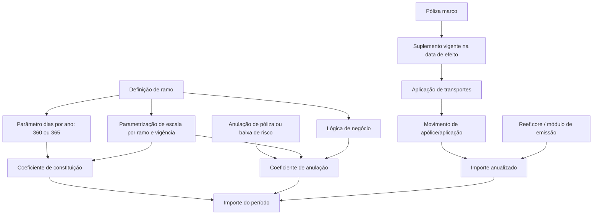

# Glossário Funcional e Regras de Cálculo de Apólices — TRON / Reef.core

## 1. Metadados do Documento
- **Arquivo de Origem:** Não informado; conteúdo bruto com 20 páginas.
- **Tipo de Documento:** Manual funcional / glossário de negócio.
- **Domínio / Sistema:** TRON, Reef.core, emissão e gestão de apólices.
- **Público-Alvo:** Desenvolvedores, arquitetos, analistas funcionais, operação e negócio.
- **Data/Versão Identificada:** Não identificada.

---

## 2. Resumo Executivo & Contexto de Negócio

O documento consolida conceitos funcionais e regras de cálculo usados no domínio de seguros, com referências explícitas ao módulo de emissão de **Reef.core** e ao contexto **TRON**. O conteúdo cobre apólices, aplicações de transportes, suplementos, vigência, renovação, coasseguro, revalorização de capital e modalidades de emissão.

A base de cálculo descrita parte do princípio de que os cálculos de emissão em Reef.core retornam inicialmente valores anualizados. Esses valores são posteriormente ajustados ao período de vigência do movimento por coeficientes de constituição, prorrata temporis ou escalas parametrizadas por ramo.

O documento diferencia regras temporais e financeiras importantes: dias de vigência para anos de 360 ou 365 dias, coeficiente de constituição, coeficiente de anulação, prorrata e escala. Também apresenta exemplos numéricos para períodos de 15, 30, 90, 181, 270, 273, 360 e 365 dias.

Além dos cálculos, o material cataloga classificações operacionais: tipos de emissão, temporalidades de apólice, tipos de coasseguro, tipos de póliza de transportes, revalorização de capital e tipos de suplemento. Diversos tópicos aparecem apenas com o status **“EN CONSTRUCCIÓN”**, sem detalhamento funcional adicional.

---

## 3. Arquitetura, Componentes & Tecnologias Envolvidas

### Componentes e conceitos identificados

| Componente / Conceito | Papel descrito |
| :--- | :--- |
| **TRON** | Contexto no qual são definidos termos de seguros, incluindo aplicações de transportes. |
| **Reef.core** | Sistema cujo módulo de emissão calcula inicialmente importes anualizados e os ajusta ao período de vigência. |
| **Módulo de emissão de Reef.core** | Retorna importes anuais, independentemente de o ano ser bissexto ou não. |
| **Oracle** | Tecnologia referenciada nas fórmulas de dias de vigência para ano de 360 dias, usando `MONTHS_BETWEEN` e `CEIL`. |
| **Lógica de negócio** | Mecanismo citado para alterar coeficientes ou determinar revalorização de capital. O documento não descreve contratos, nomes ou implementação dessas lógicas. |
| **Ramo** | Configuração que determina, entre outros aspectos, dias por ano, cálculo a escala e aplicação de regras de anulação. |
| **Póliza marco** | Apólice-base da qual uma aplicação de transportes herda informações do suplemento vigente na data de efeito da aplicação. |
| **Aplicação** | Apólice temporal associada ao tratamento de emissão “Transportes”, baseada em uma póliza marco. |
| **Suplemento** | Movimento associado à apólice ou aplicação, usado para emissão, alteração, anulação, renovação, regularização e outros processos. |



> **Nota de Análise:** O documento cita Reef.core, Oracle, lógicas de negócio e uma referência a “Home Solutions APIs Documentation Zeus”, mas não detalha integrações, métodos HTTP, contratos JSON, URLs completas, credenciais, portas, ambientes ou topologia de implantação.

---

## 4. Regras de Negócio, Especificações Funcionais & Processos

### 4.1 Aplicação de transportes

Uma **aplicação** aplica-se quando um ramo está associado ao tratamento de emissão **Transportes**. Trata-se de uma apólice temporal cuja informação é baseada em outra apólice denominada **póliza marco**.

A aplicação herda informações do suplemento da póliza marco que esteja vigente na data de efeito da aplicação. A aplicação pode modificar parte das informações herdadas, mas não todas. O documento não enumera quais atributos podem ou não ser alterados.

### 4.2 Coeficiente de constituição

O coeficiente de constituição determina quanto do importe anualizado deve ser aplicado a um movimento. Portanto, determina o valor a cobrar ou devolver conforme os dias de vigência.

```text
coeficiente_de_constitución := ROUND(días_de_vigencia / días_año, 6)
```

- O coeficiente é expresso em tanto por um.
- O coeficiente pode ser afetado por lógica definida no nível de ramo.
- Para 365 dias: 365 dias de vigência correspondem a `1,000000`.
- Para 360 dias: 360 dias de vigência correspondem a `1,000000`.

### 4.3 Dias de vigência

Os dias de vigência são os dias entre efeito e vencimento. O cálculo depende da definição do ramo para o parâmetro de dias por ano:

- **365 dias:** diferença direta entre vencimento e efeito.
- **360 dias:** meses entre vencimento e efeito multiplicados por 30; a expressão mostrada usa `CEIL(MONTHS_BETWEEN(...)*30)`.

### 4.4 Prorrata

Prorrata aplica proporcionalmente os importes de cobertura e conceitos de desagregação ao tempo de vigência. Parte sempre de um importe anualizado e aplica a proporção do período envolvido na operação de póliza ou aplicação.

Para anulação, a prorrata é definida como os dias de vigência do movimento dividido pelos dias de vigência do último suplemento vigente que afetou a póliza, arredondado a seis casas:

```text
coeficiente_de_anulación :=
ROUND(
  días_de_vigencia_suplemento_actual /
  días_de_vigencia_suplemento_anterior_vigente,
  6
)
```

### 4.5 Escala

Em cálculo a escala, a proporção não é determinada por prorrata temporis. A proporção é estabelecida manualmente por parametrização, por ramo e período de vigência em dias.

Os percentuais de vigência a escala são subjetivos e dependem do critério de cada instalação. No exemplo apresentado, 365 dias podem corresponder a 110%, 273 dias a 80%, 181 dias a 60% e 90 dias a 30%.

### 4.6 Importe anualizado e importe do período

O **importe anualizado** é o resultado anual de um cálculo de emissão em Reef.core. O cálculo inicial representa um ano completo, mesmo em anos bissextos. Em seguida, Reef.core ajusta esse valor automaticamente ao período de vigência.

O **importe do período** é o valor resultante da adaptação do importe anualizado ao período de vigência do movimento. É o valor que o cliente deve pagar ou receber.

### 4.7 Tipos de anulação a escala

| Tipo | Regra |
| :--- | :--- |
| **Direto sobre o percentual de anulação** | Para os dias entre efeito e vencimento, utiliza diretamente o percentual de anulação definido na tabela. |
| **Proporcional sobre o percentual de constituição** | Usa o percentual de constituição do suplemento atual dividido pelo percentual de constituição do último suplemento. |
| **Proporcional sobre o percentual de anulação** | Usa o percentual de anulação atual dividido pelo percentual de constituição do último suplemento. |

```text
%_de_anulación := %_de_suplemento_actual / %_de_suplemento_anterior
```

### 4.8 Temporalidade de apólices

| Temporalidade | Regra de renovação |
| :--- | :--- |
| **Anual prorrogable** | Dura um ano e é renovada por outro ano ao vencer. |
| **Temporal no renovable** | Ao vencer, não é renovada e fica expirada. |
| **Temporal renovable por su periodo** | Dura menos de um ano e, se renovada, renova pelo mesmo período de calendário. |
| **Temporal renovable por su temporalidad** | Dura menos de um ano e, se renovada, é renovada pelo mesmo intervalo de tempo. |
| **Temporal renovable** | Dura menos de um ano; na primeira renovação passa a durar um ano e, posteriormente, torna-se anual prorrogable. |

### 4.9 Coasseguro

| Tipo de coasseguro | Regra |
| :--- | :--- |
| **Exento** | A apólice não possui coasseguro. |
| **Cedido** | MAPFRE gere a apólice, cobra prémios, liquida integralmente sinistros e depois abona ou carrega às demais coasseguradoras os valores correspondentes. |
| **Aceptado** | MAPFRE aceita parte da responsabilidade do seguro de uma apólice gerida por outra companhia. |

### 4.10 Revalorização de capital

| Tipo | Regra |
| :--- | :--- |
| **No revaloriza** | O capital não é revalorizado nem depreciado na renovação. |
| **Especial** | A forma de revalorização é especificada. |
| **Por riesgo** | A determinação é delegada ao momento da emissão da apólice. |
| **Capital actual** | A revalorização aplica-se ao capital atual do elemento. |
| **Capital inicial** | A revalorização aplica-se ao capital original do elemento. |
| **IPC** | A revalorização considera a variação do Índice de Preços ao Consumidor. |
| **Otro índice** | A revalorização usa um índice definido no sistema e identificado no ponto de configuração. |
| **Lógica de negocio** | A revalorização usa o resultado de uma lógica de negócio cujo nome é indicado. |

---

## 5. Tabelas de Parâmetros, Ambientes e Estruturas de Dados

### 5.1 Coeficiente de constituição — exemplos para 365 dias

| Cenário | Efeito | Vencimento | Dias de vigência | Coeficiente de constituição |
| :--- | :--- | :--- | ---: | ---: |
| 1 | 01 Enero 2023 | 01 Enero 2024 | 365 | 1,000000 |
| 2 | 01 Enero 2023 | 01 Octubre 2023 | 273 | 0,747945 |
| 3 | 01 Enero 2023 | 01 Julio 2023 | 181 | 0,495890 |
| 4 | 01 Enero 2023 | 01 Abril 2023 | 90 | 0,246575 |

### 5.2 Coeficiente de constituição — exemplos para 360 dias

| Cenário | Efeito | Vencimento | Dias de vigência | Coeficiente de constituição |
| :--- | :--- | :--- | ---: | ---: |
| 1 | 01 Enero 2023 | 01 Enero 2024 | 360 | 1,000000 |
| 2 | 01 Enero 2023 | 01 Octubre 2023 | 270 | 0,750000 |
| 3 | 01 Enero 2023 | 01 Julio 2023 | 180 | 0,500000 |
| 4 | 01 Enero 2023 | 01 Abril 2023 | 90 | 0,250000 |

### 5.3 Cálculo de dias de vigência

| Parâmetro dias ano | Método | Expressão apresentada |
| :--- | :--- | :--- |
| 360 | Meses entre vencimento e efeito multiplicados por 30 | `CEIL(MONTHS_BETWEEN(fecha de vencimiento, fecha de efecto) * 30)` |
| 365 | Dias entre vencimento e efeito | `fecha de vencimiento - fecha de efecto` |

### 5.4 Exemplos de dias de vigência

| Dias ano | Efeito | Vencimento | Resultado |
| :--- | :--- | :--- | ---: |
| 365 | 01 Enero 2023 | 01 Febrero 2023 | 31 |
| 365 | 01 Enero 2023 | 15 Febrero 2023 | 45 |
| 360 | 01 Enero 2023 | 01 Febrero 2023 | 30 |
| 360 | 01 Enero 2023 | 15 Febrero 2023 | 43,5483870967742 |

### 5.5 Percentuais para anulação a escala

| Dias de vigência | Percentual de constituição | Percentual de anulação |
| :--- | ---: | ---: |
| 15 | 10% | 90% |
| 30 | 20% | 80% |

### 5.6 Operações por tipo de emissão

| Tipo de emissão | Operações citadas |
| :--- | :--- |
| Solicitud | COTIZAR póliza; EMITIR presupuesto; EMITIR presupuesto desde presupuesto; EMITIR presupuesto desde suspensión; EMITIR presupuestos desde póliza |
| Póliza | EMITIR póliza; EMITIR póliza desde presupuesto; EMITIR póliza desde suspension; EMITIR póliza multiusuario |
| Suplemento | ALTERAR póliza; ANULAR póliza; DISMINUIR póliza por siniestro; EXTENDER póliza vigencia; LIQUIDAR póliza; PRERENOVAR póliza; REGULARIZAR póliza; REHABILITAR póliza; RENOVAR póliza; RESTITUIR póliza capital, entre outras listadas no conteúdo bruto |
| Póliza grupo | EMITIR póliza; EMITIR póliza desde presupuesto; EMITIR póliza desde suspension; EMITIR póliza multiusuario |
| Remplazada | REEMPLAZAR póliza; REEMPLAZAR póliza renovando |
| Aplicaciones | EMITIR aplicación; EMITIR aplicación desde declaración; EMITIR aplicación desde supension |
| Suplemento aplicación | ALTERAR aplicación; ANULAR aplicación; LIQUIDAR aplicación; REHABILITAR aplicación, entre outras |
| Declaraciones previas | EMITIR declaración |
| Reemplazada renovación | CONVERTIR RENOVACIÓN (cargas en el sistema, renovando) |

---

## 6. Bateria de Perguntas & Respostas para RAG (FAQ Sintético)

### P1: Como Reef.core calcula o valor inicial de uma cobertura?
**R:** O módulo de emissão de Reef.core calcula inicialmente um importe anualizado. O valor representa o custo correspondente a um ano de vigência, independentemente de o ano ser bissexto. Depois, Reef.core ajusta automaticamente o importe ao período de vigência do movimento.

### P2: Qual é a fórmula do coeficiente de constituição?
**R:** A fórmula apresentada é `ROUND(días_de_vigencia / días_año, 6)`. O resultado determina a parcela do importe anualizado que deve ser cobrada ou devolvida para o período de vigência do movimento.

### P3: Como são calculados os dias de vigência quando o ramo usa ano de 360 dias?
**R:** Para o parâmetro de 360 dias, o documento define dias de vigência como os meses entre vencimento e efeito multiplicados por 30. A expressão Oracle apresentada é `CEIL(MONTHS_BETWEEN(fecha de vencimiento, fecha de efecto) * 30)`.

### P4: O que diferencia prorrata de escala?
**R:** Prorrata aplica proporcionalmente o importe anualizado ao tempo de vigência. Escala não usa prorrata temporis; usa percentuais parametrizados manualmente por ramo e intervalo de vigência, definidos segundo critérios da instalação.

### P5: O que é uma aplicação de transportes?
**R:** É uma apólice temporal usada quando o ramo possui tratamento de emissão “Transportes”. A aplicação baseia-se em uma póliza marco e herda informações do suplemento da póliza marco vigente na data de efeito da aplicação.

### P6: Uma aplicação pode alterar toda a informação recebida da póliza marco?
**R:** Não. O documento estabelece que uma aplicação pode alterar parte da informação da póliza marco, mas não toda. Os campos ou regras alteráveis não são detalhados.

### P7: Qual é a diferença entre coasseguro cedido e aceito?
**R:** No coasseguro cedido, MAPFRE gere a apólice, cobra prémios, liquida sinistros e posteriormente ajusta valores com as outras companhias. No coasseguro aceito, MAPFRE aceita parte da responsabilidade de uma apólice administrada por outra companhia.

### P8: O que faz um suplemento de regularização?
**R:** É um suplemento que afeta a anualidade anterior para ajustar a situação da apólice. Pode ser usado quando o capital varia durante a vigência, como em fábricas ou armazéns. Deve ser suplemento temporal e não calcula importe não consumido.

### P9: A diminuição por sinistro devolve prémio?
**R:** Não. A diminuição por sinistro reduz a soma assegurada das coberturas afetadas, mas a redução não implica devolução de prémio. Também não permite outras modificações na apólice ou aplicação.

### P10: Quando pode ser usada a restituição de capital?
**R:** A restituição de capital restaura uma soma assegurada anteriormente reduzida por suplemento de diminuição de soma assegurada por sinistro, tipo `DS`. Pode ser aplicada quando a soma assegurada intervém no cálculo do prémio, pois a soma restaurada aumenta o prémio correspondente.

---

## 7. Glossário de Termos, Siglas & Conceitos-Chave

- **Aplicación:** Apólice temporal de transportes baseada em uma póliza marco.
- **Coaseguro:** Participação de mais de uma seguradora na responsabilidade de uma apólice.
- **Coeficiente de anulación:** Coeficiente usado para determinar valor a devolver em anulação de apólice ou baixa de risco elegível.
- **Coeficiente de constitución:** Coeficiente que aplica parte do importe anualizado ao movimento.
- **DS:** Código de saída do suplemento de diminuição por sinistro.
- **IPC:** Índice de Preços ao Consumidor.
- **Importe anualizado:** Valor anual calculado inicialmente pelo módulo de emissão de Reef.core.
- **Importe del periodo:** Valor a pagar ou receber após ajustar o importe anualizado ao período de vigência.
- **Ocurrencia:** Formulário de perguntas solicitado repetidamente, como uma declaração para cada joia segurada.
- **Póliza grupo:** Conjunto de apólices independentes associadas a um número único de grupo.
- **Póliza marco:** Apólice de referência da qual a aplicação herda informações.
- **Póliza multi-riesgo:** Apólice única que abriga riscos semelhantes de um tomador, registados de forma independente.
- **Prorrata temporis:** Aplicação proporcional de valor com base no tempo de vigência.
- **Reef.core:** Sistema referido como responsável por cálculos anualizados no módulo de emissão.
- **Ramo:** Contexto de negócio/configuração que pode determinar regras de cálculo, dias anuais e escalas.
- **SM / AD / AP / RG / RC / XX:** Códigos de entrada ou saída apresentados nas tabelas de suplemento; o documento não expande os respetivos significados.

---

## 8. Notas Críticas, Riscos & Limitações

- O material é predominantemente um glossário funcional; não apresenta contratos técnicos, APIs, modelos JSON, URLs completas, ambientes, autenticação ou detalhes de infraestrutura.
- O documento contém diversas descrições marcadas como **“EN CONSTRUCCIÓN”**. Não há base documental para inferir suas regras, entradas, saídas ou impactos financeiros.
- Algumas tabelas sofreram truncamento na extração bruta, especialmente valores finais da coluna de importe prorrateado e textos de observação.
- A definição de escala afirma que os percentuais são subjetivos e dependem do critério de cada instalação; portanto, percentuais de exemplo não devem ser tratados como regra universal.
- As lógicas de negócio citadas podem alterar coeficientes de constituição, anulação e revalorização, mas o documento não identifica seus nomes, regras ou interfaces.
- A expressão de Oracle para ano de 360 dias aparece quebrada entre páginas; foi preservada conforme o texto extraído.
- O documento menciona MAPFRE nas regras de coasseguro, mas não descreve responsabilidades operacionais além das regras apresentadas.

---

## 9. Conteúdo Bruto Estruturado (Referência Fiel)

```text
--- [PÁGINAS 1 A 4] ---

TÉRMINOS (TRON)

Aplicación
Este concepto aplica cuando a un ramo se le asocia al tratamiento de emisión el valor Transportes.
Realmente es una póliza temporal, cuya información se basa en otra póliza llamada póliza marco.
Dependiendo de la fecha de efecto de la aplicación, la información que hereda de la póliza marco
corresponde a un suplemento de esta última vigente a la fecha de efecto de la aplicación.
Una aplicación puede alterar parte de la información de la marco, pero no toda.

Coeficiente de anulación
Se utiliza para determinar el importe que hay que devolver en caso de anulación de póliza o riesgo.
Es utilizado exclusivamente en las anulaciones de póliza y en las bajas de riesgo cuya definición de
ramo indique que se apliquen las mismas reglas de la anulación de póliza.
Este coeficiente varía si la anulación es a prorrata o escala y puede ser alterado mediante una lógica
de negocio definida en el suplemento.

Prorrata
coeficiente_de_anulación := ROUND(
  días_de_vigencia_suplemento_actual /
  días_de_vigencia_suplemento_anterior_vigente,
  6
)

Coeficiente de constitución
Se usa para determinar cuanto importe del anualizado, que es la base de la tarifa en Reef.core,
aplica a un movimiento.
coeficiente_de_constitución := ROUND(días_de_vigencia / días_año, 6)

PARÁMETRO DÍAS AÑO: 365
01 Enero 2023 a 01 Enero 2024: 365 días, 1,000000.
01 Enero 2023 a 01 Octubre 2023: 273 días, 0,747945.
01 Enero 2023 a 01 Julio 2023: 181 días, 0,495890.
01 Enero 2023 a 01 Abril 2023: 90 días, 0,246575.

PARÁMETRO DÍAS AÑO: 360
01 Enero 2023 a 01 Enero 2024: 360 días, 1,000000.
01 Enero 2023 a 01 Octubre 2023: 270 días, 0,750000.
01 Enero 2023 a 01 Julio 2023: 180 días, 0,500000.
01 Enero 2023 a 01 Abril 2023: 90 días, 0,250000.

Compañía líder
Entidad aseguradora o reaseguradora que asume una participación mayoritaria en el contrato y
determina las decisiones a seguir por el resto de coaseguradores o reaseguradores.

Días de vigencia
Corresponde a los días que hay entre el efecto y el vencimiento.
360: Meses entre vencimiento y efecto multiplicado por 30 días:
CEIL(MONTHS_BETWEEN(fecha de vencimiento, fecha de efecto) * 30)
365: fecha de vencimiento - fecha de efecto.

--- [PÁGINAS 5 A 8] ---

Escala
Cuando los cálculos son a escala, no se aplicará la proporción prorrata temporis.
La proporción se determina de forma manual mediante una parametrización por ramo y periodo de
vigencia en días. Los valores se determinan de forma subjetiva aplicando un criterio propio de cada
instalación.

Importe anualizado
En el módulo de emisión de Reef.core, cualquier cálculo devuelve importes anuales.
Posteriormente y dependiendo del periodo de vigencia, este importe se ajusta de forma automática.

Importe del periodo
Es el importe que resulta de llevar el importe anualizado al periodo de vigencia del movimiento.
Es el importe que el cliente deberá pagar o el importe que el cliente recibirá.

Ocurrencia
Formulario compuesto por una serie de cuestiones solicitado más de una vez.

Periodo de vigencia
Tiempo entre la emisión inicial o última renovación y el vencimiento.

Póliza grupo
Conjunto de pólizas independientes asociadas a un número de póliza grupo para unirlas bajo un
número único.

Póliza multi-riesgo
Póliza que alberga todos los riesgos de naturaleza semejante de un tomador, registrados de forma
independiente dentro de una única póliza.

Temporalidad de póliza
Anual prorrogable; temporal no renovable; temporal renovable por su periodo; temporal renovable
por su temporalidad; temporal renovable.

--- [PÁGINAS 9 A 15] ---

Tipo de anulación a escala
Directo sobre el porcentaje de anulación.
Proporcional sobre el porcentaje de constitución.
Proporcional sobre el porcentaje de anulación.

Fórmula mostrada:
%_de_anulación := %_de_suplemento_actual / %_de_suplemento_anterior

Tipo de coaseguro
Exento: la póliza no tiene coaseguro.
Cedido: MAPFRE gestiona la póliza, cobra primas, liquida siniestros y ajusta cantidades con otras
compañías coaseguradoras.
Aceptado: MAPFRE acepta parte de la responsabilidad de una póliza gestionada por otra compañía.

Tipo de emisión
Solicitud: COTIZAR póliza; EMITIR presupuesto; EMITIR presupuesto desde presupuesto;
EMITIR presupuesto desde suspensión; EMITIR presupuestos desde póliza.
Póliza: EMITIR póliza; EMITIR póliza desde presupuesto; EMITIR póliza desde suspension;
EMITIR póliza multiusuario.
Suplemento: ALTERAR, ANULAR, DISMINUIR por siniestro, EXTENDER vigencia, LIQUIDAR,
PRERENOVAR, REGULARIZAR, REHABILITAR, RENOVAR y RESTITUIR capital, entre otras.
Póliza grupo, Remplazada, Aplicaciones, Suplemento aplicación, Declaraciones previas y
Reemplazada renovación: operaciones según las tablas de las páginas 13 a 15.

--- [PÁGINAS 16 A 20] ---

Tipo de póliza de transportes
Póliza fija: póliza estándar.
Póliza marco con prima en depósito: pago inicial y regularización mediante suplemento al vencimiento.
Póliza marco sin prima en depósito: sin pago inicial y regularización mediante suplemento al final.

Tipo de revalorización de capital
No revaloriza; Especial; Por riesgo.
Tipo de revalorización especial:
No revaloriza; Capital actual; Capital inicial; IPC; Otro índice; Lógica de negocio.

Tipo de suplemento
Indeterminado: permite múltiples cambios; aplica a la anualidad actual.
Regularización: afecta a la anualidad anterior; debe ser suplemento temporal; no se halla importe no
consumido.
Emisión: primera emisión de una póliza nueva en Reef.core.
Disminución por siniestro: reduce suma asegurada sin devolución de prima; no permite otras
modificaciones; entrada DS, salida AP.
Restitución de capital: restaura suma asegurada disminuida previamente por suplemento DS;
puede incrementar prima si la suma asegurada interviene en su cálculo; entrada RC, salida AD.
Nominativo: salida que indica modificaciones sin efecto económico, comisiones ni cuotas; entrada
No aplica, salida SM.

Los tipos Anticipo, Recobro de anticipo, Rescate, Reducción, Rehabilitación póliza reducida,
Aportaciones extraordinarias, Anulación de suplemento, Extinción del riesgo, Seguro prorrogado
(vida), Liquidación de transportes, Anulación parcial, Adicional, Suplemento anualidad anterior,
Anulación suplemento anualidad anterior, Anulación suplemento temporal y Rescate parcial aparecen
como EN CONSTRUCCIÓN.
```
