# Índice de Termos Corporativos e de Seguros — Referência Alfabética

## 1. Metadados do Documento
- **Arquivo de Origem:** Não identificado; conteúdo bruto fornecido na solicitação.
- **Tipo de Documento:** Referência terminológica / índice corporativo.
- **Domínio / Sistema:** Seguros, gestão de apólices, sinistros, comissões, contabilidade, canais e terceiros; menção a Reef.core.
- **Público-Alvo:** Negócio, operação, analistas funcionais, desenvolvedores e arquitetos.
- **Data/Versão Identificada:** Não identificada.

---

## 2. Resumo Executivo & Contexto de Negócio

O documento é um índice alfabético de termos utilizados em um contexto corporativo relacionado a seguros. O conteúdo abrange entidades de negócio, estruturas organizacionais, processos de apólices, sinistros, comissões, cobrança, pagamento, contabilidade, gestão de terceiros e tratamento de solicitações IQRF.

A referência apresenta conceitos ligados ao ciclo de vida de produtos e contratos de seguros, incluindo apólices, recibos, prêmios, coberturas, franquias, vigência, renovação, suplementos, sinistros, coaseguro e reservas. Também relaciona elementos de remuneração e compensação, como comissão de carteira, comissão de nova produção, antecipos e subvenção a agentes.

O índice inclui termos de cadastro e classificação de pessoas ou entidades, como agente, intermediário, representante legal, pessoa politicamente exposta, nível de estudos, parentesco, perfil financeiro e classificação de terceiros. Também registra estruturas de canais, estruturas comerciais, geográficas e de produto.

Há referências explícitas a `Reef.core`, à operação `Reef.core`, a IQRF e a recursos técnicos como expressão regular, token, lista de valores, lógica de negócio e controles técnicos. Entretanto, o conteúdo fornecido não define os termos, não descreve contratos de integração, métodos de API, modelos de dados, regras de cálculo ou procedimentos operacionais detalhados.

---

## 3. Arquitetura, Componentes & Tecnologias Envolvidas

O documento não descreve uma arquitetura técnica, camadas de software, interfaces, APIs, bancos de dados, servidores, ambientes ou protocolos de integração. Os únicos elementos que podem ser identificados como relacionados a sistemas ou recursos técnicos são:

| Componente / Termo | Evidência no documento | Detalhamento disponível |
| :--- | :--- | :--- |
| `Reef.core` | O termo “Operación Reef.core” é listado. | Não há descrição da função, arquitetura, interfaces ou responsabilidades do sistema. |
| `IQRF` | Os termos “Felicitación”, “Incidencia”, “Queja” e “Reclamación” aparecem associados a IQRF. | A sigla não é expandida nem definida. |
| Expressão regular | “Expresión regular” aparece no índice. | Não são apresentados padrões, usos ou mecanismos de validação. |
| Token | “Token” aparece no índice. | Não há indicação de autenticação, autorização, formato ou ciclo de vida. |
| Lista de valores | “Lista de valores” aparece no índice. | Não há estrutura, catálogo ou valores enumerados. |
| Lógica de negócio | “Lógica de negocio” aparece no índice. | Não há regras ou implementações detalhadas. |
| Controle técnico | “Control técnico” aparece no índice. | Não há critérios, validações ou procedimentos associados. |

```mermaid
graph TD
  Documento["Índice de Termos Corporativos"] --> Seguros["Domínio de Seguros"]
  Documento --> Canais["Canais, Estruturas e Terceiros"]
  Documento --> Financeiro["Cobrança, Pagamento e Contabilidade"]
  Documento --> Atendimento["IQRF"]
  Documento --> Tecnico["Recursos Técnicos"]

  Seguros --> Apolices["Apólices, vigência, renovação e suplementos"]
  Seguros --> Sinistros["Sinistros, causas e consequências"]
  Seguros --> Produtos["Coberturas, franquias, prêmios e capitais"]
  Seguros --> Coaseguro["Coaseguro e companhia líder"]

  Canais --> Agentes["Agentes, intermediários e fonte de produção"]
  Canais --> Estruturas["Estruturas de canais, comercial, geográfica e produto"]
  Canais --> Terceiros["Classificação, categorias e inabilitação de terceiros"]

  Financeiro --> Comissoes["Comissões e nova produção"]
  Financeiro --> Cobranca["Conceitos de cobrança e pagamento"]
  Financeiro --> Contabilidade["Assentos, ramos e registro diário"]

  Atendimento --> IQRF["Felicitação, incidência, queixa e reclamação"]
  Tecnico --> ReefCore["Operação Reef.core"]
  Tecnico --> Validacoes["Expressão regular, token e controle técnico"]
```



> **Nota de Análise:** O documento lista “Operación Reef.core”, “Token”, “Expresión regular” e “Lógica de negocio”, porém não detalha métodos HTTP, contratos JSON, padrões técnicos, ferramentas, ambientes ou responsabilidades dos componentes.

---

## 4. Regras de Negócio, Especificações Funcionais & Processos

O conteúdo fornecido não apresenta regras de negócio explícitas, critérios de cálculo, condições de validação, fluxos operacionais ou sequências processuais. Trata-se de uma lista de termos de referência, organizada alfabeticamente.

Os termos permitem identificar os seguintes grupos funcionais, sem que haja especificação adicional de comportamento:

1. **Gestão de apólices e contratos**
   - Acordo/contrato e subacordo/subcontrato.
   - Apólice de cliente, apólice de grupo, nova produção de apólice e renovação prévia.
   - Período de vigência, dias de vigência, temporalidade de apólice e tipo de emissão.
   - Suplemento, tipo de suplemento, cláusula, textos e textos anexos.
   - Formato de numeração de apólice.

2. **Cobertura, capital e precificação**
   - Cobertura, franquia, soma assegurada, intervalo de soma assegurada e limite de soma assegurada.
   - Prêmio de risco, valor anualizado, valor mínimo e valor do período.
   - Prorrata, escala, coeficientes de constituição e anulação.
   - Revalorização de capital e revalorização especial.

3. **Sinistros**
   - Sinistro, causa de sinistro e consequência de sinistro.
   - Expediente e nível de tramitação.
   - Plano de tramitação e trâmite.

4. **Canais, agentes e terceiros**
   - Agente/intermediário, fonte de produção, canal e cliente distribuidor.
   - Estrutura de canais, estrutura comercial, estrutura geográfica e estrutura de produto.
   - Classificação, categoria, inabilitação e atividade de terceiros.
   - Representante legal, pessoa politicamente exposta e parentesco.

5. **Comissões e compensações**
   - Comissão de carteira e comissão de nova produção.
   - Carteira de comissão e carteira de apólice.
   - Forma de compensação.
   - Subvenção a agentes.
   - Tipo de devolução de empréstimo ou adiantamento de comissão.
   - Tipo de adiantamento.

6. **Cobrança, pagamentos e contabilidade**
   - Conceito de cobrança e pagamento.
   - Tipo de conceito de cobrança e pagamento.
   - Ordem de pagamento, liquidação, recibo, nota de crédito e nota de débito.
   - Assento contábil, ramo contábil, ramo contábil por atributo e registro diário.
   - Regime fiscal, moeda e tipo de câmbio.

7. **Atendimento e IQRF**
   - Felicitação, incidência, queixa e reclamação associadas ao termo IQRF.
   - O documento não descreve o significado da sigla IQRF, nem o fluxo de classificação, tratamento ou encerramento desses registros.

8. **Recursos técnicos e controle**
   - Expressão regular, token, lista de valores, lógica de negócio e controle técnico.
   - O documento não fornece detalhes de implementação, critérios de aceitação, regras de segurança ou dependências técnicas.

> **Nota de Análise:** Não é possível derivar regras operacionais, fórmulas, responsabilidades, ordens de execução ou validações apenas a partir dos nomes presentes no índice.

---

## 5. Tabelas de Parâmetros, Ambientes e Estruturas de Dados

O documento não contém tabelas de parâmetros, valores, ambientes, URLs, rotas de log, servidores ou estruturas de dados. A tabela abaixo consolida os termos indexados por área funcional.

| Item / Parâmetro | Descrição / Função | Tipo / Valores / Formato | Ambiente / Observações |
| :--- | :--- | :--- | :--- |
| Accesorio | Termo listado no índice. | Não especificado. | Sem detalhamento. |
| Actividad económica | Termo relacionado a atividade econômica. | Não especificado. | Sem detalhamento. |
| Acuerdo / Contrato | Termo associado a acordo ou contrato. | Não especificado. | Também aparece como “Contrato (acuerdo)”. |
| Agrupación | Agrupação associada a estrutura de canais ou terceiros. | Estrutura de canais; terceiros. | O documento traz ambas as variações. |
| Agente / Intermediario | Termo de agente ou intermediário. | Não especificado. | Aparece como “Agente (Intermediario)” e “Intermediario (Agente)”. |
| Ámbito Territorial | Termo de escopo territorial. | Não especificado. | Sem detalhamento. |
| Aplicación | Termo de aplicação. | Não especificado. | Sem detalhamento. |
| Asiento contable | Termo de lançamento contábil. | Não especificado. | Sem detalhamento. |
| Atributo | Termo de atributo. | Não especificado. | Há também “Ramo contable por atributo”. |
| Buzón | Termo de caixa postal. | Não especificado. | Sem detalhamento. |
| Calidad | Termo de qualidade. | Não especificado. | Sem detalhamento. |
| Calificación / Rating | Termo de classificação ou rating. | Não especificado. | Também listado como “Rating (calificación)”. |
| Canal / Fuente de producción | Canal ou fonte de produção em estrutura de canais. | Não especificado. | Ambas as denominações são listadas. |
| Cartera | Carteira associada a comissão ou apólice. | Comissão; apólice. | Sem detalhamento adicional. |
| Categoría terceros | Categoria de terceiros. | Não especificado. | Sem detalhamento. |
| Causa siniestro | Causa de sinistro. | Não especificado. | Sem detalhamento. |
| Causa inhabilitación | Causa de inabilitação de terceiros ou por atividade. | Terceiros; atividade de terceiros. | Sem critérios ou estados definidos. |
| Clasificación terceros | Classificação de terceiros. | Não especificado. | Sem detalhamento. |
| Cláusula | Cláusula. | Não especificado. | Sem detalhamento. |
| Cliente distribuidor | Cliente distribuidor em estrutura de canais. | Estrutura de canais. | Sem detalhamento. |
| Cobertura | Cobertura de seguro. | Não especificado. | Sem detalhamento. |
| Coeficiente de anulación | Coeficiente de anulação. | Não especificado. | Sem fórmula ou regra de aplicação. |
| Coeficiente de constitución | Coeficiente de constituição. | Não especificado. | Sem fórmula ou regra de aplicação. |
| Comisión de cartera | Comissão de carteira. | Não especificado. | Sem detalhamento. |
| Comisión de nueva producción | Comissão de nova produção. | Não especificado. | Sem detalhamento. |
| Compañía líder | Companhia líder. | Não especificado. | Contexto provável de coaseguro, mas não declarado. |
| Concepto de cobro y pago | Conceito de cobrança e pagamento. | Não especificado. | Há tipo correspondente listado. |
| Concepto de reserva | Conceito de reserva. | Não especificado. | Sem detalhamento. |
| Consecuencia siniestro | Consequência de sinistro. | Não especificado. | Sem detalhamento. |
| Consentimiento | Consentimento. | Não especificado. | Sem detalhamento. |
| Control técnico | Controle técnico. | Não especificado. | Sem mecanismo descrito. |
| Cuadro de coaseguro | Quadro de coaseguro. | Não especificado. | Sem estrutura ou participantes definidos. |
| Cuota | Parcela de plano de renda ou recibo. | Plano de renda; recibo. | O documento lista ambas as acepções. |
| Días de adelanto/atraso | Dias de adiantamento/atraso. | Não especificado. | Sem regra de cálculo. |
| Días de vigencia | Dias de vigência. | Não especificado. | Sem regra de cálculo. |
| Documento identificador | Documento identificador. | Não especificado. | Sem formatos aceitos. |
| Elemento | Elemento. | Não especificado. | Sem detalhamento. |
| Entidad comercializadora | Entidade comercializadora relacionada a meios de pagamento. | Meios de pagamento. | Sem detalhamento. |
| Escala | Escala. | Não especificado. | Sem valores ou intervalos. |
| Estructura canales | Estrutura de canais. | Não especificado. | Sem hierarquia ou modelo. |
| Estructura comercial | Estrutura comercial. | Não especificado. | Sem detalhamento. |
| Estructura geográfica | Estrutura geográfica. | Não especificado. | Sem detalhamento. |
| Estructura producto | Estrutura de produto. | Não especificado. | Sem detalhamento. |
| Expediente | Expediente. | Não especificado. | Sem detalhamento. |
| Expresión regular | Expressão regular. | Não especificado. | Nenhum padrão é fornecido. |
| Fechas de proceso | Datas de processo. | Não especificado. | Sem calendário ou regras. |
| Felicitación (IQRF) | Felicitação associada a IQRF. | IQRF. | Sigla não definida. |
| Forma de compensación | Forma de compensação. | Não especificado. | Sem modalidades descritas. |
| Formato de numeración de póliza | Formato de numeração de apólice. | Não especificado. | Sem máscara ou exemplos. |
| Franquicia | Franquia. | Não especificado. | Sem cálculo ou condições. |
| Importe anualizado | Valor anualizado. | Não especificado. | Sem fórmula. |
| Importe mínimo | Valor mínimo. | Não especificado. | Sem limites numéricos. |
| Importe del periodo | Valor do período. | Não especificado. | Sem periodicidade. |
| Incidencia (IQRF) | Incidência associada a IQRF. | IQRF. | Sigla não definida. |
| Intervalo | Intervalo de soma assegurada. | Soma assegurada. | Sem limites definidos. |
| Límite | Limite de soma assegurada. | Soma assegurada. | Sem valor ou critério. |
| Liquidación | Liquidação. | Não especificado. | Sem processo detalhado. |
| Lista de valores | Lista de valores. | Não especificado. | Sem catálogo de valores. |
| Lógica de negocio | Lógica de negócio. | Não especificado. | Sem regras explícitas. |
| Marca | Marca. | Não especificado. | Sem detalhamento. |
| Moneda | Moeda. | Não especificado. | Há também tipo de câmbio. |
| Nivel de estudios | Nível de estudos. | Não especificado. | Sem domínio de valores. |
| Nivel de tramitación | Nível de tramitação. | Não especificado. | Sem estados ou níveis. |
| Nota de crédito / débito | Notas de crédito e débito. | Não especificado. | Sem fluxo de emissão. |
| Nueva producción | Nova produção de comissão ou apólice. | Comissão; apólice. | Sem regras de elegibilidade. |
| Operación Reef.core | Operação associada a Reef.core. | Sistema/Operação. | Sem descrição técnica ou funcional. |
| Orden de pago | Ordem de pagamento. | Não especificado. | Sem fluxo ou integração. |
| Panel | Painel. | Não especificado. | Sem detalhamento. |
| Parentesco | Parentesco. | Não especificado. | Sem domínio de valores. |
| Perfil financiero | Perfil financeiro. | Não especificado. | Sem atributos definidos. |
| Periodo de vigencia | Período de vigência. | Não especificado. | Sem regras de início/fim. |
| Persona políticamente expuesta | Pessoa politicamente exposta. | P.E.P. | A sigla aparece explicitamente no índice. |
| Plan de pago | Plano de pagamento. | Não especificado. | Sem parcelas ou regras. |
| Plan de tramitación | Plano de tramitação. | Não especificado. | Sem etapas detalhadas. |
| Póliza cliente | Apólice de cliente. | Não especificado. | Sem modelo de dados. |
| Póliza grupo | Apólice de grupo. | Não especificado. | Sem modelo de dados. |
| Prima de riesgo | Prêmio de risco. | Não especificado. | Sem cálculo. |
| Programa de fidelización | Programa de fidelização. | Não especificado. | Sem regras ou benefícios. |
| Prorrata | Prorrata. | Não especificado. | Sem fórmula. |
| Queja (IQRF) | Queixa associada a IQRF. | IQRF. | Sigla não definida. |
| Ramo | Ramo. | Não especificado. | Sem catálogo. |
| Ramo contable | Ramo contábil. | Não especificado. | Sem mapeamento contábil. |
| Ramo contable por atributo | Ramo contábil por atributo. | Não especificado. | Sem regras de associação. |
| Recibo | Recibo. | Não especificado. | Há referência a “Cuota (recibo)”. |
| Reclamación (IQRF) | Reclamação associada a IQRF. | IQRF. | Sigla não definida. |
| Régimen fiscal | Regime fiscal. | Não especificado. | Sem tipos ou regras. |
| Registro diario | Registro diário. | Não especificado. | Sem processo contábil detalhado. |
| Renovación previa | Renovação prévia. | Não especificado. | Sem regras de renovação. |
| Representante legal | Representante legal. | Não especificado. | Sem critérios. |
| Sector / Subsector | Setor e subsetor. | Não especificado. | Sem taxonomia. |
| Siniestro | Sinistro. | Não especificado. | Sem fluxo de tratamento. |
| Subacuerdo / Subcontrato | Subacordo ou subcontrato. | Não especificado. | Termos relacionados entre si no índice. |
| Subvención Agentes | Subvenção a agentes. | Não especificado. | Sem critérios de concessão. |
| Tarea | Tarefa. | Não especificado. | Sem workflow. |
| Temporalidad de póliza | Temporalidade de apólice. | Não especificado. | Sem classificações. |
| Textos / Textos anexos | Textos e textos anexos. | Não especificado. | Sem templates ou estrutura. |
| Tipo de anticipo | Tipo de adiantamento. | Não especificado. | Sem valores permitidos. |
| Tipo de anulación a escala | Tipo de anulação em escala. | Não especificado. | Sem regras. |
| Tipo de cambio | Tipo de câmbio de moeda. | Moeda. | Sem fonte ou periodicidade. |
| Tipo de clase de gestor | Tipo de classe de gestor. | Não especificado. | Sem valores definidos. |
| Tipo de coaseguro | Tipo de coaseguro. | Não especificado. | Sem categorias. |
| Tipo de concepto de cobro y pago | Tipo de conceito de cobrança e pagamento. | Não especificado. | Sem valores definidos. |
| Tipo de devolución del préstamo o anticipo de comisión | Tipo de devolução de empréstimo ou adiantamento de comissão. | Não especificado. | Sem modalidades ou critérios. |
| Tipo de emisión | Tipo de emissão. | Não especificado. | Sem valores definidos. |
| Tipo de póliza de transportes | Tipo de apólice de transportes. | Não especificado. | Sem categorias. |
| Tipo de revalorización de capital | Tipo de revalorização de capital. | Não especificado. | Sem fórmula ou periodicidade. |
| Tipo de revalorización especial | Tipo de revalorização especial. | Não especificado. | Sem regras. |
| Tipo de suplemento | Tipo de suplemento. | Não especificado. | Sem valores definidos. |
| Titulación | Titulação. | Não especificado. | Sem domínio de valores. |
| Token | Token. | Não especificado. | Sem formato ou mecanismo técnico. |
| Trámite | Trâmite. | Não especificado. | Sem workflow. |
| Tratamiento | Tratamento. | Não especificado. | Sem detalhamento. |
| Trébol | Trébol. | Não especificado. | Sem definição no documento. |
| Unit Linked | Unit Linked. | Não especificado. | Sem definição no documento. |
| Usuario del sistema | Usuário do sistema. | Não especificado. | Sem perfis, permissões ou autenticação. |
| Usuario de la entidad | Usuário da entidade. | Não especificado. | Sem perfis, permissões ou autenticação. |

---

## 6. Bateria de Perguntas & Respostas para RAG (FAQ Sintético)

### P1: Qual é o propósito do documento de índice de termos?
**R:** O documento organiza alfabeticamente termos corporativos relacionados principalmente ao domínio de seguros, incluindo apólices, sinistros, comissões, canais, terceiros, cobrança, pagamentos, contabilidade e conceitos técnicos. O conteúdo funciona como referência terminológica, mas não fornece definições detalhadas dos termos.

### P2: O que o documento informa sobre Reef.core?
**R:** O documento lista o termo “Operación Reef.core”. Não há descrição das funcionalidades de Reef.core, arquitetura, módulos, integrações, APIs, ambientes, métodos HTTP ou contratos de dados associados ao sistema.

### P3: Quais termos relacionados a sinistros estão presentes no índice?
**R:** O índice contém os termos “Siniestro”, “Causa siniestro”, “Consecuencia siniestro”, “Expediente”, “Nivel de tramitación”, “Plan de tramitación” e “Trámite”. O documento não descreve o processo de abertura, análise, aprovação, liquidação ou encerramento de sinistros.

### P4: Quais conceitos de comissão aparecem no documento?
**R:** O documento lista “Comisión de cartera”, “Comisión de nueva producción”, “Cartera (comisión)”, “Nueva producción (comisión)”, “Forma de compensación”, “Subvención Agentes”, “Tipo de anticipo” e “Tipo de devolución del préstamo o anticipo de comisión”. Não há fórmulas, percentuais, condições de elegibilidade ou regras de cálculo.

### P5: O documento define regras para apólices e vigência?
**R:** Não. O documento apenas lista termos como “Póliza cliente”, “Póliza grupo”, “Periodo de vigencia”, “Días de vigencia”, “Temporalidad de póliza”, “Renovación previa”, “Tipo de emisión”, “Tipo de suplemento” e “Formato de numeración de póliza”. Não são apresentados critérios de emissão, renovação, cancelamento ou cálculo de vigência.

### P6: Quais estruturas organizacionais ou comerciais são mencionadas?
**R:** São listadas “Estructura canales”, “Estructura comercial”, “Estructura geográfica”, “Estructura producto”, “Agrupación (estructura de canales)”, “Cliente distribuidor (estructura de canales)”, “Canal (fuente de producción)” e “Fuente de producción (estructura de canales)”. O documento não apresenta uma hierarquia ou modelo de relacionamento entre essas estruturas.

### P7: O que significa IQRF no documento?
**R:** O documento associa IQRF aos termos “Felicitación”, “Incidencia”, “Queja” e “Reclamación”. Entretanto, a sigla IQRF não é expandida e não há definição de processo, classificação, estados, responsáveis ou acordos de nível de serviço relacionados.

### P8: Há especificação de autenticação, autorização ou tokens?
**R:** Não. O índice inclui o termo “Token”, mas não informa se ele representa um token de autenticação, autorização, sessão ou outro mecanismo. Também não há formato, algoritmo, validade, escopos ou integração técnica descritos.

### P9: Quais termos contábeis e financeiros são indexados?
**R:** O documento inclui “Asiento contable”, “Ramo contable”, “Ramo contable por atributo”, “Registro diario”, “Régimen fiscal”, “Moneda”, “Tipo de cambio”, “Liquidación”, “Orden de pago”, “Nota de crédito y nota de débito”, “Concepto de cobro y pago” e “Tipo de concepto de cobro y pago”. Não há lançamentos, contas contábeis, mapeamentos ou fluxos financeiros detalhados.

### P10: Quais conceitos de coaseguro são citados?
**R:** O índice registra “Compañía líder”, “Cuadro de coaseguro” e “Tipo de coaseguro”. O documento não informa participantes, percentuais de participação, responsabilidades, regras de liderança ou cálculos de distribuição.

### P11: Quais termos técnicos ou de configuração são mencionados?
**R:** O documento lista “Expresión regular”, “Control técnico”, “Lista de valores”, “Lógica de negocio”, “Token”, “Aplicación”, “Panel”, “Fechas de proceso” e “Elemento”. Não há especificações técnicas, exemplos, parâmetros configuráveis, padrões de expressão regular ou valores de configuração.

### P12: O documento contém URLs de ambientes, portas, servidores ou caminhos de logs?
**R:** Não. O conteúdo fornecido não contém URLs, hosts, portas, credenciais, rotas de logs, nomes de ambientes, pipelines de CI/CD ou configurações de infraestrutura.

---

## 7. Glossário de Termos, Siglas & Conceitos-Chave

- **IQRF:** Sigla associada a felicitação, incidência, queixa e reclamação. O significado completo não é definido no documento.
- **P.E.P:** Pessoa politicamente exposta, apresentada como “Persona políticamente expuesta (P.E.P)”.
- **Reef.core:** Sistema ou operação mencionada no termo “Operación Reef.core”; sem detalhamento adicional.
- **Agente / Intermediario:** Termos associados entre si no índice, sem definição funcional.
- **Apólice:** O documento lista “Póliza cliente”, “Póliza grupo”, “Nueva producción (póliza)” e “Tipo de póliza de transportes”, sem definições.
- **Cobertura:** Termo listado no contexto de seguros; não detalhado.
- **Coaseguro:** Contexto identificado por “Cuadro de coaseguro”, “Compañía líder” e “Tipo de coaseguro”.
- **Comissão de carteira:** Termo de comissão listado; sem fórmula ou regra operacional.
- **Comissão de nova produção:** Termo de comissão associado a nova produção; sem critérios ou cálculo.
- **Franquia:** Termo listado; sem definição, valor ou condição de aplicação.
- **Prêmio de risco:** Termo financeiro/segurador listado; sem método de cálculo.
- **Prorrata:** Termo listado; sem fórmula ou uso detalhado.
- **Recibo:** Termo associado também a “Cuota (recibo)”; sem detalhamento de emissão ou liquidação.
- **Sinistro:** Termo listado, com causa e consequência; sem processo operacional descrito.
- **Token:** Termo técnico listado, sem definição de mecanismo ou finalidade.
- **Unit Linked:** Termo listado sem definição adicional.
- **Trébol:** Termo listado sem definição adicional.

---

## 8. Notas Críticas, Riscos & Limitações

- O conteúdo é um índice de termos, não uma especificação funcional, técnica, operacional ou arquitetural completa.
- O documento não fornece definições formais para os termos listados, o que limita seu uso como fonte única para implementação, configuração ou tomada de decisão operacional.
- A sigla **IQRF** é citada, mas não é expandida nem contextualizada.
- A menção a **Reef.core** não é acompanhada de descrição de arquitetura, interfaces, integrações, módulos ou responsabilidades.
- Não há URLs, servidores, ambientes, parâmetros técnicos, portas, esquemas de autenticação, formatos de mensagens ou rotas de logs.
- Não há regras de cálculo para comissões, prêmios, franquias, prorrata, coeficientes, revalorizações, limites ou valores.
- Não há fluxos de estado ou procedimentos para sinistros, apólices, pagamentos, cobrança, tramitação, queixas, incidências ou reclamações.
- Termos como **Trébol**, **Unit Linked**, **Panel**, **Marca**, **Elemento** e **Tratamiento** aparecem sem qualquer definição adicional.
- A navegação textual “Inicio Soluciones APIs Documentación Zeus / ES / RS” aparece no conteúdo bruto, mas não é explicada. Não é possível afirmar se representa menu, plataforma, ambiente ou metadado de origem.

---

## 9. Conteúdo Bruto Estruturado (Referência Fiel)

```text
--- [PÁGINA 1 DE 11] ---

TÉRMINOS - Índice
A
Accesorio
Actividad
Actividad económica
Acuerdo (contrato)
Agrupación (estructura de canales)
Agrupación (terceros)
Agente (Intermediario)
Agrupación (Estructura de Canales)
 / 
 RS
Inicio Soluciones APIs Documentación Zeus
ES


--- [PÁGINA 2 DE 11] ---

Ámbito Territorial
Aplicación
Asiento contable
Atributo
B
Buzón
C
Calidad
Calificación (rating)
Canal (fuente de producción)
Cartera (comisión)
Cartera (póliza)
Categoría terceros
Causa siniestro
Causa inhabilitación (terceros)
Causa inhabilitación por actividad (terceros)


--- [PÁGINA 3 DE 11] ---

Clasificación terceros
Cláusula
Cliente distribuidor (estructura de canales)
Cobertura
Coeficiente de anulación
Coeficiente de constitución
Comisión de cartera
Comisión de nueva producción
Compañía líder
Concepto de cobro y pago
Concepto de reserva
Consecuencia siniestro
Consentimiento
Contrato (acuerdo)
Control técnico
Cuadro de coaseguro
Cuota (plan de renta)


--- [PÁGINA 4 DE 11] ---

Cuota (recibo)
D
Días de adelanto/atraso
Días de vigencia
Documento identificador
E
Elemento
Entidad comercializadora (medios de pago)
Escala
Estructura canales
Estructura comercial
Estructura geográfica
Estructura producto
Expediente
Expresión regular


--- [PÁGINA 5 DE 11] ---

F
Fechas de proceso
Felicitación (IQRF)
Forma de compensación
Formato de numeración de póliza
Franquicia
Fuente de producción (estructura de canales)
G
H
I
Incidencia (IQRF)
Intervalo (suma asegurada)
Intermediario (Agente)
Intervención
Importe anualizado


--- [PÁGINA 6 DE 11] ---

Importe mínimo
Importe del periodo
J
K
L
Límite (suma asegurada)
Liquidación
Lista de valores
Lógica de negocio
M
Marca
Moneda
N
Nivel de estudios
Nivel de tramitación


--- [PÁGINA 7 DE 11] ---

Nota de crédito y nota de débito
Nueva producción (comisión)
Nueva producción (póliza)
O
Operación
Operación Reef.core
Orden de pago
P
Panel
Parentesco
Perfil financiero
Periodo de vigencia
Persona políticamente expuesta (P.E.P)
Plan de pago
Plan de tramitación
Póliza cliente


--- [PÁGINA 8 DE 11] ---

Póliza grupo
Prima de riesgo
Programa de fidelización
Prorrata
Q
Queja (IQRF)
R
Ramo
Ramo contable
Ramo contable por atributo
Rating (calificación)
Recibo
Reclamación (IQRF)
Régimen fiscal
Registro diario
Renovación previa


--- [PÁGINA 9 DE 11] ---

Representante legal
S
Sector
Siniestro
Subacuerdo (subcontrato)
Subcontrato (subacuerdo)
Subsector
Subvención Agentes
T
Tarea
Temporalidad de póliza
Textos
Textos anexos
Tipo de anticipo
Tipo de anulación a escala
Tipo de cambio (moneda)


--- [PÁGINA 10 DE 11] ---

Tipo de clase de gestor
Tipo de coaseguro
Tipo de concepto de cobro y pago
Tipo de devolución del préstamo o anticipo de comisión
Tipo de emisión
Tipo de póliza de transportes
Tipo de revalorización de capital
Tipo de revalorización especial
Tipo de suplemento
Titulación
Token
Trámite
Tratamiento
Trébol
U
Unit Linked


--- [PÁGINA 11 DE 11] ---

Usuario (del sistema)
Usuario (de la entidad)
V
W
X
Y
Z
```
