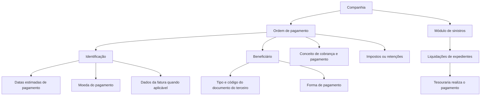

# Glossário Operacional de Tesouraria, Contabilidade, Cobrança e Pagamentos — TRON

## 1. Metadados do Documento
- **Arquivo de Origem:** Não informado
- **Tipo de Documento:** Manual Operacional
- **Domínio / Sistema:** TRON — Tesouraria, contabilidade, cobranças, pagamentos, sinistros, resseguro, cosseguro e comissões
- **Público-Alvo:** Operação, negócio, tesouraria, contabilidade e equipes funcionais
- **Data/Versão Identificada:** Não identificada

---

## 2. Resumo Executivo & Contexto de Negócio

O documento apresenta definições operacionais e contábeis relacionadas ao domínio TRON. O conteúdo descreve conceitos usados para registrar operações financeiras, incluindo lançamentos contábeis, notas de crédito e débito, ordens de pagamento e registro diário.

A ordem de pagamento é apresentada como o meio pelo qual a companhia realiza pagamentos a pessoas físicas ou jurídicas que tenham relação com a organização. O documento classifica ordens de pagamento por finalidade, incluindo tesouraria, sinistros, remessas de resseguro, remessas de cosseguro, comissões de agentes e devoluções de prêmio.

O material detalha a composição de uma ordem de pagamento, destacando identificação, beneficiário, conceito de cobrança/pagamento e impostos ou retenções. Também especifica dados associados, como datas estimadas de pagamento, moeda, informações de fatura, identificação documental do terceiro e modalidade de pagamento.

Adicionalmente, o documento descreve tipos de adiantamento, modalidades de devolução de empréstimos ou adiantamentos de comissão, classes de gestor de cobrança/pagamento e classificações de conceitos de cobrança e pagamento. O material não detalha fluxos sistêmicos, APIs, contratos técnicos, telas, URLs, ambientes ou integrações do sistema TRON.

---

## 3. Arquitetura, Componentes & Tecnologias Envolvidas

O documento não descreve uma arquitetura de software, componentes técnicos, microsserviços, bancos de dados, tecnologias, ambientes ou integrações. O conteúdo apresenta uma estrutura operacional e conceitual do processo de geração e composição de ordens de pagamento.

Os componentes funcionais identificados são:

| Componente / Domínio | Papel descrito no documento |
| :--- | :--- |
| TRON | Contexto em que são apresentados os termos operacionais e financeiros. |
| Tesouraria | Área associada a ordens de pagamento do tipo `T` e à realização de pagamentos de sinistros. |
| Módulo de sinistros | Gera ordens de pagamento de sinistros, chamadas de liquidações de expedientes. |
| Contabilidade | Registra entradas e saídas de dinheiro por meio de lançamentos contábeis com Deve e Haber. |
| Registro diário | Documento cronológico que registra operações diárias em forma de lançamento contábil. |
| Agentes | Participam da gestão de cobranças/pagamentos, do recebimento de comissões e da devolução de empréstimos ou adiantamentos. |
| Banco | Pode atuar como gestor de cobrança/pagamento, inclusive em débito automático em conta e débito com cartão de crédito. |
| Companhia líder em cosseguro aceito | Atua como gestor piloto de cosseguro. |



> **Nota de Análise:** O documento informa que as ordens de pagamento de sinistros são geradas no módulo de sinistros, mas que o pagamento é realizado pela tesouraria. Não há detalhamento de interfaces, transações, integrações ou responsabilidades técnicas adicionais.

---

## 4. Regras de Negócio, Especificações Funcionais & Processos

### 4.1. Lançamento contábil

Um lançamento contábil é uma anotação efetuada no livro de contabilidade para registrar uma entrada ou saída de dinheiro, como uma compra ou um pagamento.

Cada lançamento contábil é refletido por duas anotações:

1. **Deve:** utilizado quando a operação corresponde a uma despesa.
2. **Haber:** utilizado quando a operação corresponde a uma receita.

### 4.2. Nota de crédito e nota de débito

Notas de crédito e notas de débito são documentos legais utilizados para registrar modificações ocorridas no processo de faturamento.

Esses documentos devem ser emitidos em situações como:

1. Correção de faturas com valores incorretos.
2. Anulação de faturas emitidas por erro.
3. Aplicação de descontos que não foram aplicados no faturamento.
4. Registro de qualquer tipo de modificação na fatura original.

A diferença indicada entre os documentos é:

- A **nota de crédito** representa um valor negativo para a companhia.
- A **nota de débito** representa um valor positivo para a companhia.

### 4.3. Ordem de pagamento

A ordem de pagamento é o meio pelo qual a companhia realiza pagamentos a pessoas físicas ou jurídicas que tenham mantido relação com a organização.

Os tipos de ordem de pagamento identificados são:

- `T`: Tesouraria.
- `S`: Sinistros.
- `R`: Remessas de resseguro.
- `C`: Remessas de cosseguro.
- `A`: Comissões de agente.
- `D`: Devoluções de prêmio.

### 4.4. Ordens de pagamento de sinistros

As ordens de pagamento de sinistros são geradas no próprio módulo de sinistros. Entretanto, o pagamento é realizado pela tesouraria.

Essas ordens de pagamento são denominadas **liquidações de expedientes**.

Podem existir liquidações negativas para cobrança e recuperação de sinistros. Os exemplos apresentados são:

- Franquias.
- Recuperação de sinistros de outra companhia.

### 4.5. Composição da ordem de pagamento

A ordem de pagamento é composta pelos seguintes blocos funcionais:

1. **Identificação**
   - Datas estimadas de pagamento.
   - Moeda do pagamento.
   - Dados da fatura, sempre que o pagamento for realizado por uma fatura.
   - Outros dados não especificados no documento.

2. **Beneficiário**
   - Tipo de documento do terceiro a pagar.
   - Código do documento do terceiro a pagar.
   - Forma de realização do pagamento, como dinheiro, cheque ou transferência bancária.

3. **Conceito de cobrança/pagamento**
   - Conceito de pagamento de acordo com a natureza da despesa.

4. **Impostos ou retenções**
   - Impostos e retenções associados ao conceito de cobrança e pagamento.

### 4.6. Registro diário

O registro diário é um documento que registra cronologicamente todas as operações diárias de uma empresa na forma de lançamento contábil.

O registro diário pode incluir:

- Dívidas.
- Inventário.
- Despesas.
- Vendas.
- Qualquer movimento realizado em dinheiro.

### 4.7. Tipos de adiantamento

O documento apresenta os seguintes tipos:

- **Adiantamento:** corresponde a um adiantamento de comissão.
- **Empréstimo:** corresponde a um empréstimo.
- **Montantes:** corresponde a um desconto de comissão no momento da cobrança do recibo.

### 4.8. Classes de gestor

A classe de gestor especifica quem pode gerir a cobrança ou o pagamento.

| Classe de gestor | Responsável pela gestão |
| :--- | :--- |
| Agente | O agente principal é responsável pela gestão. |
| Banco | Um banco é responsável pela gestão. |
| Cobrador | Um cobrador é responsável pela gestão. |
| Débito automático em conta | Um banco é responsável pela gestão. |
| Gestor direto | A oficina é responsável pela gestão. |
| Gestor piloto cosseguro | A companhia líder em um cosseguro aceito é responsável pela gestão. |
| Oficina comercial | Uma oficina comercial é responsável pela gestão. |
| Débito com cartão de crédito | Um banco é responsável pela gestão. |
| Gestor de inadimplência | O recibo passou pelo processo de inadimplência. |

### 4.9. Tipo de conceito de cobrança e pagamento

O tipo de conceito de cobrança e pagamento identifica a classificação à qual pertence um conceito. Essa classificação determina o âmbito de utilização do conceito.

| Classificação | Uso definido |
| :--- | :--- |
| Sinistros | Geração de ordens de pagamento de sinistros. |
| Resseguro | Ordens de pagamento de remessa de resseguro. |
| Cosseguro cedido | Ordens de pagamento de cosseguro cedido. |
| Cosseguro aceito | Ordens de pagamento de cosseguro aceito. |
| Cobranças e pagamentos diversos | Ordens de pagamento de cobranças e pagamentos diversos de tesouraria. |
| Comissões de agentes | Ordens de pagamento de comissões. |
| Conceitos vida | Utilização em ramos de vida. |

### 4.10. Modalidades de devolução de empréstimo ou adiantamento de comissão

| Modalidade | Regra de devolução |
| :--- | :--- |
| Por número de parcelas | O empréstimo ou adiantamento será devolvido em um determinado número de parcelas. |
| Vencimento | O empréstimo ou adiantamento será devolvido em uma única parcela, com uma data de vencimento acordada. |
| Percentual | Um percentual do empréstimo ou adiantamento será devolvido em cada liquidação de comissões do agente até uma data de vencimento acordada. Na chegada da data de vencimento, será devolvido o saldo restante do empréstimo ou adiantamento. |

---

## 5. Tabelas de Parâmetros, Ambientes e Estruturas de Dados

| Item / Parâmetro | Descrição / Função | Tipo / Valores / Formato | Ambiente / Observações |
| :--- | :--- | :--- | :--- |
| Lançamento contábil | Registro de entrada ou saída de dinheiro no livro de contabilidade. | Deve e Haber. | Deve para despesa; Haber para receita. |
| Nota de crédito | Documento legal para modificações de faturamento. | Valor negativo para a companhia. | Aplicável a correções, anulações, descontos não aplicados e outras modificações da fatura. |
| Nota de débito | Documento legal para modificações de faturamento. | Valor positivo para a companhia. | Aplicável a correções, anulações, descontos não aplicados e outras modificações da fatura. |
| Tipo de ordem de pagamento | Classifica a finalidade da ordem de pagamento. | `T`, `S`, `R`, `C`, `A`, `D`. | Consulte a tabela de tipos de ordem de pagamento. |
| `T` | Ordem de pagamento de tesouraria. | Tesouraria. | Não detalhado adicionalmente. |
| `S` | Ordem de pagamento de sinistros. | Sinistros. | Gerada no módulo de sinistros; pagamento realizado pela tesouraria. |
| `R` | Ordem de pagamento de remessa de resseguro. | Resseguro. | Não detalhado adicionalmente. |
| `C` | Ordem de pagamento de remessa de cosseguro. | Cosseguro. | Não detalhado adicionalmente. |
| `A` | Ordem de pagamento de comissão de agente. | Comissões de agente. | Não detalhado adicionalmente. |
| `D` | Ordem de pagamento de devolução de prêmio. | Devoluções de prêmio. | Não detalhado adicionalmente. |
| Identificação da ordem | Dados de identificação da ordem de pagamento. | Datas estimadas, moeda e dados de fatura. | Dados de fatura aplicáveis quando o pagamento é realizado por fatura. |
| Beneficiário | Identifica o terceiro que receberá o pagamento. | Tipo e código do documento do terceiro. | Inclui forma de pagamento. |
| Forma de pagamento | Meio de realização do pagamento. | Dinheiro, cheque, transferência bancária, entre outros. | A lista apresentada não é exaustiva. |
| Conceito de cobrança/pagamento | Identifica o conceito de acordo com a natureza da despesa. | Classificações funcionais. | Determina o âmbito de uso do conceito. |
| Impostos ou retenções | Tributos ou retenções associados ao pagamento. | Associados ao conceito de cobrança e pagamento. | Não há detalhamento de tipos tributários. |
| Adiantamento | Tipo de adiantamento. | Adiantamento de comissão. | Associado a regras de devolução. |
| Empréstimo | Tipo de adiantamento. | Empréstimo. | Associado a regras de devolução. |
| Montantes | Desconto de comissão na cobrança do recibo. | Desconto de comissão. | Não há detalhamento adicional. |
| Gestor de inadimplência | Classe de gestor. | Recibo em processo de inadimplência. | O documento não identifica o responsável operacional específico. |
| Ambientes, URLs e servidores | Não identificados no conteúdo. | Não aplicável. | O documento não contém endereços, servidores, portas ou ambientes. |

---

## 6. Bateria de Perguntas & Respostas para RAG (FAQ Sintético)

### P1: O que é um lançamento contábil no contexto apresentado?
**R:** Um lançamento contábil é uma anotação realizada no livro de contabilidade para registrar uma entrada ou saída de dinheiro, como uma compra ou um pagamento. Cada lançamento é refletido por duas anotações: Deve e Haber. Uma despesa é refletida no Deve, enquanto uma receita é registrada no Haber.

### P2: Quando uma nota de crédito ou uma nota de débito deve ser emitida?
**R:** Notas de crédito e débito devem ser emitidas para registrar modificações no faturamento. Os casos mencionados incluem correção de faturas com valores incorretos, anulação de faturas emitidas por erro, aplicação de descontos não aplicados no faturamento e qualquer outro tipo de modificação na fatura original.

### P3: Qual é a diferença entre nota de crédito e nota de débito para a companhia?
**R:** A nota de crédito representa um valor negativo para a companhia. A nota de débito representa um valor positivo para a companhia.

### P4: Quais são os tipos de ordem de pagamento disponíveis?
**R:** Os tipos de ordem de pagamento são: `T` para Tesouraria, `S` para Sinistros, `R` para Remessas de resseguro, `C` para Remessas de cosseguro, `A` para Comissões de agente e `D` para Devoluções de prêmio.

### P5: Quem gera e quem realiza o pagamento das ordens de pagamento de sinistros?
**R:** As ordens de pagamento de sinistros são geradas no módulo de sinistros. O pagamento dessas ordens é realizado pela tesouraria. Essas ordens são chamadas de liquidações de expedientes.

### P6: Uma liquidação de expediente de sinistro pode ter valor negativo?
**R:** Sim. Podem existir liquidações negativas para cobrança e recuperação de sinistros. O documento cita como exemplos franquias e recuperação de sinistros de outra companhia.

### P7: Quais informações compõem uma ordem de pagamento?
**R:** A ordem de pagamento contém identificação, beneficiário, conceito de cobrança/pagamento e impostos ou retenções. A identificação inclui datas estimadas de pagamento, moeda e dados de fatura quando aplicável. O beneficiário inclui o tipo e código do documento do terceiro e a forma de pagamento. O conceito representa a natureza da despesa, e os impostos ou retenções são associados ao conceito de cobrança e pagamento.

### P8: O que é registrado em um registro diário?
**R:** O registro diário é um documento que registra todas as operações diárias de uma empresa de maneira cronológica e na forma de lançamento contábil. Pode incluir dívidas, inventário, despesas, vendas e qualquer movimento realizado em dinheiro.

### P9: Quem pode gerir uma cobrança ou pagamento segundo a classe de gestor?
**R:** A gestão pode ser atribuída ao agente principal, a um banco, a um cobrador, a uma oficina, à companhia líder em um cosseguro aceito ou a uma oficina comercial, conforme a classe de gestor. Para gestor de inadimplência, o documento informa que o recibo passou pelo processo de inadimplência.

### P10: Qual é a finalidade do tipo de conceito de cobrança e pagamento?
**R:** O tipo de conceito de cobrança e pagamento identifica a classificação à qual pertence o conceito e determina o seu âmbito de uso. As classificações listadas são sinistros, resseguro, cosseguro cedido, cosseguro aceito, cobranças e pagamentos diversos, comissões de agentes e conceitos vida.

### P11: Como funciona a devolução por número de parcelas?
**R:** Na modalidade por número de parcelas, o empréstimo ou adiantamento é devolvido em uma quantidade determinada de parcelas.

### P12: Como funciona a devolução por vencimento?
**R:** Na modalidade por vencimento, o empréstimo ou adiantamento é devolvido em uma única parcela, em uma data de vencimento previamente acordada.

### P13: Como funciona a devolução percentual de empréstimo ou adiantamento?
**R:** Na modalidade percentual, uma porcentagem do empréstimo ou adiantamento é devolvida em cada liquidação de comissões do agente até uma data de vencimento acordada. Quando a data de vencimento é atingida, o valor restante do empréstimo ou adiantamento é devolvido.

---

## 7. Glossário de Termos, Siglas & Conceitos-Chave

- **TRON:** Sistema ou domínio citado no título do conteúdo; o documento não apresenta expansão da sigla.
- **Asiento contable / Lançamento contábil:** Anotação no livro de contabilidade usada para registrar entrada ou saída de dinheiro.
- **Debe:** Registro utilizado quando a operação corresponde a uma despesa.
- **Haber:** Registro utilizado quando a operação corresponde a uma receita.
- **Nota de crédito:** Documento legal para alterações de faturamento que representa um valor negativo para a companhia.
- **Nota de débito:** Documento legal para alterações de faturamento que representa um valor positivo para a companhia.
- **Ordem de pagamento:** Meio pelo qual a companhia realiza pagamentos a pessoas físicas ou jurídicas relacionadas à organização.
- **Liquidação de expediente:** Nome atribuído às ordens de pagamento de sinistros.
- **Tesouraria:** Área associada ao pagamento de ordens de sinistros e às ordens de pagamento do tipo `T`.
- **Resseguro:** Classificação aplicável a ordens de pagamento de remessa de resseguro.
- **Cosseguro cedido:** Classificação aplicável a ordens de pagamento de cosseguro cedido.
- **Cosseguro aceito:** Classificação aplicável a ordens de pagamento de cosseguro aceito.
- **Registro diário:** Documento cronológico de operações diárias registradas em forma de lançamento contábil.
- **Adiantamento:** Adiantamento de comissão.
- **Empréstimo:** Empréstimo sujeito às modalidades de devolução descritas.
- **Montantes:** Desconto de comissão no momento da cobrança do recibo.
- **Gestor direto:** Classe em que uma oficina é responsável pela gestão.
- **Gestor piloto cosseguro:** Classe em que a companhia líder de um cosseguro aceito é responsável pela gestão.
- **Gestor de inadimplência:** Situação em que o recibo passou pelo processo de inadimplência.
- **Conceito de cobrança/pagamento:** Conceito que representa a natureza da despesa e cuja classificação determina seu âmbito de uso.

---

## 8. Notas Críticas, Riscos & Limitações

- O documento não informa nome de arquivo, autor, data, versão ou histórico de revisões.
- O documento não descreve arquitetura de software, tecnologias, APIs, bancos de dados, microsserviços, URLs, servidores, portas, credenciais ou ambientes.
- Não são especificados contratos de dados, campos obrigatórios, regras de validação, códigos de erro ou exceções operacionais para ordens de pagamento.
- A lista de informações de identificação da ordem de pagamento inclui “etc.”, sem detalhar todos os atributos possíveis.
- O documento afirma que existem liquidações negativas de sinistros, mas não define critérios completos de cálculo, limites, aprovações ou contabilização.
- O conteúdo identifica o gestor de inadimplência pela condição do recibo, mas não define qual entidade executa a gestão nesse cenário.
- Não há detalhamento adicional sobre fluxos de aprovação, segregação de funções, auditoria, permissões ou controles de segurança.

---

## 9. Conteúdo Bruto Estruturado (Referência Fiel)

```text
--- [PÁGINA 1 DE 5] ---

TÉRMINOS (TRON)
Asiento contable
Es la anotación que se realiza en el libro de contabilidad para registrar una entrada o salida de
dinero, es decir, una compra o un pago. Cada asiento contable se refleja a través de dos
anotaciones: Debe y Haber.
Cuando se trata de un gasto se refleja en el Debe
Cuando es un ingreso se registra en el Haber
Nota de crédito y nota de débito
Se trata de documentos legales que se utilizan para incluir modificaciones que se presentan en el
momento de la facturación.
Deben emitirse para corregir facturas con importes erróneos, anular facturas emitidas por error,
aplicar descuentos no aplicados en la facturación, modificaciones de cualquier tipo en la factura
original, etc.
La principal diferencia entre ambos radica en que la nota de crédito representa un importe negativo,
mientras que la nota de débito representa una importe positivo, para la compañía.
Orden de pago
Es el medio por el cual la compañía va a poder realizar el pago a personas físicas o jurídicas que
hayan tenido relación con la misma.
Existen diferentes tipos de órdenes de pago:
T: Tesorería
S: Siniestros
R: Remesas de reaseguro
C: Remesas de coaseguro
A: Comisiones de agente
D: Devoluciones de prima
 / 
 CF
Home Solutions APIs Documentation Zeus
EN


--- [PÁGINA 2 DE 5] ---

Las órdenes de pago de siniestros, se generan en el propio módulo, aunque el pago se realiza desde
tesorería. Estas órdenes de pago son las llamadas Liquidaciones de expedientes. Pueden existir
liquidaciones negativas para el cobro y recuperación de siniestros, por ejemplo, deducibles,
recuperación de siniestros de otra compañía, etc.
Composición de la orden de pago
ORDEN DE PAGO
IDENTIFICACIÓN BENEFICIARIO CONCEPTO DE
COBRO PAGO IMPUESTOS O RETENCIONES
IDENTIFICACIÓN:
Fechas estimadas de pago
Moneda del pago
Datos de la factura (siempre que el pago se haga por una factura)
etc.
BENEFICIARIO:
Tipo y código de documento del tercero a pagar
Forma en la que se realiza el pago (efectivo, cheque, transferencia bancaria, etc.)
CONCEPTO DE COBRO PAGO:
Concepto de pago según la naturaleza del gasto
IMPUESTOS O RETENCIONES:
Impuestos y retenciones asociados al concepto de cobro y pago
Registro diario
Se trata de un documento en el que se registran todas las operaciones diarias de una empresa de
manera cronológica y en forma de asiento contable. Es decir, incluye deudas, inventario, gastos,
ventas y cualquier movimiento realizado en efectivo.
Tipo de anticipo
Anticipo
Se trata de un anticipo de comisión.
Préstamo


--- [PÁGINA 3 DE 5] ---

Se trata de un préstamo.
Montos
Se trata de un descuento de comisión en el momento del cobro del recibo.
Tipo de clase de gestor
Especifica quien puede gestionar el cobro/pago.
Agente
Es el agente principal quien se se encarga de gestionar.
Banco
Es un banco quien se encarga de gestionar.
Cobrador
Es un cobrador quien se encarga de gestionar.
Débito automático en cuenta
Es un banco quien se encarga de gestionar.
Gestor directo
Es la oficina quien se encarga de gestionar.
Gestor piloto coaseguro
Es la Compañía líder en un coaseguro aceptado quien se encarga de gestionar.
Oficina comercial
Es una oficina comercial quien se encarga de gestionar.
Debito con tarjeta de credito
Es un banco quien se encarga de gestionar.
Gestor de impagos
El recibo ha pasado al proceso de impagos.


--- [PÁGINA 4 DE 5] ---

Tipo de concepto de cobro y pago
Identifica la clasificación a la que pertenece el concepto de cobro y pago, esta clasificación determina
el ámbito de uso del mismo.
Siniestros
Concepto utilizado para generar órdenes de pago de siniestros.
Reaseguro
Concepto utilizado para órdenes de pago de remesa de reaseguro.
Coaseguro cedido
Concepto utilizado para órdenes de pago de coaseguro cedido.
Coaseguro aceptado
Concepto utilizado para órdenes de pago de coaseguro aceptado.
Cobros y pagos varios.
Concepto utilizado para órdenes de pago de cobros y pagos varios de tesorería.
Agentes comisiones
Conceptos utilizados para órdenes de pago de comisiones.
Conceptos vida
Conceptos utilizados para ramos de vida.
Tipo de devolución del préstamo o anticipo de comisión
Por numero de cuotas
El préstamo o anticipo se devolverá en un determinado número de cuotas.
Vencimiento
El préstamo o anticipo se devolverá en una única cuota con una fecha de vencimiento acordada.
Porcentaje
Se devolverá un porcentaje del préstamo o anticipo en cada liquidación de comisiones del agente,
hasta una fecha de vencimiento acordada. Llegada la fecha de vencimiento se devolverá lo que reste


--- [PÁGINA 5 DE 5] ---

del préstamo o anticipo.
```
