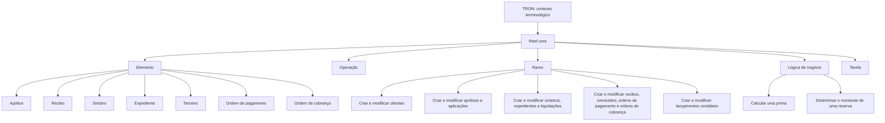
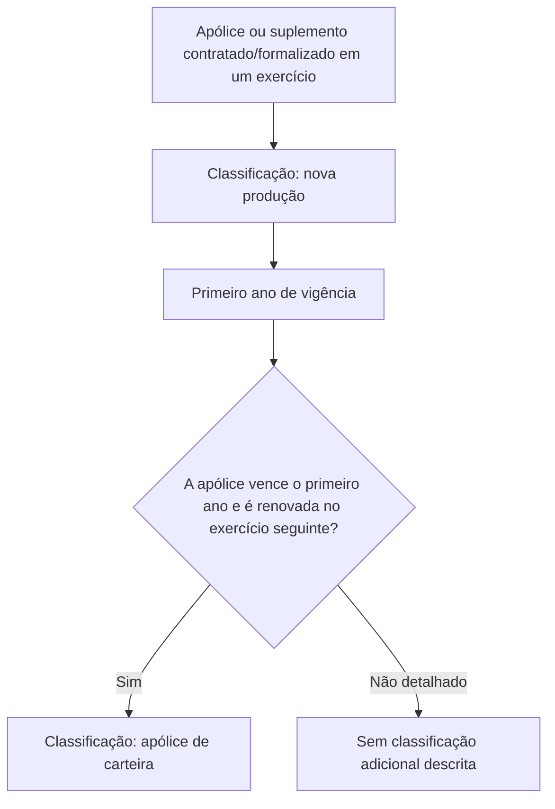

# Glossário de Termos TRON e Reef.core

## 1. Metadados do Documento
- **Arquivo de Origem:** Não identificado
- **Tipo de Documento:** Manual Operacional / Glossário Técnico-Funcional
- **Domínio / Sistema:** TRON e Reef.core; seguros, apólices, recibos, sinistros, comissões e operações financeiras
- **Público-Alvo:** Desenvolvedores, Arquitetos, Operação e Negócio
- **Data/Versão Identificada:** Não identificada

---

## 2. Resumo Executivo & Contexto de Negócio

O documento apresenta definições de termos utilizados no contexto de TRON e Reef.core, com foco em conceitos funcionais de seguros, operações de apólices, comissões, cobrança, pagamentos, sinistros, contabilidade e automação por software.

Reef.core é citado como o sistema no qual são gerados elementos e executadas operações relacionadas à funcionalidade de negócio. Um elemento em Reef.core pode corresponder a uma apólice, recibo, sinistro, expediente, terceiro, ordem de pagamento ou ordem de cobrança.

O glossário também diferencia conceitos temporais e financeiros ligados a seguros. A nova produção representa operações ou comissões associadas ao primeiro ano de vigência de uma apólice ou aplicação, enquanto a carteira corresponde a apólices, suplementos ou comissões de exercícios anteriores.

O documento descreve mecanismos de personalização e execução no sistema. A lógica de negócio é implementada por meio de rotinas de software associadas a pontos específicos do Reef.core, e uma tarefa corresponde a um programa informático executado para realizar uma ação concreta, podendo demandar parâmetros.

---

## 3. Arquitetura, Componentes & Tecnologias Envolvidas

| Componente / Conceito | Papel descrito no documento |
| :--- | :--- |
| TRON | Contexto no qual os termos do glossário são apresentados. |
| Reef.core | Sistema cujas funcionalidades, elementos, módulos, operações e rotinas de lógica de negócio são descritos. |
| Elemento | Denominação genérica para conceitos gerados em Reef.core. |
| Lógica de negócio | Rotina de software associada para personalizar o comportamento de Reef.core. |
| Tarefa | Programa informático com sequência de instruções para executar uma ação concreta. |
| Ramo | Conjunto de características que determina o comportamento dos módulos de Reef.core. |
| Buzón | Local de registro de novas informações ou modificações destinadas a uma operação em processo massivo. |
| Home Solutions APIs Documentation Zeus | Texto citado no documento, sem detalhamento adicional de função, integração ou tecnologia. |



> **Nota de Análise:** O documento não informa arquitetura de implantação, protocolos, APIs, tecnologias de desenvolvimento, bancos de dados, ambientes, URLs, contratos HTTP ou mecanismos de integração entre TRON e Reef.core.

---

## 4. Regras de Negócio, Especificações Funcionais & Processos

### 4.1 Gestão de informações em processos massivos

O **Buzón** é o local no qual uma nova informação ou uma modificação é registrada quando se pretende realizar uma operação em um processo massivo. O documento não detalha os tipos de operações massivas, critérios de validação, estados de processamento ou responsabilidades de aprovação.

### 4.2 Elementos gerados no Reef.core

No Reef.core, **Elemento** é a denominação genérica para qualquer conceito gerado pelo sistema. Um elemento pode ser:

- Apólice;
- Recibo;
- Sinistro;
- Expediente;
- Terceiro;
- Ordem de pagamento;
- Ordem de cobrança.

### 4.3 Lógica de negócio personalizável

A referência a **lógica de negócio** indica a necessidade de associar uma peça de software, denominada rotina, para personalizar o comportamento do Reef.core. O objetivo da rotina depende do local em que ela é associada.

Exemplos explicitamente fornecidos:

1. Calcular uma prima.
2. Determinar o montante de uma reserva.

> **Nota de Análise:** O documento não especifica linguagem de programação, mecanismo de associação, ciclo de execução, parâmetros de entrada, valores de saída ou tratamento de erros das rotinas de lógica de negócio.

### 4.4 Nova produção e carteira

#### Nova produção — comissão

Comissões de nova produção são geradas exclusivamente durante o primeiro ano de vigência da apólice ou aplicação.

#### Nova produção — apólice

Uma apólice de nova produção é uma apólice, ou suplemento, contratado ou formalizado em um exercício. O termo é normalmente aplicado a operações novas de seguros para diferenciá-las das operações que pertencem à carteira, obtidas em anos anteriores.

#### Conversão de nova produção em carteira

Uma apólice de nova produção passa a ser uma apólice de carteira quando:

1. Vence o primeiro ano de vigência da apólice.
2. A apólice é renovada no exercício seguinte.



#### Carteira — comissão

Comissões de carteira são geradas a partir do primeiro ano de vigência da apólice ou suplemento.

#### Carteira — apólice

Uma carteira de apólices é o conjunto de apólices, ou suplementos, contratados ou formalizados em anos anteriores.

### 4.5 Operações do Reef.core

Uma **Operação** corresponde a ações relacionadas à funcionalidade do Reef.core. Os exemplos listados são:

- Criar um cliente;
- Modificar um agente;
- Emitir uma apólice;
- Terminar um sinistro;
- Cobrar um recibo.

### 4.6 Ramo e comportamento modular

Um **Ramo** reúne as características que determinam como os diferentes módulos do Reef.core se comportam. O ramo determina o comportamento para:

1. Criar e modificar clientes.
2. Criar e modificar apólices e aplicações.
3. Criar e modificar sinistros, expedientes e liquidações.
4. Criar e modificar recibos, comissões, ordens de pagamento e ordens de cobrança.
5. Criar e modificar lançamentos contábeis.

### 4.7 Recibo, quota e dívida

A **Quota** é o custo resultante da criação ou modificação de uma apólice ou aplicação. Esse custo é distribuído em frações de acordo com o plano de pagamento.

A quota pode possuir dois sentidos financeiros:

- Valor positivo: MAPFRE recebe o valor.
- Valor negativo: MAPFRE devolve o valor.

O **Recibo** é o documento por meio do qual o pagador reconhece ao devedor o pagamento de uma dívida. O recibo é formado pelas quotas geradas para uma apólice nos diferentes suplementos que produziram um montante.

### 4.8 Prima de risco

No seguro de vida, a **prima de risco** é a parcela da prima destinada exclusivamente a cobrir a possibilidade de morte ou invalidez do segurado.

### 4.9 Renovação prévia

A **renovação prévia** é o processo de renovação antecipado de uma apólice com o objetivo de conhecer a situação em que a apólice ficará, incluindo coberturas, capitais e primas.

### 4.10 Unit Linked

**Unit Linked** é um produto de investimento no qual o tomador contrata um seguro de vida e escolhe os ativos nos quais deseja investir durante um período determinado.

---

## 5. Tabelas de Parâmetros, Ambientes e Estruturas de Dados

| Item / Parâmetro | Descrição / Função | Tipo / Valores / Formato | Ambiente / Observações |
| :--- | :--- | :--- | :--- |
| Buzón | Registra nova informação ou modificações para uma operação massiva. | Local de registro. | Processo massivo; detalhes de fluxo não informados. |
| Elemento | Conceito genérico gerado no Reef.core. | Apólice, recibo, sinistro, expediente, terceiro, ordem de pagamento ou ordem de cobrança. | Reef.core. |
| Carteira — comissão | Comissão gerada a partir do primeiro ano de vigência. | Comissão. | Associada à apólice ou suplemento. |
| Carteira — apólice | Conjunto de apólices ou suplementos contratados/formalizados em anos anteriores. | Conjunto de apólices ou suplementos. | Contexto de seguros. |
| Quota | Custo gerado ao criar ou modificar uma apólice ou aplicação. | Positivo ou negativo; distribuído em frações conforme plano de pagamento. | Positivo: MAPFRE recebe; negativo: MAPFRE devolve. |
| Lógica de negócio | Rotina de software que personaliza o comportamento de Reef.core. | Rotina associada a um ponto do sistema. | Exemplos: calcular prima; determinar reserva. |
| Nova produção — comissão | Comissão produzida somente no primeiro ano de vigência. | Comissão. | Apólice ou aplicação. |
| Nova produção — apólice | Apólice ou suplemento contratado/formalizado em um exercício. | Apólice ou suplemento. | Torna-se carteira após primeiro ano de vigência e renovação no exercício seguinte. |
| Operação | Ação relacionada à funcionalidade do Reef.core. | Criar, modificar, emitir, terminar ou cobrar. | Exemplos fornecidos no documento. |
| Prima de risco | Parte da prima destinada exclusivamente ao risco de morte ou invalidez. | Parcela de prima. | Seguro de vida. |
| Ramo | Características que determinam o comportamento de módulos do Reef.core. | Configuração ou conjunto de características. | Abrange clientes, apólices, aplicações, sinistros, financeiro e contabilidade. |
| Recibo | Documento que reconhece o pagamento de uma dívida. | Documento formado por quotas. | Quotas originadas por suplementos de uma apólice. |
| Renovação prévia | Processo antecipado de renovação de uma apólice. | Processo. | Avalia coberturas, capitais e primas. |
| Tarefa | Programa com instruções para executar uma ação concreta. | Programa informático; pode necessitar parâmetros. | Parâmetros não especificados. |
| Unit Linked | Produto de investimento com contratação de seguro de vida e escolha de ativos. | Produto de investimento. | Período de investimento determinado. |

> **Nota de Análise:** O documento não apresenta URLs de ambientes, servidores, caminhos de log, variáveis de configuração, versões de software, portas de rede ou estruturas formais de dados.

---

## 6. Bateria de Perguntas & Respostas para RAG (FAQ Sintético)

### P1: O que é um elemento no Reef.core?
**R:** Um elemento é a denominação genérica para qualquer conceito gerado no Reef.core. O documento identifica como possíveis elementos uma apólice, um recibo, um sinistro, um expediente, um terceiro, uma ordem de pagamento e uma ordem de cobrança.

### P2: Qual é a diferença entre nova produção e carteira no contexto de apólices?
**R:** Nova produção corresponde a apólices ou suplementos contratados ou formalizados em um exercício, normalmente classificados como operações novas de seguros. Carteira corresponde a apólices ou suplementos contratados ou formalizados em anos anteriores. Uma apólice de nova produção torna-se uma apólice de carteira após vencer o primeiro ano de vigência e ser renovada no exercício seguinte.

### P3: Quando uma comissão é considerada comissão de nova produção?
**R:** Uma comissão de nova produção é gerada exclusivamente durante o primeiro ano de vigência da apólice ou da aplicação.

### P4: Quando uma comissão é considerada comissão de carteira?
**R:** Uma comissão de carteira é gerada a partir do primeiro ano de vigência da apólice ou do suplemento.

### P5: O que é uma quota e qual pode ser seu impacto financeiro?
**R:** Uma quota é o custo resultante da criação ou modificação de uma apólice ou aplicação, distribuído em frações conforme o plano de pagamento. A quota pode ser positiva, situação na qual a MAPFRE recebe o valor, ou negativa, situação na qual a MAPFRE devolve o valor.

### P6: Como um recibo é composto no contexto apresentado?
**R:** Um recibo é o documento pelo qual o pagador reconhece ao devedor o pagamento de uma dívida. O recibo é formado pelas quotas geradas para uma apólice nos diferentes suplementos que geraram um montante.

### P7: Para que serve a lógica de negócio no Reef.core?
**R:** A lógica de negócio serve para associar uma rotina de software que personaliza o comportamento do Reef.core. O objetivo da rotina depende do local em que ela é associada. O documento fornece como exemplos o cálculo de uma prima e a determinação do montante de uma reserva.

### P8: Quais ações são exemplos de operação no Reef.core?
**R:** O documento apresenta como exemplos de operação no Reef.core: criar um cliente, modificar um agente, emitir uma apólice, terminar um sinistro e cobrar um recibo.

### P9: O que um ramo determina no Reef.core?
**R:** Um ramo determina como os diferentes módulos do Reef.core se comportam. Esse comportamento abrange a criação e modificação de clientes; apólices e aplicações; sinistros, expedientes e liquidações; recibos, comissões, ordens de pagamento e ordens de cobrança; além de lançamentos contábeis.

### P10: Qual é o objetivo da renovação prévia de uma apólice?
**R:** A renovação prévia é um processo de renovação antecipado cujo objetivo é conhecer a situação em que a apólice ficará, incluindo coberturas, capitais e primas.

### P11: O que é prima de risco em seguro de vida?
**R:** Prima de risco é a parcela da prima destinada exclusivamente a cobrir a possibilidade de morte ou invalidez do segurado em um seguro de vida.

### P12: O que caracteriza um produto Unit Linked?
**R:** Unit Linked é um produto de investimento no qual o tomador contrata um seguro de vida e escolhe os ativos nos quais deseja investir durante um período determinado.

### P13: Qual é a função de uma tarefa?
**R:** Uma tarefa é um programa informático composto por uma sequência de instruções para executar uma ação concreta. A execução da tarefa pode requerer determinados parâmetros, embora o documento não especifique quais parâmetros são utilizados.

### P14: Qual é a função do Buzón?
**R:** O Buzón é o local onde são registradas novas informações ou modificações desejadas sobre um elemento quando se pretende realizar a operação em um processo massivo.

---

## 7. Glossário de Termos, Siglas & Conceitos-Chave

- **Buzón:** Lugar onde se registra nova informação ou modificações sobre um elemento para realizar uma operação em processo massivo.
- **Carteira (comissão):** Comissões geradas a partir do primeiro ano de vigência da apólice ou suplemento.
- **Carteira (apólice):** Conjunto de apólices ou suplementos contratados ou formalizados em anos anteriores.
- **Elemento:** Denominação genérica para qualquer conceito gerado no Reef.core.
- **Expediente:** Tipo de elemento gerado no Reef.core; o documento não fornece definição adicional.
- **Lógica de negócio:** Associação de uma rotina de software para personalizar o comportamento de Reef.core.
- **MAPFRE:** Entidade citada como recebedora de quotas positivas ou responsável pela devolução de quotas negativas; o documento não fornece expansão da sigla ou descrição institucional.
- **Nova produção (comissão):** Comissão gerada exclusivamente no primeiro ano de vigência da apólice ou aplicação.
- **Nova produção (apólice):** Apólice ou suplemento contratado ou formalizado em um exercício.
- **Operação:** Ação relacionada à funcionalidade do Reef.core.
- **Ordem de cobrança:** Tipo de elemento gerado no Reef.core; o documento não fornece definição adicional.
- **Ordem de pagamento:** Tipo de elemento gerado no Reef.core; o documento não fornece definição adicional.
- **Plano de pagamento:** Referência usada para distribuir a quota em frações; critérios não detalhados.
- **Prima de risco:** Parte da prima de seguro de vida destinada exclusivamente ao risco de morte ou invalidez.
- **Ramo:** Conjunto de características que define o comportamento dos módulos do Reef.core.
- **Reef.core:** Sistema mencionado como origem de elementos e contexto de operações, módulos e lógica de negócio.
- **Recibo:** Documento que reconhece o pagamento de uma dívida e é formado por quotas.
- **Renovação prévia:** Processo de renovação antecipado para conhecer a situação futura da apólice.
- **Sinistro:** Tipo de elemento gerado no Reef.core; também citado em operações e no comportamento definido por ramo.
- **Suplemento:** Entidade relacionada a apólices, carteira, comissões e recibos; o documento não fornece definição independente.
- **Tarefa:** Programa informático que executa uma ação concreta e pode necessitar parâmetros.
- **Terceiro:** Tipo de elemento gerado no Reef.core; o documento não fornece definição adicional.
- **TRON:** Contexto no título “TÉRMINOS (TRON)”; o documento não fornece expansão ou definição adicional.
- **Unit Linked:** Produto de investimento com seguro de vida e escolha de ativos pelo tomador.

---

## 8. Notas Críticas, Riscos & Limitações

- O texto é um glossário técnico-funcional e não apresenta detalhes de arquitetura física, implantação, infraestrutura, APIs, protocolos, bancos de dados ou integrações.
- Não há informações sobre autenticação, autorização, perfis de acesso, auditoria, observabilidade, logs, monitoramento ou tratamento de falhas.
- O documento cita “Home Solutions APIs Documentation Zeus”, mas não explica sua finalidade, localização, URL, interface ou relação técnica com Reef.core.
- Termos como expediente, terceiro, ordem de pagamento, ordem de cobrança e suplemento são citados, mas não recebem detalhamento funcional adicional.
- Não foram identificados métodos HTTP, contratos JSON, eventos, filas, processos de aprovação, regras de cálculo detalhadas ou critérios de validação.
- A classificação de uma apólice como carteira é explicitamente descrita apenas para o caso em que a apólice vence o primeiro ano de vigência e é renovada no exercício seguinte.

---

## 9. Conteúdo Bruto Estruturado (Referência Fiel)

```text
--- [PÁGINA 1 DE 3] ---

TÉRMINOS (TRON)
Buzón
Lugar donde se registra la nueva información o las modificaciones que se desean realizar sobre un
elemento cuando se pretende realizar la operación en un proceso masivo.
Cartera (comisión)
Son comisiones que se generan a partir del primer año de vigencia de la póliza/suplemento.
Cartera (póliza)
Conjunto de pólizas (o suplementos) contratados o formalizados en años anteriores.
Cuota
Es el coste que resulta al crear o modificar una póliza/aplicación, distribuido en fracciones según
indica el plan de pago. Este coste puede ser positivo (MAPFRE lo recibe) o negativo (MAPFRE lo
devuelve). Para mayor información, se puede seguir en siguiente enlace.
Elemento
Es la denominación genérica para cualquier concepto generado en Reef.core. Es decir, un elemento
puede ser un/una:
Póliza
Recibo
Siniestro
Expediente
Tercero
Orden de pago
 /
 CF
Home Solutions APIs Documentation Zeus
EN


--- [PÁGINA 2 DE 3] ---

Orden de cobro
Lógica de negocio
Cuando se hace referencia a este término se está especificando que es necesario asociar una pieza
de software (rutina) que permite personalizar el comportamiento de Reef.core. Estas rutinas
dependiendo del lugar donde se asocien tienen un objetivo muy concreto. Por ejemplo:
Calcular una prima
Determinar el monto de una reserva
etc.
Nueva producción (comisión)
Son aquellas que se generan exclusivamente durante el primer año de vigencia de la
póliza/aplicación.
Nueva producción (póliza)
Conjunto de pólizas (o suplementos) contratados o formalizados en un ejercicio. Generalmente se da
este nombre a las operaciones nuevas de seguros para distinguirlas de aquellas que componen la
cartera (es decir, las conseguidas en años anteriores).
En este sentido, una póliza de nueva producción se convierte en póliza de cartera al vencer su primer
año de vigencia y renovarse en el ejercicio siguiente.
Operación
Acciones relacionadas con la funcionalidad de Reef.core. Por ejemplo:
CREAR un cliente
MODIFICAR un agente
EMITIR una póliza
TERMINAR un siniestro
COBRAR un recibo
Prima de riesgo
En el seguro de vida, se da este nombre a la parte de prima destinada a cubrir exclusivamente la
posibilidad de muerte o invalidez del asegurado.


--- [PÁGINA 3 DE 3] ---

Ramo
Es el conjunto de características que determinan como se van a comportar los distintos módulos de
Reef.core. Es decir, determina el comportamiento a la hora de:
Crear y modificar clientes
Crear y modificar pólizas y aplicaciones
Crear y modificar siniestros, expedientes y liquidaciones
Crear y modificar recibos, comisiones, órdenes de pago y órdenes de cobro
Crear y modificar asientos contables
Recibo
Documento mediante el cual el pagador reconoce al deudor el pago de una deuda. Este documento
está formado por las cuotas generadas para una póliza en los distintos suplementos que generaron
un monto.
Renovación previa
Es el proceso de renovación previo de una póliza, con el fin de conocer la situación en la que queda
esta (coberturas, capitales, primas, etc.).
Tarea
Es un programa informático con una secuencia de instrucciones que realizar una acción concreta y
cuya ejecución puede necesitar de determinados parámetros.
Unit Linked
Es un producto de inversión, en el que el tomador contrata un seguro de vida, eligiendo los activos en
los que quiere invertir, durante un período de tiempo determinado.
```
