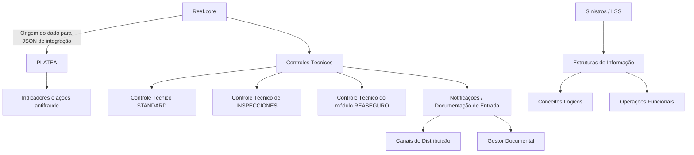
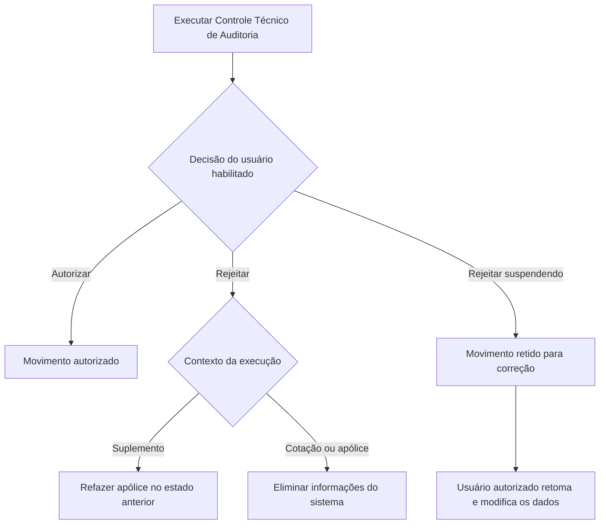

# Catálogo de Tipos Comuns, Controles Técnicos e Operações Funcionais no Reef.core

## 1. Metadados do Documento
- **Arquivo de Origem:** Não identificado no conteúdo fornecido
- **Tipo de Documento:** Especificação Técnica
- **Domínio / Sistema:** Reef.core; PLATEA; TRON; Sinistros; Tesouraria; Notificações; Gestor Documental
- **Público-Alvo:** Desenvolvedores, Arquitetos, Operação e Analistas Funcionais
- **Data/Versão Identificada:** Não identificada

---

## 2. Resumo Executivo & Contexto de Negócio

O documento define catálogos de tipos, códigos e descrições utilizados no núcleo do sistema Reef.core e em domínios funcionais relacionados, incluindo Sinistros, Emissão, Tesouraria, Reasseguro, Terceiros, TRON, notificações, documentação e controles técnicos.

O conteúdo descreve valores de parametrização para origens de dados, canais de distribuição, indexação documental, riscos e ações antifraude no PLATEA, componentes gráficos, acessos parciais à informação, consultas e tarefas. Os códigos apresentados são referências funcionais e operacionais para configuração e execução de processos corporativos.

Uma parte relevante da especificação descreve o comportamento de Controles Técnicos, especialmente controles de Observação, Rejeição e Auditoria. O documento também diferencia os efeitos de rejeitar ou rejeitar suspendendo um controle técnico de auditoria, incluindo reversão de suplemento, eliminação de informações de cotação ou apólice e retenção de movimentos para correção.

O catálogo de Operações Funcionais é centrado em estruturas de informação associadas a agrupamentos específicos de Sinistros. Ele cobre criação, alteração, consulta, encerramento, reabilitação, liquidação, faturação, salvamento, inspeção, juízo, fraude, IQRF, inventários e trâmites.

> **Nota de Análise:** O conteúdo fornecido não descreve interfaces, APIs, bancos de dados, URLs, contratos JSON, versões de tecnologia, servidores ou topologia de implantação. Portanto, não há arquitetura técnica de infraestrutura detalhada no documento.

---

## 3. Arquitetura, Componentes & Tecnologias Envolvidas

| Componente / Domínio | Papel identificado no documento |
| :--- | :--- |
| Reef.core | Sistema no qual a origem do dado é determinada para compor JSON de integração com PLATEA; também considera domínios para autorização de Controle Técnico. |
| PLATEA | Sistema relacionado a indicadores e ações antifraude; recebe JSON de integração originado no Reef.core. |
| Gestor Documental | Destino funcional de regras de indexação documental. |
| Notificações | Domínio que utiliza canais de distribuição, destinatários, obtenção síncrona ou assíncrona e documentação de entrada. |
| Sinistros | Domínio funcional identificado por `LSS`; contém conceitos, operações, consultas, fraude, IQRF, salvamentos, inspeções e juízos. |
| Terceiros | Domínio funcional identificado por `THP`. |
| Emissão | Domínio funcional identificado por `ISU`; inclui opções para obtenção de data contábil de apólices e contratos. |
| Tesouraria | Domínio funcional identificado por `TSY`; inclui compensações de cobranças e pagamentos. |
| Comum | Domínio funcional identificado por `CMN`. |
| TRON / Tronador | Domínio funcional identificado por `TRN`. |
| Reasseguro | Domínio funcional identificado por `RNS`; possui modalidade de autorização de Controle Técnico. |
| Programas de Consulta | Contexto para cálculo de importes e opções de consultas. |
| PL/SQL, COBOL, Shell (UNIX) | Tipos de programas que podem executar uma tarefa. |



---

## 4. Regras de Negócio, Especificações Funcionais & Processos

### 4.1 Controles Técnicos

| Tipo de Controle Técnico | Regra de comportamento |
| :--- | :--- |
| Observação (`1`) | As validações ficam ligadas à operação na qual foram executadas e não requerem tratamento posterior. |
| Rejeição (`2`) | As validações não ficam refletidas na operação, não permitem continuar ou finalizar a operação e exigem a modificação dos dados que provocaram a execução do controle. |
| Auditoria (`3`) | As validações ficam refletidas e ligadas à operação. A operação fica em estado provisório até que um usuário habilitado, com autoridade suficiente, autorize ou rejeite o movimento. |

### 4.2 Ação em Rejeição de Controle Técnico de Auditoria

| Ação | Código | Comportamento |
| :--- | :--- | :--- |
| Rejeita | `2` | Se executado em suplemento, o sistema refaz a apólice no estado anterior. Se executado em cotação ou apólice, o sistema elimina as informações, podendo a entidade decidir quais dados do movimento manter para auditoria, fins comerciais ou técnicos. |
| Rejeita suspendendo | `3` | O sistema mantém o movimento retido. O usuário, ou outro usuário conforme configuração explícita, pode retomar o movimento e alterar a informação que causou o controle técnico. |



### 4.3 Regras Funcionais Adicionais

- O tipo de ramo contábil determina a forma de obtenção do ramo contábil associado à cobertura.
- O tipo de nível de risco determina o nível de risco do indicador antifraude no PLATEA.
- O tipo de continente/origem do dado determina a origem de informação no Reef.core para formação do JSON de integração com PLATEA.
- O canal de distribuição define como documentos ou notificações podem ser distribuídos pela ferramenta de geração e envio.
- A indexação documental determina o método de indexação segundo o modelo e os tipos documentais definidos localmente.
- O âmbito funcional do documento ou notificação pode ser Entrada ou Saída.
- O cálculo de importes em programas de consulta pode considerar a última anuidade ou totais acumulados.
- As estruturas de informação só podem usar conceitos lógicos e operações funcionais quando suas agrupações corresponderem a agrupações específicas de Sinistros.
- A compensação de Tesouraria pode ser aplicável a ambos os âmbitos, somente cobranças ou somente pagamentos.
- A data contábil, para emissão de apólices e contratos e contabilização de prémios, pode ser obtida por três opções definidas no catálogo.

---

## 5. Tabelas de Parâmetros, Ambientes e Estruturas de Dados

### 5.1 Tipos Comuns, Integração, Notificações e Documentação

| Item / Parâmetro | Descrição / Função | Tipo / Valores / Formato | Ambiente / Observações |
| :--- | :--- | :--- | :--- |
| Tipo de Ramo Contábil | Obtém o ramo contábil associado à cobertura. | `1` Ramo Contábil Estándar por Cobertura; `2` Ramo Contábil Dependiente por Dato Variable | Cobertura |
| Nível de Risco Antifraude | Determina o risco do indicador antifraude. | `100` Crítico; `75` Alto; `50` Médio; `25` Baixo; `-1` Sin Respuesta | PLATEA |
| Continente / Origem do Dado | Determina a origem do dado para compor JSON de integração. | `1` Dato Fijo; `2` Intervención; `3` Dato Variable; `4` Concepto Desglose; `5` No Aplica | Reef.core / PLATEA |
| Canal de Distribuição | Define o canal de distribuição de documentos ou notificações. | `1` Local; `2` Correo Electrónico; `3` Fax; `4` Mensajería (SMS); `5` File System; `6` Web; `7` Gestor Documental; `8` PEX; `9` Firma Electrónica; `10` Webplus | Notificações |
| Ação Antifraude | Determina a ação associada ao indicador antifraude. | `1` Control Técnico; `2` Nuevo Trámite; `3` Nuevo Nivel en Plan de Tramitación; `4` Sin Acción | PLATEA |
| Indexação em Gestor Documental | Define método de indexação documental. | `1` Persona Física y Jurídica; `2` Póliza/Aplicación; `3` Suplemento; `4` Siniestro; `5` Expediente; `6` Expediente / Plan de Tramitación; `7` Recibo; `8` Recibo / Póliza | Gestor Documental |
| Âmbito Funcional do Documento ou Notificação | Define o âmbito funcional de uso. | `1` Entrada; `2` Salida | Documentos e notificações |
| Obtenção de Documento ou Notificação | Define como documento ou notificação é obtido. | `1` Síncrona; `2` Asíncrona | Documentos e notificações |
| Destinatário em Anotações | Define o âmbito do destinatário da notificação por correio eletrônico. | `1` Normal (Para); `2` Con Copia (CC); `3` Con Copia Oculta (CCO) | Notificações |
| Nível de Nota | Define o conceito para o qual a anotação é configurada. | `P` Póliza; `R` Riesgo; `T` Control Técnico; `X` No Reporte | Anotações |
| Tipo de Nota | Define o tipo de envio da anotação. | `M` Correo; `L` Carta; `F` Fichero | Anotações |

### 5.2 Domínios Funcionais, Componentes e Acessos

| Item / Parâmetro | Descrição / Função | Tipo / Valores / Formato | Ambiente / Observações |
| :--- | :--- | :--- | :--- |
| Âmbito Funcional de Conceito Lógico / Propriedade | Define o módulo funcional da atribuição ao papel de informação parcial, conceito lógico e propriedades. | `LSS` Siniestros; `THP` Terceros; `ISU` Emisión; `TSY` Tesorería; `CMN` Común; `TRN` Tronador; `RNS` Reaseguro | Informação parcial |
| Componente Gráfico | Define o componente usado no painel de informação. | `1` Imputtext; `2` Checkbox; `3` Calendar; `4` Imputnumber; `5` Panel; `6` Acordeón | Painéis de Informação |
| Papel no Acesso à Informação Parcial | Define papéis disponíveis para visualização por usuários. | `01` Operaciones; `1` Operaciones; `10` Restricciones - Terceros; `11` Restricciones - Emisión; `12` Restricciones - Control Técnico; `13` Restricciones - Cajeros - Definición; `14` Restricciones - Cajeros - Tipos de Orden de Pago; `15` Restricciones - Cajeros - Cuentas Simplificadas; `16` Restricciones - Cajeros - Conceptos de Cobro/Pago; `20` Información Parcial - Concepto Lógico; `21` Información Parcial - Atributo; `22` Información Parcial - Fila; `30` Acceso a Datos | O documento contém `01` e `1` com a mesma descrição: Operaciones. |
| Restrição de Acesso à Informação | Define a restrição do usuário no acesso à informação. | `O` Oculto; `L` Solo Lectura; `C` Solo Creación | Acesso à informação |

### 5.3 Controles, Consultas, Tesouraria e Tarefas

| Item / Parâmetro | Descrição / Função | Tipo / Valores / Formato | Ambiente / Observações |
| :--- | :--- | :--- | :--- |
| Procedimento de Autorização de Controles Técnicos | Define o domínio no qual Reef.core considera a autorização. | `1` Control Técnico STANDARD; `2` Control Técnico de INSPECCIONES; `3` Control Técnico Módulo de REASEGURO; `4` Control Técnico Módulo NOTIFICACIONES / Documentación ENTRADA | Reef.core |
| Cálculo de Importes | Define opções de cálculo apresentadas em programas de consulta. | `U` Importes Última Anualidad; `T` Importes Totales Acumulados | Programas de Consultas |
| Compensação | Define o âmbito no qual compensações de Tesouraria podem ser efetuadas. | `1` Ambos; `2` Cobros; `3` Pagos | Tesouraria |
| Opções em Consultas | Define opções de consulta disponíveis. | `T` Terceros; `P` Agente; `G` Grupo de Información; `E` Estructura Comercial; `C` Num. Contrato/Póliza Grupo; `J` Ejecutivos de Cuentas | Programas de Consultas |
| Tipo de Programa | Define o tipo de programa que executa a tarefa. | `1` PL/SQL; `2` COBOL; `3` Shell (UNIX) | Tarefas |
| Tipo de Tarefa | Define tipos de tarefas existentes no núcleo. | `1` Programa; `2` Listado; `3` Cartas | Núcleo do sistema |
| Data Contábil | Define opção para obter a data de emissão do movimento para contabilizar prémios. | `1` Mayor Fecha Contable y Fecha Emisión Suplemento; `2` Por Objeto; `3` Mayor Fecha Contable y Fecha Efecto Suplemento | Emissão de apólices e contratos |
| Procedência Comercial do Conceito Econômico | Define procedência de conceito econômico no processo de liquidação de comissões. | `1` Comisiones de Conceptos Económicos - Derechos; `2` Comisiones de Conceptos Económicos - Campañas Derechos Comerciales | Liquidação de comissões |

### 5.4 Conceitos Lógicos de Estruturas de Informação

| Código | Conceito Lógico | Contexto |
| :--- | :--- | :--- |
| `1` | Conductor | Estruturas de Informação / Sinistros |
| `2` | Daño Material | Estruturas de Informação / Sinistros |
| `3` | Daño Persona | Estruturas de Informação / Sinistros |
| `4` | Defensa Penal | Estruturas de Informação / Sinistros |
| `5` | Documentación | Estruturas de Informação / Sinistros |
| `6` | Lugar Siniestro | Estruturas de Informação / Sinistros |
| `7` | Relato | Estruturas de Informação / Sinistros |
| `8` | Testigo | Estruturas de Informação / Sinistros |
| `9` | Dato Vehículo | Estruturas de Informação / Sinistros |
| `10` | Accesorio | Estruturas de Informação / Sinistros |
| `11` | Asegurado | Estruturas de Informação / Sinistros |
| `12` | Beneficiario | Estruturas de Informação / Sinistros |

### 5.5 Operações Funcionais em Estruturas de Informação

| Código | Operação |
| :--- | :--- |
| `L1` | Crear siniestro |
| `L2` | Crear expediente |
| `L3` | Valorar expediente |
| `L4` | Valorar expediente promedio |
| `L5` | Modificar siniestro |
| `L6` | Terminar siniestro |
| `L7` | Rehabilitar siniestro |
| `L8` | Modificar expediente |
| `L9` | Modificar valoración expediente |
| `L10` | Terminar expediente |
| `L11` | Rehabilitar expediente |
| `L12` | Generar liquidación |
| `L13` | Modificar liquidación |
| `L14` | Anular liquidación |
| `L15` | Justificante suelto |
| `L16` | Crear información inspección solicitud |
| `L17` | Modificar información inspección solicitud |
| `L18` | Crear información inspección resultado |
| `L19` | Modificar información inspección resultado |
| `L20` | Crear dao inspección |
| `L21` | Modificar dao inspección |
| `L22` | Crear orden reparación |
| `L23` | Modificar orden reparación con definición |
| `L24` | Anular orden reparación |
| `L25` | Crear entrada salvamento |
| `L26` | Crear salida salvamento |
| `L27` | Crear salvamento |
| `L28` | Modificar salvamento |
| `L29` | Asociar siniestro a salvamento |
| `L30` | Asociar expediente a salvamento |
| `L31` | Crear subasta |
| `L32` | Asociar inventario a subasta |
| `L33` | Modificar subasta |
| `L34` | Vender salvamento |
| `L35` | Liberar salvamento |
| `L36` | Anular salvamento |
| `L37` | Crear juicio demanda con definición |
| `L38` | Crear juicio sentencia con definición |
| `L39` | Modificar juicio demanda con definición |
| `L40` | Crear juicio sentencia con definición |
| `L41` | Asociar expediente juicio con definición |
| `L42` | Crear intervención juicio |
| `L43` | Modificar intervención juicio |
| `L44` | Crear plan renta |
| `L45` | Anular plan renta |
| `L46` | Terminar plan renta |
| `L47` | Terminar plan renta sin anular |
| `L48` | Crear facturación |
| `L49` | Modificar facturación liquidada |
| `L50` | Modificar facturación no liquidada |
| `L51` | Generar liquidación facturación |
| `L52` | Anular facturación liquidada |
| `L53` | Anular facturación no liquidada |
| `L54` | Tratar facturación múltiple |
| `L55` | Tratar facturación múltiple liquidación |
| `L56` | Tratar facturación múltiple justificante |
| `L74` | Tratar control técnico siniestro |
| `L78` | Activar trámite |
| `L79` | Finalizar trámite |
| `L94` | Consultar siniestro |
| `L95` | Consultar expediente |
| `L96` | Consultar inspección |
| `L97` | Consultar juicio |
| `L98` | Consulta de plan de renta |
| `L99` | Consulta de salvamentos |
| `L1C` | Crear siniestro completo |
| `LA1` | Consulta de facturación |
| `LA2` | Consulta de inventarios de un siniestro |
| `LA4` | Consultar juicio genérico |
| `LA6` | Consultar trámites |
| `LB1` | Crear fraude siniestro |
| `LB2` | Modificar fraude siniestro |
| `LB3` | Consultar fraude siniestro |
| `LB4` | Crear fraude expediente |
| `LB5` | Modificar fraude expediente |
| `LB6` | Consultar fraude expediente |
| `LC1` | Expedientes proveedores |
| `LD1` | Crear IQRF siniestro |
| `LD2` | Modificar IQRF siniestro |
| `LD3` | Consultar IQRF siniestro |
| `LD4` | Crear IQRF EF expediente |
| `LD5` | Modificar IQRF expediente |
| `LD6` | Consultar IQRF expediente |
| `LE1` | Histórico modificaciones siniestro |
| `LE2` | Histórico modificaciones expediente |
| `LE3` | Reasignar tramitador expediente |

---

## 6. Bateria de Perguntas & Respostas para RAG (FAQ Sintético)

### P1: Quais valores representam o nível de risco dos indicadores antifraude no PLATEA?
**R:** O nível de risco no PLATEA usa `100` para Crítico, `75` para Alto, `50` para Médio, `25` para Baixo e `-1` para Sin Respuesta.

### P2: Como o Reef.core define a origem de um dado para integração com PLATEA?
**R:** O Reef.core usa os tipos `1` Dato Fijo, `2` Intervención, `3` Dato Variable, `4` Concepto Desglose e `5` No Aplica para determinar a origem do dado que compõe o JSON de integração com PLATEA.

### P3: Quais são os efeitos de rejeitar um Controle Técnico de Auditoria em um suplemento?
**R:** Quando um Controle Técnico de Auditoria é rejeitado em um suplemento, o sistema refaz a apólice e a deixa no estado em que se encontrava anteriormente.

### P4: O que acontece quando um Controle Técnico de Auditoria é rejeitado suspendendo?
**R:** O movimento fica retido. O usuário, ou outro usuário permitido pela configuração explícita, pode retomar o movimento e modificar a informação que causou o controle técnico.

### P5: Qual é a diferença entre os Controles Técnicos de Observação, Rejeição e Auditoria?
**R:** Observação mantém as validações ligadas à operação sem exigir tratamento posterior. Rejeição não reflete as validações na operação, impede continuar ou finalizar e exige alteração dos dados causadores. Auditoria mantém as validações refletidas, deixa o movimento provisório e requer decisão de usuário habilitado.

### P6: Quais canais de distribuição estão disponíveis para documentos ou notificações?
**R:** Os canais são Local, Correo Electrónico, Fax, Mensajería (SMS), File System, Web, Gestor Documental, PEX, Firma Electrónica e Webplus, identificados pelos códigos de `1` a `10`.

### P7: Quais opções existem para calcular importes em Programas de Consultas?
**R:** O sistema prevê `U` para Importes Última Anualidad e `T` para Importes Totales Acumulados.

### P8: Quais tipos de programa podem executar uma tarefa?
**R:** Uma tarefa pode ser executada por programa `1` PL/SQL, `2` COBOL ou `3` Shell (UNIX).

### P9: Quais restrições de acesso à informação podem ser atribuídas a um usuário?
**R:** Os tipos de restrição são `O` Oculto, `L` Solo Lectura e `C` Solo Creación.

### P10: Como a data contábil pode ser obtida no processo de emissão de apólices e contratos?
**R:** As opções são: `1` Mayor Fecha Contable y Fecha Emisión Suplemento; `2` Por Objeto; e `3` Mayor Fecha Contable y Fecha Efecto Suplemento.

---

## 7. Glossário de Termos, Siglas & Conceitos-Chave

- **CMN:** Común.
- **IQRF:** Sigla presente nas operações de Sinistros; o documento não expande seu significado.
- **ISU:** Emisión.
- **LSS:** Siniestros.
- **PEX:** Canal de distribuição identificado como `PEX`; o documento não detalha a sigla.
- **PL/SQL:** Tipo de programa que pode executar uma tarefa.
- **PLATEA:** Sistema relacionado a indicadores e ações antifraude e à integração JSON com Reef.core.
- **RNS:** Reaseguro.
- **THP:** Terceros.
- **TRN:** Tronador.
- **TSY:** Tesorería.
- **Controle Técnico:** Mecanismo de validação com tipos Observação, Rejeição e Auditoria.
- **Expediente:** Entidade operacional presente nas operações de Sinistros.
- **Salvamento:** Entidade funcional relacionada a entrada, saída, venda, liberação, anulação e subasta.
- **Trámite:** Processo ou trâmite que pode ser ativado, finalizado ou consultado.

---

## 8. Notas Críticas, Riscos & Limitações

- O documento contém catálogos funcionais, mas não informa versionamento, proprietário do sistema, ambiente, URLs, portas, infraestrutura, APIs ou contratos de dados.
- O documento cita a composição de JSON para integração Reef.core–PLATEA, porém não descreve campos JSON, métodos HTTP, autenticação, endpoints ou tratamento de erros.
- O código `01` e o código `1` aparecem ambos associados a `Operaciones` no catálogo de papéis de acesso à informação parcial. O documento não explica se são valores distintos, legados ou duplicados.
- A operação `L40` possui a mesma descrição de `L38`: `Crear juicio sentencia con definición`. O documento não explica a diferença funcional entre os códigos.
- As siglas `IQRF`, `PEX`, `LSS`, `THP`, `ISU`, `TSY`, `CMN`, `TRN` e `RNS` não são integralmente expandidas no conteúdo.
- Não há detalhamento adicional sobre critérios de autorização, papéis de usuários, persistência de auditoria ou parâmetros de configuração para retomada de movimentos retidos.

---

## 9. Conteúdo Bruto Estruturado (Referência Fiel)

```text
--- [PÁGINAS 1 A 4] ---

TIPOS (COMUNES)

TIPO de RAMO CONTABLE
1 RAMO CONTABLE ESTÁNDAR POR COBERTURA
2 RAMO CONTABLE DEPENDIENTE POR DATO VARIABLE

TIPO de NIVEL de RIESGO de los Indicadores Antifraude en PLATEA
100 CRÍTICO
75 ALTO
50 MEDIO
25 BAJO
-1 SIN RESPUESTA

TIPO de CONTINENTE del Dato / RS
Determina el Origen del Dato en Reef.core para conformar el json de integración con PLATEA.
1 DATO FIJO
2 INTERVENCIÓN
3 DATO VARIABLE
4 CONCEPTO DESGLOSE
5 NO APLICA

TIPO de CANAL de DISTRIBUCIÓN en Notificaciones
1 LOCAL
2 CORREO ELECTRÓNICO
3 FAX
4 MENSAJERÍA (SMS)
5 FILE SYSTEM
6 WEB
7 GESTOR DOCUMENTAL
8 PEX
9 FIRMA ELECTRÓNICA
10 WEBPLUS

TIPO de ACCIÓN Antifraude en PLATEA
1 CONTROL TÉCNICO
2 NUEVO TRÁMITE
3 NUEVO NIVEL EN PLAN DE TRAMITACIÓN
4 SIN ACCIÓN

TIPO de INDEXACIÓN en Gestor Documental
1 PERSONA FÍSICA Y JURÍDICA
2 póliza/aplicación
3 SUPLEMENTO
4 SINIESTRO
5 EXPEDIENTE
6 EXPEDIENTE / PLAN DE TRAM.
7 RECIBO
8 RECIBO / PÓLIZA

TIPO de ÁMBITO FUNCIONAL del Documento o Notificación
1 ENTRADA
2 SALIDA

TIPO de ÁMBITO FUNCIONAL del Concepto Lógico y/o Propiedad
LSS SINIESTROS
THP TERCEROS
ISU EMISIÓN
TSY TESORERÍA
CMN COMÚN
TRN TRONADOR
RNS REASEGURO

--- [PÁGINAS 5 A 10] ---

TIPO de COMPONENTE GRÁFICO en los Paneles de Información
1 IMPUTTEXT
2 CHECKBOX
3 CALENDAR
4 IMPUTNUMBER
5 PANEL
6 ACORDEÓN

TIPO de OBTENCIÓN del Documento o Notificación
1 SÍNCRONA
2 ASÍNCRONA

TIPO de ROL en el Acceso a la Información Parcial
01 OPERACIONES
1 OPERACIONES
10 RESTRICCIONES - Terceros
11 RESTRICCIONES - Emisión
12 RESTRICCIONES - Control técnico
13 RESTRICCIONES - CAJEROS - Definición
14 RESTRICCIONES - CAJEROS - Tipos de orden de pago
15 RESTRICCIONES - CAJEROS - Cuentas simplificadas
16 RESTRICCIONES - CAJEROS - Conceptos de cobro/pago
20 INFORMACIÓN PARCIAL - Concepto lógico
21 INFORMACIÓN PARCIAL - Atributo
22 INFORMACIÓN PARCIAL - Fila
30 ACCESO A DATOS

TIPO de ACCIÓN en RECHAZO de Control Técnico
2 RECHAZA
3 RECHAZA SUSPENDIENDO

TIPO de PROCEDIMIENTO de AUTORIZACIÓN de Controles Técnicos
1 Control Técnico STANDARD
2 Control Técnico de INSPECCIONES
3 Control Técnico Módulo de REASEGURO
4 Control Técnico Módulo NOTIFICACIONES / Documentación ENTRADA

TIPO de CÁLCULOS de los IMPORTES en Programas de Consultas
U Importes Última Anualidad
T Importes Totales Acumulados

TIPO de CONCEPTOS LÓGICOS utilizados en Estructuras de Información
1 CONDUCTOR
2 DAÑO MATERIAL
3 DAÑO PERSONA
4 DEFENSA PENAL
5 DOCUMENTACIÓN
6 LUGAR SINIESTRO
7 RELATO
8 TESTIGO
9 DATO VEHÍCULO
10 ACCESORIO
11 ASEGURADO
12 BENEFICIARIO

TIPO de COMPENSACIÓN
1 AMBOS
2 COBROS
3 PAGOS

TIPO de DESTINATARIO en Anotaciones
1 NORMAL (PARA)
2 CON COPIA (CC)
3 CON COPIA OCULTA (CCO)

TIPO NIVEL NOTA
P PÓLIZA
R RIESGO
T CONTROL TÉCNICO
X NO REPORTE

TIPO NOTA
M CORREO
L CARTA
F FICHERO

TIPO de OPCIONES en CONSULTAS
T TERCEROS
P AGENTE
G GRUPO DE INFORMACIÓN
E ESTRUCTURA COMERCIAL
C NUM.CONTRATO/PÓLIZA GRUPO
J EJECUTIVOS DE CUENTAS

--- [PÁGINAS 11 A 15] ---

TIPO de OPERACIONES FUNCIONALES utilizados en Estructuras de Información
L1 Crear siniestro
L2 Crear expediente
L3 Valorar expediente
L4 Valorar expediente promedio
L5 Modificar siniestro
L6 Terminar siniestro
L7 Rehabilitar siniestro
L8 Modificar expediente
L9 Modificar valoración expediente
L10 Terminar expediente
L11 Rehabilitar expediente
L12 Generar liquidación
L13 Modificar liquidación
L14 Anular liquidación
L15 Justificante suelto
L16 Crear información inspección solicitud
L17 Modificar información inspección solicitud
L18 Crear información inspección resultado
L19 Modificar información inspección resultado
L20 Crear dao inspección
L21 Modificar dao inspección
L22 Crear orden reparación
L23 Modificar orden reparación con definición
L24 Anular orden reparación
L25 Crear entrada salvamento
L26 Crear salida salvamento
L27 Crear salvamento
L28 Modificar salvamento
L29 Asociar siniestro a salvamento
L30 Asociar expediente a salvamento
L31 Crear subasta
L32 Asociar inventario a subasta
L33 Modificar subasta
L34 Vender salvamento
L35 Liberar salvamento
L36 Anular salvamento
L37 Crear juicio demanda con definición
L38 Crear juicio sentencia con definición
L39 Modificar juicio demanda con definición
L40 Crear juicio sentencia con definición
L41 Asociar expediente juicio con definición
L42 CREAR intervención juicio
L43 MODIFICAR intervención juicio
L44 Crear plan renta
L45 Anular plan renta
L46 Terminar plan renta
L47 Terminar plan renta sin anular
L48 CREAR facturación
L49 MODIFICAR facturación liquidada
L50 MODIFICAR facturación no liquidada
L51 GENERAR liquidación facturación
L52 ANULAR facturación liquidada
L53 ANULAR facturación no liquidada
L54 TRATAR facturación MULTIPLE
L55 TRATAR facturación MULTIPLE LIQUIDACIÓN
L56 TRATAR facturación MULTIPLE JUSTIFICANTE
L74 TRATAR control técnico siniestro
L78 Activar Tramite
L79 FINALIZAR TRAMITE
L94 Consultar Siniestro
L95 Consultar Expediente
L96 CONSULTAR inspección
L97 CONSULTAR juicio
L98 Consulta de Plan de Renta
L99 Consulta de Salvamentos
L1C Crear siniestro completo
LA1 Consulta de Facturación
LA2 Consulta de Inventarios de un siniestro
LA4 CONSULTAR juicio genérico
LA6 Consultar Tramites
LB1 CREAR FRAUDE SINIESTRO
LB2 MODIFICAR FRAUDE SINIESTRO
LB3 CONSULTAR FRAUDE SINIESTRO
LB4 CREAR FRAUDE EXPEDIENTE
LB5 MODIFICAR FRAUDE EXPEDIENTE
LB6 CONSULTAR FRAUDE EXPEDIENTE
LC1 EXPEDIENTES PROVEEDORES
LD1 CREAR IQRF SINIESTRO
LD2 MODIFICAR IQRF SINIESTRO
LD3 CONSULTAR IQRF SINIESTRO
LD4 CREAR IQRF EF EXPEDIENTE
LD5 MODIFICAR IQRF EXPEDIENTE
LD6 CONSULTAR IQRF EXPEDIENTE
LE1 HISTÓRICO MODIFICACIONES SINIESTRO
LE2 HISTÓRICO MODIFICACIONES EXPEDIENTE
LE3 REASIGNAR TRAMITADOR EXPEDIENTE

--- [PÁGINAS 16 E 17] ---

TIPO PROGRAMA
1 PL/SQL
2 COBOL
3 SHELL (UNIX)

TIPO de CONTROL TÉCNICO
1 OBSERVACIÓN
2 RECHAZO
3 AUDITORÍA

En los Controles Técnicos de OBSERVACIÓN, La validación o validaciones quedan ligadas a la operación sobre las que se han ejecutado y no requieren ningún tipo de tratamiento posterior.

En los Controles Técnicos de AUDITORÍA, la validación o validaciones implementadas quedan reflejadas y ligadas a la operación sobre las que se han ejecutado, quedando ésta en un estado 'provisional' hasta que algún Usuario habilitado con la Autoridad suficiente decida su procedencia o improcedencia autorizando o rechazando respectivamente el movimiento realizado.

Por último, en los Controles Técnicos de RECHAZO La validación o validaciones implementadas ni quedan reflejadas en la operación ni permiten continuar o finalizarla por lo que es obligatorio modificar aquellos datos que provocan su ejecución.

TIPO de TAREA
1 PROGRAMA
2 LISTADO
3 CARTAS

TIPO de OPCIONES para obtener la FECHA CONTABLE
1 MAYOR FECHA CONTABLE Y FECHA EMISIÓN SUPLEMENTO
2 POR OBJETO
3 MAYOR FECHA CONTABLE Y FECHA EFECTO SUPLEMENTO

TIPO de RESTRICCIÓN en el Acceso a la Información
O OCULTO
L SOLO LECTURA
C SOLO CREACIÓN

TIPO de PROCEDENCIA COMERCIAL del Concepto Económico
1 Comisiones de Conceptos Económicos - Derechos
2 Comisiones de Conceptos Económicos - Campañas Derechos Comerciales
```
