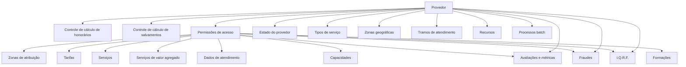

# Catálogo de Tipos e Configurações de Provedores, I.Q.R.F. e Fraudes

## 1. Metadados do Documento
- **Arquivo de Origem:** `Não identificado`
- **Tipo de Documento:** Especificação Técnica
- **Domínio / Sistema:** Gestão de Provedores, Fraudes, I.Q.R.F., Avaliações e Recursos
- **Público-Alvo:** Desenvolvedores, Arquitetos, Operação e Negócio
- **Data/Versão Identificada:** Não identificada

---

## 2. Resumo Executivo & Contexto de Negócio

O documento define catálogos de valores configuráveis para entidades de provedores, incluindo controles de cálculo de honorários e salvamentos, permissões de acesso, estados cadastrais, tipos de serviço, zonas geográficas, períodos de atendimento e recursos disponíveis.

O catálogo também formaliza configurações para o módulo I.Q.R.F., sigla usada para **Incidencias, Quejas, Reclamaciones y Felicitaciones**. As configurações abrangem tipo de incidente, impacto, estado, procedência, motivo, identificador e formas de abertura de data e hora.

No contexto de fraude, o documento apresenta tipos de defraudadores, tipos de fraude dinâmica e processos batch relacionados a fraudes de provedores. Também define métricas empregadas na avaliação de desempenho dos provedores.

A principal finalidade do material é padronizar códigos e descrições em espanhol para uso na configuração e operação de funcionalidades relacionadas a provedores. O conteúdo não apresenta contratos de integração, APIs, bancos de dados, URLs, tecnologias de infraestrutura, métodos HTTP ou detalhes de implementação.

---

## 3. Arquitetura, Componentes & Tecnologias Envolvidas

O documento descreve configurações funcionais e catálogos de domínio, sem detalhar arquitetura de software, componentes técnicos, bancos de dados, serviços, integrações, ambientes ou tecnologias.

Os componentes funcionais explicitamente citados são:

- Provedores.
- Honorários.
- Salvamentos.
- Zonas de atribuição.
- Tarifas.
- Serviços.
- Serviços de valor agregado.
- Dados de atendimento.
- Capacidades.
- I.Q.R.F.
- Fraudes.
- Avaliações.
- Formações.
- Recursos.
- Métricas de desempenho.
- Processos batch de provedores.



> **Nota de Análise:** O documento não detalha microsserviços, APIs, interfaces, mecanismos de persistência, autenticação, protocolos de integração ou topologia de implantação.

---

## 4. Regras de Negócio, Especificações Funcionais & Processos

### 4.1 Controle padrão de cálculo de honorários

Nos provedores, o método de controle padrão determina como deve ser considerado o controle de fraude do valor dos honorários.

Valores configurados:

- `2` — Lógica de Negócio.
- `3` — Sem Valor.

### 4.2 Controle padrão de cálculo de salvamentos

Nos provedores, o método de controle padrão determina como deve ser considerado o controle de fraude do valor dos salvamentos.

Valores configurados:

- `1` — Soma de Conceitos de Indenização.
- `2` — Lógica de Negócio.
- `3` — Sem Valor.

### 4.3 Regras de permissões de acesso

Os acessos dos provedores às seguintes áreas são configurados pelos mesmos valores:

- Zonas de atribuição.
- Tarifas.
- Serviços.
- Serviços de valor agregado.
- Dados de atendimento.
- Capacidades.
- I.Q.R.F.
- Fraudes.
- Avaliações.
- Formações.

Valores de acesso:

- `N` — Não acessível.
- `C` — Somente consulta.
- `S` — Atualização e consulta.

### 4.4 Estados dos provedores

O estado do provedor representa a situação do provedor sob a perspectiva de sua relação com a entidade seguradora.

Valores de estado:

- `AC` — Ativo.
- `SA` — Suspenso para atribuição.
- `BA` — Baixa.

Regra explícita de reabilitação ou reativação:

- Para reabilitar um provedor previamente baixado (`BA`) ou reativar um provedor previamente suspenso para atribuição (`SA`), o provedor deve receber novamente o estado `AC`.
- Habitualmente, a mudança para `AC` deve indicar uma causa específica que identifique uma dessas situações.

### 4.5 Tipos de serviço dos provedores

- `1` — Serviço normal.
- `2` — Serviço de valor agregado.

### 4.6 Tipos de zona geográfica

- `1` — Zona de tarifa.
- `2` — Zona de atribuição.
- `3` — Ambas.

### 4.7 Tipos de tramo de atendimento

O catálogo define tipos de atendimento por dia completo, manhã de segunda-feira e tramos numerados por dia.

Dias completos:

- `L` — Segunda-feira.
- `M` — Terça-feira.
- `X` — Quarta-feira.
- `J` — Quinta-feira.
- `V` — Sexta-feira.
- `S` — Sábado.
- `D` — Domingo.

Tramos específicos:

- `L1` — Segunda-feira, manhã.
- `L-A`, `L-B`, `L-C` — Tramo 1, 2 e 3 de segunda-feira.
- `M-A`, `M-B`, `M-C` — Tramo 1, 2 e 3 de terça-feira.
- `X-A`, `X-B`, `X-C` — Tramo 1, 2 e 3 de quarta-feira.
- `J-A`, `J-B`, `J-C` — Tramo 1, 2 e 3 de quinta-feira.
- `V-A`, `V-B`, `V-C` — Tramo 1, 2 e 3 de sexta-feira.
- `S-A`, `S-B`, `S-C` — Tramo 1, 2 e 3 de sábado.
- `D-A`, `D-B`, `D-C` — Tramo 1, 2 e 3 de domingo.

> **Nota de Análise:** O documento identifica os tramos por código, mas não define horários de início, término ou duração para os tramos 1, 2 e 3.

### 4.8 Tipos de recursos dos provedores

- `A` — Ambulâncias.
- `G` — Guinchos.
- `T` — Vagas de oficina.
- `P` — Profissionais.

### 4.9 Métricas de avaliação de desempenho de provedores

- `C` — Check.
- `I` — Valor.
- `P` — Porcentagem.
- `D` — Dias.
- `H` — Horas.

### 4.10 Tipos de defraudador

- `INY` — Segurado.
- `THP` — Terceiro.
- `SPL` — Provedor.
- `DRV` — Condutor.

### 4.11 Tipos de fraude dinâmica

- `1` — Sequencial.
- `2` — Função dinâmica.

### 4.12 Configurações do módulo I.Q.R.F.

Tipos de incidente:

- `I` — Incidência.
- `Q` — Queixa.
- `R` — Reclamação.
- `F` — Felicitação.

Impacto:

- `A` — Alto.
- `M` — Médio.
- `B` — Baixo.

Estado:

- `P` — Pendente de resolução.
- `T` — Terminada.

Procedência:

- `P` — Procedente.
- `I` — Improcedente.

Motivo:

- `A` — Abertura.
- `C` — Fechamento.
- `R` — Reabertura.

Identificador:

- `1` — Sequencial.
- `2` — Função dinâmica.

Abertura da data de abertura:

- `1` — Função dinâmica.
- `2` — Sistema.
- `3` — Nenhum.

Abertura da hora de abertura:

- `1` — Função dinâmica.
- `2` — Sistema.
- `3` — Nenhum.

### 4.13 Processos batch de provedores

- `110` — Criar fraude de provedor.
- `111` — Modificar fraude de provedor.
- `115` — Criar I.Q.R.F. de provedor.
- `116` — Modificar I.Q.R.F. de provedor.
- `117` — Atualizar número de recursos atribuídos.
- `118` — Modificar avaliação/métricas de provedor.

---

## 5. Tabelas de Parâmetros, Ambientes e Estruturas de Dados

| Item / Parâmetro | Descrição / Função | Tipo / Valores / Formato | Ambiente / Observações |
| :--- | :--- | :--- | :--- |
| Método de controle de honorários | Controla a forma de consideração de fraude no valor dos honorários do provedor | `2`: Lógica de Negócio; `3`: Sem Valor | Aplicável a provedores |
| Método de controle de salvamentos | Controla a forma de consideração de fraude no valor dos salvamentos do provedor | `1`: Soma de Conceitos de Indenização; `2`: Lógica de Negócio; `3`: Sem Valor | Aplicável a provedores |
| Acesso a zonas de atribuição | Define acesso do provedor às zonas de atribuição | `N`: Não acessível; `C`: Somente consulta; `S`: Atualização e consulta | Aplicável a provedores |
| Acesso a tarifas | Define acesso do provedor às tarifas do sistema | `N`, `C`, `S` | Aplicável a provedores |
| Acesso a serviços | Define acesso do provedor aos serviços | `N`, `C`, `S` | Aplicável a provedores |
| Acesso a serviços de valor agregado | Define acesso do provedor aos serviços de valor agregado | `N`, `C`, `S` | Aplicável a provedores |
| Acesso a dados de atendimento | Define acesso do provedor aos dados de atendimento | `N`, `C`, `S` | Aplicável a provedores |
| Acesso a capacidades | Define acesso do provedor às capacidades | `N`, `C`, `S` | Aplicável a provedores |
| Acesso a I.Q.R.F. | Define acesso do provedor ao módulo I.Q.R.F. | `N`, `C`, `S` | Aplicável a provedores |
| Acesso a fraudes | Define acesso do provedor a fraudes | `N`, `C`, `S` | Aplicável a provedores |
| Acesso a avaliações | Define acesso do provedor a avaliações | `N`, `C`, `S` | Aplicável a provedores |
| Acesso a formações | Define acesso do provedor a formações | `N`, `C`, `S` | Aplicável a provedores |
| Estado do provedor | Representa a situação do provedor perante a entidade seguradora | `AC`: Ativo; `SA`: Suspenso para atribuição; `BA`: Baixa | Reativação ou reabilitação exige estado `AC` |
| Tipo de serviço | Classifica o serviço provido | `1`: Serviço normal; `2`: Serviço de valor agregado | Aplicável a provedores |
| Tipo de zona geográfica | Classifica zonas utilizadas pelos provedores | `1`: Zona de tarifa; `2`: Zona de atribuição; `3`: Ambas | Aplicável a provedores |
| Tipo de recurso | Classifica recursos empregados | `A`: Ambulâncias; `G`: Guinchos; `T`: Vagas de oficina; `P`: Profissionais | Aplicável a provedores |
| Métrica de desempenho | Define tipo de métrica para avaliação de desempenho | `C`: Check; `I`: Valor; `P`: Porcentagem; `D`: Dias; `H`: Horas | Aplicável a avaliações |
| Tipo de defraudador | Classifica a parte associada à fraude | `INY`: Segurado; `THP`: Terceiro; `SPL`: Provedor; `DRV`: Condutor | Aplicável a fraudes |
| Tipo de fraude dinâmica | Define modalidade de fraude dinâmica | `1`: Sequencial; `2`: Função dinâmica | Aplicável a fraudes |
| Tipo de incidente I.Q.R.F. | Classifica incidente do módulo I.Q.R.F. | `I`: Incidência; `Q`: Queixa; `R`: Reclamação; `F`: Felicitação | Aplicável a I.Q.R.F. |
| Impacto I.Q.R.F. | Define impacto do incidente I.Q.R.F. | `A`: Alto; `M`: Médio; `B`: Baixo | Aplicável a I.Q.R.F. |
| Estado I.Q.R.F. | Define situação do incidente I.Q.R.F. | `P`: Pendente de resolução; `T`: Terminada | Aplicável a I.Q.R.F. |
| Procedência I.Q.R.F. | Define se a I.Q.R.F. é procedente | `P`: Procedente; `I`: Improcedente | Aplicável a I.Q.R.F. |
| Motivo I.Q.R.F. | Define o motivo da I.Q.R.F. | `A`: Abertura; `C`: Fechamento; `R`: Reabertura | Aplicável a I.Q.R.F. |
| Identificador I.Q.R.F. | Define tipo de identificador | `1`: Sequencial; `2`: Função dinâmica | Aplicável a I.Q.R.F. |
| Abertura da data I.Q.R.F. | Define a origem da data de abertura | `1`: Função dinâmica; `2`: Sistema; `3`: Nenhum | Aplicável a I.Q.R.F. |
| Abertura da hora I.Q.R.F. | Define a origem da hora de abertura | `1`: Função dinâmica; `2`: Sistema; `3`: Nenhum | Aplicável a I.Q.R.F. |
| Batch 110 | Criar fraude de provedor | `110` | Processo batch de provedores |
| Batch 111 | Modificar fraude de provedor | `111` | Processo batch de provedores |
| Batch 115 | Criar I.Q.R.F. de provedor | `115` | Processo batch de provedores |
| Batch 116 | Modificar I.Q.R.F. de provedor | `116` | Processo batch de provedores |
| Batch 117 | Atualizar número de recursos atribuídos | `117` | Processo batch de provedores |
| Batch 118 | Modificar avaliação/métricas de provedor | `118` | Processo batch de provedores |

---

## 6. Bateria de Perguntas & Respostas para RAG (FAQ Sintético)

### P1: Quais são os valores possíveis para o método de controle padrão do valor dos honorários de um provedor?
**R:** O método de controle padrão do valor dos honorários aceita `2` para **Lógica de Negócio** e `3` para **Sem Valor**. O documento informa que esse método determina como o controle de fraude deve considerar o valor dos honorários nos provedores.

### P2: Como o sistema deve reativar um provedor suspenso para atribuição ou reabilitar um provedor baixado?
**R:** Um provedor que estava em estado `SA` — Suspenso para Atribuição — ou `BA` — Baixa — deve receber novamente o estado `AC` — Ativo. O documento indica que habitualmente deve ser informada uma causa específica que identifique a situação de reativação ou reabilitação.

### P3: Qual é a diferença entre os códigos de acesso `N`, `C` e `S` para provedores?
**R:** O código `N` significa **Não acessível**, o código `C` significa **Somente consulta** e o código `S` significa **Atualização e consulta**. Esses valores são usados para controlar acessos a zonas de atribuição, tarifas, serviços, serviços de valor agregado, dados de atendimento, capacidades, I.Q.R.F., fraudes, avaliações e formações.

### P4: Quais tipos de serviço podem ser fornecidos por um provedor?
**R:** O catálogo define `1` para **Serviço normal** e `2` para **Serviço de valor agregado**.

### P5: Quais recursos podem ser registrados para um provedor?
**R:** Os tipos de recursos são `A` para **Ambulâncias**, `G` para **Guinchos**, `T` para **Vagas de oficina** e `P` para **Profissionais**.

### P6: Quais são os tipos de defraudador disponíveis no catálogo?
**R:** Os tipos de defraudador são `INY` para **Segurado**, `THP` para **Terceiro**, `SPL` para **Provedor** e `DRV` para **Condutor**.

### P7: Quais são os estados possíveis de uma I.Q.R.F.?
**R:** Uma I.Q.R.F. pode estar em estado `P`, correspondente a **Pendente de resolução**, ou em estado `T`, correspondente a **Terminada**.

### P8: Como são classificados os incidentes I.Q.R.F.?
**R:** Os incidentes I.Q.R.F. são classificados como `I` para **Incidência**, `Q` para **Queixa**, `R` para **Reclamação** e `F` para **Felicitação**.

### P9: Quais opções existem para a data e a hora de abertura de uma I.Q.R.F.?
**R:** Tanto a data quanto a hora de abertura podem ser definidas por `1` — **Função dinâmica**, `2` — **Sistema** ou `3` — **Nenhum**.

### P10: Que tipos de métricas podem ser usados na avaliação de desempenho de provedores?
**R:** O catálogo disponibiliza `C` para **Check**, `I` para **Valor**, `P` para **Porcentagem**, `D` para **Dias** e `H` para **Horas**.

### P11: Qual processo batch cria uma fraude de provedor e qual processo a modifica?
**R:** O processo batch `110` é usado para **Criar fraude de provedor**. O processo batch `111` é usado para **Modificar fraude de provedor**.

### P12: Quais códigos representam os tramos de atendimento de quinta-feira?
**R:** Para quinta-feira, o catálogo apresenta `J` para **Quinta-feira**, `J-A` para **Quinta-feira Tramo 1**, `J-B` para **Quinta-feira Tramo 2** e `J-C` para **Quinta-feira Tramo 3**.

---

## 7. Glossário de Termos, Siglas & Conceitos-Chave

- **I.Q.R.F.:** Incidencias, Quejas, Reclamaciones y Felicitaciones.
- **Provedor:** Entidade para a qual o documento define controles, acessos, estados, serviços, recursos, avaliações, fraudes e processos batch.
- **Honorários:** Valor cujo controle de fraude pode ser determinado por lógica de negócio ou sem valor.
- **Salvamentos:** Valor cujo controle de fraude pode ser determinado pela soma de conceitos de indenização, lógica de negócio ou sem valor.
- **Zona de Tarifa:** Tipo de zona geográfica identificado pelo código `1`.
- **Zona de Atribuição:** Tipo de zona geográfica identificado pelo código `2`.
- **Tramo de Atendimento:** Tipo de atendimento associado a um dia ou a um tramo específico de um dia.
- **Fraude Dinâmica:** Tipo de fraude configurável como sequencial ou função dinâmica.
- **Batch:** Processo batch habilitado para funcionalidades de provedores.
- **AC:** Estado de provedor ativo.
- **SA:** Estado de provedor suspenso para atribuição.
- **BA:** Estado de baixa do provedor.
- **THP:** Tipo de defraudador correspondente a terceiro.
- **SPL:** Tipo de defraudador correspondente a provedor.
- **DRV:** Tipo de defraudador correspondente a condutor.
- **INY:** Tipo de defraudador correspondente a segurado.

---

## 8. Notas Críticas, Riscos & Limitações

- O documento não identifica nome do arquivo, versão, data, autor, sistema corporativo proprietário ou organização responsável.
- O documento apresenta catálogos de códigos e descrições, mas não especifica estruturas de dados, nomes de tabelas, campos de banco, APIs, contratos JSON, eventos, integrações ou métodos HTTP.
- Não há definição dos horários associados aos tramos `A`, `B` e `C`; somente os códigos dos tramos são listados.
- Não há detalhamento da lógica interna para os valores **Lógica de Negócio** ou **Função dinâmica**.
- Não são descritos os gatilhos, periodicidade, entradas, saídas, monitoramento ou tratamento de erros dos processos batch `110`, `111`, `115`, `116`, `117` e `118`.
- Os códigos `P`, `I`, `A`, `C` e `R` possuem significados diferentes dependendo do catálogo funcional em que são usados; consultas e implementações devem sempre considerar o contexto do parâmetro.
- O documento não especifica regras de transição para estados de I.Q.R.F., apenas os valores possíveis de estado, motivo e procedência.

---

## 9. Conteúdo Bruto Estruturado (Referência Fiel)

```text
--- [PÁGINA 1 DE 13] ---

TIPOS (PROVEEDORES)
MÉTODO de CONTROL por DEFECTO para realizar el cálculo
del importe de los Honorarios
En los Proveedores, determina la manera que se debe considerar para controlar el fraude del importe
de los Honorarios.
En idioma español la relación de posibles valores configurada es:
TIPO DESCRIPCIÓN
2 Lógica de Negocio
3 Sin Importe
MÉTODO de CONTROL por DEFECTO para realizar el cálculo
del importe de los Salvamentos
En los Proveedores, determina la manera que se debe considerar para controlar el fraude del importe
de los Salvamentos.
En idioma español la relación de posibles valores configurada es:
TIPO DESCRIPCIÓN
1 Suma Conceptos Indemnización
2 Lógica de Negocio
3 Sin Importe
 / 
 CF
Home Solutions APIs Documentation Zeus
EN


--- [PÁGINA 2 DE 13] ---

TIPO de ACCESO a ZONAS de ASIGNACIÓN
Determina los posibles Accesos del Proveedor a las Zonas de Asignación.
En idioma español la relación de posibles valores es:
TIPO DESCRIPCIÓN
N NO ACCESIBLE
C SOLO CONSULTA
S ACTUALIZACIÓN Y CONSULTA
TIPO de ACCESO a TARIFAS
Determina los posibles Accesos del Proveedor a las Tarifas del Sistema.
En idioma español la relación de posibles valores es:
TIPO DESCRIPCIÓN
N NO ACCESIBLE
C SOLO CONSULTA
S ACTUALIZACIÓN Y CONSULTA
TIPO de ACCESO a SERVICIOS
Determina los posibles Accesos del Proveedor a los Servicios.
En idioma español la relación de posibles valores es:
TIPO DESCRIPCIÓN
N NO ACCESIBLE
C SOLO CONSULTA


--- [PÁGINA 3 DE 13] ---

TIPO DESCRIPCIÓN
S ACTUALIZACIÓN Y CONSULTA
TIPO de ACCESO a SERVICIOS de VALOR AÑADIDO
Determina los posibles Accesos del Proveedor a los Servicios de Valor Añadido.
En idioma español la relación de posibles valores es:
TIPO DESCRIPCIÓN
N NO ACCESIBLE
C SOLO CONSULTA
S ACTUALIZACIÓN Y CONSULTA
TIPO de ACCESO a DATOS de ATENCIÓN
Determina los posibles Accesos del Proveedor a los Datos de Atención.
En idioma español la relación de posibles valores es:
TIPO DESCRIPCIÓN
N NO ACCESIBLE
C SOLO CONSULTA
S ACTUALIZACIÓN Y CONSULTA
TIPO de ACCESO a CAPACIDADES
Determina los posibles Accesos del Proveedor a las Capacidades.
En idioma español la relación de posibles valores es:


--- [PÁGINA 4 DE 13] ---

TIPO DESCRIPCIÓN
N NO ACCESIBLE
C SOLO CONSULTA
S ACTUALIZACIÓN Y CONSULTA
TIPO de ACCESO a I.Q.R.F's
Determina los posibles Accesos del Proveedor a las I.Q.R.F. (Incidencias, Quejas, Reclamaciones y
Felicitaciones).
En idioma español la relación de posibles valores es:
TIPO DESCRIPCIÓN
N NO ACCESIBLE
C SOLO CONSULTA
S ACTUALIZACIÓN Y CONSULTA
TIPO de ACCESO a FRAUDES
Determina los posibles Accesos del Proveedor a los Fraudes.
En idioma español la relación de posibles valores es:
TIPO DESCRIPCIÓN
N NO ACCESIBLE
C SOLO CONSULTA
S ACTUALIZACIÓN Y CONSULTA
TIPO de ACCESO a EVALUACIONES


--- [PÁGINA 5 DE 13] ---

Determina los posibles Accesos del Proveedor a las Evaluaciones.
En idioma español la relación de posibles valores es:
TIPO DESCRIPCIÓN
N NO ACCESIBLE
C SOLO CONSULTA
S ACTUALIZACIÓN Y CONSULTA
TIPO de ACCESO a FORMACIONES
Determina los posibles Accesos del Proveedor a las Formaciones.
En idioma español la relación de posibles valores es:
TIPO DESCRIPCIÓN
N NO ACCESIBLE
C SOLO CONSULTA
S ACTUALIZACIÓN Y CONSULTA
TIPO de ESTADO de los PROVEEDORES
Determina los posibles Estados en los que se pueden encontrar los Proveedores (desde la
perspectiva y relación con la entidad aseguradora).
En idioma español la relación de posibles valores es:
TIPO DESCRIPCIÓN
AC ACTIVO
SA SUSPENDIDO ASIGNACIÓN
BA BAJA


--- [PÁGINA 6 DE 13] ---

NOTA: Para Rehabilitar o Reactivar un Proveedor que haya sido previamente dado de Baja o
Suspendido de Asignación respectivamente, se le debe asignar nuevamente un estado 'AC'
(habitualmente indicando una causa específica que identifique una de estas situaciones).
TIPO de SERVICIO de los PROVEEDORES
Determina los posibles Tipos de Servicios Provistos por el Proveedor.
En idioma español la relación de posibles valores es:
TIPO DESCRIPCIÓN
1 SERVICIO NORMAL
2 SERVICIO DE VALOR AÑADIDO
TIPO de ZONA GEOGRÁFICA
Determina los posibles Tipos de Zonas Geográficas utilizadas por los Proveedores.
En idioma español la relación de posibles valores es:
TIPO DESCRIPCIÓN
1 ZONA DE TARIFA
2 ZONA DE ASIGNACIÓN
3 AMBAS
TIPO de TRAMO de ATENCIÓN
Determina los posibles Tipos de Atención utilizadas por los Proveedores.
En idioma español la relación de posibles valores es:
TIPO DESCRIPCIÓN
L LUNES


--- [PÁGINA 7 DE 13] ---

TIPO DESCRIPCIÓN
M MARTES
X MIÉRCOLES
J JUEVES
V VIERNES
S SÁBADO
D DOMINGO
L1 LUNES-MAÑANA
L-A Lunes Tramo1
L-B Lunes Tramo2
L-C Lunes Tramo3
M-A Martes Tramo1
M-B Martes Tramo2
M-C Martes Tramo3
X-A Miércoles Tramo1
X-B Miércoles Tramo2
X-C Miércoles Tramo3
J-A Jueves Tramo1
J-B Jueves Tramo2


--- [PÁGINA 8 DE 13] ---

TIPO DESCRIPCIÓN
J-C Jueves Tramo3
V-A Viernes Tramo1
V-B Viernes Tramo2
V-C Viernes Tramo3
S-A Sábado Tramo1
S-B Sábado Tramo2
S-C Sábado Tramo3
D-A Domingo Tramo1
D-B Domingo Tramo2
D-C Domingo Tramo3
TIPO de RECURSO de los PROVEEDORES
Determina los posibles Tipos de Recursos empleados por los Proveedores.
En idioma español la relación de posibles valores es:
TIPO DESCRIPCIÓN
A AMBULANCIAS
G GRÚAS
T PLAZAS TALLER
P PROFESIONALES


--- [PÁGINA 9 DE 13] ---

TIPO de MÉTRICA para EVALUACIONES del DESEMPEÑO de
los PROVEEDORES
Determina los posibles Tipos de Métricas existentes en la configuración de los parámetros de
Evaluación del Desempeño de los Proveedores.
En idioma español la relación de posibles valores es:
TIPO DESCRIPCIÓN
C CHECK
I IMPORTE
P PORCENTAJE
D DIAS
H HORAS
TIPO de DEFRAUDADOR
Determina los posibles Tipos de Defraudadores.
En idioma español la relación de posibles valores es:
TIPO DESCRIPCIÓN
INY ASEGURADO
THP TERCERO
SPL PROVEEDOR
DRV CONDUCTOR
TIPO de FRAUDE DINÁMICO
Determina los posibles Tipos de Fraude Dinámico.
En idioma español la relación de posibles valores es:


--- [PÁGINA 10 DE 13] ---

TIPO DESCRIPCIÓN
1 SECUENCIAL
2 FUNCIÓN DINÁMICA
TIPO de INCIDENTE I.Q.R.F's
Determina los posibles Tipos de Incidentes del Módulo I.Q.R.F.
En idioma español la relación de posibles valores es:
TIPO DESCRIPCIÓN
I INCIDENCIA
Q QUEJA
R RECLAMACIÓN
F FELICITACIÓN
TIPO de IMPACTO de las I.Q.R.F's
Determina los posibles Tipos de Impacto de las I.Q.R.F's.
En idioma español la relación de posibles valores es:
TIPO DESCRIPCIÓN
A ALTO
M MEDIO
B BAJO
TIPO de ESTADO de las I.Q.R.F's
Determina los posibles Estados de las I.Q.R.F's.


--- [PÁGINA 11 DE 13] ---

En idioma español la relación de posibles valores es:
TIPO DESCRIPCIÓN
P PENDIENTE DE RESOLUCIÓN
T TERMINADA
TIPO de PROCEDENCIA
Determina la procedencia o no de las I.Q.R.F's.
En idioma español la relación de posibles valores es:
TIPO DESCRIPCIÓN
P PROCEDENTE
I IMPROCEDENTE
TIPO de MOTIVO de las I.Q.R.F's
Determina los posibles Motivos por los que se realizan las I.Q.R.F's.
En idioma español la relación de posibles valores es:
TIPO DESCRIPCIÓN
A APERTURA
C CIERRE
R REAPERTURA
TIPO de IDENTIFICADOR
Determina los posibles Tipos de Identificadores de las I.Q.R.F's.
En idioma español la relación de posibles valores es:


--- [PÁGINA 12 DE 13] ---

TIPO DESCRIPCIÓN
1 SECUENCIAL
2 FUNCIÓN DINÁMICA
TIPO de APERTURA de la FECHA de APERTURA en las I.Q.R.F's
Determina los posibles Tipos de Apertura en la Fecha de Apertura de las I.Q.R.F's.
En idioma español la relación de posibles valores es:
TIPO DESCRIPCIÓN
1 FUNCIÓN DINÁMICA
2 SISTEMA
3 NINGUNO
TIPO de APERTURA de la HORA de APERTURA en las I.Q.R.F's
Determina los posibles Tipos de Apertura en la Hora de Apertura de las I.Q.R.F's.
En idioma español la relación de posibles valores es:
TIPO DESCRIPCIÓN
1 FUNCIÓN DINÁMICA
2 SISTEMA
3 NINGUNO
TIPO de PROCESO BATCH de PROVEEDORES
Determina los posibles Procesos Batch habilitados para los Proveedores.
En idioma español la relación de posibles valores es:


--- [PÁGINA 13 DE 13] ---

TIPO DESCRIPCIÓN
110 Crear fraude proveedor
111 Modificar fraude proveedor
115 Crear IQRF proveedor
116 Modificar IQRF proveedor
117 Actualizar numero recursos asignados
118 Modificar evaluación/métricas proveedor
```
