# Catálogo de Tipos para Terceiros, Contatos, Cobro/Pago e Gestão de Sinistros

## 1. Metadados do Documento
- **Arquivo de Origem:** Não identificado no conteúdo fornecido
- **Tipo de Documento:** Especificação Funcional / Catálogo de Domínio
- **Domínio / Sistema:** Terceiros, seguros, meios de contato, cobro/pago, sinistros e permissões de condução
- **Público-Alvo:** Desenvolvedores, Arquitetos, Analistas Funcionais, Operação e Negócio
- **Data/Versão Identificada:** Não identificada

---

## 2. Resumo Executivo & Contexto de Negócio

O documento apresenta catálogos de tipos utilizados para classificar informações de terceiros — pessoas físicas ou jurídicas — no contexto de uma entidade seguradora. Os catálogos abrangem meios e usos de contato, estado civil, relações entre terceiros, representação legal, atividade econômica, emprego, empresa, cargos e nacionalidade.

O conteúdo também define classificações relacionadas à participação de terceiros em apólices, incluindo tomador, segurado, condutor, proprietário, beneficiário, pagador, subagente e outras intervenções específicas. Essas classificações permitem representar os diferentes papéis que um terceiro pode exercer em uma apólice de seguro.

Para operações financeiras, o documento estabelece tipos de meios de cobro/pago, movimentos de cobro ou pago, usos configuráveis, formas de validação e formas de enmascaramento de dados. Os meios abrangem conta bancária, cartão bancário, pagamento móvel/celular, monedero virtual, moeda virtual e pagamento on-line.

O catálogo inclui ainda classificações operacionais para supervisores, tramitadores de sinistros, terceiros não desejados, IVA, rating de resseguradoras e zonas geográficas de permissões de condução. O documento explicita que os tipos de uso de meios de cobro/pago podem ser configurados conforme a operação local da entidade MAPFRE.

Não há detalhamento de arquitetura de software, APIs, contratos HTTP, persistência, versões, URLs, ambientes, rotas de log ou regras de integração. O conteúdo é predominantemente um dicionário funcional de códigos e descrições.

---

## 3. Arquitetura, Componentes & Tecnologias Envolvidas

O documento não descreve componentes técnicos, microsserviços, infraestrutura, tecnologias, bancos de dados, APIs ou ambientes. A estrutura inferível é uma taxonomia funcional de catálogos que suporta o cadastro e a operação de terceiros no domínio segurador.

```mermaid
graph TD
  T["Terceiros<br/>Pessoas Físicas ou Jurídicas"]
  T --> C["Dados de Contato"]
  T --> P["Participação em Apólices"]
  T --> L["Dados Legais e Pessoais"]
  T --> E["Dados Econômicos e Profissionais"]
  T --> F["Meios de Cobro/Pago"]
  T --> O["Classificações Operacionais"]

  C --> MC["Tipos de Meios de Contato"]
  C --> UC["Usos de Meios de Contato"]

  P --> IC["Intervenções de Cliente"]

  L --> EC["Estados Civis"]
  L --> RL["Representação Legal"]
  L --> N["Nacionalidade"]
  L --> GR["Grupos em Terceiros Relacionados"]

  E --> AE["Atividade Econômica"]
  E --> EM["Tipo de Emprego"]
  E --> TE["Tipo de Empresa"]
  E --> CP["Cargos/Puestos"]

  F --> MFP["Meios de Cobro/Pago"]
  F --> MOV["Movimentos: Cobro ou Pago"]
  F --> UFP["Usos de Cobro/Pago"]
  F --> VAL["Validação"]
  F --> ENM["Enmascaramento"]

  O --> SUP["Estados de Supervisores/Tramitadores"]
  O --> TND["Estados de Terceiros Não Desejados"]
  O --> IVA["Tipo de IVA"]
  O --> RAT["Rating de Resseguradoras"]
  O --> TRA["Tipos de Tramitadores"]
  O --> ZG["Zonas Geográficas de Permissões"]
```



> **Nota de Análise:** O diagrama representa relações funcionais entre os catálogos citados. O documento não especifica relacionamento técnico, fluxo de integração, modelo de dados físico ou cardinalidades.

---

## 4. Regras de Negócio, Especificações Funcionais & Processos

### 4.1 Terceiros e meios de contato
- Os tipos de meios de contato determinam os possíveis canais de contato entre pessoas físicas ou jurídicas e a entidade seguradora.
- Os usos de meios de contato qualificam o propósito de cada meio de contato, como pessoal, trabalho, principal, familiar ou comercial.
- O documento lista onze tipos de meios de contato, incluindo correio eletrônico, telefone, móvel/SMS, correio postal, página web, WhatsApp, Messenger e notificações por aplicativo.

### 4.2 Dados pessoais, legais e relacionais
- O estado civil determina o estado civil dos terceiros no sistema.
- Os grupos de terceiros relacionados determinam tipos de relações entre terceiros.
- A representação legal determina a classe de representação atribuída à pessoa que atua em nome de outra pessoa, natural ou jurídica.
- O representante legal pode ser nomeado por documento formal, como estatutos empresariais, ou por disposição legal.
- O apoderado é nomeado pelo poderdante mediante poder específico, que pode ser escritura pública ou documento privado.
- A nacionalidade classifica o terceiro como nacional, comunitário ou não comunitário nos exemplos apresentados.

### 4.3 Dados econômicos e profissionais
- A atividade econômica determina a atividade econômica do terceiro.
- O tipo de emprego diferencia se o terceiro é assalariado ou autônomo.
- O tipo de empresa identifica a natureza da organização na qual o terceiro trabalha ou exerce atividade.
- Os cargos/postos representam obrigações, funções ou tarefas que o terceiro pode desempenhar em posição atribuída no organograma da empresa.

### 4.4 Intervenções de cliente em apólices
- As intervenções de cliente representam as formas pelas quais um terceiro pode intervir em uma apólice.
- Os papéis incluem tomador, tomadores alternos, segurados, condutores, proprietários, beneficiários, proponente, endossatário, preventor, tutor legal, subagentes, pagador e tipos específicos de beneficiários.
- O documento lista os códigos de intervenção `0` a `14`, com lacunas, e os códigos `20` a `24`.

### 4.5 Meios de cobro/pago
- Os meios de cobro/pago determinam os meios pelos quais pessoas físicas ou jurídicas realizam operações financeiras com a entidade seguradora.
- Um meio de cobro/pago pode ser utilizado para operação de **cobro** ou **pago**.
- Os valores introduzidos em meios de cobro/pago podem ser validados segundo o tipo de meio associado.
- Os valores introduzidos em meios de cobro/pago podem ser enmascarados segundo o tipo de meio associado.
- Os usos de meios de cobro/pago podem ser configurados de acordo com a operação local da entidade MAPFRE.
- O único tipo de uso explicitamente listado para meios de cobro/pago é `1 — CUALQUIERA`.

### 4.6 Gestão de sinistros e controles operacionais
- Os supervisores/tramitadores de sinistros podem estar ativos, de baixa, de baixa definitiva, suspensos ou suspensos de atribuição.
- Um terceiro não desejado pode estar em controle atribuído, liberado permanentemente ou liberado temporariamente.
- A tipologia de tramitadores de sinistros inclui tramitador, recepcionista, centro telefônico/cabine, tramitador advogado e colaborador.
- O rating de terceiros resseguradoras pode representar classificação creditícia de emissor de longo prazo, classificação creditícia de emissor de curto prazo ou fortaleza financeira.
- As permissões de condução de segurados possuem âmbito geográfico nacional ou comunitário/União Europeia nos exemplos apresentados.

---

## 5. Tabelas de Parâmetros, Ambientes e Estruturas de Dados

### 5.1 Tipos de meios de contato

| Item / Parâmetro | Descrição / Função | Tipo / Valores / Formato | Ambiente / Observações |
| :--- | :--- | :--- | :--- |
| Tipo de medio de contacto | Canal de contato de pessoas físicas ou jurídicas com a entidade seguradora | `1` — Correo Electrónico | Relação em idioma espanhol |
| Tipo de medio de contacto | Canal de contato | `2` — Teléfono | Relação em idioma espanhol |
| Tipo de medio de contacto | Canal de contato | `3` — Móvil - SMS | Relação em idioma espanhol |
| Tipo de medio de contacto | Canal de contato | `4` — Correo Postal | Relação em idioma espanhol |
| Tipo de medio de contacto | Canal de contato | `5` — Fax | Relação em idioma espanhol |
| Tipo de medio de contacto | Canal de contato | `6` — Página Web | Relação em idioma espanhol |
| Tipo de medio de contacto | Canal de contato | `7` — Otros | Relação em idioma espanhol |
| Tipo de medio de contacto | Canal de contato | `8` — WhatsApp | Relação em idioma espanhol |
| Tipo de medio de contacto | Canal de contato | `9` — Messenger | Relação em idioma espanhol |
| Tipo de medio de contacto | Canal de contato | `10` — Notificaciones - App | Relação em idioma espanhol |
| Tipo de medio de contacto | Canal de contato | `11` — Busca | Relação em idioma espanhol |

### 5.2 Estados civis, grupos e representação legal

| Item / Parâmetro | Descrição / Função | Tipo / Valores / Formato | Ambiente / Observações |
| :--- | :--- | :--- | :--- |
| Estado civil | Estado civil do terceiro no sistema | `S` — Soltero/a | Relação em idioma espanhol |
| Estado civil | Estado civil do terceiro no sistema | `C` — Casado/a | Relação em idioma espanhol |
| Estado civil | Estado civil do terceiro no sistema | `V` — Viudo/a | Relação em idioma espanhol |
| Estado civil | Estado civil do terceiro no sistema | `D` — Divorciado/a | Relação em idioma espanhol |
| Estado civil | Estado civil do terceiro no sistema | `P` — Separado/a | Relação em idioma espanhol |
| Estado civil | Estado civil do terceiro no sistema | `L` — Ley Común | Relação em idioma espanhol |
| Estado civil | Estado civil do terceiro no sistema | `U` — Union Civil | Relação em idioma espanhol |
| Grupo em terceiros relacionados | Tipo de relação entre terceiros | `F` — Familia | Relação em idioma espanhol |
| Grupo em terceiros relacionados | Tipo de relação entre terceiros | `H` — Jerarquía | Relação em idioma espanhol |
| Representação legal | Classe de representação de quem atua em nome de outra pessoa | `1` — Representante | Pode ser nomeado por documento formal ou disposição legal |
| Representação legal | Classe de representação de quem atua em nome de outra pessoa | `2` — Apoderado | Nomeado por poder específico, escritura pública ou documento privado |

### 5.3 Enmascaramento, atividade econômica e intervenções em apólices

| Item / Parâmetro | Descrição / Função | Tipo / Valores / Formato | Ambiente / Observações |
| :--- | :--- | :--- | :--- |
| Enmascaramento de cobro/pago | Enmascara valores conforme o meio de cobro/pago associado | `1` — Enmascaramiento de Cuenta Bancaria | Relação em idioma espanhol |
| Enmascaramento de cobro/pago | Enmascara valores conforme o meio de cobro/pago associado | `2` — Enmascaramiento de número Telefónico | Relação em idioma espanhol |
| Enmascaramento de cobro/pago | Enmascara valores conforme o meio de cobro/pago associado | `3` — Enmascaramiento de Tarjeta Bancaria | Relação em idioma espanhol |
| Enmascaramento de cobro/pago | Enmascara valores conforme o meio de cobro/pago associado | `4` — Enmascaramiento de Correo Electrónico | Relação em idioma espanhol |
| Atividade econômica | Atividade econômica do terceiro | `1` — Caución | Relação em idioma espanhol |
| Atividade econômica | Atividade econômica do terceiro | `2` — Económica | Relação em idioma espanhol |
| Atividade econômica | Atividade econômica do terceiro | `3` — Comercial | Relação em idioma espanhol |
| Intervenção de cliente | Forma de intervenção de terceiro em apólice | `0` — Tomador | Relação em idioma espanhol |
| Intervenção de cliente | Forma de intervenção de terceiro em apólice | `1` — Tomadores Alternos | Relação em idioma espanhol |
| Intervenção de cliente | Forma de intervenção de terceiro em apólice | `2` — Asegurados | Relação em idioma espanhol |
| Intervenção de cliente | Forma de intervenção de terceiro em apólice | `3` — Conductores | Relação em idioma espanhol |
| Intervenção de cliente | Forma de intervenção de terceiro em apólice | `4` — Propietarios | Relação em idioma espanhol |
| Intervenção de cliente | Forma de intervenção de terceiro em apólice | `5` — Beneficiarios | Relação em idioma espanhol |
| Intervenção de cliente | Forma de intervenção de terceiro em apólice | `6` — Beneficiarios Vida | Relação em idioma espanhol |
| Intervenção de cliente | Forma de intervenção de terceiro em apólice | `7` — Proponente | Relação em idioma espanhol |
| Intervenção de cliente | Forma de intervenção de terceiro em apólice | `8` — Endosatario | Relação em idioma espanhol |
| Intervenção de cliente | Forma de intervenção de terceiro em apólice | `9` — Preventor | Relação em idioma espanhol |
| Intervenção de cliente | Forma de intervenção de terceiro em apólice | `11` — Benefs. Contingente Vida | Relação em idioma espanhol |
| Intervenção de cliente | Forma de intervenção de terceiro em apólice | `12` — Consorcio | Relação em idioma espanhol |
| Intervenção de cliente | Forma de intervenção de terceiro em apólice | `13` — ACE | Sem detalhamento da sigla |
| Intervenção de cliente | Forma de intervenção de terceiro em apólice | `14` — Tutor Legal | Relação em idioma espanhol |
| Intervenção de cliente | Forma de intervenção de terceiro em apólice | `20` — Subagentes | Relação em idioma espanhol |
| Intervenção de cliente | Forma de intervenção de terceiro em apólice | `21` — Pagador | Relação em idioma espanhol |
| Intervenção de cliente | Forma de intervenção de terceiro em apólice | `22` — Beneficiario Irrevocable | Relação em idioma espanhol |
| Intervenção de cliente | Forma de intervenção de terceiro em apólice | `23` — Beneficiario Cesion Derechos/Pignoracion | Relação em idioma espanhol |
| Intervenção de cliente | Forma de intervenção de terceiro em apólice | `24` — Beneficiarios Legales | Relação em idioma espanhol |

### 5.4 Dados profissionais, empresariais e operacionais

| Item / Parâmetro | Descrição / Função | Tipo / Valores / Formato | Ambiente / Observações |
| :--- | :--- | :--- | :--- |
| Cargo/posto | Função ou tarefa em posição do organograma | `1` — Director | Relação em idioma espanhol |
| Cargo/posto | Função ou tarefa em posição do organograma | `2` — Contable | Relação em idioma espanhol |
| Cargo/posto | Função ou tarefa em posição do organograma | `3` — Empleado | Relação em idioma espanhol |
| Cargo/posto | Função ou tarefa em posição do organograma | `4` — Propietario | Relação em idioma espanhol |
| Cargo/posto | Função ou tarefa em posição do organograma | `5` — Administrador | Relação em idioma espanhol |
| Cargo/posto | Função ou tarefa em posição do organograma | `6` — Encargado | Relação em idioma espanhol |
| Cargo/posto | Função ou tarefa em posição do organograma | `7` — Dignatario | Relação em idioma espanhol |
| Tipo de emprego | Distingue assalariado de autônomo | `CP` — Por Cuenta Ajena | Relação em idioma espanhol |
| Tipo de emprego | Distingue assalariado de autônomo | `CA` — Por Cuenta Propia | Relação em idioma espanhol |
| Tipo de empresa | Tipo de empresa onde o terceiro trabalha | `EI` — Empresario Individual | Relação em idioma espanhol |
| Tipo de empresa | Tipo de empresa onde o terceiro trabalha | `SL` — Sociedad Limitada (S.L) | Relação em idioma espanhol |
| Tipo de empresa | Tipo de empresa onde o terceiro trabalha | `SA` — Sociedad Anónima (S.A.) | Relação em idioma espanhol |
| Tipo de empresa | Tipo de empresa onde o terceiro trabalha | `ASL` — Asociaciones sin Ánimo de Lucro | Relação em idioma espanhol |
| Tipo de empresa | Tipo de empresa onde o terceiro trabalha | `COL` — Sociedad Colectiva | Relação em idioma espanhol |
| Tipo de empresa | Tipo de empresa onde o terceiro trabalha | `COM` — Sociedad Comanditaria | Relação em idioma espanhol |
| Tipo de empresa | Tipo de empresa onde o terceiro trabalha | `CBN` — Por Cuenta Ajena | Relação em idioma espanhol |
| Tipo de empresa | Tipo de empresa onde o terceiro trabalha | `SCP` — Sociedad Cooperativa | Relação em idioma espanhol |
| Tipo de empresa | Tipo de empresa onde o terceiro trabalha | `ONG` — Organización No Gubernamental | Relação em idioma espanhol |
| Estado de supervisor/tramitador | Estado no sistema de sinistros | `A` — Activo | Relação em idioma espanhol |
| Estado de supervisor/tramitador | Estado no sistema de sinistros | `B` — De Baja | Relação em idioma espanhol |
| Estado de supervisor/tramitador | Estado no sistema de sinistros | `D` — De Baja Definitiva | Relação em idioma espanhol |
| Estado de supervisor/tramitador | Estado no sistema de sinistros | `S` — Suspendido | Relação em idioma espanhol |
| Estado de supervisor/tramitador | Estado no sistema de sinistros | `SA` — Suspendido de Asignación | Relação em idioma espanhol |
| Estado de terceiro não desejado | Estado no registro de terceiro não desejado | `CA` — Control Asignado | Relação em idioma espanhol |
| Estado de terceiro não desejado | Estado no registro de terceiro não desejado | `LP` — Liberado Permanentemente | Relação em idioma espanhol |
| Estado de terceiro não desejado | Estado no registro de terceiro não desejado | `LT` — Liberado Temporalmente | Relação em idioma espanhol |

### 5.5 IVA, cobro/pago, nacionalidade, rating e tramitadores

| Item / Parâmetro | Descrição / Função | Tipo / Valores / Formato | Ambiente / Observações |
| :--- | :--- | :--- | :--- |
| Tipo de IVA | Imposto sobre o Valor Acrescentado associado ao terceiro | `N` — Normal | Relação em idioma espanhol |
| Tipo de IVA | Imposto sobre o Valor Acrescentado associado ao terceiro | `R` — Reducido | Relação em idioma espanhol |
| Tipo de IVA | Imposto sobre o Valor Acrescentado associado ao terceiro | `E` — Exento | Relação em idioma espanhol |
| Meio de cobro/pago | Meio financeiro utilizado pelo terceiro | `1` — Cuenta Bancaria | Relação em idioma espanhol |
| Meio de cobro/pago | Meio financeiro utilizado pelo terceiro | `2` — Tarjeta Bancaria | Relação em idioma espanhol |
| Meio de cobro/pago | Meio financeiro utilizado pelo terceiro | `3` — Pago Móvil/Celular | Relação em idioma espanhol |
| Meio de cobro/pago | Meio financeiro utilizado pelo terceiro | `4` — Monedero Virtual | Relação em idioma espanhol |
| Meio de cobro/pago | Meio financeiro utilizado pelo terceiro | `5` — Moneda Virtual | Relação em idioma espanhol |
| Meio de cobro/pago | Meio financeiro utilizado pelo terceiro | `6` — Pago On-Line | Relação em idioma espanhol |
| Movimento de cobro/pago | Finalidade operacional do meio de cobro/pago | `1` — Cobro | Relação em idioma espanhol |
| Movimento de cobro/pago | Finalidade operacional do meio de cobro/pago | `2` — Pago | Relação em idioma espanhol |
| Nacionalidade | Tipo de nacionalidade do terceiro | `001` — Nacional | Apresentado como exemplo |
| Nacionalidade | Tipo de nacionalidade do terceiro | `002` — Comunitario | Apresentado como exemplo |
| Nacionalidade | Tipo de nacionalidade do terceiro | `003` — No Comunitario | Apresentado como exemplo |
| Rating de resseguradora | Classificação do código de qualificação do terceiro | `1` — Calificación Crediticia Emisor - Largo Plazo | Relação em idioma espanhol |
| Rating de resseguradora | Classificação do código de qualificação do terceiro | `2` — Calificación Crediticia Emisor - Corto Plazo | Relação em idioma espanhol |
| Rating de resseguradora | Classificação do código de qualificação do terceiro | `3` — Fortaleza Financiera | Relação em idioma espanhol |
| Tipo de tramitador | Tipologia de tramitador de sinistros | `T` — Tramitador | Relação em idioma espanhol |
| Tipo de tramitador | Tipologia de tramitador de sinistros | `R` — Recepcionista | Relação em idioma espanhol |
| Tipo de tramitador | Tipologia de tramitador de sinistros | `C` — Centro Telefónico - Cabina | Relação em idioma espanhol |
| Tipo de tramitador | Tipologia de tramitador de sinistros | `A` — Tramitador Abogado | Relação em idioma espanhol |
| Tipo de tramitador | Tipologia de tramitador de sinistros | `CO` — Colaborador | Relação em idioma espanhol |

### 5.6 Usos, validações e zonas geográficas

| Item / Parâmetro | Descrição / Função | Tipo / Valores / Formato | Ambiente / Observações |
| :--- | :--- | :--- | :--- |
| Uso de meio de contato | Uso atribuído ao meio de contato do terceiro | `1` — Personal | Relação em idioma espanhol |
| Uso de meio de contato | Uso atribuído ao meio de contato do terceiro | `2` — Hogar | Relação em idioma espanhol |
| Uso de meio de contato | Uso atribuído ao meio de contato do terceiro | `3` — Trabajo | Relação em idioma espanhol |
| Uso de meio de contato | Uso atribuído ao meio de contato do terceiro | `4` — Principal | Relação em idioma espanhol |
| Uso de meio de contato | Uso atribuído ao meio de contato do terceiro | `5` — Asistente | Relação em idioma espanhol |
| Uso de meio de contato | Uso atribuído ao meio de contato do terceiro | `6` — Otro | Relação em idioma espanhol |
| Uso de meio de contato | Uso atribuído ao meio de contato do terceiro | `7` — Familiar | Relação em idioma espanhol |
| Uso de meio de contato | Uso atribuído ao meio de contato do terceiro | `8` — Bancaria | Relação em idioma espanhol |
| Uso de meio de contato | Uso atribuído ao meio de contato do terceiro | `9` — Comercial | Relação em idioma espanhol |
| Uso de meio de contato | Uso atribuído ao meio de contato do terceiro | `10` — Agente Residente | Relação em idioma espanhol |
| Uso de meio de contato | Uso atribuído ao meio de contato do terceiro | `11` — Responsable | Relação em idioma espanhol |
| Uso de meio de cobro/pago | Uso aplicável ao meio de cobro/pago | `1` — Cualquiera | Configurável segundo operação local MAPFRE |
| Validação de cobro/pago | Valida valor conforme meio de cobro/pago associado | `1` — Validación de Cuenta Bancaria | Relação em idioma espanhol |
| Validação de cobro/pago | Valida valor conforme meio de cobro/pago associado | `2` — Validación de número Telefónico | Relação em idioma espanhol |
| Validação de cobro/pago | Valida valor conforme meio de cobro/pago associado | `3` — Validación de Tarjeta Bancaria | Relação em idioma espanhol |
| Validação de cobro/pago | Valida valor conforme meio de cobro/pago associado | `4` — Validación de Correo Electrónico | Relação em idioma espanhol |
| Zona geográfica de permissão de condução | Âmbito geográfico de uso de permissão de segurados | `001` — Ámbito Nacional | Apresentado como exemplo |
| Zona geográfica de permissão de condução | Âmbito geográfico de uso de permissão de segurados | `002` — Ámbito Comunitario (UE) | Apresentado como exemplo |

---

## 6. Bateria de Perguntas & Respostas para RAG (FAQ Sintético)

### P1: Quais tipos de meios de contato estão disponíveis para terceiros?
**R:** O catálogo lista onze tipos: correio eletrônico, telefone, móvel/SMS, correio postal, fax, página web, outros, WhatsApp, Messenger, notificações por aplicativo e busca. Os códigos variam de `1` a `11`.

### P2: Como o catálogo diferencia representante legal e apoderado?
**R:** O tipo `1` corresponde a **Representante**, que pode ser nomeado por documento formal, como estatutos de uma empresa, ou por disposição legal. O tipo `2` corresponde a **Apoderado**, nomeado pelo poderdante mediante poder específico, que pode ser uma escritura pública ou um documento privado.

### P3: Quais operações podem ser atribuídas a um meio de cobro/pago?
**R:** Um meio de cobro/pago pode ser usado para `1 — COBRO` ou `2 — PAGO`. O documento não define regras adicionais de elegibilidade entre cada meio financeiro e cada tipo de movimento.

### P4: Quais meios de cobro/pago o sistema prevê?
**R:** Os meios listados são: `1 — Cuenta Bancaria`, `2 — Tarjeta Bancaria`, `3 — Pago Móvil/Celular`, `4 — Monedero Virtual`, `5 — Moneda Virtual` e `6 — Pago On-Line`.

### P5: Como dados de meios de cobro/pago podem ser protegidos ou verificados?
**R:** O documento prevê enmascaramento e validação conforme o tipo de meio associado. Ambos possuem opções para conta bancária, número telefônico, cartão bancário e correio eletrônico, usando códigos de `1` a `4`.

### P6: Quais papéis um terceiro pode exercer em uma apólice?
**R:** Um terceiro pode atuar, entre outros papéis, como tomador, tomador alterno, segurado, condutor, proprietário, beneficiário, beneficiário de vida, proponente, endossatário, preventor, tutor legal, subagente, pagador, beneficiário irrevogável, beneficiário por cessão de direitos/pignoração ou beneficiário legal.

### P7: Quais estados existem para supervisores e tramitadores de sinistros?
**R:** Os estados são `A — Activo`, `B — De Baja`, `D — De Baja Definitiva`, `S — Suspendido` e `SA — Suspendido de Asignación`.

### P8: Como são classificados terceiros não desejados?
**R:** Os terceiros não desejados podem estar em `CA — Control Asignado`, `LP — Liberado Permanentemente` ou `LT — Liberado Temporalmente`.

### P9: Quais são os tipos de emprego disponíveis para terceiros?
**R:** O catálogo diferencia `CP — Por Cuenta Ajena`, correspondente a emprego assalariado, e `CA — Por Cuenta Propia`, correspondente a atividade autônoma.

### P10: O uso de meios de cobro/pago é fixo ou configurável?
**R:** O documento lista o tipo `1 — CUALQUIERA`, mas declara expressamente que o sistema permite configurar os tipos de usos conforme a operação local da entidade MAPFRE.

### P11: Quais categorias de rating são aplicáveis a terceiros resseguradoras?
**R:** As categorias são `1 — Calificación Crediticia Emisor - Largo Plazo`, `2 — Calificación Crediticia Emisor - Corto Plazo` e `3 — Fortaleza Financiera`.

### P12: Quais zonas geográficas são apresentadas para permissões de condução de segurados?
**R:** Os exemplos apresentados são `001 — Ámbito Nacional` e `002 — Ámbito Comunitario (UE)`. O uso de reticências indica que podem existir valores adicionais, mas eles não são especificados.

---

## 7. Glossário de Termos, Siglas & Conceitos-Chave

- **ACE:** Código de intervenção de cliente `13`; o documento não define o significado da sigla.
- **Apoderado:** Pessoa nomeada pelo poderdante por poder específico, escritura pública ou documento privado.
- **Cobro:** Operação de recebimento associada a um meio de cobro/pago.
- **Enmascaramiento:** Ocultação de valores introduzidos em meios de cobro/pago.
- **IVA:** Impuesto sobre el Valor Añadido; imposto associado ao terceiro, com tipos normal, reduzido e isento.
- **MAPFRE:** Entidade mencionada como referência para configuração local dos usos de meios de cobro/pago.
- **Medio de cobro/pago:** Meio utilizado por pessoa física ou jurídica para operações financeiras com a entidade seguradora.
- **Pago:** Operação de pagamento associada a um meio de cobro/pago.
- **Representante legal:** Pessoa que atua em nome de outra pessoa, natural ou jurídica, reconhecida pela lei.
- **Tercero:** Pessoa física ou jurídica cadastrada no contexto da entidade seguradora.
- **Tramitador:** Profissional ou tipologia associada ao tratamento de sinistros.
- **UE:** Unión Europea, mencionada no âmbito comunitário de permissões de condução.

---

## 8. Notas Críticas, Riscos & Limitações

- O documento não identifica arquivo de origem, autor, data, versão, sistema proprietário ou responsável pelo catálogo.
- O documento não define modelos de dados, campos obrigatórios, chaves, relações, regras de persistência ou contratos de integração.
- Não há especificação de APIs, métodos HTTP, estruturas JSON, códigos de erro, autenticação ou autorização.
- Alguns catálogos são apresentados explicitamente como exemplos e utilizam reticências, incluindo nacionalidade e zonas geográficas; não é possível afirmar que os valores listados sejam exaustivos.
- A sigla `ACE`, presente como intervenção de cliente de código `13`, não é definida.
- Os códigos de intervenções de cliente possuem lacunas; o documento não explica se códigos ausentes são reservados, obsoletos ou não utilizados.
- A configuração local de usos de meios de cobro/pago é permitida pela operação da entidade MAPFRE, o que pode resultar em diferenças de catálogo entre implantações locais.
- **Nota de Análise:** Não há detalhes adicionais sobre métodos de validação, algoritmos de enmascaramento, regras fiscais, critérios de rating ou processo operacional de sinistros.

---

## 9. Conteúdo Bruto Estruturado (Referência Fiel)

```text
--- [PÁGINA 1 DE 12] ---

TIPOS (TERCEROS)
TIPO de MEDIOS de CONTACTO
Determina los posibles medios de contacto de las Personas Físicas o Jurídicas con la entidad
Aseguradora.
En idioma español la relación de posibles valores es:
TIPO DESCRIPCIÓN
1 CORREO ELECTRÓNICO
2 TELÉFONO
3 MÓVIL - SMS
4 CORREO POSTAL
5 FAX
6 PÁGINA WEB
7 OTROS
8 WHATSAPP
9 MESSENGER
10 NOTIFICACIONES - APP
 / 
 RS
Inicio Soluciones APIs Documentación Zeus
ES

--- [PÁGINA 2 DE 12] ---

TIPO DESCRIPCIÓN
11 BUSCA
TIPO de ESTADOS CIVILES de los Terceros
Determina el estado civil de los Terceros en el Sistema.
En idioma español la relación de posibles valores es:
TIPO DESCRIPCIÓN
S Soltero/a
C Casado/a
V Viudo/a
D Divorciado/a
P Separado/a
L Ley Común
U Union Civil
TIPO de GRUPOS en Terceros Relacionados
Determina los posibles Tipos de Relaciones entre los Terceros.
En idioma español la relación de posibles valores es:
TIPO DESCRIPCIÓN
F FAMILIA
H JERARQUÍA

--- [PÁGINA 3 DE 12] ---

TIPO de REPRESENTACIÓN LEGAL
Determina la clase de representación legal que se asocia a quien actúa en nombre de otra persona y
que es reconocido por la ley. La persona representada puede ser natural o jurídica.
En idioma español la relación de posibles valores es:
TIPO REPRESENTACIÓN LEGAL DESCRIPCIÓN
1 Representante
2 Apoderado
Los apoderados son nombrados por el poderdante a través de un poder específico, que puede ser
una escritura pública o un documento privado.
Los Representantes legales en cambio pueden ser nombrados mediante un documento formal
(como los estatutos de una empresa) o por disposición de ley.
TIPO de ENMASCARAMIENTO en los Medios de Cobro/Pago
Determina las posibles maneras que se pueden utilizar para enmascarar los valores introducidos en
los medios de cobro/pago de acuerdo con el tipo de medio de Cobro/Pago que tenga asociado.
En idioma español la relación de posibles valores es:
TIPO DESCRIPCIÓN
1 Enmascaramiento de Cuenta Bancaria
2 Enmascaramiento de número Telefónico
3 Enmascaramiento de Tarjeta Bancaria
4 Enmascaramiento de Correo Electrónico
TIPO de ACTIVIDAD ECONÓMICA de los Terceros
Determina la Actividad Económica del Tercero.
En idioma español la relación de posibles valores es:

--- [PÁGINA 4 DE 12] ---

TIPO DESCRIPCIÓN
1 Caución
2 Económica
3 Comercial
INTERVENCIONES DE CLIENTE
Formas en las que un tercero puede intervenir en una póliza
TIPO DESCRIPCIÓN
0 TOMADOR
1 TOMADORES ALTERNOS
2 ASEGURADOS
3 CONDUCTORES
4 PROPIETARIOS
5 BENEFICIARIOS
6 BENEFICIARIOS VIDA
7 PROPONENTE
8 ENDOSATARIO
9 PREVENTOR
11 BENEFS. CONTINGENTE VIDA
12 CONSORCIO

--- [PÁGINA 5 DE 12] ---

TIPO DESCRIPCIÓN
13 ACE
14 TUTOR LEGAL
20 SUBAGENTES
21 PAGADOR
22 BENEFICIARIO IRREVOCABLE
23 BENEFICIARIO CESION DERECHOS/PIGNORACION
24 BENEFICIARIOS LEGALES
TIPO de los CARGOS/PUESTOS en las Empresas
Determina los posibles Cargos de la Persona en la Empresa entendiendo como tales a las
obligaciones, funciones o tareas que el Tercero puede desempeñar para una posición asignada en el
organigrama de la empresa.
En idioma español la relación de posibles valores es:
TIPO DESCRIPCIÓN
1 DIRECTOR
2 CONTABLE
3 EMPLEADO
4 PROPIETARIO
5 ADMINISTRADOR
6 ENCARGADO
7 DIGNATARIO

--- [PÁGINA 6 DE 12] ---

TIPO de EMPLEO para los Terceros
Determina el tipo de empleo del Tercero y distinguir si éste es un Asalariado o un Autónomo.
En idioma español la relación de posibles valores es:
TIPO DESCRIPCIÓN
CP Por Cuenta Ajena
CA Por Cuenta Propia
TIPO de EMPRESA en los Terceros/Personas Físicas
Determina el tipo de empresa en la que trabaja o labora el Tercero.
En idioma español la relación de posibles valores es:
TIPO DESCRIPCIÓN
EI Empresario Individual
SL Sociedad Limitada (S.L)
SA Sociedad Anónima (S.A.)
ASL Asociaciones sin Ánimo de Lucro
COL Sociedad Colectiva
COM Sociedad Comanditaria
CBN Por Cuenta Ajena
SCP Sociedad Cooperativa
ONG Organización No Gubernamental
TIPO de ESTADOS de los SUPERVISORES y TRAMITADORES

--- [PÁGINA 7 DE 12] ---

Determina el estado de los Supervisores/Tramitadores de Siniestros en el Sistema.
En idioma español la relación de posibles valores es:
TIPO DESCRIPCIÓN
A Activo
B De Baja
D De Baja Definitiva
S Suspendido
SA Suspendido de Asignación
TIPO de ESTADOS en los Terceros No Deseados
Determina el estado del Tercero al registrarlo como Tercero No Deseado.
En idioma español la relación de posibles valores es:
TIPO DESCRIPCIÓN
CA Control Asignado
LP Liberado Permanentemente
LT Liberado Temporalmente
TIPO de IVA de los Terceros
Determina el tipo de Impuesto sobre el Valor Añadido asociado al Tercero.
En idioma español la relación de posibles valores es:
TIPO DESCRIPCIÓN
N NORMAL

--- [PÁGINA 8 DE 12] ---

TIPO DESCRIPCIÓN
R REDUCIDO
E EXENTO
TIPO de MEDIOS de COBRO/PAGO
Determina los medios de cobro/pago de las Personas Físicas o Jurídicas con la entidad Aseguradora.
En idioma español la relación de posibles valores es:
TIPO DESCRIPCIÓN
1 Cuenta Bancaria
2 Tarjeta Bancaria
3 Pago Móvil/Celular
4 Monedero Virtual
5 Moneda Virtual
6 Pago On-Line
TIPO de MOVIMIENTOS en los Medios de Cobro/Pago
Determina si el Medio de Cobro/Pago va a ser utilizado para Realizar Operaciones de Cobros o de
Pagos.
En idioma español la relación de posibles valores es:
TIPO DESCRIPCIÓN
1 COBRO
2 PAGO

--- [PÁGINA 9 DE 12] ---

TIPO de NACIONALIDAD para los Terceros
Determina el tipo de nacionalidad del Tercero.
A modo de ejemplo y en Idioma Español, sus valores podrían ser:
Tipo de NACIONALIDAD DESCRIPCIÓN
001 Nacional
002 Comunitario
003 No Comunitario
... ...
TIPO de RATING en los Terceros Reaseguradoras
Determina la clasificación del código de calificación del Tercero.
En idioma español la relación de posibles valores es:
TIPO DESCRIPCIÓN
1 CALIFICACIÓN CREDITICIA EMISOR - LARGO PLAZO
2 CALIFICACIÓN CREDITICIA EMISOR - CORTO PLAZO
3 FORTALEZA FINANCIERA
TIPO de TRAMITADORES
Determina la Tipología de los Tramitadores de Siniestros en el Sistema.
En idioma español la relación de posibles valores es:
TIPO DESCRIPCIÓN
T Tramitador

--- [PÁGINA 10 DE 12] ---

TIPO DESCRIPCIÓN
R Recepcionista
C Centro Telefónico - Cabina
A Tramitador Abogado
CO Colaborador
TIPO de USOS de los MEDIOS de CONTACTO
Determina los posibles usos de los Medios de Contacto de las Personas Físicas o Jurídicas con la
entidad Aseguradora.
En idioma español la relación de posibles valores es:
USOS. DESCRIPCIÓN
1 Personal
2 Hogar
3 Trabajo
4 Principal
5 Asistente
6 Otro
7 Familiar
8 Bancaria
9 Comercial
10 Agente Residente

--- [PÁGINA 11 DE 12] ---

USOS. DESCRIPCIÓN
11 Responsable
TIPO de USOS de los Medios de COBRO/PAGO
Determina los posibles usos en los que se pueden emplear los medios de Cobro/Pago de los
Terceros.
En idioma español la relación de posibles valores es:
TIPO DESCRIPCIÓN
1 CUALQUIERA
NOTA: El Sistema permite la configuración de los tipos de Usos de acuerdo con la operativa local de
la entidad MAPFRE.
TIPO de VALIDACIÓN en los Medios de Cobro/Pago
Determina las posibles maneras que se pueden utilizar para validar los valores introducidos en los
medios de cobro/pago de acuerdo con el tipo de medio de Cobro/Pago que tenga asociado.
En idioma español la relación de posibles valores es:
TIPO DESCRIPCIÓN
1 Validación de Cuenta Bancaria
2 Validación de número Telefónico
3 Validación de Tarjeta Bancaria
4 Validación de Correo Electrónico
TIPO de ZONAS GEOGRÁFICAS en los Permisos de Conducir
de los Asegurados

--- [PÁGINA 12 DE 12] ---

Determina el ámbito geográfico en el que se puede utilizar el Permiso de Conducir de los
Asegurados.
En idioma español la relación de posibles valores es:
CÓDIGO ZONAL DESCRIPCIÓN
001 Ámbito Nacional
002 Ámbito Comunitario (UE)
... ...
```
