# Catálogo de Tipos, Causas, Reservas, Eventos e Confirmação do Tramitador em Sinistros

## 1. Metadados do Documento
- **Arquivo de Origem:** Não identificado no conteúdo fornecido
- **Tipo de Documento:** Manual Operacional / Catálogo de Referência
- **Domínio / Sistema:** Sinistros, expedientes, peritação, liquidações, reservas e confirmação do tramitador
- **Público-Alvo:** Analistas de sinistros, tramitadores, supervisores, peritos, operação e equipes de integração
- **Data/Versão Identificada:** Não identificada

---

## 2. Resumo Executivo & Contexto de Negócio

O documento apresenta um catálogo de classificações utilizadas em processos de sinistros. O conteúdo concentra-se em códigos de tipos de avisos e anotações, causas aplicáveis a processos de sinistros, conceitos de reserva, eventos catastróficos e perguntas de confirmação do tramitador.

A seção de **tipos de avisos e anotações** associa códigos curtos, como `PN`, `RP`, `SP`, `CAS`, `COK` e `CC1`, a ocorrências operacionais. Essas ocorrências abrangem pagamentos, peritações, comunicações, acompanhamento da execução de serviços, cobrança, reparação de veículos, cancelamentos e possível fraude.

A seção de **tipos de causas** organiza 21 categorias numéricas para operações sobre sinistros e expedientes. As categorias incluem origem, modificação, reabilitação, terminação, retificação de liquidações, inspeção, rejeição por controle técnico, abertura de expedientes, resultado da peritação, inventário, alteração de valoração, cancelamento e reabertura de serviço.

O documento também define três categorias de reserva: indenização, honorários e gastos. Para eventos catastróficos, são apresentadas seis naturezas: terremoto, furacão, tornado, erupção vulcânica, incêndio e inundação.

Por fim, o catálogo contém perguntas ou estados para a confirmação do tramitador. Os códigos cobrem análise de cobertura, estado de recibos, perda total, documentação, fraude, comunicações com intervenientes, decisões médicas e decisões do tramitador ou supervisor. O documento não descreve fluxos de sistema, contratos de integração, métodos HTTP, persistência de dados ou critérios de transição entre esses códigos.

---

## 3. Arquitetura, Componentes & Tecnologias Envolvidas

O conteúdo fornecido não identifica tecnologias, aplicações, microsserviços, bancos de dados, URLs, ambientes, servidores, ferramentas de operação ou componentes de arquitetura de software.

O documento apresenta uma estrutura funcional de classificação para o domínio de sinistros:

- **Avisos e anotações:** eventos, comunicações, acompanhamentos e resultados operacionais.
- **Causas:** categorias que identificam o motivo ou a natureza de alterações e processos de sinistros ou expedientes.
- **Conceitos de reserva:** classificação financeira entre indenização, honorários e gastos.
- **Eventos catastróficos:** natureza do evento, como terremoto ou inundação.
- **Confirmação do tramitador:** perguntas, decisões e estados usados na tramitação.

```mermaid
graph TD
  A[Domínio de Sinistros] --> B[Tipos de Avisos e Anotações]
  A --> C[Tipos de Causas]
  A --> D[Tipos de Conceito de Reserva]
  A --> E[Tipologia de Eventos Catastróficos]
  A --> F[Perguntas para Confirmação do Tramitador]

  B --> B1[Pagamentos e Cobranças]
  B --> B2[Peritação]
  B --> B3[Execução de Serviços]
  B --> B4[Reparação de Veículos]
  B --> B5[Comunicações e Contatos]

  C --> C1[Sinistros]
  C --> C2[Expedientes]
  C --> C3[Liquidações]
  C --> C4[Inventário]
  C --> C5[Serviços]

  D --> D1[Indenização]
  D --> D2[Honorários]
  D --> D3[Gastos]

  E --> E1[Terremoto]
  E --> E2[Hidrometeorológicos e Geológicos]
  E --> E3[Incêndio]

  F --> F1[Análise e Decisão]
  F --> F2[Documentação]
  F --> F3[Comunicação]
  F --> F4[Estado de Veículo]
```



> **Nota de Análise:** O diagrama representa apenas a organização temática explícita no documento. O conteúdo não define integração técnica, ordem obrigatória de processamento, transições de estado ou dependências entre as classificações.

---

## 4. Regras de Negócio, Especificações Funcionais & Processos

### 4.1 Tipos de avisos e anotações

Os códigos de avisos e anotações representam ocorrências operacionais relacionadas a sinistros, expedientes, peritações, processos de execução, cobrança, pagamentos, contatos e reparação de veículos.

Entre os avisos identificados estão:

- Aviso definido, aviso genérico e aviso do centro telefônico.
- Pagamento anulado, pagamento realizado corretamente e pagamento com incidências.
- Cobrança realizada corretamente e cobrança com incidências.
- Solicitação, resultado, frustração e cancelamento de peritação.
- Abertura automática ou possível abertura de expediente.
- Terminação de expediente.
- Comunicação e contato com segurado, profissional, agente, médico supervisor, perito e outros intervenientes.
- Processos de execução, finalização e encerramento, incluindo revisão e finalização de processos.
- Acompanhamento de serviço quando o prazo de execução venceu.
- Reatribuição de tramitador.
- Eventos de reparação de veículo, desde a entrada na oficina até a entrega, incluindo recepção de peças e cancelamento do serviço.
- Notificação de possível fraude por fornecedor.

### 4.2 Tipos de causas

Os tipos de causas são códigos numéricos associados a processos de sinistros e expedientes. O documento lista causas para:

1. Origem de sinistros.
2. Modificação de sinistros.
3. Reabilitação de sinistros.
4. Modificação de expedientes.
5. Reabilitação de expedientes.
6. Terminação de expedientes.
7. Retificação de liquidações.
8. Inspeção.
9. Terminação de sinistros.
10. Reabertura de juízo.
11. Gastos não amparados.
12. Rejeição de controle técnico de sinistro.
14. Rejeição de controle técnico de expediente.
15. Abertura de expedientes.
16. Resultado da peritação.
17. Liberação de inventário.
18. Anulação de inventário.
19. Mudança de valoração.
20. Cancelamento de serviço.
21. Reabertura de serviço.

> **Nota de Análise:** O catálogo não informa por que o código `13` não está listado, nem define regras de validação para a escolha de cada causa.

### 4.3 Tipos de conceito de reserva

O tipo de conceito de reserva determina a destinação do valor reservado ou pago:

- `I`: indenização.
- `H`: honorários de profissionais.
- `G`: gastos de profissionais.

### 4.4 Tipologia de eventos catastróficos

A tipologia de eventos catastróficos contempla terremoto, furacão, tornado, erupção vulcânica, incêndio e inundação.

### 4.5 Perguntas para confirmação do tramitador

As perguntas e estados de confirmação do tramitador incluem:

- Rejeição de expediente.
- Análise de coberturas e recibos.
- Perda total e confirmação de perda total pelo segurado.
- Substituição de veículo.
- Recebimento completo de documentos.
- Estado de pagamento de recibos e estado da apólice.
- Resultado da peritação.
- Possível fraude.
- Comunicações com médico supervisor, pessoa de contato, agente, perito e recuperador.
- Abertura com expediente.
- Expediente completo e localização realizada.
- Estados de morte, incapacidade temporária e incapacidade permanente.
- Decisões de análise, ditame médico, ditame do tramitador e ditame do supervisor.
- Informação recebida de comitê de sinistros ou investigação.
- Necessidade de informar resseguro.
- Recebimento de informação requerida, fatura e confirmação de ingresso de veículo.
- Aprovação de reclamação.

> **Nota de Análise:** O documento enumera os códigos e suas descrições, mas não especifica quais perfis podem registrá-los, quais são obrigatórios, quais transições são permitidas ou quais efeitos cada resposta produz no processo de sinistro.

---

## 5. Tabelas de Parâmetros, Ambientes e Estruturas de Dados

### 5.1 Tipos de avisos e anotações

| Item / Parâmetro | Descrição / Função | Tipo / Valores / Formato | Ambiente / Observações |
| :--- | :--- | :--- | :--- |
| D | Aviso Definido | Código alfanumérico | Tipo de aviso/anotação |
| PN | Pago Anulado | Código alfanumérico | Tipo de aviso/anotação |
| C | Controle Técnico | Código alfanumérico | Tipo de aviso/anotação |
| RP | Resultado da Peritação | Código alfanumérico | Tipo de aviso/anotação |
| CT | Aviso do Centro Telefônico | Código alfanumérico | Tipo de aviso/anotação |
| G | Genérico | Código alfanumérico | Tipo de aviso/anotação |
| PA | Possível Abertura de Expediente | Código alfanumérico | Tipo de aviso/anotação |
| AP | Abertura Automática | Código alfanumérico | Tipo de aviso/anotação |
| FP | Peritação Frustrada | Código alfanumérico | Tipo de aviso/anotação |
| CP | Peritação Cancelada | Código alfanumérico | Tipo de aviso/anotação |
| TE | Terminação de Expediente | Código alfanumérico | Tipo de aviso/anotação |
| QUI | Aviso Quinzenal | Código alfanumérico | Tipo de aviso/anotação |
| SP | Solicitação de Peritação | Código alfanumérico | Tipo de aviso/anotação |
| SU | Anotações do Supervisor | Código alfanumérico | Tipo de aviso/anotação |
| SEM | Semanal | Código alfanumérico | Tipo de aviso/anotação |
| AA | Aviso Liquid. Imobilizar | Código alfanumérico | Tipo de aviso/anotação |
| SE | Sinistro da Agência | Código alfanumérico | Tipo de aviso/anotação |
| DAN | Aviso Tramitador Danos | Código alfanumérico | Tipo de aviso/anotação |
| ZZZ | Genérico | Código alfanumérico | Tipo de aviso/anotação |
| PRF | Pendente de Revisar Fatura | Código alfanumérico | Tipo de aviso/anotação |
| CAS | Contato com o Segurado | Código alfanumérico | Tipo de aviso/anotação |
| RPS | Revisar Progresso do Serviço | Código alfanumérico | Tipo de aviso/anotação |
| PES | O prazo de execução do serviço venceu | Código alfanumérico | Tipo de aviso/anotação |
| CUR | Aviso em Curso CCA | Código alfanumérico | Tipo de aviso/anotação |
| CPR | Contato com o Profissional | Código alfanumérico | Tipo de aviso/anotação |
| PF | Peritação Frustrada | Código alfanumérico | Tipo de aviso/anotação |
| ML | Correio Clientes | Código alfanumérico | Tipo de aviso/anotação |
| RPE | Revisar Processo de Execução | Código alfanumérico | Tipo de aviso/anotação |
| FPE | Finalização Processo de Execução | Código alfanumérico | Tipo de aviso/anotação |
| RPF | Revisar Processo Finalização | Código alfanumérico | Tipo de aviso/anotação |
| FPF | Finalização Processo de Finalização | Código alfanumérico | Tipo de aviso/anotação |
| RPC | Revisar Processo Fechado | Código alfanumérico | Tipo de aviso/anotação |
| FPC | Finalizar Processo Fechado | Código alfanumérico | Tipo de aviso/anotação |
| FME | Finalização Processo Execução | Código alfanumérico | Tipo de aviso/anotação |
| FMF | Finalização Processo Finalização | Código alfanumérico | Tipo de aviso/anotação |
| FMC | Finalização Processo Fechado | Código alfanumérico | Tipo de aviso/anotação |
| FLE | Finalização Processo Execução | Código alfanumérico | Tipo de aviso/anotação |
| FLF | Finalização Processo Finalização | Código alfanumérico | Tipo de aviso/anotação |
| FLC | Finalização Processo Fechado | Código alfanumérico | Tipo de aviso/anotação |
| COK | Cobrança Realizada Corretamente | Código alfanumérico | Tipo de aviso/anotação |
| CKO | Cobrança com Incidências | Código alfanumérico | Tipo de aviso/anotação |
| POK | Pagamento Realizado Corretamente | Código alfanumérico | Tipo de aviso/anotação |
| PKO | Pagamento com Incidências | Código alfanumérico | Tipo de aviso/anotação |
| RT | Reatribuição de Tramitador | Código alfanumérico | Tipo de aviso/anotação |
| CC1 | Entrada de Veículo na Oficina | Código alfanumérico | Tipo de aviso/anotação |
| CC2 | Início da Reparação do Veículo | Código alfanumérico | Tipo de aviso/anotação |
| CC3 | Data esperada de entrega | Código alfanumérico | Tipo de aviso/anotação |
| CC4 | Avanço na recepção de peças | Código alfanumérico | Tipo de aviso/anotação |
| CC5 | Avanço no fim da reparação | Código alfanumérico | Tipo de aviso/anotação |
| CC6 | Avanço na entrega do veículo | Código alfanumérico | Tipo de aviso/anotação |
| CC7 | Cancelamento de serviço | Código alfanumérico | Tipo de aviso/anotação |
| FRA | Notificação de possível fraude — fornecedor | Código alfanumérico | Tipo de aviso/anotação |

### 5.2 Tipos de causas

| Item / Parâmetro | Descrição / Função | Tipo / Valores / Formato | Ambiente / Observações |
| :--- | :--- | :--- | :--- |
| 1 | Causas de origem de sinistros | Código numérico | Processos de sinistros |
| 2 | Modificação de sinistros | Código numérico | Processos de sinistros |
| 3 | Reabilitação de sinistros | Código numérico | Processos de sinistros |
| 4 | Modificação de expedientes | Código numérico | Processos de expedientes |
| 5 | Reabilitação de expedientes | Código numérico | Processos de expedientes |
| 6 | Terminação de expedientes | Código numérico | Processos de expedientes |
| 7 | Retificação de liquidações | Código numérico | Liquidações |
| 8 | Causas de inspeção | Código numérico | Inspeção |
| 9 | Terminação de sinistros | Código numérico | Processos de sinistros |
| 10 | Causas de reabertura de juízo | Código numérico | Reabertura de juízo |
| 11 | Causas de gastos não amparados | Código numérico | Gastos |
| 12 | Causas de rejeição C.T. sinistro | Código numérico | Controle técnico de sinistro |
| 14 | Causas de rejeição C.T. expediente | Código numérico | Controle técnico de expediente |
| 15 | Abertura de expedientes | Código numérico | Processos de expedientes |
| 16 | Resultado da peritação | Código numérico | Peritação |
| 17 | Liberação do inventário | Código numérico | Inventário |
| 18 | Anulação do inventário | Código numérico | Inventário |
| 19 | Mudança de valoração | Código numérico | Valoração |
| 20 | Cancelamento de serviço | Código numérico | Serviço |
| 21 | Reabertura de serviço | Código numérico | Serviço |

### 5.3 Tipos de conceito de reserva

| Item / Parâmetro | Descrição / Função | Tipo / Valores / Formato | Ambiente / Observações |
| :--- | :--- | :--- | :--- |
| I | Indenização | Código alfabético | Valor reservado ou pago para indenizar |
| H | Honorários | Código alfabético | Valor reservado ou pago para honorários de profissionais |
| G | Gastos | Código alfabético | Valor reservado ou pago para gastos de profissionais |

### 5.4 Tipologia de eventos catastróficos

| Item / Parâmetro | Descrição / Função | Tipo / Valores / Formato | Ambiente / Observações |
| :--- | :--- | :--- | :--- |
| 1 | Terremoto | Código numérico | Evento catastrófico |
| 2 | Furacão | Código numérico | Evento catastrófico |
| 3 | Tornado | Código numérico | Evento catastrófico |
| 4 | Erupção vulcânica | Código numérico | Evento catastrófico |
| 5 | Incêndio | Código numérico | Evento catastrófico |
| 6 | Inundação | Código numérico | Evento catastrófico |

### 5.5 Perguntas para confirmação do tramitador

| Item / Parâmetro | Descrição / Função | Tipo / Valores / Formato | Ambiente / Observações |
| :--- | :--- | :--- | :--- |
| AY | Rejeita-se o expediente | Código alfanumérico | Confirmação do tramitador |
| AC | Análise de coberturas e recibos O.K. | Código alfanumérico | Confirmação do tramitador |
| PT | Perda total | Código alfanumérico | Confirmação do tramitador |
| SV | Substituição de veículo | Código alfanumérico | Confirmação do tramitador |
| CF | Todos os documentos foram recebidos integralmente | Código alfanumérico | Confirmação do tramitador |
| CP | Recibos pagos, estado da apólice | Código alfanumérico | Confirmação do tramitador |
| CR | Resultado da peritação | Código alfanumérico | Confirmação do tramitador |
| CA | Segurado confirma perda total | Código alfanumérico | Confirmação do tramitador |
| FA | Possível fraude | Código alfanumérico | Confirmação do tramitador |
| MS | Comunicação com o médico supervisor | Código alfanumérico | Confirmação do tramitador |
| PC | Pessoa de contato | Código alfanumérico | Confirmação do tramitador |
| AG | Comunicação com o agente | Código alfanumérico | Confirmação do tramitador |
| TA | Abertura com o expediente | Código alfanumérico | Confirmação do tramitador |
| GR | Expediente completo | Código alfanumérico | Confirmação do tramitador |
| LO | Localização já realizada | Código alfanumérico | Confirmação do tramitador |
| RE | Designação de recuperador | Código alfanumérico | Confirmação do tramitador |
| AE | Rejeita-se o expediente | Código alfanumérico | Confirmação do tramitador |
| PE | Comunicação com o perito | Código alfanumérico | Confirmação do tramitador |
| MT | Morte | Código alfanumérico | Confirmação do tramitador |
| IT | Incapacidade temporária | Código alfanumérico | Confirmação do tramitador |
| IP | Incapacidade permanente | Código alfanumérico | Confirmação do tramitador |
| 1A | Rejeita expediente em análise | Código alfanumérico | Confirmação do tramitador |
| 1B | Requer informação para análise | Código alfanumérico | Confirmação do tramitador |
| 1C | Há dúvida em documento ou assinatura | Código alfanumérico | Confirmação do tramitador |
| 1D | Procede análise do tramitador | Código alfanumérico | Confirmação do tramitador |
| 1E | Rejeita expediente em ditame médico | Código alfanumérico | Confirmação do tramitador |
| 1F | Requer informação para ditame médico | Código alfanumérico | Confirmação do tramitador |
| 1G | Procede ditame médico | Código alfanumérico | Confirmação do tramitador |
| 1H | Recebeu informação do comitê de sinistros | Código alfanumérico | Confirmação do tramitador |
| 1I | Recebeu resultado de investigação | Código alfanumérico | Confirmação do tramitador |
| 1K | Procede ditame do tramitador | Código alfanumérico | Confirmação do tramitador |
| 1L | Rejeita expediente em ditame do tramitador | Código alfanumérico | Confirmação do tramitador |
| 1M | Requer informação para ditame do tramitador | Código alfanumérico | Confirmação do tramitador |
| 1N | Procede ditame do supervisor | Código alfanumérico | Confirmação do tramitador |
| D1 | Requer informar ao resseguro | Código alfanumérico | Confirmação do tramitador |
| IJ | Recebida a informação requerida | Código alfanumérico | Confirmação do tramitador |
| CT | Confirmação do tramitador? | Código alfanumérico | Confirmação do tramitador |
| AR | Aprovar reclamação | Código alfanumérico | Confirmação do tramitador |
| CV | Confirmação de ingresso de veículo | Código alfanumérico | Confirmação do tramitador |
| RF | Fatura recebida | Código alfanumérico | Confirmação do tramitador |

---

## 6. Bateria de Perguntas & Respostas para RAG (FAQ Sintético)

### P1: Qual código identifica uma solicitação de peritação em um processo de sinistro?
**R:** O código `SP` identifica **Solicitud de Peritación**, ou solicitação de peritação. O documento não detalha quais dados devem acompanhar a solicitação nem quais etapas são executadas após seu registro.

### P2: Quais códigos indicam o resultado de cobrança e pagamento?
**R:** Para cobrança, `COK` significa **Cobro Realizado Correctamente** e `CKO` significa **Cobro con Incidencias**. Para pagamento, `POK` significa **Pago Realizado Correctamente** e `PKO` significa **Pago con Incidencias**. O código `PN` identifica **Pago Anulado**.

### P3: Como classificar uma reserva destinada a honorários de profissionais?
**R:** Deve-se utilizar o tipo de conceito de reserva `H`, correspondente a **HONORARIOS**. O documento informa que o conceito de reserva determina se o valor reservado ou pago é destinado a indenização, honorários de profissionais ou gastos de profissionais.

### P4: Qual tipo de causa deve ser usado para cancelamento de serviço?
**R:** O código de causa `20` corresponde a **CANCELACIÓN SERVICIO**. Para reabertura de serviço, o catálogo apresenta o código `21`, correspondente a **REAPERTURA SERVICIO**.

### P5: Quais códigos acompanham a reparação de um veículo em oficina?
**R:** O documento lista `CC1` para entrada do veículo na oficina, `CC2` para início da reparação, `CC3` para data esperada de entrega, `CC4` para avanço na recepção de peças, `CC5` para avanço no fim da reparação, `CC6` para avanço na entrega do veículo e `CC7` para cancelamento do serviço.

### P6: Como registrar uma possível fraude relacionada a fornecedor?
**R:** O código `FRA` identifica **Notificación Posible Fraude (Proveedor)**, ou notificação de possível fraude relacionada a fornecedor. O código `FA`, na confirmação do tramitador, também representa **Posible Fraude**.

### P7: Quais eventos catastróficos são previstos no catálogo?
**R:** O catálogo de `TIP_EVENTO` apresenta seis eventos: `1` terremoto, `2` furacão, `3` tornado, `4` erupção vulcânica, `5` incêndio e `6` inundação.

### P8: Qual código indica que todos os documentos foram recebidos integralmente?
**R:** O código `CF` significa **TODOS LOS DOCUMENTOS HAN SIDO RECEPCIONADOS TOTAL**. O documento não define quais documentos compõem esse conjunto nem o responsável pela validação.

### P9: Como indicar que o segurado confirmou uma perda total?
**R:** O código `CA` corresponde a **ASEGURADO CONFIRMA PERDIDA TOTAL**. O código `PT` representa **PERDIDA TOTAL**, enquanto `CA` registra especificamente a confirmação pelo segurado.

### P10: Quais códigos estão associados a decisões médicas?
**R:** O código `1E` corresponde à rejeição de expediente em ditame médico, `1F` à solicitação de informação para ditame médico e `1G` à procedência de ditame médico. Além disso, `MS` identifica comunicação com o médico supervisor.

### P11: Qual código indica que é necessário informar o resseguro?
**R:** O código `D1` corresponde a **REQUIERE INFORMAR A REASEGURO**. O documento não especifica o canal, prazo, conteúdo ou condições de obrigatoriedade da comunicação ao resseguro.

### P12: Como registrar que uma fatura foi recebida ou precisa ser revisada?
**R:** O código `RF` indica **RECIBIDO FACTURA**, ou fatura recebida. O código `PRF` significa **Pendiente de Revisar Factura**, indicando fatura pendente de revisão.

---

## 7. Glossário de Termos, Siglas & Conceitos-Chave

- **Aviso:** Registro de ocorrência ou notificação no processo de sinistro.
- **Anotação:** Registro operacional associado ao processo de sinistro.
- **C.T.:** Aparece nas descrições de rejeição de sinistro e expediente; o documento não expande formalmente a sigla.
- **Expediente:** Entidade processual mencionada em operações de abertura, modificação, reabilitação, terminação, análise e rejeição.
- **Peritação:** Processo ou resultado relacionado à avaliação pericial.
- **Reserva:** Valor reservado ou pago, classificado como indenização, honorários ou gastos.
- **Tramitador:** Papel envolvido na confirmação, análise e ditame de expedientes.
- **Supervisor:** Papel associado a anotações e à procedência de ditame do supervisor.
- **Perito:** Profissional com o qual pode haver comunicação, identificado pelo código `PE`.
- **Recuperador:** Papel associado à designação identificada pelo código `RE`.
- **Resseguro:** Destinatário de informação quando ocorre a condição identificada pelo código `D1`.
- **Sinistro:** Domínio principal das classificações de causas, avisos, reservas e confirmações.
- **Liquidação:** Processo mencionado nos códigos de retificação e aviso de imobilização.
- **Inventário:** Entidade associada a liberação e anulação.
- **Perda total:** Condição identificada pelo código `PT` e confirmada pelo segurado pelo código `CA`.
- **CCA:** Termo presente em “Aviso en Curso CCA”; o documento não define a sigla.
- **ZEUS:** Termo exibido no rodapé da primeira página; o documento não detalha seu significado ou relação com o catálogo.

---

## 8. Notas Críticas, Riscos & Limitações

- O conteúdo não apresenta nome de arquivo, autoria, data, versão, sistema proprietário ou ambiente de uso.
- Não há definição de APIs, contratos de dados, formatos de payload, campos obrigatórios, integrações, URLs, servidores, logs ou controles de acesso.
- O documento não fornece regras para seleção, precedência, combinação ou transição entre códigos.
- Existem códigos semanticamente próximos ou repetidos, como `FP` e `PF`, ambos associados a peritação frustrada, e `AY` e `AE`, ambos associados à rejeição de expediente. O documento não explica diferenças operacionais entre esses códigos.
- O código de causa `13` não aparece no catálogo de causas. Não é possível inferir se é reservado, removido ou omitido.
- A sigla `C.T.` aparece nas causas `12` e `14`, porém não é expandida no texto.
- A sigla `CCA` aparece no código `CUR`, mas não recebe definição.
- O documento apresenta códigos de processos de execução, finalização e fechamento, mas não estabelece máquina de estados, ordem de execução ou critérios de conclusão.
- O documento lista a confirmação do tramitador, mas não detalha permissões, responsabilidades formais, validações ou efeitos de negócio de cada confirmação.

---

## 9. Conteúdo Bruto Estruturado (Referência Fiel)

```text
--- [PÁGINA 1 DE 8] ---

TIPOS (SINIESTROS)
TIPOS DE AVISOS Y ANOTACIONES
Esto son algunos de los tipos de Avisos y de Anotaciones definidos, que pueden servir de ayuda.
TIPO DESCRIPCIÓN
D Aviso Definido
PN Pago Anulado
C Control Técnico
RP Resultado de la Peritación
CT Aviso del Centro Telefónico
G Genérico
PA Posible Apertura de Expediente
AP Apertura Automática
FP Peritación Frustrada
CP Peritación Cancelada
TE Terminación de Expediente
QUI Aviso Quincenal
 /
 RS
Inicio Soluciones APIs Documentación Zeus
ES


--- [PÁGINA 2 DE 8] ---

TIPO DESCRIPCIÓN
SP Solicitud de Peritación
SU Anotaciones del Supervisor
SEM SEMANAL
AA Aviso Liquid. Inmovilizar
SE Siniestro de la Agencia
DAN Aviso Tramitador Daños
ZZZ Genérico
PRF Pendiente de Revisar Factura
CAS Contacto con el Asegurado
RPS Revisar progreso del servicio
PES El plazo de ejecución del servicio ha vencido
CUR Aviso en Curso CCA
CPR Contacto con el Profesional
PF Peritación Frustrada
ML Correo Clientes
RPE Revisar Proceso de Ejecución
FPE Finalización Proceso de Ejecución
RPF Revisar Proceso Finalización


--- [PÁGINA 3 DE 8] ---

TIPO DESCRIPCIÓN
FPF Finalización Proceso de Finalización
RPC Revisar Proceso Cerrado
FPC Finalizar Proceso Cerrado
FME Finalización Proceso Ejecución
FMF Finalización Proceso Finalización
FMC Finalización Proceso Cerrado
FLE Finalización Proceso Ejecución
FLF Finalización Proceso Finalización
FLC Finalización Proceso Cerrado
COK Cobro Realizado Correctamente
CKO Cobro con Incidencias
POK Pago Realizado Correctamente
PKO Pago con Incidencias
RT Re-asignación de Tramitador
CC1 Entrada Vehículo Taller
CC2 Comienza Reparación Vehículo
CC3 Fecha de entrega esperada
CC4 Avance Recepción de Piezas


--- [PÁGINA 4 DE 8] ---

TIPO DESCRIPCIÓN
CC5 Avance Fin de Reparación
CC6 Avance Entrega Vehículo
CC7 Cancelación Servicio
FRA Notificación Posible Fraude (Proveedor)
TIPOS DE CAUSAS
Diferentes tipologías de causas que se utilizarán para los diferentes procesos de siniestros.
TIPO DESCRIPCIÓN
1 CAUSAS ORIGEN DE SINIESTROS
2 MODIFICACIÓN DE SINIESTROS
3 REHABILITACIÓN DE SINIESTROS
4 MODIFICACIÓN DE EXPEDIENTES
5 REHABILITACIÓN DE EXPEDIENTES
6 TERMINACIÓN DE EXPEDIENTES
7 RECTIFICACIÓN DE LIQUIDACIONES
8 CAUSAS DE INSPECCIÓN
9 TERMINACIÓN DE SINIESTROS
10 CAUSAS REAPERTURA JUICIO
11 CAUSAS GASTOS NO AMPARADOS


--- [PÁGINA 5 DE 8] ---

TIPO DESCRIPCIÓN
12 CAUSAS RECHAZO C.T. SINIESTRO
14 CAUSAS RECHAZO C.T. EXPEDIENTE
15 APERTURA DE EXPEDIENTES
16 RESULTADO DE LA PERITACIÓN
17 LIBERACIÓN DEL INVENTARIO
18 ANULACIÓN DEL INVENTARIO
19 CAMBIO DE VALORACIÓN
20 CANCELACIÓN SERVICIO
21 REAPERTURA SERVICIO
TIPOS DE CONCEPTO RESERVA
El tipo de Concepto de Reserva determina si el importe reservado o pagado es para indemnizar, para
honorarios de profesionales o para gastos de profesionales.
TIPO DESCRIPCIÓN
I INDEMNIZACIÓN
H HONORARIOS
G GASTOS
TIP_EVENTO
Tipología, naturaleza de los eventos catastróficos


--- [PÁGINA 6 DE 8] ---

TIPO DESCRIPCIÓN
1 TERREMOTO
2 HURACÁN
3 TORNADO
4 ERUPCIÓN VOLCÁNICA
5 INCENDIO
6 INUNDACIÓN
TIPO DE PREGUNTA PARA LA CONFIRMACIÓN DEL
TRAMITADOR
Aquí se muestran las diferentes preguntas que están definidas para la Confirmación del Tramitador
TIPO DESCRIPCIÓN
AY SE RECHAZA EL EXPEDIENTE
AC ANÁLISIS DE COBERTURAS Y RECIBOS O.K.
PT PERDIDA TOTAL
SV SUSTITUCIÓN DE Vehículo
CF TODOS LOS DOCUMENTOS HAN SIDO RECEPCIONADOS TOTAL
CP RECIBOS PAGADOS, ESTADO PÓLIZA
CR RESULTADO DE LA PERITACIÓN
CA ASEGURADO CONFIRMA PERDIDA TOTAL
FA POSIBLE FRAUDE


--- [PÁGINA 7 DE 8] ---

TIPO DESCRIPCIÓN
MS COMUNICACIÓN CON EL MEDICO SUPERVISOR
PC PERSONA DE CONTACTO
AG COMUNICACIÓN CON EL AGENTE
TA SE APERTURA CON EL EXPEDIENTE
GR EXPEDIENTE COMPLETO
LO YA SE REALIZO LA LOCALIZACIÓN
RE ASIGNACIÓN DE RECUPERADOR
AE SE RECHAZA EL EXPEDIENTE
PE COMUNICACIÓN CON EL PERITO
MT MUERTE
IT INCAPACIDAD TEMPORAL
IP INCAPACIDAD PERMANENTE
1A RECHAZA EXP. EN ANÁLISIS
1B REQUIERE INFORMACIÓN. PARA ANÁLISIS
1C TIENE DUDA EN DOCTO O FIRMA
1D PROCEDE ANÁLISIS DEL TRAM
1E RECHAZA EXP. EN DICT. MED.
1F REQ. INF. PARA DICT. MED.


--- [PÁGINA 8 DE 8] ---

TIPO DESCRIPCIÓN
1G PROCEDE DICTAMEN MEDICO
1H RECIBIÓ INFORMACIÓN DE COMITÉ DE SINIESTROS
1I RECIBIÓ RESULTADO DE INVESTIGACIÓN
1K PROCEDE DICTAMEN DEL TRAMITADOR
1L RECHAZA EXP. EN DICT. TRAMI.
1M REQ. INF. PARA DICT. TRAMI.
1N PROCEDE DICTAMEN DEL SUPERVISOR
D1 REQUIERE INFORMAR A REASEGURO
IJ RECIBIDO INFORMACIÓN REQUERIDA
CT CONFIRMACIÓN DEL TRAMITADOR?
AR APROBAR RECLAMO
CV CONFIRMACIÓN INGRESO Vehículo
RF RECIBIDO FACTURA
```
