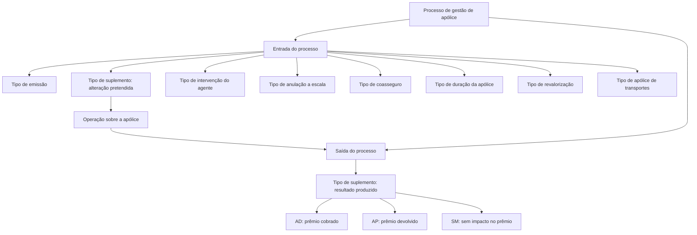
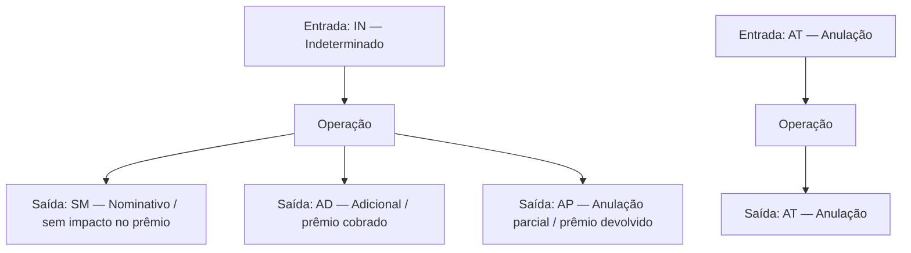

# Catálogo de Tipos de Emissão, Apólices, Coasseguro, Revalorização e Suplementos

## 1. Metadados do Documento
- **Arquivo de Origem:** `Não identificado no texto fornecido`
- **Tipo de Documento:** `Especificação Técnica`
- **Domínio / Sistema:** `Emissão e gestão de apólices de seguros; MAPFRE`
- **Público-Alvo:** `Desenvolvedores, Arquitetos, Analistas Funcionais e Operação`
- **Data/Versão Identificada:** `Não identificada`

---

## 2. Resumo Executivo & Contexto de Negócio

O documento define catálogos de tipos usados em processos de emissão e administração de apólices de seguro. Os catálogos classificam a participação de agentes, modalidades de anulação, coasseguro, duração da apólice, emissão, revalorização de capital, apólices de transportes e suplementos.

O conteúdo estabelece códigos e descrições que devem ser preservados para identificar corretamente movimentos e estados de negócio. Esses códigos abrangem desde a intenção de uma operação — por exemplo, renovação, anulação ou reabilitação — até o resultado produzido após seu processamento, como cobrança de prêmio, devolução de prêmio ou ausência de impacto no prêmio.

A especificação atribui relevância especial ao **tipo de suplemento**, pois esse elemento possui duas facetas: na entrada de um processo, indica a alteração pretendida para a apólice; na saída, representa o resultado efetivamente ocorrido. Alguns tipos são válidos nos dois sentidos, enquanto outros são exclusivos de entrada ou saída.

O documento também normaliza características estruturais de apólices, como duração, modalidade de coasseguro segundo a participação da MAPFRE, comportamento de revalorização de capital e tratamento de apólices de transportes. Não são detalhados contratos de API, métodos HTTP, modelos JSON, bancos de dados, URLs de ambiente, versões de sistemas ou fluxos técnicos de integração.

---

## 3. Arquitetura, Componentes & Tecnologias Envolvidas

O texto não descreve arquitetura de software, servidores, microsserviços, APIs ou tecnologias de implementação. O conteúdo representa um domínio funcional de seguros composto por catálogos de classificação usados em processos de apólice.

Os componentes conceituais identificados são:

- **Tipos de emissão:** classificam o movimento pretendido.
- **Tipos de suplemento:** classificam intenção e resultado de modificações em apólices.
- **Tipos de agente:** classificam a forma de intervenção de um agente em uma apólice.
- **Tipos de anulação a escala:** definem a forma de cálculo do valor em caso de anulação.
- **Tipos de coasseguro:** identificam a modalidade de coasseguro conforme a intervenção da MAPFRE.
- **Tipos de duração de apólice:** determinam a duração e possibilidade de renovação.
- **Tipos de revalorização:** definem se e como uma cobertura revaloriza.
- **Tipos de apólice de transportes:** definem a modalidade de apólice no tratamento de transportes.



> **Nota de Análise:** O documento fornece taxonomias de negócio, mas não detalha a aplicação, serviço ou processo técnico que consome esses códigos.

---

## 4. Regras de Negócio, Especificações Funcionais & Processos

### 4.1 Intervenção de agente na apólice

O tipo de agente especifica a forma pela qual um agente intervém em uma apólice. Os valores definidos são:

- `P`: produtor.
- `O`: organizador.
- `A`: assessor.
- `2`: segunda intervenção.
- `3`: terceira intervenção.
- `4`: quarta intervenção.

### 4.2 Anulação a escala

O tipo de anulação a escala determina como o valor é calculado quando ocorre anulação da apólice ou do risco:

- `1`: direto sem percentual de anulação.
- `2`: proporcional sem percentual de anulação.
- `3`: proporcional sem percentual de constituição.

### 4.3 Coasseguro

O tipo de coasseguro identifica a modalidade de coasseguro de uma apólice conforme a forma de intervenção da MAPFRE:

- `0`: isento.
- `1`: cedido.
- `2`: aceito.

### 4.4 Duração da apólice

O tipo de duração determina a duração da apólice e sua condição de renovação:

- `1`: anual prorrogável.
- `2`: temporal não renovável.
- `4`: temporal renovável por seu período.
- `5`: temporal renovável por sua temporalidade.
- `6`: temporal renovável.

### 4.5 Emissão

O tipo de emissão determina o movimento a ser realizado:

- `C`: solicitação.
- `P`: apólice.
- `S`: suplemento.
- `R`: apólice grupo.
- `Z`: substituída.
- `A`: aplicações.
- `U`: suplemento aplicação.
- `D`: declarações prévias.
- `X`: substituída renovação.

### 4.6 Revalorização de capital

O tipo de revalorização de capital determina como uma cobertura revalorizará, quando houver revalorização:

- `1`: não regulariza.
- `2`: especial.
- `3`: por risco.

Para o tipo de revalorização especial, são definidos:

- `0`: não regulariza.
- `1`: capital atual.
- `2`: capital inicial.
- `3`: IPC.
- `4`: outro índice.
- `5`: objeto.

### 4.7 Apólice de transportes

Quando o tratamento for de transportes, o tipo de apólice determina a modalidade a ser criada:

- `F`: apólice fixa.
- `C`: apólice marco com prêmio em depósito.
- `S`: apólice marco sem prêmio em depósito.

### 4.8 Tipo de suplemento

O tipo de suplemento determina tanto a modificação pretendida para uma apólice quanto o resultado produzido por essa modificação.

#### Regras de entrada e saída

1. **Na entrada de um processo**, o tipo de suplemento determina o que se pretende fazer com a apólice, por exemplo, renovar, anular ou reabilitar.
2. **Na saída de um processo**, o tipo de suplemento determina o que ocorreu com a apólice, por exemplo, devolver parte do prêmio, anular ou reabilitar.
3. Existem tipos válidos simultaneamente para entrada e saída.
4. Existem tipos válidos para entrada, mas não para saída.
5. Existem tipos que não são válidos para entrada, mas são válidos para saída.

| Tipo de validade | Válido na entrada | Válido na saída |
| :--- | :---: | :---: |
| `A` | Sim | Sim |
| `B` | Sim | Não |
| `C` | Não | Sim |

#### Exemplos de comportamento de suplemento

- Um suplemento definido na entrada como **anulação total (`AT`)** produz como saída também **anulação total (`AT`)**.
- Um suplemento definido na entrada como **indeterminado (`IN`)** pode produzir, ao final da operação, um dos seguintes resultados:
  - `SM`: não afetou o prêmio.
  - `AD`: foi cobrado prêmio.
  - `AP`: foi devolvido prêmio.



> **Nota de Análise:** O texto associa `AD`, `AP` e `SM` aos resultados do exemplo de suplemento indeterminado. A listagem posterior também atribui as descrições formais `AD = ADICIONAL`, `AP = ANULACIÓN PARCIAL` e `SM = NOMINATIVO`.

---

## 5. Tabelas de Parâmetros, Ambientes e Estruturas de Dados

### 5.1 Tipos de intervenção de agente

| Item / Parâmetro | Descrição / Função | Tipo / Valores / Formato | Ambiente / Observações |
| :--- | :--- | :--- | :--- |
| Tipo de agente | Forma de intervenção do agente na apólice | `P` | Produtor |
| Tipo de agente | Forma de intervenção do agente na apólice | `O` | Organizador |
| Tipo de agente | Forma de intervenção do agente na apólice | `A` | Assessor |
| Tipo de agente | Forma de intervenção do agente na apólice | `2` | Segunda intervenção |
| Tipo de agente | Forma de intervenção do agente na apólice | `3` | Terceira intervenção |
| Tipo de agente | Forma de intervenção do agente na apólice | `4` | Quarta intervenção |

### 5.2 Tipos de anulação a escala

| Item / Parâmetro | Descrição / Função | Tipo / Valores / Formato | Ambiente / Observações |
| :--- | :--- | :--- | :--- |
| Tipo de anulação a escala | Forma de cálculo do valor na anulação da apólice ou risco | `1` | Direto sem percentual de anulação |
| Tipo de anulação a escala | Forma de cálculo do valor na anulação da apólice ou risco | `2` | Proporcional sem percentual de anulação |
| Tipo de anulação a escala | Forma de cálculo do valor na anulação da apólice ou risco | `3` | Proporcional sem percentual de constituição |

### 5.3 Tipos de coasseguro

| Item / Parâmetro | Descrição / Função | Tipo / Valores / Formato | Ambiente / Observações |
| :--- | :--- | :--- | :--- |
| Tipo de coasseguro | Modalidade de coasseguro segundo a intervenção da MAPFRE | `0` | Isento |
| Tipo de coasseguro | Modalidade de coasseguro segundo a intervenção da MAPFRE | `1` | Cedido |
| Tipo de coasseguro | Modalidade de coasseguro segundo a intervenção da MAPFRE | `2` | Aceito |

### 5.4 Tipos de duração de apólice

| Item / Parâmetro | Descrição / Função | Tipo / Valores / Formato | Ambiente / Observações |
| :--- | :--- | :--- | :--- |
| Tipo de duração de apólice | Determina a duração da apólice | `1` | Anual prorrogável |
| Tipo de duração de apólice | Determina a duração da apólice | `2` | Temporal não renovável |
| Tipo de duração de apólice | Determina a duração da apólice | `4` | Temporal renovável por seu período |
| Tipo de duração de apólice | Determina a duração da apólice | `5` | Temporal renovável por sua temporalidade |
| Tipo de duração de apólice | Determina a duração da apólice | `6` | Temporal renovável |

### 5.5 Tipos de emissão

| Item / Parâmetro | Descrição / Função | Tipo / Valores / Formato | Ambiente / Observações |
| :--- | :--- | :--- | :--- |
| Tipo de emissão | Movimento que se pretende realizar | `C` | Solicitação |
| Tipo de emissão | Movimento que se pretende realizar | `P` | Apólice |
| Tipo de emissão | Movimento que se pretende realizar | `S` | Suplemento |
| Tipo de emissão | Movimento que se pretende realizar | `R` | Apólice grupo |
| Tipo de emissão | Movimento que se pretende realizar | `Z` | Substituída |
| Tipo de emissão | Movimento que se pretende realizar | `A` | Aplicações |
| Tipo de emissão | Movimento que se pretende realizar | `U` | Suplemento aplicação |
| Tipo de emissão | Movimento que se pretende realizar | `D` | Declarações prévias |
| Tipo de emissão | Movimento que se pretende realizar | `X` | Substituída renovação |

### 5.6 Tipos de revalorização

| Item / Parâmetro | Descrição / Função | Tipo / Valores / Formato | Ambiente / Observações |
| :--- | :--- | :--- | :--- |
| Tipo de revalorização de capital | Forma de revalorização da cobertura | `1` | Não regulariza |
| Tipo de revalorização de capital | Forma de revalorização da cobertura | `2` | Especial |
| Tipo de revalorização de capital | Forma de revalorização da cobertura | `3` | Por risco |
| Tipo de revalorização especial | Forma especial de revalorização | `0` | Não regulariza |
| Tipo de revalorização especial | Forma especial de revalorização | `1` | Capital atual |
| Tipo de revalorização especial | Forma especial de revalorização | `2` | Capital inicial |
| Tipo de revalorização especial | Forma especial de revalorização | `3` | IPC |
| Tipo de revalorização especial | Forma especial de revalorização | `4` | Outro índice |
| Tipo de revalorização especial | Forma especial de revalorização | `5` | Objeto |

### 5.7 Tipos de apólice de transportes

| Item / Parâmetro | Descrição / Função | Tipo / Valores / Formato | Ambiente / Observações |
| :--- | :--- | :--- | :--- |
| Tipo de apólice de transportes | Tipo de apólice criada no tratamento de transportes | `F` | Apólice fixa |
| Tipo de apólice de transportes | Tipo de apólice criada no tratamento de transportes | `C` | Apólice marco com prêmio em depósito |
| Tipo de apólice de transportes | Tipo de apólice criada no tratamento de transportes | `S` | Apólice marco sem prêmio em depósito |

### 5.8 Tipos de suplemento

| Item / Parâmetro | Descrição / Função | Tipo / Valores / Formato | Ambiente / Observações |
| :--- | :--- | :--- | :--- |
| Tipo de suplemento | Tipo definido | `IN` | Indeterminado |
| Tipo de suplemento | Tipo definido | `AT` | Anulação |
| Tipo de suplemento | Tipo definido | `RE` | Reabilitação |
| Tipo de suplemento | Tipo definido | `CV` | Alteração de forma de pagamento |
| Tipo de suplemento | Tipo definido | `CA` | Alteração de agente |
| Tipo de suplemento | Tipo definido | `MV` | Extensão de vigência |
| Tipo de suplemento | Tipo definido | `RF` | Renovação |
| Tipo de suplemento | Tipo definido | `RG` | Regularização |
| Tipo de suplemento | Tipo definido | `XX` | Emissão |
| Tipo de suplemento | Tipo definido | `AN` | Antecipação |
| Tipo de suplemento | Tipo definido | `CN` | Recobro de antecipação |
| Tipo de suplemento | Tipo definido | `RS` | Resgate |
| Tipo de suplemento | Tipo definido | `RD` | Redução |
| Tipo de suplemento | Tipo definido | `RR` | Reabilitação de apólice reduzida |
| Tipo de suplemento | Tipo definido | `AE` | Aportes extraordinários |
| Tipo de suplemento | Tipo definido | `AS` | Anulação de suplemento |
| Tipo de suplemento | Tipo definido | `ER` | Extinção do risco |
| Tipo de suplemento | Tipo definido | `PG` | Seguro prorrogado (vida) |
| Tipo de suplemento | Tipo definido | `DS` | Diminuição por sinistro |
| Tipo de suplemento | Tipo definido | `LT` | Liquidação de transportes |
| Tipo de suplemento | Tipo definido | `AP` | Anulação parcial |
| Tipo de suplemento | Tipo definido | `RC` | Restituição de capital |
| Tipo de suplemento | Tipo definido | `AD` | Adicional |
| Tipo de suplemento | Tipo definido | `SA` | Suplemento anualidade anterior |
| Tipo de suplemento | Tipo definido | `AA` | Anulação de suplemento anualidade anterior |
| Tipo de suplemento | Tipo definido | `AX` | Anulação de suplemento temporal |
| Tipo de suplemento | Tipo definido | `RP` | Resgate parcial |
| Tipo de suplemento | Tipo definido | `SM` | Nominativo |

---

## 6. Bateria de Perguntas & Respostas para RAG (FAQ Sintético)

### P1: Qual código indica que um agente atua como produtor na apólice?
**R:** O código `P` indica que o agente intervém como **produtor** na apólice.

### P2: Quais são os tipos de coasseguro segundo a intervenção da MAPFRE?
**R:** O documento define `0` para **isento**, `1` para **cedido** e `2` para **aceito**. Esses valores identificam como é o coasseguro de uma apólice conforme a forma de intervenção da MAPFRE.

### P3: Qual tipo de duração identifica uma apólice temporal não renovável?
**R:** O código `2` representa uma apólice **temporal não renovável**.

### P4: Como identificar uma apólice temporal renovável por seu período?
**R:** O tipo de duração `4` identifica uma apólice **temporal renovável por seu período**.

### P5: Qual é a diferença entre tipo de suplemento na entrada e na saída de um processo?
**R:** Na entrada, o tipo de suplemento informa a modificação pretendida para a apólice, como renovar, anular ou reabilitar. Na saída, informa o resultado produzido após a operação, como devolução de prêmio, anulação ou reabilitação.

### P6: O que pode ocorrer quando um suplemento entra como indeterminado (`IN`)?
**R:** Um suplemento `IN` pode resultar em `SM`, quando não afeta o prêmio; `AD`, quando é cobrado prêmio; ou `AP`, quando é devolvido prêmio. Na tabela de tipos definidos, `AD` corresponde a adicional, `AP` a anulação parcial e `SM` a nominativo.

### P7: Um suplemento de anulação total (`AT`) mantém o mesmo tipo após a operação?
**R:** Sim. O documento informa que um suplemento definido na entrada como anulação total (`AT`) também resulta em anulação total (`AT`) na saída.

### P8: Quais códigos de emissão representam solicitação, apólice e suplemento?
**R:** `C` representa solicitação, `P` representa apólice e `S` representa suplemento.

### P9: Como uma cobertura pode revalorizar quando o tipo de revalorização de capital é especial?
**R:** Para revalorização especial, o documento define: `0` não regulariza, `1` capital atual, `2` capital inicial, `3` IPC, `4` outro índice e `5` objeto.

### P10: Quais tipos de apólice podem ser criados para o tratamento de transportes?
**R:** O tratamento de transportes pode criar `F` para apólice fixa, `C` para apólice marco com prêmio em depósito e `S` para apólice marco sem prêmio em depósito.

### P11: Qual código de suplemento representa alteração de forma de pagamento?
**R:** O código `CV` representa **cambio forma pago**, isto é, alteração de forma de pagamento.

### P12: Qual tipo de suplemento corresponde à liquidação de transportes?
**R:** O código `LT` corresponde a **liquidação de transportes**.

---

## 7. Glossário de Termos, Siglas & Conceitos-Chave

- **AD:** Adicional; no exemplo de suplemento indeterminado, representa que foi cobrado prêmio.
- **AE:** Aportes extraordinários.
- **AN:** Antecipação.
- **AP:** Anulação parcial; no exemplo de suplemento indeterminado, representa devolução de prêmio.
- **AS:** Anulação de suplemento.
- **AT:** Anulação.
- **CA:** Alteração de agente.
- **CN:** Recobro de antecipação.
- **CV:** Alteração de forma de pagamento.
- **DS:** Diminuição por sinistro.
- **ER:** Extinção do risco.
- **IN:** Indeterminado.
- **IPC:** Índice citado como modalidade de revalorização especial; o documento não apresenta sua expansão.
- **LT:** Liquidação de transportes.
- **MAPFRE:** Entidade mencionada como referência para classificar a intervenção no coasseguro; o documento não fornece definição adicional.
- **MV:** Extensão de vigência.
- **PG:** Seguro prorrogado para vida.
- **RC:** Restituição de capital.
- **RD:** Redução.
- **RE:** Reabilitação.
- **RF:** Renovação.
- **RG:** Regularização.
- **RP:** Resgate parcial.
- **RR:** Reabilitação de apólice reduzida.
- **RS:** Resgate.
- **SA:** Suplemento de anualidade anterior.
- **SM:** Nominativo; no exemplo de suplemento indeterminado, representa ausência de impacto no prêmio.
- **Suplemento:** Modificação sobre uma apólice, classificada tanto pela intenção na entrada quanto pelo resultado na saída.
- **XX:** Emissão.

---

## 8. Notas Críticas, Riscos & Limitações

- O documento não identifica o arquivo de origem, versão, data, proprietário funcional ou sistema de origem dos códigos.
- Não há detalhamento de contratos de integração, APIs, métodos HTTP, formatos JSON, banco de dados, validações de campo ou tratamento de erros.
- Não são descritas regras para seleção de um tipo de suplemento específico, além dos exemplos de `AT` e `IN`.
- O documento informa que existem tipos válidos somente para entrada ou somente para saída, mas apresenta apenas a matriz genérica `A`, `B` e `C`; não mapeia cada código de suplemento a uma categoria de validade.
- O código `SM` é descrito como **nominativo** na tabela de tipos e como **não afetou o prêmio** no exemplo de saída de `IN`. O documento não explica se essas descrições representam conceitos complementares ou contextos distintos.
- A sigla `IPC` é apresentada como opção de revalorização especial, mas não é expandida nem recebe regra de cálculo.
- O documento não detalha a diferença operacional entre “temporal renovável por seu período”, “temporal renovável por sua temporalidade” e “temporal renovável”.

---

## 9. Conteúdo Bruto Estruturado (Referência Fiel)

```text
--- [PÁGINA 1 DE 7] ---

TIPOS (EMISIÓN)
FORMA EN LA QUE INTERVIENE UN AGENTE
Especifica de qué forma interviene un agente en la póliza
TIPO DESCRIPCIÓN
P PRODUCTOR
O ORGANIZADOR
A ASESOR
2 2DA INTERVENCIÓN
3 3RA INTERVENCIÓN
4 4TA INTERVENCIÓN
TIPO DE ANULACIÓN A ESCALA
Determina la forma en la que se halla el importe en caso de anulación de la póliza o riesgo
TIPO DESCRIPCIÓN
1 DIRECTO S/% ANULACION
3 PROPORCIONAL S/% CONSTITUCION
 / 
 RS
Inicio Soluciones APIs Documentación Zeus
ES


--- [PÁGINA 2 DE 7] ---

TIPO DESCRIPCIÓN
2 PROPORCIONAL S/% ANULACION
TIPO DE COASEGURO
Identifica la como es el coaseguro de una póliza según la forma en la que interviene MAPFRE
TIPO DESCRIPCIÓN
0 EXENTO
1 CEDIDO
2 ACEPTADO
TIPO DE DURACIÓN DE PÓLIZA
Determina la duración de la póliza
TIPO DESCRIPCIÓN
1 ANUAL PRORROGABLE
2 TEMPORAL NO RENOVABLE
4 TEMPORAL RENOVABLE POR SU PERIODO
5 TEMPORAL RENOVABLE POR SU TEMPORALIDAD
6 TEMPORAL RENOVABLE
TIPO DE EMISIÓN
Determina el movimiento que se pretende realizar


--- [PÁGINA 3 DE 7] ---

TIPO DESCRIPCIÓN
C SOLICITUD
P PÓLIZA
S SUPLEMENTO
R PÓLIZA GRUPO
Z REMPLAZADA
A APLICACIONES
U SUPLEMENTO APLICACIÓN
D DECLARACIONES PREVIAS
X REEMPLAZADA RENOVACIÓN
TIPO DE REVALORIZACIÓN DE CAPITAL
Determina la forma en la que la cobertura revalorizará (si revaloriza)
TIPO DESCRIPCIÓN
1 NO REGULARIZA
2 ESPECIAL
3 POR RIESGO
TIPO DE REVALORIZACIÓN ESPECIAL
TIPO DESCRIPCIÓN
0 NO REGULARIZA


--- [PÁGINA 4 DE 7] ---

TIPO DESCRIPCIÓN
1 CAPITAL ACTUAL
2 CAPITAL INICIAL
3 IPC
4 OTRO INDICE
5 OBJETO
TIPO DE PÓLIZA DE TRANSPORTES
Determina el tipo de póliza que se creará cuando el tratamiento es de transportes
TIPO DESCRIPCIÓN
F PÓLIZA FIJA
C PÓLIZA MARCO CON PRIMA EN DEPOSITO
S PÓLIZA MARCO SIN PRIMA EN DEPOSITO
TIPO DE SUPLEMENTO
Determina que modificación se pretende realizar a una póliza y también que resultado produjo esa
modificación. Es decir, tiene dos facetas:
1. En la entrada de un proceso, determina que se pretende hacer con una póliza, Por ejemplo,
renovar, anular, rehabilitar, ...
2. En la salida de un proceso, determina que ocurrió con esa póliza. Por ejemplo, se devolvió parte
de la prima, se anuló, se rehabilitó, ...
Por otro lado, existen tipos que son válidos tanto para la entrada como para la salida del proceso.
Otros tipos son válidos para la entrada, pero no para la salida del proceso. Y por último, hay tipos
que no son válidos para la entrada y si para la salida del proceso. Esto es:


--- [PÁGINA 5 DE 7] ---

TIPO VÁLIDO ENTRADA VÁLIDO SALIDA
"A" SI SI
"B" SI NO
"C" NO SI
Por ejemplo, un suplemento definido de entrada como Anulación total (AT), la salida también es
Anulación total (AT).
AT OPERACIÓN AT
En cambio, un suplemento que se define de entrada como indeterminado (IN), cuando finaliza la
operación, los cambios efectuados pueden generar salidas del tipo:
Se cobró prima (AD)
Se devolvió prima (AP)
No se afectó a la prima (SM)
IN OPERACIÓN
SM
AD
AP
A continuación se detallan los tipos definidos:
TIPO DESCRIPCIÓN
IN INDETERMINADO
AT ANULACIÓN
RE REHABILITACIÓN


--- [PÁGINA 6 DE 7] ---

TIPO DESCRIPCIÓN
CV CAMBIO FORMA PAGO
CA CAMBIO DE AGENTE
MV EXTENSIÓN VIGENCIA
RF RENOVACIÓN
RG REGULARIZACIÓN
XX EMISIÓN
AN ANTICIPO
CN RECOBRO DE ANTICIPO
RS RESCATE
RD REDUCCIÓN
RR REHABILITACIÓN PÓLIZA REDUCIDA
AE APORTACIONES EXTRAORDINARIAS
AS ANULACIÓN DE SUPLEMENTO
ER EXTINCIÓN DEL RIESGO
PG SEGURO PRORROGADO (VIDA)
DS DISMINUCIÓN POR SINIESTRO
LT LIQUIDACIÓN DE TRANSPORTES
AP ANULACIÓN PARCIAL


--- [PÁGINA 7 DE 7] ---

TIPO DESCRIPCIÓN
RC RESTITUCIÓN DE CAPITAL
AD ADICIONAL
SA SUPLEMENTO ANUALIDAD ANTERIOR
AA ANULACIÓN SUPLEMENTO ANUALIDAD ANTERIOR
AX ANULACIÓN SUPLEMENTO TEMPORAL
RP RESCATE PARCIAL
SM NOMINATIVO
```
